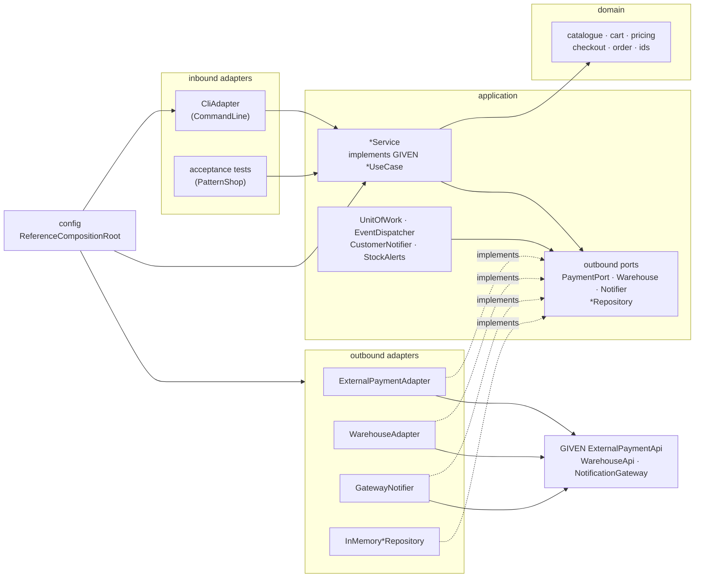
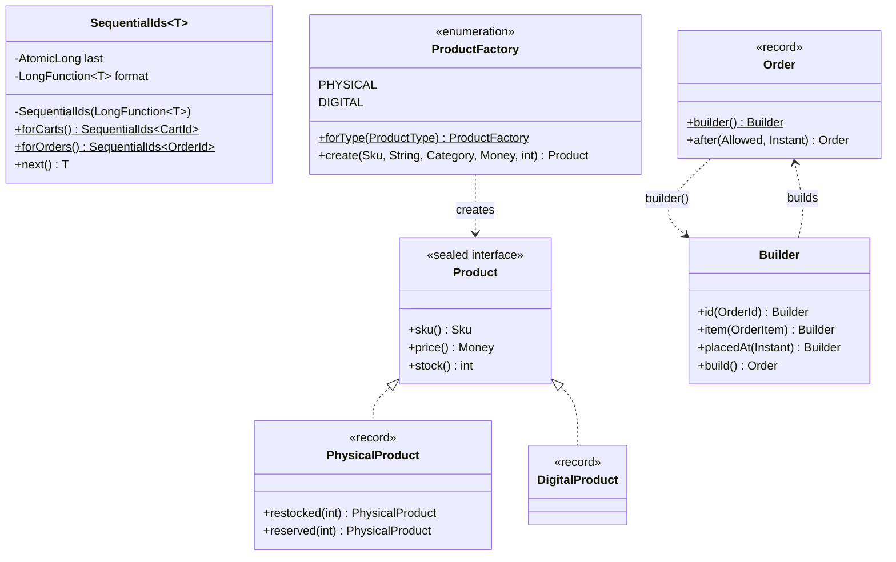
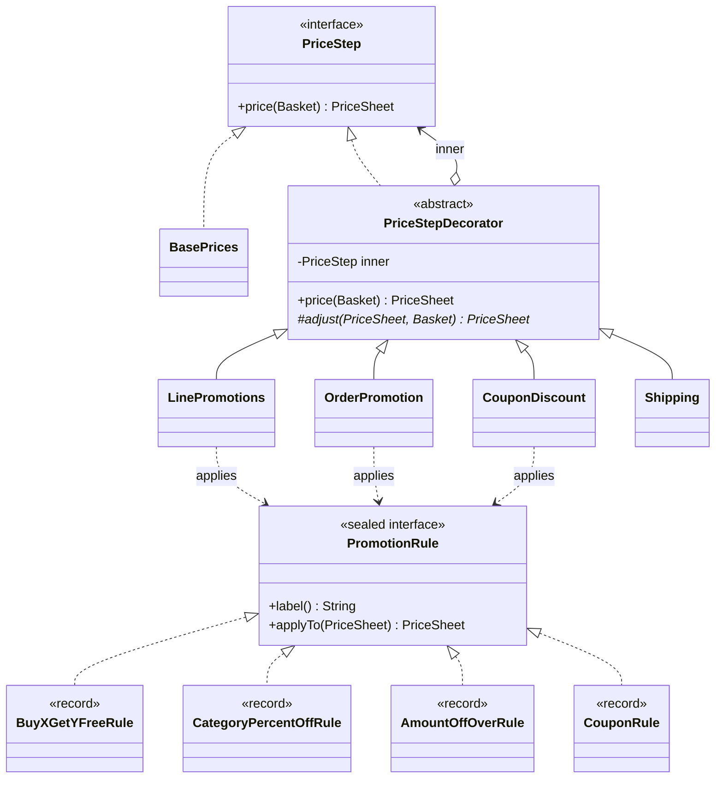
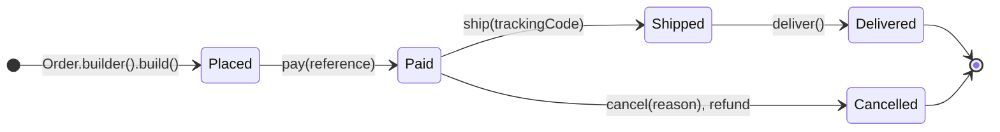
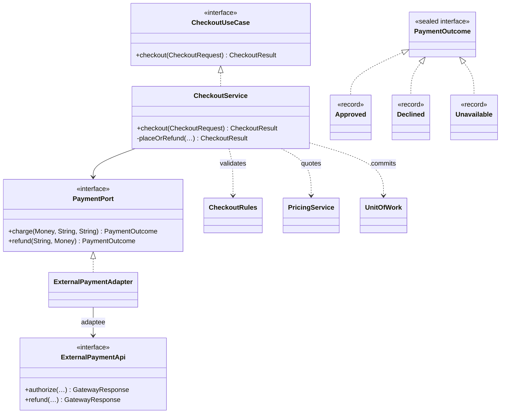
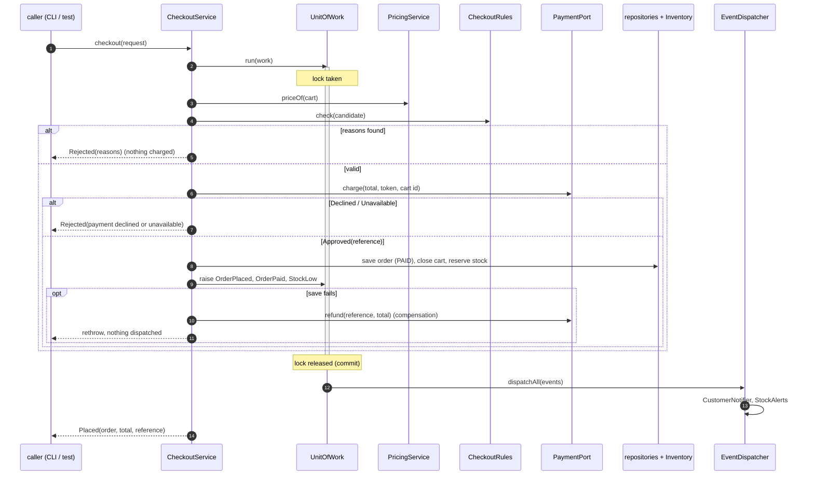
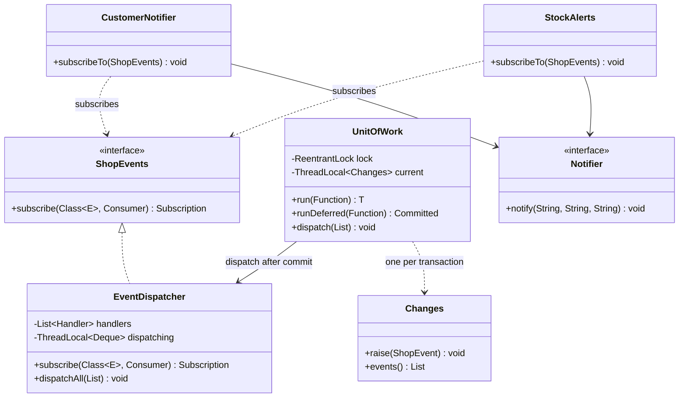
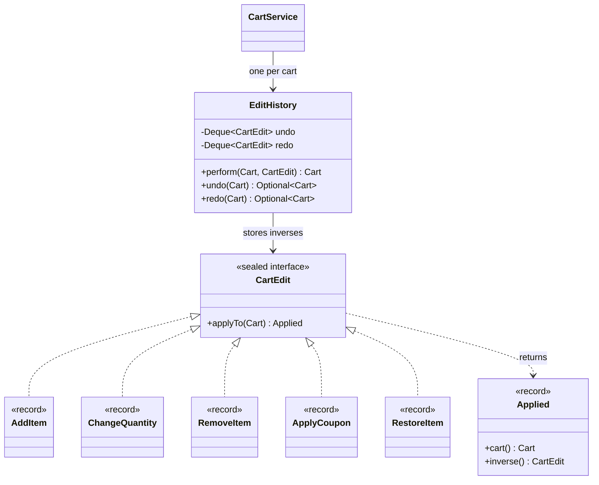
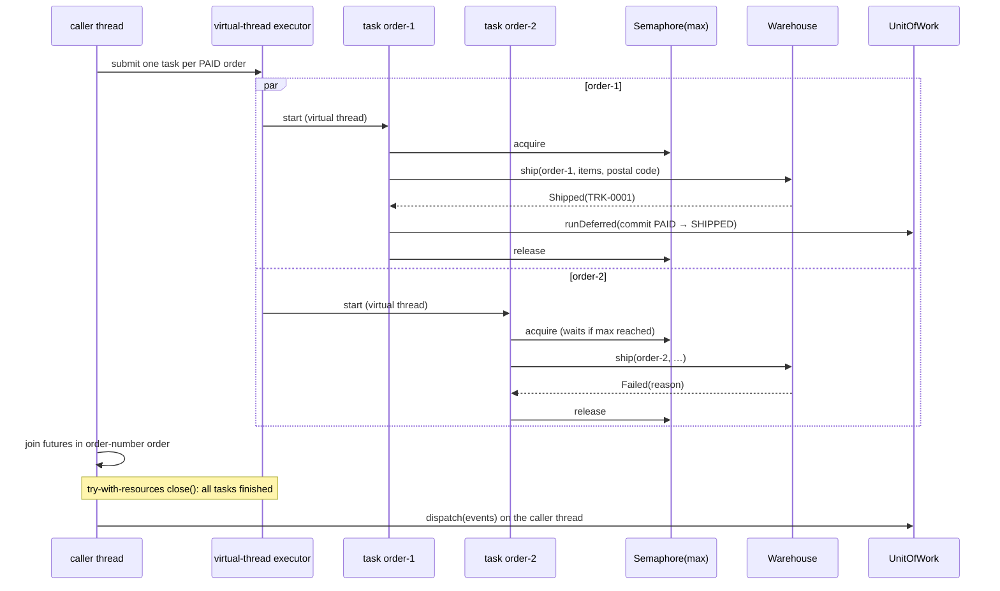
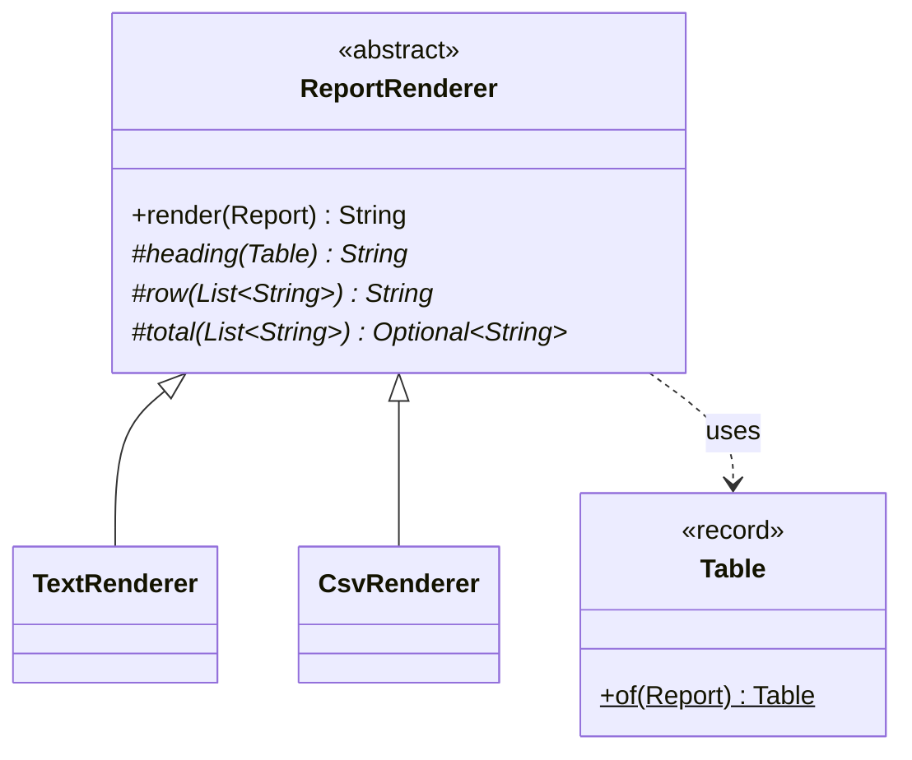

# PatternShop — Capstone Walkthrough Guide

> Course: Design Patterns in Java (Java 27), Fall 2026 · Read it after you have drafted your own `SPEC.md` (W10), and
> again before the defence (W14) · Brief: [spec.en.md](spec.en.md) · Rubric: [rubric.en.md](rubric.en.md) · Türkçe:
> [guide.tr.md](guide.tr.md) · Engineering spec: [SPEC-capstone.md](../specs/SPEC-capstone.md)

This guide explains **one** way to build PatternShop: the reference solution in
[`capstone/reference`](reference/). It shows which forces in the brief call for which pattern, how the reference
answers them in Java 27, which alternatives were rejected and why, and how each rubric criterion can be met. It is
not the only good design, and it is not a template to copy: the brief (§12) treats copying from the reference as an
integrity violation, and the defence asks about *your* code. Use the reference the way you used the module examples —
read it, run it, argue with it, then make your own decisions and write down why.

**How to read the reference.** Read it from the outside in, in the order the slices were built:

1. `config.ReferenceCompositionRoot` — the only class that knows every other class. It shows the whole object graph
   on one screen.
2. The **inbound ports** (the GIVEN `api.*UseCase` interfaces) and the application services that implement them
   (`application.*Service`).
3. The **domain** packages one by one (`domain.catalogue`, `cart`, `pricing`, `checkout`, `order`), each small and
   free of infrastructure.
4. The **outbound ports** (`application.port.out`) and their adapters (`adapter.out.*`).
5. The tests: the bindings `*ReferenceTest` (the 83 given acceptance tests), `ReferenceArchitectureTest` (the 7
   rules) and the unit tests next to each package.

Every participant type carries `@PatternRole`, so `grep -rn "@PatternRole" capstone/reference/src/main` lists the
whole pattern inventory, and every Javadoc ends with `@see "capstone guide §…"` pointing into this guide.

**Contents.** §1 Pattern map · §2 Slice walkthrough (architecture, then C3–C6) · §3 Trade-offs · §4 SDD artefacts ·
§5 Rubric mapping · §6 Testing approach · §7 Common pitfalls · §8 Optional extension: Structured Concurrency.

Build and run the reference from the repository root on JDK 27:

```bash
export JAVA_HOME=$(/usr/libexec/java_home -v 27)            # macOS; on Linux/Windows point JAVA_HOME at JDK 27

./mvnw -q -pl capstone/reference -am verify                  # 83 acceptance tests + 7 rules + 69 unit tests
./mvnw -q -pl capstone/reference -am package -DskipTests
java -cp capstone/starter/target/classes:capstone/reference/target/classes \
     io.github.aliturgutbozkurt.patterns.capstone.reference.config.Main --demo
```

## Pattern map

### Counted patterns

The reference declares **13 counted patterns** (3 creational, 3 structural, 6 behavioural, 1 concurrency) plus
Immutable Object, which the brief does not count as the concurrency pattern. Paths are relative to
`reference/src/main/java/…/capstone/reference/`; the links open the source.

| # | Pattern (category) | Force in PatternShop | Participants (`@PatternRole` role) | Module |
|--|:-----------|:------------------------------|:------------------------------|--|
| 1 | Static Factory Method (creational) | Carts and orders need ids from two independent sequences; the id format must stay in one place, and an order number may only be consumed by a placed order | [`SequentialIds`](reference/src/main/java/io/github/aliturgutbozkurt/patterns/capstone/reference/domain/ids/SequentialIds.java) (`forCarts()`, `forOrders()`) | m02 |
| 2 | Factory Method (creational) | A `ProductSpec` names a `ProductType`; physical and digital products validate stock differently, and callers must not branch on the type | [`ProductFactory`](reference/src/main/java/io/github/aliturgutbozkurt/patterns/capstone/reference/domain/catalogue/ProductFactory.java) (creator, one constant per type) → `PhysicalProduct`, `DigitalProduct` | m02 |
| 3 | Builder (creational) | An order has many parts, several computed during checkout; a half-built order must never exist | [`Order.Builder`](reference/src/main/java/io/github/aliturgutbozkurt/patterns/capstone/reference/domain/order/Order.java) (builder), `Order` (product) | m03 |
| 4 | Adapter (structural) | The payment provider speaks strings, status codes and its own merchant id; the core speaks `Money` and sealed outcomes | [`PaymentPort`](reference/src/main/java/io/github/aliturgutbozkurt/patterns/capstone/reference/application/port/out/PaymentPort.java) (target), [`ExternalPaymentAdapter`](reference/src/main/java/io/github/aliturgutbozkurt/patterns/capstone/reference/adapter/out/payment/ExternalPaymentAdapter.java) (adapter), GIVEN `ExternalPaymentApi` (adaptee) | m04 |
| 5 | Decorator (structural) | Pricing has seven steps in a fixed order; each step needs the result of the inner ones; tests want each step alone | [`PriceStep`](reference/src/main/java/io/github/aliturgutbozkurt/patterns/capstone/reference/domain/pricing/PriceStep.java) (component), `BasePrices` (concrete component), [`PriceStepDecorator`](reference/src/main/java/io/github/aliturgutbozkurt/patterns/capstone/reference/domain/pricing/PriceStepDecorator.java) (decorator), `LinePromotions`, `OrderPromotion`, `CouponDiscount`, `Shipping` | m04 |
| 6 | Facade (structural) | Checkout touches validation, pricing, payment, stock, orders, carts and events; the CLI and the tests want one call | [`CheckoutService`](reference/src/main/java/io/github/aliturgutbozkurt/patterns/capstone/reference/application/CheckoutService.java) (facade with compensation) | m05 |
| 7 | Strategy (behavioural) | Four promotion kinds are priced the same way; new kinds must not change the pipeline | [`PromotionRule`](reference/src/main/java/io/github/aliturgutbozkurt/patterns/capstone/reference/domain/pricing/PromotionRule.java) (strategy), `BuyXGetYFreeRule`, `CategoryPercentOffRule`, `AmountOffOverRule`, `CouponRule` | m06 |
| 8 | Chain of Responsibility (behavioural) | Six validation rules in a fixed order: one fails fast (`empty cart`), the others collect every reason | [`CheckoutRule`](reference/src/main/java/io/github/aliturgutbozkurt/patterns/capstone/reference/domain/checkout/CheckoutRule.java) (handler), [`CheckoutRules`](reference/src/main/java/io/github/aliturgutbozkurt/patterns/capstone/reference/domain/checkout/CheckoutRules.java) (concrete handlers, chain) | m07 |
| 9 | State (behavioural) | Five statuses, four allowed transitions, and data (payment reference, tracking code) that exists only in some states | [`OrderState`](reference/src/main/java/io/github/aliturgutbozkurt/patterns/capstone/reference/domain/order/OrderState.java) (sealed states), [`OrderLifecycle`](reference/src/main/java/io/github/aliturgutbozkurt/patterns/capstone/reference/domain/order/OrderLifecycle.java) (transitions), `Order` (context) | m08 |
| 10 | Command (behavioural) | Every cart edit must be undoable and redoable, 20 deep, restoring line positions; the CLI has 20 commands | [`CartEdit`](reference/src/main/java/io/github/aliturgutbozkurt/patterns/capstone/reference/domain/cart/CartEdit.java) (command), [`EditHistory`](reference/src/main/java/io/github/aliturgutbozkurt/patterns/capstone/reference/domain/cart/EditHistory.java) (invoker), `CartService` (client); [`CliAdapter`](reference/src/main/java/io/github/aliturgutbozkurt/patterns/capstone/reference/adapter/in/cli/CliAdapter.java) (invoker), `CliCommand` (command) | m06 |
| 11 | Observer (behavioural) | Customer notifications and stock alerts react to orders, but checkout must not know who listens | [`EventDispatcher`](reference/src/main/java/io/github/aliturgutbozkurt/patterns/capstone/reference/application/events/EventDispatcher.java) (subject), [`CustomerNotifier`](reference/src/main/java/io/github/aliturgutbozkurt/patterns/capstone/reference/application/notify/CustomerNotifier.java), `StockAlerts` (observers) | m07 |
| 12 | Template Method (behavioural) | Four reports in two formats share one layout: heading, rows, total | [`ReportRenderer`](reference/src/main/java/io/github/aliturgutbozkurt/patterns/capstone/reference/application/render/ReportRenderer.java) (abstract class), `TextRenderer`, `CsvRenderer` (concrete classes) | m06 |
| 13 | Thread-per-task (concurrency) | Fulfilment makes blocking warehouse calls per order; orders are independent but at most `maxParallelOrders` may run at once | [`FulfilmentService`](reference/src/main/java/io/github/aliturgutbozkurt/patterns/capstone/reference/application/FulfilmentService.java) (virtual thread per order, `Semaphore`) | m10 |
| — | Immutable Object (not counted as concurrency) | Products, carts and orders are read by worker threads and observers while other threads change them | [`Product`](reference/src/main/java/io/github/aliturgutbozkurt/patterns/capstone/reference/domain/catalogue/Product.java) (sealed records), `Cart`, `Order` records | m09 |

### Alternatives, modern Java form and tests

The rubric's justification table (rubric §5) puts these in the same row as the force; here they follow as a list so
that the long test names stay readable. Your own table needs all of it, one row per pattern.

1. **Static Factory Method.** *Rejected:* `new CartId("cart-" + n)` at the call site — the format leaks into two
   services, and a public constructor cannot say *which* sequence. *Modern form:* private constructor,
   `LongFunction<T>`, `AtomicLong`. *Tests:* `SequentialIdsTest` → `namedFactoriesStartEachSequenceAtOne`,
   `concurrentCallersNeverGetTheSameId`.
2. **Factory Method.** *Rejected:* `if (type == DIGITAL)` in `CatalogueService` — every new product type changes the
   service. *Modern form:* `enum` constants holding a constructor reference; exhaustive `switch` in `forType`.
   *Tests:* `ProductFactoryTest` → `eachProductTypeHasItsOwnFactory`, `digitalFactoryRejectsStock`.
3. **Builder.** *Rejected:* an 8-argument constructor call in checkout — unreadable, and the `PLACED` state and the
   first history entry would be repeated by every caller. *Modern form:* static nested builder; `build()` creates the
   record, whose compact constructor validates. *Tests:* `OrderBuilderTest` → `refusesHalfBuiltOrders`.
4. **Adapter.** *Rejected:* calling `ExternalPaymentApi` from `CheckoutService` — status codes and amount strings in
   the core, and ArchUnit rule 2 forbids it. *Modern form:* sealed `PaymentOutcome` of records; `switch` on the
   status. *Tests:* `ExternalPaymentAdapterTest` → `translatesStatusCodesIntoOutcomes`; `CheckoutAcceptance` →
   `chargesTheQuotedTotalExactlyOnceInProviderFormat`.
5. **Decorator.** *Rejected:* one `price()` method with seven blocks, or `Function.andThen` (see §3). *Modern form:*
   abstract decorator with a `final` template, records for the price sheet. *Tests:* `PricingPipelineTest` →
   `eachDecoratorAddsExactlyItsStep`, `decoratorsCanBeLeftOutOrReordered`.
6. **Facade.** *Rejected:* letting the CLI call six services in order — the order of the steps and the
   refund-on-failure would live in an adapter. *Modern form:* sealed results, `switch` over `PaymentOutcome`.
   *Tests:* `CheckoutServiceTest` → `failedCommitAfterTheChargeIsCompensatedByARefund`.
7. **Strategy.** *Rejected:* a `switch` over `PromotionSpec` inside the pipeline — every new kind changes the
   pipeline; lambdas — the rules carry data and a label. *Modern form:* sealed interface of records. *Tests:*
   `PromotionRuleTest` → `buyXGetYCountsWholeGroupsOnly`; `PricingAcceptance` → `workedExampleFromTheBrief`.
8. **Chain of Responsibility.** *Rejected:* one `validate()` with `if` blocks — the fail-fast/collect-all mix and the
   rule order are buried in control flow. *Modern form:* `@FunctionalInterface` with `and` / `andThen` default
   methods; the rules are lambdas. *Tests:* `CheckoutRulesTest` → `andCollectsWhileAndThenStopsAtTheFirstFailure`;
   `CheckoutAcceptance` → `collectsAllValidationErrorsInRuleOrder`.
9. **State.** *Rejected:* `enum OrderStatus` plus nullable fields (see §3). *Modern form:* sealed interface of
   records, exhaustive `switch` with record patterns and guards. *Tests:* `OrderLifecycleTest` →
   `forbiddenTransitionsAreRefusedWithTheCurrentStatus`.
10. **Command.** *Rejected:* Memento snapshots of the cart (see §3). *Modern form:* sealed records whose `applyTo`
    returns the inverse; CLI commands are lambdas in a `Map`. *Tests:* `CartEditTest` →
    `everyEditReturnsAnInverseThatRestoresTheCartExactly`; `UndoAcceptance` → `undoRestoresRemovedLineAtItsPosition`.
11. **Observer.** *Rejected:* calling the notifier from checkout — checkout would depend on every reaction, and a
    failing e-mail could fail a paid order. *Modern form:* typed `subscribe(Class<E>, Consumer<? super E>)`,
    `CopyOnWriteArrayList`. *Tests:* `EventDispatcherTest` → `failingHandlerIsReportedAndTheOthersStillRun`;
    `EventsAcceptance` → `subscribersSeeCommittedState`.
12. **Template Method.** *Rejected:* two independent renderers — the line order and the trailing newline would be
    duplicated; Strategy — the *skeleton* is shared, not one algorithm. *Modern form:* `final` template method,
    `Optional` for the optional total. *Tests:* `ReportRendererTest` → `theTemplateFixesTheOrderOfTheParts`.
13. **Thread-per-task.** *Rejected:* a fixed pool of 4 platform threads, or Producer–Consumer (see §3). *Modern
    form:* `Executors.newVirtualThreadPerTaskExecutor()` in try-with-resources, `Semaphore`. *Tests:*
    `FulfilmentAcceptance` → `neverExceedsMaxParallelOrders`; `FulfilmentServiceTest` →
    `runsOrdersInParallelOnVirtualThreadsButNeverAboveTheLimit`.

### Architectural patterns

Required by the architecture, so they do **not** count towards the ten — but they are what makes the counted patterns
fit together:

| Pattern | Where | Module |
|---|---|---|
| Dependency Injection (composition root) | [`ReferenceCompositionRoot`](reference/src/main/java/io/github/aliturgutbozkurt/patterns/capstone/reference/config/ReferenceCompositionRoot.java): one object graph per shop, constructor injection only, no static state | m03, m11 |
| Repository | `application.port.out.{Product,Cart,Order,Promotion}Repository` (ports) and `adapter.out.memory.InMemory*Repository` (thread-safe, immutable values) | m11 |
| Specification | [`Specification`](reference/src/main/java/io/github/aliturgutbozkurt/patterns/capstone/reference/domain/catalogue/Specification.java) and `ProductSpecs` (catalogue search) | m11 |
| Ports & Adapters | inbound: the GIVEN `*UseCase` interfaces, `CliAdapter`; outbound: `PaymentPort`, `Warehouse`, `Notifier`, repositories | m11 |
| Domain events | [`UnitOfWork`](reference/src/main/java/io/github/aliturgutbozkurt/patterns/capstone/reference/application/events/UnitOfWork.java) (commit, then dispatch), `Changes`, `EventDispatcher` | m11 |

### Patterns deliberately not used

The rubric's Excellent level in C2 asks for at least one pattern you rejected with a reason. The reference rejects:

| Pattern | Where it was tempting | Why it was not used |
|---|---|---|
| Singleton | the event dispatcher, the id sequences, the repositories | One shop per `create(env)` call: the acceptance kit builds a fresh shop per test, and a static instance would leak carts and ids between tests. ArchUnit rule 7 forbids non-final static fields anyway. The composition root gives "one per shop" without global state. |
| Visitor | reports over the sealed `Report` / `ReportRequest` types | The hierarchies are sealed and the operations live in one place, so an exhaustive `switch` with record patterns gives the same compiler-checked completeness with no `accept` methods (m08 "Visitor vs. pattern matching"). |
| Memento | undo of cart edits | See §3: inverse commands restore line positions with less memory and make redo free. |
| Abstract Factory | creating the adapters | There is exactly one family per run (simulated or test fakes), chosen by the caller of `create(env)`; the composition root *is* the factory. |
| Proxy | payment retries, logging | No requirement asks for it; E8 (payment resilience) is where a retrying Decorator or Proxy would earn its place. |

## Slice walkthrough

### The hexagon at a glance

PatternShop is a hexagon (m11): the domain in the middle, application services around it, adapters outside, and one
composition root that wires them. The arrows are compile-time dependencies; they always point inwards.



| Package (`…capstone.reference.`) | Contains | May depend on |
|---|---|---|
| `domain..` | values, aggregates, rules: no I/O, no clock, no threads | JDK, itself, GIVEN `api.model`, `api.event`, `api.pattern` |
| `application..` | one service per GIVEN use case, ports, events, rendering | domain, GIVEN API (not `api.external`, not `api.sim`) |
| `adapter.in.cli` | the CLI | GIVEN use cases |
| `adapter.out.*` | payment, warehouse, notification, memory | application ports, domain, `api.external` |
| `config` | composition root, `Main` | everything; nothing depends on it |

The composition root builds the graph once per shop. Observers are subscribed here, so the services never know who
listens:

```java
// file: reference/config/ReferenceCompositionRoot.java
    @Override
    public PatternShop create(ShopEnvironment env) {
        Objects.requireNonNull(env, "env");
        var dispatcher = new EventDispatcher(env.errors());
        var infra = new Infrastructure(new InMemoryProductRepository(), new InMemoryCartRepository(),
                new InMemoryOrderRepository(), new InMemoryPromotionRepository(),
                new ExternalPaymentAdapter(env.payments(), env.settings().merchantId()), dispatcher,
                new UnitOfWork(dispatcher));
        var notifier = new GatewayNotifier(env.notifications());
        new CustomerNotifier(infra.orders(), notifier).subscribeTo(dispatcher);
        new StockAlerts(notifier).subscribeTo(dispatcher);
        return services(env, infra);
    }
```

**A session with the real reference.** `Main --demo` seeds `DemoData` and runs the simulated payment provider and
warehouse. These commands went to standard input:

```text
product list TOYS
cart open alice
cart add cart-1 BOK-001 2
cart add cart-1 BOK-002 1
cart add cart-1 TOY-001 3
cart add cart-1 HOM-001 1
cart undo cart-1
cart add cart-1 DIG-001 1
cart coupon cart-1 AUTUMN5
quote cart-1
checkout cart-1 tok_declined Alice Doe;Bagdat Cd. 1;Istanbul;34710
checkout cart-1 tok_visa_ok Alice Doe;Bagdat Cd. 1;Istanbul;34710
order show order-1
fulfil
order deliver order-1
order cancel order-1 changed my mind
report sales 2026-10-07 2026-10-08
report top 3 --csv
report inventory
cart fly cart-1
cart add cart-1 BOK-1 2
```

and this is the complete standard output (run on 2026-10-07; `Main` uses the system clock, so the dates in the sales
report are the day of the run):

```text
TOY-001 | Pattern Puzzle | TOYS | PHYSICAL | 120.00 | 6
CART cart-1
cart-1 alice open | BOK-001 x2
cart-1 alice open | BOK-001 x2, BOK-002 x1
cart-1 alice open | BOK-001 x2, BOK-002 x1, TOY-001 x3
cart-1 alice open | BOK-001 x2, BOK-002 x1, TOY-001 x3, HOM-001 x1
cart-1 alice open | BOK-001 x2, BOK-002 x1, TOY-001 x3
cart-1 alice open | BOK-001 x2, BOK-002 x1, TOY-001 x3, DIG-001 x1
cart-1 alice open | BOK-001 x2, BOK-002 x1, TOY-001 x3, DIG-001 x1 | coupon AUTUMN5
subtotal 1359.90
- buy 2 get 1 free: TOY-001 120.00
- 10% off BOOKS 99.99
- 100.00 off over 1000.00 100.00
- coupon AUTUMN5 5% 52.00
shipping 0.00
total 987.91
REJECTED payment declined
NOTIFY alice | Order order-1 confirmed | Thank you! We received 987.91 for order-1.
NOTIFY ops | Stock low: TOY-001 | TOY-001 has 3 left.
PLACED order-1 987.91 txn-1
order-1 alice PAID 987.91 | BOK-001 x2, BOK-002 x1, TOY-001 x3, DIG-001 x1
NOTIFY alice | Order order-1 shipped | Your order is on its way. Tracking code: TRK-0001.
SHIPPED order-1 TRK-0001
DELIVERED order-1
REFUSED cannot cancel DELIVERED order
Daily sales 2026-10-07 .. 2026-10-08
2026-10-07 | 1 | 987.91
2026-10-08 | 0 | 0.00
Total | 1 | 987.91
rank,sku,name,units,revenue
1,TOY-001,Pattern Puzzle,3,360.00
2,BOK-001,Design Patterns Handbook,2,500.00
3,BOK-002,Java 27 in Action,1,400.00
Inventory
BOK-001 | Design Patterns Handbook | 18 | no
BOK-002 | Java 27 in Action | 7 | no
ELE-001 | USB-C Hub | 10 | no
HOM-001 | Hexagon Mug | 50 | no
TOY-001 | Pattern Puzzle | 3 | yes
ERROR unknown command: cart fly
USAGE cart add <cart> <sku> <qty>
```

Almost every pattern of §1 is visible in it: the undo removed `HOM-001` (Command), the quote shows the five pricing
stages in order (Decorator over Strategy), the declined card produced a business result, not an exception
(Adapter + Facade), and the two `NOTIFY` lines are printed *before* `PLACED` — the observers ran after the order was
committed but before `checkout` returned (domain events after commit). The fulfilment ran on a virtual thread, the
reports went through one template, and the last two lines are the CLI's command table rejecting bad input. The same
scenario, with a fixed test clock, is the acceptance resource
[`cli-session.txt`](starter/src/test/resources/acceptance/cli-session.txt) that `CliAcceptance` compares verbatim.

### C3 — Catalogue, cart and order assembly

Slice C3 made the Catalogue and Cart suites green. It holds the three creational patterns and the values everything
else is built from.



#### Static Factory Method: `SequentialIds`

**Problem.** Ids are `cart-1`, `cart-2`, … and `order-1`, … per shop instance, from two independent counters; an
order number is consumed only when an order is really placed (`CheckoutAcceptance.orderIdsAreConsumedOnlyByPlacedOrders`).
**Pattern.** A private constructor and two *named* static factories: the name says which sequence you get, the
lambda hides the format.

```java
// file: reference/domain/ids/SequentialIds.java
@PatternRole(value = DesignPattern.STATIC_FACTORY_METHOD, role = "named constructors forCarts() and forOrders()")
public final class SequentialIds<T> {

    private final AtomicLong last = new AtomicLong();
    private final LongFunction<T> format;

    private SequentialIds(LongFunction<T> format) {
        this.format = format;
    }

    /** {@code cart-1}, {@code cart-2}, … */
    public static SequentialIds<CartId> forCarts() {
        return new SequentialIds<>(n -> new CartId("cart-" + n));
    }

    /** {@code order-1}, {@code order-2}, … — take one only when an order is really placed. */
    public static SequentialIds<OrderId> forOrders() {
        return new SequentialIds<>(OrderId::of);
    }
```

**Alternatives.** A public constructor taking a prefix would let any caller invent a third format; a static counter
(Singleton-like) would share ids between two shops in one JVM, which the acceptance kit does in every test class.
**Module:** m02 `staticfactory`.

#### Factory Method: `ProductFactory`

**Problem.** `CatalogueService.add` receives a `ProductSpec` with a `ProductType`. A digital product has unlimited
stock and must reject a non-zero initial stock; a physical one validates its stock as ≥ 0.
**Pattern.** The *creator* is an `enum`: each constant carries its own factory method as a constructor or method
reference, so a new product type is a new constant, not a new `if`.

```java
// file: reference/domain/catalogue/ProductFactory.java
public enum ProductFactory {
    PHYSICAL(PhysicalProduct::new),
    DIGITAL(ProductFactory::digital);
// ...
    /** The factory for {@code type}. */
    public static ProductFactory forType(ProductType type) {
        return switch (type) {
            case PHYSICAL -> PHYSICAL;
            case DIGITAL -> DIGITAL;
        };
    }

    /** A new product; invalid data is rejected with {@link IllegalArgumentException}. */
    public Product create(Sku sku, String name, Category category, Money price, int initialStock) {
        return creation.create(sku, name, category, price, initialStock);
    }
```

**Alternatives.** The classic form (an abstract `ProductCreator` with one subclass per type) needs two more classes
for the same effect. A `switch` inside the service would be honest for two types, but then the creation rule
(digital ⇒ no stock) lives in the service instead of next to the product. **Module:** m02
`factorymethod.export.modern`.

#### Builder: `Order.Builder`

**Problem.** An order is assembled during checkout from the id, the customer, one item per priced line, the total,
the address and the clock's instant — and it must start in `PLACED` with one history entry. A half-built order must
never be visible.
**Pattern.** A static nested builder collects the parts; `build()` creates the record once and lets its compact
constructor validate everything.

```java
// file: reference/domain/order/Order.java
    /** A builder for a new order in state {@code PLACED}. */
    public static Builder builder() {
        return new Builder();
    }
// ...
        /** The order in state {@code PLACED}; a missing part throws {@link NullPointerException} naming it. */
        public Order build() {
            Objects.requireNonNull(placedAt, "placedAt");
            return new Order(id, customer, items, total, shippingAddress, placedAt, new OrderState.Placed(),
                    List.of(new HistoryEntry(OrderStatus.PLACED, placedAt, "")));
        }
```

`CheckoutService.place` (in §2 C5) uses it with one `item(…)` call per line. Note that the builder takes the
clock's *instant*, not the `Clock`: the domain never reads the time itself.
**Alternatives.** A "wither" chain on the record would create seven intermediate orders, each of which would have to
be valid. A telescoping constructor hides which argument is which. **Module:** m03 `builder`.

#### Immutable Object, Repository and Specification

`Product`, `Cart` and `Order` are records: every change returns a new value (`PhysicalProduct.reserved`,
`Cart.withAdded`, `Order.after`). That is what makes the in-memory repositories simple — a `ConcurrentSkipListMap`
keyed by SKU can hand out its values without copying, because nobody can change them — and it is what lets the
fulfilment threads and the observers read orders without locks. Catalogue search combines three Specifications:

```java
// file: reference/application/CatalogueService.java
    @Override
    public List<ProductView> search(ProductQuery query) {
        return products.findMatching(ProductSpecs.inAnyCategory(query.categories())
                        .and(ProductSpecs.priceAtMost(new Money(query.maxPriceKurus())))
                        .and(ProductSpecs.nameContains(query.nameContains())))
                .stream().map(Views::of).toList();
    }
```

The repository returns the matches sorted by SKU because the map is sorted, so the "sorted by SKU" rule of the brief
is a property of the adapter, tested once in `InMemoryRepositoriesTest`. **Modules:** m09 `immutability`, m11
`repository.catalog`.

### C4 — Pricing, lifecycle and validation

Slice C4 made the Pricing suite green and built the order lifecycle and the validation chain, tested by unit tests
until checkout existed.

#### Strategy and Decorator: the pricing pipeline

**Problem.** The brief fixes the order: base prices → buy-X-get-Y → category percentage → amount off over a
threshold → coupon → shipping, each step working on what the previous ones left. Promotions are *data* registered at
run time (`DemoData` adds four), and new kinds will come (E3).
**Pattern.** Two patterns, each answering one force. **Strategy** answers "how does a kind of promotion compute its
discount?": every kind is a record implementing the sealed `PromotionRule`. **Decorator** answers "in which order,
and on top of what?": every stage wraps the inner stage, lets it price first, then adjusts the result.



The decorator base class fixes "inner first, then adjust" once, in a `final` method; the pipeline is the wrapping
order:

```java
// file: reference/domain/pricing/PriceStepDecorator.java
public abstract class PriceStepDecorator implements PriceStep {

    private final PriceStep inner;

    protected PriceStepDecorator(PriceStep inner) {
        this.inner = Objects.requireNonNull(inner, "inner");
    }

    @Override
    public final PriceSheet price(Basket basket) {
        return adjust(inner.price(basket), basket);
    }
```

```java
// file: reference/domain/pricing/PricingPipeline.java
    public static PriceStep standard(List<PromotionRule> rules) {
        return new Shipping(new CouponDiscount(new OrderPromotion(new LinePromotions(new BasePrices(), rules), rules),
                rules));
    }
```

A concrete strategy is a record with its data and its algorithm; the "capped at what is left" rule of the brief is
the `min(line.left())`:

```java
// file: reference/domain/pricing/CategoryPercentOffRule.java
    @Override
    public PriceSheet applyTo(PriceSheet sheet) {
        Money total = Money.ZERO;
        List<PricedLine> lines = new ArrayList<>();
        for (PricedLine line : sheet.lines()) {
            if (line.item().category() == category) {
                Money discount = line.afterFreeUnits().percent(percent).min(line.left());
                total = total.plus(discount);
                lines.add(line.less(discount));
            } else {
                lines.add(line);
            }
        }
        return sheet.withLines(lines).plus(new Discount(label(), total));
    }
```

The GIVEN `PromotionSpec` (what the caller registers) is mapped to a rule (what the domain executes) by one
exhaustive `switch` with record patterns in `PricingService.toRule` — a sealed type on each side of the boundary.
**Alternatives.** See §3 for Decorator vs. function composition. **Modules:** m06 `strategy.shipping.modern`, m04
`decorator.coffee.modern`, m09 `composition.pricing`.

#### State: `OrderState` and `OrderLifecycle`

**Problem.** Five statuses, four allowed transitions, a precise refusal message for every forbidden one
(`cannot cancel SHIPPED order`), and data that only exists in some states: a placed order has no payment reference,
only shipped and delivered orders have a tracking code.



**Pattern.** The data-oriented form of State from m08/m09: each state is a record holding only its own data, and
each event is one exhaustive `switch` over the sealed states. The order (the context) changes state only by applying
an `Allowed` transition.

```java
// file: reference/domain/order/OrderLifecycle.java
    /** {@code PAID → SHIPPED}. */
    public static Transition ship(OrderState from, String trackingCode) {
        return switch (from) {
            case Paid(var reference) -> new Allowed(new Shipped(reference, trackingCode), trackingCode);
            case Placed _, Shipped _, Delivered _, Cancelled _ -> refuse("ship", from);
        };
    }
// ...
    /** {@code PAID → CANCELLED}; a blank reason is refused with {@code missing reason}. */
    public static Transition cancel(OrderState from, String reason) {
        return switch (from) {
            case Paid _ when reason.isBlank() -> new Refused("missing reason");
            case Paid(var reference) -> new Allowed(new Cancelled(reference, reason), reason);
            case Placed _, Shipped _, Delivered _, Cancelled _ -> refuse("cancel", from);
        };
    }
```

Every forbidden case is listed — no `default` — so a sixth state (E9 returns: `RETURN_REQUESTED`) makes every switch
fail to compile until it is handled. **Alternatives.** See §3 (sealed records vs. enum vs. classic State objects).
**Modules:** m08 `state.order.sealed`, m09 `dop.order.modern`.

#### Chain of Responsibility: `CheckoutRules`

**Problem.** `empty cart` alone stops validation; otherwise all reasons are collected in a fixed order:
`missing address` → `quantity limit exceeded` → `insufficient stock` → `expired coupon` → `missing card token`.
**Pattern.** Each link is a `CheckoutRule` (a functional interface returning its reasons). Two default methods
combine links: `and` runs both and concatenates (collect-all), `andThen` runs the next link only if this one passed
(fail-fast). The chain reads exactly like the rule in the brief:

```java
// file: reference/domain/checkout/CheckoutRules.java
    public static CheckoutRule standard() {
        return nonEmptyCart().andThen(addressForPhysicalItems()
                .and(quantityLimit())
                .and(stockAvailable())
                .and(couponNotExpired())
                .and(cardTokenPresent()));
    }
```

```java
// file: reference/domain/checkout/CheckoutRule.java
    /** Collect all: both links run, their reasons are concatenated. */
    default CheckoutRule and(CheckoutRule next) {
        Objects.requireNonNull(next, "next");
        return candidate -> {
            List<String> reasons = new ArrayList<>(check(candidate));
            reasons.addAll(next.check(candidate));
            return List.copyOf(reasons);
        };
    }

    /** Fail fast: {@code next} runs only when this link found nothing. */
    default CheckoutRule andThen(CheckoutRule next) {
        Objects.requireNonNull(next, "next");
        return candidate -> {
            List<String> reasons = check(candidate);
            return reasons.isEmpty() ? next.check(candidate) : reasons;
        };
    }
```

The rules check a `CheckoutCandidate` value (lines with their stock, address, coupon state, card token) built by the
application layer, so the domain never touches a repository. **Alternatives.** A classic linked chain of handler
objects with `setNext` works but makes the collect-all/fail-fast mix awkward; a list of rules in a loop loses the
fail-fast first link. **Module:** m07 `chain.validation`.

### C5 — Payment, checkout, events and undo

Slice C5 made Checkout, Undo (and with C6, Lifecycle and Events) green. It is where the patterns start to *cooperate*.



#### Adapter: `ExternalPaymentAdapter`

**Problem.** The GIVEN payment API wants a merchant id, the amount as text (`"987.91"`), the currency `"TRY"` and an
idempotency key, and answers with HTTP-like status codes. The core wants `charge(Money, …)` and a business outcome.
**Pattern.** An object adapter: `PaymentPort` is the target, owned by the application; the adapter holds the adaptee
and translates both ways.

```java
// file: reference/adapter/out/payment/ExternalPaymentAdapter.java
    @Override
    public PaymentOutcome charge(Money amount, String cardToken, String attempt) {
        return outcome(api.authorize(merchantId, cardToken, amount.toPlainString(), CURRENCY, attempt));
    }

    @Override
    public PaymentOutcome refund(String paymentReference, Money amount) {
        return outcome(api.refund(merchantId, paymentReference, amount.toPlainString(), CURRENCY));
    }

    private static PaymentOutcome outcome(GatewayResponse response) {
        return switch (response.status()) {
            case 200 -> new PaymentOutcome.Approved(response.reference());
            case 402 -> new PaymentOutcome.Declined(response.message());
            default -> new PaymentOutcome.Unavailable(response.status() + " " + response.message());
        };
    }
```

The `default` here is deliberate: the status is an `int`, not a sealed type, and "any other status" is a real
business case (`payment unavailable`). **Alternatives.** A class adapter (extending the API) is impossible with an
interface adaptee and would expose the provider's methods. **Modules:** m04 `adapter.payment`, m11
`hexagonal.shop`.

#### Facade with compensation: `CheckoutService`

**Problem.** Checkout coordinates seven collaborators, in an order that matters: nothing is charged before validation
passes, nothing is stored unless the charge was approved, no one is told anything until the order is stored — and if
storing fails *after* the card was charged, the money must go back.
**Pattern.** A Facade over the subsystems with a compensation step (m05). The sequence:



```java
// file: reference/application/CheckoutService.java
    @Override
    public CheckoutResult checkout(CheckoutRequest request) {
        return unitOfWork.run(changes -> {
            Cart cart = carts.find(request.cart())
                    .orElseThrow(() -> new NoSuchElementException("unknown cart: " + request.cart().value()))
                    .requireOpen();
            PriceSheet sheet = pricing.priceOf(cart);
            List<String> reasons = CheckoutRules.standard().check(candidate(cart, sheet, request));
            if (!reasons.isEmpty()) {
                return new Rejected(reasons);
            }
            return switch (charge(sheet.total(), request)) {
                case Approved(var reference) -> placeOrRefund(cart, sheet, request.shippingAddress(), reference,
                        changes);
                case Declined _ -> new Rejected(List.of("payment declined"));
                case Unavailable _ -> new Rejected(List.of("payment unavailable"));
            };
        });
    }
// ...
    private CheckoutResult placeOrRefund(Cart cart, PriceSheet sheet, Address address, String reference,
                                         Changes changes) {
        try {
            return place(cart, sheet, address, reference, changes);
        } catch (RuntimeException failure) {
            if (!OrderState.FREE.equals(reference)) {
                PaymentOutcome refund = payments.refund(reference, sheet.total());
                if (!(refund instanceof Approved)) {
                    failure.addSuppressed(new IllegalStateException("compensating refund failed: " + refund));
                }
            }
            throw failure;
        }
    }
```

Three details carry the design: business outcomes (`Rejected`, `Declined`) are *values*, while an infrastructure
failure (a repository that cannot save) is an *exception* that triggers the compensation; a failed refund is attached
with `addSuppressed` rather than swallowed; and the events are only *raised* into `changes` — the unit of work
dispatches them after the lambda returned. The unit test proves the compensation with a hand-written failing
repository:

```java
// file: reference/application/CheckoutServiceTest.java
    @Test
    void failedCommitAfterTheChargeIsCompensatedByARefund() {
        CartId cart = cartWithTwoToys();

        assertThatIllegalStateException()
                .isThrownBy(() -> app.checkout(new FailingOrderRepository())
                        .checkout(new CheckoutRequest(cart, HOME, "tok")))
                .withMessage("disk full");

        assertThat(app.payments.calls).containsExactly("charge 289.90", "refund txn-1 289.90");
        assertThat(app.events).as("nothing was committed, so nothing is told").isEmpty();
        assertThat(app.cartService.view(cart).open()).isTrue();
    }
```

**Alternatives.** Letting the CLI orchestrate would put the order of steps and the compensation in an adapter, and
the acceptance tests (which call `checkout()` directly) would bypass it. A Saga with persisted steps is the
distributed version of the same idea — overkill in one process. **Module:** m05 `facade.checkout`.

#### Observer and domain events: `EventDispatcher` and `UnitOfWork`

**Problem.** Customers are notified on payment, shipment and cancellation; `ops` hears about low stock — once per
crossing. Subscribers must see the *committed* state, a failing subscriber must not fail the order, and a subscriber
may itself cause events.



**Pattern.** Observer as a typed event bus (m07), driven by a unit of work (m11): state changes run inside
`UnitOfWork.run`, raise events into the transaction's `Changes`, and the events are dispatched only after the work
returned and the lock was released.

```java
// file: reference/application/events/UnitOfWork.java
    /** Runs {@code work} as one transaction, then dispatches its events; returns the work's result. */
    public <T> T run(Function<Changes, T> work) {
        Committed<T> committed = runDeferred(work);
        dispatcher.dispatchAll(committed.events());
        return committed.result();
    }

    /** Runs {@code work} as one transaction and hands back its events instead of dispatching them. */
    public <T> Committed<T> runDeferred(Function<Changes, T> work) {
        lock.lock();
        Changes outer = current.get();
        Changes changes = outer != null ? outer : new Changes();
        if (outer == null) {
            current.set(changes);
        }
        try {
            T result = work.apply(changes);
            return new Committed<>(result, outer == null ? changes.events() : List.of());
        } catch (RuntimeException failure) {
            if (outer == null) {
                changes.rollBack(failure);
            }
            throw failure;
        } finally {
            if (outer == null) {
                current.remove();
            }
            lock.unlock();
        }
    }
```

If the work throws, `runDeferred` never returns, so nothing is dispatched (`UnitOfWorkTest.failedWorkDispatchesNothing`),
and every write the work registered with `changes.onRollback(…)` is undone, newest first
(`UnitOfWorkTest.failedWorkUndoesItsWritesNewestFirst`).
The dispatcher queues events that a handler publishes and catches a failing handler, reporting it to the
environment's error sink:

```java
// file: reference/application/events/EventDispatcher.java
    private void deliver(ShopEvent event) {
        for (Handler<?> handler : handlers) {
            try {
                handler.deliver(event);
            } catch (RuntimeException e) {
                errors.accept(e); // reported, not swallowed: the error sink is the shop's error channel
            }
        }
    }
```

**Alternatives.** Dispatching inside the transaction (classic "notify in the setter") would let a subscriber read an
order that is not stored yet — exactly what `EventsAcceptance.subscribersSeeCommittedState` forbids. Events stored
inside the aggregates (m11's first version) were replaced by the `Changes` collector, so the records stay pure
values. **Modules:** m07 `observer.eventbus`, m11 `events.aggregate`.

#### Command: `CartEdit` and `EditHistory`

**Problem.** Every successful edit (add, change quantity, remove, coupon) can be undone, restoring the cart
*exactly* — including the position of a removed line — and redone; 20 steps per cart; a failed edit is not recorded.



**Pattern.** Commands as sealed records. The twist from m06: applying an edit returns the changed cart **and its
inverse edit**. Undo is "apply the inverse"; applying an inverse returns the inverse of the inverse, which is exactly
what redo needs.

```java
// file: reference/domain/cart/CartEdit.java
            case RemoveItem(var sku) -> {
                Cart changed = cart.without(sku);
                int position = cart.positionOf(sku);
                yield new Applied(changed, new RestoreItem(position, cart.items().get(position)));
            }
            case ApplyCoupon(var code) -> new Applied(cart.withCoupon(code), new ApplyCoupon(cart.coupon()));
            case RestoreItem(var position, var item) ->
                    new Applied(cart.withItemAt(position, item), new RemoveItem(item.sku()));
```

```java
// file: reference/domain/cart/EditHistory.java
    /** Applies {@code edit}, remembers its inverse and clears the redo history. */
    public Cart perform(Cart cart, CartEdit edit) {
        CartEdit.Applied applied = edit.applyTo(cart);
        undo.push(applied.inverse());
        if (undo.size() > DEPTH) {
            undo.removeLast();
        }
        redo.clear();
        return applied.cart();
    }
```

Because `applyTo` throws *before* anything is pushed, a failed edit is never recorded. `RestoreItem` is a fifth
record that exists only as the inverse of a removal — the GIVEN API has no "insert at position" use case. The CLI
uses Command a second time, as a command *table*: each entry of a `Map<String, CliCommand>` is a lambda that parses
its arguments, calls a use case and formats the answer (§2 C6). **Alternatives.** See §3 (Command vs. Memento).
**Module:** m06 `command.spreadsheet.modern`.

### C6 — Fulfilment, reports and the CLI

Slice C6 bound the remaining suites (Fulfilment, Reports, CLI, pattern inventory, architecture) and removed the
placeholders of earlier slices.

#### Thread-per-task: `FulfilmentService`

**Problem.** One call ships every `PAID` order: per order, blocking `pick` → `pack` → `ship` calls. Orders are
independent and should run in parallel, on virtual threads, never more than `maxParallelOrders` at once. A failing
order stays `PAID`; results and `OrderShipped` events come in order-number order, on the caller's thread, after
everything finished.



```java
// file: reference/application/FulfilmentService.java
    @Override
    public FulfilmentReport fulfilPaidOrders() {
        List<Order> paid = orders.findAll().stream().filter(order -> order.state() instanceof OrderState.Paid)
                .toList(); // in order-number order
        Semaphore permits = new Semaphore(maxParallelOrders);
        List<Committed<Outcome>> results = new ArrayList<>();
        try (ExecutorService executor = Executors.newVirtualThreadPerTaskExecutor()) {
            List<Future<Committed<Outcome>>> futures = paid.stream()
                    .map(order -> executor.submit(() -> fulfil(order, permits))).toList();
            for (Future<Committed<Outcome>> future : futures) {
                results.add(join(future));
            }
        }
        results.forEach(result -> unitOfWork.dispatch(result.events())); // caller thread, order-number order
        return report(results.stream().map(Committed::result).toList());
    }
```

**Why it is thread-safe** — the argument your `SPEC.md` §6 and the defence need: (1) workers share no mutable state
of their own; each gets an immutable `Order`; (2) the only shared objects are the `Semaphore`, the thread-safe
repositories and the `UnitOfWork`, whose lock serialises the commit of each shipment; (3) the commit re-reads the
order and asks the lifecycle again, so an order cancelled while it was in the warehouse is *refused*, not shipped;
(4) results travel back through `Future.get()` (a happens-before edge), and events are dispatched on the caller's
thread after the executor's `close()` has waited for every task. **Alternatives.** See §3 (Semaphore vs.
Producer–Consumer); §8 shows the Structured-Concurrency variant. **Modules:** m10 `threadpertask`,
`producerconsumer.fulfilment`.

#### Template Method: `ReportRenderer`

**Problem.** Four reports, two formats. TEXT has a title, rows joined by `" | "` and a total line; CSV has a header,
quoted rows and no total. Every line ends with `\n`.
**Pattern.** The template method fixes the order of the parts once; subclasses decide what each part looks like.
The four report shapes are first turned into one `Table` by an exhaustive `switch` with record patterns, so the
renderers never see the sealed report types.



```java
// file: reference/application/render/ReportRenderer.java
    /** The template method: the order of the parts is fixed here, once. */
    public final String render(Report report) {
        Table table = Table.of(report);
        StringBuilder out = new StringBuilder(heading(table)).append('\n');
        for (List<String> row : table.rows()) {
            out.append(row(row)).append('\n');
        }
        if (!table.total().isEmpty()) {
            total(table.total()).ifPresent(line -> out.append(line).append('\n'));
        }
        return out.toString();
    }
```

The request side uses the same modern idiom — one exhaustive `switch` over the sealed requests, no Visitor:

```java
// file: reference/application/ReportService.java
    @Override
    public Report run(ReportRequest request) {
        return switch (request) {
            case DailySales(var from, var to) -> dailySales(from, to);
            case TopProducts(var limit) -> topProducts(limit);
            case CustomerStatement(var customer) -> statement(customer);
            case InventoryStatus() -> inventory();
        };
    }
```

The rendered output is in the session above (`report sales`, `report top 3 --csv`, `report inventory`).
**Alternatives.** Strategy (one formatter object per format) would also work, but here the *skeleton* is what is
shared, which is Template Method's force; a Visitor over the reports was rejected in §1. **Module:** m06
`templatemethod`.

#### The CLI: a command table

The inbound adapter splits the line, looks the command up in a table and maps failures — it never throws for bad
input:

```java
// file: reference/adapter/in/cli/CliAdapter.java
        CliCommands.Entry entry = commands.get(key);
        if (entry == null) {
            return "ERROR unknown command: " + key;
        }
        String[] split = trimmed.split("\\s+", keyLength + 1);
        String rest = split.length > keyLength ? split[keyLength].strip() : "";
        List<String> tokens = rest.isEmpty() ? List.of() : List.of(rest.split("\\s+"));
        try {
            return entry.command().run(new CliArgs(tokens, rest));
        } catch (UsageException e) {
            return "USAGE " + entry.usage();
        } catch (RuntimeException e) {
            return "ERROR " + e.getMessage(); // the use case rejected the request: report it, keep the CLI running
        }
```

The table is a `LinkedHashMap` filled in `help` order, so `help` is generated from the same entries that run the
commands — the usage text cannot drift from the implementation.

## Trade-offs

These are the decisions a grader is most likely to ask you to defend. For each, the reference's choice is one
defensible answer; the opposite choice is defensible too if your forces differ and you say so.

### Command vs. Memento for undo

| | Command with inverse (reference) | Memento (snapshot of the cart) |
|---|---|---|
| What is stored | the inverse edit (a few fields) | the whole cart before each edit |
| Redo | free: applying an inverse returns the inverse of the inverse | needs a second snapshot stack |
| Line positions | explicit: `RestoreItem(position, item)` | automatic: the snapshot has them |
| Risk | an inverse that is not exact — hence a test that undoes every kind of edit (`CartEditTest`) | none for correctness; memory grows with cart size × 20 |

Because `Cart` is immutable, Memento would be cheap here (keep the old record). The reference chose Command because
the brief speaks of *edits* (the CLI shows them), the GIVEN API exposes them one by one, and m06 taught the inverse
form; a student who chooses Memento should argue the simplicity and test the 20-step limit the same way.

### Decorator chain vs. function composition for pricing

`PriceStep` is a functional interface, so the pipeline could be `Function<PriceSheet, PriceSheet>`s composed with
`andThen` (m09 `composition.pricing`). The reference keeps named decorator classes because each stage carries
documentation, a `@PatternRole` and its own unit test, and because the abstract base makes "inner first, then
adjust" impossible to get wrong. Function composition is shorter and equally testable; it is the better choice when
stages have no state and no rules worth naming. Either way, the fixed order lives in **one** expression
(`PricingPipeline.standard`), which `PricingPipelineTest.decoratorsCanBeLeftOutOrReordered` exercises.

### Sealed state vs. enum state

| | sealed records (reference) | `enum OrderStatus` + fields | classic State objects (GoF) |
|---|---|---|---|
| Data per state | only what exists in it | nullable fields on the order | fields in each state class |
| Forbidden transitions | listed in each exhaustive `switch`; a new state breaks compilation | `default` branches hide new states | each state class overrides the allowed methods |
| Where the rules live | `OrderLifecycle`, one method per event | spread over the service | spread over five classes |

The enum is still used — as the GIVEN `OrderStatus` for views and reports — derived from the state by
`OrderState.status()`.

### Semaphore vs. Producer–Consumer for fulfilment

A Producer–Consumer design (m10 `producerconsumer.fulfilment`) would put orders in a bounded queue served by
`maxParallelOrders` consumer threads. It bounds parallelism by the number of *consumers*. Thread-per-task with a
`Semaphore` bounds it by *permits*: one cheap virtual thread per order, of which at most `maxParallelOrders` hold a
permit while they talk to the warehouse. The reference prefers the semaphore because the work is a finite batch (no
stream of orders to consume), results must be joined in order anyway, and closing the executor gives "returns only
when all work is finished" for free. Producer–Consumer is the better fit for a continuous feed of orders (E-features
with a background fulfilment loop).

### Why no Singleton and no Visitor

See §1 "Patterns deliberately not used". In short: one object graph per `create(env)` is a hard requirement of the
acceptance kit, and sealed types with exhaustive `switch` make Visitor's double dispatch unnecessary when the
hierarchy is closed.

### One lock for every change

`UnitOfWork` serialises **every** state change, and checkout holds the lock while it calls the payment provider.
That trades throughput for simplicity: validation, charge and commit can never interleave with another change, so
there is no lost update and no double reservation of stock. It is acceptable for an in-memory shop and would not be
for a real one (a database transaction plus optimistic versioning, m11, would replace it). Note also how far the unit of
work's rollback goes: every write registers its undo (`changes.onRollback`), so a failure *between* the saves of
checkout — order saved, cart closed, half the stock reserved — is undone and the card refunded
(`CheckoutServiceTest.failureHalfwayThroughTheCommitUndoesEveryWriteAndRefunds`). It is an in-memory undo log, not a
durable transaction: the undos themselves can fail (they are attached to the failure, not hidden), and an external
effect such as a refund already sent cannot be taken back. A real store would make the saves atomic. Name such limits
in your report — rubric C9 (e) asks for them.

## SDD artefacts

### The workflow

The capstone is graded as a spec-driven project, the same workflow the course repository itself is built with:

| Step | Artefact you produce | When | Rubric |
|---|---|---|---|
| Specify | `capstone/starter/SPEC.md` from the brief's template (§4.1): scope, extension acceptance criteria, domain and hexagon diagrams, pattern plan, concurrency design, boundaries, milestones | W9–W10 (graded at W10) | C1, C2 |
| Plan | §9 Milestones of your `SPEC.md`: one suite or extension per week, in dependency order | W10 | C1 (g) |
| Build | thin vertical slices: make one acceptance suite green, commit (Conventional Commits), move on | W10–W13 | C3–C8 |
| Test | own unit tests per pattern, extension acceptance tests named after their criteria | with every slice | C7 |
| Review | keep the change log: every deviation from the W10 spec, with its reason | whenever it happens | C1 (h) |
| Ship | `REPORT.md`, slides, tag `capstone-final` | W14 | C9, C10 |

The reference was built exactly that way: C3–C6 are four slices, each closing one GitHub issue and binding only the
suites it made green, so `verify` stayed green after every merge.

### A sample SPEC.md for the reference

Here is the beginning of the `SPEC.md` the reference *would* have, following the template. It is an example of the
expected depth, not text to copy — your objective, extensions and decisions are your own.

````markdown
# PatternShop — Reference (course staff)

> Status: final (W14) · Change log at the end

## 1. Objective
An in-memory order-processing core for a small online shop, driven from a command line. Shop staff
maintain the catalogue and promotions; customers fill carts, check out and track orders.
- As a customer I can undo my last cart edits so that a mis-click costs nothing.
- As a customer I am charged exactly once, and only for a valid cart.
- As ops I learn when a product's stock runs low, once per crossing.

## 2. Scope
### 2.1 Mandatory features
| Id | Feature | Acceptance suite | My notes / interpretation |
|---|---|---|---|
| F3 | Undo / redo | UndoAcceptance | undo of a removal restores the line at its old position (RestoreItem) |
| F5 | Checkout | CheckoutAcceptance | pricing runs before validation (no side effects); lock held across the charge |
| F9 | Fulfilment | FulfilmentAcceptance | thread-per-task + Semaphore; commit re-reads the order |
### 2.2 Extension features
E8 Payment resilience — user story: as a customer my checkout survives one provider hiccup.
- AC1 Given the provider answers 503 once, When I check out, Then the order is placed with one retry.
- AC2 Given the provider answers 503 three times, When I check out, Then the result is "payment unavailable".
- AC3 Given the circuit is open, When I check out, Then the provider is not called.
Tests: RetryingPaymentPortTest.ac1RetriesOnceOn503, …ac2GivesUpAfterThreeAttempts, …ac3OpenCircuitSkipsTheCall

## 5. Pattern plan
| # | Pattern (category) | Problem it solves here | Participants | Alternative considered | Test |
|---|---|---|---|---|---|
| 1 | Command (behavioural) | undo/redo 20 deep with exact line positions | CartEdit, EditHistory, CartService | Memento: simpler, but a second stack for redo | CartEditTest |

## 6. Concurrency design
One virtual thread per PAID order, at most maxParallelOrders holding a Semaphore permit. Workers share
only thread-safe repositories and the UnitOfWork lock; results return through futures; events are
dispatched on the caller thread after the executor closed.

## 8. Boundaries and assumptions
- Assumption: a coupon that expires between applying and checkout fails checkout ("expired coupon").
- Assumption: cancelling a free order (reference FREE) succeeds without calling the provider.
- Never: change a GIVEN type or a given test.
````

### The change log

The change log (template §10) is where `SPEC.md` stays honest. The reference's own log, written in the engineering
spec during C3–C6, has entries like these:

| Date | Change | Why |
|---|---|---|
| 2026-10-07 (C3) | `Order.builder()` takes the clock's `Instant`, not the `Clock` | the domain must not read time; the application passes `clock.instant()` |
| 2026-10-07 (C5) | events collected in the transaction's `Changes`, not stored in the aggregates | keeps `Order` and `Cart` pure records |
| 2026-10-07 (C5) | fifth command `RestoreItem(position, item)` | undo of a removal must restore the line's position; no GIVEN use case does that |
| 2026-10-07 (C5) | checkout holds the unit-of-work lock across the charge | no interleaving between validation, charge and commit; throughput is not a goal |
| 2026-10-07 (C6) | the warehouse port ships a whole order (`ship(order, items, postalCode)`) | one blocking call per order keeps the semaphore logic in the service |

A good change log entry names the decision, the force that changed, and — when a pattern was dropped or added — the
pattern-plan row it affects (rubric C1 (h)).

## Rubric mapping

### Gates first

Gates G1–G4 are binary and come before any criterion: on JDK 27, `./mvnw -q -pl capstone/starter verify` green, all
83 acceptance tests green with `-Pexercises`, all 7 architecture rules green, and **no** change to a given test,
fixture, resource, rule or GIVEN type. The reference passes the same gates in its own module
(`./mvnw -q -pl capstone/reference -am verify`). The most common way to fail a gate is not a bug but an edit: a
"small fix" to a test resource, or a `@Disabled` added during W13 and forgotten.

### Criterion by criterion

For each criterion: where the reference shows the Excellent level, what you must produce yourself, and what weaker
submissions typically lack.

- **C1 `SPEC.md` (15).** *Reference:* the sample above; the engineering spec `SPEC-capstone.md` with its
  "Implemented (C3…C6)" notes. *You:* your own `SPEC.md` with all ten sections by W10, extension criteria in
  Given/When/Then, a change log that explains every deviation. *Weaker:* late submission; extensions without testable
  criteria; a final spec that no longer matches the code.
- **C2 Justification table (10).** *Reference:* §1 of this guide — 13 complete rows and 5 rejected patterns. *You:*
  your own table with force, participants, alternative and test, for *your* code. *Weaker:* rows whose "force" is the
  pattern's textbook intent instead of a PatternShop problem; no rejected pattern.
- **C3 Extensions (10).** *Reference:* none — it implements only the mandatory part. *You:* two extensions, each
  criterion with a named green test, reachable from the CLI. *Weaker:* extensions that are code without tests, or
  not reachable from the CLI.
- **C4 Pattern use (14).** *Reference:* 13 counted patterns, each on a tested path (`PatternInventoryAcceptance` plus
  unit tests). *You:* at least 12 valid patterns, with the 2/2/3/1 mix. *Weaker:* annotations on classes that do not
  play the role — a "Strategy" with one implementation and no reason to vary.
- **C5 Modern Java (8).** *Reference:* sealed records and exhaustive switches in `OrderLifecycle`, `ReportService`,
  `Table` and `CheckoutService`; records everywhere; lambdas for rules and CLI commands; virtual threads with a
  semaphore; `Optional` only as a return type. *You:* all of (a)–(f) and the thread-safety argument in `SPEC.md` §6.
  *Weaker:* a `default` branch on a sealed switch; mutable value classes; a fixed platform-thread pool.
- **C6 Architecture (6).** *Reference:* adapters built only in `ReferenceCompositionRoot`; ports named after roles
  (`PaymentPort`, `Warehouse`, `Notifier`); sealed outcomes for business results, exceptions for infrastructure.
  *You:* (a)–(c) plus **one ArchUnit rule of your own** (d) and a hexagon diagram that matches your packages (e).
  *Weaker:* no own rule; a port named after a technology (`HttpPaymentClient`); adapters created inside services.
- **C7 Test quality (7).** *Reference:* 69 unit tests next to the code, hand-written doubles
  (`FailingOrderRepository`, `CountingWarehouse`), barrier-based concurrency tests. *You:* one behaviour test per
  valid pattern, at least 80 % coverage of `domain` and `application`, extension tests listed next to their
  criteria. *Weaker:* `Thread.sleep` in concurrency tests; Mockito; test names like `test1`.
- **C8 Code quality (5).** *Reference:* a one-line Javadoc of intent on every public type; small methods; no
  `TODO(capstone)`. *You:* weekly Conventional Commits in W9–W13; no commented-out code. *Weaker:* a single "final"
  commit in W14; leftover starter TODOs.
- **C9 Report (12).** *Reference:* this guide is the model for the *content* — hexagon, table, modern-Java decisions,
  concurrency argument, limits (§3 "One lock for every change"). *You:* `REPORT.md`, 6–10 pages in EN or TR with a
  one-page summary in the other language, an AI-usage statement, a file path for every claim. *Weaker:* no reflection
  on limits; no AI statement; no summary in the other language.
- **C10 Defence (13).** *Reference:* the session in §2 is a ready demo script — checkout, fulfilment, one report.
  *You:* a 10-minute talk with a live CLI demo, three patterns in depth and one trade-off, then four questions about
  *your* code. *Weaker:* a demo that was never rehearsed; not knowing where a named pattern's participants are.

The four defence questions are predictable in kind: *locate the participants of a named pattern* (answer with the
`@PatternRole` grep), *explain what a named test proves*, *sketch a change request* (e.g. "add a fifth promotion
kind" → one record, one `case` in `toRule`, no pipeline change), and *explain why fulfilment is thread-safe* (the
four-point argument in §2 C6).

## Testing approach

### Three levels of tests

| Level | Who writes it | What it proves | In the reference |
|---|---|---|---|
| Acceptance (given) | course staff | behaviour of the mandatory features through the GIVEN API | 11 suites, 83 tests, bound by `*ReferenceTest` |
| Architecture (given + own) | course staff, plus one of yours (C6 d) | dependency direction, no cycles, no global state | `ReferenceArchitectureTest` (7 rules) |
| Unit (own) | you | each pattern's behaviour in isolation, with hand-written doubles | 69 tests in 23 classes |

### Acceptance contracts

Every acceptance suite is an **abstract contract** in the starter's test-jar. A project binds it by naming its factory
and its root package — the same trick as the module exercises (CLAUDE.md §6), so the starter, your project and the
reference are held to identical tests:

```java
// file: reference/FulfilmentReferenceTest.java
class FulfilmentReferenceTest extends FulfilmentAcceptance {

    @Override
    protected PatternShopFactory factory() {
        return new ReferenceCompositionRoot();
    }

    @Override
    protected String applicationRootPackage() {
        return "io.github.aliturgutbozkurt.patterns.capstone.reference";
    }
}
```

### Architecture rules

`ArchitectureRules` turns the hexagon into failing tests. Each rule carries a `because`, so a red build explains
itself:

```java
// file: acceptance/ArchitectureRules.java
    @Test
    void applicationDoesNotDependOnAdaptersOrConfig() {
        noClasses().that().resideInAPackage(root(".application.."))
                .should().dependOnClassesThat().resideInAnyPackage(
                        root(".adapter.."), root(".config.."), API + ".external..", API + ".sim..")
                .allowEmptyShould(true)
                .because("the application talks to the outside world only through its own ports")
                .check(imported());
    }
```

For your own rule (C6 d), good candidates are: "classes in `application.port.out` are interfaces", "classes
implementing a port reside in `adapter.out` and end with `Adapter` or `Repository`", or "no class outside
`application` calls `UnitOfWork`".

### Concurrency tests without timing

No test waits with `sleep`. Concurrency is *proved* with barriers: a `CyclicBarrier(3)` inside the warehouse can
only be passed if three orders are in it at the same time — impossible for a sequential implementation, which then
fails after the barrier's 5-second safety timeout instead of hanging:

```java
// file: acceptance/FulfilmentAcceptance.java
    void fulfilsOrdersConcurrently() {
        List<OrderId> orders = List.of(
                kit().placeOrder("alice", item("BOK-001", 1)),
                kit().placeOrder("bob", item("HOM-001", 1)),
                kit().placeOrder("carol", item("ELE-001", 1)));
        kit().warehouse().holdPicksAt(new CyclicBarrier(3)); // only reachable if all three pick at the same time

        FulfilmentReport report = shop().fulfilment().fulfilPaidOrders();

        assertThat(report.failed()).isEmpty();
        assertThat(report.shipped()).isEqualTo(orders);
    }
```

The upper bound is proved the same way: with a limit of 2 and a `CyclicBarrier(2)`, pairs must meet (so at least 2
run at once) and the peak counter must be exactly 2 (never more). Time comes from an injected clock
(`MutableClock`), never from `Instant.now()`.

## Common pitfalls

Seen again and again in projects like this one:

1. **Patternitis.** Declaring a pattern for every class. A Strategy with one implementation and no second one in
   sight, or a Factory that only calls `new`, is *invalid* in C4 and costs points instead of earning them.
2. **Dispatching events before the commit.** A notifier that reads the order before it is saved — or a rejected
   checkout that has already sent "confirmed".
3. **Charging before validating, or twice.** The idempotency key (the cart id) protects against provider retries, not
   against calling `authorize` twice in your own code.
4. **Exceptions for business outcomes.** A declined card or a refused cancellation is a result (`Rejected`,
   `Refused`), not an exception; the CLI and the tests expect values.
5. **`default` on a sealed `switch`.** It compiles, silences exhaustiveness checking, and fails C5 (a).
6. **Global state.** A `static` repository or counter makes tests depend on their order; rule 7 rejects non-final
   static fields.
7. **Mutable values.** A `Cart` with setters handed to an observer or a worker thread is a data race waiting to
   happen.
8. **Blocking the caller with `Thread.sleep` or busy-waiting** in fulfilment, or a fixed pool of platform threads
   instead of virtual threads.
9. **Editing given files.** Any change under `acceptance/`, the bindings, the test resources or `api/` triggers gate
   G4 — even a whitespace fix. Report contradictions instead.
10. **A spec written after the code.** The W10 `SPEC.md` is graded as submitted; a change log that starts in W14
    shows that it was never used.

## Optional extension: Structured Concurrency

Extension E10 replaces the executor in `FulfilmentService` with Structured Concurrency, so the batch of orders is one
scope whose subtasks cannot outlive the call. It is **optional**, never needed to pass, and not part of the reference
build: nothing under `capstone/` is compiled with `--enable-preview`.

> ⚠️ **Preview API in JDK 27 (JEP 533, 7th preview).** The API may still change. Follow m10's isolation rules: keep the
> variant in one package, enable `--enable-preview` and `-Xlint:-preview` only for it in your POM, keep the default
> path on final APIs, and make sure all given tests pass **without** preview. Run preview code with
> `java --enable-preview --source 27 <file>.java`.

A sketch of the core loop (not compiled in this repository; the joiner `allUntil(_ -> false)` waits for every
subtask and returns them in fork order, so the results stay in order-number order):

```java
// snippet — ⚠️ preview (JEP 533), optional extension E10; not compiled in capstone/*
try (var scope = StructuredTaskScope.open(Joiner.<Committed<Outcome>>allUntil(_ -> false))) {
    paid.forEach(order -> scope.fork(() -> fulfil(order, permits)));
    for (Subtask<Committed<Outcome>> subtask : scope.join()) { // all finished, in fork order
        results.add(switch (subtask.state()) {
            case SUCCESS -> subtask.get();
            case FAILED -> throw new IllegalStateException("fulfilment task failed", subtask.exception());
            case UNAVAILABLE -> throw new IllegalStateException("not finished: " + subtask);
        });
    }
}
results.forEach(result -> unitOfWork.dispatch(result.events())); // caller thread, as before
```

What changes compared with the executor: the scope, not try-with-resources on an executor, guarantees that no
subtask outlives the call; `join()` hands back the subtasks themselves, so no `Future.get()` and no
`ExecutionException` unwrapping; and a deadline or "cancel the rest on the first failure" becomes a choice of
configuration or joiner instead of hand-written code. What stays the same: the `Semaphore` (a scope does not bound
parallelism), the per-order commit through the unit of work, and the dispatch on the caller's thread. In your report,
argue the choice against the final-API version — and keep both green.
