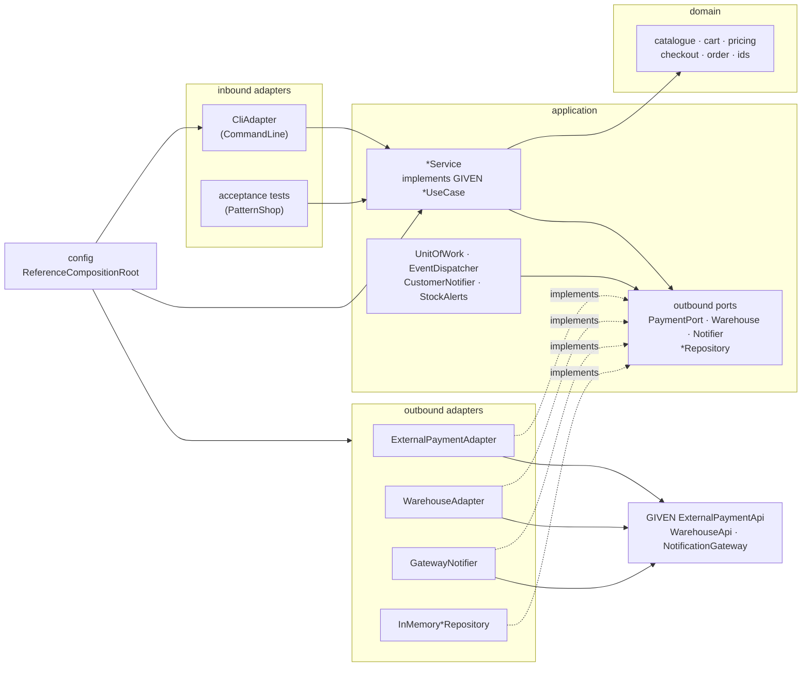
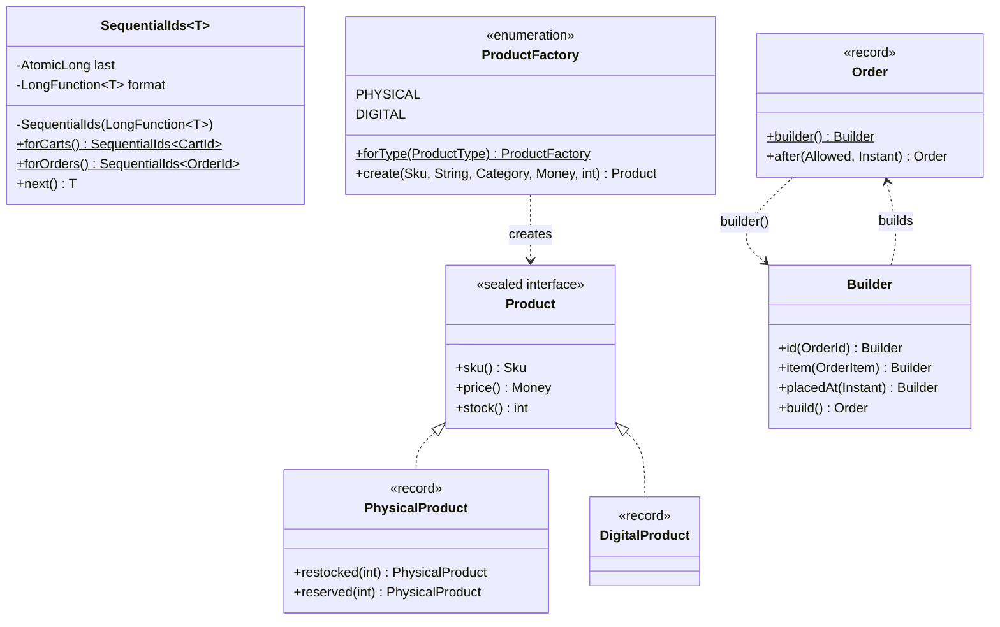
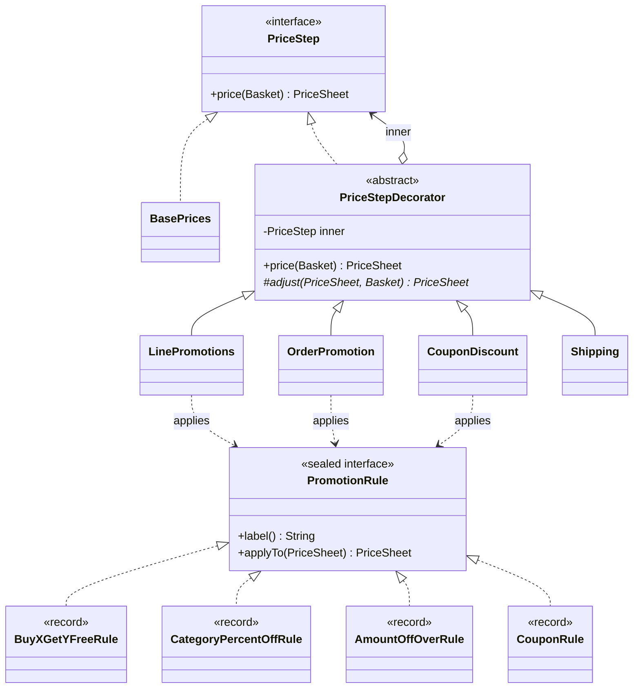
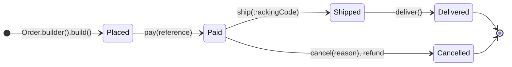
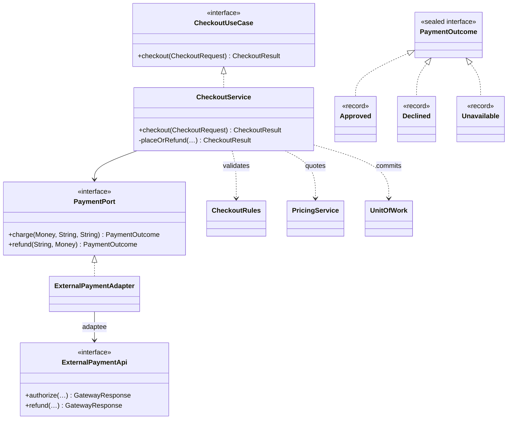
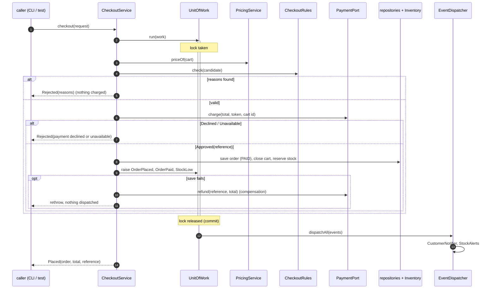
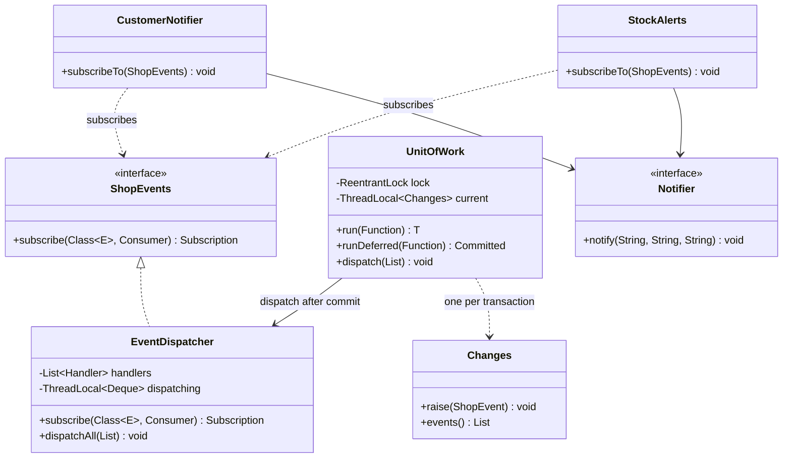
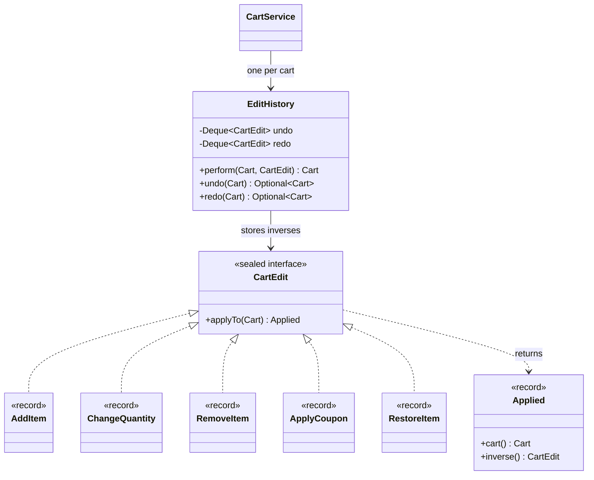
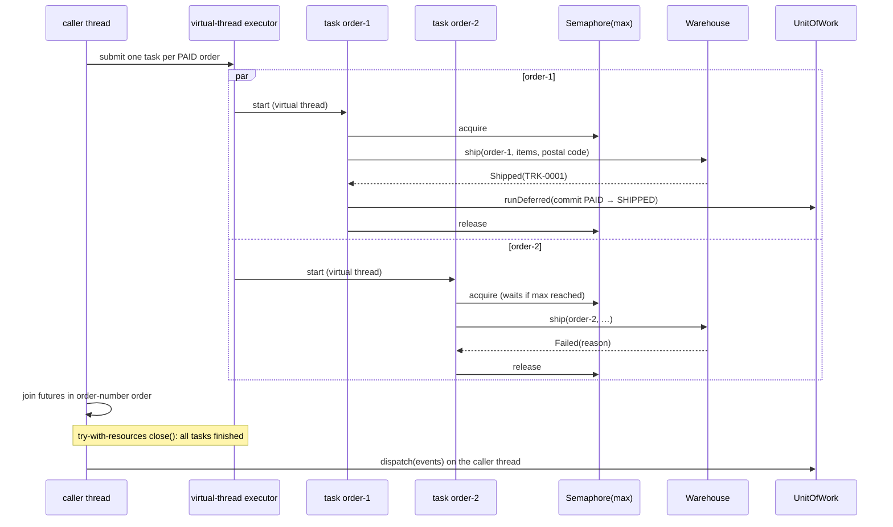
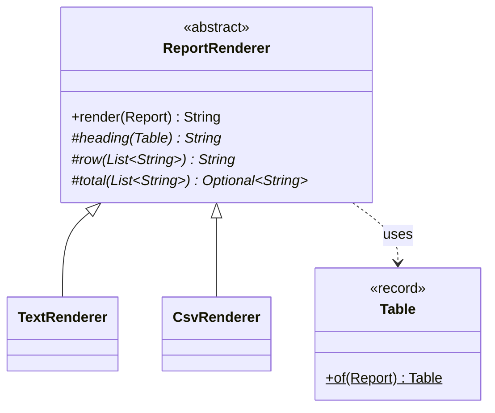

# PatternShop — Bitirme Projesi Çözüm Rehberi

> Ders: Java'da Tasarım Kalıpları (Java 27), Güz 2026 · Kendi `SPEC.md` taslağınızı yazdıktan sonra (10. hafta) ve
> savunmadan önce (14. hafta) yeniden okuyun · Proje tanımı: [spec.tr.md](spec.tr.md) · Rubrik: [rubric.tr.md](rubric.tr.md)
> · English: [guide.en.md](guide.en.md) · Mühendislik spesifikasyonu: [SPEC-capstone.md](../specs/SPEC-capstone.md)

Bu çözüm rehberi (walkthrough), PatternShop'u kurmanın **bir** yolunu açıklar:
[`capstone/reference`](reference/) içindeki referans çözümü. Proje tanımındaki hangi zorlamanın (force) hangi kalıbı
gerektirdiğini, referansın bunlara Java 27 ile nasıl yanıt verdiğini, hangi alternatiflerin neden reddedildiğini ve
her rubrik ölçütünün nasıl karşılanabileceğini gösterir. Tek iyi tasarım bu değildir ve kopyalanacak bir şablon da
değildir: proje tanımı ([Akademik dürüstlük ve yapay zekâ asistanları](spec.tr.md#akademik-dürüstlük-ve-yapay-zekâ-asistanları)) referanstan kopyalamayı akademik dürüstlük ihlali sayar ve savunmada *sizin* kodunuz
sorulur. Referansı modül örneklerini kullandığınız gibi kullanın — okuyun, çalıştırın, onunla tartışın, sonra kendi
kararlarınızı verip nedenlerini yazın.

**Referans nasıl okunur.** Dıştan içe doğru, dilimlerin (slice) kurulduğu sırayla okuyun:

1. `config.ReferenceCompositionRoot` — diğer bütün sınıfları bilen tek sınıf. Tüm nesne grafiğini tek ekranda
   gösterir.
2. **Giriş portları** (VERİLEN `api.*UseCase` arayüzleri) ve onları uygulayan uygulama servisleri
   (`application.*Service`).
3. **Alan** paketleri tek tek (`domain.catalogue`, `cart`, `pricing`, `checkout`, `order`); her biri küçüktür ve
   altyapıdan bağımsızdır.
4. **Çıkış portları** (`application.port.out`) ve adaptörleri (`adapter.out.*`).
5. Testler: `*ReferenceTest` bağlamaları (verilen 83 kabul testi), `ReferenceArchitectureTest` (7 kural) ve her
   paketin yanındaki birim testleri.

Her katılımcı tip `@PatternRole` taşır; bu yüzden `grep -rn "@PatternRole" capstone/reference/src/main` bütün kalıp
envanterini listeler ve her Javadoc bu rehberin bir bölümünü adıyla anan bir `@see "capstone guide, <bölüm> …"` ile biter.

**İçindekiler.** [Kalıp haritası](#kalıp-haritası) · [Dilim dilim çözüm](#dilim-dilim-çözüm) (önce mimari, sonra
C3–C6) · [Ödünleşimler](#ödünleşimler) · [SDD çıktıları](#sdd-çıktıları) · [Rubrik eşlemesi](#rubrik-eşlemesi) ·
[Test yaklaşımı](#test-yaklaşımı) · [Sık yapılan hatalar](#sık-yapılan-hatalar) ·
[İsteğe bağlı genişletme: Structured Concurrency](#i̇steğe-bağlı-genişletme-structured-concurrency)
(yapılandırılmış eşzamanlılık).

Referansı depo kökünden JDK 27 ile derleyip çalıştırın:

```bash
export JAVA_HOME=$(/usr/libexec/java_home -v 27)            # macOS; on Linux/Windows point JAVA_HOME at JDK 27

./mvnw -q -pl capstone/reference -am verify                  # 83 acceptance tests + 7 rules + 70 unit tests
./mvnw -q -pl capstone/reference -am package -DskipTests
java -cp capstone/starter/target/classes:capstone/reference/target/classes \
     io.github.aliturgutbozkurt.patterns.capstone.reference.config.Main --demo
```

## Kalıp haritası

### Sayılan kalıplar

Referans **13 sayılan kalıp** bildirir (3 yaratımsal, 3 yapısal, 6 davranışsal, 1 eşzamanlılık); ayrıca proje
tanımının eşzamanlılık kalıbı olarak saymadığı Immutable Object (Değişmez Nesne) vardır. Yollar
`reference/src/main/java/…/capstone/reference/` dizinine göredir; bağlantılar kaynak kodu açar.

| # | Kalıp (kategori) | PatternShop'taki zorlama | Katılımcılar (`@PatternRole` rolü) | Modül |
|--|:-----------|:------------------------------|:------------------------------|--|
| 1 | Static Factory Method (Statik Fabrika Metodu) (yaratımsal) | Sepetler ve siparişler iki bağımsız diziden kimlik almalı; kimlik biçimi tek yerde kalmalı ve bir sipariş numarasını yalnızca verilmiş bir sipariş tüketebilir | [`SequentialIds`](reference/src/main/java/io/github/aliturgutbozkurt/patterns/capstone/reference/domain/ids/SequentialIds.java) (`forCarts()`, `forOrders()`) | m02 |
| 2 | Factory Method (Fabrika Metodu) (yaratımsal) | Bir `ProductSpec` bir `ProductType` adlandırır; fiziksel ve dijital ürünler stoku farklı doğrular ve çağıranlar tipe göre dallanmamalı | [`ProductFactory`](reference/src/main/java/io/github/aliturgutbozkurt/patterns/capstone/reference/domain/catalogue/ProductFactory.java) (yaratıcı, tip başına bir sabit) → `PhysicalProduct`, `DigitalProduct` | m02 |
| 3 | Builder (İnşacı) (yaratımsal) | Bir siparişin pek çok parçası vardır, bazıları ödeme adımında hesaplanır; yarım kurulmuş bir sipariş asla var olmamalı | [`Order.Builder`](reference/src/main/java/io/github/aliturgutbozkurt/patterns/capstone/reference/domain/order/Order.java) (builder), `Order` (ürün) | m03 |
| 4 | Adapter (Adaptör) (yapısal) | Ödeme sağlayıcısı metinler, durum kodları ve kendi üye işyeri kimliğiyle konuşur; çekirdek `Money` ve mühürlü sonuçlarla konuşur | [`PaymentPort`](reference/src/main/java/io/github/aliturgutbozkurt/patterns/capstone/reference/application/port/out/PaymentPort.java) (hedef), [`ExternalPaymentAdapter`](reference/src/main/java/io/github/aliturgutbozkurt/patterns/capstone/reference/adapter/out/payment/ExternalPaymentAdapter.java) (adaptör), VERİLEN `ExternalPaymentApi` (uyarlanan) | m04 |
| 5 | Decorator (Dekoratör) (yapısal) | Fiyatlandırmanın sabit sırada yedi adımı vardır; her adım içteki adımların sonucuna ihtiyaç duyar; testler her adımı tek başına ister | [`PriceStep`](reference/src/main/java/io/github/aliturgutbozkurt/patterns/capstone/reference/domain/pricing/PriceStep.java) (bileşen), `BasePrices` (somut bileşen), [`PriceStepDecorator`](reference/src/main/java/io/github/aliturgutbozkurt/patterns/capstone/reference/domain/pricing/PriceStepDecorator.java) (dekoratör), `LinePromotions`, `OrderPromotion`, `CouponDiscount`, `Shipping` | m04 |
| 6 | Facade (Cephe) (yapısal) | Ödeme adımı doğrulamaya, fiyatlandırmaya, tahsilata, stoka, siparişlere, sepetlere ve olaylara dokunur; CLI ve testler tek bir çağrı ister | [`CheckoutService`](reference/src/main/java/io/github/aliturgutbozkurt/patterns/capstone/reference/application/CheckoutService.java) (telafili cephe) | m05 |
| 7 | Strategy (Strateji) (davranışsal) | Dört promosyon türü aynı biçimde fiyatlanır; yeni türler hattı değiştirmemeli | [`PromotionRule`](reference/src/main/java/io/github/aliturgutbozkurt/patterns/capstone/reference/domain/pricing/PromotionRule.java) (strateji), `BuyXGetYFreeRule`, `CategoryPercentOffRule`, `AmountOffOverRule`, `CouponRule` | m06 |
| 8 | Chain of Responsibility (Sorumluluk Zinciri) (davranışsal) | Sabit sırada altı doğrulama kuralı: biri ilk hatada durur (`empty cart`), diğerleri her nedeni toplar | [`CheckoutRule`](reference/src/main/java/io/github/aliturgutbozkurt/patterns/capstone/reference/domain/checkout/CheckoutRule.java) (işleyici), [`CheckoutRules`](reference/src/main/java/io/github/aliturgutbozkurt/patterns/capstone/reference/domain/checkout/CheckoutRules.java) (somut işleyiciler, zincir) | m07 |
| 9 | State (Durum) (davranışsal) | Beş durum, dört izinli geçiş ve yalnızca bazı durumlarda var olan veriler (ödeme referansı, takip kodu) | [`OrderState`](reference/src/main/java/io/github/aliturgutbozkurt/patterns/capstone/reference/domain/order/OrderState.java) (mühürlü durumlar), [`OrderLifecycle`](reference/src/main/java/io/github/aliturgutbozkurt/patterns/capstone/reference/domain/order/OrderLifecycle.java) (geçişler), `Order` (bağlam) | m08 |
| 10 | Command (Komut) (davranışsal) | Her sepet düzenlemesi 20 adım derinliğe kadar, satır konumlarını koruyarak geri alınabilmeli ve yinelenebilmeli; CLI'da 20 komut var | [`CartEdit`](reference/src/main/java/io/github/aliturgutbozkurt/patterns/capstone/reference/domain/cart/CartEdit.java) (komut), [`EditHistory`](reference/src/main/java/io/github/aliturgutbozkurt/patterns/capstone/reference/domain/cart/EditHistory.java) (çağırıcı), `CartService` (istemci); [`CliAdapter`](reference/src/main/java/io/github/aliturgutbozkurt/patterns/capstone/reference/adapter/in/cli/CliAdapter.java) (çağırıcı), `CliCommand` (komut) | m06 |
| 11 | Observer (Gözlemci) (davranışsal) | Müşteri bildirimleri ve stok uyarıları siparişlere tepki verir, ama ödeme adımı kimin dinlediğini bilmemeli | [`EventDispatcher`](reference/src/main/java/io/github/aliturgutbozkurt/patterns/capstone/reference/application/events/EventDispatcher.java) (özne), [`CustomerNotifier`](reference/src/main/java/io/github/aliturgutbozkurt/patterns/capstone/reference/application/notify/CustomerNotifier.java), `StockAlerts` (gözlemciler) | m07 |
| 12 | Template Method (Şablon Metot) (davranışsal) | İki biçimdeki dört rapor tek bir düzeni paylaşır: başlık, satırlar, toplam | [`ReportRenderer`](reference/src/main/java/io/github/aliturgutbozkurt/patterns/capstone/reference/application/render/ReportRenderer.java) (soyut sınıf), `TextRenderer`, `CsvRenderer` (somut sınıflar) | m06 |
| 13 | Görev başına iş parçacığı (thread-per-task) (eşzamanlılık) | Karşılama (fulfilment) sipariş başına bloklayan depo çağrıları yapar; siparişler bağımsızdır ama aynı anda en çok `maxParallelOrders` tanesi çalışabilir | [`FulfilmentService`](reference/src/main/java/io/github/aliturgutbozkurt/patterns/capstone/reference/application/FulfilmentService.java) (sipariş başına bir sanal iş parçacığı, `Semaphore`) | m10 |
| — | Immutable Object (eşzamanlılık kalıbı sayılmaz) | Ürünleri, sepetleri ve siparişleri, başka iş parçacıkları onları değiştirirken işçi iş parçacıkları ve gözlemciler okur | [`Product`](reference/src/main/java/io/github/aliturgutbozkurt/patterns/capstone/reference/domain/catalogue/Product.java) (mühürlü record'lar), `Cart`, `Order` record'ları | m09 |

### Alternatifler, modern Java biçimi ve testler

Rubriğin gerekçe tablosu ([rubrik](rubric.tr.md#kalıp-gerekçe-tablosu-şablonu)) bunları zorlamayla aynı satıra koyar; uzun test adları okunabilir kalsın diye
burada liste olarak verildiler. Sizin tablonuzda hepsi, kalıp başına bir satırda olmalı.

1. **Static Factory Method.** *Reddedilen:* çağrı noktasında `new CartId("cart-" + n)` — biçim iki servise sızar ve
   açık bir kurucu *hangi* diziyi kastettiğini söyleyemez. *Modern biçim:* özel kurucu, `LongFunction<T>`,
   `AtomicLong`. *Testler:* `SequentialIdsTest` → `namedFactoriesStartEachSequenceAtOne`,
   `concurrentCallersNeverGetTheSameId`.
2. **Factory Method.** *Reddedilen:* `CatalogueService` içinde `if (type == DIGITAL)` — her yeni ürün tipi servisi
   değiştirir. *Modern biçim:* kurucu referansı taşıyan `enum` sabitleri; `forType` içinde kapsayıcı `switch`.
   *Testler:* `ProductFactoryTest` → `eachProductTypeHasItsOwnFactory`, `digitalFactoryRejectsStock`.
3. **Builder.** *Reddedilen:* ödeme adımında 8 argümanlı bir kurucu çağrısı — okunmaz; ayrıca `PLACED` durumu ve ilk
   geçmiş kaydı her çağıranda tekrarlanır. *Modern biçim:* statik iç içe builder; `build()` record'u oluşturur,
   kompakt kurucusu doğrular. *Testler:* `OrderBuilderTest` → `refusesHalfBuiltOrders`.
4. **Adapter.** *Reddedilen:* `ExternalPaymentApi`'yi `CheckoutService` içinden çağırmak — çekirdekte durum kodları ve
   tutar metinleri; ArchUnit kural 2 de bunu yasaklar. *Modern biçim:* record'lardan oluşan mühürlü `PaymentOutcome`;
   durum kodu üzerinde `switch`. *Testler:* `ExternalPaymentAdapterTest` → `translatesStatusCodesIntoOutcomes`;
   `CheckoutAcceptance` → `chargesTheQuotedTotalExactlyOnceInProviderFormat`.
5. **Decorator.** *Reddedilen:* yedi bloklu tek bir `price()` metodu ya da `Function.andThen` (bkz. [Fiyatlandırma için Decorator zinciri ve fonksiyon bileşimi](#fiyatlandırma-için-decorator-zinciri-ve-fonksiyon-bileşimi)). *Modern
   biçim:* `final` şablonlu soyut dekoratör, fiyat çizelgesi için record'lar. *Testler:* `PricingPipelineTest` →
   `eachDecoratorAddsExactlyItsStep`, `decoratorsCanBeLeftOutOrReordered`.
6. **Facade.** *Reddedilen:* CLI'ın altı servisi sırayla çağırması — adımların sırası ve hata durumunda iade bir
   adaptörde yaşardı. *Modern biçim:* mühürlü sonuçlar, `PaymentOutcome` üzerinde `switch`. *Testler:*
   `CheckoutServiceTest` → `failedCommitAfterTheChargeIsCompensatedByARefund`.
7. **Strategy.** *Reddedilen:* hattın içinde `PromotionSpec` üzerinde bir `switch` — her yeni tür hattı değiştirir;
   lambda'lar — kurallar veri ve etiket taşır. *Modern biçim:* record'lardan oluşan mühürlü arayüz. *Testler:*
   `PromotionRuleTest` → `buyXGetYCountsWholeGroupsOnly`; `PricingAcceptance` → `workedExampleFromTheBrief`.
8. **Chain of Responsibility.** *Reddedilen:* `if` bloklu tek bir `validate()` — ilk hatada dur / tüm hataları topla
   karışımı ve kural sırası denetim akışına gömülür. *Modern biçim:* `and` / `andThen` varsayılan metotlu
   `@FunctionalInterface`; kurallar lambda'dır. *Testler:* `CheckoutRulesTest` →
   `andCollectsWhileAndThenStopsAtTheFirstFailure`; `CheckoutAcceptance` → `collectsAllValidationErrorsInRuleOrder`.
9. **State.** *Reddedilen:* `enum OrderStatus` artı null olabilen alanlar (bkz. [Mühürlü durum ve enum durum](#mühürlü-durum-ve-enum-durum)). *Modern biçim:* record'lardan
   oluşan mühürlü arayüz, record desenli ve korumalı kapsayıcı `switch`. *Testler:* `OrderLifecycleTest` →
   `forbiddenTransitionsAreRefusedWithTheCurrentStatus`.
10. **Command.** *Reddedilen:* sepetin Memento (Hatıra) anlık görüntüleri (bkz. [Geri alma için Command ve Memento](#geri-alma-için-command-ve-memento)). *Modern biçim:* `applyTo`'su
    tersini döndüren mühürlü record'lar; CLI komutları bir `Map` içindeki lambda'lardır. *Testler:* `CartEditTest` →
    `everyEditReturnsAnInverseThatRestoresTheCartExactly`; `UndoAcceptance` → `undoRestoresRemovedLineAtItsPosition`.
11. **Observer.** *Reddedilen:* bildirimciyi ödeme adımından çağırmak — ödeme adımı her tepkiye bağımlı olur ve
    başarısız bir e-posta ödenmiş bir siparişi düşürebilir. *Modern biçim:* tipli
    `subscribe(Class<E>, Consumer<? super E>)`, `CopyOnWriteArrayList`. *Testler:* `EventDispatcherTest` →
    `failingHandlerIsReportedAndTheOthersStillRun`; `EventsAcceptance` → `subscribersSeeCommittedState`.
12. **Template Method.** *Reddedilen:* birbirinden bağımsız iki görüntüleyici — satır sırası ve sondaki satır sonu
    tekrarlanırdı; Strategy — paylaşılan *iskelettir*, tek bir algoritma değil. *Modern biçim:* `final` şablon metot,
    isteğe bağlı toplam için `Optional`. *Testler:* `ReportRendererTest` → `theTemplateFixesTheOrderOfTheParts`.
13. **Görev başına iş parçacığı.** *Reddedilen:* 4 platform iş parçacıklı sabit bir havuz ya da Producer–Consumer
    (Üretici–Tüketici) (bkz. [Karşılama için semafor ve Producer–Consumer](#karşılama-için-semafor-ve-producerconsumer)). *Modern biçim:* try-with-resources içinde `Executors.newVirtualThreadPerTaskExecutor()`, `Semaphore`.
    *Testler:* `FulfilmentAcceptance` → `neverExceedsMaxParallelOrders`; `FulfilmentServiceTest` →
    `runsOrdersInParallelOnVirtualThreadsButNeverAboveTheLimit`.

### Mimari kalıplar

Mimari bunları zaten gerektirdiği için onluğa **sayılmazlar** — ama sayılan kalıpları bir araya getiren onlardır:

| Kalıp | Nerede | Modül |
|---|---|---|
| Dependency Injection (Bağımlılık Enjeksiyonu) (bileşim kökü) | [`ReferenceCompositionRoot`](reference/src/main/java/io/github/aliturgutbozkurt/patterns/capstone/reference/config/ReferenceCompositionRoot.java): mağaza başına bir nesne grafiği, yalnızca kurucu enjeksiyonu, statik durum yok | m03, m11 |
| Repository (Depo) | `application.port.out.{Product,Cart,Order,Promotion}Repository` (portlar) ve `adapter.out.memory.InMemory*Repository` (iş parçacığı güvenli, değişmez değerler) | m11 |
| Specification (Belirtim) | [`Specification`](reference/src/main/java/io/github/aliturgutbozkurt/patterns/capstone/reference/domain/catalogue/Specification.java) ve `ProductSpecs` (katalog araması) | m11 |
| Ports and Adapters (Portlar ve Adaptörler) | giriş: VERİLEN `*UseCase` arayüzleri, `CliAdapter`; çıkış: `PaymentPort`, `Warehouse`, `Notifier`, depolar | m11 |
| Alan olayları (domain events) | [`UnitOfWork`](reference/src/main/java/io/github/aliturgutbozkurt/patterns/capstone/reference/application/events/UnitOfWork.java) (önce commit, sonra dağıtım), `Changes`, `EventDispatcher` | m11 |

### Bilerek kullanılmayan kalıplar

C2'deki Mükemmel düzeyi, gerekçesiyle reddettiğiniz en az bir kalıp ister. Referansın reddettikleri:

| Kalıp | Nerede cazipti | Neden kullanılmadı |
|---|---|---|
| Singleton (Tekil Nesne) | olay dağıtıcısı, kimlik dizileri, depolar | Her `create(env)` çağrısında bir mağaza: kabul test kiti her test için yeni bir mağaza kurar ve statik bir örnek sepetleri ve kimlikleri testler arasında sızdırırdı. ArchUnit kural 7 zaten final olmayan statik alanları yasaklar. Bileşim kökü, küresel durum olmadan "mağaza başına bir tane" sağlar. |
| Visitor (Ziyaretçi) | mühürlü `Report` / `ReportRequest` tipleri üzerindeki raporlar | Hiyerarşiler mühürlü ve işlemler tek yerde; record desenli kapsayıcı bir `switch`, hiç `accept` metodu olmadan aynı derleyici denetimli eksiksizliği verir (m08 "Visitor ve desen eşleme"). |
| Memento | sepet düzenlemelerini geri alma | Bkz. [Geri alma için Command ve Memento](#geri-alma-için-command-ve-memento): ters komutlar satır konumlarını daha az bellekle geri getirir ve yinelemeyi bedavaya getirir. |
| Abstract Factory (Soyut Fabrika) | adaptörlerin oluşturulması | Her çalıştırmada tam olarak bir aile vardır (simülasyon ya da test sahteleri) ve onu `create(env)` çağıranı seçer; fabrika bileşim kökünün *kendisidir*. |
| Proxy (Vekil) | ödeme yeniden denemeleri, günlükleme | Bunu isteyen bir gereksinim yok; yeniden deneyen bir Decorator ya da Proxy'nin yerini hak edeceği yer E8'dir (ödeme dayanıklılığı). |

## Dilim dilim çözüm

### Bir bakışta altıgen

PatternShop bir altıgendir (m11): ortada alan, çevresinde uygulama servisleri, dışarıda adaptörler ve hepsini
bağlayan tek bir bileşim kökü (composition root). Oklar derleme zamanı bağımlılıklarıdır; her zaman içe doğru
gösterirler.



| Paket (`…capstone.reference.`) | İçerik | Bağımlı olabileceği yerler |
|---|---|---|
| `domain..` | değerler, aggregate'ler, kurallar: G/Ç yok, saat yok, iş parçacığı yok | JDK, kendisi, VERİLEN `api.model`, `api.event`, `api.pattern` |
| `application..` | her VERİLEN kullanım senaryosu için bir servis, portlar, olaylar, görüntüleme | alan, VERİLEN API (`api.external` ve `api.sim` hariç) |
| `adapter.in.cli` | CLI | VERİLEN kullanım senaryoları |
| `adapter.out.*` | ödeme, depo (warehouse), bildirim, bellek | uygulama portları, alan, `api.external` |
| `config` | bileşim kökü, `Main` | her şey; ona hiçbir şey bağımlı değildir |

Bileşim kökü grafiği mağaza başına bir kez kurar. Gözlemciler burada abone edilir; böylece servisler kimin
dinlediğini hiç bilmez:

```java
// file: reference/config/ReferenceCompositionRoot.java
    @Override
    public PatternShop create(ShopEnvironment env) {
        Objects.requireNonNull(env, "env");
        var dispatcher = new EventDispatcher(env.errors());
        var infra = new Infrastructure(new InMemoryProductRepository(), new InMemoryCartRepository(),
                new InMemoryOrderRepository(), new InMemoryPromotionRepository(),
                new ExternalPaymentAdapter(env.payments(), env.settings().merchantId()), dispatcher,
                new UnitOfWork(dispatcher));
        var notifier = new GatewayNotifier(env.notifications());
        new CustomerNotifier(infra.orders(), notifier).subscribeTo(dispatcher);
        new StockAlerts(notifier).subscribeTo(dispatcher);
        return services(env, infra);
    }
```

**Gerçek referansla bir oturum.** `Main --demo`, `DemoData`'yı yükler ve simüle edilmiş ödeme sağlayıcısını ve
depoyu çalıştırır. Standart girdiye şu komutlar verildi:

```text
product list TOYS
cart open alice
cart add cart-1 BOK-001 2
cart add cart-1 BOK-002 1
cart add cart-1 TOY-001 3
cart add cart-1 HOM-001 1
cart undo cart-1
cart add cart-1 DIG-001 1
cart coupon cart-1 AUTUMN5
quote cart-1
checkout cart-1 tok_declined Alice Doe;Bagdat Cd. 1;Istanbul;34710
checkout cart-1 tok_visa_ok Alice Doe;Bagdat Cd. 1;Istanbul;34710
order show order-1
fulfil
order deliver order-1
order cancel order-1 changed my mind
report sales 2026-10-07 2026-10-08
report top 3 --csv
report inventory
cart fly cart-1
cart add cart-1 BOK-1 2
```

ve standart çıktının tamamı şudur (2026-10-07'de çalıştırıldı; `Main` sistem saatini kullanır, bu yüzden satış
raporundaki tarihler çalıştırma günüdür):

```text
TOY-001 | Pattern Puzzle | TOYS | PHYSICAL | 120.00 | 6
CART cart-1
cart-1 alice open | BOK-001 x2
cart-1 alice open | BOK-001 x2, BOK-002 x1
cart-1 alice open | BOK-001 x2, BOK-002 x1, TOY-001 x3
cart-1 alice open | BOK-001 x2, BOK-002 x1, TOY-001 x3, HOM-001 x1
cart-1 alice open | BOK-001 x2, BOK-002 x1, TOY-001 x3
cart-1 alice open | BOK-001 x2, BOK-002 x1, TOY-001 x3, DIG-001 x1
cart-1 alice open | BOK-001 x2, BOK-002 x1, TOY-001 x3, DIG-001 x1 | coupon AUTUMN5
subtotal 1359.90
- buy 2 get 1 free: TOY-001 120.00
- 10% off BOOKS 99.99
- 100.00 off over 1000.00 100.00
- coupon AUTUMN5 5% 52.00
shipping 0.00
total 987.91
REJECTED payment declined
NOTIFY alice | Order order-1 confirmed | Thank you! We received 987.91 for order-1.
NOTIFY ops | Stock low: TOY-001 | TOY-001 has 3 left.
PLACED order-1 987.91 txn-1
order-1 alice PAID 987.91 | BOK-001 x2, BOK-002 x1, TOY-001 x3, DIG-001 x1
NOTIFY alice | Order order-1 shipped | Your order is on its way. Tracking code: TRK-0001.
SHIPPED order-1 TRK-0001
DELIVERED order-1
REFUSED cannot cancel DELIVERED order
Daily sales 2026-10-07 .. 2026-10-08
2026-10-07 | 1 | 987.91
2026-10-08 | 0 | 0.00
Total | 1 | 987.91
rank,sku,name,units,revenue
1,TOY-001,Pattern Puzzle,3,360.00
2,BOK-001,Design Patterns Handbook,2,500.00
3,BOK-002,Java 27 in Action,1,400.00
Inventory
BOK-001 | Design Patterns Handbook | 18 | no
BOK-002 | Java 27 in Action | 7 | no
ELE-001 | USB-C Hub | 10 | no
HOM-001 | Hexagon Mug | 50 | no
TOY-001 | Pattern Puzzle | 3 | yes
ERROR unknown command: cart fly
USAGE cart add <cart> <sku> <qty>
```

[Kalıp haritası](#kalıp-haritası) bölümündeki kalıpların neredeyse hepsi burada görünür: geri alma `HOM-001`'i kaldırdı (Command), fiyat teklifi beş
fiyatlandırma aşamasını sırasıyla gösterir (Strategy üzerinde Decorator), reddedilen kart bir istisna değil bir iş
sonucu üretti (Adapter + Facade) ve iki `NOTIFY` satırı `PLACED`'den *önce* yazıldı — gözlemciler sipariş commit
edildikten sonra ama `checkout` dönmeden önce çalıştı (commit sonrası alan olayları). Karşılama bir sanal iş
parçacığında çalıştı, raporlar tek bir şablondan geçti ve son iki satır, CLI'ın komut tablosunun hatalı girdiyi
reddetmesidir. Aynı senaryo, sabit bir test saatiyle, `CliAcceptance`'ın harfiyen karşılaştırdığı
[`cli-session.txt`](starter/src/test/resources/acceptance/cli-session.txt) kabul kaynağıdır.

### C3 — Katalog, sepet ve siparişin kurulması

C3 dilimi Catalogue ve Cart takımlarını yeşile çevirdi. Üç yaratımsal kalıbı ve geri kalan her şeyin üzerine
kurulduğu değerleri içerir.



#### Static Factory Method: `SequentialIds`

**Problem.** Kimlikler mağaza örneği başına iki bağımsız sayaçtan `cart-1`, `cart-2`, … ve `order-1`, … biçimindedir;
bir sipariş numarası yalnızca gerçekten bir sipariş verildiğinde tüketilir
(`CheckoutAcceptance.orderIdsAreConsumedOnlyByPlacedOrders`).
**Kalıp.** Özel bir kurucu ve *adlandırılmış* iki statik fabrika: ad hangi diziyi aldığınızı söyler, lambda biçimi
gizler.

```java
// file: reference/domain/ids/SequentialIds.java
@PatternRole(value = DesignPattern.STATIC_FACTORY_METHOD, role = "named constructors forCarts() and forOrders()")
public final class SequentialIds<T> {

    private final AtomicLong last = new AtomicLong();
    private final LongFunction<T> format;

    private SequentialIds(LongFunction<T> format) {
        this.format = format;
    }

    /** {@code cart-1}, {@code cart-2}, … */
    public static SequentialIds<CartId> forCarts() {
        return new SequentialIds<>(n -> new CartId("cart-" + n));
    }

    /** {@code order-1}, {@code order-2}, … — take one only when an order is really placed. */
    public static SequentialIds<OrderId> forOrders() {
        return new SequentialIds<>(OrderId::of);
    }
```

**Alternatifler.** Önek alan açık bir kurucu, herhangi bir çağıranın üçüncü bir biçim uydurmasına izin verirdi;
statik bir sayaç (Singleton benzeri) aynı JVM'deki iki mağaza arasında kimlikleri paylaşırdı — kabul test kiti bunu
her test sınıfında yapar. **Modül:** m02 `staticfactory`.

#### Factory Method: `ProductFactory`

**Problem.** `CatalogueService.add`, bir `ProductType` taşıyan bir `ProductSpec` alır. Dijital bir ürünün stoku
sınırsızdır ve sıfırdan farklı bir başlangıç stokunu reddetmelidir; fiziksel bir ürün stokunun ≥ 0 olduğunu doğrular.
**Kalıp.** *Yaratıcı* (creator) bir `enum`'dur: her sabit kendi fabrika metodunu bir kurucu ya da metot referansı
olarak taşır; böylece yeni bir ürün tipi yeni bir `if` değil, yeni bir sabittir.

```java
// file: reference/domain/catalogue/ProductFactory.java
public enum ProductFactory {
    PHYSICAL(PhysicalProduct::new),
    DIGITAL(ProductFactory::digital);
// ...
    /** The factory for {@code type}. */
    public static ProductFactory forType(ProductType type) {
        return switch (type) {
            case PHYSICAL -> PHYSICAL;
            case DIGITAL -> DIGITAL;
        };
    }

    /** A new product; invalid data is rejected with {@link IllegalArgumentException}. */
    public Product create(Sku sku, String name, Category category, Money price, int initialStock) {
        return creation.create(sku, name, category, price, initialStock);
    }
```

**Alternatifler.** Klasik biçim (tip başına bir alt sınıfı olan soyut bir `ProductCreator`) aynı etki için iki sınıf
daha gerektirir. Servis içinde bir `switch` iki tip için dürüst olurdu, ama o zaman oluşturma kuralı
(dijital ⇒ stok yok) ürünün yanında değil serviste yaşardı. **Modül:** m02 `factorymethod.export.modern`.

#### Builder: `Order.Builder`

**Problem.** Bir sipariş, ödeme adımında kimlikten, müşteriden, fiyatlanan her satır için bir kalemden, toplamdan,
adresten ve saatin anından (instant) kurulur — ve tek bir geçmiş kaydıyla `PLACED` durumunda başlamalıdır. Yarım
kurulmuş bir sipariş asla görünmemelidir.
**Kalıp.** Statik iç içe bir builder parçaları toplar; `build()` record'u bir kez oluşturur ve her şeyi kompakt
kurucusunun doğrulamasına bırakır.

```java
// file: reference/domain/order/Order.java
    /** A builder for a new order in state {@code PLACED}. */
    public static Builder builder() {
        return new Builder();
    }
// ...
        /** The order in state {@code PLACED}; a missing part throws {@link NullPointerException} naming it. */
        public Order build() {
            Objects.requireNonNull(placedAt, "placedAt");
            return new Order(id, customer, items, total, shippingAddress, placedAt, new OrderState.Placed(),
                    List.of(new HistoryEntry(OrderStatus.PLACED, placedAt, "")));
        }
```

`CheckoutService.place` ([C5](#c5--ödeme-ödeme-adımı-olaylar-ve-geri-alma)) onu her satır için bir `item(…)` çağrısıyla kullanır. Builder'ın `Clock`'u değil,
saatin *anını* aldığına dikkat edin: alan zamanı asla kendisi okumaz.
**Alternatifler.** Record üzerinde bir "wither" zinciri, her biri geçerli olması gereken yedi ara sipariş üretirdi.
Teleskop kurucu hangi argümanın ne olduğunu gizler. **Modül:** m03 `builder`.

#### Immutable Object, Repository ve Specification

`Product`, `Cart` ve `Order` record'dur: her değişiklik yeni bir değer döndürür (`PhysicalProduct.reserved`,
`Cart.withAdded`, `Order.after`). Bellek içi depoları basit kılan budur — SKU'ya göre anahtarlanmış bir
`ConcurrentSkipListMap` değerlerini kopyalamadan verebilir, çünkü kimse onları değiştiremez — ve karşılama iş
parçacıklarının ve gözlemcilerin siparişleri kilitsiz okumasını sağlayan da budur. Katalog araması üç Specification'ı
birleştirir:

```java
// file: reference/application/CatalogueService.java
    @Override
    public List<ProductView> search(ProductQuery query) {
        return products.findMatching(ProductSpecs.inAnyCategory(query.categories())
                        .and(ProductSpecs.priceAtMost(new Money(query.maxPriceKurus())))
                        .and(ProductSpecs.nameContains(query.nameContains())))
                .stream().map(Views::of).toList();
    }
```

Depo eşleşmeleri SKU'ya göre sıralı döndürür, çünkü harita sıralıdır; böylece proje tanımındaki "SKU'ya göre
sıralı" kuralı adaptörün bir özelliğidir ve `InMemoryRepositoriesTest` içinde bir kez test edilir. **Modüller:** m09
`immutability`, m11 `repository.catalog`.

### C4 — Fiyatlandırma, yaşam döngüsü ve doğrulama

C4 dilimi Pricing takımını yeşile çevirdi; sipariş yaşam döngüsünü ve doğrulama zincirini kurdu — ödeme adımı var
olana dek bunlar birim testleriyle sınandı.

#### Strategy ve Decorator: fiyatlandırma hattı

**Problem.** Proje tanımı sırayı sabitler: temel fiyatlar → X al Y bedava → kategori yüzdesi → eşik üstü tutar
indirimi → kupon → kargo; her adım önceki adımlardan kalanla çalışır. Promosyonlar çalışma zamanında kaydedilen
*verilerdir* (`DemoData` dört tane ekler) ve yeni türler gelecektir (E3).
**Kalıp.** Her biri bir zorlamaya yanıt veren iki kalıp. **Strategy** "bir promosyon türü indirimini nasıl
hesaplar?" sorusunu yanıtlar: her tür, mühürlü `PromotionRule`'u uygulayan bir record'dur. **Decorator** "hangi
sırayla ve neyin üzerine?" sorusunu yanıtlar: her aşama içteki aşamayı sarar, önce onun fiyatlamasına izin verir,
sonra sonucu düzeltir.



Dekoratör taban sınıfı "önce iç aşama, sonra düzeltme" kuralını bir kez, `final` bir metotta sabitler; hat, sarma
sırasının kendisidir:

```java
// file: reference/domain/pricing/PriceStepDecorator.java
public abstract class PriceStepDecorator implements PriceStep {

    private final PriceStep inner;

    protected PriceStepDecorator(PriceStep inner) {
        this.inner = Objects.requireNonNull(inner, "inner");
    }

    @Override
    public final PriceSheet price(Basket basket) {
        return adjust(inner.price(basket), basket);
    }
```

```java
// file: reference/domain/pricing/PricingPipeline.java
    public static PriceStep standard(List<PromotionRule> rules) {
        return new Shipping(new CouponDiscount(new OrderPromotion(new LinePromotions(new BasePrices(), rules), rules),
                rules));
    }
```

Somut bir strateji, verisi ve algoritmasıyla bir record'dur; proje tanımındaki "kalanla sınırlı" kuralı
`min(line.left())` ifadesidir:

```java
// file: reference/domain/pricing/CategoryPercentOffRule.java
    @Override
    public PriceSheet applyTo(PriceSheet sheet) {
        Money total = Money.ZERO;
        List<PricedLine> lines = new ArrayList<>();
        for (PricedLine line : sheet.lines()) {
            if (line.item().category() == category) {
                Money discount = line.afterFreeUnits().percent(percent).min(line.left());
                total = total.plus(discount);
                lines.add(line.less(discount));
            } else {
                lines.add(line);
            }
        }
        return sheet.withLines(lines).plus(new Discount(label(), total));
    }
```

VERİLEN `PromotionSpec` (çağıranın kaydettiği) bir kurala (alanın yürüttüğü), `PricingService.toRule` içindeki record
desenli tek bir kapsayıcı `switch` ile eşlenir — sınırın iki yanında birer mühürlü tip. **Alternatifler.** Decorator ile
fonksiyon bileşimi karşılaştırması için bkz. [Fiyatlandırma için Decorator zinciri ve fonksiyon bileşimi](#fiyatlandırma-için-decorator-zinciri-ve-fonksiyon-bileşimi). **Modüller:** m06 `strategy.shipping.modern`, m04
`decorator.coffee.modern`, m09 `composition.pricing`.

#### State: `OrderState` ve `OrderLifecycle`

**Problem.** Beş durum, dört izinli geçiş, her yasak geçiş için kesin bir ret mesajı (`cannot cancel SHIPPED order`)
ve yalnızca bazı durumlarda var olan veriler: verilmiş (placed) bir siparişin ödeme referansı yoktur, yalnızca
gönderilmiş ve teslim edilmiş siparişlerin takip kodu vardır.



**Kalıp.** m08/m09'daki veri odaklı State biçimi: her durum yalnızca kendi verisini tutan bir record'dur ve her olay,
mühürlü durumlar üzerinde kapsayıcı tek bir `switch`'tir. Sipariş (bağlam) durumunu yalnızca `Allowed` bir geçişi
uygulayarak değiştirir.

```java
// file: reference/domain/order/OrderLifecycle.java
    /** {@code PAID → SHIPPED}. */
    public static Transition ship(OrderState from, String trackingCode) {
        return switch (from) {
            case Paid(var reference) -> new Allowed(new Shipped(reference, trackingCode), trackingCode);
            case Placed _, Shipped _, Delivered _, Cancelled _ -> refuse("ship", from);
        };
    }
// ...
    /** {@code PAID → CANCELLED}; a blank reason is refused with {@code missing reason}. */
    public static Transition cancel(OrderState from, String reason) {
        return switch (from) {
            case Paid _ when reason.isBlank() -> new Refused("missing reason");
            case Paid(var reference) -> new Allowed(new Cancelled(reference, reason), reason);
            case Placed _, Shipped _, Delivered _, Cancelled _ -> refuse("cancel", from);
        };
    }
```

Her yasak durum tek tek listelenir — `default` yok — böylece altıncı bir durum (E9 iadeler: `RETURN_REQUESTED`),
ele alınana dek her `switch`'in derlenmesini engeller. **Alternatifler.** Bkz. [Mühürlü durum ve enum durum](#mühürlü-durum-ve-enum-durum) (mühürlü record'lar, enum ve klasik
State nesneleri). **Modüller:** m08 `state.order.sealed`, m09 `dop.order.modern`.

#### Chain of Responsibility: `CheckoutRules`

**Problem.** `empty cart` tek başına doğrulamayı durdurur; aksi hâlde tüm nedenler sabit bir sırayla toplanır:
`missing address` → `quantity limit exceeded` → `insufficient stock` → `expired coupon` → `missing card token`.
**Kalıp.** Her halka, nedenlerini döndüren bir `CheckoutRule`'dur (fonksiyonel arayüz). İki varsayılan metot halkaları
birleştirir: `and` ikisini de çalıştırıp birleştirir (tüm hataları topla, collect-all), `andThen` sonraki halkayı
yalnızca bu halka geçtiyse çalıştırır (ilk hatada dur, fail-fast). Zincir, proje tanımındaki kural gibi okunur:

```java
// file: reference/domain/checkout/CheckoutRules.java
    public static CheckoutRule standard() {
        return nonEmptyCart().andThen(addressForPhysicalItems()
                .and(quantityLimit())
                .and(stockAvailable())
                .and(couponNotExpired())
                .and(cardTokenPresent()));
    }
```

```java
// file: reference/domain/checkout/CheckoutRule.java
    /** Collect all: both links run, their reasons are concatenated. */
    default CheckoutRule and(CheckoutRule next) {
        Objects.requireNonNull(next, "next");
        return candidate -> {
            List<String> reasons = new ArrayList<>(check(candidate));
            reasons.addAll(next.check(candidate));
            return List.copyOf(reasons);
        };
    }

    /** Fail fast: {@code next} runs only when this link found nothing. */
    default CheckoutRule andThen(CheckoutRule next) {
        Objects.requireNonNull(next, "next");
        return candidate -> {
            List<String> reasons = check(candidate);
            return reasons.isEmpty() ? next.check(candidate) : reasons;
        };
    }
```

Kurallar, uygulama katmanının kurduğu bir `CheckoutCandidate` değerini (stoklarıyla satırlar, adres, kupon durumu,
kart belirteci) denetler; böylece alan asla bir depoya dokunmaz. **Alternatifler.** `setNext` ile bağlanan klasik
işleyici nesneleri zinciri çalışır ama "tüm hataları topla / ilk hatada dur" karışımını zorlaştırır; döngüdeki bir
kural listesi ise ilk hatada duran ilk halkayı kaybeder. **Modül:** m07 `chain.validation`.

### C5 — Ödeme, ödeme adımı, olaylar ve geri alma

C5 dilimi Checkout ve Undo takımlarını (C6 ile birlikte Lifecycle ve Events'i de) yeşile çevirdi. Kalıpların
*birlikte çalışmaya* başladığı yer burasıdır.



#### Adapter: `ExternalPaymentAdapter`

**Problem.** VERİLEN ödeme API'si bir üye işyeri kimliği, metin olarak tutar (`"987.91"`), `"TRY"` para birimi ve bir
idempotency anahtarı ister; HTTP benzeri durum kodlarıyla yanıt verir. Çekirdek `charge(Money, …)` ve bir iş sonucu
ister.
**Kalıp.** Bir nesne adaptörü: hedef `PaymentPort`'tur ve uygulamaya aittir; adaptör uyarlananı (adaptee) tutar ve
iki yönde çevirir.

```java
// file: reference/adapter/out/payment/ExternalPaymentAdapter.java
    @Override
    public PaymentOutcome charge(Money amount, String cardToken, String attempt) {
        return outcome(api.authorize(merchantId, cardToken, amount.toPlainString(), CURRENCY, attempt));
    }

    @Override
    public PaymentOutcome refund(String paymentReference, Money amount) {
        return outcome(api.refund(merchantId, paymentReference, amount.toPlainString(), CURRENCY));
    }

    private static PaymentOutcome outcome(GatewayResponse response) {
        return switch (response.status()) {
            case 200 -> new PaymentOutcome.Approved(response.reference());
            case 402 -> new PaymentOutcome.Declined(response.message());
            default -> new PaymentOutcome.Unavailable(response.status() + " " + response.message());
        };
    }
```

Buradaki `default` bilinçlidir: durum kodu mühürlü bir tip değil bir `int`'tir ve "başka herhangi bir durum" gerçek
bir iş durumudur (`payment unavailable`). **Alternatifler.** Bir sınıf adaptörü (API'yi genişletmek) uyarlanan bir
arayüz olduğunda imkânsızdır ve sağlayıcının metotlarını dışarı açardı. **Modüller:** m04 `adapter.payment`, m11
`hexagonal.shop`.

#### Telafili Facade: `CheckoutService`

**Problem.** Ödeme adımı yedi iş birlikçiyi, önemli olan bir sırayla koordine eder: doğrulama geçmeden hiçbir şey
tahsil edilmez, tahsilat onaylanmadan hiçbir şey saklanmaz, sipariş saklanana dek kimseye bir şey söylenmez — ve
saklama, kart tahsil edildikten *sonra* başarısız olursa para geri verilmelidir.
**Kalıp.** Alt sistemler üzerinde, telafi (compensation) adımı olan bir Facade (m05). Akış:



```java
// file: reference/application/CheckoutService.java
    @Override
    public CheckoutResult checkout(CheckoutRequest request) {
        return unitOfWork.run(changes -> {
            Cart cart = carts.find(request.cart())
                    .orElseThrow(() -> new NoSuchElementException("unknown cart: " + request.cart().value()))
                    .requireOpen();
            PriceSheet sheet = pricing.priceOf(cart);
            List<String> reasons = CheckoutRules.standard().check(candidate(cart, sheet, request));
            if (!reasons.isEmpty()) {
                return new Rejected(reasons);
            }
            return switch (charge(sheet.total(), request)) {
                case Approved(var reference) -> placeOrRefund(cart, sheet, request.shippingAddress(), reference,
                        changes);
                case Declined _ -> new Rejected(List.of("payment declined"));
                case Unavailable _ -> new Rejected(List.of("payment unavailable"));
            };
        });
    }
// ...
    private CheckoutResult placeOrRefund(Cart cart, PriceSheet sheet, Address address, String reference,
                                         Changes changes) {
        try {
            return place(cart, sheet, address, reference, changes);
        } catch (RuntimeException failure) {
            if (!OrderState.FREE.equals(reference)) {
                PaymentOutcome refund = payments.refund(reference, sheet.total());
                if (!(refund instanceof Approved)) {
                    failure.addSuppressed(new IllegalStateException("compensating refund failed: " + refund));
                }
            }
            throw failure;
        }
    }
```

Tasarımı üç ayrıntı taşır: iş sonuçları (`Rejected`, `Declined`) *değerdir*, bir altyapı hatası (kaydedemeyen bir
depo) ise telafiyi tetikleyen bir *istisnadır*; başarısız bir iade yutulmaz, `addSuppressed` ile eklenir; ve olaylar
yalnızca `changes` içine *kaydedilir* — onları lambda döndükten sonra iş birimi (unit of work) dağıtır. Birim testi
telafiyi elle yazılmış, başarısız olan bir depoyla kanıtlar:

```java
// file: reference/application/CheckoutServiceTest.java
    @Test
    void failedCommitAfterTheChargeIsCompensatedByARefund() {
        CartId cart = cartWithTwoToys();

        assertThatIllegalStateException()
                .isThrownBy(() -> app.checkout(new FailingOrderRepository())
                        .checkout(new CheckoutRequest(cart, HOME, "tok")))
                .withMessage("disk full");

        assertThat(app.payments.calls).containsExactly("charge 289.90", "refund txn-1 289.90");
        assertThat(app.events).as("nothing was committed, so nothing is told").isEmpty();
        assertThat(app.cartService.view(cart).open()).isTrue();
    }
```

**Alternatifler.** Düzenlemeyi CLI'a bırakmak, adımların sırasını ve telafiyi bir adaptöre koyardı; `checkout()`'u
doğrudan çağıran kabul testleri de onu atlardı. Adımları kalıcı olan bir Saga aynı fikrin dağıtık sürümüdür — tek
süreçte gereğinden fazla. **Modül:** m05 `facade.checkout`.

#### Observer ve alan olayları: `EventDispatcher` ve `UnitOfWork`

**Problem.** Müşterilere ödeme, gönderim ve iptalde bildirim gider; `ops` düşük stoktan haberdar olur — her eşik
geçişinde bir kez. Aboneler *commit edilmiş* durumu görmeli, başarısız bir abone siparişi düşürmemeli ve bir abone
kendisi olaylara yol açabilmeli.



**Kalıp.** Bir iş birimiyle (m11) sürülen tipli bir olay veri yolu (event bus) olarak Observer (m07): durum
değişiklikleri `UnitOfWork.run` içinde çalışır, olayları işlemin `Changes` nesnesine kaydeder ve olaylar ancak iş
döndükten ve kilit bırakıldıktan sonra dağıtılır.

```java
// file: reference/application/events/UnitOfWork.java
    /** Runs {@code work} as one transaction, then dispatches its events; returns the work's result. */
    public <T> T run(Function<Changes, T> work) {
        Committed<T> committed = runDeferred(work);
        dispatcher.dispatchAll(committed.events());
        return committed.result();
    }

    /** Runs {@code work} as one transaction and hands back its events instead of dispatching them. */
    public <T> Committed<T> runDeferred(Function<Changes, T> work) {
        lock.lock();
        Changes outer = current.get();
        Changes changes = outer != null ? outer : new Changes();
        if (outer == null) {
            current.set(changes);
        }
        try {
            T result = work.apply(changes);
            return new Committed<>(result, outer == null ? changes.events() : List.of());
        } catch (RuntimeException failure) {
            if (outer == null) {
                changes.rollBack(failure);
            }
            throw failure;
        } finally {
            if (outer == null) {
                current.remove();
            }
            lock.unlock();
        }
    }
```

İş bir istisna fırlatırsa `runDeferred` hiç dönmez, dolayısıyla hiçbir şey dağıtılmaz
(`UnitOfWorkTest.failedWorkDispatchesNothing`); işin `changes.onRollback(…)` ile kaydettiği her yazma da en yeniden
başlayarak geri alınır (`UnitOfWorkTest.failedWorkUndoesItsWritesNewestFirst`). Dağıtıcı, bir işleyicinin yayımladığı olayları kuyruğa alır ve
başarısız bir işleyiciyi yakalayıp ortamın hata kanalına bildirir:

```java
// file: reference/application/events/EventDispatcher.java
    private void deliver(ShopEvent event) {
        for (Handler<?> handler : handlers) {
            try {
                handler.deliver(event);
            } catch (RuntimeException e) {
                errors.accept(e); // reported, not swallowed: the error sink is the shop's error channel
            }
        }
    }
```

**Alternatifler.** İşlemin içinde dağıtmak (klasik "setter içinde bildir") bir abonenin henüz saklanmamış bir siparişi
okumasına izin verirdi — `EventsAcceptance.subscribersSeeCommittedState` tam olarak bunu yasaklar. Aggregate'lerin
içinde saklanan olaylar (m11'in ilk sürümü) `Changes` toplayıcısıyla değiştirildi; böylece record'lar saf değer olarak
kalır. **Modüller:** m07 `observer.eventbus`, m11 `events.aggregate`.

#### Command: `CartEdit` ve `EditHistory`

**Problem.** Her başarılı düzenleme (ekleme, miktar değiştirme, çıkarma, kupon) geri alınabilir ve sepeti *tam
olarak* — çıkarılmış bir satırın konumu dahil — eski hâline getirir; yinelenebilir; sepet başına 20 adım; başarısız
bir düzenleme kaydedilmez.



**Kalıp.** Mühürlü record'lar olarak komutlar. m06'dan gelen incelik: bir düzenlemeyi uygulamak, değişmiş sepeti
**ve ters komutunu (inverse)** döndürür. Geri alma "tersini uygula"dır; bir tersi uygulamak tersin tersini döndürür,
ki yinelemenin ihtiyacı tam olarak budur.

```java
// file: reference/domain/cart/CartEdit.java
            case RemoveItem(var sku) -> {
                Cart changed = cart.without(sku);
                int position = cart.positionOf(sku);
                yield new Applied(changed, new RestoreItem(position, cart.items().get(position)));
            }
            case ApplyCoupon(var code) -> new Applied(cart.withCoupon(code), new ApplyCoupon(cart.coupon()));
            case RestoreItem(var position, var item) ->
                    new Applied(cart.withItemAt(position, item), new RemoveItem(item.sku()));
```

```java
// file: reference/domain/cart/EditHistory.java
    /** Applies {@code edit}, remembers its inverse and clears the redo history. */
    public Cart perform(Cart cart, CartEdit edit) {
        CartEdit.Applied applied = edit.applyTo(cart);
        undo.push(applied.inverse());
        if (undo.size() > DEPTH) {
            undo.removeLast();
        }
        redo.clear();
        return applied.cart();
    }
```

`applyTo` herhangi bir şey yığına itilmeden *önce* istisna fırlattığı için başarısız bir düzenleme asla kaydedilmez.
`RestoreItem`, yalnızca bir çıkarmanın tersi olarak var olan beşinci bir record'dur — VERİLEN API'de "konuma ekle"
diye bir kullanım senaryosu yoktur. CLI, Command'ı ikinci kez, bir komut *tablosu* olarak kullanır: bir
`Map<String, CliCommand>`'in her girdisi; argümanlarını ayrıştıran, bir kullanım senaryosunu çağıran ve yanıtı
biçimlendiren bir lambda'dır ([C6](#c6--karşılama-raporlar-ve-cli)). **Alternatifler.** Bkz. [Geri alma için Command ve Memento](#geri-alma-için-command-ve-memento). **Modül:** m06
`command.spreadsheet.modern`.

### C6 — Karşılama, raporlar ve CLI

C6 dilimi kalan takımları (Fulfilment, Reports, CLI, kalıp envanteri, mimari) bağladı ve önceki dilimlerin yer
tutucularını kaldırdı.

#### Görev başına iş parçacığı: `FulfilmentService`

**Problem.** Tek bir çağrı her `PAID` siparişi gönderir: sipariş başına bloklayan `pick` → `pack` → `ship` çağrıları.
Siparişler bağımsızdır ve sanal iş parçacıklarında, aynı anda asla `maxParallelOrders`'tan fazla olmamak üzere paralel
çalışmalıdır. Başarısız bir sipariş `PAID` kalır; sonuçlar ve `OrderShipped` olayları, her şey bittikten sonra,
çağıranın iş parçacığında, sipariş numarası sırasıyla gelir.



```java
// file: reference/application/FulfilmentService.java
    @Override
    public FulfilmentReport fulfilPaidOrders() {
        List<Order> paid = orders.findAll().stream().filter(order -> order.state() instanceof OrderState.Paid)
                .toList(); // in order-number order
        Semaphore permits = new Semaphore(maxParallelOrders);
        List<Committed<Outcome>> results = new ArrayList<>();
        RuntimeException crash = null;
        try (ExecutorService executor = Executors.newVirtualThreadPerTaskExecutor()) {
            List<Future<Committed<Outcome>>> futures = paid.stream()
                    .map(order -> executor.submit(() -> fulfil(order, permits))).toList();
            for (Future<Committed<Outcome>> future : futures) {
                try {
                    results.add(join(future));
                } catch (RuntimeException e) { // keep joining: the other orders' shipments are already committed
                    if (crash == null) {
                        crash = e;
                    } else {
                        crash.addSuppressed(e);
                    }
                }
            }
        }
        results.forEach(result -> unitOfWork.dispatch(result.events())); // caller thread, order-number order
        if (crash != null) {
            throw crash; // after the committed shipments were dispatched, so no observer misses one
        }
        return report(results.stream().map(Committed::result).toList());
    }
```

Bir hata (bug) yüzünden çöken bir görev — `Failed` sonucu olan depo hatası değil — diğerlerini gizlemez: döngü
beklemeyi sürdürür, commit edilmiş gönderimleri dağıtır ve hatayı ancak ondan sonra yeniden fırlatır
(`FulfilmentServiceTest.aCrashingTaskStillLetsTheShippedOrdersTellTheirObserversBeforeTheFailureIsReported`).

**Neden iş parçacığı güvenli** — `SPEC.md` §6'nızın ve savunmanın ihtiyaç duyduğu argüman: (1) işçiler kendilerine ait
değişken bir durumu paylaşmaz; her biri değişmez bir `Order` alır; (2) paylaşılan tek nesneler `Semaphore`, iş
parçacığı güvenli depolar ve kilidi her gönderimin commit'ini sıraya koyan `UnitOfWork`'tür; (3) commit siparişi
yeniden okur ve yaşam döngüsüne yeniden sorar; böylece depodayken iptal edilen bir sipariş gönderilmez, *reddedilir*;
(4) sonuçlar `Future.get()` üzerinden geri gelir (bir happens-before kenarı) ve olaylar, yürütücünün `close()`
çağrısı her görevi bekledikten sonra çağıranın iş parçacığında dağıtılır. **Alternatifler.** Bkz. [Karşılama için semafor ve Producer–Consumer](#karşılama-için-semafor-ve-producerconsumer);
[İsteğe bağlı genişletme: Structured Concurrency](#i̇steğe-bağlı-genişletme-structured-concurrency) bu sürümü
gösterir. **Modüller:** m10
`threadpertask`, `producerconsumer.fulfilment`.

#### Template Method: `ReportRenderer`

**Problem.** Dört rapor, iki biçim. TEXT'in bir başlığı, `" | "` ile birleştirilmiş satırları ve bir toplam satırı
vardır; CSV'nin bir başlık satırı, tırnaklanmış satırları vardır ve toplamı yoktur. Her satır `\n` ile biter.
**Kalıp.** Şablon metot parçaların sırasını bir kez sabitler; her parçanın nasıl görüneceğine alt sınıflar karar
verir. Dört rapor biçimi önce record desenli kapsayıcı bir `switch` ile tek bir `Table`'a çevrilir; böylece
görüntüleyiciler mühürlü rapor tiplerini hiç görmez.



```java
// file: reference/application/render/ReportRenderer.java
    /** The template method: the order of the parts is fixed here, once. */
    public final String render(Report report) {
        Table table = Table.of(report);
        StringBuilder out = new StringBuilder(heading(table)).append('\n');
        for (List<String> row : table.rows()) {
            out.append(row(row)).append('\n');
        }
        if (!table.total().isEmpty()) {
            total(table.total()).ifPresent(line -> out.append(line).append('\n'));
        }
        return out.toString();
    }
```

İstek tarafı da aynı modern deyişi kullanır — mühürlü istekler üzerinde kapsayıcı tek bir `switch`, Visitor yok:

```java
// file: reference/application/ReportService.java
    @Override
    public Report run(ReportRequest request) {
        return switch (request) {
            case DailySales(var from, var to) -> dailySales(from, to);
            case TopProducts(var limit) -> topProducts(limit);
            case CustomerStatement(var customer) -> statement(customer);
            case InventoryStatus() -> inventory();
        };
    }
```

Görüntülenen çıktı yukarıdaki oturumdadır (`report sales`, `report top 3 --csv`, `report inventory`).
**Alternatifler.** Strategy (biçim başına bir biçimlendirici nesne) de işe yarardı, ama burada paylaşılan şey
*iskelettir* ve bu Template Method'un zorlamasıdır; raporlar üzerinde bir Visitor [Bilerek kullanılmayan kalıplar](#bilerek-kullanılmayan-kalıplar) bölümünde reddedildi. **Modül:** m06
`templatemethod`.

#### CLI: bir komut tablosu

Giriş adaptörü satırı böler, komutu bir tabloda arar ve hataları eşler — hatalı girdi için asla istisna fırlatmaz:

```java
// file: reference/adapter/in/cli/CliAdapter.java
        CliCommands.Entry entry = commands.get(key);
        if (entry == null) {
            return "ERROR unknown command: " + key;
        }
        String[] split = trimmed.split("\\s+", keyLength + 1);
        String rest = split.length > keyLength ? split[keyLength].strip() : "";
        List<String> tokens = rest.isEmpty() ? List.of() : List.of(rest.split("\\s+"));
        try {
            return entry.command().run(new CliArgs(tokens, rest));
        } catch (UsageException e) {
            return "USAGE " + entry.usage();
        } catch (RuntimeException e) {
            return "ERROR " + e.getMessage(); // the use case rejected the request: report it, keep the CLI running
        }
```

Tablo, `help` sırasıyla doldurulan bir `LinkedHashMap`'tir; bu yüzden `help`, komutları çalıştıran girdilerin
aynısından üretilir — kullanım metni uygulamadan kopamaz.

## Ödünleşimler

Bir değerlendiricinin savunmanızı en çok isteyeceği kararlar bunlardır. Her biri için referansın seçimi savunulabilir
yanıtlardan biridir; zorlamalarınız farklıysa ve bunu söylüyorsanız karşıt seçim de savunulabilir.

### Geri alma için Command ve Memento

| | Ters komutlu Command (referans) | Memento (sepetin anlık görüntüsü) |
|---|---|---|
| Saklanan | ters düzenleme (birkaç alan) | her düzenlemeden önceki sepetin tamamı |
| Yineleme | bedava: bir tersi uygulamak tersin tersini döndürür | ikinci bir anlık görüntü yığını gerekir |
| Satır konumları | açıkça: `RestoreItem(position, item)` | kendiliğinden: anlık görüntüde vardır |
| Risk | tam olmayan bir ters — bu yüzden her düzenleme türünü geri alan bir test (`CartEditTest`) | doğruluk için yok; bellek sepet boyu × 20 ile büyür |

`Cart` değişmez olduğu için Memento burada ucuz olurdu (eski record'u tutmak yeter). Referans Command'ı seçti, çünkü
proje tanımı *düzenlemelerden* söz eder (CLI onları gösterir), VERİLEN API onları tek tek açar ve m06 ters komut
biçimini öğretti; Memento'yu seçen bir öğrenci sadeliği savunmalı ve 20 adım sınırını aynı biçimde test etmelidir.

### Fiyatlandırma için Decorator zinciri ve fonksiyon bileşimi

`PriceStep` fonksiyonel bir arayüzdür; dolayısıyla hat, `andThen` ile birleştirilmiş `Function<PriceSheet, PriceSheet>`'lerden
de oluşabilirdi (m09 `composition.pricing`). Referans adlı dekoratör sınıflarını tutar, çünkü her aşama belgeleme,
bir `@PatternRole` ve kendi birim testini taşır; ayrıca soyut taban sınıf "önce iç aşama, sonra düzeltme" kuralını
yanlış uygulamayı imkânsız kılar. Fonksiyon bileşimi daha kısadır ve aynı ölçüde test edilebilir; aşamaların durumu
ve adlandırmaya değer kuralları olmadığında daha iyi seçimdir. Her iki durumda da sabit sıra **tek** bir ifadede
yaşar (`PricingPipeline.standard`) ve `PricingPipelineTest.decoratorsCanBeLeftOutOrReordered` bunu sınar.

### Mühürlü durum ve enum durum

| | mühürlü record'lar (referans) | `enum OrderStatus` + alanlar | klasik State nesneleri (GoF) |
|---|---|---|---|
| Duruma özgü veri | yalnızca o durumda var olan | siparişte null olabilen alanlar | her durum sınıfındaki alanlar |
| Yasak geçişler | her kapsayıcı `switch`'te listelenir; yeni bir durum derlemeyi bozar | `default` dalları yeni durumları gizler | her durum sınıfı izinli metotları geçersiz kılar |
| Kurallar nerede | `OrderLifecycle`, olay başına bir metot | servise dağılmış | beş sınıfa dağılmış |

Enum yine de kullanılır — görünümler ve raporlar için VERİLEN `OrderStatus` olarak — ve `OrderState.status()` ile
durumdan türetilir.

### Karşılama için semafor ve Producer–Consumer

Bir Producer–Consumer tasarımı (m10 `producerconsumer.fulfilment`), siparişleri `maxParallelOrders` tüketici iş
parçacığının hizmet verdiği sınırlı bir kuyruğa koyardı. Paralelliği *tüketici* sayısıyla sınırlar. `Semaphore` ile
görev başına iş parçacığı ise onu *izinlerle* (permit) sınırlar: sipariş başına ucuz bir sanal iş parçacığı; bunların
en çok `maxParallelOrders` tanesi depoyla konuşurken izin tutar. Referans semaforu tercih eder, çünkü iş sonlu bir
toplu iştir (tüketilecek bir sipariş akışı yok), sonuçlar zaten sırayla birleştirilmelidir ve yürütücüyü kapatmak
"yalnızca tüm iş bittiğinde döner" koşulunu bedavaya sağlar. Sürekli bir sipariş akışı için (arka planda çalışan bir
karşılama döngüsü olan genişletmeler) Producer–Consumer daha uygundur.

### Neden Singleton yok, neden Visitor yok

Bkz. [Bilerek kullanılmayan kalıplar](#bilerek-kullanılmayan-kalıplar). Kısaca: her `create(env)` için bir nesne grafiği, kabul test kitinin kesin
bir gereksinimidir; hiyerarşi kapalıyken mühürlü tipler ve kapsayıcı `switch`, Visitor'ın çift yönlendirmesini
(double dispatch) gereksiz kılar.

### Her değişiklik için tek kilit

`UnitOfWork` **her** durum değişikliğini sıraya koyar ve ödeme adımı ödeme sağlayıcısını çağırırken kilidi tutar. Bu,
sadelik için iş hacminden vazgeçmektir: doğrulama, tahsilat ve commit hiçbir zaman başka bir değişiklikle iç içe
geçemez; böylece kayıp güncelleme ve stokun iki kez ayrılması olmaz. Bellek içi bir mağaza için kabul edilebilirdir,
gerçek bir mağaza için edilemez (onun yerini bir veritabanı işlemi artı iyimser sürümleme, m11, alırdı). İş biriminin
geri sarmasının (rollback) nereye kadar gittiğine de dikkat edin: her yazma kendi geri alma adımını kaydeder
(`changes.onRollback`); böylece ödeme adımındaki kayıtların *arasında* oluşan bir hata — sipariş kaydedilmiş, sepet
kapatılmış, stoğun yarısı ayrılmış — geri alınır ve kart iade edilir
(`CheckoutServiceTest.failureHalfwayThroughTheCommitUndoesEveryWriteAndRefunds`). Bu, kalıcı bir işlem değil, bellek
içi bir geri alma günlüğüdür: geri alma adımlarının kendisi de başarısız olabilir (hata gizlenmez, asıl hataya
eklenir) ve gönderilmiş bir iade gibi dış bir etki geri alınamaz. Gerçek bir depolama kayıtları atomik yapardı. Bu tür
sınırları raporunuzda adlandırın — rubrik C9 (e) bunları ister.

## SDD çıktıları

### İş akışı

Bitirme projesi, kurs deposunun kendisinin de kurulduğu iş akışıyla, spesifikasyon güdümlü (SDD) bir proje olarak
değerlendirilir:

| Adım | Üreteceğiniz çıktı | Ne zaman | Rubrik |
|---|---|---|---|
| Belirle (specify) | proje tanımındaki [SPEC.md şablonu](spec.tr.md#specmd-şablonu) bölümünden `capstone/starter/SPEC.md`: kapsam, genişletme kabul kriterleri, alan ve altıgen diyagramları, kalıp planı, eşzamanlılık tasarımı, sınırlar, kilometre taşları | 9.–10. hafta (10. haftada değerlendirilir) | C1, C2 |
| Planla (plan) | `SPEC.md`'nizin §9 Kilometre taşları bölümü: bağımlılık sırasıyla haftada bir takım ya da genişletme | en geç 10. hafta | C1 (g) |
| Kur (build) | ince dikey dilimler: bir kabul takımını yeşile çevir, commit et (Conventional Commits), devam et | 10.–13. hafta | C3–C8 |
| Test et (test) | kalıp başına kendi birim testleriniz, kriterlerinin adını taşıyan genişletme kabul testleri | her dilimle | C7 |
| Gözden geçir (review) | değişiklik günlüğünü tutun: 10. hafta spesifikasyonundan her sapma, nedeniyle birlikte | her olduğunda | C1 (h) |
| Teslim et (ship) | `REPORT.md`, slaytlar, `capstone-final` etiketi | sunumdan önce, 14. hafta | C9, C10 |

Referans tam olarak böyle kuruldu: C3–C6 dört dilimdir; her biri bir GitHub konusunu (issue) kapattı ve yalnızca
yeşile çevirdiği takımları bağladı; böylece her birleştirmeden sonra `verify` yeşil kaldı.

### Referans için örnek bir SPEC.md

Aşağıda, şablona uyan ve referansın *sahip olabileceği* `SPEC.md`'nin başı var. Beklenen derinliğin bir örneğidir,
kopyalanacak metin değildir — amacınız, genişletmeleriniz ve kararlarınız size aittir.

````markdown
# PatternShop — Referans (ders ekibi)

> Durum: son (14. hafta) · Değişiklik günlüğü sonda

## 1. Amaç
Küçük bir çevrim içi mağaza için komut satırından sürülen, bellek içi bir sipariş işleme çekirdeği.
Mağaza çalışanları kataloğu ve promosyonları yönetir; müşteriler sepet doldurur, ödeme yapar ve
siparişlerini izler.
- Bir müşteri olarak son sepet düzenlemelerimi geri alabilirim; böylece yanlış bir tıklamanın bedeli olmaz.
- Bir müşteri olarak tam olarak bir kez ve yalnızca geçerli bir sepet için ücretlendirilirim.
- Ops olarak bir ürünün stoku azaldığında, her eşik geçişinde bir kez haberdar olurum.

## 2. Kapsam
### 2.1 Zorunlu özellikler
| Kimlik | Özellik | Kabul takımı | Notlarım / yorumum |
|---|---|---|---|
| F3 | Geri alma / yineleme | UndoAcceptance | bir çıkarmanın geri alınması satırı eski konumuna koyar (RestoreItem) |
| F5 | Ödeme adımı | CheckoutAcceptance | fiyatlandırma doğrulamadan önce çalışır (yan etkisi yok); kilit tahsilat boyunca tutulur |
| F9 | Karşılama | FulfilmentAcceptance | görev başına iş parçacığı + Semaphore; commit siparişi yeniden okur |
### 2.2 Genişletme özellikleri
E8 Ödeme dayanıklılığı — kullanıcı hikâyesi: bir müşteri olarak ödemem sağlayıcının tek bir aksamasından etkilenmez.
- AC1 Given sağlayıcı bir kez 503 döner, When ödeme yaparım, Then sipariş bir yeniden denemeyle verilir.
- AC2 Given sağlayıcı üç kez 503 döner, When ödeme yaparım, Then sonuç "payment unavailable" olur.
- AC3 Given devre açıktır, When ödeme yaparım, Then sağlayıcı çağrılmaz.
Testler: RetryingPaymentPortTest.ac1RetriesOnceOn503, …ac2GivesUpAfterThreeAttempts, …ac3OpenCircuitSkipsTheCall

## 5. Kalıp planı
| # | Kalıp (kategori) | Burada çözdüğü sorun | Katılımcılar | Düşünülen alternatif | Test |
|---|---|---|---|---|---|
| 1 | Command (davranışsal) | satır konumlarını tam koruyan 20 adımlık geri alma/yineleme | CartEdit, EditHistory, CartService | Memento: daha basit ama yineleme için ikinci bir yığın | CartEditTest |

## 6. Eşzamanlılık tasarımı
Her PAID sipariş için bir sanal iş parçacığı; en çok maxParallelOrders tanesi bir Semaphore izni tutar.
İşçiler yalnızca iş parçacığı güvenli depoları ve UnitOfWork kilidini paylaşır; sonuçlar future'lar
üzerinden döner; olaylar yürütücü kapandıktan sonra çağıranın iş parçacığında dağıtılır.

## 8. Sınırlar ve varsayımlar
- Varsayım: uygulama ile ödeme arasında süresi dolan bir kupon ödemeyi düşürür ("expired coupon").
- Varsayım: ücretsiz bir siparişin (referans FREE) iptali sağlayıcıyı çağırmadan başarılı olur.
- Asla: VERİLEN bir tipi ya da verilen bir testi değiştirme.
````

### Değişiklik günlüğü

Değişiklik günlüğü (şablon §10), `SPEC.md`'nin dürüst kaldığı yerdir. Referansın C3–C6 boyunca mühendislik
spesifikasyonuna yazılmış kendi günlüğünde şunun gibi kayıtlar vardır:

| Tarih | Değişiklik | Neden |
|---|---|---|
| 2026-10-07 (C3) | `Order.builder()` `Clock`'u değil saatin `Instant`'ını alır | alan zamanı okumamalı; uygulama `clock.instant()` geçirir |
| 2026-10-07 (C5) | olaylar aggregate'lerde değil işlemin `Changes` nesnesinde toplanır | `Order` ve `Cart` saf record olarak kalır |
| 2026-10-07 (C5) | beşinci komut `RestoreItem(position, item)` | bir çıkarmanın geri alınması satırın konumunu geri getirmeli; bunu yapan VERİLEN bir kullanım senaryosu yok |
| 2026-10-07 (C5) | ödeme adımı iş birimi kilidini tahsilat boyunca tutar | doğrulama, tahsilat ve commit iç içe geçmez; iş hacmi bir hedef değil |
| 2026-10-07 (C6) | depo portu siparişin tamamını gönderir (`ship(order, items, postalCode)`) | sipariş başına tek bloklayan çağrı semafor mantığını serviste tutar |

İyi bir değişiklik günlüğü kaydı kararı, değişen zorlamayı ve — bir kalıp çıkarıldıysa ya da eklendiyse — etkilediği
kalıp planı satırını adlandırır (rubrik C1 (h)).

## Rubrik eşlemesi

### Önce kapılar

G1–G4 kapıları ikilidir ve her ölçütten önce gelir: JDK 27'de `./mvnw -q -pl capstone/starter verify` yeşil,
`-Pexercises` ile 83 kabul testinin tamamı yeşil, 7 mimari kuralın tamamı yeşil ve verilen hiçbir teste, test
sahtesine, kaynağa, kurala ya da VERİLEN tipe **hiçbir** değişiklik yok. Referans aynı kapılardan kendi modülünde
geçer (`./mvnw -q -pl capstone/reference -am verify`). Bir kapıdan kalmanın en yaygın yolu bir hata değil bir
düzenlemedir: bir test kaynağında "küçük bir düzeltme" ya da 13. haftada eklenip unutulan bir `@Disabled`.

### Ölçüt ölçüt

Her ölçüt için: referansın Mükemmel düzeyi nerede gösterdiği, sizin kendinizin üretmeniz gereken ve zayıf teslimlerde
genellikle eksik olan.

- **C1 `SPEC.md` (15).** *Referans:* yukarıdaki örnek; "Implemented (C3…C6)" notlarıyla mühendislik spesifikasyonu
  `SPEC-capstone.md`. *Siz:* 10. haftaya kadar on bölümün hepsiyle kendi `SPEC.md`'niz, Given/When/Then biçiminde
  genişletme kriterleri, her sapmayı açıklayan bir değişiklik günlüğü. *Zayıf:* geç teslim; test edilebilir kriteri
  olmayan genişletmeler; artık kodla uyuşmayan son spesifikasyon.
- **C2 Gerekçe tablosu (10).** *Referans:* bu rehberin [Kalıp haritası](#kalıp-haritası) bölümü — 13 eksiksiz satır ve reddedilen 5 kalıp. *Siz:*
  *kendi* kodunuz için zorlama, katılımcılar, alternatif ve testle kendi tablonuz. *Zayıf:* "zorlaması" bir
  PatternShop sorunu yerine kalıbın ders kitabındaki amacı olan satırlar; reddedilmiş kalıp yok.
- **C3 Genişletmeler (10).** *Referans:* yok — referans yalnızca zorunlu bölümü uygular. *Siz:* her kriteri
  adlandırılmış yeşil bir testle karşılanan, CLI'dan erişilebilen iki genişletme. *Zayıf:* testsiz kod olan ya da
  CLI'dan erişilemeyen genişletmeler.
- **C4 Kalıp kullanımı (14).** *Referans:* her biri test edilmiş bir yolda çalışan 13 sayılan kalıp
  (`PatternInventoryAcceptance` artı birim testleri). *Siz:* 2/2/3/1 karışımıyla en az 12 geçerli kalıp. *Zayıf:*
  rolü oynamayan sınıflardaki işaretler — tek uygulaması olan ve değişmesi için bir neden bulunmayan bir "Strategy".
- **C5 Modern Java (8).** *Referans:* `OrderLifecycle`, `ReportService`, `Table` ve `CheckoutService` içinde mühürlü
  record'lar ve kapsayıcı `switch`'ler; her yerde record'lar; kurallar ve CLI komutları için lambda'lar; semaforlu
  sanal iş parçacıkları; `Optional` yalnızca dönüş tipi. *Siz:* (a)–(f)'nin tamamı ve `SPEC.md` §6'daki iş parçacığı
  güvenliği argümanı. *Zayıf:* mühürlü bir `switch`'te `default` dalı; değişken değer sınıfları; sabit bir platform
  iş parçacığı havuzu.
- **C6 Mimari (6).** *Referans:* adaptörler yalnızca `ReferenceCompositionRoot` içinde kurulur; portlar rollere göre
  adlandırılır (`PaymentPort`, `Warehouse`, `Notifier`); iş sonuçları için mühürlü sonuçlar, altyapı için istisnalar.
  *Siz:* (a)–(c) artı **kendinize ait bir ArchUnit kuralı** (d) ve paketlerinizle uyuşan bir altıgen diyagramı (e).
  *Zayıf:* kendine ait kural yok; bir teknolojiye göre adlandırılmış port (`HttpPaymentClient`); servislerin içinde
  oluşturulan adaptörler.
- **C7 Test kalitesi (7).** *Referans:* kodun yanında 70 birim testi, elle yazılmış test ikizleri
  (`FailingOrderRepository`, `CountingWarehouse`), bariyer tabanlı eşzamanlılık testleri. *Siz:* geçerli her kalıp
  için bir davranış testi, `domain` ve `application` için en az %80 kapsam, kriterlerinin yanında listelenen
  genişletme testleri. *Zayıf:* eşzamanlılık testlerinde `Thread.sleep`; Mockito; `test1` gibi test adları.
- **C8 Kod kalitesi (5).** *Referans:* her açık tipte tek satırlık amaç Javadoc'u; küçük metotlar;
  `TODO(capstone)` yok. *Siz:* 9.–13. haftalarda haftalık Conventional Commits; yorum satırına alınmış kod yok.
  *Zayıf:* 14. haftada tek bir "son" commit; başlangıç kodundan kalan TODO'lar.
- **C9 Rapor (12).** *Referans:* *içerik* için model bu rehberdir — altıgen, tablo, modern Java kararları,
  eşzamanlılık argümanı, sınırlar ([Her değişiklik için tek kilit](#her-değişiklik-için-tek-kilit)). *Siz:* EN ya da TR 6–10 sayfalık
  `REPORT.md`, diğer dilde bir sayfalık özet, yapay zekâ kullanım beyanı, her iddia için bir dosya yolu. *Zayıf:*
  sınırlar üzerine düşünme yok; yapay zekâ beyanı yok; diğer dilde özet yok.
- **C10 Savunma (13).** *Referans:* [Bir bakışta altıgen](#bir-bakışta-altıgen) bölümündeki oturum hazır bir demo senaryosudur — ödeme adımı, karşılama, bir rapor.
  *Siz:* canlı bir CLI demosu, derinlemesine üç kalıp ve bir ödünleşim içeren 10 dakikalık bir konuşma, ardından
  *kendi* kodunuz hakkında dört soru. *Zayıf:* hiç prova edilmemiş bir demo; adı verilen bir kalıbın katılımcılarının
  nerede olduğunu bilmemek.

Dört savunma sorusunun türü tahmin edilebilir: *adı verilen bir kalıbın katılımcılarını bulun* (`@PatternRole`
grep'iyle yanıtlayın), *adı verilen bir testin neyi kanıtladığını açıklayın*, *bir değişiklik isteğini taslak olarak
anlatın* (örn. "beşinci bir promosyon türü ekleyin" → bir record, `toRule` içinde bir `case`, hatta değişiklik yok) ve
*karşılamanın neden iş parçacığı güvenli olduğunu açıklayın* ([C6](#c6--karşılama-raporlar-ve-cli) bölümündeki dört maddelik argüman).

## Test yaklaşımı

### Üç test düzeyi

| Düzey | Kim yazar | Neyi kanıtlar | Referansta |
|---|---|---|---|
| Kabul (verilen) | ders ekibi | zorunlu özelliklerin VERİLEN API üzerinden davranışı | 11 takım, 83 test, `*ReferenceTest` ile bağlanır |
| Mimari (verilen + kendi) | ders ekibi, artı sizden bir tane (C6 d) | bağımlılık yönü, döngü yok, küresel durum yok | `ReferenceArchitectureTest` (7 kural) |
| Birim (kendi) | siz | her kalıbın tek başına davranışı, elle yazılmış ikizlerle | 23 sınıfta 70 test |

### Kabul sözleşmeleri

Her kabul takımı, başlangıç kodunun test-jar'ındaki **soyut bir sözleşmedir** (contract). Bir proje onu, fabrikasını
ve kök paketini adlandırarak bağlar — modül ödevlerindeki hilenin aynısı (CLAUDE.md §6); böylece başlangıç kodu,
sizin projeniz ve referans aynı testlere tabidir:

```java
// file: reference/FulfilmentReferenceTest.java
class FulfilmentReferenceTest extends FulfilmentAcceptance {

    @Override
    protected PatternShopFactory factory() {
        return new ReferenceCompositionRoot();
    }

    @Override
    protected String applicationRootPackage() {
        return "io.github.aliturgutbozkurt.patterns.capstone.reference";
    }
}
```

### Mimari kurallar

`ArchitectureRules` altıgeni başarısız olabilen testlere çevirir. Her kural bir `because` taşır; böylece kırmızı bir
derleme kendini açıklar:

```java
// file: acceptance/ArchitectureRules.java
    @Test
    void applicationDoesNotDependOnAdaptersOrConfig() {
        noClasses().that().resideInAPackage(root(".application.."))
                .should().dependOnClassesThat().resideInAnyPackage(
                        root(".adapter.."), root(".config.."), API + ".external..", API + ".sim..")
                .allowEmptyShould(true)
                .because("the application talks to the outside world only through its own ports")
                .check(imported());
    }
```

Kendi kuralınız (C6 d) için iyi adaylar: "`application.port.out` içindeki sınıflar arayüzdür", "bir portu uygulayan
sınıflar `adapter.out` içinde bulunur ve `Adapter` ya da `Repository` ile biter" veya "`application` dışındaki hiçbir
sınıf `UnitOfWork`'ü çağırmaz".

### Zamanlamasız eşzamanlılık testleri

Hiçbir test `sleep` ile beklemez. Eşzamanlılık bariyerlerle *kanıtlanır*: deponun içindeki bir `CyclicBarrier(3)`
ancak üç sipariş aynı anda içerideyse geçilebilir — sıralı bir uygulama için imkânsızdır; böyle bir uygulama asılı
kalmak yerine bariyerin 5 saniyelik güvenlik zaman aşımından sonra başarısız olur:

```java
// file: acceptance/FulfilmentAcceptance.java
    void fulfilsOrdersConcurrently() {
        List<OrderId> orders = List.of(
                kit().placeOrder("alice", item("BOK-001", 1)),
                kit().placeOrder("bob", item("HOM-001", 1)),
                kit().placeOrder("carol", item("ELE-001", 1)));
        kit().warehouse().holdPicksAt(new CyclicBarrier(3)); // only reachable if all three pick at the same time

        FulfilmentReport report = shop().fulfilment().fulfilPaidOrders();

        assertThat(report.failed()).isEmpty();
        assertThat(report.shipped()).isEqualTo(orders);
    }
```

Üst sınır da aynı biçimde kanıtlanır: 2 sınırı ve bir `CyclicBarrier(2)` ile çiftler buluşmak zorundadır (yani en az 2
tanesi aynı anda çalışır) ve tepe sayacı tam olarak 2 olmalıdır (asla fazlası değil). Zaman `Instant.now()`'dan değil,
enjekte edilen bir saatten (`MutableClock`) gelir.

## Sık yapılan hatalar

Bunun gibi projelerde tekrar tekrar görülenler:

1. **Patternitis (kalıp hastalığı).** Her sınıf için bir kalıp bildirmek. Tek uygulaması olan ve ufukta ikincisi
   görünmeyen bir Strategy ya da yalnızca `new` çağıran bir Factory, C4'te *geçersizdir* ve puan kazandırmak yerine
   kaybettirir.
2. **Olayları commit'ten önce dağıtmak.** Siparişi kaydedilmeden okuyan bir bildirimci — ya da daha reddedilmeden
   "confirmed" göndermiş bir ödeme adımı.
3. **Doğrulamadan önce ya da iki kez tahsil etmek.** İdempotency anahtarı (sepet kimliği) sağlayıcının yeniden
   denemelerine karşı korur; kendi kodunuzda `authorize`'ı iki kez çağırmaya karşı değil.
4. **İş sonuçları için istisnalar.** Reddedilen bir kart ya da reddedilen bir iptal bir sonuçtur (`Rejected`,
   `Refused`), istisna değil; CLI ve testler değer bekler.
5. **Mühürlü bir `switch`'te `default`.** Derlenir, kapsayıcılık denetimini susturur ve C5 (a)'yı kaybettirir.
6. **Küresel durum.** `static` bir depo ya da sayaç testleri çalışma sırasına bağımlı kılar; kural 7 final olmayan
   statik alanları reddeder.
7. **Değişken değerler.** Bir gözlemciye ya da işçi iş parçacığına verilen setter'lı bir `Cart`, gerçekleşmeyi
   bekleyen bir veri yarışıdır.
8. **Karşılamada çağıranı `Thread.sleep` ya da meşgul bekleme ile bloklamak**, ya da sanal iş parçacıkları yerine
   sabit bir platform iş parçacığı havuzu.
9. **Verilen dosyaları düzenlemek.** `acceptance/`, bağlamalar, test kaynakları ya da `api/` altındaki herhangi bir
   değişiklik G4 kapısını tetikler — boşluk düzeltmesi bile. Çelişkileri düzeltmek yerine bildirin.
10. **Koddan sonra yazılmış bir spesifikasyon.** 10. hafta `SPEC.md`'si teslim edildiği hâliyle değerlendirilir; 14.
    haftada başlayan bir değişiklik günlüğü, spesifikasyonun hiç kullanılmadığını gösterir.

## İsteğe bağlı genişletme: Structured Concurrency

E10 genişletmesi `FulfilmentService` içindeki yürütücüyü Structured Concurrency (yapılandırılmış eşzamanlılık) ile
değiştirir; böylece sipariş toplu işi, alt görevleri çağrıdan uzun yaşayamayan tek bir kapsam (scope) olur.
**İsteğe bağlıdır**, geçmek için asla gerekmez ve referans derlemesinin parçası değildir: `capstone/` altındaki hiçbir
şey `--enable-preview` ile derlenmez.

> ⚠️ **JDK 27'de önizleme API'si (JEP 533, 7. önizleme).** API hâlâ değişebilir. m10'un yalıtım kurallarına uyun:
> sürümü tek bir pakette tutun, POM'unuzda `--enable-preview` ve `-Xlint:-preview`'ı yalnızca onun için açın,
> varsayılan yolu final API'lerde tutun ve verilen tüm testlerin önizleme **olmadan** geçtiğinden emin olun. Önizleme
> kodunu `java --enable-preview --source 27 <file>.java` ile çalıştırın.

Çekirdek döngünün bir taslağı (bu depoda derlenmez; `allUntil(_ -> false)` birleştiricisi (joiner) her alt görevi
bekler ve onları çatallanma (fork) sırasıyla döndürür; böylece sonuçlar sipariş numarası sırasında kalır):

```java
// snippet — ⚠️ preview (JEP 533), optional extension E10; not compiled in capstone/*
try (var scope = StructuredTaskScope.open(Joiner.<Committed<Outcome>>allUntil(_ -> false))) {
    paid.forEach(order -> scope.fork(() -> fulfil(order, permits)));
    for (Subtask<Committed<Outcome>> subtask : scope.join()) { // all finished, in fork order
        results.add(switch (subtask.state()) {
            case SUCCESS -> subtask.get();
            case FAILED -> throw new IllegalStateException("fulfilment task failed", subtask.exception());
            case UNAVAILABLE -> throw new IllegalStateException("not finished: " + subtask);
        });
    }
}
results.forEach(result -> unitOfWork.dispatch(result.events())); // caller thread, as before
```

Yürütücüye göre değişenler: hiçbir alt görevin çağrıdan uzun yaşamamasını bir yürütücü üzerindeki try-with-resources
değil kapsam garanti eder; `join()` alt görevlerin kendilerini döndürür, dolayısıyla `Future.get()` ve
`ExecutionException` açma yoktur; bir son süre (deadline) ya da "ilk hatada geri kalanını iptal et" elle yazılmış kod
yerine bir yapılandırma ya da birleştirici seçimi olur. Aynı kalanlar: `Semaphore` (bir kapsam paralelliği
sınırlamaz), iş birimi üzerinden sipariş başına commit ve çağıranın iş parçacığında dağıtım. Raporunuzda seçimi final
API sürümüne karşı savunun — ve ikisini de yeşil tutun.
