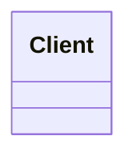

# Module NN — <Title>

<!--
  LESSON TEMPLATE (copy to modules/<module-id>/lesson/lesson.en.md, then translate to lesson.tr.md).
  Rules (CLAUDE.md §7):
  - lesson.en.md and lesson.tr.md must have the SAME heading levels in the SAME order, the same number of code
    blocks with the same languages, and the same `// file:` markers — scripts/check-docs.sh enforces this.
  - Every Java block starts with `// file: <path>` (path suffix of a real file in this module) and must match that
    file's lines. Use a line containing only `// ...` to skip lines between excerpts.
  - Diagrams: ```mermaid blocks (GitHub renders them; the PDF build pre-renders them). Optional width: ```{.mermaid width="50%"}
    is NOT supported by GitHub — keep plain ```mermaid.
  - Pattern names stay English, Turkish term in parentheses on first use (docs/glossary.md).
-->

> **Week N** · Prerequisites: … · Estimated study time: … h
> Run every example without a build: `java <path>/<Demo>.java` (JDK 27)

## Learning outcomes

By the end of this module you can:

1. **Explain** …
2. **Implement** …
3. **Decide** when … and when not to …

## Motivation

<!-- A concrete problem the student recognises, shown with code that hurts. -->

## <Pattern 1>

### Problem

### Intent

### Structure



### Classic Java

```java
// snippet — replace with: // file: examples/<pattern>/<File>.java
```

### Modern Java 27

### Real-world usage

<!-- JDK / framework examples: where the student has already met this pattern. -->

### Pitfalls and when NOT to use it

### Related patterns

## <Pattern 2>

<!-- same subsections as Pattern 1 -->

## Summary

| Pattern | Use when | Avoid when | Java 27 shortcut |
|---|---|---|---|

## Quiz

1. …

<details><summary>Answers</summary>

1. …

</details>

## Assignments

<!-- - [01 — <title>](../assignments/01-<slug>.en.md) -->

## Further reading
