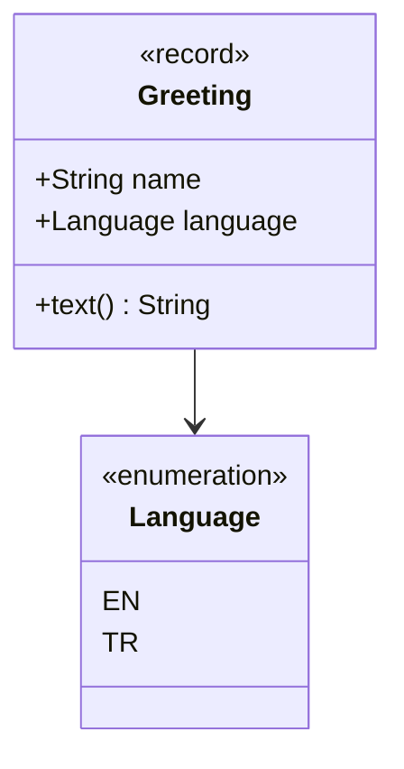

# Sample Lesson — Pipeline Check

> **Week 0** · This sample proves the documentation pipeline (removed in F06).
> Run the example without a build: `java modules/_sample/src/main/java/io/github/aliturgutbozkurt/patterns/sample/GreetingDemo.java`

## Learning outcomes

1. **Render** Markdown with diagrams and code to PDF.
2. **Check** that English and Turkish lessons stay in sync.

## Greeting value

### Structure



### Modern Java 27

A record validates its state in a compact constructor, and a `switch` over the enum is exhaustive:

```java
// file: sample/Greeting.java
public record Greeting(String name, Language language) {

    public Greeting {
        Objects.requireNonNull(language, "language");
        // ...
    }

    /** Returns the greeting text in the chosen language. */
    public String text() {
        return switch (language) {
            case EN -> "Hello, " + name + "!";
            case TR -> "Merhaba, " + name + "!";
        };
    }
}
```

Output of `GreetingDemo`:

```text
Hello, Ada!
Merhaba, Ada!
```

## Quiz

1. Why doesn't the `switch` need a `default` branch?

<details><summary>Answers</summary>

1. The switch covers every enum constant, so the compiler knows it is exhaustive.

</details>

## Further reading

- [Contributing guide](../../../CONTRIBUTING.md)
