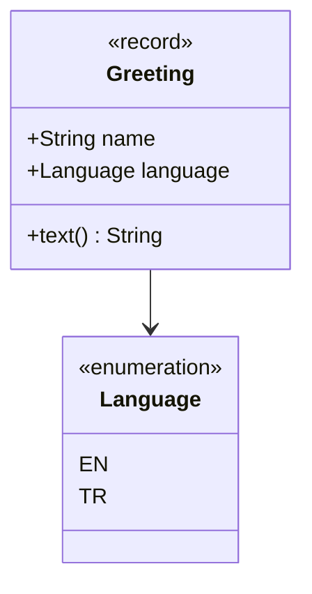

# Örnek Ders — Hat Kontrolü

> **Hafta 0** · Bu örnek, dokümantasyon hattını doğrular (F06'da kaldırılır).
> Örneği derlemeden çalıştırın: `java modules/_sample/src/main/java/io/github/aliturgutbozkurt/patterns/sample/GreetingDemo.java`

## Öğrenme çıktıları

1. Diyagram ve kod içeren Markdown'ı PDF'e **dönüştürmek**.
2. İngilizce ve Türkçe derslerin eşzamanlı kaldığını **kontrol etmek**.

## Selamlama değeri

### Yapı



### Modern Java 27

Bir record (kayıt), durumunu kompakt kurucuda doğrular; enum üzerindeki `switch` ise eksiksizdir (exhaustive):

```java
// file: sample/Greeting.java
public record Greeting(String name, Language language) {

    public Greeting {
        Objects.requireNonNull(language, "language");
        // ...
    }

    /** Returns the greeting text in the chosen language. */
    public String text() {
        return switch (language) {
            case EN -> "Hello, " + name + "!";
            case TR -> "Merhaba, " + name + "!";
        };
    }
}
```

`GreetingDemo` çıktısı:

```text
Hello, Ada!
Merhaba, Ada!
```

## Sınav

1. `switch` neden bir `default` dalına ihtiyaç duymaz?

<details><summary>Cevaplar</summary>

1. Switch tüm enum sabitlerini kapsar; derleyici bu yüzden ifadenin eksiksiz olduğunu bilir. Türkçe karakter testi: ç ğ ı İ ö ş ü Ç Ğ Ö Ş Ü.

</details>

## İleri okuma

- [Katkı rehberi](../../../CONTRIBUTING.md)
