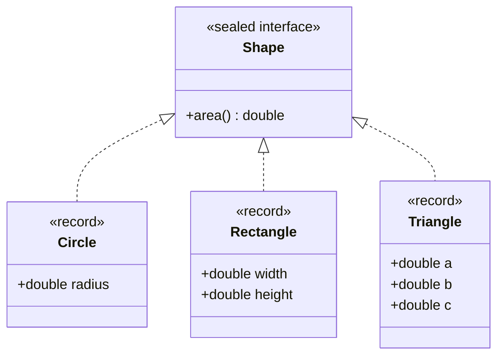
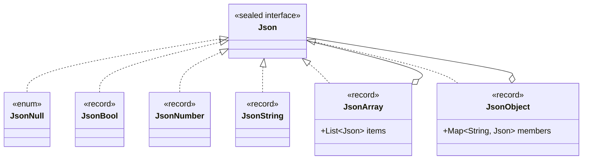

# Module 00 — Setup & Modern Java

> **Week 1** · Prerequisites: Java basics (classes, interfaces, collections, exceptions) · Estimated study time: 4 h
>
> Run every example without a build: `java <path>/<Demo>.java` (JDK 27)

## Learning outcomes

By the end of this module you can:

1. **Install** JDK 27, verify it, and **run** Java code without a build tool.
2. **Model** immutable values with records, including validation in compact constructors.
3. **Model** a closed set of alternatives with a sealed interface and **process** it with an exhaustive `switch`
   using record patterns, guards and unnamed patterns.
4. **Use** lambdas, method references and streams to pass behaviour around as data.
5. **Explain** which design patterns these language features support — and sometimes replace.

## Motivation

Design patterns are named solutions to recurring design problems. Many of the classic ones were catalogued in 1994,
for languages without records, sealed types, pattern matching or lambdas. Modern Java has all four. Some patterns
therefore look very different today, and a few almost disappear into the language.

To see that clearly in the coming weeks, we first need a shared vocabulary. This module is that vocabulary. Every
example here is small, but each one foreshadows a pattern: `Money` is a *value object*, the `Shape` hierarchy is the
starting point of *Visitor*, `Json` is a *Composite*, and passing lambdas around is the essence of *Strategy* and
*Command*.

## Setting up JDK 27

### Install

| OS | How |
|---|---|
| macOS | `brew install --cask temurin` |
| Windows | JDK 27 `.msi` installer from [adoptium.net](https://adoptium.net/temurin/releases/?version=27), tick "Set JAVA_HOME" |
| Linux | [SDKMAN!](https://sdkman.io) (`sdk list java`, pick a `27…-tem` build) or the archive from adoptium.net |

Any JDK 27 distribution works (Temurin, Oracle, Zulu, …). An IDE is optional: everything in this course runs from the
command line.

### Verify

```bash
java -version          # must print 27
./mvnw -v              # the Maven Wrapper downloads Maven on first use and prints "Java version: 27"
```

If several JDKs are installed, point `JAVA_HOME` at JDK 27. On macOS:
`export JAVA_HOME=$(/usr/libexec/java_home -v 27)`. The build refuses to run on an older JDK and tells you why.

### A note for Windows users

Some examples print characters such as `×`, `İ` or `—`. The classic Windows console uses a legacy code page and may
show `?` instead. Use **Windows Terminal**, or run `chcp 65001` once per console window to switch it to UTF-8.

## Running Java without a build

### Compact source files

Since Java 25 a program can be a single file without a class declaration or package, with an instance `main` method
(JEP 512). `IO.println` is a small helper for console output:

```java
// file: first-steps/Hello.java
void main() {
    IO.println("Hello, Java 27!");
    IO.println("Merhaba, Java 27!");
}
```

```bash
java modules/m00-setup-and-modern-java/first-steps/Hello.java
```

The `java` launcher compiles the file in memory and runs it. No `javac`, no build tool, no `.class` files on disk.

### Programs with several files

Real examples need more than one class. Since Java 22 the launcher compiles other source files **on demand** when the
program refers to them (JEP 458):

```java
// file: first-steps/multifile/Main.java
public class Main {
    public static void main(String[] args) {
        System.out.println(new Greeter("Ada").greet());
    }
}
```

```java
// file: first-steps/multifile/Greeter.java
record Greeter(String name) {
    String greet() {
        return "Hello, " + name + " - from two source files!";
    }
}
```

This also works for code inside packages: launch the file with the `main` method, and the launcher finds the other
classes by following the package directories. That is why **every example in this course runs with one `java`
command**, for example:

```bash
java modules/m00-setup-and-modern-java/src/main/java/io/github/aliturgutbozkurt/patterns/m00/examples/records/MoneyDemo.java
```

### When you still need a build tool

The launcher is ideal for learning and for small tools. As soon as you need third-party libraries, tests, or a
packaged application, you use a build tool. This course uses **Maven** through the wrapper (`./mvnw`): example code has
no dependencies, so the launcher works, while tests use JUnit and AssertJ, so they run through Maven.

## Records as value objects

### Problem

Many objects are just *values*: an amount of money, a date range, a coordinate. Before records, a correct value class
needed private final fields, a constructor, accessors, `equals`, `hashCode` and `toString` — around 50 lines where
one bug in `equals` or `hashCode` silently breaks every `HashMap` the object is used in.

### A record

A record declares the state once and gets the rest generated: a canonical constructor, accessor methods, and
value-based `equals`, `hashCode` and `toString`. The fields are `private final`, so a record is immutable — shallowly
(see pitfalls).

```java
// file: examples/records/Money.java
public record Money(BigDecimal amount, Currency currency) {
    // ...
    /** Convenience factory: {@code Money.of("12.50", "EUR")}. */
    public static Money of(String amount, String currencyCode) {
        return new Money(new BigDecimal(amount), Currency.getInstance(currencyCode));
    }

    /** Returns a new value; this one never changes. */
    public Money plus(Money other) {
        if (!currency.equals(other.currency)) {
            throw new IllegalArgumentException("Cannot add " + other.currency + " to " + currency);
        }
        return new Money(amount.add(other.amount), currency);
    }
    // ...
}
```

Operations like `plus` never modify `this`; they **return a new value**. Immutable values can be shared freely between
objects and threads, used as map keys, and never surprise you by changing later.

### Compact constructors

A record can validate and normalise its components in a **compact constructor** — a constructor without a parameter
list. The code runs first; the fields are assigned afterwards with the (possibly reassigned) component values:

```java
// file: examples/records/Money.java
    /** Compact constructor: validates and normalises before the fields are assigned. */
    public Money {
        Objects.requireNonNull(amount, "amount");
        Objects.requireNonNull(currency, "currency");
        if (amount.signum() < 0) {
            throw new IllegalArgumentException("amount must not be negative: " + amount);
        }
        amount = amount.setScale(currency.getDefaultFractionDigits(), RoundingMode.HALF_EVEN);
    }
```

Because `12.5`, `12.50` and `12.500` are normalised to the same scale, `Money.of("12.5", "EUR")` equals
`Money.of("12.50", "EUR")`. Invalid money simply cannot exist: an object that was constructed is an object that is
valid. This is the **"parse, don't validate"** idea you will meet again in m09.

Output of `MoneyDemo`:

```text
price    = 12.50 EUR
shipping = 4.99 EUR
total    = 17.49 EUR
3 × price = 37.50 EUR
12.50 EUR equals 12.5 EUR? true
Cannot add USD to EUR
```

### Flexible constructor bodies

A record may have extra constructors, but they must delegate to the canonical one with `this(...)`. Until Java 25,
`this(...)` had to be the *first* statement, which made "parse, then delegate" awkward. With **flexible constructor
bodies** (JEP 513) you may run code before `this(...)` as long as it does not touch the object under construction:

```java
// file: examples/records/Percentage.java
    /** Parses text such as {@code "15%"} (surrounding spaces allowed). */
    public Percentage(String text) {
        Objects.requireNonNull(text, "text");
        String trimmed = text.strip();
        if (!trimmed.matches("\\d{1,3}%")) {
            throw new IllegalArgumentException("not a percentage: " + text);
        }
        this(Integer.parseInt(trimmed.substring(0, trimmed.length() - 1)));
    }
```

The range check (0–100) still lives in exactly one place — the compact constructor — and every constructor passes
through it.

### Pitfalls

- **Shallow immutability.** A record holding a `List` holds a *reference*. If the caller keeps the list and changes it,
  the record changes too. Copy mutable inputs in the compact constructor (`List.copyOf`) — see `JsonArray` below.
- **Records are not entities.** Two customers with the same name are not the same customer. Use records for values,
  not for things with an identity that persists while their attributes change.
- **No inheritance.** Records are final and cannot extend classes. They can implement interfaces — which is exactly
  what makes them work so well with sealed interfaces.
- **Equality of `double` components** follows `Double.compare`, and value equality is *structural*: 20 °C and 68 °F
  are the same temperature but not equal records (assignment 01 asks you to think about this).

## Sealed hierarchies and pattern matching

### Problem

Some types have a fixed set of variants: a payment is a card payment, a bank transfer or a wallet payment — nothing
else. With an ordinary interface anyone can add a fourth implementation, so code that handles "all" cases needs a
`default` branch that can only throw — and the compiler cannot tell you when a new case appears.

### Sealed interfaces

A **sealed** interface lists its permitted implementations:

```java
// file: examples/sealedtypes/Shape.java
public sealed interface Shape permits Circle, Rectangle, Triangle {

    /** Behaviour that belongs to every shape can still be an ordinary method (object-oriented style). */
    double area();
}
```



Now the compiler knows **all** shapes. Records are the natural implementations: each variant is a small immutable
value that validates itself.

### Exhaustive switch and record patterns

A `switch` over a sealed type can match each variant and, with **record patterns**, take its components apart in the
same step:

```java
// file: examples/sealedtypes/Shapes.java
    public static double perimeter(Shape shape) {
        return switch (shape) {
            case Circle(double r) -> 2 * Math.PI * r;
            case Rectangle(double w, double h) -> 2 * (w + h);
            case Triangle(double a, double b, double c) -> a + b + c;
        };
    }
```

There is **no `default` branch** — and there must not be. The switch is *exhaustive* because the compiler knows every
permitted subtype. If someone adds a `Hexagon`, this method stops compiling until it is handled. A `default` would
silently swallow the new case.

### Guards and unnamed patterns

A `when` clause (a **guard**) refines a case; order matters, so special cases come first. The unnamed pattern `_`
(JEP 456) says "I don't need this value":

```java
// file: examples/sealedtypes/Shapes.java
    public static String describe(Shape shape) {
        return switch (shape) {
            case Circle(double r) when r == 0 -> "a point";
            case Circle(double r) -> "a circle with radius " + r;
            case Rectangle(double w, double h) when w == h -> "a " + w + " × " + h + " square";
            case Rectangle(double w, double h) -> "a " + w + " × " + h + " rectangle";
            case Triangle _ -> "a triangle";
        };
    }
```

Output of `ShapeDemo`:

```text
a circle with radius 1.0: area 3.14, perimeter 6.28
a 2.0 × 2.0 square: area 4.00, perimeter 8.00
a 2.0 × 3.0 rectangle: area 6.00, perimeter 10.00
a triangle: area 6.00, perimeter 12.00
a point: area 0.00, perimeter 0.00
```

### A recursive example: JSON

Sealed types can be recursive. A JSON value is null, a boolean, a number, a string, an array *of JSON values*, or an
object *mapping names to JSON values*:



Rendering the whole tree is one switch that calls itself for nested values:

```java
// file: examples/sealedtypes/Json.java
    static String render(Json json) {
        return switch (json) {
            case JsonNull _ -> "null";
            case JsonBool(boolean value) -> String.valueOf(value);
            case JsonNumber(double value) when value == Math.rint(value) && !Double.isInfinite(value) ->
                    String.valueOf((long) value);
            case JsonNumber(double value) -> String.valueOf(value);
            case JsonString(String value) -> quote(value);
            case JsonArray(List<Json> items) -> items.stream().map(Json::render).collect(joining(",", "[", "]"));
            case JsonObject(Map<String, Json> members) -> members.entrySet().stream()
                    .map(member -> quote(member.getKey()) + ":" + render(member.getValue()))
                    .collect(joining(",", "{", "}"));
        };
    }
```

Patterns also nest inside `instanceof`, which reads almost like the requirement itself — "an object whose member
`key` is a string":

```java
// file: examples/sealedtypes/Json.java
    static Optional<String> stringAt(Json json, String key) {
        if (json instanceof JsonObject(var members) && members.get(key) instanceof JsonString(String value)) {
            return Optional.of(value);
        }
        return Optional.empty();
    }
```

Two details worth copying: `JsonNull` is an `enum` with one constant (there is exactly one null), and the container
records copy their inputs so the tree really is immutable:

```java
// file: examples/sealedtypes/JsonArray.java
public record JsonArray(List<Json> items) implements Json {

    public JsonArray {
        items = List.copyOf(items);
    }
}
```

A tree in which leaves and containers share one type is the **Composite** pattern (m05). Walking it with a switch is
what **Interpreter** and **Visitor** (m08) are about.

### Two ways to add behaviour

`Shape` shows both styles side by side. `area()` is a method **on** each record (object-oriented): adding a new shape
is easy, adding a new operation means touching every record. `Shapes.perimeter` and `Shapes.describe` are functions
**over** the hierarchy (data-oriented): adding an operation is easy, adding a shape makes every switch fail to compile
until updated. Neither is always right — this trade-off, known as the *expression problem*, returns in m08 and m09.

## Functions and streams

### Behaviour as data

A lambda or method reference is an object that *is* a piece of behaviour. You can store it, pass it, and combine it:

```java
// file: examples/functional/TextPipeline.java
    /** strip → collapse whitespace → lower-case, composed with {@code andThen}. */
    public static Function<String, String> normalize() {
        Function<String, String> strip = String::strip;
        return strip.andThen(text -> text.replaceAll("\\s+", " ")).andThen(String::toLowerCase);
    }

    /** Composes any list of steps, left to right. An empty list is the identity function. */
    public static Function<String, String> compose(List<UnaryOperator<String>> steps) {
        Function<String, String> pipeline = Function.identity();
        for (UnaryOperator<String> step : steps) {
            pipeline = pipeline.andThen(step);
        }
        return pipeline;
    }
```

The steps are **data**: a list you can build at runtime, reorder or extend without changing `compose`. Choosing an
algorithm at runtime is the **Strategy** pattern; treating a request as an object is **Command** — both in m06.

### Collectors

Streams describe *what* to compute. A collector says how to gather the results — here, revenue grouped by category into
a sorted map:

```java
// file: examples/functional/OrderStats.java
    public static Map<String, Money> revenueByCategory(List<OrderLine> lines) {
        return lines.stream().collect(groupingBy(
                OrderLine::category,
                TreeMap::new,
                Collectors.mapping(OrderLine::total, reducing(null, (a, b) -> a == null ? b : a.plus(b)))));
    }
```

### Gatherers and sequenced collections

Two recent additions make everyday code shorter. **Stream gatherers** (JEP 485) add custom intermediate operations —
the built-in `windowFixed` splits a stream into batches. **Sequenced collections** (JEP 431) give lists, deques and
ordered sets `getFirst`, `getLast` and a `reversed()` *view*:

```java
// file: examples/functional/OrderStats.java
    public static List<List<OrderLine>> batches(List<OrderLine> lines, int size) {
        return lines.stream().gather(Gatherers.windowFixed(size)).toList();
    }

    /** Sequenced collections (JEP 431): a reversed view without copying or index arithmetic. */
    public static List<String> newestFirst(List<OrderLine> lines) {
        return lines.reversed().stream().map(OrderLine::product).toList();
    }
```

Output of `OrderStatsDemo`:

```text
revenue by category: {books=146.00 EUR, hardware=199.75 EUR}
best seller: Mouse (5 pcs)
batches of 3: [[Keyboard, Patterns book, Mouse], [Java 27 guide]]
newest first: [Java 27 guide, Mouse, Patterns book, Keyboard]
```

## Where these features meet design patterns

| Feature | Supports | You will see it in |
|---|---|---|
| Records | Value Object, immutable messages, Memento snapshots, DTOs | m03 Builder, m07 Memento, m09 |
| Compact / flexible constructors | Always-valid objects; validation in one place | m03 Builder, capstone |
| Sealed interfaces | Closed hierarchies the compiler can check | m05 Composite, m08 State / Visitor / Interpreter |
| Pattern matching `switch` | Operations over a hierarchy without double dispatch | m08 Visitor vs. patterns, m09 |
| Lambdas & method references | One-method objects without a class | m06 Strategy, Command, Template Method |
| Function composition | Pipelines of interchangeable steps | m04 Decorator, m07 Chain of Responsibility |
| Streams & gatherers | Declarative iteration | m06 Iterator |

## Summary

| Feature | Use when | Avoid when | Java 27 shortcut |
|---|---|---|---|
| Record | The object is a value: equal when its data is equal | It has an identity or must change over time | `record Money(BigDecimal amount, Currency currency)` |
| Sealed interface | The set of variants is closed and known | Third parties must add implementations | `sealed interface Shape permits …` |
| Pattern-matching `switch` | Operations over a sealed hierarchy | Every variant should carry the behaviour itself | `case Circle(double r) when r == 0 ->` |
| Lambda | A single method of behaviour | The behaviour needs state or many methods | `String::strip` |
| Source launcher | Learning, scripts, small tools | Dependencies, packaging, tests | `java File.java` |

## Quiz

1. Which methods does the compiler generate for `record Point(int x, int y)`?
2. A record has a `List<String> tags` component. How can a caller still change the record's state, and how do you
   prevent it?
3. What can a compact constructor do that an ordinary method cannot, and what can it *not* do?
4. Why should a `switch` over a sealed interface have no `default` branch?
5. In `Shapes.describe`, what happens if you move `case Circle(double r)` above `case Circle(double r) when r == 0`?
6. What does `_` mean in `case Triangle _` and in `case CardPayment(BigDecimal amount, _)`?
7. When would you rather add a method to every record than write a `switch` over the hierarchy?
8. What does `java Main.java` do when `Main` refers to a class declared in `Greeter.java`?

<details><summary>Answers</summary>

1. A canonical constructor, accessors `x()` and `y()`, and `equals`, `hashCode` and `toString` based on both
   components.
2. The caller keeps its reference to the original list and mutates it. Copy it in the compact constructor:
   `tags = List.copyOf(tags);`.
3. It can validate and reassign component parameters before the fields are set. It cannot assign the fields directly
   (`this.x = …`) and it cannot skip the automatic field assignment.
4. The switch is already exhaustive. A `default` would hide new subtypes that are added later, instead of letting the
   compiler point at every switch that must be updated.
5. It does not compile: the unguarded case dominates the guarded one, which could never match.
6. It is the unnamed pattern: the value (or component) is matched but not bound to a variable, because it is not used.
7. When new variants are added more often than new operations, or when the behaviour belongs to the variant's own
   invariants (like `area()`).
8. The launcher compiles `Greeter.java` from the same directory in memory when it is first needed, then runs `main`.

</details>

## Assignments

- [01 — Temperature value object](../assignments/01-temperature.en.md) ★☆☆
- [02 — Payment fees with a sealed hierarchy](../assignments/02-payment-fees.en.md) ★★☆

## Further reading

- JEP 512 — [Compact Source Files and Instance Main Methods](https://openjdk.org/jeps/512)
- JEP 458 — [Launch Multi-File Source-Code Programs](https://openjdk.org/jeps/458)
- JEP 395 — [Records](https://openjdk.org/jeps/395) · JEP 513 — [Flexible Constructor Bodies](https://openjdk.org/jeps/513)
- JEP 409 — [Sealed Classes](https://openjdk.org/jeps/409) · JEP 441 — [Pattern Matching for switch](https://openjdk.org/jeps/441) · JEP 440 — [Record Patterns](https://openjdk.org/jeps/440) · JEP 456 — [Unnamed Variables & Patterns](https://openjdk.org/jeps/456)
- JEP 485 — [Stream Gatherers](https://openjdk.org/jeps/485) · JEP 431 — [Sequenced Collections](https://openjdk.org/jeps/431)
- Course notes on which Java features are final or preview: [docs/java27-features.md](../../../docs/java27-features.md)
