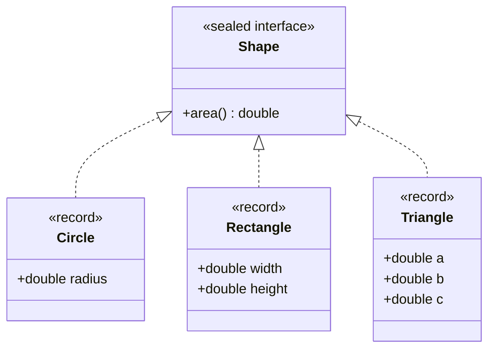
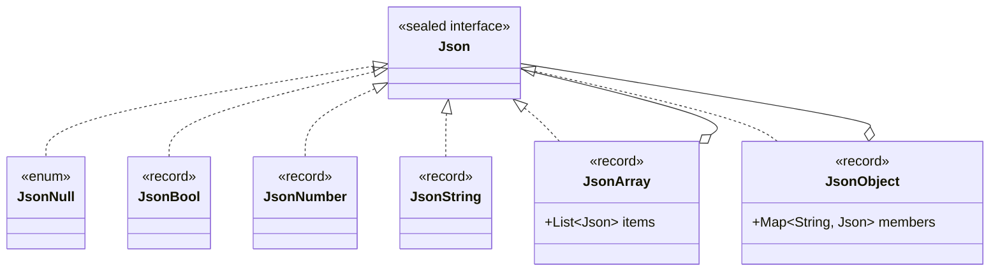

# Modül 00 — Kurulum ve Modern Java

> **1. Hafta** · Ön koşullar: temel Java (sınıflar, arayüzler, koleksiyonlar, istisnalar) · Tahmini çalışma süresi: 4 saat
>
> Her örneği derlemeden çalıştırın: `java <yol>/<Demo>.java` (JDK 27)

## Öğrenme çıktıları

Bu modülün sonunda:

1. JDK 27'yi **kurar**, doğrular ve Java kodunu bir derleme aracı olmadan **çalıştırırsınız**.
2. Değişmez değerleri record'larla, kompakt kuruculardaki doğrulama dahil **modellersiniz**.
3. Kapalı bir seçenekler kümesini sealed (mühürlü) bir arayüzle **modeller**, record desenleri, koşullar (guard) ve
   isimsiz desenlerle eksiksiz (exhaustive) bir `switch` kullanarak **işlersiniz**.
4. Davranışı veri gibi taşımak için lambda'ları, metot referanslarını ve stream'leri **kullanırsınız**.
5. Bu dil özelliklerinin hangi tasarım kalıplarını desteklediğini — ve bazen gereksiz kıldığını — **açıklarsınız**.

## Motivasyon

Tasarım kalıpları, tekrar eden tasarım problemlerine verilmiş isimli çözümlerdir. Klasik kalıpların çoğu 1994'te,
record'ları, sealed tipleri, desen eşlemesi (pattern matching) ve lambda'ları olmayan diller için kataloglandı. Modern
Java'da bu dördü de var. Bu yüzden bazı kalıplar bugün çok farklı görünür, birkaçı ise neredeyse dilin içinde kaybolur.

Önümüzdeki haftalarda bunu net görebilmek için önce ortak bir kelime dağarcığına ihtiyacımız var. Bu modül o kelime
dağarcığıdır. Buradaki her örnek küçüktür ama her biri bir kalıbın habercisidir: `Money` bir *değer nesnesidir*,
`Shape` hiyerarşisi *Visitor* (Ziyaretçi) kalıbının başlangıç noktasıdır, `Json` bir *Composite* (Bileşik) yapıdır ve
lambda'ları bir yerden bir yere taşımak *Strategy* (Strateji) ile *Command* (Komut) kalıplarının özüdür.

## JDK 27 kurulumu

### Kurulum

| İşletim sistemi | Nasıl |
|---|---|
| macOS | `brew install --cask temurin` |
| Windows | [adoptium.net](https://adoptium.net/temurin/releases/?version=27) adresinden JDK 27 `.msi` yükleyicisi; "Set JAVA_HOME" seçeneğini işaretleyin |
| Linux | [SDKMAN!](https://sdkman.io) (`sdk list java`, bir `27…-tem` sürümü seçin) ya da adoptium.net arşivi |

Herhangi bir JDK 27 dağıtımı olur (Temurin, Oracle, Zulu, …). IDE isteğe bağlıdır: bu dersteki her şey komut
satırından çalışır.

### Doğrulama

```bash
java -version          # 27 yazmalı
./mvnw -v              # Maven Wrapper ilk kullanımda Maven'i indirir ve "Java version: 27" yazar
```

Birden fazla JDK kuruluysa `JAVA_HOME`'u JDK 27'ye yönlendirin. macOS'ta:
`export JAVA_HOME=$(/usr/libexec/java_home -v 27)`. Build daha eski bir JDK ile çalışmayı reddeder ve nedenini söyler.

### Windows kullanıcıları için bir not

Bazı örnekler `×`, `İ` ya da `—` gibi karakterler yazdırır. Klasik Windows konsolu eski bir kod sayfası kullanır ve
bunların yerine `?` gösterebilir. **Windows Terminal** kullanın ya da her konsol penceresinde bir kez `chcp 65001`
çalıştırarak konsolu UTF-8'e geçirin.

## Java'yı derlemeden çalıştırmak

### Kompakt kaynak dosyalar

Java 25'ten beri bir program; sınıf bildirimi ve paket olmadan, örnek (instance) `main` metoduna sahip tek bir dosya
olabilir (JEP 512). `IO.println` konsol çıktısı için küçük bir yardımcıdır:

```java
// file: first-steps/Hello.java
void main() {
    IO.println("Hello, Java 27!");
    IO.println("Merhaba, Java 27!");
}
```

```bash
java modules/m00-setup-and-modern-java/first-steps/Hello.java
```

`java` başlatıcısı dosyayı bellekte derler ve çalıştırır. `javac` yok, derleme aracı yok, diskte `.class` dosyası yok.

### Birden fazla dosyalı programlar

Gerçek örnekler birden fazla sınıfa ihtiyaç duyar. Java 22'den beri başlatıcı, program başka kaynak dosyalara
başvurduğunda onları **ihtiyaç anında** derler (JEP 458):

```java
// file: first-steps/multifile/Main.java
public class Main {
    public static void main(String[] args) {
        System.out.println(new Greeter("Ada").greet());
    }
}
```

```java
// file: first-steps/multifile/Greeter.java
record Greeter(String name) {
    String greet() {
        return "Hello, " + name + " - from two source files!";
    }
}
```

Bu, paketlerin içindeki kod için de çalışır: `main` metodunu içeren dosyayı başlatırsınız, başlatıcı diğer sınıfları
paket klasörlerini izleyerek bulur. Bu yüzden **bu dersteki her örnek tek bir `java` komutuyla çalışır**, örneğin:

```bash
java modules/m00-setup-and-modern-java/src/main/java/io/github/aliturgutbozkurt/patterns/m00/examples/records/MoneyDemo.java
```

### Derleme aracına ne zaman yine de ihtiyaç duyulur

Başlatıcı öğrenmek ve küçük araçlar için idealdir. Üçüncü taraf kütüphanelere, testlere ya da paketlenmiş bir
uygulamaya ihtiyaç duyduğunuz anda bir derleme aracı kullanırsınız. Bu ders **Maven**'i wrapper üzerinden (`./mvnw`)
kullanır: örnek kodların bağımlılığı yoktur, bu yüzden başlatıcı çalışır; testler ise JUnit ve AssertJ kullandığı için
Maven üzerinden çalışır.

## Değer nesnesi olarak record'lar

### Problem

Birçok nesne yalnızca birer *değerdir*: bir miktar para, bir tarih aralığı, bir koordinat. Record'lardan önce doğru bir
değer sınıfı; private final alanlar, bir kurucu, erişim metotları, `equals`, `hashCode` ve `toString` gerektirirdi —
yaklaşık 50 satır. `equals` ya da `hashCode`'daki tek bir hata, nesnenin kullanıldığı her `HashMap`'i sessizce bozar.

### Bir record

Bir record durumunu bir kez bildirir, gerisi üretilir: kanonik bir kurucu, erişim metotları ve değere dayalı `equals`,
`hashCode` ve `toString`. Alanlar `private final` olduğundan record değişmezdir — yüzeysel olarak (tuzaklara bakın).

```java
// file: examples/records/Money.java
public record Money(BigDecimal amount, Currency currency) {
    // ...
    /** Convenience factory: {@code Money.of("12.50", "EUR")}. */
    public static Money of(String amount, String currencyCode) {
        return new Money(new BigDecimal(amount), Currency.getInstance(currencyCode));
    }

    /** Returns a new value; this one never changes. */
    public Money plus(Money other) {
        if (!currency.equals(other.currency)) {
            throw new IllegalArgumentException("Cannot add " + other.currency + " to " + currency);
        }
        return new Money(amount.add(other.amount), currency);
    }
    // ...
}
```

`plus` gibi işlemler `this`'i asla değiştirmez; **yeni bir değer döndürür**. Değişmez değerler nesneler ve iş
parçacıkları arasında serbestçe paylaşılabilir, map anahtarı olarak kullanılabilir ve sonradan değişerek sizi asla
şaşırtmaz.

### Kompakt kurucular

Bir record, bileşenlerini bir **kompakt kurucuda** — parametre listesi olmayan bir kurucuda — doğrulayabilir ve
normalleştirebilir. Önce kod çalışır; alanlar ardından (yeniden atanmış olabilecek) bileşen değerleriyle atanır:

```java
// file: examples/records/Money.java
    /** Compact constructor: validates and normalises before the fields are assigned. */
    public Money {
        Objects.requireNonNull(amount, "amount");
        Objects.requireNonNull(currency, "currency");
        if (amount.signum() < 0) {
            throw new IllegalArgumentException("amount must not be negative: " + amount);
        }
        amount = amount.setScale(currency.getDefaultFractionDigits(), RoundingMode.HALF_EVEN);
    }
```

`12.5`, `12.50` ve `12.500` aynı ölçeğe normalleştirildiği için `Money.of("12.5", "EUR")`, `Money.of("12.50", "EUR")`'ya
eşittir. Geçersiz para basitçe var olamaz: oluşturulmuş bir nesne, geçerli bir nesnedir. Bu, m09'da tekrar
karşılaşacağınız **"ayrıştır, doğrulama" (parse, don't validate)** fikridir.

`MoneyDemo` çıktısı:

```text
price    = 12.50 EUR
shipping = 4.99 EUR
total    = 17.49 EUR
3 × price = 37.50 EUR
12.50 EUR equals 12.5 EUR? true
Cannot add USD to EUR
```

### Esnek kurucu gövdeleri

Bir record ek kuruculara sahip olabilir ama bunlar `this(...)` ile kanonik kurucuya devretmek zorundadır. Java 25'e
kadar `this(...)` *ilk* ifade olmak zorundaydı; bu da "önce ayrıştır, sonra devret" yaklaşımını zahmetli kılıyordu.
**Esnek kurucu gövdeleri** (JEP 513) ile, inşa edilmekte olan nesneye dokunmadığı sürece `this(...)`'dan önce kod
çalıştırabilirsiniz:

```java
// file: examples/records/Percentage.java
    /** Parses text such as {@code "15%"} (surrounding spaces allowed). */
    public Percentage(String text) {
        Objects.requireNonNull(text, "text");
        String trimmed = text.strip();
        if (!trimmed.matches("\\d{1,3}%")) {
            throw new IllegalArgumentException("not a percentage: " + text);
        }
        this(Integer.parseInt(trimmed.substring(0, trimmed.length() - 1)));
    }
```

Aralık kontrolü (0–100) hâlâ tek bir yerde — kompakt kurucuda — durur ve her kurucu oradan geçer.

### Tuzaklar

- **Yüzeysel değişmezlik.** Bir `List` tutan record bir *referans* tutar. Çağıran listeyi saklar ve değiştirirse
  record da değişir. Değiştirilebilir girdileri kompakt kurucuda kopyalayın (`List.copyOf`) — aşağıdaki `JsonArray`'e
  bakın.
- **Record'lar varlık (entity) değildir.** Aynı ada sahip iki müşteri aynı müşteri değildir. Record'ları değerler için
  kullanın; öznitelikleri değişirken kimliğini koruyan şeyler için değil.
- **Kalıtım yok.** Record'lar final'dır ve sınıf genişletemez. Arayüz uygulayabilirler — onları sealed arayüzlerle bu
  kadar uyumlu kılan da budur.
- **`double` bileşenlerin eşitliği** `Double.compare`'i izler ve değer eşitliği *yapısaldır*: 20 °C ile 68 °F aynı
  sıcaklıktır ama eşit record'lar değildir (01 numaralı ödev bunu düşünmenizi ister).

## Sealed hiyerarşiler ve desen eşleme

### Problem

Bazı tiplerin sabit bir varyant kümesi vardır: bir ödeme ya kart ödemesidir, ya banka havalesidir ya da cüzdan
ödemesidir — başka bir şey değil. Sıradan bir arayüzde herkes dördüncü bir uygulama ekleyebilir; bu yüzden "tüm"
durumları işleyen kod, yalnızca istisna fırlatabilen bir `default` dalına ihtiyaç duyar — ve yeni bir durum ortaya
çıktığında derleyici size bunu söyleyemez.

### Sealed arayüzler

**Sealed** bir arayüz, izin verilen uygulamalarını listeler:

```java
// file: examples/sealedtypes/Shape.java
public sealed interface Shape permits Circle, Rectangle, Triangle {

    /** Behaviour that belongs to every shape can still be an ordinary method (object-oriented style). */
    double area();
}
```



Artık derleyici **tüm** şekilleri bilir. Record'lar doğal uygulamalardır: her varyant, kendini doğrulayan küçük ve
değişmez bir değerdir.

### Eksiksiz switch ve record desenleri

Sealed bir tip üzerindeki `switch` her varyantı eşleyebilir ve **record desenleri** ile bileşenlerini aynı adımda
ayrıştırabilir:

```java
// file: examples/sealedtypes/Shapes.java
    public static double perimeter(Shape shape) {
        return switch (shape) {
            case Circle(double r) -> 2 * Math.PI * r;
            case Rectangle(double w, double h) -> 2 * (w + h);
            case Triangle(double a, double b, double c) -> a + b + c;
        };
    }
```

**`default` dalı yok** — ve olmamalı. Switch *eksiksizdir*, çünkü derleyici izin verilen her alt tipi bilir. Biri bir
`Hexagon` eklerse bu metot, yeni durum işlenene kadar derlenmez. Bir `default` ise yeni durumu sessizce yutardı.

### Koşullar ve isimsiz desenler

Bir `when` ifadesi (bir **guard**, koşul) bir durumu daraltır; sıra önemlidir, bu yüzden özel durumlar önce gelir.
İsimsiz desen `_` (JEP 456) "bu değere ihtiyacım yok" demektir:

```java
// file: examples/sealedtypes/Shapes.java
    public static String describe(Shape shape) {
        return switch (shape) {
            case Circle(double r) when r == 0 -> "a point";
            case Circle(double r) -> "a circle with radius " + r;
            case Rectangle(double w, double h) when w == h -> "a " + w + " × " + h + " square";
            case Rectangle(double w, double h) -> "a " + w + " × " + h + " rectangle";
            case Triangle _ -> "a triangle";
        };
    }
```

`ShapeDemo` çıktısı:

```text
a circle with radius 1.0: area 3.14, perimeter 6.28
a 2.0 × 2.0 square: area 4.00, perimeter 8.00
a 2.0 × 3.0 rectangle: area 6.00, perimeter 10.00
a triangle: area 6.00, perimeter 12.00
a point: area 0.00, perimeter 0.00
```

### Özyinelemeli bir örnek: JSON

Sealed tipler özyinelemeli olabilir. Bir JSON değeri null, bir boolean, bir sayı, bir metin, *JSON değerlerinden
oluşan* bir dizi ya da *adları JSON değerlerine eşleyen* bir nesnedir:



Tüm ağacı yazdırmak, iç içe değerler için kendini çağıran tek bir switch'tir:

```java
// file: examples/sealedtypes/Json.java
    static String render(Json json) {
        return switch (json) {
            case JsonNull _ -> "null";
            case JsonBool(boolean value) -> String.valueOf(value);
            case JsonNumber(double value) when value == Math.rint(value) && !Double.isInfinite(value) ->
                    String.valueOf((long) value);
            case JsonNumber(double value) -> String.valueOf(value);
            case JsonString(String value) -> quote(value);
            case JsonArray(List<Json> items) -> items.stream().map(Json::render).collect(joining(",", "[", "]"));
            case JsonObject(Map<String, Json> members) -> members.entrySet().stream()
                    .map(member -> quote(member.getKey()) + ":" + render(member.getValue()))
                    .collect(joining(",", "{", "}"));
        };
    }
```

Desenler `instanceof` içinde de iç içe kullanılabilir ve neredeyse gereksinimin kendisi gibi okunur — "`key` üyesi bir
metin olan bir nesne":

```java
// file: examples/sealedtypes/Json.java
    static Optional<String> stringAt(Json json, String key) {
        if (json instanceof JsonObject(var members) && members.get(key) instanceof JsonString(String value)) {
            return Optional.of(value);
        }
        return Optional.empty();
    }
```

Örnek alınmaya değer iki ayrıntı: `JsonNull` tek sabitli bir `enum`'dur (tam olarak bir tane null vardır) ve kapsayıcı
record'lar girdilerini kopyalar; böylece ağaç gerçekten değişmez olur:

```java
// file: examples/sealedtypes/JsonArray.java
public record JsonArray(List<Json> items) implements Json {

    public JsonArray {
        items = List.copyOf(items);
    }
}
```

Yaprakların ve kapsayıcıların aynı tipi paylaştığı ağaç **Composite** (Bileşik) kalıbıdır (m05). Onu bir switch ile
dolaşmak ise **Interpreter** (Yorumlayıcı) ve **Visitor** (Ziyaretçi) kalıplarının (m08) konusudur.

### Davranış eklemenin iki yolu

`Shape` iki üslubu yan yana gösterir. `area()` her record'un **üzerinde** bir metottur (nesne yönelimli): yeni bir şekil
eklemek kolaydır, yeni bir işlem eklemek her record'a dokunmayı gerektirir. `Shapes.perimeter` ve `Shapes.describe`
hiyerarşinin **üzerinden** çalışan fonksiyonlardır (veri odaklı): işlem eklemek kolaydır, şekil eklemek ise her
switch'in güncellenene kadar derlenmemesine yol açar. Hiçbiri her zaman doğru değildir — *ifade problemi*
(expression problem) olarak bilinen bu ödünleşim m08 ve m09'da geri gelecek.

## Fonksiyonlar ve stream'ler

### Veri olarak davranış

Bir lambda ya da metot referansı, bir davranış parçası *olan* bir nesnedir. Onu saklayabilir, aktarabilir ve
birleştirebilirsiniz:

```java
// file: examples/functional/TextPipeline.java
    /** strip → collapse whitespace → lower-case, composed with {@code andThen}. */
    public static Function<String, String> normalize() {
        Function<String, String> strip = String::strip;
        return strip.andThen(text -> text.replaceAll("\\s+", " ")).andThen(String::toLowerCase);
    }

    /** Composes any list of steps, left to right. An empty list is the identity function. */
    public static Function<String, String> compose(List<UnaryOperator<String>> steps) {
        Function<String, String> pipeline = Function.identity();
        for (UnaryOperator<String> step : steps) {
            pipeline = pipeline.andThen(step);
        }
        return pipeline;
    }
```

Adımlar **veridir**: çalışma zamanında oluşturabileceğiniz, `compose`'u değiştirmeden yeniden sıralayabileceğiniz ya da
genişletebileceğiniz bir liste. Çalışma zamanında algoritma seçmek **Strategy** (Strateji) kalıbıdır; bir isteği nesne
olarak ele almak **Command** (Komut) kalıbıdır — ikisi de m06'da.

### Collector'lar

Stream'ler *neyin* hesaplanacağını tarif eder. Bir collector ise sonuçların nasıl toplanacağını söyler — burada
kategoriye göre gruplanmış ciro, sıralı bir map'e:

```java
// file: examples/functional/OrderStats.java
    public static Map<String, Money> revenueByCategory(List<OrderLine> lines) {
        return lines.stream().collect(groupingBy(
                OrderLine::category,
                TreeMap::new,
                Collectors.mapping(OrderLine::total, reducing(null, (a, b) -> a == null ? b : a.plus(b)))));
    }
```

### Gatherer'lar ve sıralı koleksiyonlar

İki yeni ekleme gündelik kodu kısaltır. **Stream gatherer'lar** (JEP 485) özel ara işlemler ekler — yerleşik
`windowFixed` bir stream'i gruplara böler. **Sıralı koleksiyonlar** (sequenced collections, JEP 431) listelere,
deque'lere ve sıralı kümelere `getFirst`, `getLast` ve bir `reversed()` *görünümü* kazandırır:

```java
// file: examples/functional/OrderStats.java
    public static List<List<OrderLine>> batches(List<OrderLine> lines, int size) {
        return lines.stream().gather(Gatherers.windowFixed(size)).toList();
    }

    /** Sequenced collections (JEP 431): a reversed view without copying or index arithmetic. */
    public static List<String> newestFirst(List<OrderLine> lines) {
        return lines.reversed().stream().map(OrderLine::product).toList();
    }
```

`OrderStatsDemo` çıktısı:

```text
revenue by category: {books=146.00 EUR, hardware=199.75 EUR}
best seller: Mouse (5 pcs)
batches of 3: [[Keyboard, Patterns book, Mouse], [Java 27 guide]]
newest first: [Java 27 guide, Mouse, Patterns book, Keyboard]
```

## Bu özellikler tasarım kalıplarıyla nerede buluşuyor

| Özellik | Desteklediği | Göreceğiniz yer |
|---|---|---|
| Record'lar | Değer nesnesi, değişmez mesajlar, Memento anlık görüntüleri, DTO'lar | m03 Builder, m07 Memento, m09 |
| Kompakt / esnek kurucular | Her zaman geçerli nesneler; doğrulama tek yerde | m03 Builder, bitirme projesi |
| Sealed arayüzler | Derleyicinin kontrol edebildiği kapalı hiyerarşiler | m05 Composite, m08 State / Visitor / Interpreter |
| Desen eşlemeli `switch` | Çift yönlendirme olmadan hiyerarşi üzerinde işlemler | m08 Visitor ve desenler, m09 |
| Lambda'lar ve metot referansları | Sınıf yazmadan tek metotlu nesneler | m06 Strategy, Command, Template Method |
| Fonksiyon bileşimi | Değiştirilebilir adımlardan oluşan hatlar | m04 Decorator, m07 Chain of Responsibility |
| Stream'ler ve gatherer'lar | Bildirimsel yineleme | m06 Iterator |

## Özet

| Özellik | Ne zaman kullanılır | Ne zaman kaçınılır | Java 27 kısayolu |
|---|---|---|---|
| Record | Nesne bir değerse: verisi eşitse kendisi de eşittir | Bir kimliği varsa ya da zamanla değişmesi gerekiyorsa | `record Money(BigDecimal amount, Currency currency)` |
| Sealed arayüz | Varyant kümesi kapalı ve biliniyorsa | Üçüncü tarafların uygulama eklemesi gerekiyorsa | `sealed interface Shape permits …` |
| Desen eşlemeli `switch` | Sealed bir hiyerarşi üzerindeki işlemler | Davranışı her varyantın kendisi taşımalıysa | `case Circle(double r) when r == 0 ->` |
| Lambda | Tek metotluk bir davranış | Davranış durum ya da birçok metot gerektiriyorsa | `String::strip` |
| Kaynak kod başlatıcı | Öğrenme, betikler, küçük araçlar | Bağımlılıklar, paketleme, testler | `java File.java` |

## Sınav

1. Derleyici `record Point(int x, int y)` için hangi metotları üretir?
2. Bir record'un `List<String> tags` bileşeni var. Çağıran, record'un durumunu yine de nasıl değiştirebilir ve bunu
   nasıl önlersiniz?
3. Kompakt bir kurucu, sıradan bir metodun yapamadığı neyi yapabilir; neyi *yapamaz*?
4. Sealed bir arayüz üzerindeki `switch` neden `default` dalı içermemelidir?
5. `Shapes.describe` içinde `case Circle(double r)` satırını `case Circle(double r) when r == 0` satırının üstüne
   taşırsanız ne olur?
6. `case Triangle _` ve `case CardPayment(BigDecimal amount, _)` ifadelerinde `_` ne anlama gelir?
7. Hiyerarşi üzerinde bir `switch` yazmak yerine ne zaman her record'a bir metot eklemeyi tercih edersiniz?
8. `Main`, `Greeter.java` içinde bildirilen bir sınıfa başvurduğunda `java Main.java` ne yapar?

<details><summary>Cevaplar</summary>

1. Kanonik bir kurucu, `x()` ve `y()` erişim metotları ve iki bileşene dayalı `equals`, `hashCode` ve `toString`.
2. Çağıran, orijinal listeye olan referansını saklar ve listeyi değiştirir. Kompakt kurucuda kopyalayın:
   `tags = List.copyOf(tags);`.
3. Alanlar atanmadan önce bileşen parametrelerini doğrulayabilir ve yeniden atayabilir. Alanlara doğrudan atama
   yapamaz (`this.x = …`) ve otomatik alan atamasını atlayamaz.
4. Switch zaten eksiksizdir. Bir `default`, derleyicinin güncellenmesi gereken her switch'i göstermesine izin vermek
   yerine sonradan eklenen yeni alt tipleri gizlerdi.
5. Derlenmez: koşulsuz durum, asla eşleşemeyecek olan koşullu durumu gölgeler (dominate eder).
6. İsimsiz desendir: değer (ya da bileşen) eşlenir ama kullanılmadığı için bir değişkene bağlanmaz.
7. Yeni varyantlar yeni işlemlerden daha sık ekleniyorsa ya da davranış varyantın kendi değişmezlerine aitse
   (`area()` gibi).
8. Başlatıcı, ihtiyaç duyulduğu ilk anda aynı klasördeki `Greeter.java`'yı bellekte derler, ardından `main`'i çalıştırır.

</details>

## Ödevler

- [01 — Sıcaklık değer nesnesi](../assignments/01-temperature.tr.md) ★☆☆
- [02 — Sealed hiyerarşi ile ödeme ücretleri](../assignments/02-payment-fees.tr.md) ★★☆

## İleri okuma

- JEP 512 — [Compact Source Files and Instance Main Methods](https://openjdk.org/jeps/512)
- JEP 458 — [Launch Multi-File Source-Code Programs](https://openjdk.org/jeps/458)
- JEP 395 — [Records](https://openjdk.org/jeps/395) · JEP 513 — [Flexible Constructor Bodies](https://openjdk.org/jeps/513)
- JEP 409 — [Sealed Classes](https://openjdk.org/jeps/409) · JEP 441 — [Pattern Matching for switch](https://openjdk.org/jeps/441) · JEP 440 — [Record Patterns](https://openjdk.org/jeps/440) · JEP 456 — [Unnamed Variables & Patterns](https://openjdk.org/jeps/456)
- JEP 485 — [Stream Gatherers](https://openjdk.org/jeps/485) · JEP 431 — [Sequenced Collections](https://openjdk.org/jeps/431)
- Hangi Java özelliklerinin kalıcı, hangilerinin önizleme olduğuna dair ders notları: [docs/java27-features.md](../../../docs/java27-features.md)
