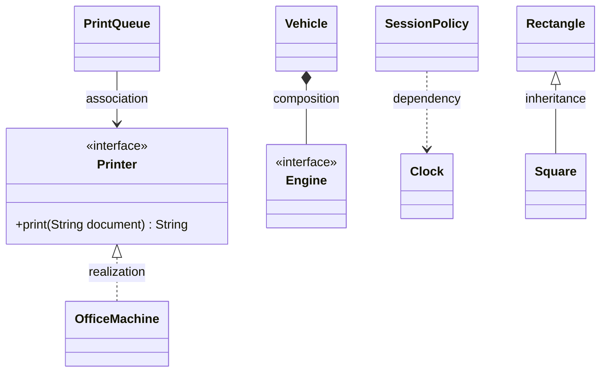
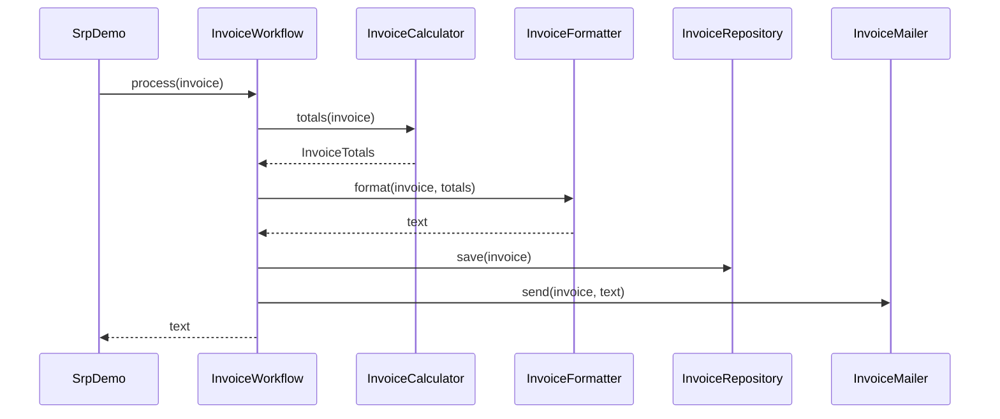
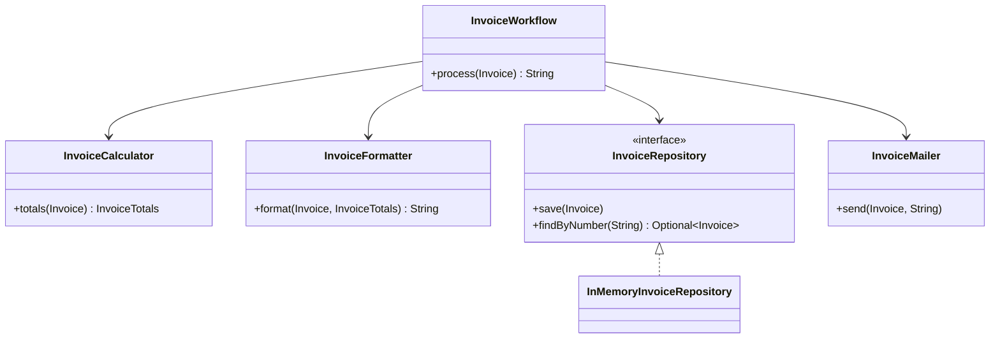
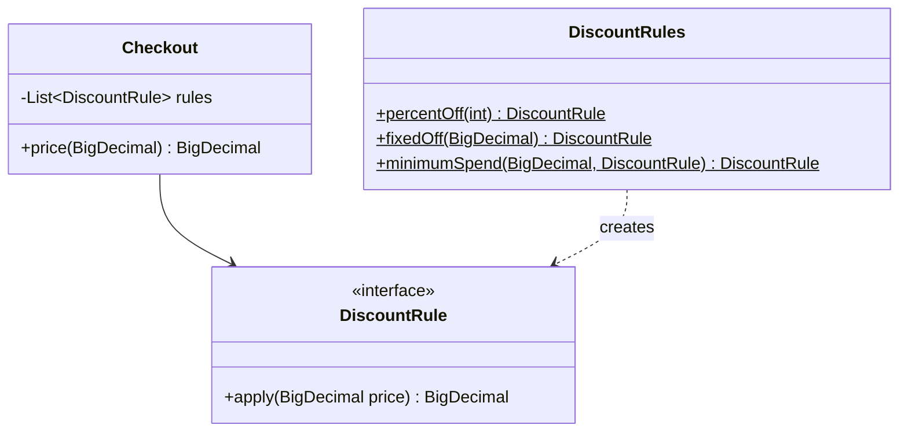
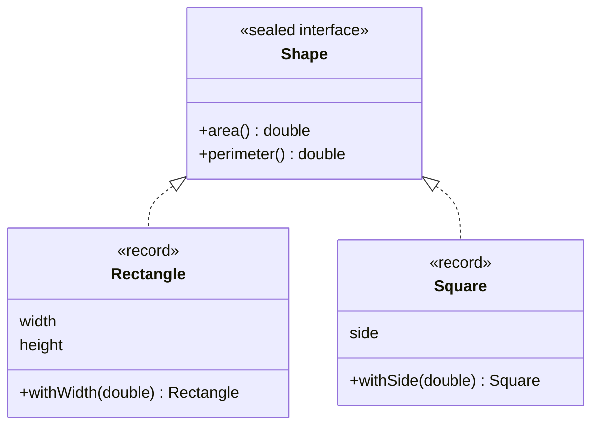
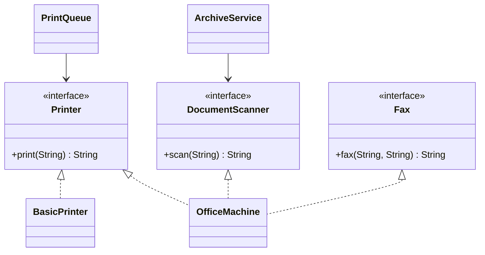
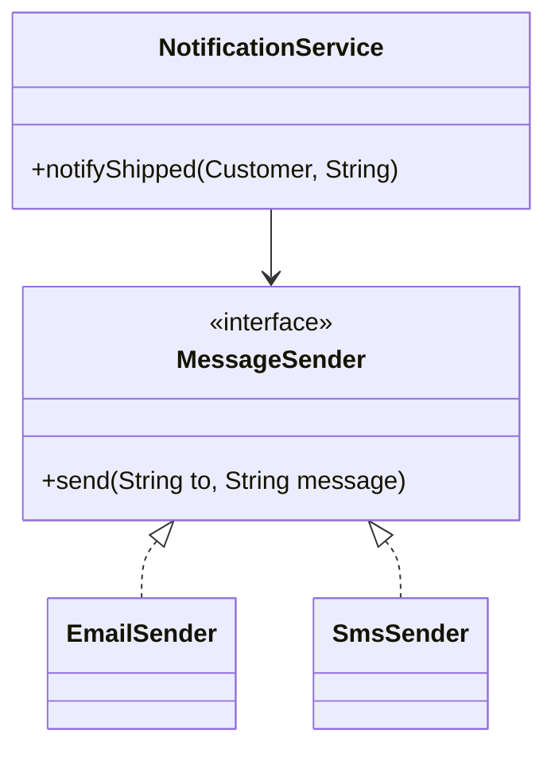
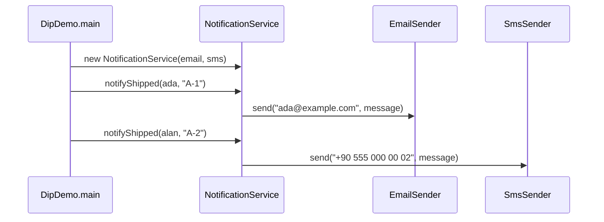
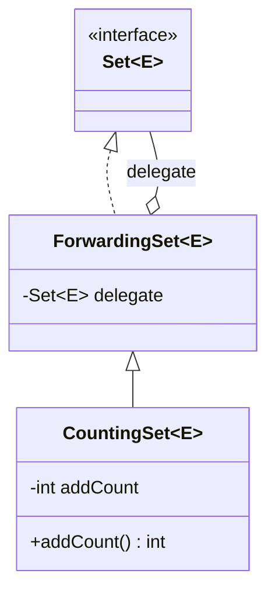

# Module 01 — OOP, SOLID & UML

> **Week 2** · Prerequisites: m00 (records, sealed interfaces, `switch` patterns, lambdas) · Estimated study time: 5 h
>
> Run every example without a build: `java modules/m01-oop-solid-uml/src/main/java/io/github/aliturgutbozkurt/patterns/m01/examples/<path>/<Demo>.java` (JDK 27)

## Learning outcomes

By the end of this module you can:

1. **Explain** the four OOP pillars and **judge** the coupling and cohesion of a class.
2. **Identify** a violation of each SOLID principle and **refactor** it without changing behaviour, protected by a
   characterization test.
3. **Decide** between inheritance and composition, and **implement** a forwarding wrapper.
4. **Inject** dependencies — including time, through `java.time.Clock` — so code can be tested without side effects.
5. **Draw** UML class and sequence diagrams in Mermaid and **read** the diagrams used in the rest of the course.
6. **Describe** the GoF catalog and find where each pattern is taught in this course.

## Motivation

Every design pattern in this course is justified with the same handful of ideas: *this class has too many reasons to
change*, *this code must be edited for every new case*, *this subclass surprises its callers*, *this client depends
on methods it never uses*, *this policy is welded to a detail*. Those five sentences are the SOLID principles. Learn
to hear them in code and the patterns stop being recipes to memorise — they become the obvious fix.

Every principle below is taught the same way: a small **before** version with the problem, an **after** version
that fixes it, and a test that proves the two behave the same. Each demo prints both versions.

## OOP pillars, coupling and cohesion

### The four pillars

| Pillar | Meaning | Example in this module |
|---|---|---|
| Encapsulation | Hide state; let the object guard its own invariants | `CheckingAccount` never lets its balance go negative |
| Abstraction | Expose *what* an object does, not *how* | `MessageSender` says "send a message", not "open an SMTP socket" |
| Inheritance | A subtype reuses and extends a supertype | `Square extends Rectangle` — and how it goes wrong |
| Polymorphism | One call, many behaviours chosen at run time | `PrintQueue` prints on any `Printer`, even a lambda |

### Coupling and cohesion

**Cohesion** is how closely the parts of one class belong together. **Coupling** is how much one class knows about
another. Good designs have *high cohesion* and *low (loose) coupling*: each class does one thing well, and a change
inside it does not ripple through the system. Every SOLID principle is a way to raise cohesion or lower coupling.

## UML in Mermaid

This course draws diagrams as text with [Mermaid](https://mermaid.js.org), so they live next to the code, render on
GitHub and are pre-rendered in the PDFs.

### Class diagrams



| Arrow | Mermaid | Reads as |
|---|---|---|
| Inheritance | `A <\|-- B` | B *is an* A (extends) |
| Realization | `A <\|.. B` | B implements interface A |
| Association | `A --> B` | A holds a reference to B |
| Aggregation | `A o-- B` | A has B, but B can live without A |
| Composition | `A *-- B` | A owns B; B's lifetime is A's |
| Dependency | `A ..> B` | A uses B briefly (parameter, local variable) |

### Sequence diagrams

A sequence diagram shows *who calls whom, in which order*. Time runs downwards:



## Single Responsibility Principle (SRP)

### Problem

`InvoiceService` computes totals, formats the invoice, stores it and e-mails it. A new tax rule, a new layout, a
database and a new mail provider are four unrelated reasons to open the same class — and four ways to break the others.

```java
// file: examples/srp/before/InvoiceService.java
public final class InvoiceService {
    // ...
    /** Calculates, formats, stores and "sends" the invoice; returns its text. */
    public String process(String number, String customer, List<Line> lines) {
        // ...
        // 1) calculation
        BigDecimal subtotal = BigDecimal.ZERO;
        // ...
        // 2) formatting
        var text = new StringBuilder();
        // ...
        // 3) storage
        sentInvoices.put(number, result);
        // 4) delivery
        System.out.println("Emailing invoice " + number + " to " + customer);
        return result;
    }
```

### Principle

> A class should have **one reason to change** — it should answer to one actor (the tax office, the designer, the
> DBA, …).

### Structure



### After

Each collaborator now has one job. The workflow only fixes the *order* of the steps:

```java
// file: examples/srp/after/InvoiceWorkflow.java
public final class InvoiceWorkflow {
    // ...
    /** Calculates, formats, stores and sends the invoice; returns its text. */
    public String process(Invoice invoice) {
        String text = formatter.format(invoice, calculator.totals(invoice));
        repository.save(invoice);
        mailer.send(invoice, text);
        return text;
    }
}
```

The money rules live in one small class that a tax change — and only a tax change — touches:

```java
// file: examples/srp/after/InvoiceCalculator.java
public final class InvoiceCalculator {

    /** 20 % VAT (Turkish KDV). */
    public static final BigDecimal VAT_RATE = new BigDecimal("0.20");

    public InvoiceTotals totals(Invoice invoice) {
        BigDecimal subtotal = invoice.lines().stream()
                .map(InvoiceLine::amount)
                .reduce(BigDecimal.ZERO, BigDecimal::add)
                .setScale(2, RoundingMode.HALF_EVEN);
        BigDecimal vat = subtotal.multiply(VAT_RATE).setScale(2, RoundingMode.HALF_EVEN);
        return new InvoiceTotals(subtotal, vat, subtotal.add(vat));
    }
}
```

How do we know the refactoring did not change anything? `InvoiceTest.refactoredWorkflowBehavesExactlyLikeTheGodClass`
runs both versions and compares their output. A test that pins down *existing* behaviour before a refactoring is
called a **characterization test**. `SrpDemo` prints both versions:

```text
INVOICE INV-001
Customer: Ada Lovelace
  2 x Keyboard         49.90     99.80
  1 x Mouse            19.99     19.99
  1 x Monitor         229.00    229.00
Subtotal:    348.79
VAT 20%:      69.76
Total:       418.55
same text? true
```

### A second example: the gradebook

`GradeBook.report` parses CSV lines, computes averages, maps them to letter grades and prints a table — in one
method. The refactoring separates the **input format** (`ScoreParser`), the **grading policy** (`GradingScale`) and
the **layout** (`GradeReport`). When the faculty moves a grade boundary, only this class changes:

```java
// file: examples/srp/gradebook/after/GradingScale.java
    /** Letter grade for an average in {@code [0, 100]}. */
    public String letterFor(BigDecimal average) {
        if (average.signum() < 0 || average.compareTo(BigDecimal.valueOf(100)) > 0) {
            throw new IllegalArgumentException("average out of range 0-100: " + average);
        }
        return BOUNDARIES.stream()
                .filter(boundary -> average.compareTo(boundary.minimum()) >= 0)
                .map(Boundary::letter)
                .findFirst()
                .orElse("FF");
    }
```

```java
// file: examples/srp/GradeBookDemo.java
        String after = new GradeReport(new GradingScale()).render(new ScoreParser().parse(CSV));
```

### Real-world usage

`java.time` keeps values (`LocalDate`), formatting (`DateTimeFormatter`) and time sources (`Clock`) in separate
types. JDBC separates connecting (`DataSource`), running a statement (`PreparedStatement`) and reading rows
(`ResultSet`).

### Pitfalls and when NOT to apply it

- "One reason to change" is not "one method". Splitting every method into its own class lowers cohesion again.
- Split when two responsibilities actually change at different times or for different people — not in advance.

## Open/Closed Principle (OCP)

### Problem

Every new kind of discount means opening `PriceCalculator` and adding another branch — and re-testing every old one:

```java
// file: examples/ocp/before/PriceCalculator.java
        BigDecimal percentOff;
        if (customerType.equals("REGULAR")) {
            percentOff = BigDecimal.ZERO;
        } else if (customerType.equals("STUDENT")) {
            percentOff = BigDecimal.valueOf(10);
        } else if (customerType.equals("VIP")) {
            percentOff = BigDecimal.valueOf(15);
        } else {
            throw new IllegalArgumentException("unknown customer type: " + customerType);
        }
```

### Principle

> Software entities should be **open for extension, closed for modification**: new behaviour is added as new code,
> not by editing code that already works.

### Structure



### After

The extension point is a functional interface, so a new rule can be a lambda:

```java
// file: examples/ocp/after/DiscountRule.java
@FunctionalInterface
public interface DiscountRule {

    /** Returns the price after this discount. */
    BigDecimal apply(BigDecimal price);
}
```

`Checkout` applies whatever rules it is given and never needs to know which ones exist:

```java
// file: examples/ocp/after/Checkout.java
    public BigDecimal price(BigDecimal amount) {
        if (amount.signum() < 0) {
            throw new IllegalArgumentException("amount must not be negative: " + amount);
        }
        BigDecimal price = amount;
        for (DiscountRule rule : rules) {
            price = rule.apply(price);
        }
        return price.max(BigDecimal.ZERO).setScale(2, RoundingMode.HALF_EVEN);
    }
```

A Black Friday rule arrives as two lines in `OcpDemo` — `Checkout` is not touched:

```java
// file: examples/ocp/OcpDemo.java
        DiscountRule roundDownToWholeLira = price -> price.setScale(0, RoundingMode.FLOOR);
        var blackFriday = new Checkout(List.of(percentOff(15), roundDownToWholeLira));
```

### A second example: sorting courses

`CourseSorter` switches on a sort-key string. The JDK already solved this problem: `Comparator` is an extension
point, and `comparing`, `thenComparing` and `reversed` compose new orderings from old ones. `CourseCatalog` simply
accepts any `Comparator`:

```java
// file: examples/ocp/CourseSortDemo.java
        Comparator<Course> byDepartmentThenCredits = comparing(Course::department)
                .thenComparing(comparingInt(Course::credits).reversed())
                .thenComparing(Course::code);
```

### Sidebar: sealed types are deliberately closed

A `sealed` interface with an exhaustive `switch` is the *opposite* trade-off. Adding a new `Engine` forces you to edit
every `switch` over it, and the compiler lists each one:

```java
// file: examples/composition/vehicles/after/Vehicle.java
        double range = switch (engine) {
            case Engine.Petrol(double tank, double per100) -> tank * 100 / per100;
            case Engine.Diesel(double tank, double per100) -> tank * 100 / per100;
            case Engine.Electric(double battery, double per100) -> battery * 100 / per100;
        };
```

This is the *expression problem*. An open interface makes new **types** cheap and new **operations** expensive; a
sealed type with `switch` makes new **operations** cheap and new **types** expensive. Choose based on which one you
expect to add more often. Module m08 (Visitor vs. pattern matching) returns to this.

### Real-world usage

`Comparator`, `Collector`, `java.util.function`, and `ServiceLoader` (m02) are all extension points: the JDK is
closed for modification, yet you extend its behaviour every day.

### Pitfalls and when NOT to apply it

- Do not add extension points "just in case". The first variation can be an `if`; extract a rule interface when the
  second or third appears.
- Rules applied in sequence interact: the tests `appliesRulesInOrder` show that 10 % then −20 is not −20 then 10 %.

## Liskov Substitution Principle (LSP)

### Problem

Geometrically a square *is a* rectangle. As a mutable subtype it is not: to keep its sides equal, `Square` must change
both sides in each setter.

```java
// file: examples/lsp/before/Square.java
public final class Square extends Rectangle {

    public Square(double side) {
        // Flexible constructor body (JEP 513): validate with Square's own message before super(...) runs.
        if (!(side > 0)) {
            throw new IllegalArgumentException("side must be positive: " + side);
        }
        super(side, side);
    }

    @Override
    public void setWidth(double width) {
        super.setWidth(width);
        super.setHeight(width);
    }
    // ...
}
```

A client written against `Rectangle` reasonably expects 20 — and gets 16 for a `Square`:

```java
// file: examples/lsp/before/RectangleClient.java
    /** Resizes to 5 × 4 and returns the area — the client reasonably expects 20. */
    public static double resizeTo5By4(Rectangle rectangle) {
        rectangle.setWidth(5);
        rectangle.setHeight(4);
        return rectangle.area();
    }
```

Note the constructor: since Java 25 (JEP 513) statements may run **before** `super(...)`, so `Square` validates its
side with its own error message before the `Rectangle` constructor runs.

### Principle

> Objects of a subtype must be usable **wherever the supertype is expected**, without the client noticing. A subtype
> may not strengthen preconditions, weaken postconditions or break the supertype's invariants.

### Structure



### After

Immutable records have no setters, so there is no setter contract to break. `Square` and `Rectangle` become siblings:

```java
// file: examples/lsp/after/Rectangle.java
public record Rectangle(double width, double height) implements Shape {
    // ...
    public Rectangle withWidth(double newWidth) {
        return new Rectangle(newWidth, height);
    }
```

### A second example: bank accounts

`FixedDepositAccount extends Account` but refuses every withdrawal — it **strengthens the precondition** of
`withdraw` from "amount ≤ balance" to "never":

```java
// file: examples/lsp/accounts/before/FixedDepositAccount.java
    @Override
    public void withdraw(BigDecimal amount) {
        throw new UnsupportedOperationException("no withdrawals from a fixed deposit");
    }
```

The fix models the capability instead of refusing it. `Account` only promises what every account can do;
`Withdrawable` is a separate role, and `BillPayer` asks for exactly that role:

```java
// file: examples/lsp/accounts/after/BillPayer.java
    /** Pays a bill and returns the remaining balance. */
    public static BigDecimal pay(Withdrawable source, BigDecimal bill) {
        source.withdraw(bill);
        return source.balance();
    }
```

Passing a `FixedDepositAccount` to `pay` is now a compile error, not a run-time surprise. Splitting an interface by
what clients need is the next principle.

### Real-world usage

`List.of(...)` returns a `List` whose `add` throws `UnsupportedOperationException`. The JDK documents such methods as
"optional operations" — a pragmatic trade-off, but exactly the surprise LSP warns about.

### Pitfalls and when NOT to apply it

- "Is-a" in the real world is not enough; ask "is it **substitutable** for" the supertype's behaviour.
- A test suite written against the supertype (like the contract tests in the assignments) is the best LSP check:
  every implementation must pass it.

## Interface Segregation Principle (ISP)

### Problem

`MultiFunctionDevice` forces every device to print, scan and fax. A plain printer can only throw:

```java
// file: examples/isp/before/BasicPrinter.java
    @Override
    public String scan(String page) {
        throw new UnsupportedOperationException("BasicPrinter cannot scan");
    }
```

### Principle

> Clients should not be forced to depend on methods they do not use. Prefer several small **role interfaces** to one
> large one.

### Structure



### After

Each role is one small interface — small enough to be a lambda. One class may still play several roles:

```java
// file: examples/isp/after/Printer.java
@FunctionalInterface
public interface Printer {

    String print(String document);
}
```

```java
// file: examples/isp/after/OfficeMachine.java
public final class OfficeMachine implements Printer, DocumentScanner, Fax {
```

A client names the smallest role it needs:

```java
// file: examples/isp/after/PrintQueue.java
    public PrintQueue(Printer printer) {
        this.printer = Objects.requireNonNull(printer, "printer");
    }
```

### A second example: a product store

A read-only view of a five-method `ProductStore` must "implement" `save`, `delete` and `importAll` by throwing. After
the split, `CatalogPage` depends on `ProductReader` only, so write methods are not even visible to it, and
`InMemoryProducts` implements both roles. A default method keeps the writer role convenient:

```java
// file: examples/isp/store/after/ProductWriter.java
    /** Saves every product in order. */
    default void importAll(List<Product> products) {
        products.forEach(this::save);
    }
```

### Real-world usage

The JDK is full of role interfaces: `Readable`, `Appendable`, `AutoCloseable`, `Comparable`, `Iterable`. A
`StringBuilder` and a `Writer` are both `Appendable`, so code that only appends works with either.

### Pitfalls and when NOT to apply it

- Do not split below what clients use together; one method per interface everywhere makes wiring painful.
- Segregate by **client need**, not by implementation detail.

## Dependency Inversion Principle (DIP)

### Problem

The business rule "tell the customer the order shipped" creates a concrete e-mail sender itself. It cannot send SMS,
and it cannot be tested without really "sending":

```java
// file: examples/dip/before/NotificationService.java
    public void notifyShipped(Customer customer, String orderId) {
        var sender = new EmailSender();  // hard-wired dependency on a concrete class
        sender.send(customer.email(), "Order " + orderId + " has shipped, " + customer.name() + ".");
    }
```

### Principle

> High-level policy should not depend on low-level details; **both depend on abstractions** — and the abstraction is
> owned by the high-level side.

### Structure



The arrows from `EmailSender` and `SmsSender` now point *up* to an interface that lives next to
`NotificationService` — that is the "inversion".

### After

```java
// file: examples/dip/after/NotificationService.java
    public NotificationService(MessageSender email, MessageSender sms) {
        this.email = Objects.requireNonNull(email, "email");
        this.sms = Objects.requireNonNull(sms, "sms");
    }

    public void notifyShipped(Customer customer, String orderId) {
        String message = "Order " + orderId + " has shipped, " + customer.name() + ".";
        switch (customer.preferred()) {
            case EMAIL -> email.send(customer.email(), message);
            case SMS -> sms.send(customer.phone(), message);
        }
    }
```

Someone still has to call `new`. That place is the **composition root** — here, `main`:

```java
// file: examples/dip/DipDemo.java
        var service = new NotificationService(new EmailSender(), new SmsSender());
```

The call sequence at run time:



In the tests, a recording `MessageSender` (a **test double**) replaces the real senders — no console capture needed.

### A second example: time as a dependency

`Instant.now()` inside business logic is a hidden dependency on the system clock. The JDK's own abstraction is
`java.time.Clock`; inject it and tests can pin time to any instant:

```java
// file: examples/dip/clock/SessionPolicy.java
    /** Expired from the instant {@code startedAt + timeout} onwards. */
    public boolean isExpired(Session session) {
        return !clock.instant().isBefore(session.startedAt().plus(timeout));
    }
```

```text
session for ada started at 2026-09-29T09:00:00Z, timeout PT30M
at 2026-09-29T09:29:59Z -> active
at 2026-09-29T09:30:00Z -> expired
```

### Real-world usage

JDBC code depends on `javax.sql.DataSource`, not on a specific driver; logging code depends on `System.Logger`, not on
a logging library. Dependency Injection frameworks automate the composition root — module m11 builds one by hand.

### Pitfalls and when NOT to apply it

- Not every `new` is a problem: values (`BigDecimal`, records) and stable JDK types are fine to create directly.
- One interface per class "for testability" with a single implementation forever is ceremony; invert where a real
  variation or a slow/side-effecting dependency exists.

## Composition over inheritance

### Problem

`CountingSet extends HashSet` wants to count how many elements were ever added:

```java
// file: examples/composition/before/CountingSet.java
    @Override
    public boolean addAll(Collection<? extends E> elements) {
        addCount += elements.size();
        return super.addAll(elements);  // calls this.add(...) for each element -> counted again
    }
```

`HashSet.addAll` happens to call `add` for each element — our overridden `add`. Three elements are counted six times.
The subclass depends on an implementation detail of its parent: the **fragile base class** problem.

### Principle

> Prefer **has-a** (composition) to **is-a** (inheritance) when you want to reuse behaviour. Inherit only for a true
> subtype relationship that you control.

### Structure



### After

`ForwardingSet` implements `Set` by forwarding every call to a wrapped set. `CountingSet` extends the forwarder — a
class we control — and wraps any `Set`:

```java
// file: examples/composition/after/ForwardingSet.java
public class ForwardingSet<E> implements Set<E> {

    private final Set<E> delegate;

    public ForwardingSet(Set<E> delegate) {
        this.delegate = Objects.requireNonNull(delegate, "delegate");
    }
    // ...
    @Override public boolean add(E e) { return delegate.add(e); }
    // ...
    @Override public boolean addAll(Collection<? extends E> c) { return delegate.addAll(c); }
```

The wrapped set's `addAll` calls *its own* `add`, not ours, so each element is counted once. The same shape returns as
**Decorator** in m04.

### A second example: vehicles

With inheritance, every engine × gearbox combination needs its own subclass — 2 × 2 = 4 classes, and an electric
engine would add 2 more. With composition, a vehicle *has* an engine and a gearbox, and each dimension varies on its
own:

```java
// file: examples/composition/vehicles/after/Vehicle.java
public record Vehicle(Engine engine, Gearbox gearbox) {
```

Adding the electric engine took one new record; `VehicleDemo` prints all six combinations.

### Real-world usage

`java.util.Stack extends Vector` and `java.util.Properties extends Hashtable` are the JDK's own regrets: both inherit
methods that break their intended use. `Collections.unmodifiableSet(...)` and `Collections.synchronizedList(...)`, by
contrast, are wrappers — composition.

### Pitfalls and when NOT to apply it

- A forwarding class is boilerplate; it pays off when the wrapped type is not yours or has many implementations.
- Inheritance is still right for a genuine, stable "is-a" inside your own code, especially with `sealed` hierarchies
  where you control every subtype.

## The GoF catalog

In 1994 Gamma, Helm, Johnson and Vlissides ("Gang of Four") catalogued 23 patterns in three families. This course
teaches all of them, each in modern Java:

| Family | Pattern | Module |
|---|---|---|
| Creational | Singleton, Factory Method, Abstract Factory | m02 |
| Creational | Builder, Prototype | m03 |
| Structural | Adapter, Decorator, Proxy | m04 |
| Structural | Composite, Bridge, Facade, Flyweight | m05 |
| Behavioral | Strategy, Template Method, Command, Iterator | m06 |
| Behavioral | Observer, Mediator, Chain of Responsibility, Memento | m07 |
| Behavioral | State, Visitor, Interpreter | m08 |

Several of them you have already met in this module without the name: `DiscountRule` is a **Strategy**, `ForwardingSet`
is the skeleton of a **Decorator**, and `InvoiceWorkflow` is close to a **Facade**.

## Summary

| Principle | Smell | Fix | Java 27 shortcut |
|---|---|---|---|
| SRP | A class changes for several unrelated reasons | Split by reason to change; keep a coordinator | Records for the data |
| OCP | A new case edits a working class | An extension point (interface) | Functional interface + lambda |
| LSP | A subtype surprises its callers | Model capabilities; immutable values | Sealed records, no setters |
| ISP | Implementers throw `UnsupportedOperationException` | Small role interfaces | `@FunctionalInterface` roles |
| DIP | Policy calls `new` on a detail | Inject an abstraction owned by the policy | `java.time.Clock`, lambdas as doubles |
| Composition | Subclass depends on parent internals | Wrap and forward | Records composed of sealed parts |

## Quiz

1. `InvoiceFormatter` and `InvoiceCalculator` are both used by `InvoiceWorkflow`. Which actor would make each of them
   change?
2. What is a characterization test, and why write one *before* refactoring?
3. Why does a `sealed` interface with an exhaustive `switch` not violate OCP in a harmful way?
4. `Square extends Rectangle` breaks LSP. Would it still break LSP if both classes were immutable? Why?
5. Which LSP rule does `FixedDepositAccount.withdraw` break: preconditions, postconditions or invariants?
6. Give a JDK example of an ISP-friendly role interface and of an "optional operation".
7. In DIP, who owns the `MessageSender` interface, and where are the concrete senders created?
8. Why does `CountingSet extends HashSet` count `addAll` twice, and why can the forwarding version not have this bug?
9. Draw the Mermaid arrow for: "`Vehicle` owns an `Engine`" and "`SessionPolicy` uses a `Clock` passed in".

<details><summary>Answers</summary>

1. The tax office (VAT rules) changes the calculator; whoever designs the invoice layout changes the formatter.
2. A test that records what the code does *today*. It makes a refactoring safe: if the output changes, the test fails.
3. It is a deliberate choice: new *operations* are easy and the compiler lists every place a new *type* must be
   handled. OCP is about the axis you expect to change.
4. No. Without setters there is no "set width only" contract to violate; `withWidth` returns a new value.
5. It strengthens the precondition: callers that satisfy `Account`'s precondition (amount ≤ balance) still fail.
6. `Appendable` / `AutoCloseable` / `Comparable`; `List.of(...).add(...)` throws for an optional operation.
7. The high-level side owns it (it sits next to `NotificationService`); the senders are created in `main`, the
   composition root.
8. `HashSet.addAll` calls the overridden `add`. The forwarding version calls `delegate.addAll`, which calls the
   delegate's own `add`, never ours.
9. `Vehicle *-- Engine` (composition) and `SessionPolicy ..> Clock` (dependency; `-->` if it is kept in a field, as
   here).

</details>

## Assignments

- [01 — Sales report: SRP + OCP refactoring](../assignments/01-sales-report.en.md) ★★☆
- [02 — Library loans: DIP + LSP](../assignments/02-library-loans.en.md) ★★☆

## Further reading

- Robert C. Martin, "The Principles of OOD" and *Clean Architecture* (2017), part III — the source of the SOLID names.
- Barbara Liskov and Jeannette Wing, "A Behavioral Notion of Subtyping" (1994).
- Gamma, Helm, Johnson, Vlissides, *Design Patterns* (1994), chapter 1 — "Favor object composition over class
  inheritance".
- JEP 513 — [Flexible Constructor Bodies](https://openjdk.org/jeps/513)
- Mermaid — [class diagrams](https://mermaid.js.org/syntax/classDiagram.html) ·
  [sequence diagrams](https://mermaid.js.org/syntax/sequenceDiagram.html)
- Terms in Turkish: [docs/glossary.md](../../../docs/glossary.md)
