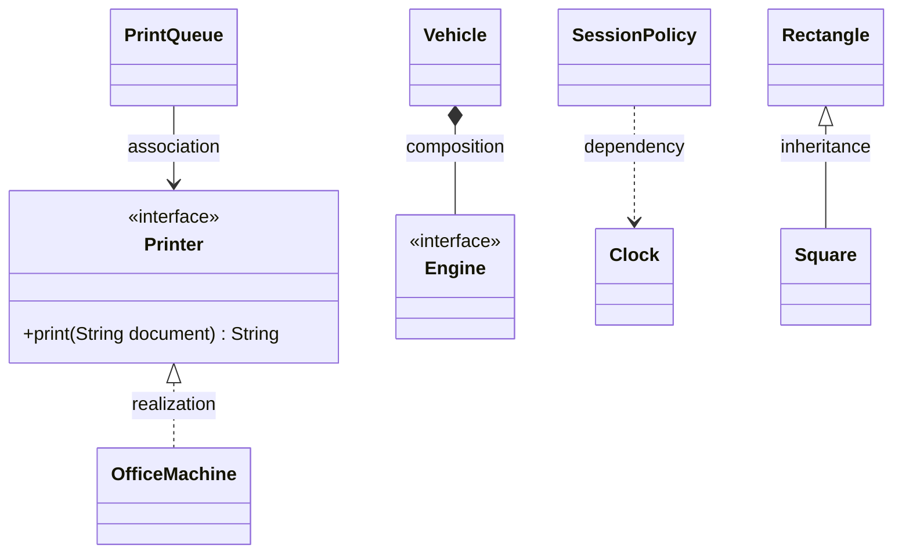
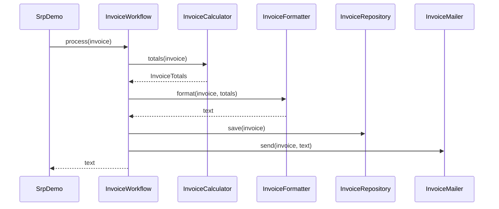
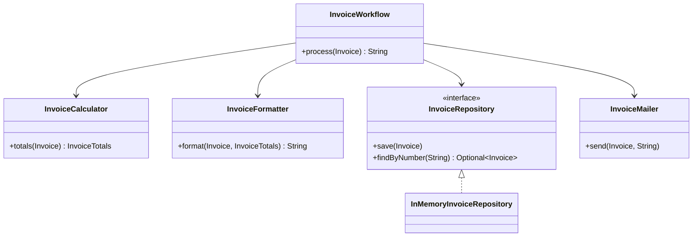
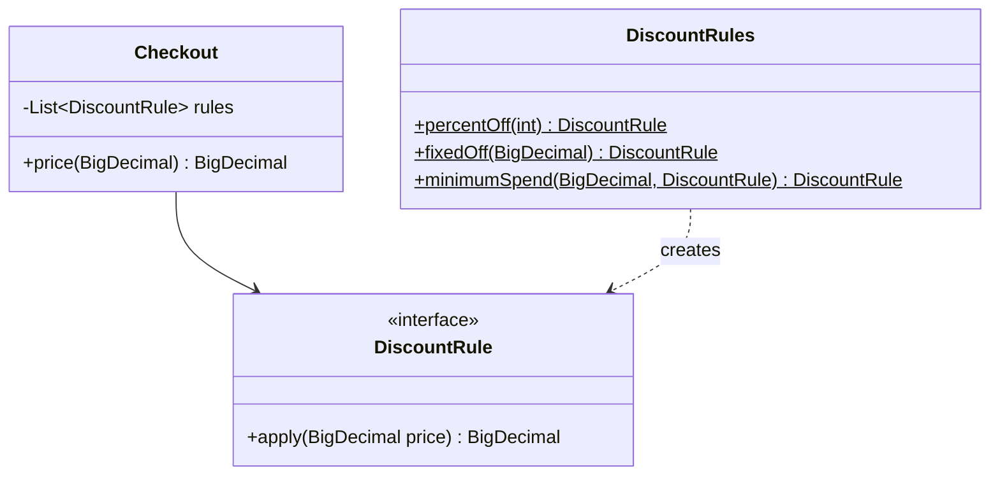
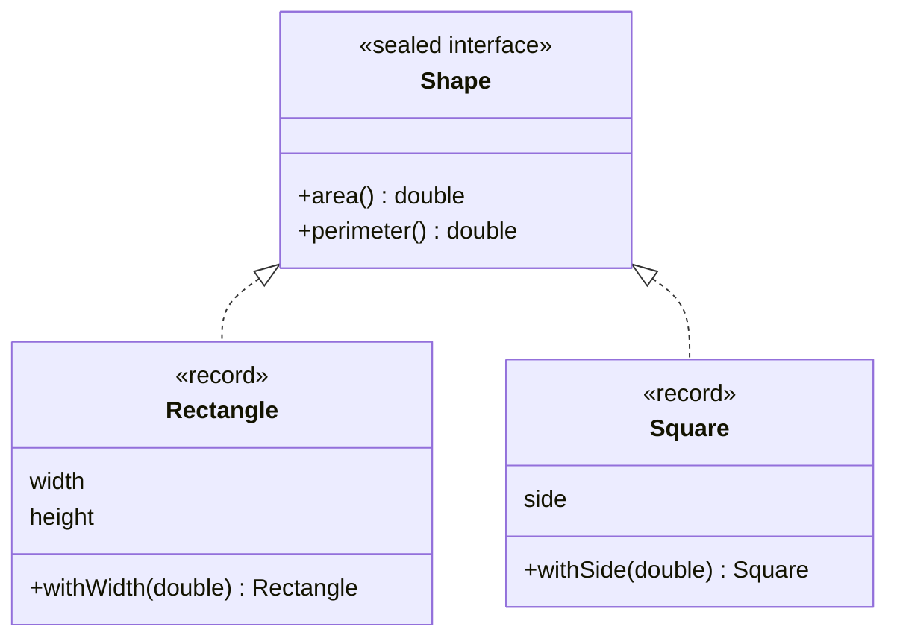
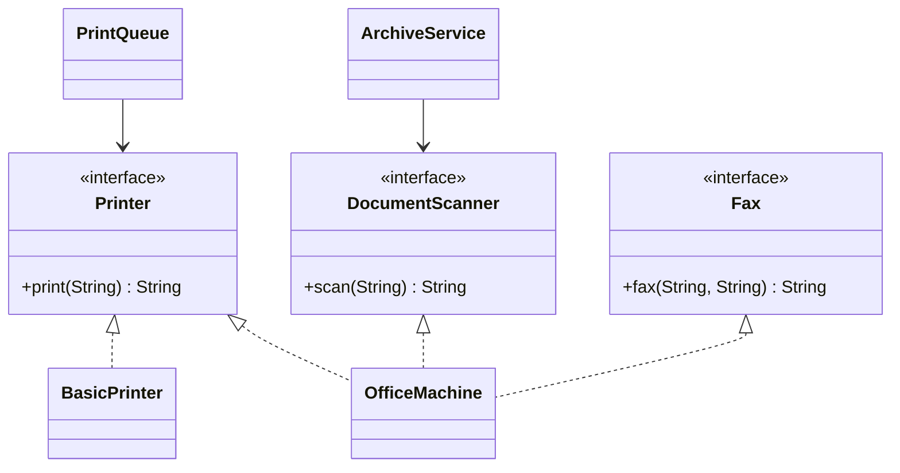
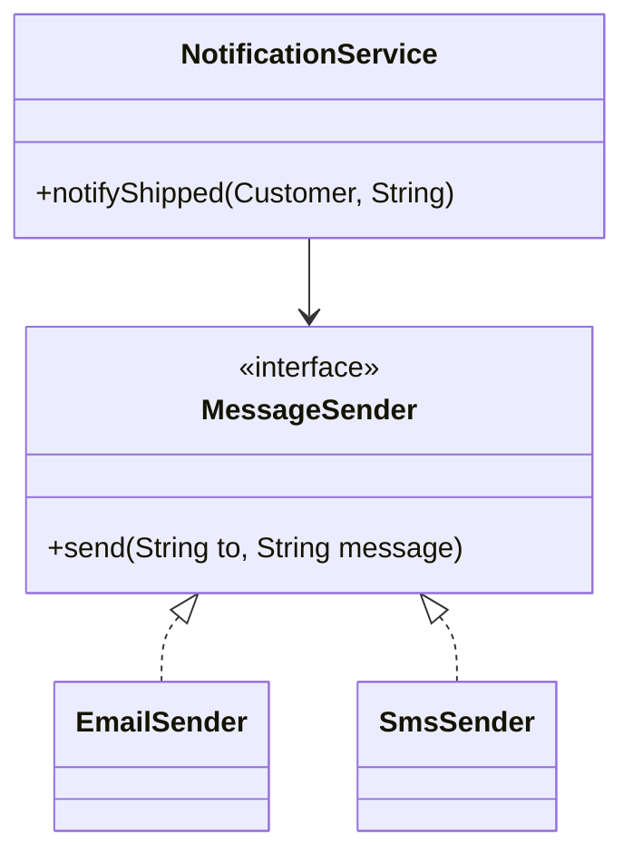
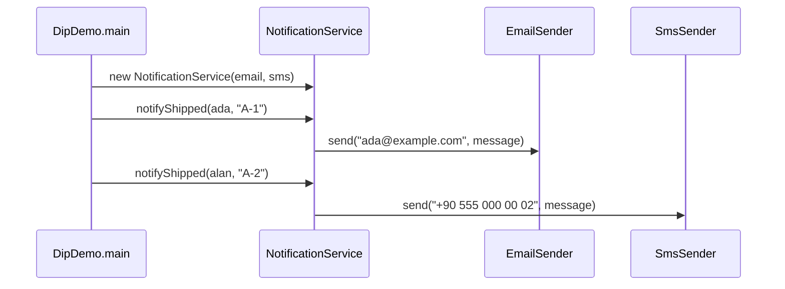
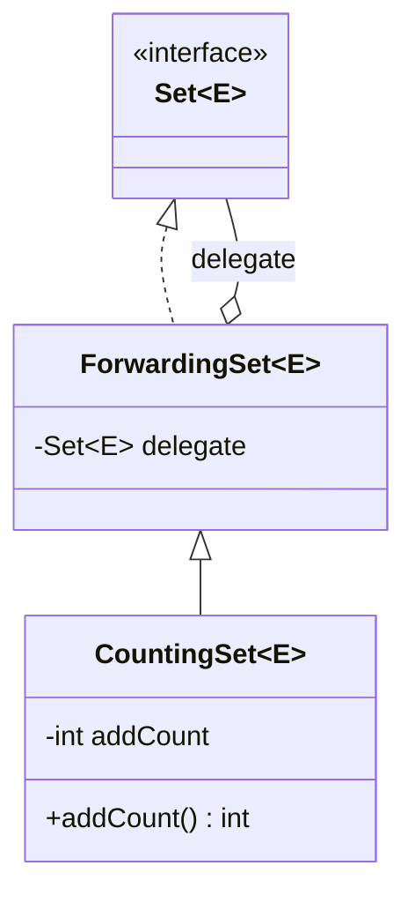

# Modül 01 — OOP, SOLID ve UML

> **2. Hafta** · Ön koşullar: m00 (record'lar, sealed arayüzler, `switch` desenleri, lambdalar) · Tahmini çalışma süresi: 5 saat
>
> Her örneği derlemeden çalıştırın: `java modules/m01-oop-solid-uml/src/main/java/io/github/aliturgutbozkurt/patterns/m01/examples/<yol>/<Demo>.java` (JDK 27)

## Öğrenme çıktıları

Bu modülün sonunda şunları yapabilirsiniz:

1. OOP'nin dört temel ilkesini **açıklamak** ve bir sınıfın bağlaşımını (coupling) ve uyumunu (cohesion)
   **değerlendirmek**.
2. Her SOLID ilkesinin ihlalini **tanımak** ve onu, bir karakterizasyon testiyle korunarak, davranışı değiştirmeden
   **yeniden düzenlemek**.
3. Kalıtım ile bileşim arasında **karar vermek** ve yönlendiren (forwarding) bir sarmalayıcı **yazmak**.
4. Bağımlılıkları — `java.time.Clock` ile zamanı da — dışarıdan **vermek**; böylece kodu yan etki olmadan test etmek.
5. Mermaid ile UML sınıf ve sıralama diyagramları **çizmek** ve dersin geri kalanındaki diyagramları **okumak**.
6. GoF kataloğunu **tanımlamak** ve her kalıbın bu derste nerede işlendiğini bulmak.

## Motivasyon

Bu dersteki her tasarım kalıbı aynı birkaç fikirle gerekçelendirilir: *bu sınıfın değişmek için çok fazla nedeni
var*, *her yeni durum için bu kodun değiştirilmesi gerekiyor*, *bu alt sınıf onu kullananları şaşırtıyor*, *bu
istemci hiç kullanmadığı metotlara bağımlı*, *bu iş kuralı bir ayrıntıya kaynaklanmış*. Bu beş cümle SOLID
ilkeleridir. Onları kodda duymayı öğrenirseniz kalıplar ezberlenecek tarifler olmaktan çıkar — apaçık çözüm hâline
gelir.

Aşağıdaki her ilke aynı şekilde işlenir: sorunu gösteren küçük bir **önce** sürümü, onu düzelten bir **sonra**
sürümü ve ikisinin aynı davrandığını kanıtlayan bir test. Her demo iki sürümü de yazdırır.

## OOP'nin temel ilkeleri, bağlaşım ve uyum

### Dört temel ilke

| İlke | Anlamı | Bu modüldeki örnek |
|---|---|---|
| Kapsülleme | Durumu gizle; nesne kendi değişmezlerini (invariant) korusun | `CheckingAccount` bakiyesinin asla eksiye düşmesine izin vermez |
| Soyutlama | Nesnenin *ne* yaptığını göster, *nasıl* yaptığını değil | `MessageSender` "mesaj gönder" der, "SMTP soketi aç" demez |
| Kalıtım | Alt tip, üst tipi yeniden kullanır ve genişletir | `Square extends Rectangle` — ve nasıl ters gittiği |
| Çok biçimlilik | Tek çağrı, çalışma zamanında seçilen birçok davranış | `PrintQueue` her `Printer`'da, bir lambdada bile yazdırır |

### Bağlaşım ve uyum

**Uyum (cohesion)**, bir sınıfın parçalarının birbirine ne kadar ait olduğudur. **Bağlaşım (coupling)**, bir sınıfın
bir başkası hakkında ne kadar şey bildiğidir. İyi tasarımlarda *uyum yüksek*, *bağlaşım düşüktür (gevşektir)*: her
sınıf tek bir işi iyi yapar ve içindeki bir değişiklik sisteme yayılmaz. Her SOLID ilkesi, uyumu artırmanın ya da
bağlaşımı azaltmanın bir yoludur.

## Mermaid ile UML

Bu derste diyagramlar [Mermaid](https://mermaid.js.org) ile metin olarak çizilir; böylece kodun yanında yaşarlar,
GitHub'da görüntülenirler ve PDF'lerde önceden işlenirler.

### Sınıf diyagramları



| Ok | Mermaid | Okunuşu |
|---|---|---|
| Kalıtım (inheritance) | `A <\|-- B` | B bir A'*dır* (extends) |
| Gerçekleştirme (realization) | `A <\|.. B` | B, A arayüzünü uygular |
| İlişki (association) | `A --> B` | A, B'ye bir referans tutar |
| Toplama (aggregation) | `A o-- B` | A'nın B'si vardır ama B, A olmadan da yaşar |
| Bileşim (composition) | `A *-- B` | A, B'nin sahibidir; B'nin ömrü A'nın ömrüdür |
| Bağımlılık (dependency) | `A ..> B` | A, B'yi kısa süreliğine kullanır (parametre, yerel değişken) |

### Sıralama diyagramları

Sıralama diyagramı *kimin kimi, hangi sırayla çağırdığını* gösterir. Zaman yukarıdan aşağı akar:



## Tek Sorumluluk İlkesi (SRP)

### Problem

`InvoiceService` toplamları hesaplar, faturayı biçimlendirir, saklar ve e-postayla gönderir. Yeni bir vergi kuralı,
yeni bir yerleşim, bir veritabanı ve yeni bir e-posta sağlayıcısı; aynı sınıfı açmak için birbiriyle ilgisiz dört
neden — ve diğerlerini bozmanın dört yolu.

```java
// file: examples/srp/before/InvoiceService.java
public final class InvoiceService {
    // ...
    /** Calculates, formats, stores and "sends" the invoice; returns its text. */
    public String process(String number, String customer, List<Line> lines) {
        // ...
        // 1) calculation
        BigDecimal subtotal = BigDecimal.ZERO;
        // ...
        // 2) formatting
        var text = new StringBuilder();
        // ...
        // 3) storage
        sentInvoices.put(number, result);
        // 4) delivery
        System.out.println("Emailing invoice " + number + " to " + customer);
        return result;
    }
```

### İlke

> Bir sınıfın **değişmek için tek bir nedeni** olmalıdır — tek bir aktöre (vergi dairesi, tasarımcı, veritabanı
> yöneticisi, …) hesap vermelidir.

### Yapı



### Sonra

Artık her iş birlikçinin tek bir görevi var. İş akışı yalnızca adımların *sırasını* belirler:

```java
// file: examples/srp/after/InvoiceWorkflow.java
public final class InvoiceWorkflow {
    // ...
    /** Calculates, formats, stores and sends the invoice; returns its text. */
    public String process(Invoice invoice) {
        String text = formatter.format(invoice, calculator.totals(invoice));
        repository.save(invoice);
        mailer.send(invoice, text);
        return text;
    }
}
```

Para kuralları, bir vergi değişikliğinin — ve yalnızca bir vergi değişikliğinin — dokunduğu küçük bir sınıfta yaşar:

```java
// file: examples/srp/after/InvoiceCalculator.java
public final class InvoiceCalculator {

    /** 20 % VAT (Turkish KDV). */
    public static final BigDecimal VAT_RATE = new BigDecimal("0.20");

    public InvoiceTotals totals(Invoice invoice) {
        BigDecimal subtotal = invoice.lines().stream()
                .map(InvoiceLine::amount)
                .reduce(BigDecimal.ZERO, BigDecimal::add)
                .setScale(2, RoundingMode.HALF_EVEN);
        BigDecimal vat = subtotal.multiply(VAT_RATE).setScale(2, RoundingMode.HALF_EVEN);
        return new InvoiceTotals(subtotal, vat, subtotal.add(vat));
    }
}
```

Yeniden düzenlemenin hiçbir şeyi değiştirmediğini nereden biliyoruz?
`InvoiceTest.refactoredWorkflowBehavesExactlyLikeTheGodClass` iki sürümü de çalıştırır ve çıktılarını karşılaştırır.
Yeniden düzenlemeden önce *mevcut* davranışı sabitleyen teste **karakterizasyon testi** denir. `SrpDemo` iki sürümü
de yazdırır:

```text
INVOICE INV-001
Customer: Ada Lovelace
  2 x Keyboard         49.90     99.80
  1 x Mouse            19.99     19.99
  1 x Monitor         229.00    229.00
Subtotal:    348.79
VAT 20%:      69.76
Total:       418.55
same text? true
```

### İkinci örnek: not defteri

`GradeBook.report` CSV satırlarını ayrıştırır, ortalamaları hesaplar, harf notlarına çevirir ve bir tablo yazdırır —
tek bir metotta. Yeniden düzenleme **girdi biçimini** (`ScoreParser`), **notlandırma politikasını** (`GradingScale`)
ve **yerleşimi** (`GradeReport`) ayırır. Fakülte bir not sınırını kaydırdığında yalnızca bu sınıf değişir:

```java
// file: examples/srp/gradebook/after/GradingScale.java
    /** Letter grade for an average in {@code [0, 100]}. */
    public String letterFor(BigDecimal average) {
        if (average.signum() < 0 || average.compareTo(BigDecimal.valueOf(100)) > 0) {
            throw new IllegalArgumentException("average out of range 0-100: " + average);
        }
        return BOUNDARIES.stream()
                .filter(boundary -> average.compareTo(boundary.minimum()) >= 0)
                .map(Boundary::letter)
                .findFirst()
                .orElse("FF");
    }
```

```java
// file: examples/srp/GradeBookDemo.java
        String after = new GradeReport(new GradingScale()).render(new ScoreParser().parse(CSV));
```

### Gerçek dünyada kullanımı

`java.time`; değerleri (`LocalDate`), biçimlendirmeyi (`DateTimeFormatter`) ve zaman kaynaklarını (`Clock`) ayrı
tiplerde tutar. JDBC; bağlanmayı (`DataSource`), bir komut çalıştırmayı (`PreparedStatement`) ve satırları okumayı
(`ResultSet`) ayırır.

### Tuzaklar ve ne zaman UYGULANMAMALI

- "Değişmek için tek neden", "tek metot" demek değildir. Her metodu ayrı bir sınıfa bölmek uyumu yeniden düşürür.
- İki sorumluluk gerçekten farklı zamanlarda ya da farklı kişiler için değiştiğinde bölün — önceden değil.

## Açık/Kapalı İlkesi (OCP)

### Problem

Her yeni indirim türü, `PriceCalculator`'ı açıp bir dal daha eklemek — ve eski dalların hepsini yeniden test etmek —
demektir:

```java
// file: examples/ocp/before/PriceCalculator.java
        BigDecimal percentOff;
        if (customerType.equals("REGULAR")) {
            percentOff = BigDecimal.ZERO;
        } else if (customerType.equals("STUDENT")) {
            percentOff = BigDecimal.valueOf(10);
        } else if (customerType.equals("VIP")) {
            percentOff = BigDecimal.valueOf(15);
        } else {
            throw new IllegalArgumentException("unknown customer type: " + customerType);
        }
```

### İlke

> Yazılım birimleri **genişletmeye açık, değiştirmeye kapalı** olmalıdır: yeni davranış, çalışan kodu düzenleyerek
> değil, yeni kod olarak eklenir.

### Yapı



### Sonra

Genişleme noktası fonksiyonel bir arayüzdür; bu yüzden yeni bir kural bir lambda olabilir:

```java
// file: examples/ocp/after/DiscountRule.java
@FunctionalInterface
public interface DiscountRule {

    /** Returns the price after this discount. */
    BigDecimal apply(BigDecimal price);
}
```

`Checkout` kendisine hangi kurallar verildiyse onları uygular ve hangilerinin var olduğunu bilmesi gerekmez:

```java
// file: examples/ocp/after/Checkout.java
    public BigDecimal price(BigDecimal amount) {
        if (amount.signum() < 0) {
            throw new IllegalArgumentException("amount must not be negative: " + amount);
        }
        BigDecimal price = amount;
        for (DiscountRule rule : rules) {
            price = rule.apply(price);
        }
        return price.max(BigDecimal.ZERO).setScale(2, RoundingMode.HALF_EVEN);
    }
```

Bir "Black Friday" kuralı `OcpDemo`'da iki satır olarak gelir — `Checkout`'a dokunulmaz:

```java
// file: examples/ocp/OcpDemo.java
        DiscountRule roundDownToWholeLira = price -> price.setScale(0, RoundingMode.FLOOR);
        var blackFriday = new Checkout(List.of(percentOff(15), roundDownToWholeLira));
```

### İkinci örnek: dersleri sıralamak

`CourseSorter` bir sıralama anahtarı dizgesi üzerinde `switch` yapar. JDK bu sorunu zaten çözmüştür: `Comparator`
bir genişleme noktasıdır; `comparing`, `thenComparing` ve `reversed` eski sıralamalardan yenilerini oluşturur.
`CourseCatalog` her `Comparator`'ı kabul eder:

```java
// file: examples/ocp/CourseSortDemo.java
        Comparator<Course> byDepartmentThenCredits = comparing(Course::department)
                .thenComparing(comparingInt(Course::credits).reversed())
                .thenComparing(Course::code);
```

### Ara not: sealed tipler bilerek kapalıdır

Eksiksiz bir `switch` ile birlikte kullanılan `sealed` bir arayüz, *tersi* bir ödünleşimdir. Yeni bir `Engine`
eklemek, onun üzerindeki her `switch`'i düzenlemenizi gerektirir ve derleyici her birini listeler:

```java
// file: examples/composition/vehicles/after/Vehicle.java
        double range = switch (engine) {
            case Engine.Petrol(double tank, double per100) -> tank * 100 / per100;
            case Engine.Diesel(double tank, double per100) -> tank * 100 / per100;
            case Engine.Electric(double battery, double per100) -> battery * 100 / per100;
        };
```

Buna *ifade problemi (expression problem)* denir. Açık bir arayüz yeni **tipleri** ucuz, yeni **işlemleri** pahalı
kılar; `switch` ile kullanılan sealed bir tip yeni **işlemleri** ucuz, yeni **tipleri** pahalı kılar. Hangisini daha
sık ekleyeceğinizi düşünerek seçin. m08 modülü (Visitor ve desen eşleme) bu konuya geri döner.

### Gerçek dünyada kullanımı

`Comparator`, `Collector`, `java.util.function` ve `ServiceLoader` (m02) birer genişleme noktasıdır: JDK
değiştirmeye kapalıdır, ama siz onun davranışını her gün genişletirsiniz.

### Tuzaklar ve ne zaman UYGULANMAMALI

- "Belki lazım olur" diye genişleme noktası eklemeyin. İlk farklılık bir `if` olabilir; ikinci ya da üçüncüsü
  geldiğinde bir kural arayüzü çıkarın.
- Sırayla uygulanan kurallar birbirini etkiler: `appliesRulesInOrder` testleri, önce %10 sonra −20'nin, önce −20
  sonra %10 ile aynı olmadığını gösterir.

## Liskov Yerine Geçme İlkesi (LSP)

### Problem

Geometride kare bir dikdörtgendir. Değiştirilebilir bir alt tip olarak ise değildir: kenarlarını eşit tutmak için
`Square` her setter'da iki kenarı birden değiştirmek zorundadır.

```java
// file: examples/lsp/before/Square.java
public final class Square extends Rectangle {

    public Square(double side) {
        // Flexible constructor body (JEP 513): validate with Square's own message before super(...) runs.
        if (!(side > 0)) {
            throw new IllegalArgumentException("side must be positive: " + side);
        }
        super(side, side);
    }

    @Override
    public void setWidth(double width) {
        super.setWidth(width);
        super.setHeight(width);
    }
    // ...
}
```

`Rectangle`'a göre yazılmış bir istemci haklı olarak 20 bekler — `Square` için 16 alır:

```java
// file: examples/lsp/before/RectangleClient.java
    /** Resizes to 5 × 4 and returns the area — the client reasonably expects 20. */
    public static double resizeTo5By4(Rectangle rectangle) {
        rectangle.setWidth(5);
        rectangle.setHeight(4);
        return rectangle.area();
    }
```

Kurucuya dikkat edin: Java 25'ten beri (JEP 513) `super(...)` çağrısından **önce** komut çalıştırılabilir; böylece
`Square`, `Rectangle` kurucusu çalışmadan önce kenarını kendi hata mesajıyla doğrular.

### İlke

> Bir alt tipin nesneleri, **üst tipin beklendiği her yerde**, istemci fark etmeden kullanılabilmelidir. Alt tip ön
> koşulları güçlendiremez, son koşulları zayıflatamaz ve üst tipin değişmezlerini bozamaz.

### Yapı



### Sonra

Değişmez record'ların setter'ı yoktur; dolayısıyla bozulacak bir setter sözleşmesi de yoktur. `Square` ve
`Rectangle` kardeş olur:

```java
// file: examples/lsp/after/Rectangle.java
public record Rectangle(double width, double height) implements Shape {
    // ...
    public Rectangle withWidth(double newWidth) {
        return new Rectangle(newWidth, height);
    }
```

### İkinci örnek: banka hesapları

`FixedDepositAccount extends Account` her para çekme isteğini reddeder — `withdraw`'un **ön koşulunu güçlendirir**:
"tutar ≤ bakiye" koşulunu "asla" yapar:

```java
// file: examples/lsp/accounts/before/FixedDepositAccount.java
    @Override
    public void withdraw(BigDecimal amount) {
        throw new UnsupportedOperationException("no withdrawals from a fixed deposit");
    }
```

Çözüm, yeteneği reddetmek yerine modellemektir. `Account` yalnızca her hesabın yapabildiğini vaat eder;
`Withdrawable` ayrı bir roldür ve `BillPayer` tam olarak bu rolü ister:

```java
// file: examples/lsp/accounts/after/BillPayer.java
    /** Pays a bill and returns the remaining balance. */
    public static BigDecimal pay(Withdrawable source, BigDecimal bill) {
        source.withdraw(bill);
        return source.balance();
    }
```

`pay`'e bir `FixedDepositAccount` vermek artık çalışma zamanında bir sürpriz değil, derleme hatasıdır. Bir arayüzü
istemcilerin ihtiyacına göre bölmek bir sonraki ilkedir.

### Gerçek dünyada kullanımı

`List.of(...)`, `add` metodu `UnsupportedOperationException` fırlatan bir `List` döndürür. JDK bu metotları
"isteğe bağlı işlemler (optional operations)" olarak belgeler — pragmatik bir ödünleşim, ama LSP'nin uyardığı sürprizin
ta kendisi.

### Tuzaklar ve ne zaman UYGULANMAMALI

- Gerçek dünyadaki "bir ...dır" ilişkisi yetmez; üst tipin davranışının **yerine geçebiliyor mu** diye sorun.
- Üst tipe göre yazılmış bir test takımı (ödevlerdeki sözleşme testleri gibi) en iyi LSP kontrolüdür: her uygulama
  onu geçmelidir.

## Arayüz Ayrımı İlkesi (ISP)

### Problem

`MultiFunctionDevice` her cihazı yazdırmaya, taramaya ve faks göndermeye zorlar. Basit bir yazıcı yalnızca hata
fırlatabilir:

```java
// file: examples/isp/before/BasicPrinter.java
    @Override
    public String scan(String page) {
        throw new UnsupportedOperationException("BasicPrinter cannot scan");
    }
```

### İlke

> İstemciler kullanmadıkları metotlara bağımlı olmaya zorlanmamalıdır. Tek büyük arayüz yerine birkaç küçük **rol
> arayüzü** tercih edin.

### Yapı



### Sonra

Her rol küçük bir arayüzdür — lambda olabilecek kadar küçük. Bir sınıf yine de birkaç rol oynayabilir:

```java
// file: examples/isp/after/Printer.java
@FunctionalInterface
public interface Printer {

    String print(String document);
}
```

```java
// file: examples/isp/after/OfficeMachine.java
public final class OfficeMachine implements Printer, DocumentScanner, Fax {
```

İstemci ihtiyaç duyduğu en küçük rolü adıyla ister:

```java
// file: examples/isp/after/PrintQueue.java
    public PrintQueue(Printer printer) {
        this.printer = Objects.requireNonNull(printer, "printer");
    }
```

### İkinci örnek: ürün deposu

Beş metotlu bir `ProductStore`'un salt okunur görünümü `save`, `delete` ve `importAll` metotlarını hata fırlatarak
"uygulamak" zorundadır. Bölmeden sonra `CatalogPage` yalnızca `ProductReader`'a bağlıdır; yazma metotlarını
göremez bile. `InMemoryProducts` iki rolü de uygular. Bir varsayılan (default) metot yazma rolünü kullanışlı tutar:

```java
// file: examples/isp/store/after/ProductWriter.java
    /** Saves every product in order. */
    default void importAll(List<Product> products) {
        products.forEach(this::save);
    }
```

### Gerçek dünyada kullanımı

JDK rol arayüzleriyle doludur: `Readable`, `Appendable`, `AutoCloseable`, `Comparable`, `Iterable`. Hem
`StringBuilder` hem `Writer` birer `Appendable`'dır; yalnızca ekleme yapan kod ikisiyle de çalışır.

### Tuzaklar ve ne zaman UYGULANMAMALI

- İstemcilerin birlikte kullandığı metotları ayırmayın; her yerde arayüz başına tek metot, bağlantı kurmayı zorlaştırır.
- **İstemci ihtiyacına** göre ayırın, uygulama ayrıntısına göre değil.

## Bağımlılığın Tersine Çevrilmesi İlkesi (DIP)

### Problem

"Müşteriye siparişinin kargoya verildiğini bildir" iş kuralı somut bir e-posta göndericisini kendisi oluşturur. SMS
gönderemez ve gerçekten "göndermeden" test edilemez:

```java
// file: examples/dip/before/NotificationService.java
    public void notifyShipped(Customer customer, String orderId) {
        var sender = new EmailSender();  // hard-wired dependency on a concrete class
        sender.send(customer.email(), "Order " + orderId + " has shipped, " + customer.name() + ".");
    }
```

### İlke

> Üst düzey politika alt düzey ayrıntılara bağımlı olmamalıdır; **ikisi de soyutlamalara bağımlıdır** — ve soyutlamanın
> sahibi üst düzey taraftır.

### Yapı



`EmailSender` ve `SmsSender`'dan çıkan oklar artık `NotificationService`'in yanında duran bir arayüze, *yukarı*
bakıyor — "tersine çevirme" budur.

### Sonra

```java
// file: examples/dip/after/NotificationService.java
    public NotificationService(MessageSender email, MessageSender sms) {
        this.email = Objects.requireNonNull(email, "email");
        this.sms = Objects.requireNonNull(sms, "sms");
    }

    public void notifyShipped(Customer customer, String orderId) {
        String message = "Order " + orderId + " has shipped, " + customer.name() + ".";
        switch (customer.preferred()) {
            case EMAIL -> email.send(customer.email(), message);
            case SMS -> sms.send(customer.phone(), message);
        }
    }
```

Yine de birinin `new` demesi gerekir. O yer **bileşim kökü (composition root)** — burada `main`:

```java
// file: examples/dip/DipDemo.java
        var service = new NotificationService(new EmailSender(), new SmsSender());
```

Çalışma zamanındaki çağrı sırası:



Testlerde, mesajları kaydeden bir `MessageSender` (bir **test ikizi**) gerçek göndericilerin yerini alır — konsol
çıktısını yakalamaya gerek kalmaz.

### İkinci örnek: bir bağımlılık olarak zaman

İş mantığının içindeki `Instant.now()`, sistem saatine gizli bir bağımlılıktır. JDK'nın kendi soyutlaması
`java.time.Clock`'tur; onu dışarıdan verin, testler zamanı istedikleri ana sabitleyebilsin:

```java
// file: examples/dip/clock/SessionPolicy.java
    /** Expired from the instant {@code startedAt + timeout} onwards. */
    public boolean isExpired(Session session) {
        return !clock.instant().isBefore(session.startedAt().plus(timeout));
    }
```

```text
session for ada started at 2026-09-29T09:00:00Z, timeout PT30M
at 2026-09-29T09:29:59Z -> active
at 2026-09-29T09:30:00Z -> expired
```

### Gerçek dünyada kullanımı

JDBC kodu belirli bir sürücüye değil `javax.sql.DataSource`'a bağlıdır; günlükleme kodu bir kütüphaneye değil
`System.Logger`'a bağlıdır. Dependency Injection (Bağımlılık Enjeksiyonu) çatıları bileşim kökünü otomatikleştirir —
m11 modülünde bir tanesini elle kuracağız.

### Tuzaklar ve ne zaman UYGULANMAMALI

- Her `new` bir sorun değildir: değerler (`BigDecimal`, record'lar) ve kararlı JDK tipleri doğrudan oluşturulabilir.
- "Test edilebilirlik için" sonsuza dek tek uygulaması olacak her sınıfa bir arayüz eklemek törendir; gerçek bir
  farklılık ya da yavaş/yan etkili bir bağımlılık olduğunda tersine çevirin.

## Kalıtım yerine bileşim

### Problem

`CountingSet extends HashSet` şimdiye kadar kaç eleman eklendiğini saymak istiyor:

```java
// file: examples/composition/before/CountingSet.java
    @Override
    public boolean addAll(Collection<? extends E> elements) {
        addCount += elements.size();
        return super.addAll(elements);  // calls this.add(...) for each element -> counted again
    }
```

`HashSet.addAll`, her eleman için `add`'i çağırır — bizim ezdiğimiz (override) `add`'i. Üç eleman altı kez sayılır.
Alt sınıf, üst sınıfının bir uygulama ayrıntısına bağlıdır: **kırılgan taban sınıf** sorunu.

### İlke

> Davranışı yeniden kullanmak istediğinizde **"bir ...dır"** (kalıtım) yerine **"bir ...sı vardır"** (bileşim)
> tercih edin. Yalnızca kontrol ettiğiniz, gerçek bir alt tip ilişkisi için kalıtım kullanın.

### Yapı



### Sonra

`ForwardingSet`, her çağrıyı sarmaladığı kümeye yönlendirerek `Set`'i uygular. `CountingSet` yönlendiriciyi —
kontrol ettiğimiz bir sınıfı — genişletir ve herhangi bir `Set`'i sarmalar:

```java
// file: examples/composition/after/ForwardingSet.java
public class ForwardingSet<E> implements Set<E> {

    private final Set<E> delegate;

    public ForwardingSet(Set<E> delegate) {
        this.delegate = Objects.requireNonNull(delegate, "delegate");
    }
    // ...
    @Override public boolean add(E e) { return delegate.add(e); }
    // ...
    @Override public boolean addAll(Collection<? extends E> c) { return delegate.addAll(c); }
```

Sarmalanan kümenin `addAll`'u bizimkini değil *kendi* `add`'ini çağırır; böylece her eleman bir kez sayılır. Aynı
yapı m04'te **Decorator (Dekoratör)** olarak geri döner.

### İkinci örnek: araçlar

Kalıtımla her motor × vites kombinasyonu kendi alt sınıfını ister — 2 × 2 = 4 sınıf; bir elektrik motoru 2 tane
daha ekler. Bileşimle bir aracın bir motoru ve bir vites kutusu *vardır*; her boyut kendi başına değişir:

```java
// file: examples/composition/vehicles/after/Vehicle.java
public record Vehicle(Engine engine, Gearbox gearbox) {
```

Elektrik motorunu eklemek tek bir yeni record gerektirdi; `VehicleDemo` altı kombinasyonun hepsini yazdırır.

### Gerçek dünyada kullanımı

`java.util.Stack extends Vector` ve `java.util.Properties extends Hashtable` JDK'nın kendi pişmanlıklarıdır: ikisi de
amaçlanan kullanımlarını bozan metotları kalıtımla alır. Buna karşılık `Collections.unmodifiableSet(...)` ve
`Collections.synchronizedList(...)` birer sarmalayıcıdır — yani bileşim.

### Tuzaklar ve ne zaman UYGULANMAMALI

- Yönlendiren sınıf basmakalıp koddur; sarmalanan tip sizin değilse ya da birçok uygulaması varsa kendini amorti eder.
- Kendi kodunuzda gerçek ve kararlı bir "bir ...dır" ilişkisi için kalıtım hâlâ doğrudur; özellikle her alt tipi
  kontrol ettiğiniz `sealed` hiyerarşilerde.

## GoF kataloğu

1994'te Gamma, Helm, Johnson ve Vlissides ("Dörtlü Çete", Gang of Four) üç ailede 23 kalıbı katalogladı. Bu ders
hepsini modern Java ile işler:

| Aile | Kalıp | Modül |
|---|---|---|
| Yaratımsal | Singleton, Factory Method, Abstract Factory | m02 |
| Yaratımsal | Builder, Prototype | m03 |
| Yapısal | Adapter, Decorator, Proxy | m04 |
| Yapısal | Composite, Bridge, Facade, Flyweight | m05 |
| Davranışsal | Strategy, Template Method, Command, Iterator | m06 |
| Davranışsal | Observer, Mediator, Chain of Responsibility, Memento | m07 |
| Davranışsal | State, Visitor, Interpreter | m08 |

Bunların birkaçıyla bu modülde adını anmadan zaten karşılaştınız: `DiscountRule` bir **Strategy (Strateji)**,
`ForwardingSet` bir **Decorator**'ın iskeleti, `InvoiceWorkflow` ise bir **Facade (Cephe)**'ye yakındır.

## Özet

| İlke | Belirti | Çözüm | Java 27 kısayolu |
|---|---|---|---|
| SRP | Bir sınıf birbiriyle ilgisiz birkaç nedenle değişir | Değişme nedenine göre böl; bir koordinatör tut | Veri için record'lar |
| OCP | Yeni bir durum çalışan bir sınıfı değiştirir | Bir genişleme noktası (arayüz) | Fonksiyonel arayüz + lambda |
| LSP | Bir alt tip onu kullananları şaşırtır | Yetenekleri modelle; değişmez değerler | Sealed record'lar, setter yok |
| ISP | Uygulayıcılar `UnsupportedOperationException` fırlatır | Küçük rol arayüzleri | `@FunctionalInterface` roller |
| DIP | Politika bir ayrıntıya `new` der | Politikanın sahip olduğu bir soyutlamayı ver | `java.time.Clock`, test ikizi olarak lambdalar |
| Bileşim | Alt sınıf üst sınıfın iç yapısına bağlı | Sarmala ve yönlendir | Sealed parçalardan oluşan record'lar |

## Sınav

1. `InvoiceFormatter` ve `InvoiceCalculator`'ın ikisini de `InvoiceWorkflow` kullanıyor. Her birini hangi aktör
   değiştirir?
2. Karakterizasyon testi nedir ve neden yeniden düzenlemeden *önce* yazılır?
3. Eksiksiz bir `switch` ile kullanılan `sealed` bir arayüz neden OCP'yi zararlı bir şekilde ihlal etmez?
4. `Square extends Rectangle` LSP'yi bozar. İki sınıf da değişmez olsaydı yine bozar mıydı? Neden?
5. `FixedDepositAccount.withdraw` hangi LSP kuralını bozar: ön koşulları, son koşulları mı, değişmezleri mi?
6. ISP'ye uygun bir JDK rol arayüzü ve bir "isteğe bağlı işlem" örneği verin.
7. DIP'te `MessageSender` arayüzünün sahibi kimdir ve somut göndericiler nerede oluşturulur?
8. `CountingSet extends HashSet` neden `addAll`'u iki kez sayar ve yönlendiren sürümde bu hata neden olamaz?
9. Şunların Mermaid okunu çizin: "`Vehicle` bir `Engine`'e sahiptir" ve "`SessionPolicy` kendisine verilen bir
   `Clock`'u kullanır".

<details><summary>Cevaplar</summary>

1. Vergi dairesi (KDV kuralları) hesaplayıcıyı değiştirir; fatura yerleşimini tasarlayan kişi biçimlendiriciyi
   değiştirir.
2. Kodun *bugün* ne yaptığını kaydeden bir testtir. Yeniden düzenlemeyi güvenli kılar: çıktı değişirse test başarısız
   olur.
3. Bilinçli bir seçimdir: yeni *işlemler* kolaydır ve derleyici, yeni bir *tipin* ele alınması gereken her yeri
   listeler. OCP, değişmesini beklediğiniz eksenle ilgilidir.
4. Hayır. Setter olmadan "yalnızca genişliği değiştir" sözleşmesi yoktur; `withWidth` yeni bir değer döndürür.
5. Ön koşulu güçlendirir: `Account`'un ön koşulunu (tutar ≤ bakiye) sağlayan çağıranlar yine de başarısız olur.
6. `Appendable` / `AutoCloseable` / `Comparable`; `List.of(...).add(...)` isteğe bağlı bir işlem için hata fırlatır.
7. Sahibi üst düzey taraftır (`NotificationService`'in yanında durur); göndericiler bileşim kökü olan `main`'de
   oluşturulur.
8. `HashSet.addAll`, ezilmiş `add`'i çağırır. Yönlendiren sürüm `delegate.addAll`'u çağırır; o da bizimkini değil,
   sarmalanan kümenin kendi `add`'ini çağırır.
9. `Vehicle *-- Engine` (bileşim) ve `SessionPolicy ..> Clock` (bağımlılık; buradaki gibi bir alanda tutuluyorsa
   `-->`).

</details>

## Ödevler

- [01 — Satış raporu: SRP + OCP ile yeniden düzenleme](../assignments/01-sales-report.tr.md) ★★☆
- [02 — Kütüphane ödünç işlemleri: DIP + LSP](../assignments/02-library-loans.tr.md) ★★☆

## İleri okuma

- Robert C. Martin, "The Principles of OOD" ve *Clean Architecture* (2017), III. bölüm — SOLID adlarının kaynağı.
- Barbara Liskov ve Jeannette Wing, "A Behavioral Notion of Subtyping" (1994).
- Gamma, Helm, Johnson, Vlissides, *Design Patterns* (1994), 1. bölüm — "Sınıf kalıtımı yerine nesne bileşimini
  tercih edin".
- JEP 513 — [Flexible Constructor Bodies](https://openjdk.org/jeps/513)
- Mermaid — [sınıf diyagramları](https://mermaid.js.org/syntax/classDiagram.html) ·
  [sıralama diyagramları](https://mermaid.js.org/syntax/sequenceDiagram.html)
- Terimlerin Türkçesi: [docs/glossary.md](../../../docs/glossary.md)
