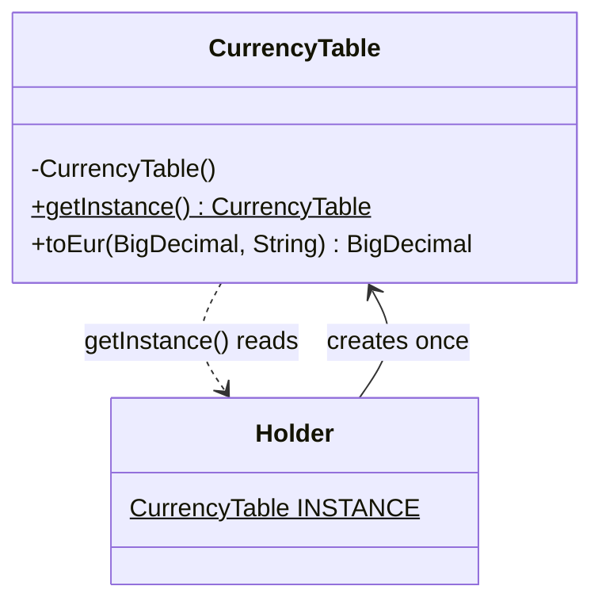
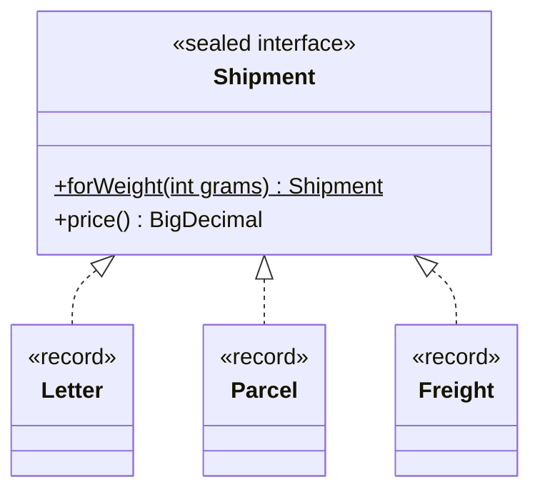
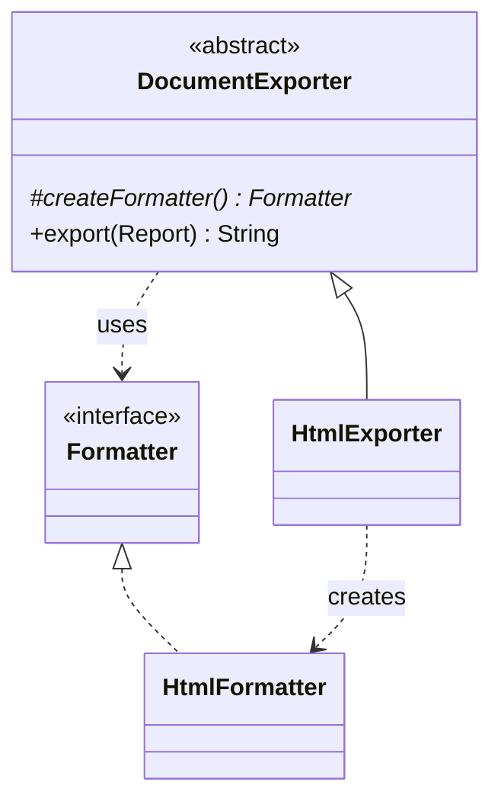
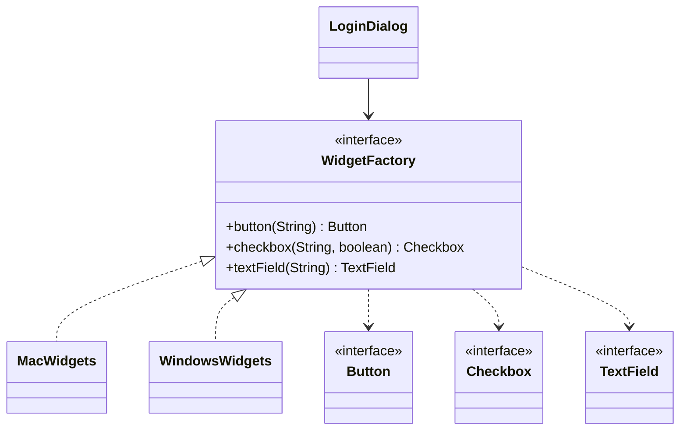
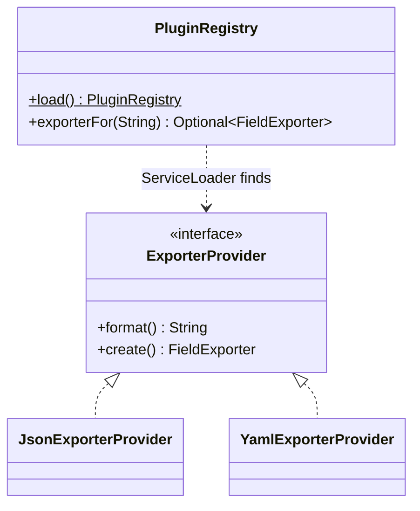

# Module 02 — Creational Patterns I: Factories

> **Week 3** · Prerequisites: m01 (OCP, DIP, composition root) · Estimated study time: 5 h
>
> Run every example without a build: `java modules/m02-creational-factories/src/main/java/io/github/aliturgutbozkurt/patterns/m02/examples/<path>/<Demo>.java` (JDK 27)

## Learning outcomes

By the end of this module you can:

1. **Implement** a thread-safe Singleton (enum, lazy holder) and **explain** why global state hurts testability.
2. **Write** static factory methods with meaningful names, instance caching and subtype selection.
3. **Implement** Factory Method in its classic (subclass hook) and modern (`Supplier`, enum registry) forms.
4. **Implement** an Abstract Factory that keeps a family of products consistent.
5. **Load** implementations at run time with `ServiceLoader`.
6. **Decide** which creational technique fits a problem — including "just call the constructor".

## Motivation

`new HtmlFormatter()` looks harmless. But the line that says `new` decides *which class* is used, and m01 taught us
that such decisions belong in as few places as possible (OCP, DIP). The five techniques in this module move that
decision somewhere better: into a named method, a subclass, a family object, or a configuration file.

## Singleton

### Problem

Some things should exist once per application: a settings object, a table of exchange rates loaded from a slow
service. Creating them twice wastes time or, worse, lets two copies disagree.

### Intent

> Ensure a class has only **one instance** and provide a global point of access to it.

### Structure



### Classic Java

A private constructor stops everyone else from calling `new`; a static field holds the one instance:

```java
// file: examples/singleton/testability/before/SequenceGenerator.java
public final class SequenceGenerator {

    private static final SequenceGenerator INSTANCE = new SequenceGenerator();

    // Mutable state behind a global access point — the problem this example demonstrates.
    private int next = 1;

    private SequenceGenerator() {}

    public static SequenceGenerator getInstance() {
        return INSTANCE;
    }
```

This instance is created when the class is initialized. If creation is expensive, the **lazy holder idiom** delays it
until the first `getInstance()` call. The JVM initializes the nested `Holder` class only when it is first used, and
class initialization is thread-safe by the language specification — no `synchronized`, no double-checked locking:

```java
// file: examples/singleton/holder/CurrencyTable.java
    private static final class Holder {
        static final CurrencyTable INSTANCE = new CurrencyTable();
    }

    public static CurrencyTable getInstance() {
        return Holder.INSTANCE;
    }
```

The tests prove both claims: in a fresh class loader `creations()` is 0 until `getInstance()` runs, and 1 000
virtual threads calling `getInstance()` at once see a single instance, created once.

### Modern Java 27

A one-element `enum` is the simplest correct Singleton. The JVM guarantees one instance, thread-safe creation, and
that neither serialization nor reflection can produce a second one (both are tested in `EnumSingletonTest`):

```java
// file: examples/singleton/enumsingleton/AppSettings.java
public enum AppSettings {
    INSTANCE;

    private final Map<String, String> values = Map.of(
            "app.name", "PatternShop",
            "currency", "EUR",
            "page.size", "20");
```

### Why Singleton is often an anti-pattern

Look at what `OrderService` depends on:

```java
// file: examples/singleton/testability/before/OrderService.java
    public String placeOrder() {
        return "ORD-" + SequenceGenerator.getInstance().next();
    }
```

Nothing in its constructor or signature reveals the dependency, and the counter is **global mutable state**: two
"independent" services continue each other's numbers, and a test's result depends on which tests ran before it. The
fix is m01's Dependency Inversion — ask for the dependency:

```java
// file: examples/singleton/testability/after/OrderService.java
    public OrderService(IdSource ids) {
        this.ids = Objects.requireNonNull(ids, "ids");
    }
```

"Only one instance" becomes a decision of the composition root, not a property of the class:

```text
== before: OrderService calls SequenceGenerator.getInstance() ==
a second OrderService continues the first one's numbers: true
== after: the IdSource is injected ==
shared on purpose: ORD-1, ORD-2
separate sources: ORD-1, ORD-1
fixed for a test: ORD-42
```

### Sidebar: Lazy Constants (preview)

> ⚠️ **Preview feature — not used in graded code.** JDK 27 contains *Lazy Constants* (JEP 531, third preview): a
> JDK-supported way to declare a value that is computed once, on first access, and then treated as a constant by the
> JVM. It aims to replace hand-written lazy holders. Because it is a preview API it may still change; this course
> uses the holder idiom. Details: [JEP 531](https://openjdk.org/jeps/531) and [docs/java27-features.md](../../../docs/java27-features.md).

### Real-world usage

`Runtime.getRuntime()` is a classic Singleton. `Collections.emptyList()` returns one shared immutable instance.
Frameworks such as Spring create "singleton-scoped" beans — one instance per application, but injected, not fetched
through a global.

### Pitfalls and when NOT to use it

- Global mutable state: hidden coupling and order-dependent tests (see above). Prefer injection.
- "One instance" is really "one instance **per class loader**" — the laziness test uses exactly this to get a fresh
  copy.
- Hand-rolled lazy initialization with double-checked locking is easy to get wrong (it needs `volatile`); use the
  holder idiom or an `enum`.

### Related patterns

A `getInstance()` method is a **Static Factory Method**. Abstract factories are often single instances. m03 shows
DI as the general replacement.

## Static Factory Method

### Problem

Constructors all have the class's name, cannot return an existing object, and always return exactly their own class.
Those three limits become visible quickly: `new Temperature(100)` — Celsius or Fahrenheit?

### Intent

> Provide a **static method** that returns an instance, instead of (or next to) a public constructor.

(This is not one of the 23 GoF patterns, but it is the most common creational technique in the JDK.)

### Structure



### Classic Java

**Names.** A factory says what it does:

```java
// file: examples/staticfactory/Money.java
    /** {@code Money.of("12.50", "EUR")}. */
    public static Money of(String amount, String currencyCode) {
        return new Money(new BigDecimal(amount), Currency.getInstance(currencyCode));
    }

    /** Zero in the given currency. */
    public static Money zero(String currencyCode) {
        return of("0", currencyCode);
    }
```

Names even let two factories share a parameter list — impossible with overloaded constructors:

```java
// file: examples/staticfactory/Temperature.java
    public static Temperature ofKelvin(double kelvin) {
        return new Temperature(kelvin);
    }

    public static Temperature ofCelsius(double celsius) {
        return new Temperature(celsius + ZERO_CELSIUS_IN_KELVIN);
    }
```

**Caching.** `new` always creates an object; a factory may hand out a shared one, as `Integer.valueOf` does:

```java
// file: examples/staticfactory/Percentage.java
    /** The shared instance for {@code 0..100}; equal percentages are the same object. */
    public static Percentage of(int value) {
        if (value < 0 || value > 100) {
            throw new IllegalArgumentException("percentage must be in 0..100: " + value);
        }
        return CACHE[value];
    }
```

### Modern Java 27

**Choosing a subtype.** A factory on a sealed interface returns the record that fits the input; the caller just
works with `Shipment`:

```java
// file: examples/staticfactory/Shipment.java
    /** Letter up to 500 g, parcel up to 30 kg, freight above. */
    static Shipment forWeight(int grams) {
        if (grams <= 0) {
            throw new IllegalArgumentException("weight must be positive: " + grams + " g");
        }
        if (grams <= LETTER_LIMIT_GRAMS) {
            return new Letter(grams);
        }
        return grams <= PARCEL_LIMIT_GRAMS ? new Parcel(grams) : new Freight(grams);
    }
```

```text
300 g -> Letter 2.50
2500 g -> Parcel 7.50
45000 g -> Freight 53.50
```

Naming conventions used across the JDK:

| Name | Meaning | JDK example |
|---|---|---|
| `of` | build from components | `List.of`, `LocalDate.of`, `Path.of` |
| `from` | convert from another type | `Instant.from(temporal)` |
| `valueOf` | like `of`, older style, often cached | `Integer.valueOf`, `String.valueOf` |
| `parse` | read from text | `Integer.parseInt`, `Duration.parse` |
| `getInstance` / `instance` | may return a shared instance | `Currency.getInstance` |
| `newX` | always a new object | `Files.newBufferedReader` |

### Real-world usage

`List.of(...)` returns different hidden classes depending on the number of elements; `EnumSet.of(...)` picks a
`long`-based or array-based implementation from the enum's size; `Optional.of`, `Duration.ofMinutes`, `Path.of`.

### Pitfalls and when NOT to use it

- With only a private constructor the class cannot be subclassed (often a feature).
- Factories are harder to spot in the Javadoc than constructors — follow the naming conventions.
- Only cache **immutable** objects; a shared mutable instance is a Singleton in disguise.

### Related patterns

Singleton's `getInstance()`; **Flyweight** (m05) is caching taken further; **Builder** (m03) for many parameters.

## Factory Method

### Problem

An exporter has one algorithm — write the title, the header, every row, the end — but the *formatter* it needs
depends on the output format. Putting an `if (format == …)` into the algorithm violates OCP.

### Intent

> Define an interface for creating an object, but let **subclasses decide which class to instantiate**.

### Structure



### Classic Java

The creator's algorithm is written once and calls the abstract **factory method**:

```java
// file: examples/factorymethod/export/classic/DocumentExporter.java
public abstract class DocumentExporter {

    /** The factory method. */
    protected abstract Formatter createFormatter();

    public final String export(Report report) {
        Formatter formatter = createFormatter();
        var out = new StringBuilder(formatter.begin(report.title()));
        out.append(formatter.header(report.header()));
        for (List<String> row : report.rows()) {
            out.append(formatter.row(row));
        }
        return out.append(formatter.end()).toString();
    }
}
```

Each subclass only picks the product:

```java
// file: examples/factorymethod/export/classic/HtmlExporter.java
public final class HtmlExporter extends DocumentExporter {

    @Override
    protected Formatter createFormatter() {
        return new HtmlFormatter();
    }
}
```

### Modern Java 27

A subclass whose only job is to call a constructor is a lot of ceremony. A `Supplier<Formatter>` does the same job,
and an enum can hold one constructor reference per format:

```java
// file: examples/factorymethod/export/modern/ExportFormat.java
public enum ExportFormat {
    MARKDOWN(MarkdownFormatter::new),
    HTML(HtmlFormatter::new),
    CSV(CsvFormatter::new);
```

`ExportTest` proves the classic and the modern versions produce identical text for every format.

### A second example: logistics

`Logistics.planDelivery` is business logic written once against `Transport`; `RoadLogistics` creates a `Truck`,
`SeaLogistics` a `Ship`. A test adds an air mode without touching `Logistics`:

```java
// file: examples/factorymethod/logistics/Logistics.java
    /** The factory method. */
    protected abstract Transport createTransport();

    public final String planDelivery(Cargo cargo) {
        Transport transport = createTransport();
```

```text
Road: Machine parts by Truck, 1200 km, cost 1440.00, 2 day(s)
Sea: Machine parts by Ship, 1200 km, cost 980.00, 5 day(s)
```

### Real-world usage

`Iterable.iterator()` is the JDK's best-known factory method: every collection creates the iterator that fits it,
and the enhanced `for` loop only knows `Iterator`. `NumberFormat.getInstance(locale)` and
`Charset.newEncoder()` are others.

### Pitfalls and when NOT to use it

- One subclass per product can explode; prefer a `Supplier` or an enum registry when the subclass does nothing else.
- With a single product and no variation expected, just call the constructor.

### Related patterns

`export` is a **Template Method** (m06) whose one step is a factory method. An **Abstract Factory** is a set of
factory methods for a whole family.

## Abstract Factory

### Problem

A login dialog needs a text field, a checkbox and a button. On macOS they must all look like macOS, on Windows like
Windows. If the dialog calls constructors directly, one forgotten `new` gives a Windows checkbox on a Mac.

### Intent

> Provide an interface for creating **families of related objects** without specifying their concrete classes.

### Structure



### Classic Java

One creation method per product of the family:

```java
// file: examples/abstractfactory/ui/WidgetFactory.java
public interface WidgetFactory {

    Button button(String label);

    Checkbox checkbox(String label, boolean checked);

    TextField textField(String label);
}
```

The client builds the whole dialog from whatever family it receives and never names a concrete widget:

```java
// file: examples/abstractfactory/ui/LoginDialog.java
    public LoginDialog(WidgetFactory factory) {
        Objects.requireNonNull(factory, "factory");
        widgets = List.of(
                factory.textField("Username"),
                factory.textField("Password"),
                factory.checkbox("Remember me", true),
                factory.button("Log in"));
    }
```

### Modern Java 27

The concrete products can be **private nested records** inside their factory — clients cannot even name them, so
mixing families is impossible:

```java
// file: examples/abstractfactory/ui/MacWidgets.java
public final class MacWidgets implements WidgetFactory {

    private static final String PLATFORM = "macOS";

    private record MacButton(String label) implements Button {
        @Override public String platform() { return PLATFORM; }
        @Override public String render() { return "( " + label + " )"; }
    }
```

The family is chosen **once**, in the composition root, by a static factory:

```java
// file: examples/abstractfactory/ui/WidgetFactories.java
    public static WidgetFactory forOs(String osName) {
        return osName.toLowerCase(Locale.ROOT).startsWith("mac") ? new MacWidgets() : new WindowsWidgets();
    }
```

```text
-- Mac OS X
[macOS] Username: (__________)
[macOS] Password: (__________)
[macOS] ◉ Remember me
[macOS] ( Log in )
-- Windows 11
[Windows] Username: [__________]
[Windows] Password: [__________]
[Windows] [x] Remember me
[Windows] [ Log in ]
```

### A second example: cloud providers

Storage and a message queue from two fictional providers: an `acme://…` URI must never be handed to the Nimbus
queue. `ReportArchiver` takes both products from one `CloudFactory`:

```java
// file: examples/abstractfactory/cloud/ReportArchiver.java
    public ReportArchiver(CloudFactory cloud) {
        Objects.requireNonNull(cloud, "cloud");
        this.storage = cloud.storage();
        this.queue = cloud.queue();
    }
```

### Real-world usage

A JDBC `Connection` is a factory for a family bound to one database: `createStatement()`, `prepareStatement(...)`,
`createBlob()`. `javax.xml.parsers.DocumentBuilderFactory` and Swing's look-and-feel (`UIManager`) are others.

### Pitfalls and when NOT to use it

- Adding a new **product** (say, a slider) changes the interface and every family — the expression problem from m01
  again. Adding a new **family** is easy.
- With only one family, the extra interfaces are overhead.

### Related patterns

Each creation method is a **Factory Method**; the factory is often a single instance; **Bridge** (m05) also
separates two dimensions of variation.

## ServiceLoader

### Problem

An application should support export formats that are written *after* it ships — as plugins in separate JARs. The
code cannot name classes that do not exist yet.

### How it works

1. Define a **service provider interface** (SPI) — here `ExporterProvider`.
2. Each provider implements it and has a public no-argument constructor.
3. The provider's JAR lists it in `META-INF/services/<fully qualified SPI name>`, one class name per line.
4. `ServiceLoader.load(ExporterProvider.class)` finds and instantiates them at run time.



### Example

The configuration file `src/main/java/META-INF/services/io.github.aliturgutbozkurt.patterns.m02.examples.serviceloader.ExporterProvider`:

```text
# Exporter plugins found by ServiceLoader (see PluginRegistry). One fully qualified class name per line.
io.github.aliturgutbozkurt.patterns.m02.examples.serviceloader.JsonExporterProvider
io.github.aliturgutbozkurt.patterns.m02.examples.serviceloader.YamlExporterProvider
```

The registry never names a provider class:

```java
// file: examples/serviceloader/PluginRegistry.java
    /** A registry over every provider {@link ServiceLoader} finds on the class path. */
    public static PluginRegistry load() {
        return new PluginRegistry(ServiceLoader.load(ExporterProvider.class).stream()
                .map(ServiceLoader.Provider::get)
                .toList());
    }
```

`ServiceLoader.stream()` returns lazy `Provider` handles: `provider.type()` tells you the class **without**
instantiating it, `provider.get()` creates it. With the module system the same registration is written in
`module-info.java` as `provides … with …`.

```text
providers on the class path: [JsonExporterProvider, YamlExporterProvider]
formats: [json, yaml]
```

This module keeps the configuration file next to the sources (and copies it for the Maven build), so
`java PluginDemo.java` finds the plugins without any build step.

### Real-world usage

JDBC drivers, `java.nio.file.spi.FileSystemProvider` (the zip file system), `javax.script` engines, and
`java.time.zone.ZoneRulesProvider` are all discovered with `ServiceLoader`.

### Pitfalls and when NOT to use it

- A typo in the configuration file fails only at run time (`ServiceConfigurationError`).
- Iteration order is not specified — sort, as `PluginRegistry` does, if order matters.
- For code you ship together, a plain factory is simpler and checked by the compiler.

## Choosing a creational technique

| Situation | Use |
|---|---|
| One obvious class, no variation | `new` — really |
| Clearer names, caching, parsing, or choosing a subtype | Static Factory Method |
| An algorithm in a base class needs a product that varies | Factory Method (or a `Supplier`) |
| Several products that must match each other | Abstract Factory |
| Implementations unknown at compile time (plugins) | `ServiceLoader` |
| "There must be only one" | One instance created by the composition root; `enum` Singleton only for true global constants |

## Summary

| Pattern | Use when | Avoid when | Java 27 shortcut |
|---|---|---|---|
| Singleton | A single, stateless or immutable global resource | It hides a dependency or holds mutable state | `enum X { INSTANCE }` |
| Static Factory Method | Names, caching or subtype choice help callers | A plain constructor is clear enough | Factory on a sealed interface |
| Factory Method | A base-class algorithm needs a varying product | The subclass would only call `new` | `Supplier<T>`, enum of `X::new` |
| Abstract Factory | Products must come from one family | There is only one family | Private nested records as products |
| ServiceLoader | Plugins added after release | Everything ships together | `ServiceLoader.stream()` |

## Quiz

1. Why can neither serialization nor reflection create a second instance of an `enum` Singleton?
2. What guarantees that the lazy holder idiom is both lazy and thread-safe?
3. Name two concrete problems caused by `SequenceGenerator.getInstance()` inside `OrderService`.
4. Give three things a static factory method can do that a constructor cannot.
5. Why is `Percentage.of` allowed to return shared instances, while a mutable class should not?
6. In the classic exporter, which method is the factory method and which is the template method?
7. When would you prefer an `enum` of constructor references to a subclass per format?
8. What must change when an Abstract Factory gets a new *product*, and when it gets a new *family*?
9. How does `ServiceLoader` find `JsonExporterProvider`, and what happens if the class name in the file is misspelt?

<details><summary>Answers</summary>

1. Deserializing an enum constant looks up the existing constant by name, and `Constructor.newInstance` refuses to
   create enum objects (`IllegalArgumentException`).
2. The nested `Holder` class is initialized only when `getInstance()` first reads `Holder.INSTANCE`, and the JVM
   runs class initialization exactly once, under a lock.
3. The dependency is hidden (not in the constructor), and the global mutable counter makes services and tests
   interfere with each other.
4. Have a descriptive name, return a cached instance, return a subtype chosen from the input (also: parse input
   before deciding).
5. `Percentage` is immutable, so sharing is invisible to callers; sharing a mutable object would leak changes
   between them.
6. `createFormatter()` is the factory method; `export(Report)` is the template method that calls it.
7. When each subclass would do nothing but call one constructor — the enum is one line per format and cannot grow
   other responsibilities.
8. A new product changes the factory interface and every family; a new family is just one new factory class.
9. It reads `META-INF/services/<SPI name>` on the class path and instantiates each listed class; a misspelt name
   throws `ServiceConfigurationError` at run time.

</details>

## Assignments

- [01 — Colour values with static factories](../assignments/01-colour-factories.en.md) ★★☆
- [02 — Game levels with an Abstract Factory](../assignments/02-game-levels.en.md) ★★☆

## Further reading

- Gamma, Helm, Johnson, Vlissides, *Design Patterns* (1994) — Singleton, Factory Method, Abstract Factory.
- Joshua Bloch, *Effective Java*, 3rd ed. (2018), items 1 (static factory methods) and 3 (enum singleton).
- Java Language Specification, [§12.4 Initialization of Classes and Interfaces](https://docs.oracle.com/javase/specs/jls/se25/html/jls-12.html#jls-12.4)
- [`java.util.ServiceLoader`](https://docs.oracle.com/en/java/javase/25/docs/api/java.base/java/util/ServiceLoader.html) API documentation
- JEP 531 — [Lazy Constants (Third Preview)](https://openjdk.org/jeps/531)
- Terms in Turkish: [docs/glossary.md](../../../docs/glossary.md)
