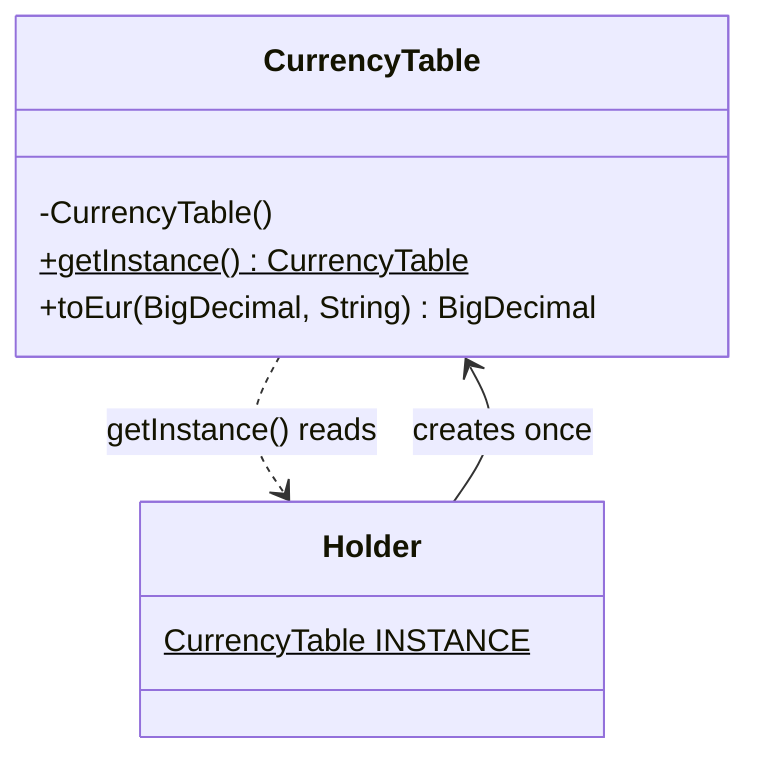
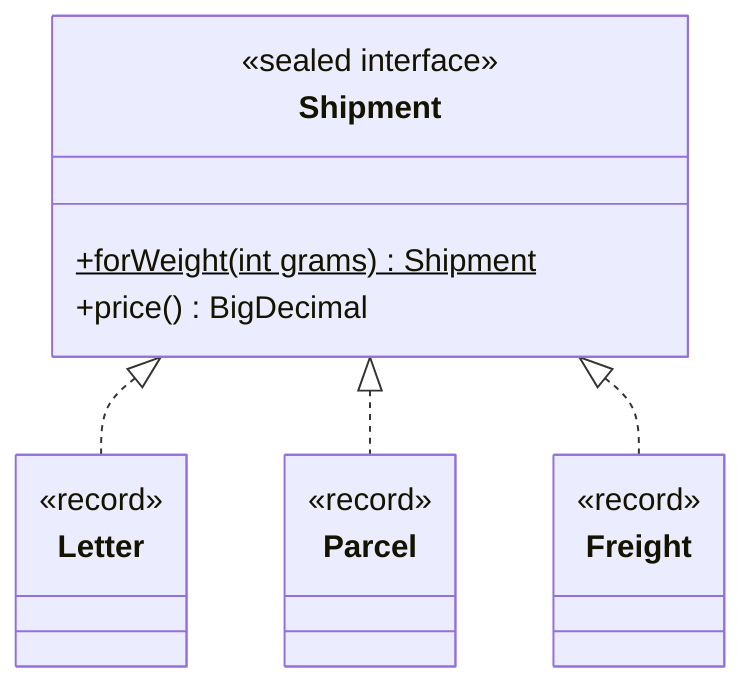
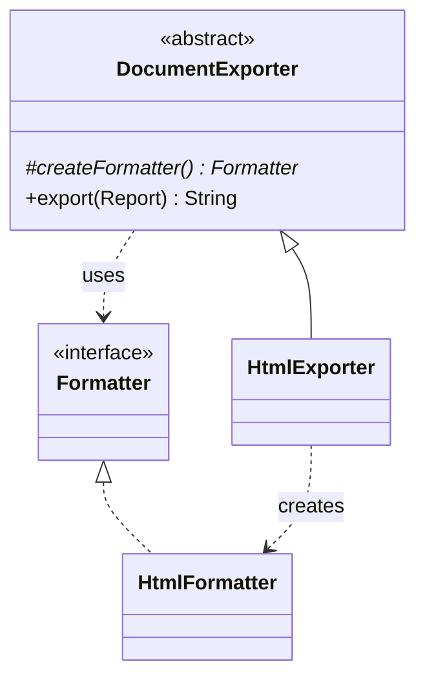
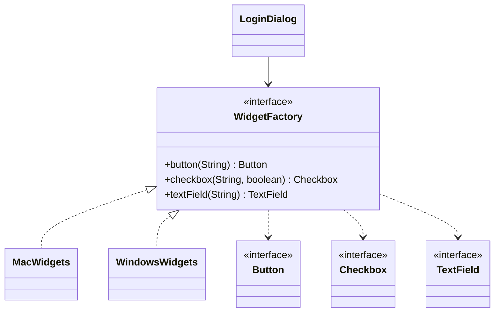
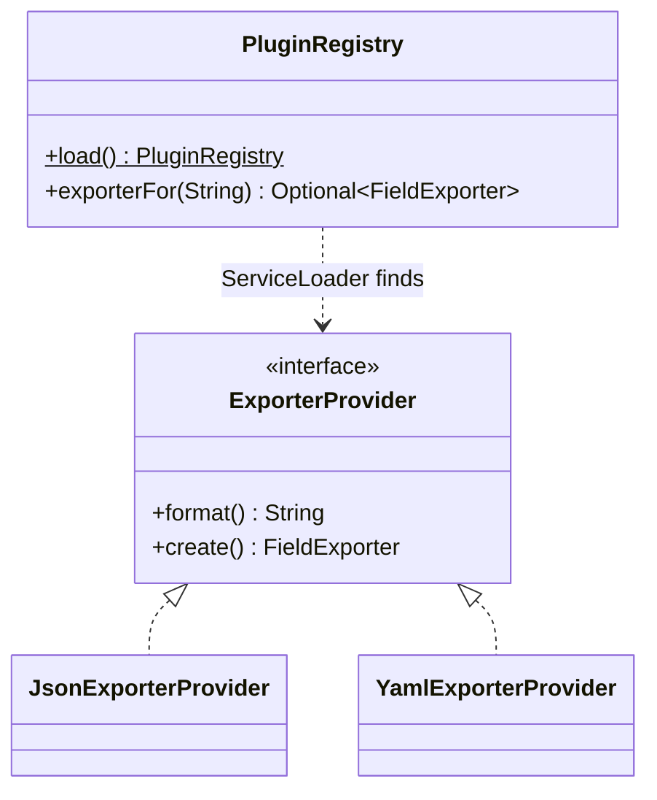

# Modül 02 — Yaratımsal Kalıplar I: Fabrikalar

> **3. Hafta** · Ön koşullar: m01 (OCP, DIP, bileşim kökü) · Tahmini çalışma süresi: 5 saat
>
> Her örneği derlemeden çalıştırın: `java modules/m02-creational-factories/src/main/java/io/github/aliturgutbozkurt/patterns/m02/examples/<yol>/<Demo>.java` (JDK 27)

## Öğrenme çıktıları

Bu modülün sonunda şunları yapabilirsiniz:

1. İş parçacığı güvenli bir Singleton (Tekil Nesne) (enum, lazy holder) **yazmak** ve global durumun test
   edilebilirliğe neden zarar verdiğini **açıklamak**.
2. Anlamlı adlara sahip, nesne önbellekleyen ve alt tip seçen statik fabrika metotları **yazmak**.
3. Factory Method (Fabrika Metodu) kalıbını klasik (alt sınıf kancası) ve modern (`Supplier`, enum kaydı)
   biçimleriyle **uygulamak**.
4. Bir ürün ailesini tutarlı tutan bir Abstract Factory (Soyut Fabrika) **uygulamak**.
5. `ServiceLoader` ile uygulamaları çalışma zamanında **yüklemek**.
6. Bir soruna hangi yaratımsal tekniğin uyduğuna **karar vermek** — "doğrudan kurucuyu çağır" dahil.

## Motivasyon

`new HtmlFormatter()` zararsız görünür. Ama `new` diyen satır *hangi sınıfın* kullanılacağına karar verir; m01 de
bize bu tür kararların olabildiğince az yerde durması gerektiğini öğretti (OCP, DIP). Bu modüldeki beş teknik, bu
kararı daha iyi bir yere taşır: adı olan bir metoda, bir alt sınıfa, bir aile nesnesine ya da bir yapılandırma
dosyasına.

## Singleton

### Problem

Bazı şeyler uygulama başına bir kez var olmalıdır: bir ayarlar nesnesi, yavaş bir servisten yüklenen döviz kurları
tablosu. Onları iki kez oluşturmak zaman kaybettirir ya da daha kötüsü, iki kopyanın birbiriyle çelişmesine yol açar.

### Amaç

> Bir sınıfın yalnızca **tek bir nesnesi** olmasını sağlamak ve ona global bir erişim noktası sunmak.

### Yapı



### Klasik Java

Private bir kurucu başkalarının `new` demesini engeller; statik bir alan tek nesneyi tutar:

```java
// file: examples/singleton/testability/before/SequenceGenerator.java
public final class SequenceGenerator {

    private static final SequenceGenerator INSTANCE = new SequenceGenerator();

    // Mutable state behind a global access point — the problem this example demonstrates.
    private int next = 1;

    private SequenceGenerator() {}

    public static SequenceGenerator getInstance() {
        return INSTANCE;
    }
```

Bu nesne, sınıf başlatıldığında oluşturulur. Oluşturmak pahalıysa, **lazy holder** (tembel tutucu) yöntemi bunu
ilk `getInstance()` çağrısına kadar erteler. JVM iç içe `Holder` sınıfını yalnızca ilk kullanıldığında başlatır ve
sınıf başlatma, dil spesifikasyonu gereği iş parçacığı güvenlidir — `synchronized` yok, çift kontrollü kilitleme yok:

```java
// file: examples/singleton/holder/CurrencyTable.java
    private static final class Holder {
        static final CurrencyTable INSTANCE = new CurrencyTable();
    }

    public static CurrencyTable getInstance() {
        return Holder.INSTANCE;
    }
```

Testler iki iddiayı da kanıtlar: yeni bir sınıf yükleyicide (class loader) `creations()`, `getInstance()` çalışana
kadar 0'dır; aynı anda `getInstance()` çağıran 1000 sanal iş parçacığı, bir kez oluşturulmuş tek bir nesne görür.

### Modern Java 27

Tek elemanlı bir `enum`, en basit doğru Singleton'dır. JVM tek nesneyi, iş parçacığı güvenli oluşturmayı ve ne
serileştirmenin ne de reflection'ın ikinci bir nesne üretemeyeceğini garanti eder (ikisi de `EnumSingletonTest`'te
test edilir):

```java
// file: examples/singleton/enumsingleton/AppSettings.java
public enum AppSettings {
    INSTANCE;

    private final Map<String, String> values = Map.of(
            "app.name", "PatternShop",
            "currency", "EUR",
            "page.size", "20");
```

### Singleton neden çoğu zaman bir anti-kalıptır

`OrderService`'in neye bağımlı olduğuna bakın:

```java
// file: examples/singleton/testability/before/OrderService.java
    public String placeOrder() {
        return "ORD-" + SequenceGenerator.getInstance().next();
    }
```

Kurucusunda ya da imzasında hiçbir şey bu bağımlılığı göstermez ve sayaç **global değiştirilebilir durumdur**: iki
"bağımsız" servis birbirinin numaralarını sürdürür; bir testin sonucu, ondan önce hangi testlerin çalıştığına bağlı
olur. Çözüm m01'deki Bağımlılığın Tersine Çevrilmesi'dir — bağımlılığı isteyin:

```java
// file: examples/singleton/testability/after/OrderService.java
    public OrderService(IdSource ids) {
        this.ids = Objects.requireNonNull(ids, "ids");
    }
```

"Yalnızca tek nesne" artık sınıfın bir özelliği değil, bileşim kökünün verdiği bir karardır:

```text
== before: OrderService calls SequenceGenerator.getInstance() ==
a second OrderService continues the first one's numbers: true
== after: the IdSource is injected ==
shared on purpose: ORD-1, ORD-2
separate sources: ORD-1, ORD-1
fixed for a test: ORD-42
```

### Ara not: Lazy Constants (önizleme)

> ⚠️ **Önizleme özelliği — notlandırılan kodda kullanılmaz.** JDK 27'de *Lazy Constants* (JEP 531, üçüncü önizleme)
> vardır: ilk erişimde bir kez hesaplanan ve sonra JVM tarafından sabit gibi ele alınan bir değeri tanımlamanın JDK
> destekli yolu. Elle yazılan lazy holder'ların yerini almayı amaçlar. Önizleme API'si olduğu için hâlâ
> değişebilir; bu ders holder yöntemini kullanır. Ayrıntılar: [JEP 531](https://openjdk.org/jeps/531) ve
> [docs/java27-features.md](../../../docs/java27-features.md).

### Gerçek dünyada kullanımı

`Runtime.getRuntime()` klasik bir Singleton'dır. `Collections.emptyList()` paylaşılan tek bir değişmez nesne
döndürür. Spring gibi çatılar "singleton kapsamlı" bean'ler oluşturur — uygulama başına bir nesne, ama global bir
erişim noktasından alınmaz, enjekte edilir.

### Tuzaklar ve ne zaman KULLANILMAMALI

- Global değiştirilebilir durum: gizli bağlaşım ve sıraya bağlı testler (yukarıya bakın). Enjeksiyonu tercih edin.
- "Tek nesne" aslında "**sınıf yükleyici başına** tek nesne"dir — tembellik testi tam da bunu kullanarak yeni bir
  kopya elde eder.
- Çift kontrollü kilitlemeyle elle yazılan tembel başlatmayı yanlış yapmak kolaydır (`volatile` gerektirir); holder
  yöntemini ya da bir `enum` kullanın.

### İlgili kalıplar

`getInstance()` metodu bir **Static Factory Method (Statik Fabrika Metodu)**'dur. Soyut fabrikalar çoğu zaman tek
nesnedir. m03, genel çözüm olarak DI'yi gösterir.

## Static Factory Method

### Problem

Kurucuların hepsi sınıfın adını taşır, var olan bir nesneyi döndüremez ve her zaman tam olarak kendi sınıflarını
döndürür. Bu üç sınır çabuk kendini gösterir: `new Temperature(100)` — Celsius mı, Fahrenheit mı?

### Amaç

> Public bir kurucunun yerine (ya da yanında) bir nesne döndüren **statik bir metot** sunmak.

(Bu, 23 GoF kalıbından biri değildir, ama JDK'daki en yaygın yaratımsal tekniktir.)

### Yapı



### Klasik Java

**Adlar.** Bir fabrika ne yaptığını söyler:

```java
// file: examples/staticfactory/Money.java
    /** {@code Money.of("12.50", "EUR")}. */
    public static Money of(String amount, String currencyCode) {
        return new Money(new BigDecimal(amount), Currency.getInstance(currencyCode));
    }

    /** Zero in the given currency. */
    public static Money zero(String currencyCode) {
        return of("0", currencyCode);
    }
```

Adlar, iki fabrikanın aynı parametre listesini paylaşmasına bile izin verir — aşırı yüklenmiş (overloaded)
kurucularla bu imkânsızdır:

```java
// file: examples/staticfactory/Temperature.java
    public static Temperature ofKelvin(double kelvin) {
        return new Temperature(kelvin);
    }

    public static Temperature ofCelsius(double celsius) {
        return new Temperature(celsius + ZERO_CELSIUS_IN_KELVIN);
    }
```

**Önbellekleme.** `new` her zaman bir nesne oluşturur; bir fabrika ise `Integer.valueOf`'un yaptığı gibi paylaşılan
bir nesne verebilir:

```java
// file: examples/staticfactory/Percentage.java
    /** The shared instance for {@code 0..100}; equal percentages are the same object. */
    public static Percentage of(int value) {
        if (value < 0 || value > 100) {
            throw new IllegalArgumentException("percentage must be in 0..100: " + value);
        }
        return CACHE[value];
    }
```

### Modern Java 27

**Alt tip seçmek.** Sealed bir arayüzdeki fabrika, girdiye uyan record'u döndürür; çağıran yalnızca `Shipment` ile
çalışır:

```java
// file: examples/staticfactory/Shipment.java
    /** Letter up to 500 g, parcel up to 30 kg, freight above. */
    static Shipment forWeight(int grams) {
        if (grams <= 0) {
            throw new IllegalArgumentException("weight must be positive: " + grams + " g");
        }
        if (grams <= LETTER_LIMIT_GRAMS) {
            return new Letter(grams);
        }
        return grams <= PARCEL_LIMIT_GRAMS ? new Parcel(grams) : new Freight(grams);
    }
```

```text
300 g -> Letter 2.50
2500 g -> Parcel 7.50
45000 g -> Freight 53.50
```

JDK genelinde kullanılan adlandırma gelenekleri:

| Ad | Anlamı | JDK örneği |
|---|---|---|
| `of` | bileşenlerden oluştur | `List.of`, `LocalDate.of`, `Path.of` |
| `from` | başka bir tipten dönüştür | `Instant.from(temporal)` |
| `valueOf` | `of` gibi, eski stil, çoğu zaman önbellekli | `Integer.valueOf`, `String.valueOf` |
| `parse` | metinden oku | `Integer.parseInt`, `Duration.parse` |
| `getInstance` / `instance` | paylaşılan bir nesne döndürebilir | `Currency.getInstance` |
| `newX` | her zaman yeni bir nesne | `Files.newBufferedReader` |

### Gerçek dünyada kullanımı

`List.of(...)` eleman sayısına göre farklı gizli sınıflar döndürür; `EnumSet.of(...)` enum'un büyüklüğüne göre
`long` tabanlı ya da dizi tabanlı bir uygulama seçer; `Optional.of`, `Duration.ofMinutes`, `Path.of`.

### Tuzaklar ve ne zaman KULLANILMAMALI

- Yalnızca private bir kurucusu olan sınıf alt sınıflanamaz (çoğu zaman bu bir özelliktir).
- Fabrikalar Javadoc'ta kuruculardan daha zor fark edilir — adlandırma geleneklerine uyun.
- Yalnızca **değişmez** nesneleri önbelleğe alın; paylaşılan değiştirilebilir bir nesne, kılık değiştirmiş bir
  Singleton'dır.

### İlgili kalıplar

Singleton'ın `getInstance()`'ı; **Flyweight (Sinek Siklet)** (m05) önbelleklemenin ileri götürülmüş hâlidir; çok
parametre için **Builder (İnşacı)** (m03).

## Factory Method

### Problem

Bir dışa aktarıcının tek bir algoritması vardır — başlığı, başlık satırını, her satırı ve sonu yaz — ama ihtiyaç
duyduğu *biçimlendirici* çıktı biçimine göre değişir. Algoritmanın içine bir `if (format == …)` koymak OCP'yi ihlal
eder.

### Amaç

> Nesne oluşturmak için bir arayüz tanımlamak, ama **hangi sınıfın örnekleneceğine alt sınıfların karar vermesini**
> sağlamak.

### Yapı



### Klasik Java

Oluşturucunun (creator) algoritması bir kez yazılır ve soyut **fabrika metodunu** çağırır:

```java
// file: examples/factorymethod/export/classic/DocumentExporter.java
public abstract class DocumentExporter {

    /** The factory method. */
    protected abstract Formatter createFormatter();

    public final String export(Report report) {
        Formatter formatter = createFormatter();
        var out = new StringBuilder(formatter.begin(report.title()));
        out.append(formatter.header(report.header()));
        for (List<String> row : report.rows()) {
            out.append(formatter.row(row));
        }
        return out.append(formatter.end()).toString();
    }
}
```

Her alt sınıf yalnızca ürünü seçer:

```java
// file: examples/factorymethod/export/classic/HtmlExporter.java
public final class HtmlExporter extends DocumentExporter {

    @Override
    protected Formatter createFormatter() {
        return new HtmlFormatter();
    }
}
```

### Modern Java 27

Tek görevi bir kurucuyu çağırmak olan bir alt sınıf fazlasıyla törenseldir. Bir `Supplier<Formatter>` aynı işi
görür ve bir enum her biçim için bir kurucu referansı tutabilir:

```java
// file: examples/factorymethod/export/modern/ExportFormat.java
public enum ExportFormat {
    MARKDOWN(MarkdownFormatter::new),
    HTML(HtmlFormatter::new),
    CSV(CsvFormatter::new);
```

`ExportTest`, klasik ve modern sürümlerin her biçim için birebir aynı metni ürettiğini kanıtlar.

### İkinci örnek: lojistik

`Logistics.planDelivery`, `Transport`'a göre bir kez yazılmış iş mantığıdır; `RoadLogistics` bir `Truck`,
`SeaLogistics` bir `Ship` oluşturur. Bir test, `Logistics`'e dokunmadan hava yolu seçeneği ekler:

```java
// file: examples/factorymethod/logistics/Logistics.java
    /** The factory method. */
    protected abstract Transport createTransport();

    public final String planDelivery(Cargo cargo) {
        Transport transport = createTransport();
```

```text
Road: Machine parts by Truck, 1200 km, cost 1440.00, 2 day(s)
Sea: Machine parts by Ship, 1200 km, cost 980.00, 5 day(s)
```

### Gerçek dünyada kullanımı

`Iterable.iterator()`, JDK'nın en bilinen fabrika metodudur: her koleksiyon kendisine uyan yineleyiciyi oluşturur ve
gelişmiş `for` döngüsü yalnızca `Iterator`'ı bilir. `NumberFormat.getInstance(locale)` ve `Charset.newEncoder()`
diğer örneklerdir.

### Tuzaklar ve ne zaman KULLANILMAMALI

- Ürün başına bir alt sınıf patlamaya yol açabilir; alt sınıf başka bir şey yapmıyorsa bir `Supplier` ya da enum
  kaydı tercih edin.
- Tek bir ürün varsa ve farklılık beklenmiyorsa doğrudan kurucuyu çağırın.

### İlgili kalıplar

`export`, bir adımı fabrika metodu olan bir **Template Method (Şablon Metot)**'tur (m06). Bir **Abstract Factory**,
bütün bir aile için fabrika metotları kümesidir.

## Abstract Factory

### Problem

Bir giriş penceresi bir metin alanı, bir onay kutusu ve bir düğme ister. macOS'ta hepsi macOS gibi, Windows'ta
Windows gibi görünmelidir. Pencere kurucuları doğrudan çağırırsa, unutulan tek bir `new` Mac'te bir Windows onay
kutusu çıkarır.

### Amaç

> Birbiriyle ilişkili **nesne ailelerini**, somut sınıflarını belirtmeden oluşturmak için bir arayüz sunmak.

### Yapı



### Klasik Java

Ailenin her ürünü için bir oluşturma metodu:

```java
// file: examples/abstractfactory/ui/WidgetFactory.java
public interface WidgetFactory {

    Button button(String label);

    Checkbox checkbox(String label, boolean checked);

    TextField textField(String label);
}
```

İstemci bütün pencereyi kendisine verilen aileden kurar ve hiçbir somut bileşeni adıyla anmaz:

```java
// file: examples/abstractfactory/ui/LoginDialog.java
    public LoginDialog(WidgetFactory factory) {
        Objects.requireNonNull(factory, "factory");
        widgets = List.of(
                factory.textField("Username"),
                factory.textField("Password"),
                factory.checkbox("Remember me", true),
                factory.button("Log in"));
    }
```

### Modern Java 27

Somut ürünler, fabrikalarının içinde **private iç içe record'lar** olabilir — istemciler onların adını bile
yazamaz, dolayısıyla aileleri karıştırmak imkânsızdır:

```java
// file: examples/abstractfactory/ui/MacWidgets.java
public final class MacWidgets implements WidgetFactory {

    private static final String PLATFORM = "macOS";

    private record MacButton(String label) implements Button {
        @Override public String platform() { return PLATFORM; }
        @Override public String render() { return "( " + label + " )"; }
    }
```

Aile, bileşim kökünde, bir statik fabrika tarafından **bir kez** seçilir:

```java
// file: examples/abstractfactory/ui/WidgetFactories.java
    public static WidgetFactory forOs(String osName) {
        return osName.toLowerCase(Locale.ROOT).startsWith("mac") ? new MacWidgets() : new WindowsWidgets();
    }
```

```text
-- Mac OS X
[macOS] Username: (__________)
[macOS] Password: (__________)
[macOS] ◉ Remember me
[macOS] ( Log in )
-- Windows 11
[Windows] Username: [__________]
[Windows] Password: [__________]
[Windows] [x] Remember me
[Windows] [ Log in ]
```

### İkinci örnek: bulut sağlayıcılar

İki kurgusal sağlayıcıdan depolama ve mesaj kuyruğu: bir `acme://…` URI'si asla Nimbus kuyruğuna verilmemelidir.
`ReportArchiver` iki ürünü de tek bir `CloudFactory`'den alır:

```java
// file: examples/abstractfactory/cloud/ReportArchiver.java
    public ReportArchiver(CloudFactory cloud) {
        Objects.requireNonNull(cloud, "cloud");
        this.storage = cloud.storage();
        this.queue = cloud.queue();
    }
```

### Gerçek dünyada kullanımı

Bir JDBC `Connection`, tek bir veritabanına bağlı bir aile için fabrikadır: `createStatement()`,
`prepareStatement(...)`, `createBlob()`. `javax.xml.parsers.DocumentBuilderFactory` ve Swing'in görünüm ve
hissi (`UIManager`) diğer örneklerdir.

### Tuzaklar ve ne zaman KULLANILMAMALI

- Yeni bir **ürün** (örneğin bir kaydırıcı) eklemek arayüzü ve her aileyi değiştirir — m01'deki ifade problemi
  yeniden. Yeni bir **aile** eklemek ise kolaydır.
- Tek bir aile varsa ek arayüzler gereksiz yüktür.

### İlgili kalıplar

Her oluşturma metodu bir **Factory Method**'dur; fabrika çoğu zaman tek bir nesnedir; **Bridge (Köprü)** (m05) de
iki değişim boyutunu birbirinden ayırır.

## ServiceLoader

### Problem

Bir uygulama, kendisi yayımlandıktan *sonra* yazılan dışa aktarma biçimlerini desteklemelidir — ayrı JAR'larda
eklentiler olarak. Kod henüz var olmayan sınıfları adıyla anamaz.

### Nasıl çalışır

1. Bir **servis sağlayıcı arayüzü** (service provider interface, SPI) tanımlayın — burada `ExporterProvider`.
2. Her sağlayıcı onu uygular ve public, argümansız bir kurucuya sahiptir.
3. Sağlayıcının JAR'ı onu `META-INF/services/<SPI'nin tam adı>` dosyasında, satır başına bir sınıf adıyla listeler.
4. `ServiceLoader.load(ExporterProvider.class)` onları çalışma zamanında bulur ve örnekler.



### Örnek

Yapılandırma dosyası `src/main/java/META-INF/services/io.github.aliturgutbozkurt.patterns.m02.examples.serviceloader.ExporterProvider`:

```text
# Exporter plugins found by ServiceLoader (see PluginRegistry). One fully qualified class name per line.
io.github.aliturgutbozkurt.patterns.m02.examples.serviceloader.JsonExporterProvider
io.github.aliturgutbozkurt.patterns.m02.examples.serviceloader.YamlExporterProvider
```

Kayıt (registry) hiçbir sağlayıcı sınıfını adıyla anmaz:

```java
// file: examples/serviceloader/PluginRegistry.java
    /** A registry over every provider {@link ServiceLoader} finds on the class path. */
    public static PluginRegistry load() {
        return new PluginRegistry(ServiceLoader.load(ExporterProvider.class).stream()
                .map(ServiceLoader.Provider::get)
                .toList());
    }
```

`ServiceLoader.stream()` tembel `Provider` tutamaçları döndürür: `provider.type()` sınıfı onu örneklemeden **söyler**,
`provider.get()` onu oluşturur. Modül sistemiyle aynı kayıt `module-info.java` içinde `provides … with …` olarak
yazılır.

```text
providers on the class path: [JsonExporterProvider, YamlExporterProvider]
formats: [json, yaml]
```

Bu modül yapılandırma dosyasını kaynakların yanında tutar (ve Maven derlemesi için kopyalar); böylece
`java PluginDemo.java` eklentileri hiçbir derleme adımı olmadan bulur.

### Gerçek dünyada kullanımı

JDBC sürücüleri, `java.nio.file.spi.FileSystemProvider` (zip dosya sistemi), `javax.script` motorları ve
`java.time.zone.ZoneRulesProvider`, `ServiceLoader` ile bulunur.

### Tuzaklar ve ne zaman KULLANILMAMALI

- Yapılandırma dosyasındaki bir yazım hatası ancak çalışma zamanında ortaya çıkar (`ServiceConfigurationError`).
- Yineleme sırası belirtilmemiştir — sıra önemliyse, `PluginRegistry`'nin yaptığı gibi sıralayın.
- Birlikte yayımladığınız kod için düz bir fabrika daha basittir ve derleyici tarafından denetlenir.

## Yaratımsal bir teknik seçmek

| Durum | Kullanın |
|---|---|
| Tek, bariz bir sınıf; farklılık yok | `new` — gerçekten |
| Daha açık adlar, önbellekleme, ayrıştırma ya da alt tip seçimi | Static Factory Method |
| Taban sınıftaki bir algoritma değişen bir ürüne ihtiyaç duyuyor | Factory Method (ya da bir `Supplier`) |
| Birbirine uyması gereken birkaç ürün | Abstract Factory |
| Uygulamalar derleme zamanında bilinmiyor (eklentiler) | `ServiceLoader` |
| "Yalnızca bir tane olmalı" | Bileşim kökünün oluşturduğu tek nesne; `enum` Singleton yalnızca gerçek global sabitler için |

## Özet

| Kalıp | Ne zaman kullanılır | Ne zaman kaçınılır | Java 27 kısayolu |
|---|---|---|---|
| Singleton | Tek, durumsuz ya da değişmez global bir kaynak | Bir bağımlılığı gizliyor ya da değiştirilebilir durum tutuyorsa | `enum X { INSTANCE }` |
| Static Factory Method | Adlar, önbellekleme ya da alt tip seçimi çağırana yardımcı oluyorsa | Düz bir kurucu yeterince açıksa | Sealed arayüzde fabrika |
| Factory Method | Taban sınıftaki bir algoritma değişen bir ürüne ihtiyaç duyuyorsa | Alt sınıf yalnızca `new` diyecekse | `Supplier<T>`, `X::new` enum'u |
| Abstract Factory | Ürünler tek bir aileden gelmeliyse | Tek bir aile varsa | Ürün olarak private iç içe record'lar |
| ServiceLoader | Yayından sonra eklenen eklentiler | Her şey birlikte yayımlanıyorsa | `ServiceLoader.stream()` |

## Sınav

1. Neden ne serileştirme ne de reflection bir `enum` Singleton'ın ikinci bir nesnesini oluşturabilir?
2. Lazy holder yönteminin hem tembel hem iş parçacığı güvenli olmasını ne garanti eder?
3. `OrderService` içindeki `SequenceGenerator.getInstance()`'ın yol açtığı iki somut sorunu sayın.
4. Statik bir fabrika metodunun yapabildiği ama bir kurucunun yapamadığı üç şey söyleyin.
5. `Percentage.of` neden paylaşılan nesneler döndürebilir de değiştirilebilir bir sınıf bunu yapmamalıdır?
6. Klasik dışa aktarıcıda hangi metot fabrika metodu, hangisi şablon metottur?
7. Biçim başına bir alt sınıf yerine ne zaman kurucu referanslarından oluşan bir `enum` tercih edersiniz?
8. Bir Abstract Factory'ye yeni bir *ürün* eklendiğinde ve yeni bir *aile* eklendiğinde neler değişmelidir?
9. `ServiceLoader`, `JsonExporterProvider`'ı nasıl bulur ve dosyadaki sınıf adı yanlış yazılmışsa ne olur?

<details><summary>Cevaplar</summary>

1. Bir enum sabiti serileştirmeden geri okunurken var olan sabit adıyla aranır ve `Constructor.newInstance` enum
   nesnesi oluşturmayı reddeder (`IllegalArgumentException`).
2. İç içe `Holder` sınıfı yalnızca `getInstance()` ilk kez `Holder.INSTANCE`'ı okuduğunda başlatılır ve JVM sınıf
   başlatmayı bir kilit altında tam olarak bir kez çalıştırır.
3. Bağımlılık gizlidir (kurucuda yoktur) ve global değiştirilebilir sayaç, servislerin ve testlerin birbirini
   etkilemesine yol açar.
4. Açıklayıcı bir ada sahip olmak, önbellekteki bir nesneyi döndürmek, girdiye göre seçilen bir alt tip döndürmek
   (ayrıca: karar vermeden önce girdiyi ayrıştırmak).
5. `Percentage` değişmezdir, bu yüzden paylaşım çağıranlara görünmez; değiştirilebilir bir nesneyi paylaşmak
   değişikliklerin aralarında sızmasına yol açar.
6. `createFormatter()` fabrika metodudur; `export(Report)` onu çağıran şablon metottur.
7. Her alt sınıf tek bir kurucuyu çağırmaktan başka bir şey yapmayacaksa — enum biçim başına tek satırdır ve başka
   sorumluluklar edinemez.
8. Yeni bir ürün, fabrika arayüzünü ve her aileyi değiştirir; yeni bir aile ise yalnızca yeni bir fabrika sınıfıdır.
9. Sınıf yolundaki `META-INF/services/<SPI adı>` dosyasını okur ve listelenen her sınıfı örnekler; yanlış yazılmış
   bir ad çalışma zamanında `ServiceConfigurationError` fırlatır.

</details>

## Ödevler

- [01 — Static factory'lerle renk değerleri](../assignments/01-colour-factories.tr.md) ★★☆
- [02 — Abstract Factory ile oyun seviyeleri](../assignments/02-game-levels.tr.md) ★★☆

## İleri okuma

- Gamma, Helm, Johnson, Vlissides, *Design Patterns* (1994) — Singleton, Factory Method, Abstract Factory.
- Joshua Bloch, *Effective Java*, 3. baskı (2018), madde 1 (statik fabrika metotları) ve madde 3 (enum singleton).
- Java Dil Spesifikasyonu, [§12.4 Sınıf ve Arayüzlerin Başlatılması](https://docs.oracle.com/javase/specs/jls/se25/html/jls-12.html#jls-12.4)
- [`java.util.ServiceLoader`](https://docs.oracle.com/en/java/javase/25/docs/api/java.base/java/util/ServiceLoader.html) API belgeleri
- JEP 531 — [Lazy Constants (Third Preview)](https://openjdk.org/jeps/531)
- Terimlerin Türkçesi: [docs/glossary.md](../../../docs/glossary.md)
