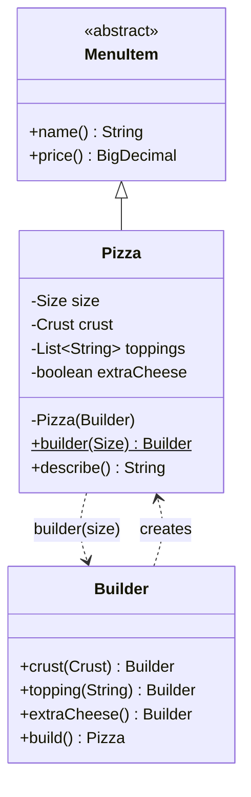
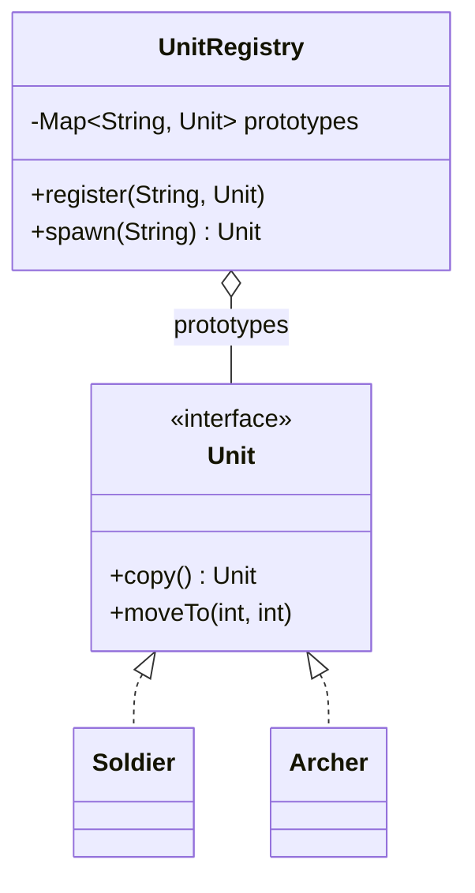
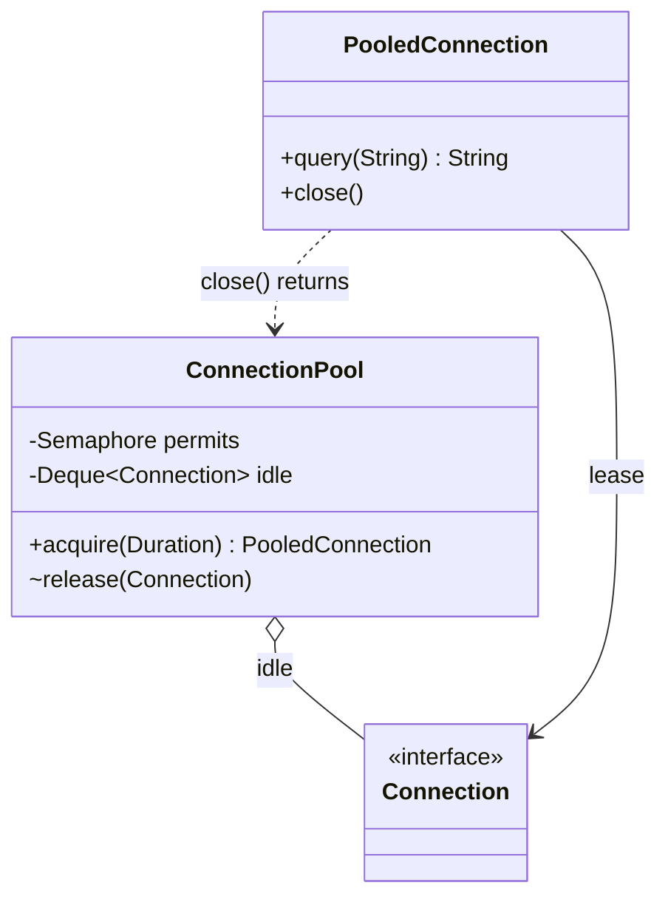
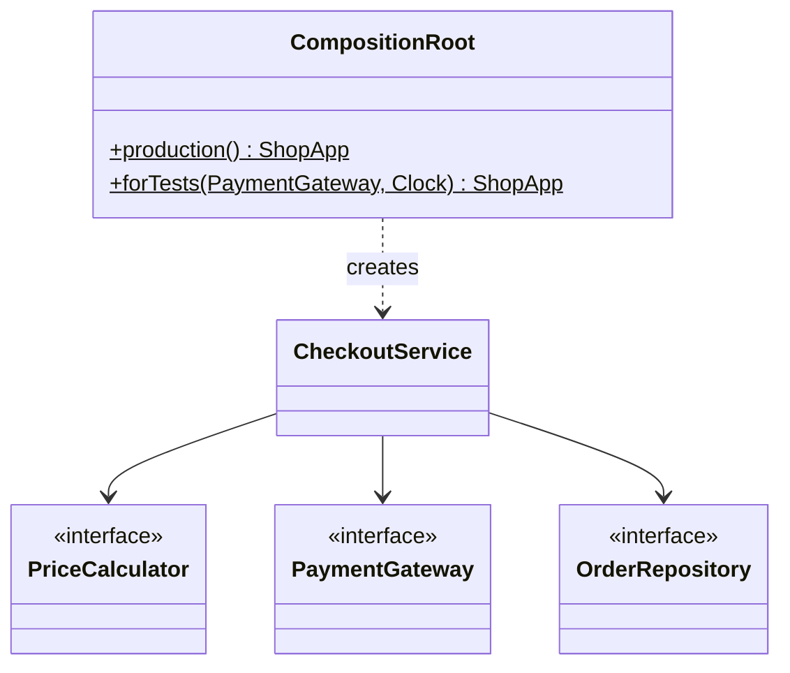

# Module 03 — Creational Patterns II: Construction

> **Week 4** · Prerequisites: m02 (factories), m01 (DIP, composition root) · Estimated study time: 5 h
>
> Run every example without a build: `java modules/m03-creational-construction/src/main/java/io/github/aliturgutbozkurt/patterns/m03/examples/<path>/<Demo>.java` (JDK 27)

## Learning outcomes

By the end of this module you can:

1. **Implement** a classic Builder with validation in `build()`, a record with a nested builder, and `with` copies.
2. **Design** a step builder whose types make an incomplete object impossible to build.
3. **Explain** shallow vs. deep copy and **implement** Prototype with copy constructors and a registry.
4. **Implement** a bounded Object Pool and **decide** when pooling helps — and why virtual threads are never pooled.
5. **Wire** an application in a composition root and swap collaborators for fakes in tests.

## Motivation

m02 decided *which* class to create. This module is about *how* to assemble an object: when it has many optional
parts (Builder), when a ready-made one should be copied (Prototype), when creating it is so expensive that it should
be reused (Object Pool), and when a whole graph of objects has to be put together (dependency injection).

## Builder

### Problem

A pizza has a size, a crust, up to five toppings and optional extra cheese. A constructor with every combination —
`Pizza(Size)`, `Pizza(Size, Crust)`, `Pizza(Size, Crust, List<String>, boolean)` — is a *telescoping constructor*:
hard to read (`new Pizza(LARGE, null, List.of(), true)`?) and it cannot check rules that involve several parts.

### Intent

> Separate the construction of a complex object from its representation, so it can be built **step by step** and
> validated **as a whole**.

### Structure



### Classic Java

The required part goes into `builder(size)`; optional parts read like sentences:

```java
// file: examples/builder/PizzaDemo.java
        Pizza deluxe = Pizza.builder(Size.LARGE)
                .topping("mushroom")
                .topping("olives")
                .crust(Crust.STUFFED)
                .extraCheese()
                .build();
```

`build()` checks the rules that involve several parts before an immutable `Pizza` exists:

```java
// file: examples/builder/classic/Pizza.java
        /** Validates the combination and creates the pizza. */
        public Pizza build() {
            if (toppings.size() > MAX_TOPPINGS) {
                throw new IllegalStateException("at most " + MAX_TOPPINGS + " toppings, got " + toppings.size());
            }
```

`Pizza` extends `MenuItem(name, price)`, and its price depends on the builder's choices. Before Java 25 that
calculation had to hide in a static helper, because nothing could run before `super(...)`. With **flexible
constructor bodies** (JEP 513) it can be written in place — and the compiler enforces the rule of this early phase:
fields may be **assigned** but not **read** before `super(...)`:

```java
// file: examples/builder/classic/Pizza.java
    private Pizza(Builder builder) {
        // Flexible constructor body (JEP 513): before super(...) we may compute with locals and *assign* our fields,
        // but not *read* them — so the price is computed from the builder's values.
        List<String> chosenToppings = List.copyOf(builder.toppings);
        BigDecimal price = builder.size.basePrice
                .add(TOPPING_PRICE.multiply(BigDecimal.valueOf(chosenToppings.size())))
                .add(builder.extraCheese ? EXTRA_CHEESE_PRICE : BigDecimal.ZERO)
                .add(builder.crust == Crust.STUFFED ? STUFFED_CRUST_PRICE : BigDecimal.ZERO);
        size = builder.size;
        crust = builder.crust;
        toppings = chosenToppings;
        extraCheese = builder.extraCheese;
        super(builder.size.name().toLowerCase(Locale.ROOT) + " pizza", price);
    }
```

A second classic builder mirrors the JDK's own `java.net.http.HttpRequest.newBuilder()`. Each part is checked when
it is added (a header name, a timeout); the rules that combine parts are checked in `build()`:

```java
// file: examples/builder/classic/HttpRequest.java
        /** Checks the rules that involve several parts, then creates the request. */
        public HttpRequest build() {
            boolean hasBody = body != null;
            switch (method) {
                case GET, DELETE -> {
                    if (hasBody) {
                        throw new IllegalStateException(method + " request must not have a body");
                    }
                }
                case POST, PUT -> {
                    if (!hasBody) {
                        throw new IllegalStateException(method + " request needs a body");
                    }
                }
            }
            return new HttpRequest(this);
        }
```

### Modern Java 27

**Records with a builder.** A record already gives immutability, equality and one canonical constructor. Put all
validation in its compact constructor — the *one* place every path goes through — and let the builder hold only
defaults. `withX` methods create modified copies:

```java
// file: examples/builder/record/ServerConfig.java
public record ServerConfig(String host, int port, Duration timeout, boolean tls, int maxConnections) {
    // ...
    public ServerConfig withPort(int newPort) {
        return new ServerConfig(host, newPort, timeout, tls, maxConnections);
    }
    // ...
        private final String host;
        private int port = 8080;
        private Duration timeout = Duration.ofSeconds(30);
        private boolean tls;
        private int maxConnections = 100;
```

```text
defaults: ServerConfig[host=localhost, port=8080, timeout=PT30S, tls=false, maxConnections=100]
production: ServerConfig[host=api.example.com, port=443, timeout=PT10S, tls=true, maxConnections=500]
staging copy: ServerConfig[host=api.example.com, port=8443, timeout=PT10S, tls=true, maxConnections=500]
```

**Step builders.** A normal builder lets you call `build()` too early and fails at run time. A *step builder* returns
a different interface after each call, so only the legal next calls exist:

```java
// file: examples/builder/step/Query.java
    /** Step 1: choose columns. */
    public interface SelectStep {
        FromStep select(String... columns);

        FromStep selectAll();
    }

    /** Step 2: choose the table. */
    public interface FromStep {
        QueryStep from(String table);
    }
```

```java
// file: examples/builder/QueryDemo.java
        // Query.builder().select("name").build();   // does not compile: FromStep has no build()
```

```text
SELECT name, email FROM users WHERE active = true ORDER BY name LIMIT 20
SELECT * FROM orders WHERE total > 100 AND status = 'PAID' ORDER BY total DESC
```

### Real-world usage

`java.net.http.HttpRequest.newBuilder()`, `HttpClient.newBuilder()`, `StringBuilder`, `Stream.builder()`,
`Locale.Builder`, `ProcessBuilder` and `Thread.ofVirtual().name(...).start(...)` are all builders.

### Pitfalls and when NOT to use it

- A record with two or three components does not need a builder — the canonical constructor is readable enough.
- Validate in **one** place. With records, that place is the compact constructor; the builder only fills defaults.
- A builder is mutable and not thread-safe; the object it builds should be immutable.
- The query example concatenates text: fine for teaching, **not** safe against SQL injection — real code binds
  parameters.

### Related patterns

**Abstract Factory** (m02) returns a finished product in one call; a builder assembles one in steps. **Composite**
(m05) structures are often assembled by builders.

## Prototype

### Problem

A document template with sections and metadata took effort to configure; users want to start new documents from it.
Constructing each one from scratch repeats that work — copying the template is simpler. But *how* you copy matters.

### Intent

> Create new objects by **copying a prototypical instance**.

### Structure



### Classic Java

Java's built-in mechanism is `Cloneable` + `Object.clone()`. It copies fields one by one — a **shallow** copy: the
clone and the original share every object their fields refer to. A **copy constructor** says explicitly what to
copy:

```java
// file: examples/prototype/documents/DocumentTemplate.java
    /** Copy constructor: a deep copy — new lists and maps with the same (immutable) strings. */
    public DocumentTemplate(DocumentTemplate other) {
        this(other.title, other.sections, other.metadata);
    }

    /** Shallow copy: the clone shares {@code sections} and {@code metadata} with this template. */
    @Override
    public DocumentTemplate clone() {
        try {
            return (DocumentTemplate) super.clone();
        } catch (CloneNotSupportedException e) {
            throw new AssertionError("Cloneable is implemented", e);
        }
    }
```

```text
template: Invoice [Header, Lines, Totals] {lang=en}
== clone() then edit the copy ==
copy:     Receipt [Header, Lines, Totals, Signature] {lang=tr}
template: Invoice [Header, Lines, Totals, Signature] {lang=tr}   <- changed too!
== copy constructor then edit the copy ==
copy:     Receipt [Header, Lines, Totals, Signature] {lang=tr}
template: Invoice [Header, Lines, Totals] {lang=en}
```

Why `clone()` is considered broken: it creates objects **without calling a constructor**, so invariants are not
checked; it cannot re-assign `final` fields, so deep copies need non-final fields; `Cloneable` has no methods, and
`Object.clone()` is `protected` and throws a checked exception. Recent JDKs are also closing the reflective
back door for mutating `final` fields (JEP 500). Prefer copy constructors or a `copy()` method.

### Modern Java 27

**Immutable values need no copying — share them.** In the game-unit registry, `Stats` and `Position` are records:
a copy may simply reuse them. Only the *mutable* state (the field holding the position, the arrow count) is
per-copy:

```java
// file: examples/prototype/registry/Archer.java
    private Archer(Archer other) {
        this.stats = other.stats;
        this.position = other.position;
        this.arrows = other.arrows;
    }
```

A **prototype registry** stores configured units under a name and hands out copies — and it copies on the way *in*
as well, so a caller cannot change the stored prototype later:

```java
// file: examples/prototype/registry/UnitRegistry.java
    /** Stores a <em>copy</em>, so later changes to {@code prototype} do not leak into the registry. */
    public void register(String name, Unit prototype) {
        prototypes.put(name, prototype.copy());
    }

    public Unit spawn(String name) {
        Unit prototype = prototypes.get(name);
        if (prototype == null) {
            throw new IllegalArgumentException("unknown unit: " + name + " (known: " + names() + ")");
        }
        return prototype.copy();
    }
```

### Real-world usage

`ArrayList` has a copy constructor (`new ArrayList<>(other)`), `List.copyOf`, `Map.copyOf` and `EnumSet.copyOf`
create copies; `Object.clone()` still exists on arrays, where `array.clone()` is the idiomatic shallow copy.

### Pitfalls and when NOT to use it

- Shallow vs. deep: decide field by field — immutable objects may be shared, mutable ones must be copied.
- Deep copies of object graphs with cycles need care (a map of already-copied objects).
- With immutable records, "copying" is usually just reusing the object or calling a `withX` method.

### Related patterns

A **Composite** (m05) must copy its children recursively — as in assignment 02. **Memento** (m07) stores copies of
state.

## Object Pool

### Problem

Opening a database connection costs a TCP handshake, TLS and authentication — milliseconds each time — and the
database only accepts a limited number of connections. Creating one per request is slow and can overload the server.

### Intent

> Keep a set of **initialised, reusable objects** and lend them out instead of creating and destroying them.

### Structure



### Classic Java

A `Semaphore` bounds the number of leases; idle connections wait in a deque; new ones are created lazily up to the
limit; a timeout prevents waiting forever:

```java
// file: examples/pool/ConnectionPool.java
    public PooledConnection acquire(Duration timeout) throws InterruptedException {
        if (!permits.tryAcquire(timeout.toNanos(), TimeUnit.NANOSECONDS)) {
            throw new IllegalStateException("no connection available within " + timeout);
        }
        Connection connection;
        synchronized (this) {
            connection = idle.pollFirst();
            if (connection == null) {
                connection = factory.apply(++created);
            }
            inUse++;
            maxInUse = Math.max(maxInUse, inUse);
        }
        return new PooledConnection(this, connection);
    }
```

The lease is `AutoCloseable`, so try-with-resources always gives the connection back — even when the query throws:

```java
// file: examples/pool/ConnectionPoolDemo.java
            try (PooledConnection connection = sequential.acquire(Duration.ofSeconds(1))) {
                System.out.println(connection.query("SELECT " + i));
            }
```

```text
conn-1: SELECT 1
conn-1: SELECT 2
conn-1: SELECT 3
sequential use created 1 connection(s)
200 virtual threads, pool of 2: max in use <= 2? true, created <= 2? true
exhausted: no connection available within PT0.05S
```

### Modern Java 27

For years the most famous pool was the **thread pool**. Virtual threads (JEP 444) change that: they are cheap to
create, so every task gets its own and **virtual threads are never pooled**. What remains scarce is the resource the
tasks use — so bound *that*, with a `Semaphore`, and pool nothing at all:

```java
// file: examples/pool/throttle/ThrottledClient.java
    public String call(String request) throws InterruptedException {
        permits.acquire();
        try {
            peak.accumulateAndGet(current.incrementAndGet(), Math::max);
            return service.apply(request);
        } finally {
            current.decrementAndGet();
            permits.release();
        }
    }
```

```text
1000 calls on 1000 virtual threads completed: true
peak concurrent calls <= 5? true
```

Connection pools are still worth it (the connection is expensive, not the thread); pools of cheap objects are not —
modern garbage collectors allocate short-lived objects almost for free.

### Real-world usage

JDBC connection pools (HikariCP and others) behind `javax.sql.DataSource`; `ThreadPoolExecutor` for platform threads;
`Executors.newVirtualThreadPerTaskExecutor()` deliberately does **not** pool.

### Pitfalls and when NOT to use it

- A returned object may carry **stale state** (an open transaction, a changed setting) into the next lease — reset
  it on release.
- Leaks: a lease that is never returned shrinks the pool forever; try-with-resources prevents it.
- Pooling cheap objects makes code slower and more complex.

### Related patterns

**Flyweight** (m05) also shares objects, but immutable ones, and nobody "returns" them. **Proxy** (m04) can wrap a
pooled object so that `close()` returns it.

## Dependency injection as creation

### Problem

If every class creates its collaborators, nobody can replace them — not in tests, not in production. If they fetch
them from Singletons, the dependencies are hidden (m02). Someone still has to call `new`.

### Intent

> Create and wire the whole object graph in **one place** — the composition root — and pass every collaborator in
> through constructors.

### Structure



### Classic Java

The business class creates nothing, not even the clock:

```java
// file: examples/di/CheckoutService.java
    /** Prices, charges and stores the order; an unknown item fails before anything is charged. */
    public OrderRecord checkout(String customer, String item, int quantity) {
        BigDecimal total = prices.priceOf(item, quantity);
        String receipt = payments.charge(customer, total);
        var order = new OrderRecord(customer, item, quantity, total, receipt, clock.instant());
        orders.save(order);
        return order;
    }
```

### Modern Java 27

The composition root is plain code — no framework. Each collaborator is created once and shared: "singleton" by
wiring, not by a static field. Tests call the same wiring with a fake gateway and a fixed clock:

```java
// file: examples/di/CompositionRoot.java
    private static ShopApp wire(PaymentGateway gateway, Clock clock) {
        var orders = new InMemoryOrderRepository();
        var checkout = new CheckoutService(new CatalogPriceCalculator(CATALOG), gateway, orders, clock);
        return new ShopApp(checkout, orders);
    }
```

```text
ada bought 2 x keyboard for 99.80 (receipt PAY-1)
alan bought 1 x monitor for 229.00 (receipt PAY-2)
orders stored: 2
```

### Real-world usage

Every DI framework (Spring, Guice, Dagger, CDI) automates a composition root; `main` methods of small applications
are composition roots written by hand. Module m11 builds on this.

### Pitfalls and when NOT to use it

- A composition root that grows to hundreds of lines is a sign to split it by feature — or to adopt a framework.
- Do not pass the root (or a "service locator") into business classes; pass only what each class needs.

### Related patterns

It replaces most **Singletons** (m02) and uses **factories** for the collaborators it cannot create up front.

## Choosing a construction technique

| Situation | Use |
|---|---|
| Few parts, all required | Constructor or record |
| Many optional parts, rules across parts | Builder (record + builder when possible) |
| Order of steps matters, forgetting one must not compile | Step builder |
| New objects are variations of a configured one | Prototype (copy constructor / `copy()`), registry |
| Objects are expensive and limited (connections) | Object Pool |
| Threads for blocking tasks | Virtual thread per task + `Semaphore`, never a pool |
| Wiring a whole application | Composition root |

## Summary

| Pattern | Use when | Avoid when | Java 27 shortcut |
|---|---|---|---|
| Builder | Many optional parts; cross-part validation | Two or three required parts | Record + nested builder, `withX` copies |
| Step builder | Mandatory order of steps | Parts are all optional | One interface per step |
| Prototype | Copying is simpler than configuring | The object is immutable — just share it | Copy constructor, `copy()` |
| Object Pool | Creation is expensive and capacity limited | Objects are cheap; threads (use virtual threads) | `Semaphore` + `AutoCloseable` lease |
| Composition root | Building an application's object graph | — | Plain constructors, `Clock` injected |

## Quiz

1. What is a telescoping constructor and which two problems does a builder solve?
2. In `ServerConfig`, why does the compact constructor — not the builder — validate the port?
3. What does a step builder guarantee that a normal builder cannot?
4. In JEP 513's early construction phase, what may a constructor do with its own fields, and what may it not?
5. Why did `clone()` change the original template's sections but not its title?
6. Give three reasons why `Cloneable`/`clone()` is considered broken.
7. Why may a prototype copy share its `Stats` record but not the field holding its position?
8. Why should virtual threads not be pooled, and what should you bound instead?
9. How does a composition root differ from a Singleton?

<details><summary>Answers</summary>

1. A chain of constructors with ever more parameters. A builder makes calls readable (named steps, defaults) and can
   validate the combination of parts in `build()`.
2. Because every path — the builder, `withPort`, a direct constructor call — goes through the canonical constructor;
   validating there keeps the rule in exactly one place.
3. That `build()` (and every step) can only be called in the right order — mistakes are compile errors, not
   run-time exceptions.
4. It may assign its fields, but it may not read them (or otherwise use `this`) before `super(...)`.
5. The clone got its own `title` field (strings are immutable, re-assigning it affects only the clone), but both
   objects' `sections` fields refer to the same `ArrayList`.
6. It bypasses constructors (and their validation); it cannot re-assign `final` fields; `Cloneable` has no methods and
   `Object.clone()` is `protected`, returns `Object` and throws a checked exception.
7. `Stats` is immutable, so sharing it is invisible; the position changes per unit, so each copy needs its own field.
8. They are cheap to create, one per task is the intended model; bound the scarce resource (connections, a remote
   service) with a `Semaphore`.
9. A composition root creates one instance and *passes* it to those who need it; a Singleton is fetched through a
   global access point, which hides the dependency.

</details>

## Assignments

- [01 — Travel booking builder](../assignments/01-booking-builder.en.md) ★★☆
- [02 — Shape editor with prototypes](../assignments/02-shape-prototypes.en.md) ★★☆

## Further reading

- Gamma, Helm, Johnson, Vlissides, *Design Patterns* (1994) — Builder, Prototype.
- Joshua Bloch, *Effective Java*, 3rd ed. (2018), items 2 (builders) and 13 (override `clone` judiciously).
- JEP 513 — [Flexible Constructor Bodies](https://openjdk.org/jeps/513) · JEP 444 — [Virtual Threads](https://openjdk.org/jeps/444) · JEP 500 — [Prepare to Make Final Mean Final](https://openjdk.org/jeps/500)
- Mark Seemann, "Composition Root" — the term used in this module.
- Terms in Turkish: [docs/glossary.md](../../../docs/glossary.md)
