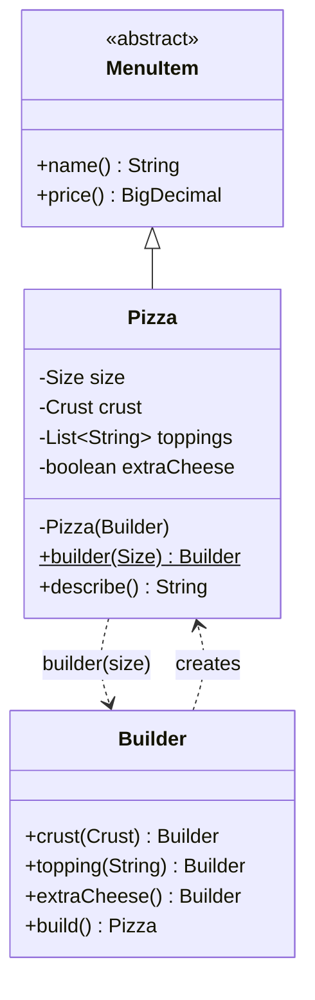
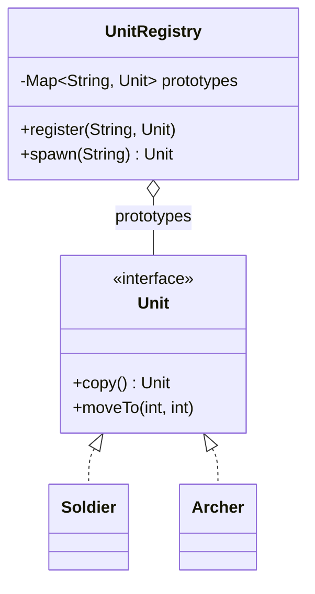
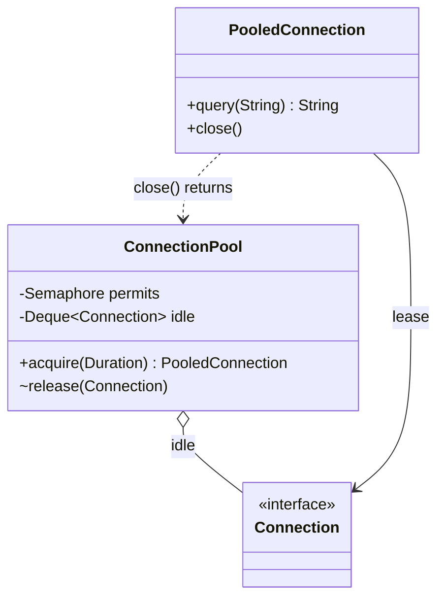
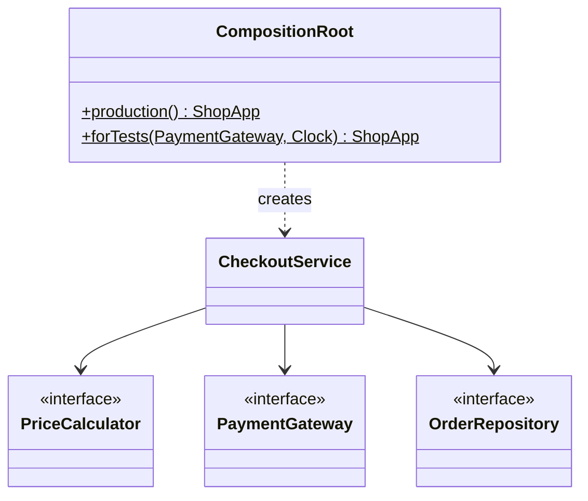

# Modül 03 — Yaratımsal Kalıplar II: İnşa

> **4. Hafta** · Ön koşullar: m02 (fabrikalar), m01 (DIP, bileşim kökü) · Tahmini çalışma süresi: 5 saat
>
> Her örneği derlemeden çalıştırın: `java modules/m03-creational-construction/src/main/java/io/github/aliturgutbozkurt/patterns/m03/examples/<yol>/<Demo>.java` (JDK 27)

## Öğrenme çıktıları

Bu modülün sonunda şunları yapabilirsiniz:

1. `build()` içinde doğrulama yapan klasik bir Builder (İnşacı), iç içe builder'ı olan bir record ve `with`
   kopyaları **yazmak**.
2. Tipleri, eksik bir nesnenin oluşturulmasını imkânsız kılan bir step builder **tasarlamak**.
3. Yüzeysel ve derin kopyayı **açıklamak**, Prototype (Prototip) kalıbını kopya kurucular ve bir kayıtla
   **uygulamak**.
4. Sınırlı bir Object Pool (Nesne Havuzu) **yazmak** ve havuzlamanın ne zaman yardımcı olduğuna — ve sanal iş
   parçacıklarının neden asla havuzlanmadığına — **karar vermek**.
5. Bir uygulamayı bileşim kökünde **bağlamak** ve testlerde iş birlikçileri sahte nesnelerle değiştirmek.

## Motivasyon

m02, *hangi* sınıfın oluşturulacağına karar verdi. Bu modül ise bir nesnenin *nasıl* bir araya getirileceğiyle
ilgilidir: çok sayıda isteğe bağlı parçası olduğunda (Builder), hazır bir nesnenin kopyalanması gerektiğinde
(Prototype), oluşturmak o kadar pahalı olduğunda ki yeniden kullanılmalıdır (Object Pool) ve bütün bir nesne grafiğinin
kurulması gerektiğinde (bağımlılık enjeksiyonu).

## Builder

### Problem

Bir pizzanın boyutu, hamuru, en fazla beş malzemesi ve isteğe bağlı ekstra peyniri vardır. Her kombinasyon için bir
kurucu — `Pizza(Size)`, `Pizza(Size, Crust)`, `Pizza(Size, Crust, List<String>, boolean)` — *teleskopik kurucu*dur:
okuması zordur (`new Pizza(LARGE, null, List.of(), true)`?) ve birden çok parçayı ilgilendiren kuralları denetleyemez.

### Amaç

> Karmaşık bir nesnenin inşasını temsilinden ayırmak; böylece nesne **adım adım** kurulabilir ve **bir bütün
> olarak** doğrulanabilir.

### Yapı



### Klasik Java

Zorunlu parça `builder(size)`'a girer; isteğe bağlı parçalar cümle gibi okunur:

```java
// file: examples/builder/PizzaDemo.java
        Pizza deluxe = Pizza.builder(Size.LARGE)
                .topping("mushroom")
                .topping("olives")
                .crust(Crust.STUFFED)
                .extraCheese()
                .build();
```

`build()`, değişmez bir `Pizza` var olmadan önce birden çok parçayı ilgilendiren kuralları denetler:

```java
// file: examples/builder/classic/Pizza.java
        /** Validates the combination and creates the pizza. */
        public Pizza build() {
            if (toppings.size() > MAX_TOPPINGS) {
                throw new IllegalStateException("at most " + MAX_TOPPINGS + " toppings, got " + toppings.size());
            }
```

`Pizza`, `MenuItem(name, price)`'ı genişletir ve fiyatı builder'daki seçimlere bağlıdır. Java 25'ten önce bu hesap
statik bir yardımcı metotta saklanmak zorundaydı, çünkü `super(...)`'dan önce hiçbir şey çalışamazdı. **Esnek kurucu
gövdeleri** (JEP 513) ile yerinde yazılabilir — ve derleyici bu erken aşamanın kuralını uygular: alanlara
`super(...)`'dan önce **değer atanabilir** ama alanlar **okunamaz**:

```java
// file: examples/builder/classic/Pizza.java
    private Pizza(Builder builder) {
        // Flexible constructor body (JEP 513): before super(...) we may compute with locals and *assign* our fields,
        // but not *read* them — so the price is computed from the builder's values.
        List<String> chosenToppings = List.copyOf(builder.toppings);
        BigDecimal price = builder.size.basePrice
                .add(TOPPING_PRICE.multiply(BigDecimal.valueOf(chosenToppings.size())))
                .add(builder.extraCheese ? EXTRA_CHEESE_PRICE : BigDecimal.ZERO)
                .add(builder.crust == Crust.STUFFED ? STUFFED_CRUST_PRICE : BigDecimal.ZERO);
        size = builder.size;
        crust = builder.crust;
        toppings = chosenToppings;
        extraCheese = builder.extraCheese;
        super(builder.size.name().toLowerCase(Locale.ROOT) + " pizza", price);
    }
```

İkinci klasik builder, JDK'nın kendi `java.net.http.HttpRequest.newBuilder()`'ına benzer. Her parça eklendiği anda
denetlenir (bir başlık adı, bir zaman aşımı); parçaları birleştiren kurallar `build()` içinde denetlenir:

```java
// file: examples/builder/classic/HttpRequest.java
        /** Checks the rules that involve several parts, then creates the request. */
        public HttpRequest build() {
            boolean hasBody = body != null;
            switch (method) {
                case GET, DELETE -> {
                    if (hasBody) {
                        throw new IllegalStateException(method + " request must not have a body");
                    }
                }
                case POST, PUT -> {
                    if (!hasBody) {
                        throw new IllegalStateException(method + " request needs a body");
                    }
                }
            }
            return new HttpRequest(this);
        }
```

### Modern Java 27

**Builder'lı record'lar.** Bir record zaten değişmezlik, eşitlik ve tek bir kanonik kurucu sağlar. Tüm doğrulamayı
kompakt kurucusuna — her yolun geçtiği *tek* yere — koyun ve builder yalnızca varsayılanları tutsun. `withX`
metotları değiştirilmiş kopyalar oluşturur:

```java
// file: examples/builder/record/ServerConfig.java
public record ServerConfig(String host, int port, Duration timeout, boolean tls, int maxConnections) {
    // ...
    public ServerConfig withPort(int newPort) {
        return new ServerConfig(host, newPort, timeout, tls, maxConnections);
    }
    // ...
        private final String host;
        private int port = 8080;
        private Duration timeout = Duration.ofSeconds(30);
        private boolean tls;
        private int maxConnections = 100;
```

```text
defaults: ServerConfig[host=localhost, port=8080, timeout=PT30S, tls=false, maxConnections=100]
production: ServerConfig[host=api.example.com, port=443, timeout=PT10S, tls=true, maxConnections=500]
staging copy: ServerConfig[host=api.example.com, port=8443, timeout=PT10S, tls=true, maxConnections=500]
```

**Step builder'lar.** Normal bir builder `build()`'i çok erken çağırmanıza izin verir ve çalışma zamanında hata
verir. Bir *step builder* her çağrıdan sonra farklı bir arayüz döndürür; böylece yalnızca geçerli sonraki çağrılar
var olur:

```java
// file: examples/builder/step/Query.java
    /** Step 1: choose columns. */
    public interface SelectStep {
        FromStep select(String... columns);

        FromStep selectAll();
    }

    /** Step 2: choose the table. */
    public interface FromStep {
        QueryStep from(String table);
    }
```

```java
// file: examples/builder/QueryDemo.java
        // Query.builder().select("name").build();   // does not compile: FromStep has no build()
```

```text
SELECT name, email FROM users WHERE active = true ORDER BY name LIMIT 20
SELECT * FROM orders WHERE total > 100 AND status = 'PAID' ORDER BY total DESC
```

### Gerçek dünyada kullanımı

`java.net.http.HttpRequest.newBuilder()`, `HttpClient.newBuilder()`, `StringBuilder`, `Stream.builder()`,
`Locale.Builder`, `ProcessBuilder` ve `Thread.ofVirtual().name(...).start(...)` birer builder'dır.

### Tuzaklar ve ne zaman KULLANILMAMALI

- İki üç bileşenli bir record'un builder'a ihtiyacı yoktur — kanonik kurucu yeterince okunaklıdır.
- **Tek** yerde doğrulayın. Record'larda bu yer kompakt kurucudur; builder yalnızca varsayılanları doldurur.
- Builder değiştirilebilirdir ve iş parçacığı güvenli değildir; kurduğu nesne değişmez olmalıdır.
- Sorgu örneği metin birleştirir: öğretmek için uygundur, SQL enjeksiyonuna karşı güvenli **değildir** — gerçek kod
  parametre bağlar.

### İlgili kalıplar

**Abstract Factory** (m02) bitmiş bir ürünü tek çağrıda döndürür; builder bir ürünü adım adım kurar. **Composite
(Bileşik)** (m05) yapıları çoğu zaman builder'larla kurulur.

## Prototype

### Problem

Bölümleri ve üst verisi olan bir belge şablonunu yapılandırmak emek istedi; kullanıcılar yeni belgelere ondan
başlamak istiyor. Her birini sıfırdan kurmak o işi tekrarlar — şablonu kopyalamak daha basittir. Ama *nasıl*
kopyaladığınız önemlidir.

### Amaç

> Yeni nesneleri **prototip bir nesneyi kopyalayarak** oluşturmak.

### Yapı



### Klasik Java

Java'nın yerleşik mekanizması `Cloneable` + `Object.clone()`'dur. Alanları tek tek kopyalar — **yüzeysel** bir kopya:
klon ve orijinal, alanlarının işaret ettiği her nesneyi paylaşır. Bir **kopya kurucu** ise neyin kopyalanacağını
açıkça söyler:

```java
// file: examples/prototype/documents/DocumentTemplate.java
    /** Copy constructor: a deep copy — new lists and maps with the same (immutable) strings. */
    public DocumentTemplate(DocumentTemplate other) {
        this(other.title, other.sections, other.metadata);
    }

    /** Shallow copy: the clone shares {@code sections} and {@code metadata} with this template. */
    @Override
    public DocumentTemplate clone() {
        try {
            return (DocumentTemplate) super.clone();
        } catch (CloneNotSupportedException e) {
            throw new AssertionError("Cloneable is implemented", e);
        }
    }
```

```text
template: Invoice [Header, Lines, Totals] {lang=en}
== clone() then edit the copy ==
copy:     Receipt [Header, Lines, Totals, Signature] {lang=tr}
template: Invoice [Header, Lines, Totals, Signature] {lang=tr}   <- changed too!
== copy constructor then edit the copy ==
copy:     Receipt [Header, Lines, Totals, Signature] {lang=tr}
template: Invoice [Header, Lines, Totals] {lang=en}
```

`clone()` neden bozuk kabul edilir: nesneleri **kurucu çağırmadan** oluşturur, bu yüzden değişmezler denetlenmez;
`final` alanlara yeniden değer atayamaz, dolayısıyla derin kopyalar final olmayan alanlar gerektirir; `Cloneable`'ın
hiç metodu yoktur ve `Object.clone()` `protected`'dır, denetlenen bir istisna fırlatır. Son JDK'lar da `final`
alanları reflection ile değiştirmenin arka kapısını kapatmaktadır (JEP 500). Kopya kurucuları ya da bir `copy()`
metodunu tercih edin.

### Modern Java 27

**Değişmez değerlerin kopyalanmasına gerek yoktur — paylaşın.** Oyun birimi kaydında `Stats` ve `Position` birer
record'dur: bir kopya onları doğrudan yeniden kullanabilir. Yalnızca *değiştirilebilir* durum (konumu tutan alan, ok
sayısı) kopyaya özeldir:

```java
// file: examples/prototype/registry/Archer.java
    private Archer(Archer other) {
        this.stats = other.stats;
        this.position = other.position;
        this.arrows = other.arrows;
    }
```

Bir **prototip kaydı** yapılandırılmış birimleri bir ad altında saklar ve kopyalarını dağıtır — ve *girişte* de
kopyalar; böylece çağıran, saklanan prototipi sonradan değiştiremez:

```java
// file: examples/prototype/registry/UnitRegistry.java
    /** Stores a <em>copy</em>, so later changes to {@code prototype} do not leak into the registry. */
    public void register(String name, Unit prototype) {
        prototypes.put(name, prototype.copy());
    }

    public Unit spawn(String name) {
        Unit prototype = prototypes.get(name);
        if (prototype == null) {
            throw new IllegalArgumentException("unknown unit: " + name + " (known: " + names() + ")");
        }
        return prototype.copy();
    }
```

### Gerçek dünyada kullanımı

`ArrayList`'in bir kopya kurucusu vardır (`new ArrayList<>(other)`); `List.copyOf`, `Map.copyOf` ve `EnumSet.copyOf`
kopya oluşturur; `Object.clone()` dizilerde hâlâ vardır ve `array.clone()` deyimsel yüzeysel kopyadır.

### Tuzaklar ve ne zaman KULLANILMAMALI

- Yüzeysel mi derin mi: alan alan karar verin — değişmez nesneler paylaşılabilir, değiştirilebilir olanlar
  kopyalanmalıdır.
- Döngü içeren nesne grafiklerinin derin kopyası dikkat ister (zaten kopyalanmış nesnelerin bir haritası).
- Değişmez record'larda "kopyalamak" genellikle nesneyi yeniden kullanmak ya da bir `withX` metodu çağırmaktır.

### İlgili kalıplar

Bir **Composite** (m05) çocuklarını özyinelemeli olarak kopyalamalıdır — 2. ödevdeki gibi. **Memento (Hatıra)**
(m07) durumun kopyalarını saklar.

## Object Pool

### Problem

Bir veritabanı bağlantısı açmak TCP el sıkışması, TLS ve kimlik doğrulama gerektirir — her seferinde milisaniyeler —
ve veritabanı yalnızca sınırlı sayıda bağlantı kabul eder. İstek başına bir tane oluşturmak yavaştır ve sunucuyu aşırı
yükleyebilir.

### Amaç

> **Başlatılmış, yeniden kullanılabilir nesnelerden** bir küme tutmak ve onları oluşturup yok etmek yerine ödünç
> vermek.

### Yapı



### Klasik Java

Bir `Semaphore` ödünç sayısını sınırlar; boştaki bağlantılar bir kuyrukta (deque) bekler; yenileri sınıra kadar
tembel olarak oluşturulur; bir zaman aşımı sonsuza dek beklemeyi önler:

```java
// file: examples/pool/ConnectionPool.java
    public PooledConnection acquire(Duration timeout) throws InterruptedException {
        if (!permits.tryAcquire(timeout.toNanos(), TimeUnit.NANOSECONDS)) {
            throw new IllegalStateException("no connection available within " + timeout);
        }
        Connection connection;
        synchronized (this) {
            connection = idle.pollFirst();
            if (connection == null) {
                try {
                    connection = factory.apply(created + 1);
                } catch (RuntimeException e) {
                    permits.release();                          // a failed creation must not shrink the pool
                    throw e;
                }
                created++;
            }
            inUse++;
            maxInUse = Math.max(maxInUse, inUse);
        }
        return new PooledConnection(this, connection);
    }
```

Ödünç nesnesi `AutoCloseable`'dır; bu yüzden try-with-resources bağlantıyı her zaman geri verir — sorgu hata
fırlatsa bile:

```java
// file: examples/pool/ConnectionPoolDemo.java
            try (PooledConnection connection = sequential.acquire(Duration.ofSeconds(1))) {
                System.out.println(connection.query("SELECT " + i));
            }
```

```text
conn-1: SELECT 1
conn-1: SELECT 2
conn-1: SELECT 3
sequential use created 1 connection(s)
200 virtual threads, pool of 2: max in use <= 2? true, created <= 2? true
exhausted: no connection available within PT0.05S
```

### Modern Java 27

Yıllarca en ünlü havuz **iş parçacığı havuzu** oldu. Sanal iş parçacıkları (JEP 444) bunu değiştirir: oluşturmaları
ucuzdur, bu yüzden her görev kendi iş parçacığını alır ve **sanal iş parçacıkları asla havuzlanmaz**. Kıt olarak kalan,
görevlerin kullandığı kaynaktır — o hâlde *onu* bir `Semaphore` ile sınırlayın ve hiçbir şeyi havuzlamayın:

```java
// file: examples/pool/throttle/ThrottledClient.java
    public String call(String request) throws InterruptedException {
        permits.acquire();
        try {
            peak.accumulateAndGet(current.incrementAndGet(), Math::max);
            return service.apply(request);
        } finally {
            current.decrementAndGet();
            permits.release();
        }
    }
```

```text
1000 calls on 1000 virtual threads completed: true
peak concurrent calls <= 5? true
```

Bağlantı havuzları hâlâ değerlidir (pahalı olan iş parçacığı değil, bağlantıdır); ucuz nesnelerin havuzları ise
değildir — modern çöp toplayıcılar kısa ömürlü nesneleri neredeyse bedavaya ayırır.

### Gerçek dünyada kullanımı

`javax.sql.DataSource` arkasındaki JDBC bağlantı havuzları (HikariCP ve diğerleri); platform iş parçacıkları için
`ThreadPoolExecutor`; `Executors.newVirtualThreadPerTaskExecutor()` ise bilerek havuz **kullanmaz**.

### Tuzaklar ve ne zaman KULLANILMAMALI

- Geri verilen bir nesne bir sonraki ödünce **eski durum** taşıyabilir (açık bir işlem, değişmiş bir ayar) — geri
  alırken sıfırlayın.
- Sızıntılar: hiç geri verilmeyen bir ödünç havuzu kalıcı olarak küçültür; try-with-resources bunu önler.
- Ucuz nesneleri havuzlamak kodu hem yavaşlatır hem karmaşıklaştırır.

### İlgili kalıplar

**Flyweight (Sinek Siklet)** (m05) de nesneleri paylaşır, ama değişmez olanları ve kimse onları "geri vermez".
**Proxy (Vekil)** (m04), `close()`'un nesneyi geri vermesi için havuzdaki bir nesneyi sarmalayabilir.

## Bir yaratım biçimi olarak bağımlılık enjeksiyonu

### Problem

Her sınıf iş birlikçilerini kendisi oluşturursa, kimse onları değiştiremez — ne testlerde ne üretimde. Onları
Singleton'lardan alırsa, bağımlılıklar gizli kalır (m02). Yine de birinin `new` demesi gerekir.

### Amaç

> Bütün nesne grafiğini **tek bir yerde** — bileşim kökünde — oluşturup bağlamak ve her iş birlikçiyi kurucular
> üzerinden vermek.

### Yapı



### Klasik Java

İş sınıfı hiçbir şey oluşturmaz, saati bile:

```java
// file: examples/di/CheckoutService.java
    /** Prices, charges and stores the order; an unknown item fails before anything is charged. */
    public OrderRecord checkout(String customer, String item, int quantity) {
        BigDecimal total = prices.priceOf(item, quantity);
        String receipt = payments.charge(customer, total);
        var order = new OrderRecord(customer, item, quantity, total, receipt, clock.instant());
        orders.save(order);
        return order;
    }
```

### Modern Java 27

Bileşim kökü düz koddur — çatı yok. Her iş birlikçi bir kez oluşturulur ve paylaşılır: statik bir alanla değil,
bağlantıyla "singleton". Testler aynı bağlantıyı sahte bir ödeme geçidi ve sabit bir saatle çağırır:

```java
// file: examples/di/CompositionRoot.java
    private static ShopApp wire(PaymentGateway gateway, Clock clock) {
        var orders = new InMemoryOrderRepository();
        var checkout = new CheckoutService(new CatalogPriceCalculator(CATALOG), gateway, orders, clock);
        return new ShopApp(checkout, orders);
    }
```

```text
ada bought 2 x keyboard for 99.80 (receipt PAY-1)
alan bought 1 x monitor for 229.00 (receipt PAY-2)
orders stored: 2
```

### Gerçek dünyada kullanımı

Her DI çatısı (Spring, Guice, Dagger, CDI) bir bileşim kökünü otomatikleştirir; küçük uygulamaların `main`
metotları elle yazılmış bileşim kökleridir. m11 modülü bunun üzerine kurulur.

### Tuzaklar ve ne zaman KULLANILMAMALI

- Yüzlerce satıra büyüyen bir bileşim kökü, onu özelliklere göre bölmenin — ya da bir çatıya geçmenin — işaretidir.
- Kökü (ya da bir "service locator"ı) iş sınıflarına vermeyin; her sınıfa yalnızca ihtiyaç duyduğunu verin.

### İlgili kalıplar

Çoğu **Singleton**'ın (m02) yerini alır ve önceden oluşturamadığı iş birlikçiler için **fabrikalar** kullanır.

## Bir inşa tekniği seçmek

| Durum | Kullanın |
|---|---|
| Az sayıda parça, hepsi zorunlu | Kurucu ya da record |
| Çok sayıda isteğe bağlı parça, parçalar arası kurallar | Builder (mümkünse record + builder) |
| Adımların sırası önemli, birini unutmak derlenmemeli | Step builder |
| Yeni nesneler yapılandırılmış bir nesnenin varyasyonları | Prototype (kopya kurucu / `copy()`), kayıt |
| Nesneler pahalı ve sınırlı (bağlantılar) | Object Pool |
| Engelleyen görevler için iş parçacıkları | Görev başına sanal iş parçacığı + `Semaphore`, asla havuz |
| Bütün bir uygulamayı bağlamak | Bileşim kökü |

## Özet

| Kalıp | Ne zaman kullanılır | Ne zaman kaçınılır | Java 27 kısayolu |
|---|---|---|---|
| Builder | Çok isteğe bağlı parça; parçalar arası doğrulama | İki üç zorunlu parça | Record + iç içe builder, `withX` kopyaları |
| Step builder | Zorunlu adım sırası | Parçaların hepsi isteğe bağlıysa | Adım başına bir arayüz |
| Prototype | Kopyalamak yapılandırmaktan kolaysa | Nesne değişmezse — paylaşın | Kopya kurucu, `copy()` |
| Object Pool | Oluşturmak pahalı ve kapasite sınırlıysa | Nesneler ucuzsa; iş parçacıkları (sanal kullanın) | `Semaphore` + `AutoCloseable` ödünç |
| Bileşim kökü | Bir uygulamanın nesne grafiğini kurmak | — | Düz kurucular, `Clock` enjekte edilir |

## Sınav

1. Teleskopik kurucu nedir ve builder hangi iki sorunu çözer?
2. `ServerConfig`'te portu neden builder değil de kompakt kurucu doğrular?
3. Bir step builder, normal bir builder'ın garanti edemediği neyi garanti eder?
4. JEP 513'ün erken inşa aşamasında bir kurucu kendi alanlarıyla ne yapabilir, ne yapamaz?
5. `clone()` orijinal şablonun bölümlerini neden değiştirdi de başlığını değiştirmedi?
6. `Cloneable`/`clone()`'un bozuk kabul edilmesinin üç nedenini söyleyin.
7. Bir prototip kopyası `Stats` record'unu neden paylaşabilir de konumunu tutan alanı paylaşamaz?
8. Sanal iş parçacıkları neden havuzlanmamalıdır ve onun yerine neyi sınırlamalısınız?
9. Bir bileşim kökü bir Singleton'dan nasıl farklıdır?

<details><summary>Cevaplar</summary>

1. Gittikçe daha fazla parametre alan bir kurucu zinciridir. Builder çağrıları okunur kılar (adlandırılmış adımlar,
   varsayılanlar) ve parçaların birleşimini `build()` içinde doğrulayabilir.
2. Çünkü her yol — builder, `withPort`, doğrudan kurucu çağrısı — kanonik kurucudan geçer; orada doğrulamak kuralı
   tam olarak tek bir yerde tutar.
3. `build()`'in (ve her adımın) yalnızca doğru sırada çağrılabileceğini — hatalar çalışma zamanı istisnası değil,
   derleme hatasıdır.
4. Alanlarına değer atayabilir ama `super(...)`'dan önce onları okuyamaz (ya da `this`'i başka şekilde kullanamaz).
5. Klon kendi `title` alanını aldı (dizgeler değişmezdir, ona yeniden değer atamak yalnızca klonu etkiler), ama iki
   nesnenin `sections` alanı aynı `ArrayList`'e işaret eder.
6. Kurucuları (ve doğrulamalarını) atlar; `final` alanlara yeniden değer atayamaz; `Cloneable`'ın metodu yoktur ve
   `Object.clone()` `protected`'dır, `Object` döndürür ve denetlenen bir istisna fırlatır.
7. `Stats` değişmezdir, paylaşılması görünmez; konum birime göre değişir, bu yüzden her kopyanın kendi alanı olmalıdır.
8. Oluşturmaları ucuzdur, görev başına bir tane amaçlanan modeldir; kıt kaynağı (bağlantılar, uzak bir servis) bir
   `Semaphore` ile sınırlayın.
9. Bileşim kökü bir nesne oluşturur ve onu ihtiyaç duyanlara *verir*; Singleton ise global bir erişim noktasından
   alınır ve bu, bağımlılığı gizler.

</details>

## Ödevler

- [01 — Seyahat rezervasyonu builder'ı](../assignments/01-booking-builder.tr.md) ★★☆
- [02 — Prototiplerle şekil editörü](../assignments/02-shape-prototypes.tr.md) ★★☆

## İleri okuma

- Gamma, Helm, Johnson, Vlissides, *Design Patterns* (1994) — Builder, Prototype.
- Joshua Bloch, *Effective Java*, 3. baskı (2018), madde 2 (builder'lar) ve madde 13 (`clone`'u dikkatle ezin).
- JEP 513 — [Flexible Constructor Bodies](https://openjdk.org/jeps/513) · JEP 444 — [Virtual Threads](https://openjdk.org/jeps/444) · JEP 500 — [Prepare to Make Final Mean Final](https://openjdk.org/jeps/500)
- Mark Seemann, "Composition Root" — bu modülde kullanılan terim.
- Terimlerin Türkçesi: [docs/glossary.md](../../../docs/glossary.md)
