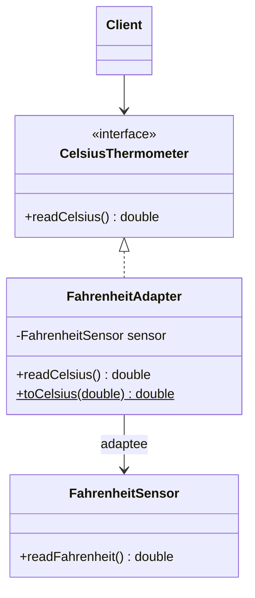
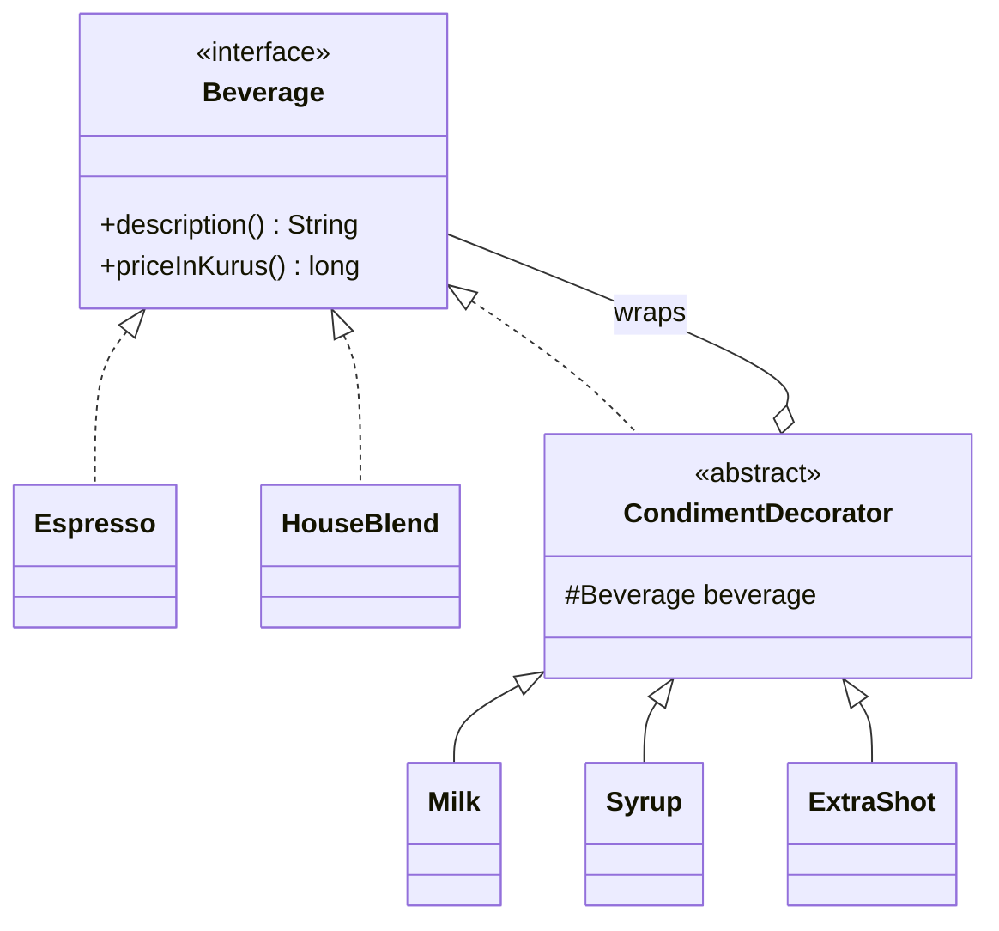
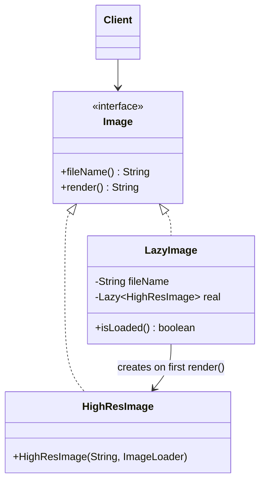
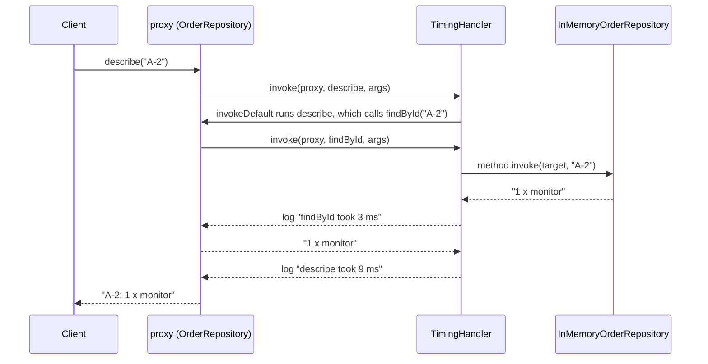
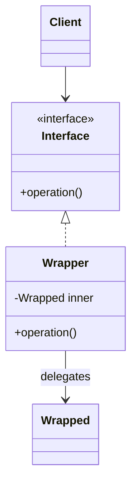

# Module 04 — Structural Patterns I: Wrappers

> **Week 5** · Prerequisites: m01 (composition over inheritance, DIP), m03 (injected `Clock`, composition root), m00 (records, sealed types, lambdas) · Estimated study time: 5 h
>
> Run every example without a build: `java modules/m04-structural-wrappers/src/main/java/io/github/aliturgutbozkurt/patterns/m04/examples/<path>/<Demo>.java` (JDK 27)

## Learning outcomes

By the end of this module you can:

1. **Implement** an object adapter and a class adapter for a legacy API, **explain** why the object adapter is
   usually preferred, and **write** an adapter as a lambda when the target is a functional interface.
2. **Implement** Decorator in its classic form (abstract decorator base) and its modern form (records, `Function`
   composition), and **predict** how the order of stacked decorators changes the result.
3. **Read and build** `java.io` decorator chains and **write** a custom `FilterInputStream`.
4. **Implement** virtual, protection and caching proxies, and a dynamic proxy with `java.lang.reflect.Proxy` that
   handles default methods and exceptions correctly.
5. **Distinguish** Adapter, Decorator and Proxy by intent, and **decide** when a wrapper is the wrong tool.

## Motivation

m02 and m03 were about *creating* objects. Structural patterns are about *combining* them. This module covers the
three that look identical in a class diagram — one object wraps another and forwards calls to it — but exist for
different reasons:

- **Adapter** *changes* an interface, so code written against one interface can use an object that has another.
- **Decorator** *adds* behaviour and keeps the interface, so features can be stacked like layers.
- **Proxy** *controls access* to an object and keeps the interface: it creates it late, checks permissions, caches
  answers — or does all of that generically at run time.

Learn to ask "*why* is this object wrapped?" and you will recognise all three in the JDK, in frameworks and in your
own code.

## Adapter

### Problem

Our smart-home code reads temperatures through a `CelsiusThermometer`. The sensor driver we bought only has
`double readFahrenheit()`, and we cannot change it. In the online shop, a legacy payment SDK takes the amount as a
decimal *string* and answers with numeric status codes (`0`, `51`, `54`, …), while our checkout works with amounts in
minor units (kuruş, cents) and a `PaymentResult` type. Rewriting either side is not an option.

### Intent

> Convert the interface of a class into another interface clients expect, so classes with incompatible interfaces
> can work together.

### Structure



The **target** is the interface the client wants, the **adaptee** is the class that does the work, the **adapter**
implements the target and translates each call into the adaptee's language.

### Classic Java

An **object adapter** holds the adaptee and delegates to it:

```java
// file: adapter/thermometer/FahrenheitAdapter.java
public final class FahrenheitAdapter implements CelsiusThermometer {

    private final FahrenheitSensor sensor;                   // the adaptee, held by composition

    public FahrenheitAdapter(FahrenheitSensor sensor) {
        this.sensor = Objects.requireNonNull(sensor, "sensor");
    }

    @Override
    public double readCelsius() {
        return toCelsius(sensor.readFahrenheit());           // translate the call and the unit
    }
```

A **class adapter** *inherits* from the adaptee instead and implements the target. Java has single inheritance, so
this works only when the adaptee is a class you may extend and the target is an interface:

```java
// file: adapter/payment/LegacyPaymentClassAdapter.java
public class LegacyPaymentClassAdapter extends LegacyPayGateway implements PaymentProcessor {

    @Override
    public PaymentResult pay(PaymentRequest request) {
        String amount = LegacyPaymentMapping.toLegacyAmount(request.amountMinor());
        int status = makePayment(request.cardNumber(), amount, request.currency());   // inherited, not delegated
        return LegacyPaymentMapping.toResult(status, lastTransactionId());
    }
}
```

The price: a class adapter *is a* `LegacyPayGateway`, so every legacy method leaks to its clients. A test in
`PaymentAdapterTest` casts it and calls `makePayment(…, "-5.00", …)` directly — bypassing the validation the adapter
was written to add. Prefer the object adapter: it can adapt any subclass of the adaptee, it can be swapped in tests,
and it exposes only the target interface.

### Modern Java 27

**A lambda is an adapter** when the target is a functional interface — no class needed:

```java
// file: adapter/thermometer/ThermometerAdapterDemo.java
        FahrenheitSensor sensor = new FahrenheitSensor(212.0, 32.0, -40.0);
        CelsiusThermometer lambda = () -> FahrenheitAdapter.toCelsius(sensor.readFahrenheit());
```

```text
adapter class:  100.0 °C, 0.0 °C, -40.0 °C
lambda adapter: 100.0 °C, 0.0 °C, -40.0 °C
```

**A record is an object adapter** with a free constructor, `equals` and `toString`:

```java
// file: adapter/payment/LegacyPaymentAdapter.java
public record LegacyPaymentAdapter(LegacyPayGateway gateway) implements PaymentProcessor {

    public LegacyPaymentAdapter {
        Objects.requireNonNull(gateway, "gateway");
    }

    @Override
    public PaymentResult pay(PaymentRequest request) {
        String amount = LegacyPaymentMapping.toLegacyAmount(request.amountMinor());   // validates first
        int status = gateway.makePayment(request.cardNumber(), amount, request.currency());
        return LegacyPaymentMapping.toResult(status, gateway.lastTransactionId());
    }
}
```

The real work of an adapter is often the *translation of values*. Legacy status codes become a **sealed** result, so
that from here on the compiler checks that every outcome is handled:

```java
// file: adapter/payment/LegacyPaymentMapping.java
    static PaymentResult toResult(int status, String transactionId) {
        return switch (status) {
            case LegacyPayGateway.OK -> new Approved(transactionId);
            case LegacyPayGateway.INSUFFICIENT_FUNDS ->
                    new Declined(DeclineReason.INSUFFICIENT_FUNDS, "insufficient funds");
            case LegacyPayGateway.CARD_EXPIRED -> new Declined(DeclineReason.CARD_EXPIRED, "card expired");
            default -> new Declined(DeclineReason.UNKNOWN, "legacy status " + status);
        };
    }
```

An `int` has no end, so that `switch` needs a `default`. The client's `switch` over the sealed `PaymentResult` does
not — record patterns take it apart and the switch is exhaustive:

```java
// file: adapter/payment/PaymentAdapterDemo.java
            String outcome = switch (processor.pay(order)) {                 // exhaustive: no default needed
                case Approved(String transactionId) -> "approved, transaction " + transactionId;
                case Declined(DeclineReason reason, String message) -> "declined (" + reason + "): " + message;
            };
```

```text
object adapter (record LegacyPaymentAdapter)
  12.50 TRY on card ending 1111: approved, transaction TX-1001
  7.00 TRY on card ending 0051: declined (INSUFFICIENT_FUNDS): insufficient funds
  99.90 EUR on card ending 0054: declined (CARD_EXPIRED): card expired
  1.00 USD on card ending 0096: declined (UNKNOWN): legacy status 96
class adapter (LegacyPaymentClassAdapter extends LegacyPayGateway)
  12.50 TRY on card ending 1111: approved, transaction TX-1001
  7.00 TRY on card ending 0051: declined (INSUFFICIENT_FUNDS): insufficient funds
  99.90 EUR on card ending 0054: declined (CARD_EXPIRED): card expired
  1.00 USD on card ending 0096: declined (UNKNOWN): legacy status 96
rejected before the gateway: amount must be positive: 0
```

### Real-world usage

The JDK is full of adapters (`adapter/jdk/JdkAdaptersDemo.java`): `InputStreamReader` adapts a byte stream to a
character stream, `Arrays.asList` adapts an array to the `List` interface (a fixed-size *view*, not a copy),
`Enumeration.asIterator()` and `Collections.enumeration(…)` bridge the legacy and the modern iteration interfaces.

```text
InputStreamReader: 14 bytes -> 7 chars: çğıİöşü
Arrays.asList: set(1) wrote through -> array is [1A, taken, 1C]
Arrays.asList: add -> UnsupportedOperationException (fixed-size view)
Enumeration.asIterator: alpha, beta, gamma
```

Beyond the JDK: SLF4J bridges adapt one logging API to another, Spring's `HandlerAdapter` lets one dispatcher call
very different controller types, and "Ports and Adapters" (m11) scales the idea up to whole architectures.

### Pitfalls and when NOT to use it

- An adapter that grows business rules is no longer an adapter — keep it a thin translation layer.
- Translations lose information: an unknown legacy code must not silently become "approved". Map it to an explicit
  `UNKNOWN` case and test it.
- If you own both sides, change one of them instead of adapting.
- A record adapter's accessor (`gateway()`) exposes the adaptee; that is fine for tests, but clients should depend on
  the target interface only.

### Related patterns

**Decorator** keeps the interface, Adapter changes it. **Facade** (m05) also wraps, but it *simplifies* a whole
subsystem behind a new interface. **Bridge** (m05) separates abstraction and implementation *by design*; Adapter
repairs a mismatch *after the fact*.

## Decorator

### Problem

A coffee shop sells espresso and house blend, with milk, syrup and extra shots in any combination and quantity.
One subclass per combination (`EspressoWithMilkAndTwoShots`) explodes. The same happens with cross-cutting concerns:
a stock service needs logging in one place, retries in another, both in a third — without changing the service.

### Intent

> Attach additional responsibilities to an object dynamically. Decorators provide a flexible alternative to
> subclassing for extending functionality.

### Structure



A decorator **is a** `Beverage` (so it can be used, and wrapped, wherever a beverage is expected) and **has a**
`Beverage` (the one it decorates).

### Classic Java

The abstract decorator holds the wrapped component:

```java
// file: coffee/classic/CondimentDecorator.java
public abstract class CondimentDecorator implements Beverage {

    protected final Beverage beverage;                       // the wrapped component

    protected CondimentDecorator(Beverage beverage) {
        this.beverage = Objects.requireNonNull(beverage, "beverage");
    }
}
```

Each concrete decorator delegates and then adds its part:

```java
// file: coffee/classic/Milk.java
    @Override
    public String description() {
        return beverage.description() + ", Milk";            // delegate, then add
    }

    @Override
    public long priceInKurus() {
        return beverage.priceInKurus() + 500;
    }
```

```java
// file: coffee/classic/CoffeeDemo.java
        print(new Espresso());
        print(new Syrup(new Milk(new Espresso())));                     // innermost first: Espresso, Milk, Syrup
        print(new Milk(new ExtraShot(new ExtraShot(new HouseBlend()))));
```

```text
Espresso: 45.00 TL
Espresso, Milk, Syrup: 57.50 TL
House Blend, Extra Shot, Extra Shot, Milk: 75.00 TL
```

### Modern Java 27

**Records as decorators.** The wrapped component becomes a record component, there is no abstract base, and the
compact constructor rejects `null`:

```java
// file: coffee/modern/Milk.java
public record Milk(Beverage inner) implements Beverage {

    public Milk {
        Objects.requireNonNull(inner, "inner");
    }

    @Override
    public String description() {
        return inner.description() + ", Milk";
    }
```

Records also bring value equality and a `toString` that shows the wrapping structure:

```text
Espresso: 45.00 TL
Espresso, Milk, Syrup: 57.50 TL
House Blend, Extra Shot, Extra Shot, Milk: 75.00 TL
same order twice is equal: true
Syrup[inner=Milk[inner=ESPRESSO]]
```

**Functional decoration.** When the "component" is a single function, decorators need no classes at all:
`Function.andThen` and `compose` stack behaviour. The comment-moderation pipeline is built once from small
`UnaryOperator<String>` filters and reused for every comment:

```java
// file: decorator/functional/CommentPipeline.java
    /** A new pipeline that runs this one and then {@code filter}; this pipeline is unchanged. */
    public CommentPipeline then(UnaryOperator<String> filter) {
        return new CommentPipeline(steps.andThen(Objects.requireNonNull(filter, "filter")));
    }
```

```java
// file: decorator/functional/FunctionalDecoratorDemo.java
        Function<String, String> censorThenTruncate = censor(banned).andThen(truncate(10));
        Function<String, String> truncateThenCensor = truncate(10).andThen(censor(banned));
```

```text
before: [   This   darn  product is GREAT,   darn it!   ]
after:  [This **** product is GREAT, **]
censor, then truncate(10): [this is **]
truncate(10), then censor: [this is da]
```

Truncating first cut the banned word in half, so the censor no longer recognised it.

### Stacking order matters

Cross-cutting decorators for a warehouse `StockService`: one logs each call, one retries failures immediately (no
back-off — that is out of scope). When all attempts fail, the last exception is rethrown with the earlier ones
attached as *suppressed*, so nothing is lost:

```java
// file: decorator/resilience/RetryingStockService.java
    @Override
    public int available(String sku) {
        List<RuntimeException> failures = new ArrayList<>();
        for (int attempt = 1; attempt <= maxAttempts; attempt++) {
            try {
                return target.available(sku);
            } catch (RuntimeException e) {
                failures.add(e);                                 // no sleeping: back-off is out of scope
            }
        }
        RuntimeException last = failures.removeLast();
        failures.forEach(last::addSuppressed);                  // keep the history, throw the latest
        throw last;
    }
```

The composition root stacks the same three pieces in two orders:

```java
// file: decorator/resilience/ResilienceDemo.java
        StockService loggingOutside =
                new LoggingStockService(new RetryingStockService(new FlakyStockService(2, stock), 3), log);
        // ...
        StockService retryingOutside =
                new RetryingStockService(new LoggingStockService(new FlakyStockService(2, stock), log), 3);
```

```text
logging(retrying(flaky)):
  log: available(A-42) = 7
retrying(logging(flaky)):
  log: available(A-42) failed: warehouse timeout #1
  log: available(A-42) failed: warehouse timeout #2
  log: available(A-42) = 7
retrying(flaky) that never recovers:
  gave up: warehouse timeout #3 (suppressed: warehouse timeout #1, warehouse timeout #2)
```

Logging *outside* retry sees one logical call; logging *inside* sees every attempt. Neither is wrong — they answer
different questions ("what did the caller experience?" vs. "how flaky is the warehouse?"). The outermost decorator
acts first on the way in and last on the way out.

### Real-world usage

**`java.io` is built from decorators.** `ByteArrayInputStream` and `FileInputStream` are real sources;
`BufferedReader`, `InputStreamReader`, `GZIPInputStream` and every `FilterInputStream` wrap another stream.
(`InputStreamReader` is strictly an *adapter*: bytes in, chars out.)

```java
// file: decorator/jdk/JdkDecoratorsDemo.java
            var counting = new CountingInputStream(new ByteArrayInputStream(gzip));
            List<String> lines;
            try (var reader = new BufferedReader(                       // chars -> lines
                    new InputStreamReader(                               // bytes -> chars
                            new GZIPInputStream(counting),               // gzip -> bytes
                            StandardCharsets.UTF_8))) {
                lines = reader.lines().toList();
            }
```

Writing your own is a matter of extending `FilterInputStream`. One trap: `FilterInputStream.read(byte[])` goes
through `read(byte[], int, int)`, but `skip` goes *straight* to the wrapped stream — a counting decorator must
override it too:

```java
// file: decorator/jdk/CountingInputStream.java
    @Override
    public long skip(long n) throws IOException {       // FilterInputStream.skip bypasses the read overrides
        long skipped = super.skip(n);
        count += skipped;
        return skipped;
    }
```

Closing the outermost reader closes every stream down to the source. `Collections.unmodifiableList` is a read-only
*view* (it shows later changes to the backing list), while `List.copyOf` is a *copy*:

```text
wrote 4 lines -> 92 gzip bytes
read back 4 lines, errors: [ERROR payment timeout]
CountingInputStream saw 92 of 92 bytes
after backing.add("c"): view [a, b, c], copy [a, b]
view.add -> UnsupportedOperationException
```

Outside the JDK: servlet filters and Spring's `HandlerInterceptor`s, `Collections.synchronizedList`, and resilience
libraries whose retry / circuit-breaker wrappers are decorators around a call.

### Pitfalls and when NOT to use it

- **Identity:** a decorated object is a *different* object. `==`, `getClass()` and classic `equals` no longer match
  the original (`new Milk(new Espresso())` is not equal to another one); records restore value equality.
- **Order:** stacking order changes behaviour — document it and build stacks in one place (the composition root).
- **Deep stacks** are hard to debug: stack traces and `toString` show layer after layer.
- **Sealed interfaces cannot be decorated by others:** if `Beverage` were `sealed … permits Espresso, HouseBlend`, no
  one outside could write a `Milk`. Sealing and decorating are opposite design choices.
- If a feature is always on, just put it in the class; decorators pay off when combinations vary.

### Related patterns

**Adapter** changes the interface, Decorator keeps it. **Proxy** has the same shape but controls access rather than
adding features. **Composite** (m05) also wraps components, but many of them in a tree. **Chain of Responsibility**
(m07) is a stack of handlers that may *stop* the call.

## Proxy

### Problem

A photo gallery shows hundreds of thumbnails; loading each full-size image up front takes seconds and memory. A
document store must refuse writes from viewers. A currency service charges per request although rates change only
every few minutes. And in a large application, *every* repository should be timed — without writing a timing class
for each one.

### Intent

> Provide a surrogate or placeholder for another object to control access to it.

Common kinds: a **virtual proxy** creates the real object lazily; a **protection proxy** checks permissions; a
**caching proxy** remembers answers; a **remote proxy** stands in for an object in another process (RMI stubs, gRPC
clients). A **dynamic proxy** is not a kind but a *mechanism*: the proxy class is generated at run time.

### Structure



### Classic Java

**Virtual proxy.** `LazyImage` answers the cheap question itself and creates the expensive `HighResImage` only when
the image is really rendered:

```java
// file: proxy/virtual/LazyImage.java
    @Override
    public String fileName() {
        return fileName;                                        // cheap question: answered without loading
    }

    @Override
    public String render() {
        return real.get().render();                             // first call loads, later calls reuse
    }
```

A naive `if (real == null) real = new HighResImage(…)` is a race: two threads can both see `null` and load twice.
`Lazy` memoizes with double-checked locking on a `volatile` field:

```java
// file: proxy/virtual/Lazy.java
    @Override
    public T get() {
        T result = value;
        if (result == null) {                                   // fast path: no lock once initialised
            synchronized (this) {
                result = value;
                if (result == null) {                           // re-check: another thread may have won
                    result = Objects.requireNonNull(factory.get(), "factory returned null");
                    value = result;
                }
            }
        }
        return result;
    }
```

```text
gallery of 3 created, loads: 0
thumbnails: [beach.jpg, bosphorus.jpg, cappadocia.jpg], loads: 0
open: bosphorus.jpg [6000x4000 pixels]
open again: bosphorus.jpg [6000x4000 pixels]
loads after viewing one image twice: 1
1000 virtual threads rendered one proxy, loads: 1
```

> **Sidebar — Lazy Constants (JEP 531, preview in JDK 27).** The JDK is getting a built-in *lazy constant*: a holder
> whose value is computed at most once, on first access, and then treated by the JVM like a `final` field. It would
> replace hand-written memoizers like `Lazy`. It is a preview API, so this course does not use it in graded code.

**Protection proxy.** The rule is an exhaustive `switch` over the role enum — adding a role will not compile until
someone decides what it may do — and a forbidden call never reaches the real store:

```java
// file: proxy/protection/ProtectedDocumentStore.java
    static boolean allowed(Role role, Operation operation) {
        return switch (role) {
            case VIEWER -> operation == Operation.READ;
            case EDITOR -> operation != Operation.DELETE;
            case ADMIN -> true;
        };
    }
    // ...
    @Override
    public void delete(String id) {
        check(Operation.DELETE, id);
        target.delete(id);
    }
```

```text
deniz (VIEWER):
  read -> draft
  denied: deniz (VIEWER) may not WRITE contract-7
  denied: deniz (VIEWER) may not DELETE draft-1
ece (EDITOR):
  read -> draft
  write -> ok
  denied: ece (EDITOR) may not DELETE draft-1
mert (ADMIN):
  read -> revised by ece
  write -> ok
  delete -> ok
```

### Modern Java 27

**Caching proxy with an injected clock.** Time comes from a `java.time.Clock` (m03), so the demo and the tests move
it by hand instead of sleeping. An entry is fresh while `now` is *before* `storedAt + ttl`:

```java
// file: proxy/caching/CachingExchangeRateService.java
    @Override
    public BigDecimal rate(String from, String to) {
        String key = from + "/" + to;
        Instant now = clock.instant();
        Entry entry = cache.get(key);
        if (entry != null && now.isBefore(entry.storedAt().plus(ttl))) {     // fresh until storedAt + ttl
            return entry.rate();
        }
        BigDecimal rate = target.rate(from, to);
        cache.put(key, new Entry(rate, now));
        return rate;
    }
```

```text
2026-09-29T09:00:00Z EUR/TRY = 48.10  (remote calls: 1)
2026-09-29T09:09:00Z EUR/TRY = 48.10  (remote calls: 1)
2026-09-29T09:09:00Z USD/TRY = 41.25  (remote calls: 2)
2026-09-29T09:10:00Z EUR/TRY = 48.10  (remote calls: 3)
2026-09-29T09:10:00Z USD/TRY = 41.25  (remote calls: 3)
```

**Dynamic proxies.** Writing `TimedOrderRepository`, `TimedPriceList`, … by hand does not scale.
`java.lang.reflect.Proxy` generates a class at run time that implements the given interfaces and sends *every* call
to one `InvocationHandler`:

```java
// file: proxy/dynamic/Proxies.java
    private static <T> T create(Class<T> iface, InvocationHandler handler) {
        if (!iface.isInterface()) {
            throw new IllegalArgumentException(iface.getName() + " is not an interface");
        }
        Object proxy = Proxy.newProxyInstance(iface.getClassLoader(), new Class<?>[] {iface}, handler);
        return iface.cast(proxy);
    }
```

The handler receives the proxy, the `Method` and the arguments. Three details make it correct:

```java
// file: proxy/dynamic/TimingHandler.java
    @Override
    public Object invoke(Object proxy, Method method, Object[] args) throws Throwable {
        if (method.getDeclaringClass() == Object.class) {
            return Proxies.objectMethod(proxy, method, args, "timed " + target);   // not timed
        }
        long start = nanoTicker.getAsLong();
        try {
            return method.isDefault()
                    ? InvocationHandler.invokeDefault(proxy, method, args)   // its inner calls come back here
                    : method.invoke(target, args);
        } catch (InvocationTargetException e) {
            throw e.getCause();                                 // the target's own exception, unchanged
        } finally {
            long millis = (nanoTicker.getAsLong() - start) / 1_000_000;
            log.accept(method.getDeclaringClass().getSimpleName() + "." + method.getName() + " took " + millis + " ms");
        }
    }
```

1. `toString`, `equals` and `hashCode` are dispatched to the handler too; answer them without timing.
2. `Method.invoke` wraps the target's exception in `InvocationTargetException`. Rethrow the **cause** — otherwise the
   caller receives an `UndeclaredThrowableException` instead of its own exception.
3. `default` methods are run with `InvocationHandler.invokeDefault`; the calls they make go through the proxy again:



The time comes from a fake ticker that advances 3 ms per reading, so the output is deterministic. The read-only
proxy (`ReadOnlyHandler`) blocks every method annotated `@Mutator`:

```text
timing proxy:
  log: OrderRepository.findById took 3 ms
  findById -> 2 x keyboard
  log: OrderRepository.findById took 3 ms
  log: OrderRepository.describe took 9 ms
  describe -> A-2: 1 x monitor
  log: OrderRepository.findById took 3 ms
  findById -> NoSuchElementException: no order Z-9
  log: PriceList.priceOf took 3 ms
  priceOf -> 49.90
read-only proxy:
  findAllIds -> [A-1, A-2]
  save -> OrderRepository.save is read-only
  ids after the blocked save: [A-1, A-2]
Proxy.isProxyClass: true
```

JDK dynamic proxies work **only for interfaces** (`Proxies` rejects a class with `IllegalArgumentException`).
Libraries such as ByteBuddy and CGLIB generate *subclasses* instead, which is how frameworks proxy classes.

### Real-world usage

`Collections.unmodifiableList` is a protection proxy. Spring AOP wraps beans in JDK dynamic proxies (or generated
subclasses) for `@Transactional`, `@Cacheable` and security; Hibernate returns lazy-loading proxies for associations;
Mockito's mocks are generated proxies; RMI and gRPC stubs are remote proxies.

### Pitfalls and when NOT to use it

- **Identity again:** `proxy.getClass()` is `jdk.proxy1.$Proxy…`, and Hibernate proxies make `getClass()`-based
  `equals` fail — compare with `instanceof` on the interface.
- **Self-invocation:** a method of the real object that calls another of its methods does not go through the proxy
  (this is why a `@Transactional` method called from the same class is not transactional). Default methods are the
  exception — `invokeDefault` routes their calls through the proxy.
- **Lazy + concurrency:** a virtual proxy must be thread-safe or it may create the object twice.
- **Stale caches:** a caching proxy needs an expiry rule, and failures must not be cached.
- **Hidden cost:** a call that looks local may be remote, slow, or throw. Make that visible in names and docs.

### Related patterns

**Decorator** has the same structure but adds behaviour chosen by the client; a proxy usually controls access and
is often created *for* the client (by a factory or framework). **Adapter** changes the interface. **Flyweight**
(m05) and **Object Pool** (m03) share objects; a proxy can hand them out.

## Adapter vs. Decorator vs. Proxy

All three have the same shape — a wrapper implements an interface and delegates to the object it holds:



| | Adapter | Decorator | Proxy |
|---|---|---|---|
| Intent | **change** the interface | **add** behaviour | **control access** |
| Interface of the wrapper vs. the wrapped object | different | same | same |
| Who chooses the wrapper? | the integrator | the client, often stacking several | usually a factory or framework |
| Typical number of layers | one | several, order matters | one |
| Example in this module | `LegacyPaymentAdapter` | `RetryingStockService` | `ProtectedDocumentStore` |
| JDK example | `InputStreamReader` | `BufferedReader` | `Collections.unmodifiableList` |

## Summary

| Pattern | Use when | Avoid when | Java 27 shortcut |
|---|---|---|---|
| Adapter | An existing class has the wrong interface | You own both sides | Lambda for a functional target; record object adapter; sealed result + exhaustive `switch` |
| Decorator | Features combine freely or cross-cut many classes | A feature is always on; the interface is sealed | Records as decorators; `Function.andThen` / `compose` |
| Virtual proxy | Creating the object is expensive and often unnecessary | It is cheap, or always needed | Thread-safe memoizer (Lazy Constants, preview) |
| Protection proxy | Access depends on who calls | Rules belong in the domain model | Exhaustive `switch` on a role enum |
| Caching proxy | Answers are expensive and change slowly | Data must always be fresh | Injected `Clock`, record entries |
| Dynamic proxy | The same behaviour for many interfaces | One or two interfaces — write the class | `Proxy.newProxyInstance`, `InvocationHandler.invokeDefault` |

## Quiz

1. A class wraps a `Reader` and exposes it as an `Iterator<String>` of lines. Adapter, Decorator or Proxy? And a
   class that wraps a `Reader` and counts the characters read?
2. Why is the object adapter usually preferred over the class adapter in Java? What did the class adapter test show?
3. When is a lambda enough to implement an adapter?
4. `logging(retrying(x))` logs one line, `retrying(logging(x))` logs three. Explain. Which order would you use to
   measure how flaky the warehouse is?
5. In `JdkDecoratorsDemo`, which classes are "real" sources and which are decorators? Why did `CountingInputStream`
   have to override `skip`?
6. Why is `new Milk(new Espresso())` not equal to another `new Milk(new Espresso())` in the classic version, and why
   are the record versions equal?
7. Why can no one outside your module decorate a `sealed` interface?
8. Name the four kinds of proxy in this module and one real-world use of each.
9. What does an `InvocationHandler` receive, why must `InvocationTargetException` be unwrapped, and why do JDK
   dynamic proxies need interfaces?

<details><summary>Answers</summary>

1. The first is an **Adapter** (the interface changes: `Reader` → `Iterator<String>`). The second is a
   **Decorator** (still a `Reader`, with added counting).
2. Java has single inheritance: a class adapter uses up the superclass, works only with one concrete adaptee class,
   and exposes all adaptee methods. The test cast the class adapter to `LegacyPayGateway` and called `makePayment`
   with a negative amount, bypassing the adapter's validation.
3. When the target is a functional interface (one abstract method) and the translation fits in an expression.
4. The outermost decorator sees the call first. Logging outside sees one logical call; logging inside retry sees
   every attempt, including the two failures. To measure flakiness, put logging inside: `retrying(logging(x))`.
5. `ByteArrayInputStream` is a real source; `CountingInputStream`, `GZIPInputStream`, `InputStreamReader` (an
   adapter) and `BufferedReader` wrap other streams. `FilterInputStream.skip` calls the wrapped stream's `skip`
   directly, bypassing the overridden `read` methods, so skipped bytes would not be counted.
6. Classic decorators inherit `Object.equals` — identity. Records generate `equals` from their components, and the
   innermost component `Coffee.ESPRESSO` is an enum constant, so two equal orders compare equal.
7. A sealed interface lists all its implementations in `permits`; a decorator is a new implementation, which the
   compiler rejects outside the permitted set.
8. Virtual (Hibernate lazy associations), protection (`Collections.unmodifiableList`, Spring Security method
   security), caching (Spring `@Cacheable`), remote (RMI or gRPC stubs). Dynamic proxies are the mechanism behind
   many of them.
9. The proxy, the `Method` being called and the arguments. `Method.invoke` wraps the target's exception in
   `InvocationTargetException`; rethrowing that (or any undeclared checked exception) makes the caller receive
   `UndeclaredThrowableException`. `java.lang.reflect.Proxy` generates a class that *implements* interfaces — it
   cannot extend an arbitrary class; ByteBuddy/CGLIB generate subclasses for that.

</details>

## Assignments

- [01 — Data-source decorators (compression + Base64)](../assignments/01-data-source-decorators.en.md) ★★☆
- [02 — Caching proxy with TTL for a slow weather service](../assignments/02-weather-cache.en.md) ★★★

## Further reading

- Gamma, Helm, Johnson, Vlissides, *Design Patterns* (1994) — Adapter, Decorator, Proxy.
- Joshua Bloch, *Effective Java*, 3rd ed. (2018), item 18 (favour composition over inheritance — the forwarding
  class and wrapper).
- JDK API: [`java.lang.reflect.Proxy`](https://docs.oracle.com/en/java/javase/27/docs/api/java.base/java/lang/reflect/Proxy.html),
  [`InvocationHandler.invokeDefault`](https://docs.oracle.com/en/java/javase/27/docs/api/java.base/java/lang/reflect/InvocationHandler.html),
  [`java.io.FilterInputStream`](https://docs.oracle.com/en/java/javase/27/docs/api/java.base/java/io/FilterInputStream.html)
- JEP 531 — [Lazy Constants (preview)](https://openjdk.org/jeps/531) · JEP 444 — [Virtual Threads](https://openjdk.org/jeps/444)
- Terms in Turkish: [docs/glossary.md](../../../docs/glossary.md)
