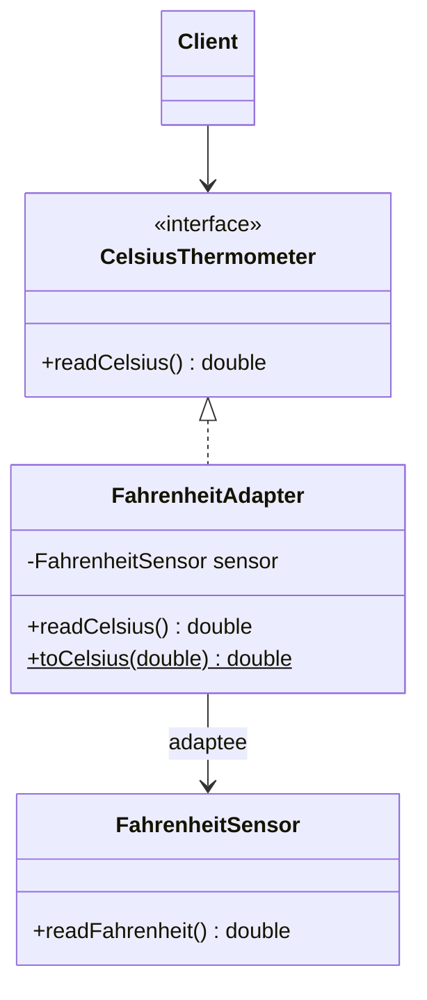
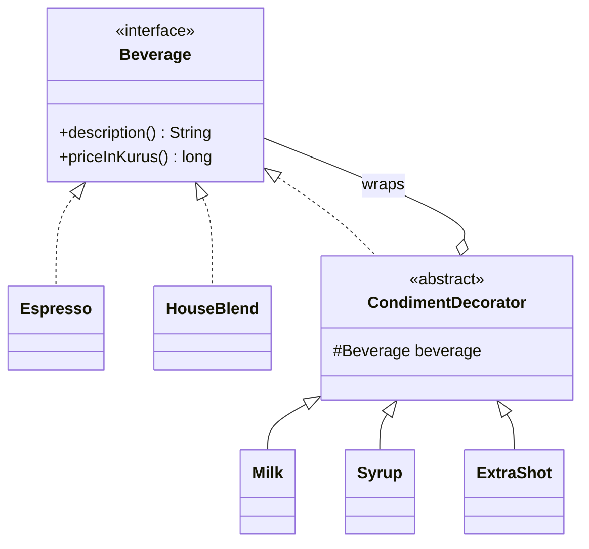
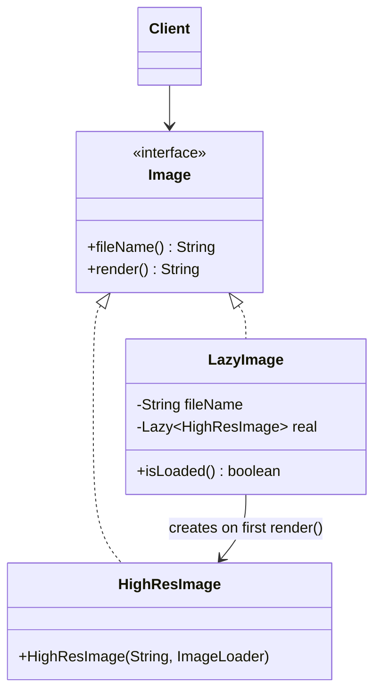
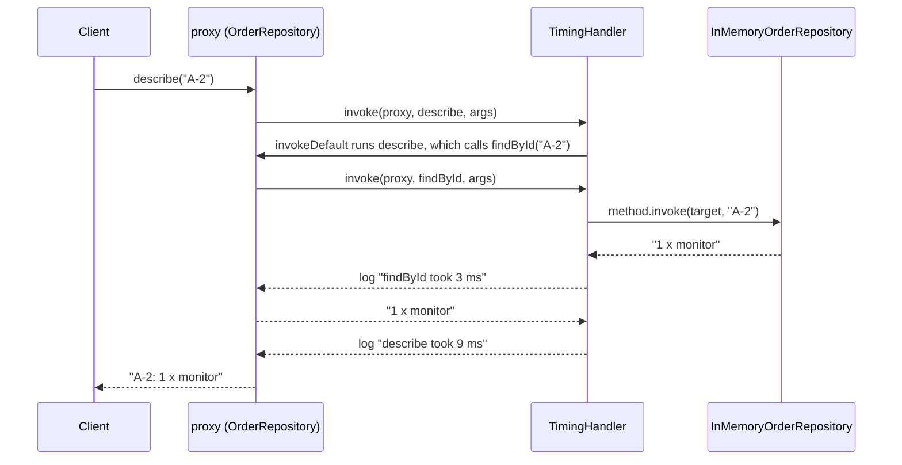
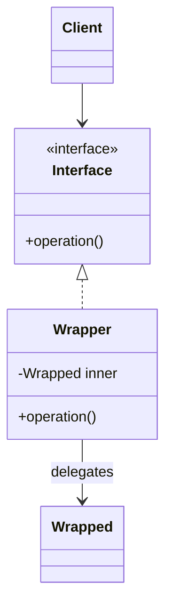

# Modül 04 — Yapısal Kalıplar I: Sarmalayıcılar

> **5. Hafta** · Ön koşullar: m01 (kalıtım yerine bileşim, DIP), m03 (enjekte edilen `Clock`, bileşim kökü), m00 (record'lar, sealed tipler, lambdalar) · Tahmini çalışma süresi: 5 saat
>
> Her örneği derlemeden çalıştırın: `java modules/m04-structural-wrappers/src/main/java/io/github/aliturgutbozkurt/patterns/m04/examples/<yol>/<Demo>.java` (JDK 27)

## Öğrenme çıktıları

Bu modülün sonunda şunları yapabilirsiniz:

1. Eski (legacy) bir API için nesne adaptörü ve sınıf adaptörü **yazmak**, nesne adaptörünün neden genellikle tercih
   edildiğini **açıklamak** ve hedef fonksiyonel bir arayüz olduğunda adaptörü bir lambda olarak **yazmak**.
2. Decorator (Dekoratör) kalıbını klasik biçimiyle (soyut dekoratör tabanı) ve modern biçimiyle (record'lar,
   `Function` bileşimi) **uygulamak** ve üst üste takılan dekoratörlerin sırasının sonucu nasıl değiştirdiğini
   **öngörmek**.
3. `java.io` dekoratör zincirlerini **okumak ve kurmak**, kendi `FilterInputStream`'inizi **yazmak**.
4. Sanal, koruma ve önbellek vekillerini ve varsayılan metotları ve istisnaları doğru ele alan,
   `java.lang.reflect.Proxy` ile yazılmış dinamik bir vekili **uygulamak**.
5. Adapter, Decorator ve Proxy'yi amaçlarına göre **ayırt etmek** ve bir sarmalayıcının yanlış araç olduğu durumlara
   **karar vermek**.

## Motivasyon

m02 ve m03 nesneleri *oluşturmakla* ilgiliydi. Yapısal kalıplar ise onları *birleştirmekle* ilgilidir. Bu modül,
sınıf diyagramında birbirinin aynısı görünen — bir nesne başka bir nesneyi sarmalar ve çağrıları ona iletir — ama
farklı nedenlerle var olan üç kalıbı ele alır:

- **Adapter (Adaptör)** arayüzü *değiştirir*; böylece bir arayüze göre yazılmış kod, başka bir arayüzü olan bir
  nesneyi kullanabilir.
- **Decorator (Dekoratör)** davranış *ekler* ve arayüzü korur; böylece özellikler katmanlar gibi üst üste takılabilir.
- **Proxy (Vekil)** bir nesneye *erişimi denetler* ve arayüzü korur: onu geç oluşturur, izinleri denetler,
  cevapları önbelleğe alır — ya da bunların hepsini çalışma zamanında genel olarak yapar.

"Bu nesne *neden* sarmalanmış?" diye sormayı öğrenin; üçünü de JDK'da, çatılarda ve kendi kodunuzda tanırsınız.

## Adapter

### Problem

Akıllı ev kodumuz sıcaklıkları bir `CelsiusThermometer` üzerinden okur. Satın aldığımız sensör sürücüsünde yalnızca
`double readFahrenheit()` var ve onu değiştiremeyiz. Çevrim içi mağazada ise eski bir ödeme SDK'sı tutarı ondalık bir
*dizge* olarak alır ve sayısal durum kodlarıyla (`0`, `51`, `54`, …) cevap verir; bizim ödeme akışımız ise tutarları
alt birimlerle (kuruş, sent) ve bir `PaymentResult` tipiyle ele alır. İki taraftan birini yeniden yazmak seçenek
değildir.

### Amaç

> Bir sınıfın arayüzünü, istemcilerin beklediği başka bir arayüze dönüştürmek; böylece arayüzleri uyumsuz sınıflar
> birlikte çalışabilir.

### Yapı



**Hedef (target)** istemcinin istediği arayüzdür, **uyarlanan (adaptee)** işi yapan sınıftır, **adaptör** ise hedefi
uygular ve her çağrıyı uyarlananın diline çevirir.

### Klasik Java

Bir **nesne adaptörü** uyarlananı tutar ve işi ona devreder:

```java
// file: adapter/thermometer/FahrenheitAdapter.java
public final class FahrenheitAdapter implements CelsiusThermometer {

    private final FahrenheitSensor sensor;                   // the adaptee, held by composition

    public FahrenheitAdapter(FahrenheitSensor sensor) {
        this.sensor = Objects.requireNonNull(sensor, "sensor");
    }

    @Override
    public double readCelsius() {
        return toCelsius(sensor.readFahrenheit());           // translate the call and the unit
    }
```

Bir **sınıf adaptörü** ise uyarlanandan *kalıtım alır* ve hedefi uygular. Java'da tekli kalıtım olduğu için bu,
yalnızca uyarlanan genişletilebilir bir sınıf ve hedef bir arayüz olduğunda işe yarar:

```java
// file: adapter/payment/LegacyPaymentClassAdapter.java
public class LegacyPaymentClassAdapter extends LegacyPayGateway implements PaymentProcessor {

    @Override
    public PaymentResult pay(PaymentRequest request) {
        String amount = LegacyPaymentMapping.toLegacyAmount(request.amountMinor());
        int status = makePayment(request.cardNumber(), amount, request.currency());   // inherited, not delegated
        return LegacyPaymentMapping.toResult(status, lastTransactionId());
    }
}
```

Bedeli: sınıf adaptörü *bir* `LegacyPayGateway`'dir; bu yüzden eski metotların hepsi istemcilerine sızar.
`PaymentAdapterTest` içindeki bir test onu tip dönüşümüyle alır ve `makePayment(…, "-5.00", …)`'ı doğrudan çağırır —
adaptörün eklemek için yazıldığı doğrulamayı atlayarak. Nesne adaptörünü tercih edin: uyarlananın her alt sınıfını
uyarlayabilir, testlerde değiştirilebilir ve yalnızca hedef arayüzü gösterir.

### Modern Java 27

Hedef fonksiyonel bir arayüz olduğunda **bir lambda bir adaptördür** — sınıfa gerek yoktur:

```java
// file: adapter/thermometer/ThermometerAdapterDemo.java
        FahrenheitSensor sensor = new FahrenheitSensor(212.0, 32.0, -40.0);
        CelsiusThermometer lambda = () -> FahrenheitAdapter.toCelsius(sensor.readFahrenheit());
```

```text
adapter class:  100.0 °C, 0.0 °C, -40.0 °C
lambda adapter: 100.0 °C, 0.0 °C, -40.0 °C
```

**Bir record, kurucusu, `equals`'ı ve `toString`'i hazır gelen bir nesne adaptörüdür:**

```java
// file: adapter/payment/LegacyPaymentAdapter.java
public record LegacyPaymentAdapter(LegacyPayGateway gateway) implements PaymentProcessor {

    public LegacyPaymentAdapter {
        Objects.requireNonNull(gateway, "gateway");
    }

    @Override
    public PaymentResult pay(PaymentRequest request) {
        String amount = LegacyPaymentMapping.toLegacyAmount(request.amountMinor());   // validates first
        int status = gateway.makePayment(request.cardNumber(), amount, request.currency());
        return LegacyPaymentMapping.toResult(status, gateway.lastTransactionId());
    }
}
```

Bir adaptörün asıl işi çoğu zaman *değerlerin çevrilmesidir*. Eski durum kodları **sealed (mühürlü)** bir sonuca
dönüşür; böylece bundan sonra her sonucun ele alındığını derleyici denetler:

```java
// file: adapter/payment/LegacyPaymentMapping.java
    static PaymentResult toResult(int status, String transactionId) {
        return switch (status) {
            case LegacyPayGateway.OK -> new Approved(transactionId);
            case LegacyPayGateway.INSUFFICIENT_FUNDS ->
                    new Declined(DeclineReason.INSUFFICIENT_FUNDS, "insufficient funds");
            case LegacyPayGateway.CARD_EXPIRED -> new Declined(DeclineReason.CARD_EXPIRED, "card expired");
            default -> new Declined(DeclineReason.UNKNOWN, "legacy status " + status);
        };
    }
```

Bir `int`'in sonu yoktur, bu yüzden o `switch` bir `default` ister. İstemcinin sealed `PaymentResult` üzerindeki
`switch`'i ise istemez — record desenleri sonucu parçalarına ayırır ve switch eksiksizdir (exhaustive):

```java
// file: adapter/payment/PaymentAdapterDemo.java
            String outcome = switch (processor.pay(order)) {                 // exhaustive: no default needed
                case Approved(String transactionId) -> "approved, transaction " + transactionId;
                case Declined(DeclineReason reason, String message) -> "declined (" + reason + "): " + message;
            };
```

```text
object adapter (record LegacyPaymentAdapter)
  12.50 TRY on card ending 1111: approved, transaction TX-1001
  7.00 TRY on card ending 0051: declined (INSUFFICIENT_FUNDS): insufficient funds
  99.90 EUR on card ending 0054: declined (CARD_EXPIRED): card expired
  1.00 USD on card ending 0096: declined (UNKNOWN): legacy status 96
class adapter (LegacyPaymentClassAdapter extends LegacyPayGateway)
  12.50 TRY on card ending 1111: approved, transaction TX-1001
  7.00 TRY on card ending 0051: declined (INSUFFICIENT_FUNDS): insufficient funds
  99.90 EUR on card ending 0054: declined (CARD_EXPIRED): card expired
  1.00 USD on card ending 0096: declined (UNKNOWN): legacy status 96
rejected before the gateway: amount must be positive: 0
```

### Gerçek dünyada kullanımı

JDK adaptörlerle doludur (`adapter/jdk/JdkAdaptersDemo.java`): `InputStreamReader` bir bayt akışını karakter akışına
uyarlar, `Arrays.asList` bir diziyi `List` arayüzüne uyarlar (kopya değil, sabit boyutlu bir *görünüm*),
`Enumeration.asIterator()` ve `Collections.enumeration(…)` eski ve modern yineleme arayüzleri arasında köprü kurar.

```text
InputStreamReader: 14 bytes -> 7 chars: çğıİöşü
Arrays.asList: set(1) wrote through -> array is [1A, taken, 1C]
Arrays.asList: add -> UnsupportedOperationException (fixed-size view)
Enumeration.asIterator: alpha, beta, gamma
```

JDK'nın ötesinde: SLF4J köprüleri bir günlükleme API'sini diğerine uyarlar, Spring'in `HandlerAdapter`'ı tek bir
dağıtıcının çok farklı denetleyici tiplerini çağırmasını sağlar, "Ports and Adapters" (m11) ise fikri bütün bir
mimariye ölçekler.

### Tuzaklar ve ne zaman KULLANILMAMALI

- İş kuralları biriktiren bir adaptör artık adaptör değildir — onu ince bir çeviri katmanı olarak tutun.
- Çeviriler bilgi kaybettirir: bilinmeyen bir eski kod sessizce "onaylandı"ya dönüşmemelidir. Onu açık bir `UNKNOWN`
  durumuna eşleyin ve test edin.
- İki tarafın da sahibiyseniz, uyarlamak yerine birini değiştirin.
- Record adaptörün erişim metodu (`gateway()`) uyarlananı açığa çıkarır; testler için sorun değildir, ama istemciler
  yalnızca hedef arayüze bağımlı olmalıdır.

### İlgili kalıplar

**Decorator** arayüzü korur, Adapter değiştirir. **Facade** (m05) da sarmalar, ama bütün bir alt sistemi yeni bir
arayüzün arkasında *basitleştirir*. **Bridge** (m05) soyutlamayı ve gerçekleştirimi *tasarım gereği* ayırır; Adapter
ise bir uyumsuzluğu *sonradan* onarır.

## Decorator

### Problem

Bir kahveci espresso ve house blend satar; süt, şurup ve ekstra shot her kombinasyonda ve miktarda eklenebilir. Her
kombinasyon için bir alt sınıf (`EspressoWithMilkAndTwoShots`) patlamaya yol açar. Kesişen ilgilerde de aynısı olur:
bir stok servisinin bir yerde günlüklemeye, başka bir yerde yeniden denemeye, üçüncü bir yerde ikisine birden ihtiyacı
vardır — servisi değiştirmeden.

### Amaç

> Bir nesneye çalışma zamanında ek sorumluluklar eklemek. Dekoratörler, işlevselliği genişletmek için alt
> sınıflamaya esnek bir alternatif sunar.

### Yapı



Bir dekoratör **bir** `Beverage`'dir (böylece bir içecek beklenen her yerde kullanılabilir ve yeniden sarmalanabilir)
ve bir `Beverage`'e **sahiptir** (süslediği içecek).

### Klasik Java

Soyut dekoratör sarmalanan bileşeni tutar:

```java
// file: coffee/classic/CondimentDecorator.java
public abstract class CondimentDecorator implements Beverage {

    protected final Beverage beverage;                       // the wrapped component

    protected CondimentDecorator(Beverage beverage) {
        this.beverage = Objects.requireNonNull(beverage, "beverage");
    }
}
```

Her somut dekoratör işi devreder ve sonra kendi payını ekler:

```java
// file: coffee/classic/Milk.java
    @Override
    public String description() {
        return beverage.description() + ", Milk";            // delegate, then add
    }

    @Override
    public long priceInKurus() {
        return beverage.priceInKurus() + 500;
    }
```

```java
// file: coffee/classic/CoffeeDemo.java
        print(new Espresso());
        print(new Syrup(new Milk(new Espresso())));                     // innermost first: Espresso, Milk, Syrup
        print(new Milk(new ExtraShot(new ExtraShot(new HouseBlend()))));
```

```text
Espresso: 45.00 TL
Espresso, Milk, Syrup: 57.50 TL
House Blend, Extra Shot, Extra Shot, Milk: 75.00 TL
```

### Modern Java 27

**Dekoratör olarak record'lar.** Sarmalanan bileşen bir record bileşeni olur, soyut taban yoktur ve kompakt kurucu
`null`'ı reddeder:

```java
// file: coffee/modern/Milk.java
public record Milk(Beverage inner) implements Beverage {

    public Milk {
        Objects.requireNonNull(inner, "inner");
    }

    @Override
    public String description() {
        return inner.description() + ", Milk";
    }
```

Record'lar ayrıca değer eşitliği ve sarmalama yapısını gösteren bir `toString` getirir:

```text
Espresso: 45.00 TL
Espresso, Milk, Syrup: 57.50 TL
House Blend, Extra Shot, Extra Shot, Milk: 75.00 TL
same order twice is equal: true
Syrup[inner=Milk[inner=ESPRESSO]]
```

**Fonksiyonel dekorasyon.** "Bileşen" tek bir fonksiyon olduğunda dekoratörlerin hiç sınıfa ihtiyacı yoktur:
`Function.andThen` ve `compose` davranışı üst üste takar. Yorum denetleme hattı küçük `UnaryOperator<String>`
filtrelerinden bir kez kurulur ve her yorum için yeniden kullanılır:

```java
// file: decorator/functional/CommentPipeline.java
    /** A new pipeline that runs this one and then {@code filter}; this pipeline is unchanged. */
    public CommentPipeline then(UnaryOperator<String> filter) {
        return new CommentPipeline(steps.andThen(Objects.requireNonNull(filter, "filter")));
    }
```

```java
// file: decorator/functional/FunctionalDecoratorDemo.java
        Function<String, String> censorThenTruncate = censor(banned).andThen(truncate(10));
        Function<String, String> truncateThenCensor = truncate(10).andThen(censor(banned));
```

```text
before: [   This   darn  product is GREAT,   darn it!   ]
after:  [This **** product is GREAT, **]
censor, then truncate(10): [this is **]
truncate(10), then censor: [this is da]
```

Önce kısaltmak yasaklı kelimeyi ikiye böldü; bu yüzden sansür onu artık tanımadı.

### Üst üste takma sırası önemlidir

Bir depo `StockService`'i için kesişen dekoratörler: biri her çağrıyı günlüğe yazar, diğeri hataları hemen yeniden
dener (bekleme yok — geri çekilme (back-off) kapsam dışıdır). Bütün denemeler başarısız olursa son istisna, öncekiler
*suppressed* olarak eklenmiş biçimde yeniden fırlatılır; böylece hiçbir şey kaybolmaz:

```java
// file: decorator/resilience/RetryingStockService.java
    @Override
    public int available(String sku) {
        List<RuntimeException> failures = new ArrayList<>();
        for (int attempt = 1; attempt <= maxAttempts; attempt++) {
            try {
                return target.available(sku);
            } catch (RuntimeException e) {
                failures.add(e);                                 // no sleeping: back-off is out of scope
            }
        }
        RuntimeException last = failures.removeLast();
        failures.forEach(last::addSuppressed);                  // keep the history, throw the latest
        throw last;
    }
```

Bileşim kökü aynı üç parçayı iki farklı sırada takar:

```java
// file: decorator/resilience/ResilienceDemo.java
        StockService loggingOutside =
                new LoggingStockService(new RetryingStockService(new FlakyStockService(2, stock), 3), log);
        // ...
        StockService retryingOutside =
                new RetryingStockService(new LoggingStockService(new FlakyStockService(2, stock), log), 3);
```

```text
logging(retrying(flaky)):
  log: available(A-42) = 7
retrying(logging(flaky)):
  log: available(A-42) failed: warehouse timeout #1
  log: available(A-42) failed: warehouse timeout #2
  log: available(A-42) = 7
retrying(flaky) that never recovers:
  gave up: warehouse timeout #3 (suppressed: warehouse timeout #1, warehouse timeout #2)
```

Yeniden denemenin *dışındaki* günlükleme tek bir mantıksal çağrı görür; *içindeki* ise her denemeyi görür. İkisi de
yanlış değildir — farklı sorulara cevap verirler ("çağıran ne yaşadı?" ve "depo ne kadar kararsız?"). En dıştaki
dekoratör girişte ilk, çıkışta son davranır.

### Gerçek dünyada kullanımı

**`java.io` dekoratörlerden kuruludur.** `ByteArrayInputStream` ve `FileInputStream` gerçek kaynaklardır;
`BufferedReader`, `InputStreamReader`, `GZIPInputStream` ve her `FilterInputStream` başka bir akışı sarmalar.
(`InputStreamReader` aslında bir *adaptördür*: bayt girer, karakter çıkar.)

```java
// file: decorator/jdk/JdkDecoratorsDemo.java
            var counting = new CountingInputStream(new ByteArrayInputStream(gzip));
            List<String> lines;
            try (var reader = new BufferedReader(                       // chars -> lines
                    new InputStreamReader(                               // bytes -> chars
                            new GZIPInputStream(counting),               // gzip -> bytes
                            StandardCharsets.UTF_8))) {
                lines = reader.lines().toList();
            }
```

Kendinizinkini yazmak `FilterInputStream`'i genişletmekten ibarettir. Bir tuzak: `FilterInputStream.read(byte[])`
`read(byte[], int, int)` üzerinden geçer, ama `skip` *doğrudan* sarmalanan akışa gider — sayan bir dekoratör onu da
ezmelidir:

```java
// file: decorator/jdk/CountingInputStream.java
    @Override
    public long skip(long n) throws IOException {       // FilterInputStream.skip bypasses the read overrides
        long skipped = super.skip(n);
        count += skipped;
        return skipped;
    }
```

En dıştaki okuyucuyu kapatmak, kaynağa kadar bütün akışları kapatır. `Collections.unmodifiableList` salt okunur bir
*görünümdür* (arka plandaki listede sonradan yapılan değişiklikleri gösterir), `List.copyOf` ise bir *kopyadır*:

```text
wrote 4 lines -> 92 gzip bytes
read back 4 lines, errors: [ERROR payment timeout]
CountingInputStream saw 92 of 92 bytes
after backing.add("c"): view [a, b, c], copy [a, b]
view.add -> UnsupportedOperationException
```

JDK dışında: servlet filtreleri ve Spring'in `HandlerInterceptor`'ları, `Collections.synchronizedList` ve yeniden
deneme / devre kesici sarmalayıcıları bir çağrının etrafındaki dekoratörler olan dayanıklılık kütüphaneleri.

### Tuzaklar ve ne zaman KULLANILMAMALI

- **Kimlik:** süslenmiş bir nesne *başka* bir nesnedir. `==`, `getClass()` ve klasik `equals` artık orijinalle
  eşleşmez (`new Milk(new Espresso())` bir başkasına eşit değildir); record'lar değer eşitliğini geri getirir.
- **Sıra:** takma sırası davranışı değiştirir — bunu belgeleyin ve yığınları tek bir yerde (bileşim kökünde) kurun.
- **Derin yığınlar** hata ayıklamayı zorlaştırır: yığın izleri ve `toString` katman üstüne katman gösterir.
- **Sealed arayüzler başkaları tarafından süslenemez:** `Beverage` `sealed … permits Espresso, HouseBlend` olsaydı,
  dışarıdan kimse bir `Milk` yazamazdı. Mühürlemek ve süslemek zıt tasarım tercihleridir.
- Bir özellik hep açıksa, onu doğrudan sınıfa koyun; dekoratörler kombinasyonlar değiştiğinde karşılığını verir.

### İlgili kalıplar

**Adapter** arayüzü değiştirir, Decorator korur. **Proxy** aynı biçime sahiptir ama özellik eklemek yerine erişimi
denetler. **Composite** (m05) da bileşenleri sarmalar, ama bir ağaçta birçoğunu. **Chain of Responsibility** (m07),
çağrıyı *durdurabilen* işleyicilerden oluşan bir yığındır.

## Proxy

### Problem

Bir fotoğraf galerisi yüzlerce küçük resim gösterir; her tam boyutlu resmi baştan yüklemek saniyeler ve bellek
harcar. Bir belge deposu, görüntüleyicilerin yazmalarını reddetmelidir. Bir döviz servisi istek başına ücret alır,
oysa kurlar ancak birkaç dakikada bir değişir. Büyük bir uygulamada ise *her* depo sınıfı zamanlanmalıdır — her biri
için ayrı bir zamanlama sınıfı yazmadan.

### Amaç

> Bir nesneye erişimi denetlemek için onun yerine geçen bir vekil ya da yer tutucu sağlamak.

Yaygın türler: **sanal vekil** gerçek nesneyi tembelce (lazily) oluşturur; **koruma vekili** izinleri denetler;
**önbellek vekili** cevapları hatırlar; **uzak vekil** başka bir süreçteki bir nesnenin yerini tutar (RMI stub'ları,
gRPC istemcileri). **Dinamik vekil** bir tür değil bir *mekanizmadır*: vekil sınıfı çalışma zamanında üretilir.

### Yapı



### Klasik Java

**Sanal vekil.** `LazyImage` ucuz soruyu kendisi cevaplar ve pahalı `HighResImage`'i ancak resim gerçekten
çizildiğinde oluşturur:

```java
// file: proxy/virtual/LazyImage.java
    @Override
    public String fileName() {
        return fileName;                                        // cheap question: answered without loading
    }

    @Override
    public String render() {
        return real.get().render();                             // first call loads, later calls reuse
    }
```

Saf bir `if (real == null) real = new HighResImage(…)` bir yarış durumudur: iki iş parçacığı da `null` görüp iki kez
yükleyebilir. `Lazy`, `volatile` bir alan üzerinde çift denetimli kilitlemeyle (double-checked locking) sonucu
bellekte tutar (memoization):

```java
// file: proxy/virtual/Lazy.java
    @Override
    public T get() {
        T result = value;
        if (result == null) {                                   // fast path: no lock once initialised
            synchronized (this) {
                result = value;
                if (result == null) {                           // re-check: another thread may have won
                    result = Objects.requireNonNull(factory.get(), "factory returned null");
                    value = result;
                }
            }
        }
        return result;
    }
```

```text
gallery of 3 created, loads: 0
thumbnails: [beach.jpg, bosphorus.jpg, cappadocia.jpg], loads: 0
open: bosphorus.jpg [6000x4000 pixels]
open again: bosphorus.jpg [6000x4000 pixels]
loads after viewing one image twice: 1
1000 virtual threads rendered one proxy, loads: 1
```

> **Yan not — Lazy Constants (JEP 531, JDK 27'de önizleme).** JDK'ya yerleşik bir *tembel sabit* geliyor: değeri
> ilk erişimde en fazla bir kez hesaplanan ve JVM tarafından bundan sonra bir `final` alan gibi ele alınan bir
> tutucu. `Lazy` gibi elle yazılmış bellekleyicilerin yerini alacaktır. Önizleme API'si olduğu için bu ders onu
> notlandırılan kodda kullanmaz.

**Koruma vekili.** Kural, rol enum'u üzerinde eksiksiz bir `switch`'tir — yeni bir rol eklendiğinde, biri o rolün ne
yapabileceğine karar verene kadar kod derlenmez — ve yasak bir çağrı gerçek depoya asla ulaşmaz:

```java
// file: proxy/protection/ProtectedDocumentStore.java
    static boolean allowed(Role role, Operation operation) {
        return switch (role) {
            case VIEWER -> operation == Operation.READ;
            case EDITOR -> operation != Operation.DELETE;
            case ADMIN -> true;
        };
    }
    // ...
    @Override
    public void delete(String id) {
        check(Operation.DELETE, id);
        target.delete(id);
    }
```

```text
deniz (VIEWER):
  read -> draft
  denied: deniz (VIEWER) may not WRITE contract-7
  denied: deniz (VIEWER) may not DELETE draft-1
ece (EDITOR):
  read -> draft
  write -> ok
  denied: ece (EDITOR) may not DELETE draft-1
mert (ADMIN):
  read -> revised by ece
  write -> ok
  delete -> ok
```

### Modern Java 27

**Enjekte edilen bir saatle önbellek vekili.** Zaman bir `java.time.Clock`'tan (m03) gelir; böylece demo ve testler
beklemek yerine saati elle ilerletir. Bir kayıt, `now` `storedAt + ttl`'den *önce* olduğu sürece tazedir:

```java
// file: proxy/caching/CachingExchangeRateService.java
    @Override
    public BigDecimal rate(String from, String to) {
        String key = from + "/" + to;
        Instant now = clock.instant();
        Entry entry = cache.get(key);
        if (entry != null && now.isBefore(entry.storedAt().plus(ttl))) {     // fresh until storedAt + ttl
            return entry.rate();
        }
        BigDecimal rate = target.rate(from, to);
        cache.put(key, new Entry(rate, now));
        return rate;
    }
```

```text
2026-09-29T09:00:00Z EUR/TRY = 48.10  (remote calls: 1)
2026-09-29T09:09:00Z EUR/TRY = 48.10  (remote calls: 1)
2026-09-29T09:09:00Z USD/TRY = 41.25  (remote calls: 2)
2026-09-29T09:10:00Z EUR/TRY = 48.10  (remote calls: 3)
2026-09-29T09:10:00Z USD/TRY = 41.25  (remote calls: 3)
```

**Dinamik vekiller.** `TimedOrderRepository`, `TimedPriceList`, … sınıflarını elle yazmak ölçeklenmez.
`java.lang.reflect.Proxy`, verilen arayüzleri uygulayan ve *her* çağrıyı tek bir `InvocationHandler`'a gönderen bir
sınıfı çalışma zamanında üretir:

```java
// file: proxy/dynamic/Proxies.java
    private static <T> T create(Class<T> iface, InvocationHandler handler) {
        if (!iface.isInterface()) {
            throw new IllegalArgumentException(iface.getName() + " is not an interface");
        }
        Object proxy = Proxy.newProxyInstance(iface.getClassLoader(), new Class<?>[] {iface}, handler);
        return iface.cast(proxy);
    }
```

İşleyici (handler) vekili, `Method`'u ve argümanları alır. Üç ayrıntı onu doğru yapar:

```java
// file: proxy/dynamic/TimingHandler.java
    @Override
    public Object invoke(Object proxy, Method method, Object[] args) throws Throwable {
        if (method.getDeclaringClass() == Object.class) {
            return Proxies.objectMethod(proxy, method, args, "timed " + target);   // not timed
        }
        long start = nanoTicker.getAsLong();
        try {
            return method.isDefault()
                    ? InvocationHandler.invokeDefault(proxy, method, args)   // its inner calls come back here
                    : method.invoke(target, args);
        } catch (InvocationTargetException e) {
            throw e.getCause();                                 // the target's own exception, unchanged
        } finally {
            long millis = (nanoTicker.getAsLong() - start) / 1_000_000;
            log.accept(method.getDeclaringClass().getSimpleName() + "." + method.getName() + " took " + millis + " ms");
        }
    }
```

1. `toString`, `equals` ve `hashCode` da işleyiciye gönderilir; bunları zamanlamadan cevaplayın.
2. `Method.invoke` hedefin istisnasını `InvocationTargetException` içine sarar. **Nedeni (cause)** yeniden fırlatın —
   aksi halde çağıran kendi istisnası yerine bir `UndeclaredThrowableException` alır.
3. `default` metotlar `InvocationHandler.invokeDefault` ile çalıştırılır; yaptıkları çağrılar yine vekilden geçer:



Zaman, her okumada 3 ms ilerleyen sahte bir sayaçtan gelir; bu yüzden çıktı belirlenimlidir. Salt okunur vekil
(`ReadOnlyHandler`) `@Mutator` ile işaretlenmiş her metodu engeller:

```text
timing proxy:
  log: OrderRepository.findById took 3 ms
  findById -> 2 x keyboard
  log: OrderRepository.findById took 3 ms
  log: OrderRepository.describe took 9 ms
  describe -> A-2: 1 x monitor
  log: OrderRepository.findById took 3 ms
  findById -> NoSuchElementException: no order Z-9
  log: PriceList.priceOf took 3 ms
  priceOf -> 49.90
read-only proxy:
  findAllIds -> [A-1, A-2]
  save -> OrderRepository.save is read-only
  ids after the blocked save: [A-1, A-2]
Proxy.isProxyClass: true
```

JDK dinamik vekilleri **yalnızca arayüzlerle** çalışır (`Proxies` bir sınıfı `IllegalArgumentException` ile
reddeder). ByteBuddy ve CGLIB gibi kütüphaneler bunun yerine *alt sınıflar* üretir; çatılar sınıfları böyle vekiller.

### Gerçek dünyada kullanımı

`Collections.unmodifiableList` bir koruma vekilidir. Spring AOP, `@Transactional`, `@Cacheable` ve güvenlik için
bean'leri JDK dinamik vekilleriyle (ya da üretilmiş alt sınıflarla) sarar; Hibernate ilişkiler için tembel yükleyen
vekiller döndürür; Mockito'nun mock'ları üretilmiş vekillerdir; RMI ve gRPC stub'ları uzak vekillerdir.

### Tuzaklar ve ne zaman KULLANILMAMALI

- **Yine kimlik:** `proxy.getClass()` `jdk.proxy1.$Proxy…`'dir ve Hibernate vekilleri `getClass()` tabanlı `equals`'ı
  bozar — arayüz üzerinde `instanceof` ile karşılaştırın.
- **Kendi kendini çağırma:** gerçek nesnenin, kendi başka bir metodunu çağıran bir metodu vekilden geçmez (aynı
  sınıftan çağrılan bir `@Transactional` metodun işlemsel olmamasının nedeni budur). Varsayılan metotlar istisnadır —
  `invokeDefault` onların çağrılarını vekilden geçirir.
- **Tembellik + eşzamanlılık:** sanal bir vekil iş parçacığı güvenli olmalıdır, yoksa nesneyi iki kez oluşturabilir.
- **Bayat önbellekler:** bir önbellek vekilinin bir son kullanma kuralına ihtiyacı vardır ve hatalar önbelleğe
  alınmamalıdır.
- **Gizli maliyet:** yerel görünen bir çağrı uzak, yavaş ya da istisna fırlatan bir çağrı olabilir. Bunu adlarda ve
  belgelerde görünür kılın.

### İlgili kalıplar

**Decorator** aynı yapıya sahiptir ama istemcinin seçtiği davranışı ekler; vekil genellikle erişimi denetler ve çoğu
zaman istemci *için* (bir fabrika ya da çatı tarafından) oluşturulur. **Adapter** arayüzü değiştirir. **Flyweight**
(m05) ve **Object Pool** (m03) nesneleri paylaşır; onları bir vekil dağıtabilir.

## Adapter, Decorator ve Proxy karşılaştırması

Üçü de aynı biçimdedir — bir sarmalayıcı bir arayüzü uygular ve tuttuğu nesneye iş devreder:



| | Adapter | Decorator | Proxy |
|---|---|---|---|
| Amaç | arayüzü **değiştirmek** | davranış **eklemek** | **erişimi denetlemek** |
| Sarmalayıcının arayüzü ile sarmalanan nesneninki | farklı | aynı | aynı |
| Sarmalayıcıyı kim seçer? | entegrasyonu yapan | istemci, çoğu zaman birkaçını üst üste takarak | genellikle bir fabrika ya da çatı |
| Tipik katman sayısı | bir | birkaç, sıra önemli | bir |
| Bu modüldeki örnek | `LegacyPaymentAdapter` | `RetryingStockService` | `ProtectedDocumentStore` |
| JDK örneği | `InputStreamReader` | `BufferedReader` | `Collections.unmodifiableList` |

## Özet

| Kalıp | Ne zaman kullanılır | Ne zaman kaçınılır | Java 27 kısayolu |
|---|---|---|---|
| Adapter | Var olan bir sınıfın arayüzü yanlışsa | İki tarafın da sahibiyseniz | Fonksiyonel hedef için lambda; record nesne adaptörü; sealed sonuç + eksiksiz `switch` |
| Decorator | Özellikler serbestçe birleşiyor ya da birçok sınıfı kesiyorsa | Özellik hep açıksa; arayüz sealed ise | Dekoratör olarak record'lar; `Function.andThen` / `compose` |
| Sanal vekil | Nesneyi oluşturmak pahalı ve çoğu zaman gereksizse | Ucuzsa ya da hep gerekiyorsa | İş parçacığı güvenli bellekleyici (Lazy Constants, önizleme) |
| Koruma vekili | Erişim çağırana bağlıysa | Kurallar alan modeline aitse | Rol enum'u üzerinde eksiksiz `switch` |
| Önbellek vekili | Cevaplar pahalı ve yavaş değişiyorsa | Veri hep taze olmalıysa | Enjekte edilen `Clock`, record kayıtlar |
| Dinamik vekil | Aynı davranış birçok arayüz için gerekiyorsa | Bir iki arayüz — sınıfı yazın | `Proxy.newProxyInstance`, `InvocationHandler.invokeDefault` |

## Sınav

1. Bir sınıf bir `Reader`'ı sarmalıyor ve onu satırlardan oluşan bir `Iterator<String>` olarak sunuyor. Adapter mı,
   Decorator mı, Proxy mi? Peki bir `Reader`'ı sarmalayıp okunan karakterleri sayan bir sınıf?
2. Java'da nesne adaptörü neden genellikle sınıf adaptörüne tercih edilir? Sınıf adaptörü testi neyi gösterdi?
3. Bir adaptörü yazmak için bir lambda ne zaman yeterlidir?
4. `logging(retrying(x))` bir satır, `retrying(logging(x))` üç satır yazıyor. Açıklayın. Deponun ne kadar kararsız
   olduğunu ölçmek için hangi sırayı kullanırdınız?
5. `JdkDecoratorsDemo`'da hangi sınıflar "gerçek" kaynak, hangileri dekoratördür? `CountingInputStream` neden `skip`'i
   ezmek zorundaydı?
6. Klasik sürümde `new Milk(new Espresso())` neden bir başka `new Milk(new Espresso())`'ya eşit değildir ve record
   sürümleri neden eşittir?
7. Modülünüzün dışındaki hiç kimse neden `sealed` bir arayüzü süsleyemez?
8. Bu modüldeki dört vekil türünü ve her birinin gerçek dünyadaki bir kullanımını söyleyin.
9. Bir `InvocationHandler` ne alır, `InvocationTargetException` neden açılmalıdır ve JDK dinamik vekilleri neden
   arayüzlere ihtiyaç duyar?

<details><summary>Cevaplar</summary>

1. Birincisi bir **Adapter**'dır (arayüz değişir: `Reader` → `Iterator<String>`). İkincisi bir **Decorator**'dır
   (hâlâ bir `Reader`'dır, sayma eklenmiştir).
2. Java'da tekli kalıtım vardır: sınıf adaptörü üst sınıf hakkını harcar, yalnızca tek bir somut uyarlanan sınıfla
   çalışır ve uyarlananın bütün metotlarını açığa çıkarır. Test, sınıf adaptörünü `LegacyPayGateway`'e dönüştürüp
   `makePayment`'ı negatif bir tutarla çağırdı ve adaptörün doğrulamasını atladı.
3. Hedef fonksiyonel bir arayüz olduğunda (tek soyut metot) ve çeviri bir ifadeye sığdığında.
4. En dıştaki dekoratör çağrıyı ilk görür. Dıştaki günlükleme tek bir mantıksal çağrı görür; yeniden denemenin
   içindeki günlükleme, iki hata dahil her denemeyi görür. Kararsızlığı ölçmek için günlüklemeyi içe koyun:
   `retrying(logging(x))`.
5. `ByteArrayInputStream` gerçek bir kaynaktır; `CountingInputStream`, `GZIPInputStream`, `InputStreamReader` (bir
   adaptör) ve `BufferedReader` başka akışları sarmalar. `FilterInputStream.skip`, ezilmiş `read` metotlarını atlayıp
   doğrudan sarmalanan akışın `skip`'ini çağırır; bu yüzden atlanan baytlar sayılmazdı.
6. Klasik dekoratörler `Object.equals`'ı miras alır — kimlik karşılaştırması. Record'lar `equals`'ı bileşenlerinden
   üretir ve en içteki bileşen `Coffee.ESPRESSO` bir enum sabitidir; bu yüzden iki eşit sipariş eşit çıkar.
7. Sealed bir arayüz bütün gerçekleştirimlerini `permits` içinde listeler; bir dekoratör yeni bir gerçekleştirimdir ve
   izin verilen kümenin dışında derleyici onu reddeder.
8. Sanal (Hibernate'in tembel ilişkileri), koruma (`Collections.unmodifiableList`, Spring Security metot güvenliği),
   önbellek (Spring `@Cacheable`), uzak (RMI ya da gRPC stub'ları). Dinamik vekiller bunların çoğunun arkasındaki
   mekanizmadır.
9. Vekili, çağrılan `Method`'u ve argümanları. `Method.invoke`, hedefin istisnasını `InvocationTargetException` içine
   sarar; onu (ya da bildirilmemiş herhangi bir denetlenen istisnayı) yeniden fırlatmak çağıranın
   `UndeclaredThrowableException` almasına yol açar. `java.lang.reflect.Proxy` arayüzleri *uygulayan* bir sınıf
   üretir — rastgele bir sınıfı genişletemez; bunun için ByteBuddy/CGLIB alt sınıflar üretir.

</details>

## Ödevler

- [01 — Veri kaynağı dekoratörleri (sıkıştırma + Base64)](../assignments/01-data-source-decorators.tr.md) ★★☆
- [02 — Yavaş bir hava durumu servisi için TTL'li önbellek vekili](../assignments/02-weather-cache.tr.md) ★★★

## İleri okuma

- Gamma, Helm, Johnson, Vlissides, *Design Patterns* (1994) — Adapter, Decorator, Proxy.
- Joshua Bloch, *Effective Java*, 3. baskı (2018), madde 18 (kalıtım yerine bileşimi tercih edin — iletici sınıf ve
  sarmalayıcı).
- JDK API: [`java.lang.reflect.Proxy`](https://docs.oracle.com/en/java/javase/27/docs/api/java.base/java/lang/reflect/Proxy.html),
  [`InvocationHandler.invokeDefault`](https://docs.oracle.com/en/java/javase/27/docs/api/java.base/java/lang/reflect/InvocationHandler.html),
  [`java.io.FilterInputStream`](https://docs.oracle.com/en/java/javase/27/docs/api/java.base/java/io/FilterInputStream.html)
- JEP 531 — [Lazy Constants (preview)](https://openjdk.org/jeps/531) · JEP 444 — [Virtual Threads](https://openjdk.org/jeps/444)
- Terimlerin Türkçesi: [docs/glossary.md](../../../docs/glossary.md)
