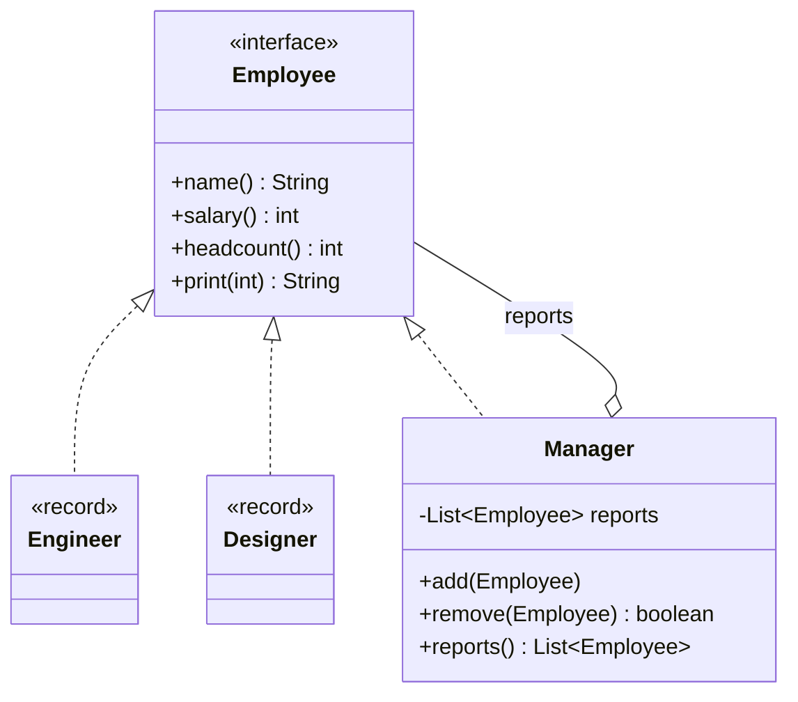
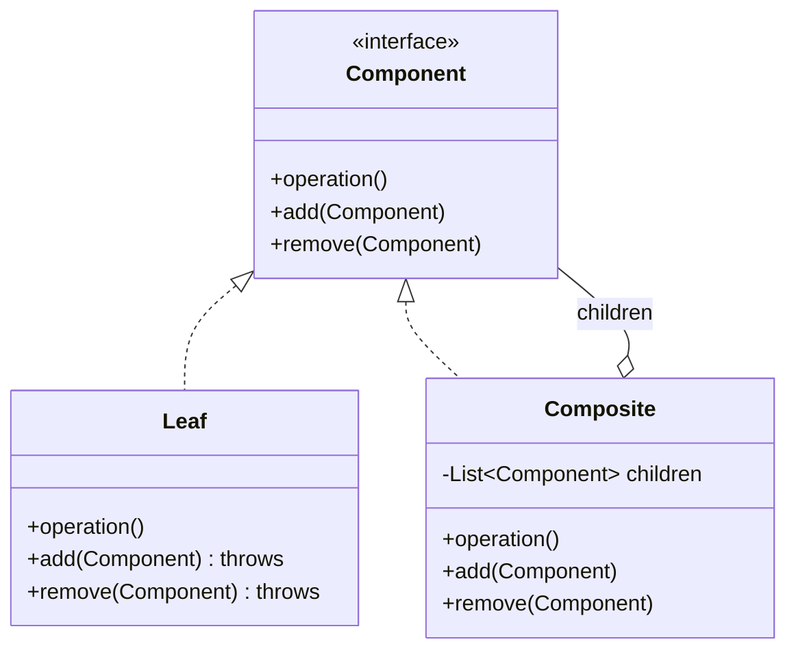
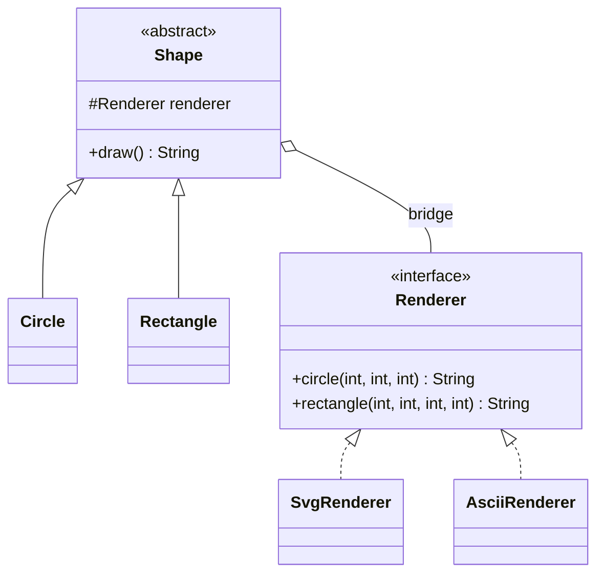
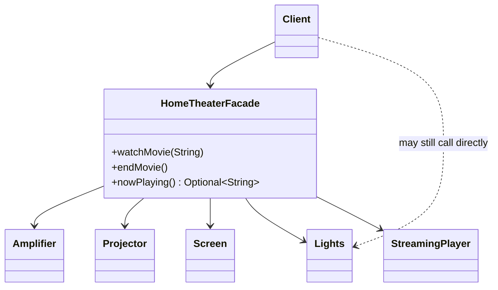
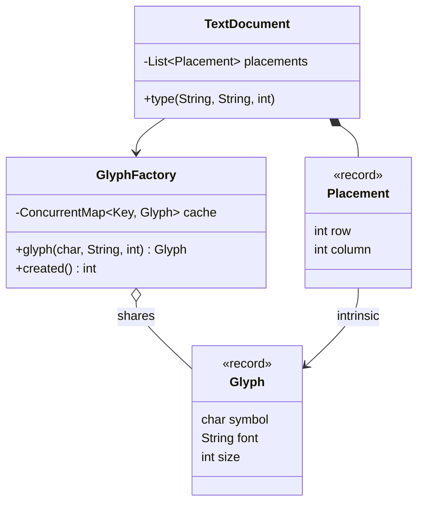

# Module 05 — Structural Patterns II: Composition

> **Week 6** · Prerequisites: m04 (Adapter, Decorator, Proxy), m03 (records, static factories), m01 (composition over inheritance), m00 (sealed types, record patterns, virtual threads) · Estimated study time: 5 h
>
> Run every example without a build: `java modules/m05-structural-composition/src/main/java/io/github/aliturgutbozkurt/patterns/m05/examples/<path>/<Demo>.java` (JDK 27)

## Learning outcomes

By the end of this module you can:

1. **Implement** Composite in its classic GoF form and in its modern form (a `sealed` interface with `record` nodes
   and recursive exhaustive `switch` operations), and **compare** what each makes easy.
2. **Explain** the transparency vs. safety trade-off and **implement** tree operations: totals, counts, depth-first
   search with a path, indented rendering.
3. **Implement** Bridge and **refactor** an N × M class explosion into N + M classes, using a lambda as the
   implementor when it has one method.
4. **Design** a Facade that turns a multi-step workflow — including undoing earlier steps when a later one fails —
   into one call, without hiding the subsystem.
5. **Implement** a thread-safe Flyweight factory, **separate** intrinsic from extrinsic state and **measure** the
   saving by counting instances.
6. **Explain** the JDK's own flyweights and the rules for value-based classes such as `Integer` and `LocalDate`.

## Motivation

m04 wrapped *one* object to change its interface or behaviour. This module is about how *many* objects are put
together: a whole tree used like a single node (Composite), two hierarchies that vary independently instead of
multiplying (Bridge), one simple entry point to a tangle of subsystems (Facade), and thousands of small objects that
share their common state (Flyweight).

## Composite

### Problem

A company asks two questions again and again: "what does this person cost?" and "what does this department cost?".
A department contains people *and* other departments. If the client has to check "is this a person or a team?"
at every level, every report becomes a nest of `instanceof` checks — and breaks when a new kind of node appears.

### Intent

> Compose objects into **tree structures** to represent part–whole hierarchies, and let clients treat **single
> objects and compositions uniformly**.

### Structure



### Classic Java

Leaves answer from their own data; the composite answers by asking its children and adding its own share. Adding a
report checks that no one ends up reporting to themselves:

```java
// file: examples/composite/orgchart/Manager.java
    /** Adds a direct report; rejects anyone who would make this manager report to themselves. */
    public void add(Employee report) {
        Objects.requireNonNull(report, "report");
        if (report == this || report instanceof Manager manager && manager.manages(this)) {
            throw new IllegalArgumentException(
                    report.name() + " cannot report to " + name + ": that would create a cycle");
        }
        reports.add(report);
    }
    // ...
    @Override
    public int salary() {
        int total = ownSalary;
        for (Employee report : reports) {
            total += report.salary();
        }
        return total;
    }
```

The client does not know — or care — whether it holds one person or a whole department:

```java
// file: examples/composite/OrgChartDemo.java
    // The client treats one person and a whole department the same way.
    private static void report(String label, Employee employee) {
        System.out.println(label + ": headcount " + employee.headcount() + ", salary cost " + employee.salary());
    }
```

```text
Grace (Manager) 9000
  Alan (Manager) 8000
    Ada (Engineer) 7000
    Linus (Engineer) 6500
  Dieter (Designer) 6000
company: headcount 5, salary cost 36500
engineering: headcount 3, salary cost 21500
Ada alone: headcount 1, salary cost 7000
after Linus leaves: headcount 4, salary cost 30000
rejected: Grace cannot report to Alan: that would create a cycle
```

**Transparency vs. safety.** Where do `add` and `remove` live? This example uses the GoF **safe** form: only
`Manager` has them, so `engineer.add(...)` does not compile — but a client holding an `Employee` must check the type
before adding. The **transparent** form puts them on the component interface, so every node looks the same, and
leaves throw `UnsupportedOperationException` at run time:



`java.awt.Container` is safe-style (`add` exists only on containers); the transparent style trades compile-time
safety for uniformity. Prefer safety unless clients really must build trees without knowing node types.

### Modern Java 27

When the set of node kinds is **closed**, a `sealed` interface with `record` nodes describes the tree as plain,
immutable data:

```java
// file: examples/composite/filesystem/FsNode.java
public sealed interface FsNode permits File, Directory {

    String name();
}
```

```java
// file: examples/composite/filesystem/Directory.java
public record Directory(String name, List<FsNode> children) implements FsNode {

    public Directory {
        Names.check(name);
        children = List.copyOf(children);
```

`List.copyOf` makes the children an immutable snapshot: whoever built the list cannot change the tree afterwards,
so a tree can be shared freely. The operations live *outside* the nodes, each one a recursive `switch` with record
patterns — exhaustive, so there is no `default`, and `_` skips components we do not need:

```java
// file: examples/composite/filesystem/FsOps.java
    /** Total bytes in the tree. */
    public static long size(FsNode node) {
        return switch (node) {
            case File(var _, var bytes) -> bytes;
            case Directory(var _, var children) -> children.stream().mapToLong(FsOps::size).sum();
        };
    }
    // ...
    private static void collect(FsNode node, String parent, Predicate<File> test, List<String> found) {
        String path = parent + "/" + node.name();
        switch (node) {
            case File file when test.test(file) -> found.add(path);
            case File _ -> { }
            case Directory(var _, var children) -> children.forEach(child -> collect(child, path, test, found));
        }
    }
```

```text
project/ (5300 bytes)
  README.md (300 bytes)
  src/ (5000 bytes)
    main/ (4200 bytes)
      App.java (1200 bytes)
      Util.java (3000 bytes)
    test/ (800 bytes)
      AppTest.java (800 bytes)
  docs/ (0 bytes)
files: 4, total: 5300 bytes, depth: 4
java sources: [/src/main/App.java, /src/main/Util.java, /src/test/AppTest.java]
larger than 1000 bytes: [/src/main/App.java, /src/main/Util.java]
rejected: duplicate name in src: main
```

The two forms make opposite changes easy — the *expression problem* in one table:

| Change | Classic (methods on each node) | Sealed records + `switch` |
|---|---|---|
| Add a **node type** | one new class, nothing else changes | every `switch` stops compiling until it handles it |
| Add an **operation** | a new method in the interface **and** every node class | one new method in `FsOps`; nodes unchanged |

Choose the classic form when new node kinds keep appearing (plug-ins, UI widgets); choose sealed records when the
node kinds are stable and new questions keep being asked (reports, exports, validation).

### Second example: arithmetic expressions

An expression is a Composite whose leaves are numbers and whose composites are operators. The same tree gives a value
and a text; the renderer adds parentheses only where precedence needs them, and a nested record pattern with a guard
handles a negative literal:

```java
// file: examples/composite/expression/Expressions.java
    public static long evaluate(Expr expr) {
        return switch (expr) {
            case Num(var value) -> value;
            case Add(var left, var right) -> Math.addExact(evaluate(left), evaluate(right));
            case Mul(var left, var right) -> Math.multiplyExact(evaluate(left), evaluate(right));
            case Neg(var operand) -> Math.negateExact(evaluate(operand));
        };
    }
    // ...
    public static String render(Expr expr) {
        return switch (expr) {
            case Num(var value) -> Long.toString(value);
            case Add(var left, var right) -> operand(left, expr) + " + " + operand(right, expr);
            case Mul(var left, var right) -> operand(left, expr) + " * " + operand(right, expr);
            case Neg(Num(var value)) when value >= 0 -> "-" + value;
            case Neg(var operand) -> "-(" + render(operand) + ")";
        };
    }
```

```text
(1 + 2) * 3 = 9
1 + 2 * 3 = 7
-(-4) = 4
-(2 * 3) + 10 = 4
1 + 2 + ... + 1000 (a tree 1000 levels deep) = 500500
```

`Math.addExact` and friends throw `ArithmeticException` on overflow instead of silently wrapping around. Parsing and
variables are left for Interpreter in m08.

### Real-world usage

`java.awt.Component` / `java.awt.Container` (a container *is a* component and holds components), Swing's
`JComponent`, the directory trees that `java.nio.file.Files.walk` traverses, XML/HTML DOM nodes, and the abstract
syntax tree inside `javac`.

### Pitfalls and when NOT to use it

- **Cycles.** A mutable tree can accidentally contain itself; recursion then never ends. Check on `add`, or use
  immutable records, which cannot form cycles.
- **Leaking mutable children.** Returning the internal list lets callers change the tree behind your back — return
  `Collections.unmodifiableList` or store `List.copyOf`.
- **Very deep trees** can overflow the stack with naive recursion (tens of thousands of levels); use an explicit
  stack for untrusted input.
- Do not force a hierarchy that is really flat: a list of items needs no Composite.

### Related patterns

**Iterator** (m07) walks a Composite; **Visitor** (m08) adds operations to a classic Composite — sealed types with
pattern matching replace it; **Decorator** (m04) has the same recursive shape but exactly one child; **Builder**
(m03) is handy for assembling large trees.

## Bridge

### Problem

Two shapes (circle, rectangle) must be drawn in two formats (SVG, ASCII). With inheritance that is four classes —
`SvgCircle`, `AsciiCircle`, `SvgRectangle`, `AsciiRectangle` — and every new shape or format multiplies the count:
N × M classes, each repeating logic from its neighbours.

### Intent

> **Decouple an abstraction from its implementation** so that the two can vary independently.

### Structure



### Classic Java

The abstraction *has* an implementor instead of *being* one of its variants:

```java
// file: examples/bridge/shapes/Shape.java
public abstract class Shape {

    protected final Renderer renderer;

    protected Shape(Renderer renderer) {
        this.renderer = Objects.requireNonNull(renderer, "renderer");
    }

    /** Draws this shape with whatever renderer it was given. */
    public abstract String draw();
```

A refined abstraction only calls the implementor's primitives:

```java
// file: examples/bridge/shapes/Circle.java
    @Override
    public String draw() {
        return renderer.circle(x, y, radius);
    }
```

```text
Circle with SvgRenderer:
<circle cx="5" cy="5" r="2"/>
Circle with AsciiRenderer:
  *
 ***
*****
 ***
  *
Rectangle with SvgRenderer:
<rect x="0" y="0" width="6" height="3"/>
Rectangle with AsciiRenderer:
+----+
|    |
+----+
2 shapes x 2 renderers = 4 combinations from 2 + 2 classes
```

The tests add a third, test-only `RecordingRenderer` that just records the calls — `Shape` does not change.

### Modern Java 27

When the implementor has **one method**, make it a functional interface: every lambda is then an implementor. The
abstraction decides *when and what* to send; the channel decides *where*:

```java
// file: examples/bridge/alerts/MessageChannel.java
@FunctionalInterface
public interface MessageChannel {

    void send(String message);
}
```

```java
// file: examples/bridge/alerts/DigestAlerts.java
    public void flush() {
        if (pending.isEmpty()) {
            return;
        }
        String count = pending.size() == 1 ? "1 alert" : pending.size() + " alerts";
        channel.send(count + ": " + String.join("; ", pending));
        pending.clear();
    }
```

```java
// file: examples/bridge/AlertsDemo.java
        MessageChannel email = new EmailChannel("ops@example.com", System.out::println);
        MessageChannel sms = new SmsChannel("+90 555 000 00 00", System.out::println);
        MessageChannel chat = message -> System.out.println("chat #ops: " + message);   // no new class needed
```

First lines of the output (the last demo line shows an SMS cut to 160 characters, ending in `…`):

```text
email to ops@example.com: [URGENT] payment service down
sms to +90 555 000 00 00: [URGENT] payment service down
digest: 3 pending, nothing sent yet
email to ops@example.com: 3 alerts: cpu 85%; disk 80%; certificate expires in 14 days
chat #ops: [URGENT] payment service back up
```

Two policies × three channels = six behaviours from five small types, and the chat channel is a single lambda. The
pairing happens where objects are created — the composition root of m03.

### Second example: remote controls and devices

The classic GoF example lets *both* sides grow. The remote hierarchy (`RemoteControl` → `AdvancedRemote`) is written
only in terms of `Device` primitives, so it works with a TV, a radio and any device added later:

```java
// file: examples/bridge/remote/RemoteControl.java
    /** Next channel, wrapping from the last one back to 1; ignored while the device is off. */
    public void channelUp() {
        if (device.isEnabled()) {
            device.setChannel(device.channel() % device.channelCount() + 1);
        }
    }
```

```java
// file: examples/bridge/remote/AdvancedRemote.java
    public void mute() {
        if (device.isEnabled() && volumeBeforeMute < 0) {
            volumeBeforeMute = device.volume();
            device.setVolume(0);
        }
    }
```

```text
volume up while off -> TV: off, channel 1 of 5, volume 30
basic remote        -> TV: on, channel 2 of 5, volume 40
advanced remote     -> Radio: on, station 2 of 3, volume 30
muted               -> Radio: on, station 2 of 3, volume 0
unmuted             -> Radio: on, station 2 of 3, volume 30
two stations up     -> Radio: on, station 1 of 3, volume 30
back to "jazz"      -> Radio: on, station 2 of 3, volume 30
advanced on the TV  -> TV: on, channel 2 of 5, volume 0
```

### Real-world usage

**JDBC** is the textbook bridge: your code talks to the `java.sql` interfaces (`Connection`, `Statement`) — the
abstraction — and each vendor's driver is an implementor. `java.util.logging.Handler` × `Formatter`
(`handler.setFormatter(...)`) combines *where* log records go with *how* they look; SLF4J over Logback/Log4j works
the same way.

### Pitfalls and when NOT to use it

- With only **one** implementation and no second one in sight, a bridge is just indirection.
- A leaky implementor interface (primitives that only one implementor can support) forces the others to fake them.
- Bridge is designed **up front**; if you are fitting two existing, incompatible interfaces together, you want an
  Adapter.

### Related patterns

**Adapter** (m04) makes unrelated classes work together *after* they were designed; Bridge separates the hierarchies
*before*. **Strategy** (m06) looks the same in code but is about exchanging an *algorithm*; Bridge is about the
*structure* of two hierarchies. **Abstract Factory** (m02) can create matching abstraction–implementor pairs.

## Facade

### Problem

Watching a film at home means dimming the lights, lowering the screen, switching on the projector and amplifier,
choosing the input, setting surround sound and volume, then starting the player — ten calls in the right order, and
the reverse at the end. Every client that repeats the sequence repeats its mistakes.

### Intent

> Provide a **unified, higher-level interface** to a set of interfaces in a subsystem, making the subsystem easier to
> use.

### Structure



### Classic Java

The facade holds the subsystems (injected, so tests can use fakes) and knows the order:

```java
// file: examples/facade/hometheater/HomeTheaterFacade.java
    /** Gets the room ready and starts the film. */
    public void watchMovie(String title) {
        Objects.requireNonNull(title, "title");
        if (playing != null) {
            throw new IllegalStateException("already playing: " + playing);
        }
        lights.dim(10);
        screen.down();
        projector.on();
        projector.wideScreenMode();
        amplifier.on();
        amplifier.setInput("streaming");
        amplifier.setSurroundSound();
        amplifier.setVolume(5);
        player.on();
        player.play(title);
        playing = title;
    }
```

```text
> watchMovie("Dune")
  lights: dim to 10%
  screen: down
  projector: on
  projector: widescreen mode
  amplifier: on
  amplifier: input streaming
  amplifier: surround sound
  amplifier: volume 5
  player: on
  player: play "Dune"
> lights.dim(30) directly
  lights: dim to 30%
> endMovie()
  player: stop
  player: off
  amplifier: off
  projector: off
  screen: up
  lights: on
> endMovie() again
  (nothing to do)
```

Note the second step: the subsystem is still public. A facade **simplifies; it does not forbid**.

### Modern Java 27

A real facade also owns the hard part of a workflow: **compensation**. Placing an order reserves stock, charges the
card and books shipping; when a later step fails, the earlier ones must be undone in reverse order. Expected business
failures are returned as values of a sealed type, not thrown:

```java
// file: examples/facade/checkout/CheckoutResult.java
public sealed interface CheckoutResult permits Placed, Rejected {}
```

```java
// file: examples/facade/checkout/CheckoutFacade.java
    public CheckoutResult placeOrder(Cart cart, Card card, Address address) {
        Optional<String> reservation = inventory.reserve(cart.quantities());
        if (reservation.isEmpty()) {
            return new Rejected(Reason.OUT_OF_STOCK, "not enough stock");
        }
        String reservationId = reservation.orElseThrow();

        long total = cart.totalCents();
        Optional<String> payment = payments.charge(card, total);
        if (payment.isEmpty()) {
            inventory.release(reservationId);                        // undo step 1
            return new Rejected(Reason.PAYMENT_DECLINED, "card ending " + card.lastFour() + " declined");
        }
        String paymentId = payment.orElseThrow();

        Optional<String> tracking = shipping.ship(address, reservationId);
        if (tracking.isEmpty()) {
            payments.refund(paymentId);                              // undo step 2
            inventory.release(reservationId);                        // undo step 1
            return new Rejected(Reason.SHIPPING_UNAVAILABLE, "no shipping to " + address.country());
        }
        return new Placed(tracking.orElseThrow(), total);
    }
```

The caller must handle both outcomes — an exhaustive `switch` with record patterns, no `default`:

```java
// file: examples/facade/CheckoutDemo.java
    private static void print(int order, CheckoutResult result) {
        String outcome = switch (result) {
            case Placed(var tracking, var total) -> "placed, tracking " + tracking + ", charged " + euros(total);
            case Rejected(var reason, var detail) -> "rejected " + reason + " (" + detail + ")";
        };
        System.out.println("order " + order + ": " + outcome);
    }
```

```text
order 1: placed, tracking TRK-1001, charged 59.97
order 2: rejected OUT_OF_STOCK (not enough stock)
order 3: rejected PAYMENT_DECLINED (card ending 0002 declined)
order 4: rejected SHIPPING_UNAVAILABLE (no shipping to AQ)
stock left: mug 7, tshirt 2
charges 2, refunds 1, net charged 59.97
```

Order 4 was charged, then refunded, and its stock released: the final state shows no trace of it. Unexpected
failures (a bug, a lost connection) would still be exceptions.

### Real-world usage

`java.net.http.HttpClient` is one object in front of connection pooling, HTTP/2 negotiation, TLS and redirects.
`DriverManager.getConnection(url)` hides driver lookup and loading. Service-layer classes in web applications
(`OrderService.placeOrder`) are facades over repositories and gateways.

### Pitfalls and when NOT to use it

- **God object.** A facade that grows a method for every use case becomes the whole application; split it by use
  case (`CheckoutFacade`, `ReturnsFacade`).
- Do not **forbid** direct subsystem access "for cleanliness" — advanced clients need it.
- A facade with one method that forwards one call adds nothing.

### Related patterns

**Adapter** (m04) changes an interface to one the client expects; a facade *defines a new, simpler* one. **Mediator**
(m07) also coordinates several objects, but they talk *through* it in both directions; subsystems do not know a
facade exists. Facades are often **Singletons** in practice — prefer one instance wired in a composition root (m03).

## Flyweight

### Problem

A text editor shows 100 000 characters on screen. If each one is an object with its own font data, the editor holds
100 000 copies of what is really a few dozen different glyphs. A game forest with 100 000 trees and three kinds of
tree has the same problem.

### Intent

> Use **sharing** to support large numbers of fine-grained objects efficiently: keep the state they have in common
> (**intrinsic**) in shared, immutable objects and pass the state that differs (**extrinsic**) in from outside.

### Structure



### Classic Java

The flyweight holds only intrinsic state and is immutable — a record. The client keeps the extrinsic state (row,
column) next to a *reference* to the shared glyph:

```java
// file: examples/flyweight/glyphs/TextDocument.java
    public record Placement(Glyph glyph, int row, int column) {}
    // ...
    public void type(String text, String font, int size) {
        for (char symbol : text.toCharArray()) {
            if (symbol == '\n') {
                row++;
                column = 0;
            } else {
                placements.add(new Placement(glyphs.glyph(symbol, font, size), row, column++));
            }
        }
    }
```

```text
one line: 43 characters on screen, 27 glyph objects
same line again: 86 characters on screen, 27 glyph objects
heading "Hello" in Sans 18: 91 characters on screen, 31 glyph objects
'e' Serif 12 twice -> same instance: true
'e' Serif 12 vs Sans 18 -> same instance: false
```

### Modern Java 27

The factory is where sharing happens, so it must be **thread-safe**. `ConcurrentHashMap.computeIfAbsent` runs the
creating function at most once per key, atomically — no "check, then put" race. The cache is an instance field: whoever
needs sharing owns a factory (no mutable static state):

```java
// file: examples/flyweight/glyphs/GlyphFactory.java
    private record Key(char symbol, String font, int size) {}

    private final ConcurrentMap<Key, Glyph> cache = new ConcurrentHashMap<>();
    private final AtomicInteger created = new AtomicInteger();

    public Glyph glyph(char symbol, String font, int size) {
        return cache.computeIfAbsent(new Key(symbol, font, size), key -> {
            var glyph = new Glyph(key.symbol(), key.font(), key.size());   // runs at most once per key
            created.incrementAndGet();
            return glyph;
        });
    }
```

The test asks for the same glyph from 1 000 virtual threads and checks, with an identity set, that exactly one object
exists:

```java
// file: examples/flyweight/GlyphTest.java
        try (var executor = Executors.newVirtualThreadPerTaskExecutor()) {
            for (int i = 0; i < 1000; i++) {
                results.add(executor.submit(() -> factory.glyph('x', "Serif", 12)));
            }
        }
```

**Measuring the effect.** The forest takes its tree types from a pluggable source, so one class shows both versions:
a method reference to the factory shares, a constructor reference does not:

```java
// file: examples/flyweight/ForestDemo.java
        var types = new TreeTypeFactory();
        var shared = new Forest(types::typeOf);
        shared.plantGrid(400, 250);
        var naive = new Forest(TreeType::new);
        naive.plantGrid(400, 250);
```

```text
shared forest: 100000 trees, 3 distinct TreeType instances
naive forest:  100000 trees, 100000 distinct TreeType instances
region x 0..3, y 0..1:
  (0,0) oak
  (1,0) pine
  (2,0) birch
  (3,0) oak
  (0,1) birch
  (1,1) oak
  (2,1) pine
  (3,1) birch
```

Tests and demos count **instances**, never bytes — byte counts depend on the JVM. For a feel of the numbers, run the
demo with `shared` or `naive` as an argument: it builds only that forest and waits for Enter, so you can run
`jcmd <pid> GC.class_histogram`. One manual measurement, **measured on JDK 27 with compact object headers (JEP 534)
on**, the default:

| Class | shared: instances | shared: bytes | naive: instances | naive: bytes |
|---|---|---|---|---|
| `Tree` | 100 000 | 2 400 000 | 100 000 | 2 400 000 |
| `TreeType` | 3 | 72 | 100 000 | 2 400 000 |
| whole heap (histogram total) | 181 226 | 6 292 192 | 280 782 | 8 671 816 |

**JEP 534** makes compact object headers the default in JDK 27: every object's header shrinks from 12 to 8 bytes, so
*all* objects get smaller — shared or not. It does not remove duplicates: 100 000 identical `TreeType` objects are
still 100 000 objects. (Here the three `String` fields are shared literals; with per-tree strings or sprite data, the naive
version would be far larger.)

### Second example: the JDK's own flyweights

You have used flyweights since your first Java program. `Integer.valueOf` returns cached instances for −128..127
(guaranteed by JLS §5.1.7), `Boolean.valueOf` only ever returns `TRUE` or `FALSE`, `Character.valueOf` caches
`\u0000`..`\u007f`, and `Currency.getInstance` never creates two instances for one currency:

```java
// file: examples/flyweight/jdk/JdkFlyweights.java
    public static boolean boxedIntegersIdentical(int value) {
        return Integer.valueOf(value) == Integer.valueOf(value);
    }
    // ...
    public static boolean currencyShared(String code, Locale locale) {
        return Currency.getInstance(code) == Currency.getInstance(locale);
    }
```

```text
Integer.valueOf(127) == Integer.valueOf(127): true (guaranteed: -128..127 are cached)
Integer.valueOf(-128) == Integer.valueOf(-128): true (guaranteed: -128..127 are cached)
Integer.valueOf(128) == Integer.valueOf(128): false (not guaranteed either way)
Integer.valueOf(128).equals(Integer.valueOf(128)): true (always right)
Boolean.valueOf(true) == Boolean.TRUE: true (guaranteed)
Character.valueOf('A') == Character.valueOf('A'): true (guaranteed: \u0000..\u007f are cached)
Currency.getInstance("EUR") == Currency.getInstance(Locale.GERMANY): true (one instance per currency)
LocalDate.of(2026, 9, 29) == LocalDate.of(2026, 9, 29): false (not guaranteed: value-based class, never use ==)
LocalDate.of(2026, 9, 29).equals(LocalDate.of(2026, 9, 29)): true (always right)
```

The `128` line printed `false` with default flags, but the upper bound is tunable (`-XX:AutoBoxCacheMax`), so no test
asserts it. That is exactly why `==` on boxed values is a bug: it works for small numbers in your tests and fails in
production for large ones — and **no compiler lint warns about it**.

`Integer`, `LocalDate`, `Optional` and friends are **value-based classes**: they are immutable, equal instances are
interchangeable, and their *identity* means nothing. Three rules follow: compare with `equals`, never with `==`;
never rely on getting (or not getting) the same instance; never synchronize on them. The last one is checked — javac's
`identity` lint turns it into a compile error under this course's `-Xlint:all -Werror` (compiler output for a scratch
file, not part of the examples):

```text
Booking.java:7: warning: [identity] attempt to synchronize on an instance of a value-based class
        synchronized (day) {
        ^
error: warnings found and -Werror specified
```

Project Valhalla's value classes, which would make such objects identity-free by design, are **not** part of JDK 27.

### Real-world usage

`Integer.valueOf`, `Long.valueOf`, `Boolean.valueOf`, `Character.valueOf`; string literals and `String.intern()`
(one instance per distinct literal); `Currency.getInstance`; enum constants and `EnumSet`; glyph and texture caches in
text renderers and game engines.

### Pitfalls and when NOT to use it

- **Mutable flyweights** are a disaster: changing a shared glyph changes every character that uses it. Make them
  records.
- A non-thread-safe factory (`HashMap` + "check, then put") can create duplicates or corrupt the map under load.
- An unbounded cache keyed by user input is a memory leak; bound it, or key only on a small, closed set.
- Do not add a factory for a handful of objects — measure first; the extra indirection costs readability.

### Related patterns

**Factory Method / static factories** (m02) hand out flyweights (`Integer.valueOf`). **Composite** leaves are often
flyweights (the same glyph in many places of a document tree). **Singleton** (m02) is a flyweight with exactly one
key. **Object Pool** (m03) also reuses objects, but mutable ones that are borrowed and returned; flyweights are
immutable and shared at the same time.

## Choosing a structural composition pattern

| Situation | Use |
|---|---|
| Part–whole tree; clients treat one node and a subtree alike; node kinds keep growing | Composite (classic) |
| Part–whole tree; node kinds fixed, new operations keep coming | Composite (sealed records + `switch`) |
| Two dimensions of variation would multiply subclasses (N × M) | Bridge |
| The implementor side has one method | Bridge with a functional interface (lambda) |
| Clients repeat a multi-step subsystem workflow (and its undo) | Facade |
| Expected business failures of that workflow | Facade returning a sealed result |
| Very many small objects with shared, immutable state | Flyweight (+ thread-safe factory) |
| Comparing boxed numbers, dates, `Optional` | `equals` — never `==` |

## Summary

| Pattern | Use when | Avoid when | Java 27 shortcut |
|---|---|---|---|
| Composite | Part–whole hierarchies, uniform treatment | The structure is flat | `sealed` + `record` nodes, recursive exhaustive `switch` |
| Bridge | Two independent dimensions of variation | Only one implementation exists | Functional-interface implementor, lambdas |
| Facade | A subsystem is hard to use correctly | It would just forward one call | Sealed result type for expected failures |
| Flyweight | Many objects share heavy immutable state | Few objects; mutable state | Records + `ConcurrentHashMap.computeIfAbsent` |

## Quiz

1. In the org chart, why can the client call `salary()` without knowing whether it holds an `Engineer` or a
   `Manager`?
2. Where do `add`/`remove` live in the "safe" and in the "transparent" Composite, and what does each variant give up?
3. Adding a new node type vs. adding a new operation: which is easy with classic Composite, which with sealed
   records and `switch`? Why does the compiler help in the second case?
4. What does `List.copyOf` in the `Directory` compact constructor protect against?
5. Three shapes and four renderers: how many classes with inheritance only, and how many with Bridge?
6. Bridge vs. Adapter vs. Strategy: what distinguishes them, given that the code can look the same?
7. Why does `CheckoutFacade` release the reservation *and* refund the payment when shipping fails — and why is this
   logic in the facade rather than in the client?
8. What is intrinsic and what is extrinsic state in the text editor? Why must a flyweight be immutable?
9. Why is `Integer.valueOf(a) == Integer.valueOf(b)` a bug even though it passes a test with `a = b = 100`?
10. JEP 534 makes every object smaller. Does that make the Flyweight pattern unnecessary?

<details><summary>Answers</summary>

1. Both implement the component interface `Employee`; the composite implements `salary()` by asking its children and
   adding its own share, so the recursion is hidden behind one method.
2. Safe: only on the composite (`Manager`) — misuse is a compile error, but clients must know the node type to add.
   Transparent: on the component — all nodes look the same, but leaves must throw at run time.
3. Classic: a new node type is one new class; a new operation touches every class. Sealed + `switch`: a new operation
   is one new method; a new node type makes every exhaustive `switch` fail to compile until it handles the new
   case — the compiler lists every place to change.
4. Against the caller changing the list after construction (and against `null` elements): the tree stays immutable
   and can be shared safely.
5. With inheritance 3 × 4 = 12 concrete classes; with Bridge 3 + 4 = 7.
6. Adapter makes existing, incompatible interfaces work together after the fact; Bridge is designed up front to let two
   hierarchies vary; Strategy swaps an algorithm (behaviour), Bridge structures two hierarchies.
7. Because the stock and the money were taken in earlier steps; leaving them would lose stock and overcharge. The
   order of the undo is part of the workflow — putting it in the facade means no client can forget or reorder it.
8. Intrinsic: character, font, size (in `Glyph`, shared). Extrinsic: row and column (in `Placement`). A change to a
   shared object would appear everywhere it is used.
9. `==` compares identity; only −128..127 are guaranteed to be cached, so the same code returns `false` for larger
   values (and the cache size is configurable). Use `equals`.
10. No. Compact headers save a few bytes per object, but 100 000 duplicate objects are still 100 000 objects with
    their own fields; sharing removes the duplicates themselves.

</details>

## Assignments

- [01 — Restaurant menu Composite](../assignments/01-menu-composite.en.md) ★★☆
- [02 — Flyweight map tiles](../assignments/02-flyweight-tiles.en.md) ★★☆

## Further reading

- Gamma, Helm, Johnson, Vlissides, *Design Patterns* (1994) — Composite, Bridge, Facade, Flyweight.
- Joshua Bloch, *Effective Java*, 3rd ed. (2018), items 1 (static factories, caching) and 17 (minimize mutability).
- JEP 409 — [Sealed Classes](https://openjdk.org/jeps/409) · JEP 440 — [Record Patterns](https://openjdk.org/jeps/440) · JEP 441 — [Pattern Matching for switch](https://openjdk.org/jeps/441) · JEP 534 — [Compact Object Headers by Default](https://openjdk.org/jeps/534)
- Java SE API: [Value-based Classes](https://docs.oracle.com/en/java/javase/25/docs/api/java.base/java/lang/doc-files/ValueBased.html)
- Philip Wadler, "The Expression Problem" (1998) — the trade-off behind sealed types vs. polymorphism.
- Terms in Turkish: [docs/glossary.md](../../../docs/glossary.md)
