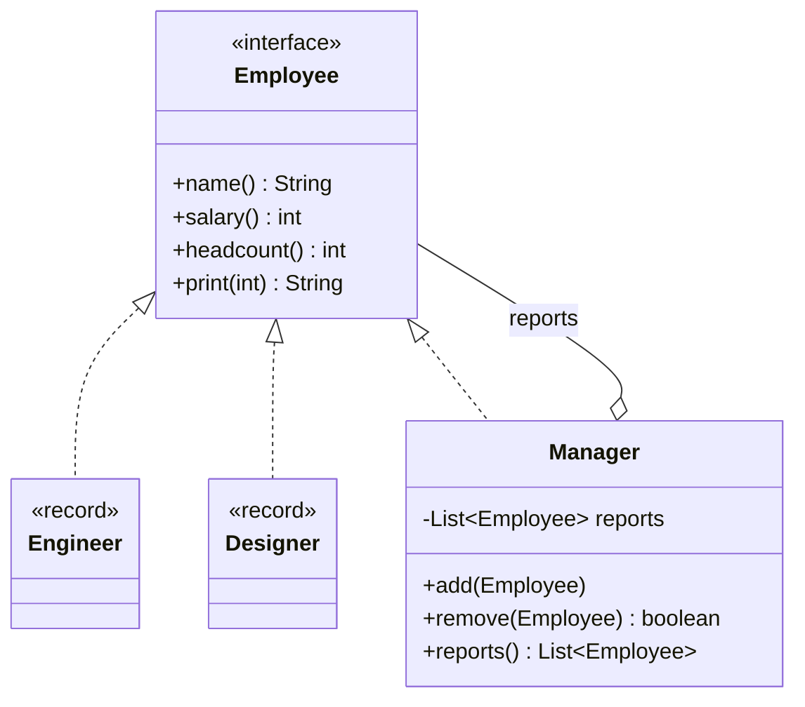
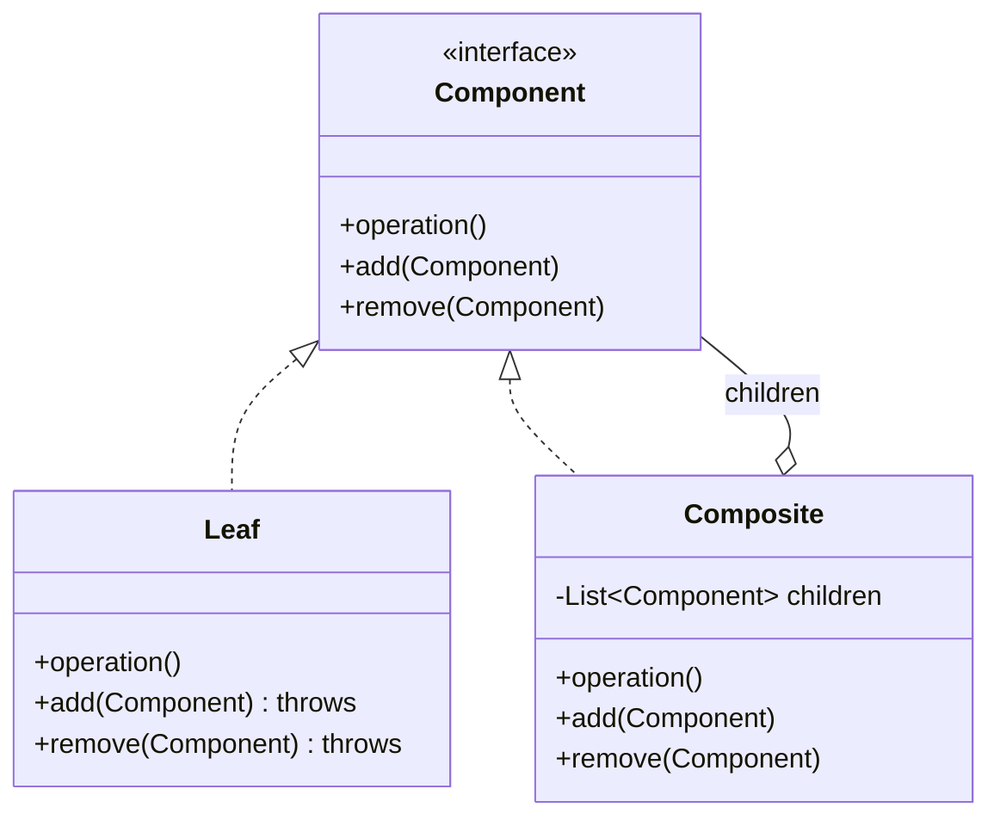
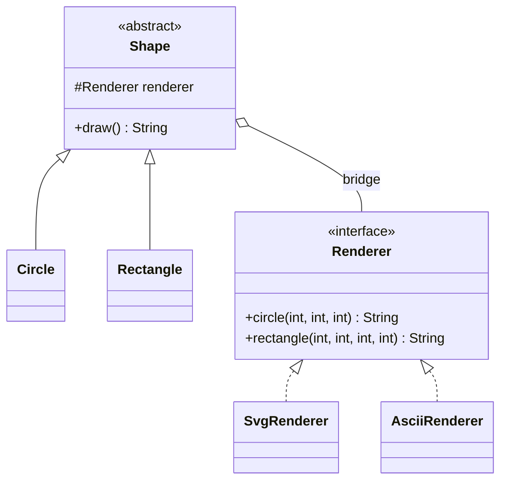
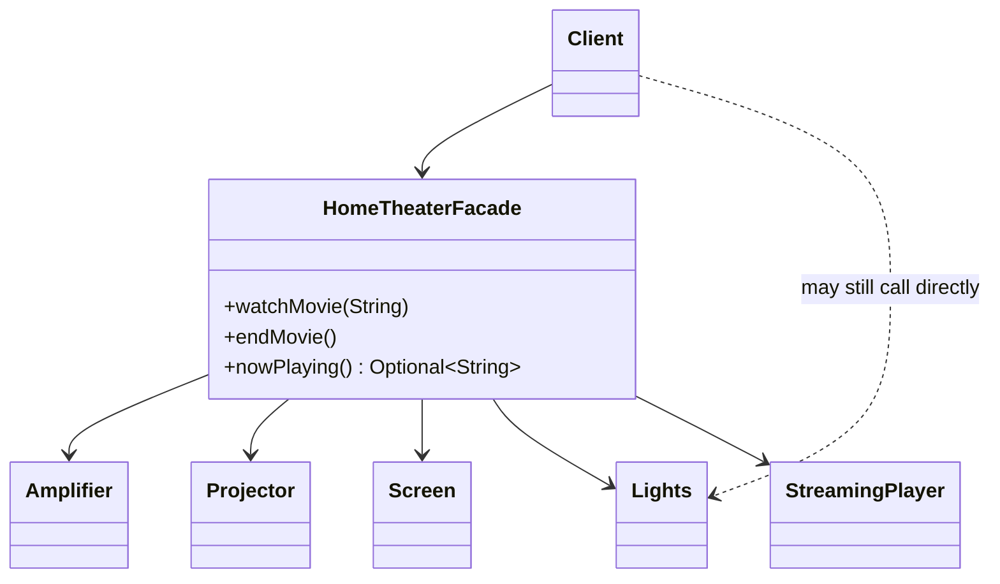
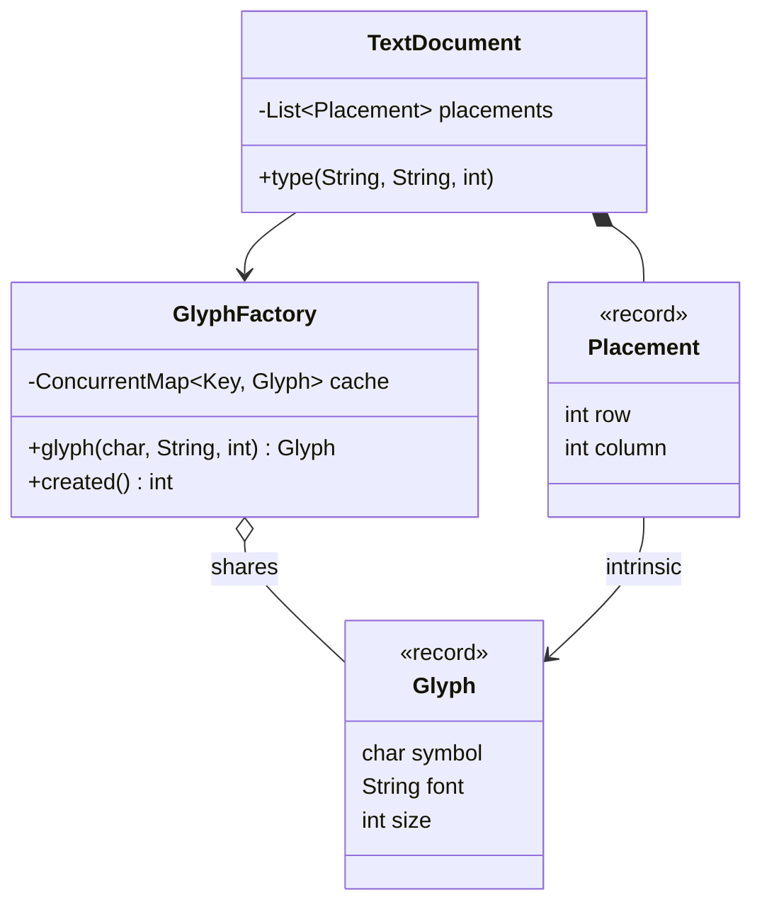

# Modül 05 — Yapısal Kalıplar II: Bileşim

> **6. Hafta** · Ön koşullar: m04 (Adapter, Decorator, Proxy), m03 (record'lar, statik fabrikalar), m01 (kalıtım yerine bileşim), m00 (sealed tipler, record desenleri, sanal iş parçacıkları) · Tahmini çalışma süresi: 5 saat
>
> Her örneği derlemeden çalıştırın: `java modules/m05-structural-composition/src/main/java/io/github/aliturgutbozkurt/patterns/m05/examples/<yol>/<Demo>.java` (JDK 27)

## Öğrenme çıktıları

Bu modülün sonunda şunları yapabilirsiniz:

1. Composite (Bileşik) kalıbını klasik GoF biçimiyle ve modern biçimiyle (`record` düğümleri olan `sealed` bir arayüz
   ve özyinelemeli, eksiksiz `switch` işlemleri) **uygulamak** ve her birinin neyi kolaylaştırdığını
   **karşılaştırmak**.
2. Şeffaflık–güvenlik ödünleşimini **açıklamak** ve ağaç işlemlerini **yazmak**: toplamlar, sayımlar, yol döndüren
   önce-derinlik arama, girintili çıktı.
3. Bridge (Köprü) kalıbını **uygulamak** ve N × M sınıf patlamasını N + M sınıfa **yeniden düzenlemek**; tek metotlu
   uygulayıcı (implementor) için lambda kullanmak.
4. Çok adımlı bir iş akışını — sonraki bir adım başarısız olunca önceki adımları geri almak dahil — alt sistemi
   gizlemeden tek bir çağrıya dönüştüren bir Facade (Cephe) **tasarlamak**.
5. İş parçacığı güvenli bir Flyweight (Sinek Siklet) fabrikası **yazmak**, içsel ve dışsal durumu **ayırmak** ve
   kazancı nesne sayarak **ölçmek**.
6. JDK'nin kendi flyweight'lerini ve `Integer`, `LocalDate` gibi değer tabanlı sınıfların kurallarını **açıklamak**.

## Motivasyon

m04, arayüzünü ya da davranışını değiştirmek için *tek* bir nesneyi sarmaladı. Bu modül *çok sayıda* nesnenin nasıl
bir araya getirildiğiyle ilgilidir: tek bir düğüm gibi kullanılan bütün bir ağaç (Composite), çoğalmak yerine
birbirinden bağımsız değişen iki hiyerarşi (Bridge), karmaşık alt sistemlere tek ve basit bir giriş noktası (Facade)
ve ortak durumlarını paylaşan binlerce küçük nesne (Flyweight).

## Composite

### Problem

Bir şirket iki soruyu sürekli sorar: "bu kişinin maliyeti ne?" ve "bu departmanın maliyeti ne?". Bir departman hem
kişileri *hem de* başka departmanları içerir. İstemci her seviyede "bu bir kişi mi, yoksa bir ekip mi?" diye bakmak
zorundaysa her rapor iç içe `instanceof` denetimlerine dönüşür — ve yeni bir düğüm türü geldiğinde bozulur.

### Amaç

> Parça–bütün hiyerarşilerini göstermek için nesneleri **ağaç yapıları** hâlinde birleştirmek ve istemcilerin **tek
> nesnelere ve bileşimlere aynı biçimde** davranmasını sağlamak.

### Yapı



### Klasik Java

Yapraklar kendi verileriyle yanıt verir; bileşik ise çocuklarına sorar ve kendi payını ekler. Bir çalışan eklerken
kimsenin sonunda kendisine bağlı hâle gelmediği denetlenir:

```java
// file: examples/composite/orgchart/Manager.java
    /** Adds a direct report; rejects anyone who would make this manager report to themselves. */
    public void add(Employee report) {
        Objects.requireNonNull(report, "report");
        if (report == this || report instanceof Manager manager && manager.manages(this)) {
            throw new IllegalArgumentException(
                    report.name() + " cannot report to " + name + ": that would create a cycle");
        }
        reports.add(report);
    }
    // ...
    @Override
    public int salary() {
        int total = ownSalary;
        for (Employee report : reports) {
            total += report.salary();
        }
        return total;
    }
```

İstemci tek bir kişiyi mi yoksa bütün bir departmanı mı tuttuğunu bilmez — umursamaz da:

```java
// file: examples/composite/OrgChartDemo.java
    // The client treats one person and a whole department the same way.
    private static void report(String label, Employee employee) {
        System.out.println(label + ": headcount " + employee.headcount() + ", salary cost " + employee.salary());
    }
```

```text
Grace (Manager) 9000
  Alan (Manager) 8000
    Ada (Engineer) 7000
    Linus (Engineer) 6500
  Dieter (Designer) 6000
company: headcount 5, salary cost 36500
engineering: headcount 3, salary cost 21500
Ada alone: headcount 1, salary cost 7000
after Linus leaves: headcount 4, salary cost 30000
rejected: Grace cannot report to Alan: that would create a cycle
```

**Şeffaflık mı, güvenlik mi?** `add` ve `remove` nerede durur? Bu örnek GoF'un **güvenli** (safe) biçimini kullanır:
yalnızca `Manager`'da vardır, bu yüzden `engineer.add(...)` derlenmez — ama elinde bir `Employee` tutan istemci
eklemeden önce tipe bakmak zorundadır. **Şeffaf** (transparent) biçim onları bileşen arayüzüne koyar; böylece her
düğüm aynı görünür, yapraklar ise çalışma zamanında `UnsupportedOperationException` fırlatır:



`java.awt.Container` güvenli biçimdedir (`add` yalnızca kaplarda vardır); şeffaf biçim derleme zamanı güvenliğini
tekdüzelik uğruna feda eder. İstemcilerin gerçekten düğüm tiplerini bilmeden ağaç kurması gerekmiyorsa güvenli
biçimi tercih edin.

### Modern Java 27

Düğüm türlerinin kümesi **kapalı** olduğunda, `record` düğümleri olan `sealed` bir arayüz ağacı sade ve değişmez bir
veri olarak tanımlar:

```java
// file: examples/composite/filesystem/FsNode.java
public sealed interface FsNode permits File, Directory {

    String name();
}
```

```java
// file: examples/composite/filesystem/Directory.java
public record Directory(String name, List<FsNode> children) implements FsNode {

    public Directory {
        Names.check(name);
        children = List.copyOf(children);
```

`List.copyOf` çocukları değişmez bir anlık görüntüye çevirir: listeyi kuran kişi ağacı sonradan değiştiremez, bu
yüzden ağaç serbestçe paylaşılabilir. İşlemler düğümlerin *dışında* yaşar; her biri record desenleriyle yazılmış
özyinelemeli bir `switch`'tir — eksiksiz olduğu için `default` yoktur ve `_` ihtiyacımız olmayan bileşenleri atlar:

```java
// file: examples/composite/filesystem/FsOps.java
    /** Total bytes in the tree. */
    public static long size(FsNode node) {
        return switch (node) {
            case File(var _, var bytes) -> bytes;
            case Directory(var _, var children) -> children.stream().mapToLong(FsOps::size).sum();
        };
    }
    // ...
    private static void collect(FsNode node, String parent, Predicate<File> test, List<String> found) {
        String path = parent + "/" + node.name();
        switch (node) {
            case File file when test.test(file) -> found.add(path);
            case File _ -> { }
            case Directory(var _, var children) -> children.forEach(child -> collect(child, path, test, found));
        }
    }
```

```text
project/ (5300 bytes)
  README.md (300 bytes)
  src/ (5000 bytes)
    main/ (4200 bytes)
      App.java (1200 bytes)
      Util.java (3000 bytes)
    test/ (800 bytes)
      AppTest.java (800 bytes)
  docs/ (0 bytes)
files: 4, total: 5300 bytes, depth: 4
java sources: [/src/main/App.java, /src/main/Util.java, /src/test/AppTest.java]
larger than 1000 bytes: [/src/main/App.java, /src/main/Util.java]
rejected: duplicate name in src: main
```

İki biçim birbirinin tersi olan değişiklikleri kolaylaştırır — tek tabloda *ifade problemi* (expression problem):

| Değişiklik | Klasik (her düğümde metot) | Sealed record'lar + `switch` |
|---|---|---|
| Yeni bir **düğüm tipi** eklemek | tek yeni sınıf, başka hiçbir şey değişmez | her `switch`, yeni durumu ele alana kadar derlenmez |
| Yeni bir **işlem** eklemek | arayüzde **ve** her düğüm sınıfında yeni bir metot | `FsOps`'ta tek yeni metot; düğümler değişmez |

Yeni düğüm türleri sürekli ortaya çıkıyorsa (eklentiler, arayüz bileşenleri) klasik biçimi; düğüm türleri sabit ama
sürekli yeni sorular soruluyorsa (raporlar, dışa aktarmalar, doğrulama) sealed record'ları seçin.

### İkinci örnek: aritmetik ifadeler

Bir ifade, yaprakları sayılar ve bileşikleri operatörler olan bir Composite'tir. Aynı ağaç hem bir değer hem de bir
metin verir; metin üretici parantezi yalnızca öncelik gerektirdiğinde ekler ve koşullu (guard) iç içe bir record
deseni negatif bir sabiti ele alır:

```java
// file: examples/composite/expression/Expressions.java
    public static long evaluate(Expr expr) {
        return switch (expr) {
            case Num(var value) -> value;
            case Add(var left, var right) -> Math.addExact(evaluate(left), evaluate(right));
            case Mul(var left, var right) -> Math.multiplyExact(evaluate(left), evaluate(right));
            case Neg(var operand) -> Math.negateExact(evaluate(operand));
        };
    }
    // ...
    public static String render(Expr expr) {
        return switch (expr) {
            case Num(var value) -> Long.toString(value);
            case Add(var left, var right) -> operand(left, expr) + " + " + operand(right, expr);
            case Mul(var left, var right) -> operand(left, expr) + " * " + operand(right, expr);
            case Neg(Num(var value)) when value >= 0 -> "-" + value;
            case Neg(var operand) -> "-(" + render(operand) + ")";
        };
    }
```

```text
(1 + 2) * 3 = 9
1 + 2 * 3 = 7
-(-4) = 4
-(2 * 3) + 10 = 4
1 + 2 + ... + 1000 (a tree 1000 levels deep) = 500500
```

`Math.addExact` ve benzerleri taşmada sessizce başa sarmak yerine `ArithmeticException` fırlatır. Ayrıştırma ve
değişkenler m08'deki Interpreter'a bırakılmıştır.

### Gerçek dünyada kullanımı

`java.awt.Component` / `java.awt.Container` (bir kap bir bileşen*dir* ve bileşenleri tutar), Swing'in `JComponent`'i,
`java.nio.file.Files.walk`'un gezdiği dizin ağaçları, XML/HTML DOM düğümleri ve `javac` içindeki soyut sözdizimi
ağacı.

### Tuzaklar ve ne zaman KULLANILMAMALI

- **Döngüler.** Değiştirilebilir bir ağaç yanlışlıkla kendisini içerebilir; özyineleme o zaman hiç bitmez. `add`
  sırasında denetleyin ya da döngü oluşturamayan değişmez record'lar kullanın.
- **Değiştirilebilir çocukları dışarı sızdırmak.** İç listeyi döndürmek, çağıranların ağacı arkanızdan
  değiştirmesine izin verir — `Collections.unmodifiableList` döndürün ya da `List.copyOf` saklayın.
- **Çok derin ağaçlar** (on binlerce seviye) saf özyinelemede yığını taşırabilir; güvenilmeyen girdi için açık bir
  yığın kullanın.
- Aslında düz olan bir yapıya hiyerarşi dayatmayın: bir öğe listesinin Composite'e ihtiyacı yoktur.

### İlgili kalıplar

**Iterator** (m07) bir Composite'i gezer; **Visitor** (m08) klasik bir Composite'e işlem ekler — desen eşlemeli
sealed tipler onun yerini alır; **Decorator** (m04) aynı özyinelemeli biçime sahiptir ama tam olarak bir çocuğu
vardır; **Builder** (m03) büyük ağaçları kurmak için kullanışlıdır.

## Bridge

### Problem

İki şekil (daire, dikdörtgen) iki biçimde (SVG, ASCII) çizilmelidir. Kalıtımla bu dört sınıf eder — `SvgCircle`,
`AsciiCircle`, `SvgRectangle`, `AsciiRectangle` — ve her yeni şekil ya da biçim sayıyı katlar: her biri
komşularının mantığını tekrarlayan N × M sınıf.

### Amaç

> **Bir soyutlamayı (abstraction) gerçekleştirmesinden ayırmak**; böylece ikisi birbirinden bağımsız değişebilir.

### Yapı



### Klasik Java

Soyutlama, uygulayıcının varyantlarından biri *olmak* yerine bir uygulayıcıya *sahiptir*:

```java
// file: examples/bridge/shapes/Shape.java
public abstract class Shape {

    protected final Renderer renderer;

    protected Shape(Renderer renderer) {
        this.renderer = Objects.requireNonNull(renderer, "renderer");
    }

    /** Draws this shape with whatever renderer it was given. */
    public abstract String draw();
```

İnceltilmiş (refined) bir soyutlama yalnızca uygulayıcının temel işlemlerini çağırır:

```java
// file: examples/bridge/shapes/Circle.java
    @Override
    public String draw() {
        return renderer.circle(x, y, radius);
    }
```

```text
Circle with SvgRenderer:
<circle cx="5" cy="5" r="2"/>
Circle with AsciiRenderer:
  *
 ***
*****
 ***
  *
Rectangle with SvgRenderer:
<rect x="0" y="0" width="6" height="3"/>
Rectangle with AsciiRenderer:
+----+
|    |
+----+
2 shapes x 2 renderers = 4 combinations from 2 + 2 classes
```

Testler yalnızca çağrıları kaydeden, sadece teste özgü üçüncü bir `RecordingRenderer` ekler — `Shape` değişmez.

### Modern Java 27

Uygulayıcının **tek bir metodu** varsa onu fonksiyonel arayüz yapın: o zaman her lambda bir uygulayıcıdır.
Soyutlama *ne zaman ve ne* gönderileceğine, kanal ise *nereye* gönderileceğine karar verir:

```java
// file: examples/bridge/alerts/MessageChannel.java
@FunctionalInterface
public interface MessageChannel {

    void send(String message);
}
```

```java
// file: examples/bridge/alerts/DigestAlerts.java
    public void flush() {
        if (pending.isEmpty()) {
            return;
        }
        String count = pending.size() == 1 ? "1 alert" : pending.size() + " alerts";
        channel.send(count + ": " + String.join("; ", pending));
        pending.clear();
    }
```

```java
// file: examples/bridge/AlertsDemo.java
        MessageChannel email = new EmailChannel("ops@example.com", System.out::println);
        MessageChannel sms = new SmsChannel("+90 555 000 00 00", System.out::println);
        MessageChannel chat = message -> System.out.println("chat #ops: " + message);   // no new class needed
```

Çıktının ilk satırları (son demo satırı, 160 karaktere kesilmiş ve `…` ile biten bir SMS gösterir):

```text
email to ops@example.com: [URGENT] payment service down
sms to +90 555 000 00 00: [URGENT] payment service down
digest: 3 pending, nothing sent yet
email to ops@example.com: 3 alerts: cpu 85%; disk 80%; certificate expires in 14 days
chat #ops: [URGENT] payment service back up
```

İki politika × üç kanal = beş küçük tipten altı davranış; sohbet kanalı ise tek bir lambda. Eşleştirme, nesnelerin
oluşturulduğu yerde yapılır — m03'teki bileşim kökünde.

### İkinci örnek: uzaktan kumandalar ve cihazlar

Klasik GoF örneği *iki* tarafın da büyümesine izin verir. Kumanda hiyerarşisi (`RemoteControl` → `AdvancedRemote`)
yalnızca `Device` temel işlemleriyle yazılmıştır; bu yüzden bir televizyonla, bir radyoyla ve sonradan eklenen her
cihazla çalışır:

```java
// file: examples/bridge/remote/RemoteControl.java
    /** Next channel, wrapping from the last one back to 1; ignored while the device is off. */
    public void channelUp() {
        if (device.isEnabled()) {
            device.setChannel(device.channel() % device.channelCount() + 1);
        }
    }
```

```java
// file: examples/bridge/remote/AdvancedRemote.java
    public void mute() {
        if (device.isEnabled() && volumeBeforeMute < 0) {
            volumeBeforeMute = device.volume();
            device.setVolume(0);
        }
    }
```

```text
volume up while off -> TV: off, channel 1 of 5, volume 30
basic remote        -> TV: on, channel 2 of 5, volume 40
advanced remote     -> Radio: on, station 2 of 3, volume 30
muted               -> Radio: on, station 2 of 3, volume 0
unmuted             -> Radio: on, station 2 of 3, volume 30
two stations up     -> Radio: on, station 1 of 3, volume 30
back to "jazz"      -> Radio: on, station 2 of 3, volume 30
advanced on the TV  -> TV: on, channel 2 of 5, volume 0
```

### Gerçek dünyada kullanımı

**JDBC** ders kitabı köprüsüdür: kodunuz `java.sql` arayüzleriyle (`Connection`, `Statement`) — soyutlamayla —
konuşur ve her üreticinin sürücüsü bir uygulayıcıdır. `java.util.logging.Handler` × `Formatter`
(`handler.setFormatter(...)`) günlük kayıtlarının *nereye* gittiğini ve *nasıl* göründüğünü birleştirir; Logback/Log4j
üzerindeki SLF4J de aynı şekilde çalışır.

### Tuzaklar ve ne zaman KULLANILMAMALI

- Yalnızca **bir** gerçekleştirme varsa ve ikincisi ufukta görünmüyorsa, köprü yalnızca fazladan dolaylılıktır.
- Sızdıran bir uygulayıcı arayüzü (yalnızca bir uygulayıcının destekleyebildiği temel işlemler) diğerlerini taklit
  etmeye zorlar.
- Bridge **baştan** tasarlanır; var olan, uyumsuz iki arayüzü birbirine uyduruyorsanız aradığınız şey Adapter'dır.

### İlgili kalıplar

**Adapter** (m04) ilgisiz sınıfları tasarlandıktan *sonra* birlikte çalıştırır; Bridge hiyerarşileri *önceden*
ayırır. **Strategy** (m06) kodda aynı görünür ama bir *algoritmayı* değiştirmekle ilgilidir; Bridge iki hiyerarşinin
*yapısıyla* ilgilidir. **Abstract Factory** (m02) birbirine uyan soyutlama–uygulayıcı çiftleri oluşturabilir.

## Facade

### Problem

Evde film izlemek; ışıkları kısmak, perdeyi indirmek, projektörü ve amplifikatörü açmak, girişi seçmek, çevresel sesi
ve ses düzeyini ayarlamak, sonra oynatıcıyı başlatmak demektir — doğru sırada on çağrı ve sonunda tersi. Bu sırayı
tekrarlayan her istemci onun hatalarını da tekrarlar.

### Amaç

> Bir alt sistemdeki arayüzler kümesine **birleşik, daha üst düzey bir arayüz** sağlamak; böylece alt sistemin
> kullanımı kolaylaşır.

### Yapı



### Klasik Java

Cephe alt sistemleri tutar (dışarıdan verilir, böylece testler sahte nesneler kullanabilir) ve sırayı bilir:

```java
// file: examples/facade/hometheater/HomeTheaterFacade.java
    /** Gets the room ready and starts the film. */
    public void watchMovie(String title) {
        Objects.requireNonNull(title, "title");
        if (playing != null) {
            throw new IllegalStateException("already playing: " + playing);
        }
        lights.dim(10);
        screen.down();
        projector.on();
        projector.wideScreenMode();
        amplifier.on();
        amplifier.setInput("streaming");
        amplifier.setSurroundSound();
        amplifier.setVolume(5);
        player.on();
        player.play(title);
        playing = title;
    }
```

```text
> watchMovie("Dune")
  lights: dim to 10%
  screen: down
  projector: on
  projector: widescreen mode
  amplifier: on
  amplifier: input streaming
  amplifier: surround sound
  amplifier: volume 5
  player: on
  player: play "Dune"
> lights.dim(30) directly
  lights: dim to 30%
> endMovie()
  player: stop
  player: off
  amplifier: off
  projector: off
  screen: up
  lights: on
> endMovie() again
  (nothing to do)
```

İkinci adıma dikkat edin: alt sistem hâlâ erişilebilirdir. Bir cephe **basitleştirir; yasaklamaz**.

### Modern Java 27

Gerçek bir cephe, bir iş akışının zor kısmını da üstlenir: **telafi** (compensation). Sipariş vermek stok ayırır,
kartı ücretlendirir ve kargoyu ayarlar; sonraki bir adım başarısız olursa öncekiler ters sırayla geri alınmalıdır.
Beklenen iş hataları fırlatılmaz, sealed bir tipin değerleri olarak döndürülür:

```java
// file: examples/facade/checkout/CheckoutResult.java
public sealed interface CheckoutResult permits Placed, Rejected {}
```

```java
// file: examples/facade/checkout/CheckoutFacade.java
    public CheckoutResult placeOrder(Cart cart, Card card, Address address) {
        Optional<String> reservation = inventory.reserve(cart.quantities());
        if (reservation.isEmpty()) {
            return new Rejected(Reason.OUT_OF_STOCK, "not enough stock");
        }
        String reservationId = reservation.orElseThrow();

        long total = cart.totalCents();
        Optional<String> payment = payments.charge(card, total);
        if (payment.isEmpty()) {
            inventory.release(reservationId);                        // undo step 1
            return new Rejected(Reason.PAYMENT_DECLINED, "card ending " + card.lastFour() + " declined");
        }
        String paymentId = payment.orElseThrow();

        Optional<String> tracking = shipping.ship(address, reservationId);
        if (tracking.isEmpty()) {
            payments.refund(paymentId);                              // undo step 2
            inventory.release(reservationId);                        // undo step 1
            return new Rejected(Reason.SHIPPING_UNAVAILABLE, "no shipping to " + address.country());
        }
        return new Placed(tracking.orElseThrow(), total);
    }
```

Çağıran iki sonucu da ele almak zorundadır — record desenli, `default`'suz eksiksiz bir `switch`:

```java
// file: examples/facade/CheckoutDemo.java
    private static void print(int order, CheckoutResult result) {
        String outcome = switch (result) {
            case Placed(var tracking, var total) -> "placed, tracking " + tracking + ", charged " + euros(total);
            case Rejected(var reason, var detail) -> "rejected " + reason + " (" + detail + ")";
        };
        System.out.println("order " + order + ": " + outcome);
    }
```

```text
order 1: placed, tracking TRK-1001, charged 59.97
order 2: rejected OUT_OF_STOCK (not enough stock)
order 3: rejected PAYMENT_DECLINED (card ending 0002 declined)
order 4: rejected SHIPPING_UNAVAILABLE (no shipping to AQ)
stock left: mug 7, tshirt 2
charges 2, refunds 1, net charged 59.97
```

4. sipariş ücretlendirildi, sonra iade edildi ve stoğu serbest bırakıldı: son durumda ondan hiçbir iz kalmadı.
Beklenmeyen hatalar (bir yazılım hatası, kopan bir bağlantı) yine istisna olarak kalır.

### Gerçek dünyada kullanımı

`java.net.http.HttpClient`, bağlantı havuzunun, HTTP/2 anlaşmasının, TLS'in ve yönlendirmelerin önünde duran tek bir
nesnedir. `DriverManager.getConnection(url)` sürücü aramayı ve yüklemeyi gizler. Web uygulamalarındaki servis
katmanı sınıfları (`OrderService.placeOrder`) depolar ve ağ geçitleri üzerinde birer cephedir.

### Tuzaklar ve ne zaman KULLANILMAMALI

- **Tanrı nesnesi (god object).** Her kullanım durumu için bir metot kazanan cephe bütün uygulamaya dönüşür; onu
  kullanım durumlarına göre bölün (`CheckoutFacade`, `ReturnsFacade`).
- Alt sisteme doğrudan erişimi "temizlik için" **yasaklamayın** — ileri düzey istemcilerin buna ihtiyacı vardır.
- Tek bir çağrıyı iletmekten ibaret tek metotlu bir cephe hiçbir şey katmaz.

### İlgili kalıplar

**Adapter** (m04) bir arayüzü istemcinin beklediği arayüze çevirir; cephe ise *yeni ve daha basit* bir arayüz
*tanımlar*. **Mediator** (m07) da birkaç nesneyi koordine eder ama nesneler onun *üzerinden* iki yönlü konuşur; alt
sistemler bir cephenin varlığından habersizdir. Cepheler pratikte çoğu zaman **Singleton**'dır — bileşim kökünde (m03)
bağlanan tek bir örneği tercih edin.

## Flyweight

### Problem

Bir metin düzenleyici ekranda 100 000 karakter gösterir. Her biri kendi yazı tipi verisine sahip bir nesneyse,
düzenleyici aslında birkaç düzine farklı glifin 100 000 kopyasını tutar. 100 000 ağaçlı ve üç tür ağacı olan bir oyun
ormanının da sorunu aynıdır.

### Amaç

> Çok sayıda küçük nesneyi verimli biçimde desteklemek için **paylaşımı** kullanmak: ortak olan durumu (**içsel**,
> intrinsic) paylaşılan değişmez nesnelerde tutmak, farklı olan durumu (**dışsal**, extrinsic) dışarıdan vermek.

### Yapı



### Klasik Java

Flyweight yalnızca içsel durumu tutar ve değişmezdir — bir record. İstemci dışsal durumu (satır, sütun), paylaşılan
glife bir *referansla* yan yana saklar:

```java
// file: examples/flyweight/glyphs/TextDocument.java
    public record Placement(Glyph glyph, int row, int column) {}
    // ...
    public void type(String text, String font, int size) {
        for (char symbol : text.toCharArray()) {
            if (symbol == '\n') {
                row++;
                column = 0;
            } else {
                placements.add(new Placement(glyphs.glyph(symbol, font, size), row, column++));
            }
        }
    }
```

```text
one line: 43 characters on screen, 27 glyph objects
same line again: 86 characters on screen, 27 glyph objects
heading "Hello" in Sans 18: 91 characters on screen, 31 glyph objects
'e' Serif 12 twice -> same instance: true
'e' Serif 12 vs Sans 18 -> same instance: false
```

### Modern Java 27

Paylaşım fabrikada gerçekleşir, bu yüzden fabrika **iş parçacığı güvenli** olmalıdır.
`ConcurrentHashMap.computeIfAbsent`, oluşturan fonksiyonu anahtar başına en fazla bir kez ve atomik olarak çalıştırır
— "önce kontrol et, sonra koy" yarışı yoktur. Önbellek bir örnek alanıdır: paylaşıma ihtiyaç duyan, bir fabrikaya
sahip olur (değiştirilebilir statik durum yoktur):

```java
// file: examples/flyweight/glyphs/GlyphFactory.java
    private record Key(char symbol, String font, int size) {}

    private final ConcurrentMap<Key, Glyph> cache = new ConcurrentHashMap<>();
    private final AtomicInteger created = new AtomicInteger();

    public Glyph glyph(char symbol, String font, int size) {
        return cache.computeIfAbsent(new Key(symbol, font, size), key -> {
            var glyph = new Glyph(key.symbol(), key.font(), key.size());   // runs at most once per key
            created.incrementAndGet();
            return glyph;
        });
    }
```

Test aynı glifi 1 000 sanal iş parçacığından ister ve bir kimlik kümesiyle (identity set) tam olarak tek bir nesne
olduğunu denetler:

```java
// file: examples/flyweight/GlyphTest.java
        try (var executor = Executors.newVirtualThreadPerTaskExecutor()) {
            for (int i = 0; i < 1000; i++) {
                results.add(executor.submit(() -> factory.glyph('x', "Serif", 12)));
            }
        }
```

**Etkiyi ölçmek.** Orman, ağaç tiplerini takılabilir bir kaynaktan alır; böylece tek sınıf iki sürümü de gösterir:
fabrikaya verilen metot referansı paylaşır, kurucu referansı paylaşmaz:

```java
// file: examples/flyweight/ForestDemo.java
        var types = new TreeTypeFactory();
        var shared = new Forest(types::typeOf);
        shared.plantGrid(400, 250);
        var naive = new Forest(TreeType::new);
        naive.plantGrid(400, 250);
```

```text
shared forest: 100000 trees, 3 distinct TreeType instances
naive forest:  100000 trees, 100000 distinct TreeType instances
region x 0..3, y 0..1:
  (0,0) oak
  (1,0) pine
  (2,0) birch
  (3,0) oak
  (0,1) birch
  (1,1) oak
  (2,1) pine
  (3,1) birch
```

Testler ve demolar bayt değil, **nesne** sayar — bayt sayıları JVM'e bağlıdır. Sayılar hakkında fikir edinmek için
demoyu `shared` ya da `naive` argümanıyla çalıştırın: yalnızca o ormanı kurar ve Enter'ı bekler, böylece
`jcmd <pid> GC.class_histogram` çalıştırabilirsiniz. Tek bir elle ölçüm, **JDK 27'de sıkıştırılmış nesne başlıkları
(JEP 534) açıkken ölçülmüştür** (varsayılan):

| Sınıf | shared: nesne | shared: bayt | naive: nesne | naive: bayt |
|---|---|---|---|---|
| `Tree` | 100 000 | 2 400 000 | 100 000 | 2 400 000 |
| `TreeType` | 3 | 72 | 100 000 | 2 400 000 |
| bütün yığın (histogram toplamı) | 181 226 | 6 292 192 | 280 782 | 8 671 816 |

**JEP 534**, JDK 27'de sıkıştırılmış nesne başlıklarını varsayılan yapar: her nesnenin başlığı 12 bayttan 8 bayta
iner, yani paylaşılsın ya da paylaşılmasın *tüm* nesneler küçülür. Ama kopyaları ortadan kaldırmaz: 100 000 özdeş
`TreeType` hâlâ 100 000 nesnedir. (Burada üç `String` alanı paylaşılan sabitlerdir; ağaç başına dizgeler ya da sprite
verisi olsaydı naif sürüm çok daha büyük olurdu.)

### İkinci örnek: JDK'nin kendi flyweight'leri

İlk Java programınızdan beri flyweight kullanıyorsunuz. `Integer.valueOf` −128..127 için önbellekteki nesneleri
döndürür (JLS §5.1.7 garanti eder), `Boolean.valueOf` yalnızca `TRUE` ya da `FALSE` döndürür, `Character.valueOf`
`\u0000`..`\u007f` aralığını önbelleğe alır ve `Currency.getInstance` bir para birimi için asla iki nesne oluşturmaz:

```java
// file: examples/flyweight/jdk/JdkFlyweights.java
    public static boolean boxedIntegersIdentical(int value) {
        return Integer.valueOf(value) == Integer.valueOf(value);
    }
    // ...
    public static boolean currencyShared(String code, Locale locale) {
        return Currency.getInstance(code) == Currency.getInstance(locale);
    }
```

```text
Integer.valueOf(127) == Integer.valueOf(127): true (guaranteed: -128..127 are cached)
Integer.valueOf(-128) == Integer.valueOf(-128): true (guaranteed: -128..127 are cached)
Integer.valueOf(128) == Integer.valueOf(128): false (not guaranteed either way)
Integer.valueOf(128).equals(Integer.valueOf(128)): true (always right)
Boolean.valueOf(true) == Boolean.TRUE: true (guaranteed)
Character.valueOf('A') == Character.valueOf('A'): true (guaranteed: \u0000..\u007f are cached)
Currency.getInstance("EUR") == Currency.getInstance(Locale.GERMANY): true (one instance per currency)
LocalDate.of(2026, 9, 29) == LocalDate.of(2026, 9, 29): false (not guaranteed: value-based class, never use ==)
LocalDate.of(2026, 9, 29).equals(LocalDate.of(2026, 9, 29)): true (always right)
```

`128` satırı varsayılan ayarlarla `false` yazdı, ama üst sınır ayarlanabilir (`-XX:AutoBoxCacheMax`), bu yüzden hiçbir
test onu doğrulamaz. Kutulanmış değerlerde `==` kullanmanın hata olmasının nedeni tam da budur: testlerinizde küçük
sayılarla çalışır, üretimde büyük sayılarla başarısız olur — ve **hiçbir derleyici uyarısı (lint) bunu yakalamaz**.

`Integer`, `LocalDate`, `Optional` ve benzerleri **değer tabanlı sınıflardır** (value-based classes): değişmezdirler,
eşit nesneler birbirinin yerine geçebilir ve *kimlikleri* bir anlam taşımaz. Üç kural çıkar: `==` ile değil, `equals`
ile karşılaştırın; aynı nesneyi alacağınıza (ya da almayacağınıza) asla güvenmeyin; üzerlerinde asla `synchronized`
kullanmayın. Sonuncusu denetlenir — javac'ın `identity` uyarısı, bu dersin `-Xlint:all -Werror` ayarıyla onu derleme
hatasına çevirir (örneklerin parçası olmayan, geçici bir dosyanın derleyici çıktısı):

```text
Booking.java:7: warning: [identity] attempt to synchronize on an instance of a value-based class
        synchronized (day) {
        ^
error: warnings found and -Werror specified
```

Bu tür nesneleri tasarım gereği kimliksiz yapacak olan Project Valhalla değer sınıfları JDK 27'nin **parçası
değildir**.

### Gerçek dünyada kullanımı

`Integer.valueOf`, `Long.valueOf`, `Boolean.valueOf`, `Character.valueOf`; dizge sabitleri ve `String.intern()` (her
farklı sabit için tek nesne); `Currency.getInstance`; enum sabitleri ve `EnumSet`; metin çizicilerde ve oyun
motorlarında glif ve doku önbellekleri.

### Tuzaklar ve ne zaman KULLANILMAMALI

- **Değiştirilebilir flyweight'ler** felakettir: paylaşılan bir glifi değiştirmek onu kullanan her karakteri
  değiştirir. Onları record yapın.
- İş parçacığı güvenli olmayan bir fabrika (`HashMap` + "önce kontrol et, sonra koy") yük altında kopyalar
  oluşturabilir ya da haritayı bozabilir.
- Kullanıcı girdisiyle anahtarlanan sınırsız bir önbellek bir bellek sızıntısıdır; onu sınırlayın ya da yalnızca
  küçük, kapalı bir küme üzerinden anahtarlayın.
- Bir avuç nesne için fabrika eklemeyin — önce ölçün; fazladan dolaylılık okunabilirliğe mal olur.

### İlgili kalıplar

**Factory Method / statik fabrikalar** (m02) flyweight dağıtır (`Integer.valueOf`). **Composite** yaprakları çoğu
zaman flyweight'tir (bir belge ağacının birçok yerindeki aynı glif). **Singleton** (m02), tam olarak tek anahtarlı bir
flyweight'tir. **Object Pool** (m03) da nesneleri yeniden kullanır ama ödünç alınıp geri verilen değiştirilebilir
nesneleri; flyweight'ler değişmezdir ve aynı anda paylaşılır.

## Yapısal bir bileşim kalıbı seçmek

| Durum | Kullanın |
|---|---|
| Parça–bütün ağacı; istemciler tek düğüme ve alt ağaca aynı davranır; düğüm türleri artıyor | Composite (klasik) |
| Parça–bütün ağacı; düğüm türleri sabit, yeni işlemler geliyor | Composite (sealed record'lar + `switch`) |
| İki değişim boyutu alt sınıfları katlayacak (N × M) | Bridge |
| Uygulayıcı tarafın tek bir metodu var | Fonksiyonel arayüzlü Bridge (lambda) |
| İstemciler çok adımlı bir alt sistem akışını (ve geri alınmasını) tekrarlıyor | Facade |
| O akışın beklenen iş hataları | Sealed sonuç döndüren Facade |
| Paylaşılan, değişmez durumu olan çok sayıda küçük nesne | Flyweight (+ iş parçacığı güvenli fabrika) |
| Kutulanmış sayıları, tarihleri, `Optional`'ı karşılaştırmak | `equals` — asla `==` değil |

## Özet

| Kalıp | Ne zaman kullanılır | Ne zaman kaçınılır | Java 27 kısayolu |
|---|---|---|---|
| Composite | Parça–bütün hiyerarşileri, tekdüze davranış | Yapı düzse | `sealed` + `record` düğümler, özyinelemeli eksiksiz `switch` |
| Bridge | Birbirinden bağımsız iki değişim boyutu | Yalnızca bir gerçekleştirme varsa | Fonksiyonel arayüz uygulayıcı, lambda'lar |
| Facade | Bir alt sistemi doğru kullanmak zorsa | Yalnızca tek bir çağrıyı iletecekse | Beklenen hatalar için sealed sonuç tipi |
| Flyweight | Çok sayıda nesne ağır, değişmez durum paylaşıyorsa | Az nesne; değiştirilebilir durum | Record'lar + `ConcurrentHashMap.computeIfAbsent` |

## Sınav

1. Organizasyon şemasında istemci, bir `Engineer` mı yoksa bir `Manager` mı tuttuğunu bilmeden neden `salary()`
   çağırabilir?
2. "Güvenli" ve "şeffaf" Composite'te `add`/`remove` nerede durur ve her biri neden vazgeçer?
3. Yeni bir düğüm tipi eklemek ile yeni bir işlem eklemek: hangisi klasik Composite'le, hangisi sealed record'lar ve
   `switch` ile kolaydır? İkinci durumda derleyici neden yardımcı olur?
4. `Directory` kompakt kurucusundaki `List.copyOf` neye karşı korur?
5. Üç şekil ve dört çizici: yalnızca kalıtımla kaç sınıf, Bridge ile kaç sınıf gerekir?
6. Kodları aynı görünebildiğine göre Bridge, Adapter ve Strategy'yi birbirinden ne ayırır?
7. Kargo başarısız olunca `CheckoutFacade` neden hem ayırmayı serbest bırakır *hem de* ödemeyi iade eder — ve bu
   mantık neden istemcide değil de cephededir?
8. Metin düzenleyicide içsel ve dışsal durum nedir? Bir flyweight neden değişmez olmalıdır?
9. `Integer.valueOf(a) == Integer.valueOf(b)`, `a = b = 100` ile yapılan bir testi geçtiği hâlde neden bir hatadır?
10. JEP 534 her nesneyi küçültür. Bu, Flyweight kalıbını gereksiz kılar mı?

<details><summary>Cevaplar</summary>

1. İkisi de bileşen arayüzü `Employee`'yi gerçekleştirir; bileşik `salary()`'yi çocuklarına sorup kendi payını
   ekleyerek gerçekleştirir, böylece özyineleme tek bir metodun arkasında gizlenir.
2. Güvenli: yalnızca bileşikte (`Manager`) — yanlış kullanım derleme hatasıdır, ama istemciler ekleme yapmak için
   düğüm tipini bilmek zorundadır. Şeffaf: bileşende — tüm düğümler aynı görünür, ama yapraklar çalışma zamanında
   istisna fırlatmak zorundadır.
3. Klasik: yeni bir düğüm tipi tek yeni sınıftır; yeni bir işlem her sınıfa dokunur. Sealed + `switch`: yeni bir işlem
   tek yeni metottur; yeni bir düğüm tipi, yeni durumu ele alana kadar her eksiksiz `switch`'in derlenmesini
   engeller — derleyici değiştirilecek her yeri listeler.
4. Çağıranın listeyi kurulumdan sonra değiştirmesine (ve `null` elemanlara) karşı: ağaç değişmez kalır ve güvenle
   paylaşılabilir.
5. Kalıtımla 3 × 4 = 12 somut sınıf; Bridge ile 3 + 4 = 7.
6. Adapter var olan, uyumsuz arayüzleri sonradan birlikte çalıştırır; Bridge iki hiyerarşinin değişebilmesi için
   baştan tasarlanır; Strategy bir algoritmayı (davranışı) değiştirir, Bridge iki hiyerarşiyi yapılandırır.
7. Çünkü stok ve para önceki adımlarda alınmıştı; bırakılsalar stok kaybolur ve fazla ücret alınır. Geri almanın
   sırası iş akışının bir parçasıdır — onu cepheye koymak, hiçbir istemcinin onu unutamayacağı ya da sırasını
   bozamayacağı anlamına gelir.
8. İçsel: karakter, yazı tipi, boyut (`Glyph` içinde, paylaşılan). Dışsal: satır ve sütun (`Placement` içinde).
   Paylaşılan bir nesnedeki değişiklik kullanıldığı her yerde görünürdü.
9. `==` kimliği karşılaştırır; yalnızca −128..127'nin önbellekte olması garantidir, bu yüzden aynı kod daha büyük
   değerlerde `false` döndürür (ve önbellek boyutu ayarlanabilir). `equals` kullanın.
10. Hayır. Sıkıştırılmış başlıklar nesne başına birkaç bayt kazandırır, ama 100 000 kopya nesne kendi alanlarıyla hâlâ
    100 000 nesnedir; paylaşım ise kopyaların kendisini ortadan kaldırır.

</details>

## Ödevler

- [01 — Restoran menüsü Composite](../assignments/01-menu-composite.tr.md) ★★☆
- [02 — Flyweight ile harita kareleri](../assignments/02-flyweight-tiles.tr.md) ★★☆

## İleri okuma

- Gamma, Helm, Johnson, Vlissides, *Design Patterns* (1994) — Composite, Bridge, Facade, Flyweight.
- Joshua Bloch, *Effective Java*, 3. baskı (2018), madde 1 (statik fabrikalar, önbellek) ve madde 17 (değiştirilebilirliği en aza indirin).
- JEP 409 — [Sealed Classes](https://openjdk.org/jeps/409) · JEP 440 — [Record Patterns](https://openjdk.org/jeps/440) · JEP 441 — [Pattern Matching for switch](https://openjdk.org/jeps/441) · JEP 534 — [Compact Object Headers by Default](https://openjdk.org/jeps/534)
- Java SE API: [Value-based Classes](https://docs.oracle.com/en/java/javase/25/docs/api/java.base/java/lang/doc-files/ValueBased.html)
- Philip Wadler, "The Expression Problem" (1998) — sealed tipler ile çok biçimlilik arasındaki ödünleşimin arkasındaki kavram.
- Terimlerin Türkçesi: [docs/glossary.md](../../../docs/glossary.md)
