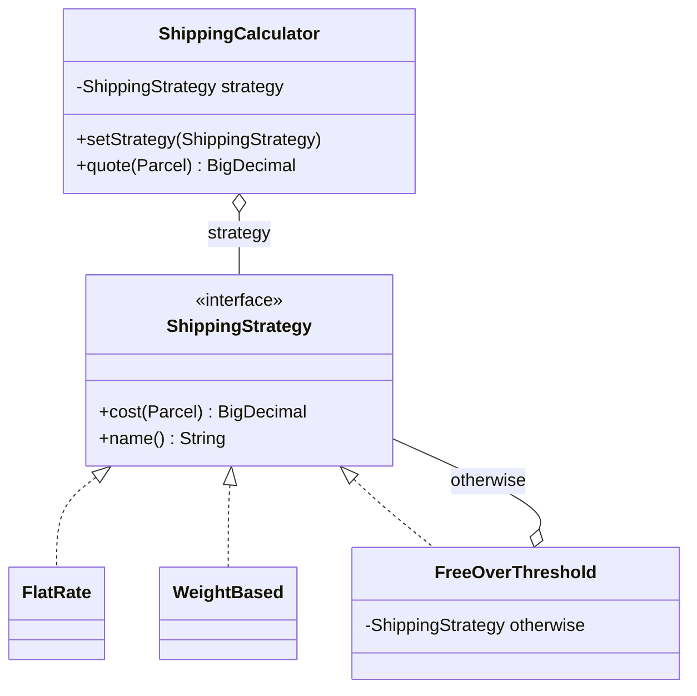
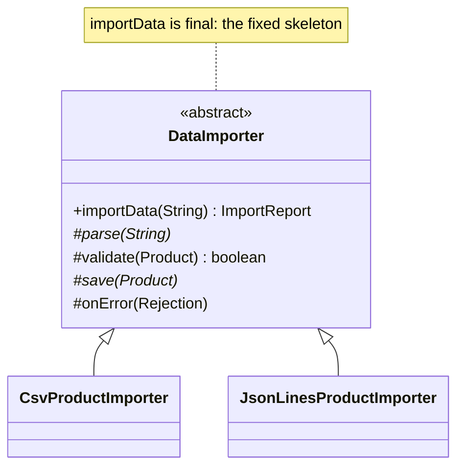
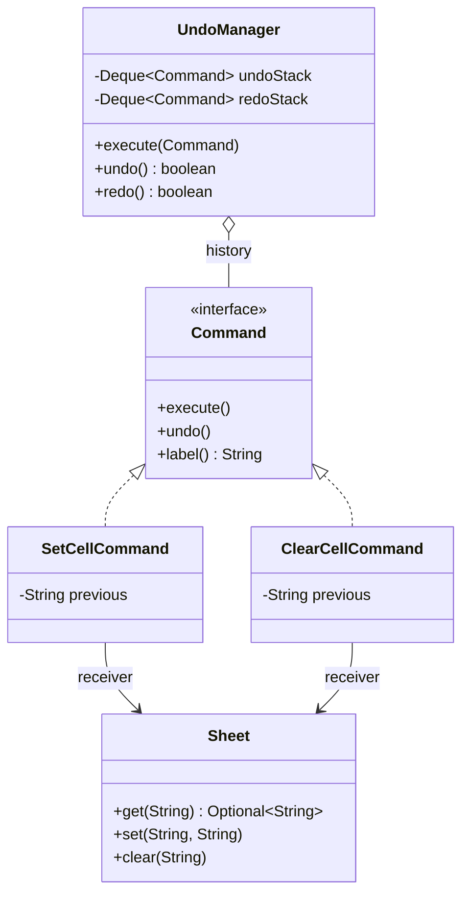
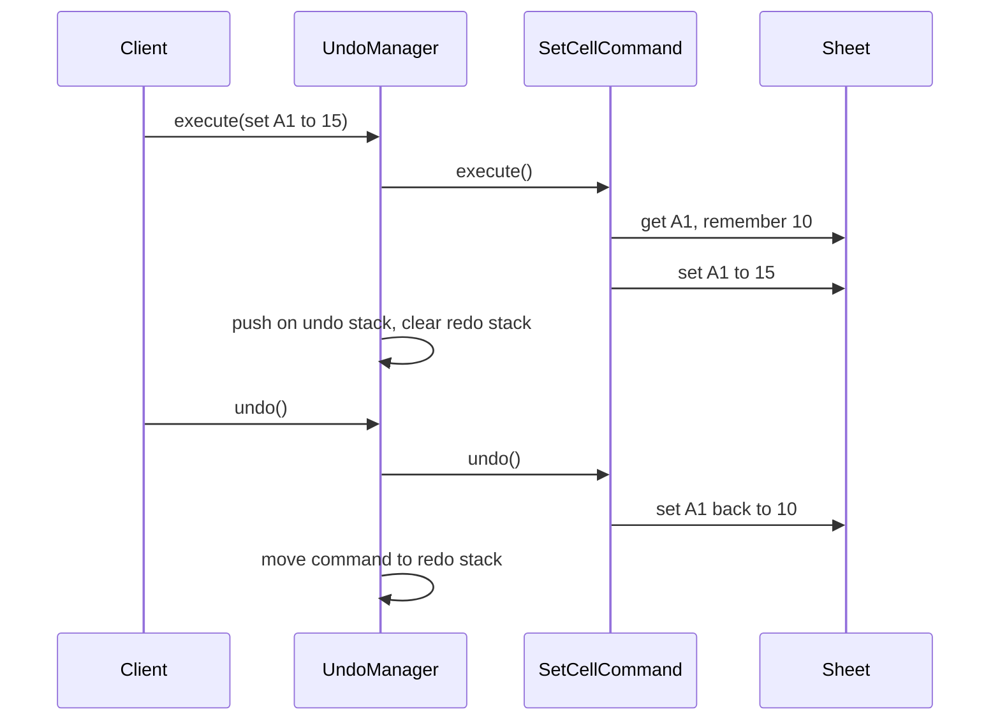
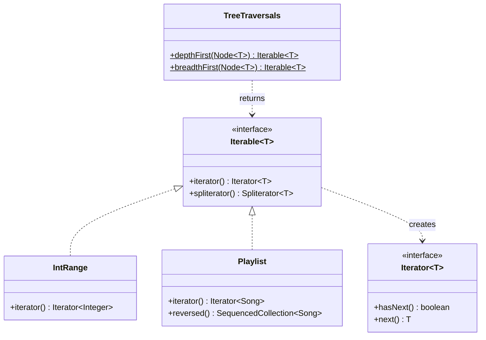

# Module 06 — Behavioral Patterns I: Algorithms

> **Week 8** · Prerequisites: m05 (Composite), m01 (OCP, composition over inheritance, DIP), m00 (lambdas, streams, records, sealed types) · Estimated study time: 6 h
>
> Run every example without a build: `java modules/m06-behavioral-algorithms/src/main/java/io/github/aliturgutbozkurt/patterns/m06/examples/<path>/<Demo>.java` (JDK 27)

## Learning outcomes

By the end of this module you can:

1. **Implement** Strategy as a class hierarchy, as lambdas and as an enum, and **explain** why `Comparator` is the
   JDK's best-known Strategy.
2. **Implement** Template Method with a `final` skeleton and hooks, **refactor** it into a higher-order function and
   **compare** the two.
3. **Implement** Command with `execute`/`undo`, undo/redo stacks, macro commands and a job queue, and **model**
   commands as data with sealed records and an exhaustive `switch`.
4. **Write** a custom `Iterator`/`Iterable` and a `Spliterator` with the right characteristics, and **use** sequenced
   collections.
5. **Use** the built-in stream gatherers and **write** a custom sequential `Gatherer`.
6. **Decide** when a pattern should become a lambda and when it should stay a class.

## Motivation

m02–m05 were about objects: how to create them and how to put them together. This module is about *algorithms*. A
checkout that computes shipping with a growing `if`/`else` chain is the typical starting point:

```java
// snippet — the code this module refactors away
BigDecimal shipping(String method, Parcel parcel) {
    if (method.equals("flat")) return new BigDecimal("4.99");
    else if (method.equals("per-kg")) return ...;           // every new method edits this function
    else if (method.equals("free-over-50")) return ...;
    throw new IllegalArgumentException(method);
}
```

Every new algorithm edits this function, and nothing can be tested alone. The four patterns in this module each pull
one kind of variation out of such code. **Strategy** lets you swap a whole algorithm. **Template Method** fixes the
skeleton of an algorithm and lets you vary its steps. **Command** turns a request into an object that can be queued,
logged and undone. **Iterator** lets you walk a collection without knowing how it is stored. In modern Java several
of them shrink to a functional interface and a lambda, so for each one we ask: when is the lambda enough?

## Strategy

### Problem

A web shop offers flat-rate shipping, a price per kilogram, and free shipping over a threshold. Next month marketing
wants "the cheapest of all". The checkout should not change every time a pricing rule is added, and each rule should
be testable on its own.

### Intent

> Define a family of algorithms, put each one behind the same interface, and make them **interchangeable**, so the
> algorithm can vary independently of the code that uses it.

### Structure



The **context** (`ShippingCalculator`) holds a strategy and delegates to it. Each **concrete strategy** is one
algorithm. The client chooses the strategy.

### Classic Java

The strategy interface:

```java
// file: examples/strategy/shipping/classic/ShippingStrategy.java
public interface ShippingStrategy {

    /** The shipping cost for {@code parcel}, with two decimal places. */
    BigDecimal cost(Parcel parcel);

    /** A short name for printing, e.g. {@code "flat"}. */
    String name();
}
```

One class per algorithm. `FreeOverThreshold` even delegates to another strategy when the order is too small:

```java
// file: examples/strategy/shipping/classic/WeightBased.java
    @Override
    public BigDecimal cost(Parcel parcel) {
        BigDecimal weight = BigDecimal.valueOf(parcel.weightKg());
        return baseFee.add(perKg.multiply(weight)).setScale(2, RoundingMode.HALF_UP);
    }
```

```java
// file: examples/strategy/shipping/classic/FreeOverThreshold.java
    @Override
    public BigDecimal cost(Parcel parcel) {
        return parcel.orderTotal().compareTo(threshold) >= 0 ? FREE : otherwise.cost(parcel);
    }
```

The context knows only the interface, and the strategy can be switched at run time:

```java
// file: examples/strategy/shipping/classic/ShippingCalculator.java
    public void setStrategy(ShippingStrategy strategy) {
        this.strategy = Objects.requireNonNull(strategy, "strategy");
    }
// ...
    public BigDecimal quote(Parcel parcel) {
        return strategy.cost(parcel);
    }
```

```java
// file: examples/strategy/shipping/classic/ShippingDemo.java
        var checkout = new ShippingCalculator(flat);
        Parcel heavy = parcels.get(1);
        System.out.println("checkout uses " + checkout.strategy().name() + ": " + checkout.quote(heavy));
        checkout.setStrategy(perKg);  // same context, new algorithm
        System.out.println("checkout switched to " + checkout.strategy().name() + ": " + checkout.quote(heavy));
```

```text
parcel 0.5 kg, order 20.00:  flat 4.99 | per-kg 2.40 | free-over-50.00 4.99
parcel 12.0 kg, order 45.00: flat 4.99 | per-kg 11.60 | free-over-50.00 4.99
parcel 3.0 kg, order 50.00:  flat 4.99 | per-kg 4.40 | free-over-50.00 0.00
checkout uses flat: 4.99
checkout switched to per-kg: 11.60
```

The threshold is inclusive: an order of exactly 50.00 ships free. A new rule is a new class; no existing class
changes (the Open/Closed Principle from m01).

### Modern Java 27

A strategy interface with one method is a **functional interface**, so every algorithm can be a lambda:

```java
// file: examples/strategy/shipping/modern/ShippingRule.java
@FunctionalInterface
public interface ShippingRule {

    /** The shipping cost for {@code parcel}. */
    BigDecimal cost(Parcel parcel);
}
```

Static factories return the strategies. A higher-order function *composes* strategies into a new one:

```java
// file: examples/strategy/shipping/modern/ShippingRules.java
    public static ShippingRule flatRate(BigDecimal fee) {
        Objects.requireNonNull(fee, "fee");
        return _ -> fee;
    }
// ...
    /** A rule that asks every rule and keeps the lowest price: strategies composed into a new strategy. */
    public static ShippingRule cheapestOf(ShippingRule... rules) {
        if (rules.length == 0) {
            throw new IllegalArgumentException("cheapestOf needs at least one rule");
        }
        List<ShippingRule> copy = List.copyOf(Arrays.asList(rules));
        return parcel -> copy.stream()
                .map(rule -> rule.cost(parcel))
                .min(BigDecimal::compareTo)
                .orElseThrow();
    }
```

When the set of strategies is closed and needs names (to store the customer's choice in a database, or to show it in a
form), use an **enum of strategies**:

```java
// file: examples/strategy/shipping/modern/ShippingOption.java
public enum ShippingOption implements ShippingRule {
    FLAT(ShippingRules.flatRate(new BigDecimal("4.99"))),
    PER_KG(ShippingRules.weightBased(new BigDecimal("2.00"), new BigDecimal("0.80"))),
    FREE_OVER_50(ShippingRules.freeOver(new BigDecimal("50.00"), FLAT));
```

```java
// file: examples/strategy/shipping/modern/ShippingDemo.java
        // A one-off strategy needs no new class: a lambda is enough.
        ShippingRule express = ShippingRules.weightBased(new BigDecimal("9.90"), new BigDecimal("1.00"));
```

```text
parcel 0.5 kg, order 20.00:  FLAT 4.99 | PER_KG 2.40 | FREE_OVER_50 4.99 | cheapest 2.40
parcel 12.0 kg, order 45.00: FLAT 4.99 | PER_KG 11.60 | FREE_OVER_50 4.99 | cheapest 4.99
parcel 3.0 kg, order 50.00:  FLAT 4.99 | PER_KG 4.40 | FREE_OVER_50 0.00 | cheapest 0.00
express (lambda, 9.90 + 1.00/kg) for 3.0 kg: 12.90
```

A test checks that these quotes equal the classic classes' quotes for every parcel.

**A strategy with two operations.** A compression strategy must compress *and* decompress, and the two must match.
Two unrelated lambdas could be mixed up (gzip compression with run-length decompression). A record keeps the pair
together:

```java
// file: examples/strategy/compression/Codec.java
public record Codec(String name, UnaryOperator<byte[]> compress, UnaryOperator<byte[]> decompress) {
```

```java
// file: examples/strategy/compression/Codecs.java
    /** Run-length encoding: each run becomes a (count, value) pair; runs longer than 255 are split. */
    public static Codec runLength() {
        return new Codec("run-length", Codecs::encodeRuns, Codecs::decodeRuns);
    }

    /** DEFLATE in the gzip format from {@code java.util.zip}. */
    public static Codec gzip() {
        return new Codec("gzip", Codecs::gzipBytes, Codecs::gunzipBytes);
    }
```

```text
run-length of "AAAABBBCC": [4, 65, 3, 66, 2, 67]
1000 repetitive bytes:
  identity    same size, round trip ok
  run-length  smaller, round trip ok
  gzip        smaller, round trip ok
43 bytes of text:
  identity    same size, round trip ok
  run-length  larger, round trip ok
  gzip        larger, round trip ok
```

No algorithm wins everywhere: run-length doubles text that has no repeats, and gzip's header makes a tiny input
larger. That is why the choice belongs to the caller. The demo prints only "smaller/larger": the exact gzip bytes
depend on the zlib build, so the tests check round trips and relative sizes, never exact compressed bytes.

**`Comparator` is the JDK's best-known Strategy.** `List.sort` is the context; the comparator is the algorithm.
Its static and default methods are higher-order functions that build new strategies from smaller ones:

```java
// file: examples/strategy/sorting/StudentOrderings.java
    public static final Comparator<Student> BY_GPA_DESC_THEN_NAME =
            comparingDouble(Student::gpa).reversed().thenComparing(Student::name);

    public static final Comparator<Student> BY_ADVISOR_NULLS_LAST_THEN_NAME =
            comparing(Student::advisor, nullsLast(naturalOrder())).thenComparing(BY_NAME);
```

```text
by GPA desc, then name:  Ada 3.9, Cem 3.9, Bora 3.5, Ece 3.5, Deniz 3.2
by advisor, none last:   Cem (Hopper), Ada (Turing), Deniz (Turing), Bora (-), Ece (-)
by name, then by year:   Bora y1, Ada y2, Deniz y2, Cem y3, Ece y3
```

The last line relies on a documented guarantee: `List.sort` is **stable**. Sorting by name and then by year keeps
students of the same year in name order.

### Real-world usage

`Comparator` (with `List.sort`, `TreeMap`, `Stream.sorted`), `java.util.concurrent.RejectedExecutionHandler`
(what a thread pool does when it is full), `javax.crypto.Cipher.getInstance("AES/GCM/NoPadding")` (the algorithm is
chosen by name), and every framework "policy" or "provider" interface, such as a retry policy or a password encoder.

### Pitfalls and when NOT to use it

- Two fixed branches that never change do not need Strategy. A plain `if` or a `switch` over a sealed type is clearer.
- Choose **a lambda** when the algorithm has no state, one method and no need for a name. Choose **a class** (or an
  enum constant) when it has state or configuration, several methods (like compress + decompress), or must be named,
  stored or listed.
- The client must know the strategies to choose one. If choosing is the hard part, hide it behind a factory (m02).
- With lambdas, `comparing(s -> s.gpa()).reversed()` does not compile: the lambda's parameter type cannot be
  inferred through the chained call. Use a method reference (`Student::gpa`) or an explicit type.

### Related patterns

**State** (m08) has the same structure, but the object switches its own state. **Template Method** varies steps
through inheritance, Strategy varies the whole algorithm through composition. A strategy is often obtained from a
**Factory** (m02). **Decorator** (m04) can wrap a strategy (`FreeOverThreshold` wraps another rule).

## Template Method

### Problem

Products arrive as CSV from one supplier and as JSON Lines from another. The *procedure* is the same: parse the
input, turn each row into a product, check business rules, save the good ones, and report the bad rows with their
line numbers. Only the parsing differs. Copying the procedure into two classes means fixing every bug twice.

### Intent

> Define the **skeleton** of an algorithm in one method and let subclasses redefine certain steps without changing
> the algorithm's structure.

### Structure



The **template method** (`importData`) is `final`. **Primitive steps** (`parse`, `save`) are abstract. **Hooks**
(`validate`, `onError`) have a default that subclasses may override.

### Classic Java

```java
// file: examples/templatemethod/importer/classic/DataImporter.java
    /** The template method. It is {@code final}, so no subclass can reorder or skip the steps. */
    public final ImportReport importData(String input) {
        Objects.requireNonNull(input, "input");
        List<String> imported = new ArrayList<>();
        List<Rejection> rejected = new ArrayList<>();
        for (RawRow row : parse(input)) {
            Product product;
            try {
                product = row.toProduct();
            } catch (IllegalArgumentException e) {
                reject(new Rejection(row.line(), e.getMessage()), rejected);
                continue;
            }
            if (!validate(product)) {
                reject(new Rejection(row.line(), "failed validation"), rejected);
                continue;
            }
            save(product);
            imported.add(product.sku());
        }
        return new ImportReport(imported, rejected);
    }
// ...
    /** Primitive step: split the input into rows of text fields. A syntax error aborts the whole import. */
    protected abstract List<RawRow> parse(String input);

    /** Hook: extra business rules. The default accepts every product. */
    protected boolean validate(Product product) {
        return true;
    }

    /** Primitive step: store one valid product. */
    protected abstract void save(Product product);

    /** Hook: called for every skipped row, e.g. to log it. The default does nothing; the row is still reported. */
    protected void onError(Rejection rejection) {}
```

A concrete importer supplies only the steps that differ:

```java
// file: examples/templatemethod/importer/classic/CsvProductImporter.java
    @Override
    protected List<RawRow> parse(String input) {
        return CsvFormat.parse(input);
    }

    @Override
    protected void save(Product product) {
        store.save(product);
    }
```

Changing one step the classic way means writing a subclass, here an anonymous one:

```java
// file: examples/templatemethod/importer/classic/ImporterDemo.java
        DataImporter strict = new CsvProductImporter(new InMemoryProductStore()) {
            @Override
            protected boolean validate(Product product) {
                return product.price().signum() > 0;
            }
        };
```

```text
CSV:        imported [A-1, A-3, A-5]; rejected [line 3: price is not a number: abc, line 5: missing field: price]
JSON Lines: imported [A-1, A-3, A-5]; rejected [line 2: price is not a number: abc, line 4: missing field: price]
strict CSV: imported [A-1, A-5]; rejected [line 3: price is not a number: abc, line 4: failed validation, line 5: missing field: price]
store: A-1 Pencil 1.20, A-3 Eraser 0.00, A-5 Stapler 7.50
```

Both formats import the same products and reject the same rows for the same reasons. The line numbers differ only
because the CSV file has a header line. A test uses a recording subclass to prove the steps run in the fixed order,
and a reflection test proves that `importData` is `final`. The JSON Lines parser is about 100 hand-written lines for
flat objects, because `src/main` has no dependencies. A real project would use a JSON library.

### Modern Java 27

The same skeleton as a **higher-order function**: the steps are passed in as functions instead of being inherited.

```java
// file: examples/templatemethod/importer/functional/Importer.java
public record Importer(Function<String, List<RawRow>> parser, Predicate<Product> validator, Consumer<Product> sink) {
// ...
    /** The same skeleton as {@code DataImporter.importData}: parse → validate → save. */
    public ImportReport importData(String input) {
// ...
    /** A copy with a different validation step; everything else stays the same. */
    public Importer withValidator(Predicate<Product> newValidator) {
        return new Importer(parser, newValidator, sink);
    }
```

```java
// file: examples/templatemethod/importer/functional/Importers.java
    public static Importer csv(Consumer<Product> sink) {
        return new Importer(CsvFormat::parse, _ -> true, sink);
    }
```

```java
// file: examples/templatemethod/importer/functional/ImporterDemo.java
        // Changing one step the functional way: pass another function, no subclass.
        Importer strict = Importers.csv(_ -> {}).withValidator(product -> product.price().signum() > 0);
```

```text
CSV:        imported [A-1, A-3, A-5]; rejected [line 3: price is not a number: abc, line 5: missing field: price]
JSON Lines: imported [A-1, A-3, A-5]; rejected [line 2: price is not a number: abc, line 4: missing field: price]
strict CSV: imported [A-1, A-5]; rejected [line 3: price is not a number: abc, line 4: failed validation, line 5: missing field: price]
saved by the sink: [A-1, A-3, A-5]
```

Compare the two forms:

| | Inheritance (classic) | Higher-order function (modern) |
|---|---|---|
| Change one step | Write a subclass | Pass another lambda (`withValidator`) |
| Combine variations (JSON + strict) | One subclass per combination | Any combination of functions |
| Shared state between steps | Easy: protected fields | Must be passed explicitly |
| Steps visible to subclasses only | `protected` methods | Everything is public data |
| Skeleton protected from changes | `final` method | The record's method (records are final) |

Inheritance still fits when the steps share a lot of state or when a framework calls *you* (see below).

### Real-world usage

The JDK is full of template methods. Implement `get` and `size`, and `AbstractList` gives you `iterator`,
`contains`, `indexOf`, `subList`, `equals` and `toString`:

```java
// file: examples/templatemethod/jdk/Countdown.java
    @Override
    public Integer get(int index) {
        Objects.checkIndex(index, from);
        return from - index;
    }

    @Override
    public int size() {
        return from;
    }
```

Implement only `read()`, and `InputStream` gives you `read(byte[], int, int)`, `readAllBytes` and `transferTo`:

```java
// file: examples/templatemethod/jdk/AlphabetStream.java
    @Override
    public int read() {
        return next < letters ? 'a' + next++ : -1;
    }
```

```text
for-each over Countdown(5): 5 4 3 2 1
contains(3)=true indexOf(1)=4 subList(1, 3)=[4, 3]
equals(List.of(5, 4, 3, 2, 1))=true
add(0) -> UnsupportedOperationException
readAllBytes(): abcdefghij
transferTo(): 26 bytes, abcdefghijklmnopqrstuvwxyz
```

Other examples: `AbstractMap` (implement `entrySet`), `java.util.concurrent.AbstractExecutorService`, and in Jakarta
EE `HttpServlet.service`, which calls your `doGet`/`doPost`. JUnit's `@BeforeEach`/`@Test`/`@AfterEach` lifecycle
is a template too, and so is this course's contract test (`ExNNContract` fixes the tests, subclasses supply the
object).

### Pitfalls and when NOT to use it

- Forgetting `final` on the template method lets a subclass break the skeleton.
- Too many hooks make the base class hard to understand. Few, well-named hooks with safe defaults are enough.
- Inheritance couples the subclass to the base class forever (the "fragile base class" problem, m01). If the steps are
  independent, prefer the higher-order function or Strategy.
- A skeleton that calls overridable methods from a **constructor** calls them before the subclass is initialised.
  Keep the template method out of constructors.

### Related patterns

**Strategy** swaps the whole algorithm through composition; Template Method swaps steps through inheritance. The
functional importer is really "Template Method with Strategy steps". **Factory Method** (m02) is often a step of a
template method.

## Command

### Problem

A spreadsheet must support undo and redo. If every cell change is just a method call (`sheet.set("A1", "15")`), there
is nothing to undo: the call is gone. We need the change itself as an object that can be stored, undone, redone,
grouped, logged and replayed.

### Intent

> Encapsulate a request as an object, so that you can parameterise clients with requests, **queue or log** them, and
> support **undoable** operations.

### Structure



The **command** knows its **receiver** (`Sheet`) and what to do. The **invoker** (`UndoManager`) runs commands and
keeps the history without knowing what they do. The **client** creates the commands. Undo and redo move a command
between two stacks:



### Classic Java

```java
// file: examples/command/spreadsheet/classic/Command.java
public interface Command {

    void execute();

    /** Reverts exactly what the last {@link #execute()} did. */
    void undo();
```

A command must remember what it needs to undo itself. For a cell, that is the previous value, and "the cell was
empty" is a value too:

```java
// file: examples/command/spreadsheet/classic/SetCellCommand.java
    @Override
    public void execute() {
        previous = sheet.get(cell).orElse(null);
        sheet.set(cell, value);
    }

    @Override
    public void undo() {
        if (previous == null) {
            sheet.clear(cell);
        } else {
            sheet.set(cell, previous);
        }
    }
```

The invoker never looks inside a command:

```java
// file: examples/command/spreadsheet/classic/UndoManager.java
    public void execute(Command command) {
        Objects.requireNonNull(command, "command");
        command.execute();
        undoStack.push(command);
        redoStack.clear();  // a new action starts a new branch of history: the old "future" is gone
    }

    /** Undoes the most recent command; {@code false} if there is nothing to undo. */
    public boolean undo() {
        Command command = undoStack.poll();
        if (command == null) {
            return false;
        }
        command.undo();
        redoStack.push(command);
        return true;
    }
```

```text
set A1=10    {A1=10}
set B1=20    {A1=10, B1=20}
set A1=15    {A1=15, B1=20}
undo stack   [set A1=15, set B1=20, set A1=10]
undo         {A1=10, B1=20}
undo         {A1=10}
redo         {A1=10, B1=20}
clear A1     {B1=20}
can redo?    false
undo         {A1=10, B1=20}
```

**The GoF remote control.** A smart-home remote has numbered slots; the remote (invoker) knows only `Command`.
Simple commands are two method references; a command that must remember state is a small class:

```java
// file: examples/command/remote/Command.java
    /** A command whose undo is a fixed action, e.g. {@code Command.of(light::on, light::off)}. */
    static Command of(Runnable execute, Runnable undo) {
```

```java
// file: examples/command/remote/SetTemperatureCommand.java
    @Override
    public void execute() {
        previous = thermostat.temperature();
        thermostat.setTemperature(target);
    }

    @Override
    public void undo() {
        thermostat.setTemperature(previous);
    }
```

A **macro command** runs its commands in order and undoes them in reverse order. Empty slots hold a **Null Object**
(`NoCommand.INSTANCE`), so the remote never checks for `null`:

```java
// file: examples/command/remote/MacroCommand.java
    @Override
    public void execute() {
        commands.forEach(Command::execute);
    }

    @Override
    public void undo() {
        commands.reversed().forEach(Command::undo);
    }
```

```java
// file: examples/command/remote/RemoteControlDemo.java
        var remote = new RemoteControl(5);
        remote.setCommand(0, Command.of(light::on, light::off));
        remote.setCommand(1, new SetTemperatureCommand(thermostat, 22));
        remote.setCommand(2, Command.of(garage::open, garage::close));
        remote.setCommand(3, new MacroCommand(List.of(
                Command.of(light::off, light::on),
                new SetTemperatureCommand(thermostat, 21),
                Command.of(garage::close, garage::open))));
```

```text
press 0 (light on)     light=on thermostat=19 garage=closed
press 1 (heat to 22)   light=on thermostat=22 garage=closed
undo                   light=on thermostat=19 garage=closed
press 2 (open garage)  light=on thermostat=19 garage=open
press 4 (empty slot)   light=on thermostat=19 garage=open
press 3 (movie night)  light=off thermostat=21 garage=closed
undo                   light=on thermostat=19 garage=open
```

### Modern Java 27

**Commands as data.** Instead of objects with behaviour, an edit can be an immutable value: a sealed interface of
records. It can be logged, compared, serialised and replayed.

```java
// file: examples/command/spreadsheet/modern/SheetEdit.java
public sealed interface SheetEdit permits SheetEdit.SetCell, SheetEdit.ClearCell, SheetEdit.Batch {
// ...
    record SetCell(String cell, String value) implements SheetEdit {
// ...
    record ClearCell(String cell) implements SheetEdit {
// ...
    record Batch(List<SheetEdit> edits) implements SheetEdit {
```

The behaviour lives in one place: an exhaustive `switch` with record patterns. Applying an edit returns its
**inverse**, another edit, and undo simply applies the inverse. There is no `default`, so a new kind of edit is a
compile error until it is handled:

```java
// file: examples/command/spreadsheet/modern/SheetEditor.java
    private SheetEdit applyAndInvert(SheetEdit edit) {
        return switch (edit) {
            case SetCell(String cell, String value) -> {
                SheetEdit inverse = restore(cell);
                sheet.set(cell, value);
                yield inverse;
            }
            case ClearCell(String cell) -> {
                SheetEdit inverse = restore(cell);
                sheet.clear(cell);
                yield inverse;
            }
            case Batch(List<SheetEdit> edits) -> {
                List<SheetEdit> inverses = new ArrayList<>();
                for (SheetEdit step : edits) {
                    inverses.addFirst(applyAndInvert(step));  // undo runs the steps in reverse order
                }
                yield new Batch(inverses);
            }
        };
    }
```

```text
perform SetCell[cell=A1, value=10] -> {A1=10}
perform Batch[edits=[SetCell[cell=B1, value=20], SetCell[cell=C1, value=30], ClearCell[cell=A1]]] -> {B1=20, C1=30}
inverse Batch[edits=[SetCell[cell=A1, value=10], ClearCell[cell=C1], ClearCell[cell=B1]]]
undo -> {A1=10}
log has 3 edits; replayed on an empty sheet: {A1=10}
```

`Batch` is the macro command, and its inverse is again a `Batch`. Tests check that the inverse of the inverse is the
original edit, and that replaying the log on an empty sheet rebuilds the same sheet (the idea behind event sourcing).

**The JDK's own Command: `Runnable`/`Callable` + `ExecutorService`.** A background job is a request that is queued
and run later by an invoker (the executor). Here the jobs are data again:

```java
// file: examples/command/jobs/Job.java
public sealed interface Job permits Job.SendEmail, Job.ResizeImage, Job.GenerateReport {
```

```java
// file: examples/command/jobs/JobRunner.java
    public List<JobResult> runConcurrently(JobQueue queue) throws InterruptedException {
        List<Callable<JobResult>> tasks = queue.drain().stream()
                .<Callable<JobResult>>map(job -> () -> run(job))
                .toList();
        try (var executor = Executors.newVirtualThreadPerTaskExecutor()) {
            return executor.invokeAll(tasks).stream().map(Future::resultNow).toList();
        }
    }
```

```text
queued 4 jobs
SUCCEEDED  SendEmail[to=ada@example.com, subject=Welcome] -> sent 'Welcome' to ada@example.com (attempts: 1)
SUCCEEDED  ResizeImage[file=logo.png, width=128] -> resized logo.png to 128px (attempts: 1)
FAILED     ResizeImage[file=banner.png, width=0] -> width must be > 0: 0 (attempts: 3)
SUCCEEDED  GenerateReport[name=weekly] -> report weekly ready (attempts: 1)
100 report jobs on virtual threads: 100 succeeded, results in submission order: true
```

Each job runs on its own virtual thread and they finish in any order. `invokeAll` still returns the futures in
**task order**, so the printed results are deterministic. A failing job becomes a `FAILED` result after its retries
instead of stopping the run.

### Real-world usage

`Runnable`, `Callable` and `ExecutorService`; `javax.swing.Action` and menu items; `java.util.Timer` tasks; undo
managers in editors and IDEs (`javax.swing.undo.UndoManager`); database migrations with "up" and "down"; message
queues and event sourcing, where commands and events are data that can be stored and replayed.

### Pitfalls and when NOT to use it

- A command that does not remember enough state cannot undo itself. `Command.of(light::on, light::off)` assumes the
  light was off before; the thermostat needs a class that stores the previous temperature.
- Undoing must happen in reverse order. Undoing a macro in forward order, or redoing after a new edit, corrupts the
  state. That is why a new command clears the redo stack.
- An unbounded history is a memory leak. Real editors keep a limit (see assignment 01).
- If you only ever *run* the action and never queue, log or undo it, a plain method call or a `Runnable` is enough.
- Commands as data need one `switch` that knows every command. That is great for a closed set of edits and awkward
  when plug-ins must add new commands.

### Related patterns

**Memento** (m07) stores snapshots for undo instead of inverse operations. **Composite** (m05) is what a macro
command is. **Chain of Responsibility** and **Mediator** (m07) route commands. A command is often created by a
**Factory** (m02).

## Iterator

### Problem

A playlist, a range of numbers, and a company org chart are stored in very different ways: a set, two integers, a
tree. Client code wants to loop over all of them in the same way, without knowing the storage, possibly in several
orders, and several loops at the same time.

### Intent

> Provide a way to access the elements of an aggregate object **sequentially** without exposing its underlying
> representation.

### Structure



The **aggregate** (`Iterable`) creates **iterators**. Each iterator keeps its own cursor, so loops do not disturb
each other.

### Classic Java

A hand-written iterator computes the numbers on demand and throws `NoSuchElementException` past the end:

```java
// file: examples/iterator/basics/IntRange.java
    @Override
    public Iterator<Integer> iterator() {
        return new Iterator<>() {
            private long next = start;  // long: next + step must not overflow near Integer.MAX_VALUE

            @Override
            public boolean hasNext() {
                return next < end;
            }

            @Override
            public Integer next() {
                if (!hasNext()) {
                    throw new NoSuchElementException("range exhausted at " + next);
                }
                int value = (int) next;
                next += step;
                return value;
            }
        };
    }
```

The for-each loop is syntax sugar: the compiler turns it into this **external iteration**:

```java
// file: examples/iterator/basics/IteratorBasicsDemo.java
        Iterator<Integer> it = range.iterator();  // what the compiler generates for the for-each loop
        while (it.hasNext()) {
            line.append(it.next()).append(' ');
        }
```

**Sequenced collections** (JEP 431) give ordered collections `reversed()`, `getFirst()` and `getLast()`, so you no
longer write reverse iterators by hand:

```java
// file: examples/iterator/basics/Playlist.java
    /** A live, read-only view in reverse order: songs added later show up in it. */
    public SequencedCollection<Song> reversed() {
        return Collections.unmodifiableSequencedSet(songs).reversed();
    }
```

```text
for-each:  0 3 6 9
desugared: 0 3 6 9
next() after the end -> NoSuchElementException
two iterators: a=0 b=0 a=3
playlist:   Intro, Blue, Green, Outro
reversed(): Outro, Green, Blue, Intro
first/last: Intro / Outro
add Blue again -> false
the reversed view now starts with Bonus
add while iterating -> ConcurrentModificationException
```

The last line shows a **fail-fast** iterator: changing the collection during the loop makes the next `next()` throw
`ConcurrentModificationException`. That check is best effort, not a thread-safety guarantee.

**Several traversals of one structure.** A tree can be walked depth-first or breadth-first. An iterator with an
explicit `Deque` instead of recursion walks a 100 000-level chain without a `StackOverflowError`:

```java
// file: examples/iterator/tree/TreeTraversals.java
            @Override
            public T next() {
                if (stack.isEmpty()) {
                    throw new NoSuchElementException();
                }
                Node<T> node = stack.pop();
                node.children().reversed().forEach(stack::push);  // leftmost child ends up on top
                return node.value();
            }
```

```text
depth-first:   CEO, CTO, Dev Lead, QA Lead, CFO, Accountant
breadth-first: CEO, CTO, CFO, Dev Lead, QA Lead, Accountant
nodes visited in a 100 000-level chain: 100000
```

### Modern Java 27

**`Spliterator`: the stream-aware iterator.** Streams do not use `Iterator`; they use `Spliterator`. It has
`tryAdvance` (one element), `trySplit` (hand half of the work to another thread) and **characteristics** that tell
the stream framework what it may assume. A paged API is a good example: a page is fetched only when it is needed.

```java
// file: examples/iterator/spliterator/PagedSpliterator.java
    @Override
    public boolean tryAdvance(Consumer<? super String> action) {
        while (index >= page.size()) {
            if (lastPageSeen) {
                return false;
            }
            page = source.fetchPage(nextPage++);
            index = 0;
            lastPageSeen = page.size() < source.pageSize();
        }
        action.accept(page.get(index++));
        return true;
    }
// ...
    @Override
    public int characteristics() {
        return ORDERED | NONNULL;
    }
```

A range knows its exact size and splits in halves, so a parallel stream can divide the work:

```java
// file: examples/iterator/spliterator/IntRangeSpliterator.java
    @Override
    public Spliterator<Integer> trySplit() {
        int size = to - from;
        if (size < 2) {
            return null;
        }
        int middle = from + size / 2;
        var firstHalf = new IntRangeSpliterator(from, middle);
        from = middle;
        return firstHalf;
    }
```

```text
first 4 customers: [Ada, Bora, Cem, Deniz] (pages fetched: 2)
all customers: 7 (pages fetched: 3)
paged source: ORDERED | NONNULL, size unknown
int range:    ORDERED | SIZED | SUBSIZED, size 1000000
trySplit of [0, 1000): 500 + 500
sum of [0, 1000000): sequential 499999500000, parallel 499999500000
```

`limit(4)` fetched only 2 of the 3 pages: streams are lazy and pull one element at a time. The default
`Iterable.spliterator()` reports no characteristics and an unknown size, which is why `IntRange` overrides it.

**Stream Gatherers** (JEP 485, final since JDK 24) add new *intermediate* operations. `map` and `filter` see one
element at a time; a gatherer can keep **state** across elements. The built-in ones cover common cases:

```java
// file: examples/iterator/gatherers/ReadingAnalytics.java
    public static List<Double> movingAverages(List<SensorReading> readings, int window) {
        return readings.stream()
                .map(SensorReading::value)
                .gather(Gatherers.windowSliding(window))
                .map(values -> values.stream().mapToDouble(Double::doubleValue).average().orElseThrow())
                .toList();
    }
```

A custom gatherer has an **initializer** (fresh state), an **integrator** (called per element, may push results
downstream) and a **finisher** (called at the end). A **combiner** is only needed for parallel gatherers (m09).
This one splits clicks into sessions:

```java
// file: examples/iterator/gatherers/SessionGatherer.java
        return Gatherer.ofSequential(
                OpenSession::new,                                   // initializer: fresh state per stream
                Gatherer.Integrator.of((state, click, downstream) -> {
                    boolean wantsMore = true;
                    if (!state.clicks.isEmpty() && click.second() - state.clicks.getLast().second() > maxGapSeconds) {
                        wantsMore = downstream.push(List.copyOf(state.clicks));  // false = downstream is done
                        state.clicks = new ArrayList<>();
                    }
                    state.clicks.add(click);
                    return wantsMore;
                }),
                (state, downstream) -> {                            // finisher: the last session is still open
                    if (!state.clicks.isEmpty()) {
                        downstream.push(List.copyOf(state.clicks));
                    }
                });
```

```text
values:               10.0, 12.0, 14.0, 13.0, 30.0
3-point moving avg:   12.00, 13.00, 19.00
windowFixed(2):       [[10.0, 12.0], [14.0, 13.0], [30.0]]
running total (scan): [10.0, 22.0, 36.0, 49.0, 79.0]
sessions (gap > 30 s): [[home@0, search@12, product@40], [home@200, cart@215], [checkout@600]]
clicks so far after each session: [3, 5, 6]
```

The last line composes two gatherers with `andThen`: the sessions, then a built-in `scan` over them.

### Real-world usage

Every JDK collection is `Iterable`; `Scanner` and `BufferedReader.lines()` iterate input; `DirectoryStream` and
`Files.walk` iterate the file system; JDBC's `ResultSet.next()` is an iterator over rows; `Spliterator` powers every
`Stream`. Paged REST clients (the GitHub or AWS SDKs) hide pages behind iterators or streams, just like
`PagedCustomerSource`.

### Pitfalls and when NOT to use it

- `Gatherers.windowSliding(3)` on a stream **shorter** than 3 emits **one partial window** (`[1, 2]`), not nothing.
  Check the window size if a partial window is wrong for you. `windowFixed` also ends with a partial window.
- An integrator should return `downstream.push(...)`'s result, so a short-circuiting stream can stop. (The JDK stops a
  `limit` even if you forget, but do not rely on it.)
- Fail-fast iterators detect changes on a best-effort basis. They do not make a collection thread-safe.
- A recursive traversal, or a record's generated `toString`/`equals` on a deep tree, can overflow the stack. Iterate
  with an explicit stack.
- Do not write an iterator when a `List` or a stream pipeline already does the job; write one when the storage is
  special (computed, paged, a tree).

### Related patterns

**Composite** (m05) structures are what iterators most often walk. **Visitor** (m08) does work on each element of such a
structure. **Factory Method** (m02) creates the iterator (`iterator()` is one). A gatherer is a small **Strategy** for a
stream step.

## When a pattern becomes a lambda

| The variation... | Use | Example |
|---|---|---|
| is one stateless function | A lambda or method reference | `ShippingRules.flatRate`, `Comparator.comparing` |
| is a closed, named set of choices | An enum implementing the interface | `ShippingOption` |
| has several operations that must match | A record of functions, or a class | `Codec(compress, decompress)` |
| is a step inside a fixed procedure | A higher-order function (or Template Method) | `Importer.withValidator` |
| must be undone, queued or logged | A class or a record, not a bare lambda | `SetTemperatureCommand`, `SheetEdit` |
| walks a special data structure | `Iterator` / `Spliterator` / `Gatherer` | `PagedSpliterator`, `SessionGatherer` |

A lambda stays a lambda while it has no state, one method and no need for a name. As soon as it needs any of these,
promote it to a class, record or enum.

## Summary

| Pattern | Use when | Avoid when | Java 27 shortcut |
|---|---|---|---|
| Strategy | Algorithms vary and are chosen at run time | Two fixed branches that never change | Functional interface + lambdas, enum strategies, `Comparator` combinators |
| Template Method | A fixed procedure with varying steps | Steps are independent (prefer composition) | Higher-order function taking the steps |
| Command | Requests must be queued, logged, undone or replayed | The action is only ever run directly | Sealed records + exhaustive `switch`; `Callable` + `ExecutorService` |
| Iterator | Walking a structure without exposing it | A `List` or stream pipeline already does it | `Spliterator` + `StreamSupport`, sequenced collections, gatherers |

## Quiz

1. When is a `switch` over a sealed type better than Strategy, and when is Strategy better?
2. Give three reasons to write a strategy as a class (or enum constant) instead of a lambda.
3. Why is `Comparator` a Strategy, and what does `thenComparing` do in pattern terms?
4. Why is the template method `final`, and what is a hook?
5. What does a command have to remember to undo itself? Use `SetCellCommand` as the example.
6. Why does executing a new command clear the redo stack?
7. What do you gain and what do you lose with commands as data (sealed records) instead of command objects?
8. What do `ORDERED`, `SIZED` and `NONNULL` tell the stream framework, and why does the default
   `Iterable.spliterator()` not help a parallel stream?
9. What does `Gatherers.windowSliding(3)` emit for a stream of two elements, and when do you need a custom gatherer
   instead of `map`/`filter`/`collect`?

<details><summary>Answers</summary>

1. A `switch` over a sealed type is better when the set of cases is closed and belongs to your code (the compiler
   checks it is complete). Strategy is better when new algorithms are added often, by other code, or chosen at run
   time.
2. It has state or configuration; it has several operations that must match (compress/decompress, execute/undo); it
   needs a name so it can be stored, shown or listed.
3. `List.sort` (the context) delegates the "which comes first" decision to the comparator (the strategy).
   `thenComparing` is a higher-order function that combines two strategies into a new one.
4. So that no subclass can reorder or skip the steps of the skeleton. A hook is an overridable step with a default
   (such as `validate` returning `true`) that subclasses *may* change.
5. The state that `execute` destroys: the previous value of the cell, including "the cell was empty".
6. Redo re-applies undone commands to the state they were created for. After a new command that state no longer
   exists, so the old "future" is invalid.
7. Gained: edits can be logged, compared, serialised and replayed, and one exhaustive `switch` shows all behaviour.
   Lost: adding a new command means changing that `switch` (no plug-ins), and the behaviour is no longer next to the
   data.
8. `ORDERED`: the elements have a defined order. `SIZED`: the exact count is known. `NONNULL`: no element is `null`.
   The default spliterator has no characteristics, an unknown size and splits badly, so a parallel stream cannot
   divide the work well.
9. One partial window, `[[a, b]]`. You need a custom gatherer when the operation needs state across elements (such as
   the open session) and must emit results while streaming, possibly stopping early. `collect` only produces a
   result at the end.

</details>

## Assignments

- [01 — Text editor with Command-based undo/redo](../assignments/01-text-editor-undo.en.md) ★★☆
- [02 — In-order tree iterator and a custom Gatherer](../assignments/02-tree-iterator-gatherer.en.md) ★★★

## Further reading

- Gamma, Helm, Johnson, Vlissides, *Design Patterns* (1994): Strategy, Template Method, Command, Iterator.
- Joshua Bloch, *Effective Java*, 3rd ed. (2018): items 42–44 (lambdas and functional interfaces) and 19 (design
  and document for inheritance).
- JEP 485: [Stream Gatherers](https://openjdk.org/jeps/485) · JEP 431: [Sequenced Collections](https://openjdk.org/jeps/431) · JEP 441: [Pattern Matching for switch](https://openjdk.org/jeps/441) · JEP 444: [Virtual Threads](https://openjdk.org/jeps/444)
- `java.util.Spliterator` and `java.util.stream.Gatherer` API documentation (JDK 27).
- Terms in Turkish: [docs/glossary.md](../../../docs/glossary.md)
