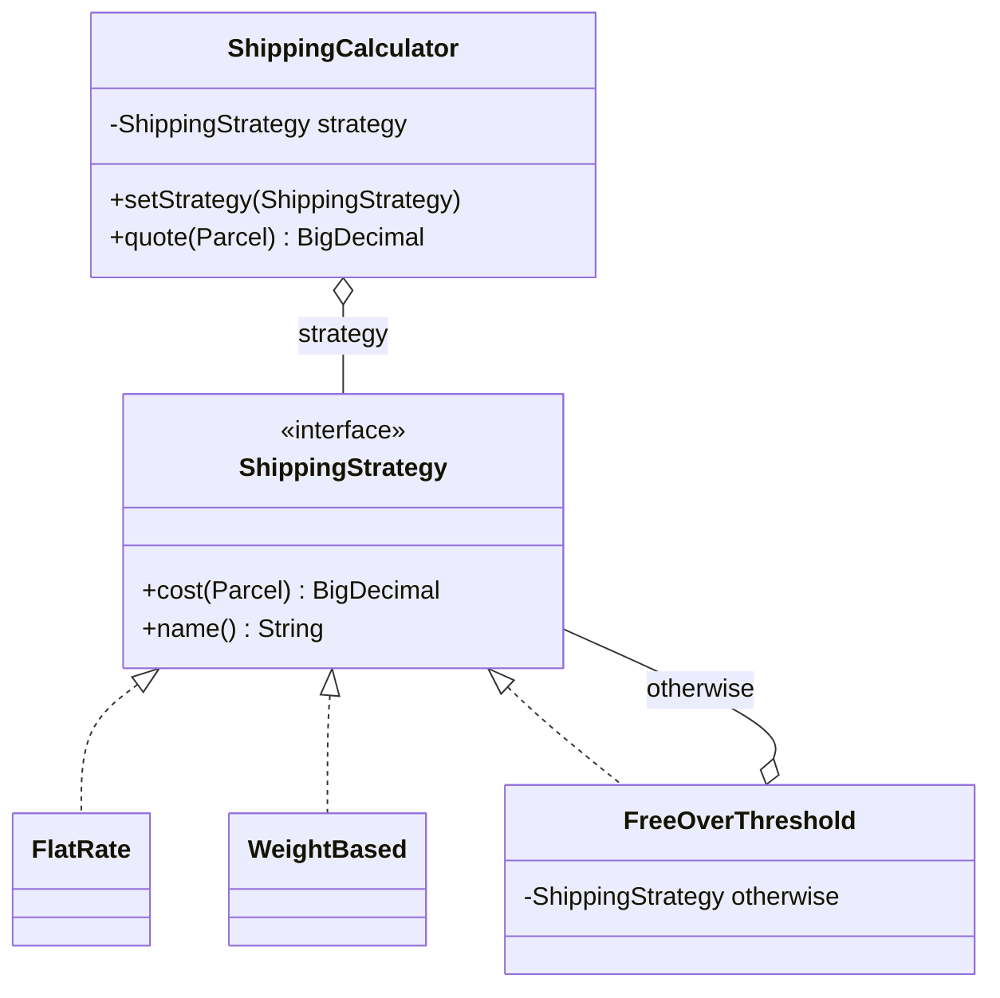
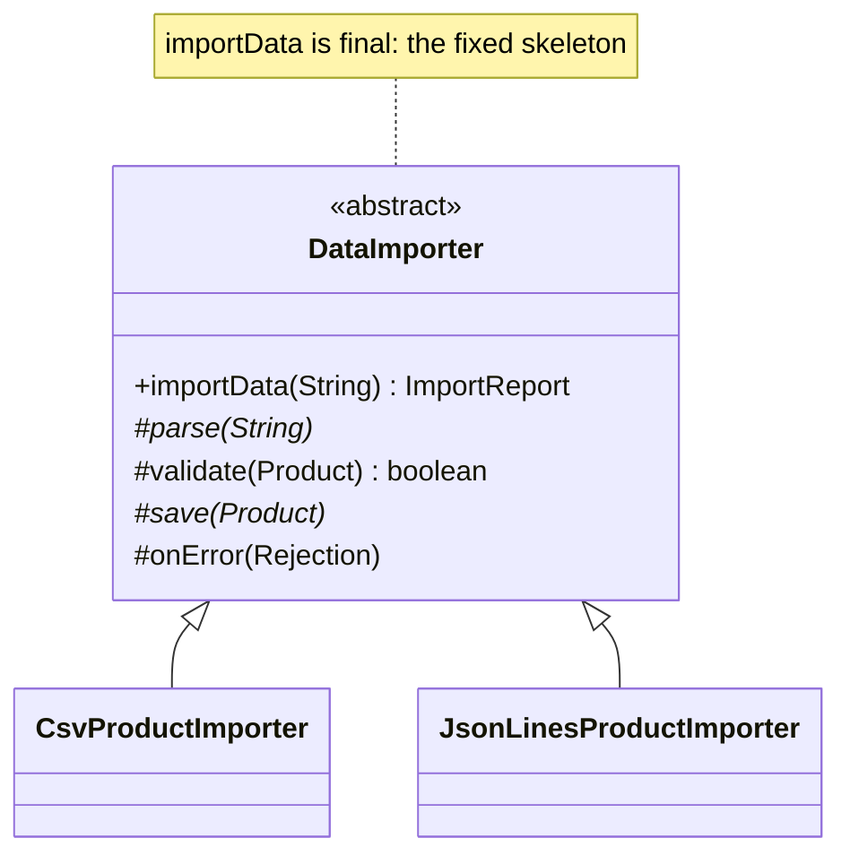
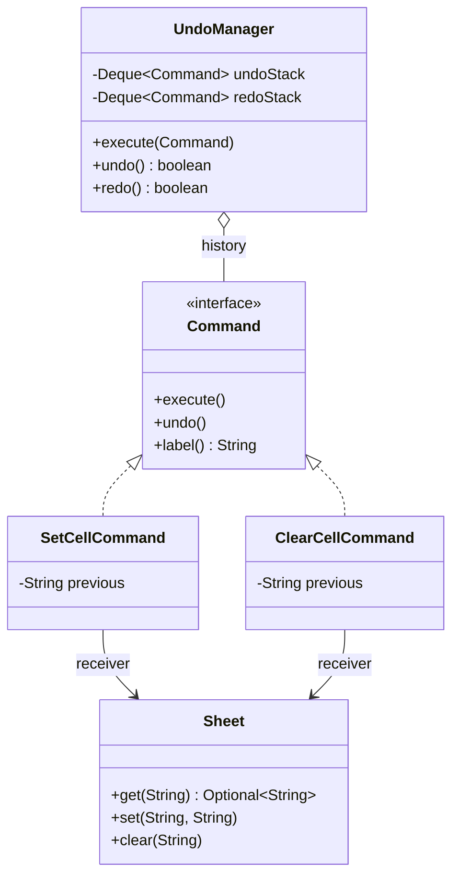
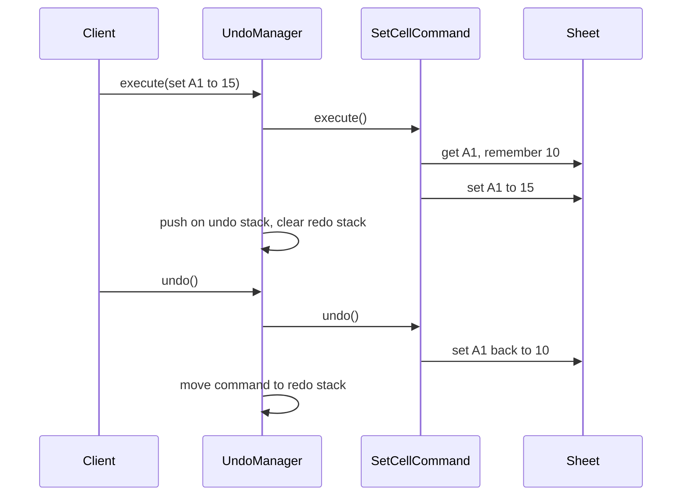
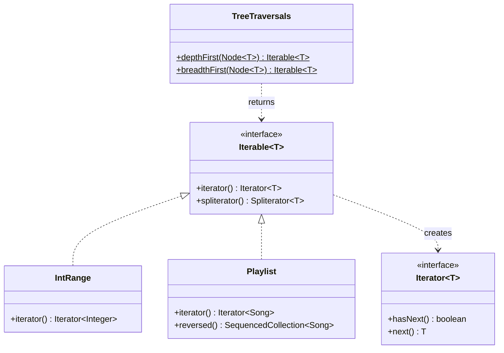

# Modül 06 — Davranışsal Kalıplar I: Algoritmalar

> **8. Hafta** · Ön koşullar: m05 (Composite), m01 (OCP, kalıtım yerine bileşim, DIP), m00 (lambda'lar, akışlar, record'lar, sealed tipler) · Tahmini çalışma süresi: 6 saat
>
> Her örneği derlemeden çalıştırın: `java modules/m06-behavioral-algorithms/src/main/java/io/github/aliturgutbozkurt/patterns/m06/examples/<yol>/<Demo>.java` (JDK 27)

## Öğrenme çıktıları

Bu modülün sonunda şunları yapabilirsiniz:

1. Strategy (Strateji) kalıbını bir sınıf hiyerarşisi, lambda'lar ve bir enum olarak **uygulamak** ve `Comparator`'ın
   neden JDK'nın en bilinen Strategy'si olduğunu **açıklamak**.
2. Template Method (Şablon Metot) kalıbını `final` bir iskelet ve kanca metotlarla **uygulamak**, onu yüksek
   mertebeden bir fonksiyona **dönüştürmek** ve ikisini **karşılaştırmak**.
3. Command (Komut) kalıbını `execute`/`undo`, geri alma/yineleme yığınları, makro komutlar ve bir iş kuyruğu ile
   **uygulamak**; komutları mühürlü record'lar ve eksiksiz (exhaustive) bir `switch` ile veri olarak **modellemek**.
4. Özel bir `Iterator`/`Iterable` ve doğru karakteristikleri olan bir `Spliterator` **yazmak**; sıralı koleksiyonları
   (sequenced collections) **kullanmak**.
5. Hazır akış toplayıcılarını (gatherer) **kullanmak** ve özel, sıralı bir `Gatherer` **yazmak**.
6. Bir kalıbın ne zaman lambda'ya dönüşmesi, ne zaman sınıf olarak kalması gerektiğine **karar vermek**.

## Motivasyon

m02–m05 nesnelerle ilgiliydi: onları nasıl oluşturacağımız ve nasıl bir araya getireceğimiz. Bu modül ise
*algoritmalarla* ilgilidir. Kargo ücretini giderek uzayan bir `if`/`else` zinciriyle hesaplayan bir ödeme adımı tipik
başlangıç noktasıdır:

```java
// snippet — the code this module refactors away
BigDecimal shipping(String method, Parcel parcel) {
    if (method.equals("flat")) return new BigDecimal("4.99");
    else if (method.equals("per-kg")) return ...;           // every new method edits this function
    else if (method.equals("free-over-50")) return ...;
    throw new IllegalArgumentException(method);
}
```

Her yeni algoritma bu fonksiyonu değiştirir ve hiçbir parça tek başına test edilemez. Bu modüldeki dört kalıbın her
biri, böyle bir koddan bir tür değişkenliği dışarı çıkarır. **Strategy** bütün bir algoritmayı değiştirmenizi
sağlar. **Template Method** bir algoritmanın iskeletini sabitler ve adımlarını değiştirmenize izin verir.
**Command** bir isteği kuyruğa konabilen, kaydedilebilen ve geri alınabilen bir nesneye dönüştürür. **Iterator
(Yineleyici)** bir koleksiyonu nasıl saklandığını bilmeden dolaşmanızı sağlar. Modern Java'da bunların birkaçı bir
fonksiyonel arayüze ve bir lambda'ya küçülür; bu yüzden her biri için şunu soruyoruz: lambda ne zaman yeterlidir?

## Strategy

### Problem

Bir e-ticaret sitesi sabit ücretli kargo, kilogram başına ücret ve belirli bir tutarın üzerinde ücretsiz kargo
sunuyor. Gelecek ay pazarlama ekibi "hepsinin en ucuzunu" istiyor. Her yeni fiyat kuralı eklendiğinde ödeme kodu
değişmemeli ve her kural tek başına test edilebilmelidir.

### Amaç

> Bir algoritma ailesi tanımlamak, her birini aynı arayüzün arkasına koymak ve onları **birbirinin yerine
> kullanılabilir** kılmak; böylece algoritma, onu kullanan koddan bağımsız olarak değişebilir.

### Yapı



**Bağlam** (context, `ShippingCalculator`) bir strateji tutar ve işi ona devreder. Her **somut strateji** bir
algoritmadır. Stratejiyi istemci seçer.

### Klasik Java

Strateji arayüzü:

```java
// file: examples/strategy/shipping/classic/ShippingStrategy.java
public interface ShippingStrategy {

    /** The shipping cost for {@code parcel}, with two decimal places. */
    BigDecimal cost(Parcel parcel);

    /** A short name for printing, e.g. {@code "flat"}. */
    String name();
}
```

Her algoritma için bir sınıf. `FreeOverThreshold`, sipariş tutarı yetersiz kaldığında işi başka bir stratejiye
bile devreder:

```java
// file: examples/strategy/shipping/classic/WeightBased.java
    @Override
    public BigDecimal cost(Parcel parcel) {
        BigDecimal weight = BigDecimal.valueOf(parcel.weightKg());
        return baseFee.add(perKg.multiply(weight)).setScale(2, RoundingMode.HALF_EVEN);
    }
```

```java
// file: examples/strategy/shipping/classic/FreeOverThreshold.java
    @Override
    public BigDecimal cost(Parcel parcel) {
        return parcel.orderTotal().compareTo(threshold) >= 0 ? FREE : otherwise.cost(parcel);
    }
```

Bağlam yalnızca arayüzü bilir ve strateji çalışma zamanında değiştirilebilir:

```java
// file: examples/strategy/shipping/classic/ShippingCalculator.java
    public void setStrategy(ShippingStrategy strategy) {
        this.strategy = Objects.requireNonNull(strategy, "strategy");
    }
// ...
    public BigDecimal quote(Parcel parcel) {
        return strategy.cost(parcel);
    }
```

```java
// file: examples/strategy/shipping/classic/ShippingDemo.java
        var checkout = new ShippingCalculator(flat);
        Parcel heavy = parcels.get(1);
        System.out.println("checkout uses " + checkout.strategy().name() + ": " + checkout.quote(heavy));
        checkout.setStrategy(perKg);  // same context, new algorithm
        System.out.println("checkout switched to " + checkout.strategy().name() + ": " + checkout.quote(heavy));
```

```text
parcel 0.5 kg, order 20.00:  flat 4.99 | per-kg 2.40 | free-over-50.00 4.99
parcel 12.0 kg, order 45.00: flat 4.99 | per-kg 11.60 | free-over-50.00 4.99
parcel 3.0 kg, order 50.00:  flat 4.99 | per-kg 4.40 | free-over-50.00 0.00
checkout uses flat: 4.99
checkout switched to per-kg: 11.60
```

Eşik dahildir: tam 50.00 tutarındaki bir sipariş ücretsiz gönderilir. Yeni bir kural yeni bir sınıftır; mevcut
hiçbir sınıf değişmez (m01'deki Açık/Kapalı İlkesi).

### Modern Java 27

Tek metotlu bir strateji arayüzü bir **fonksiyonel arayüzdür**; bu yüzden her algoritma bir lambda olabilir:

```java
// file: examples/strategy/shipping/modern/ShippingRule.java
@FunctionalInterface
public interface ShippingRule {

    /** The shipping cost for {@code parcel}. */
    BigDecimal cost(Parcel parcel);
}
```

Statik fabrika metotları stratejileri döndürür. Yüksek mertebeden bir fonksiyon, stratejileri yeni bir stratejide
*birleştirir*:

```java
// file: examples/strategy/shipping/modern/ShippingRules.java
    public static ShippingRule flatRate(BigDecimal fee) {
        Objects.requireNonNull(fee, "fee");
        return _ -> fee;
    }
// ...
    /** A rule that asks every rule and keeps the lowest price: strategies composed into a new strategy. */
    public static ShippingRule cheapestOf(ShippingRule... rules) {
        if (rules.length == 0) {
            throw new IllegalArgumentException("cheapestOf needs at least one rule");
        }
        List<ShippingRule> copy = List.copyOf(Arrays.asList(rules));
        return parcel -> copy.stream()
                .map(rule -> rule.cost(parcel))
                .min(BigDecimal::compareTo)
                .orElseThrow();
    }
```

Stratejiler kapalı bir kümeyse ve ada ihtiyaç duyuyorsa (müşterinin seçimini veritabanına kaydetmek ya da bir formda
göstermek için), bir **strateji enum'u** kullanın:

```java
// file: examples/strategy/shipping/modern/ShippingOption.java
public enum ShippingOption implements ShippingRule {
    FLAT(ShippingRules.flatRate(new BigDecimal("4.99"))),
    PER_KG(ShippingRules.weightBased(new BigDecimal("2.00"), new BigDecimal("0.80"))),
    FREE_OVER_50(ShippingRules.freeOver(new BigDecimal("50.00"), FLAT));
```

```java
// file: examples/strategy/shipping/modern/ShippingDemo.java
        // A one-off strategy needs no new class: a lambda is enough.
        ShippingRule express = ShippingRules.weightBased(new BigDecimal("9.90"), new BigDecimal("1.00"));
```

```text
parcel 0.5 kg, order 20.00:  FLAT 4.99 | PER_KG 2.40 | FREE_OVER_50 4.99 | cheapest 2.40
parcel 12.0 kg, order 45.00: FLAT 4.99 | PER_KG 11.60 | FREE_OVER_50 4.99 | cheapest 4.99
parcel 3.0 kg, order 50.00:  FLAT 4.99 | PER_KG 4.40 | FREE_OVER_50 0.00 | cheapest 0.00
express (lambda, 9.90 + 1.00/kg) for 3.0 kg: 12.90
```

Bir test, bu fiyatların her paket için klasik sınıfların fiyatlarıyla aynı olduğunu kontrol eder.

**İki işlemli bir strateji.** Bir sıkıştırma stratejisi hem sıkıştırmalı *hem de* açmalıdır ve ikisi birbirine
uymalıdır. Birbiriyle ilgisiz iki lambda karıştırılabilir (gzip ile sıkıştırıp run-length ile açmak gibi). Bir
record bu çifti bir arada tutar:

```java
// file: examples/strategy/compression/Codec.java
public record Codec(String name, UnaryOperator<byte[]> compress, UnaryOperator<byte[]> decompress) {
```

```java
// file: examples/strategy/compression/Codecs.java
    /** Run-length encoding: each run becomes a (count, value) pair; runs longer than 255 are split. */
    public static Codec runLength() {
        return new Codec("run-length", Codecs::encodeRuns, Codecs::decodeRuns);
    }

    /** DEFLATE in the gzip format from {@code java.util.zip}. */
    public static Codec gzip() {
        return new Codec("gzip", Codecs::gzipBytes, Codecs::gunzipBytes);
    }
```

```text
run-length of "AAAABBBCC": [4, 65, 3, 66, 2, 67]
1000 repetitive bytes:
  identity    same size, round trip ok
  run-length  smaller, round trip ok
  gzip        smaller, round trip ok
43 bytes of text:
  identity    same size, round trip ok
  run-length  larger, round trip ok
  gzip        larger, round trip ok
```

Hiçbir algoritma her yerde kazanmaz: run-length tekrarı olmayan bir metni iki katına çıkarır, gzip'in başlığı ise
çok küçük bir girdiyi büyütür. Seçimin çağırana ait olmasının nedeni budur. Demo yalnızca "smaller/larger" yazar:
gzip'in tam baytları zlib derlemesine bağlıdır; bu yüzden testler sıkıştırılmış baytları değil, gidiş-dönüşü ve
göreli boyutları kontrol eder.

**`Comparator`, JDK'nın en bilinen Strategy'sidir.** `List.sort` bağlamdır; karşılaştırıcı (comparator)
algoritmadır. Statik ve varsayılan (default) metotları, küçük stratejilerden yenilerini kuran yüksek mertebeden
fonksiyonlardır:

```java
// file: examples/strategy/sorting/StudentOrderings.java
    public static final Comparator<Student> BY_GPA_DESC_THEN_NAME =
            comparingDouble(Student::gpa).reversed().thenComparing(Student::name);

    public static final Comparator<Student> BY_ADVISOR_NULLS_LAST_THEN_NAME =
            comparing(Student::advisor, nullsLast(naturalOrder())).thenComparing(BY_NAME);
```

```text
by GPA desc, then name:  Ada 3.9, Cem 3.9, Bora 3.5, Ece 3.5, Deniz 3.2
by advisor, none last:   Cem (Hopper), Ada (Turing), Deniz (Turing), Bora (-), Ece (-)
by name, then by year:   Bora y1, Ada y2, Deniz y2, Cem y3, Ece y3
```

Son satır belgelenmiş bir garantiye dayanır: `List.sort` **kararlıdır** (stable). Önce ada, sonra yıla göre
sıralamak, aynı yıldaki öğrencileri ad sırasında tutar.

### Gerçek dünyada kullanımı

`Comparator` (`List.sort`, `TreeMap`, `Stream.sorted` ile), `java.util.concurrent.RejectedExecutionHandler` (bir iş
parçacığı havuzu dolduğunda ne yapılacağı), `javax.crypto.Cipher.getInstance("AES/GCM/NoPadding")` (algoritma adıyla
seçilir) ve bir yeniden deneme politikası ya da parola kodlayıcı gibi her çerçevedeki "policy" veya "provider"
arayüzleri.

### Tuzaklar ve ne zaman KULLANILMAMALI

- Hiç değişmeyen iki sabit dal için Strategy gerekmez. Düz bir `if` ya da mühürlü bir tip üzerinde bir `switch`
  daha açıktır.
- Algoritmanın durumu yoksa, tek metodu varsa ve bir ada ihtiyacı yoksa **lambda** seçin. Durumu ya da
  yapılandırması varsa, birkaç metodu varsa (sıkıştır + aç gibi) ya da adlandırılması, saklanması veya
  listelenmesi gerekiyorsa **sınıf** (ya da bir enum sabiti) seçin.
- Birini seçebilmek için istemcinin stratejileri bilmesi gerekir. Asıl zor iş seçmekse, bunu bir fabrikanın (m02)
  arkasına saklayın.
- Lambda'larla `comparing(s -> s.gpa()).reversed()` derlenmez: lambda'nın parametre tipi zincirlenmiş çağrı
  üzerinden çıkarılamaz. Bir metot referansı (`Student::gpa`) ya da açık bir tip kullanın.

### İlgili kalıplar

**State** (Durum, m08) aynı yapıya sahiptir, ama nesne kendi durumunu kendisi değiştirir. **Template Method**
adımları kalıtımla, Strategy ise bütün algoritmayı bileşimle değiştirir. Bir strateji çoğu zaman bir **fabrikadan**
(m02) alınır. **Decorator** (Dekoratör, m04) bir stratejiyi sarmalayabilir (`FreeOverThreshold` başka bir kuralı
sarmalar).

## Template Method

### Problem

Ürünler bir tedarikçiden CSV, diğerinden JSON Lines olarak geliyor. *Yöntem* aynıdır: girdiyi ayrıştır, her satırı
bir ürüne dönüştür, iş kurallarını kontrol et, iyi olanları kaydet ve hatalı satırları satır numaralarıyla raporla.
Yalnızca ayrıştırma farklıdır. Yöntemi iki sınıfa kopyalamak, her hatayı iki kez düzeltmek demektir.

### Amaç

> Bir algoritmanın **iskeletini** tek bir metotta tanımlamak ve alt sınıfların, algoritmanın yapısını değiştirmeden
> bazı adımları yeniden tanımlamasına izin vermek.

### Yapı



**Şablon metot** (`importData`) `final`'dır. **Temel adımlar** (`parse`, `save`) soyuttur. **Kanca metotların**
(hook, `validate`, `onError`) alt sınıfların isterse ezebileceği bir varsayılanı vardır.

### Klasik Java

```java
// file: examples/templatemethod/importer/classic/DataImporter.java
    /** The template method. It is {@code final}, so no subclass can reorder or skip the steps. */
    public final ImportReport importData(String input) {
        Objects.requireNonNull(input, "input");
        List<String> imported = new ArrayList<>();
        List<Rejection> rejected = new ArrayList<>();
        for (RawRow row : parse(input)) {
            Product product;
            try {
                product = row.toProduct();
            } catch (IllegalArgumentException e) {
                reject(new Rejection(row.line(), e.getMessage()), rejected);
                continue;
            }
            if (!validate(product)) {
                reject(new Rejection(row.line(), "failed validation"), rejected);
                continue;
            }
            save(product);
            imported.add(product.sku());
        }
        return new ImportReport(imported, rejected);
    }
// ...
    /** Primitive step: split the input into rows of text fields. A syntax error aborts the whole import. */
    protected abstract List<RawRow> parse(String input);

    /** Hook: extra business rules. The default accepts every product. */
    protected boolean validate(Product product) {
        return true;
    }

    /** Primitive step: store one valid product. */
    protected abstract void save(Product product);

    /** Hook: called for every skipped row, e.g. to log it. The default does nothing; the row is still reported. */
    protected void onError(Rejection rejection) {}
```

Somut bir içe aktarıcı yalnızca farklı olan adımları sağlar:

```java
// file: examples/templatemethod/importer/classic/CsvProductImporter.java
    @Override
    protected List<RawRow> parse(String input) {
        return CsvFormat.parse(input);
    }

    @Override
    protected void save(Product product) {
        store.save(product);
    }
```

Klasik yolla tek bir adımı değiştirmek, bir alt sınıf yazmak demektir; burada anonim bir alt sınıf:

```java
// file: examples/templatemethod/importer/classic/ImporterDemo.java
        DataImporter strict = new CsvProductImporter(new InMemoryProductStore()) {
            @Override
            protected boolean validate(Product product) {
                return product.price().signum() > 0;
            }
        };
```

```text
CSV:        imported [A-1, A-3, A-5]; rejected [line 3: price is not a number: abc, line 5: missing field: price]
JSON Lines: imported [A-1, A-3, A-5]; rejected [line 2: price is not a number: abc, line 4: missing field: price]
strict CSV: imported [A-1, A-5]; rejected [line 3: price is not a number: abc, line 4: failed validation, line 5: missing field: price]
store: A-1 Pencil 1.20, A-3 Eraser 0.00, A-5 Stapler 7.50
```

İki biçim de aynı ürünleri içe aktarır ve aynı satırları aynı nedenlerle reddeder. Satır numaraları yalnızca CSV
dosyasında bir başlık satırı olduğu için farklıdır. Bir test, adımların sabit sırayla çalıştığını kanıtlamak için
kayıt tutan bir alt sınıf kullanır; bir yansıma (reflection) testi de `importData`'nın `final` olduğunu kanıtlar.
`src/main` hiçbir bağımlılık içermediği için JSON Lines ayrıştırıcısı, düz nesneler için elle yazılmış yaklaşık 100
satırdır. Gerçek bir projede bir JSON kütüphanesi kullanılır.

### Modern Java 27

Aynı iskelet **yüksek mertebeden bir fonksiyon** olarak: adımlar kalıtımla alınmak yerine fonksiyon olarak verilir.

```java
// file: examples/templatemethod/importer/functional/Importer.java
public record Importer(Function<String, List<RawRow>> parser, Predicate<Product> validator, Consumer<Product> sink) {
// ...
    /** The same skeleton as {@code DataImporter.importData}: parse → validate → save. */
    public ImportReport importData(String input) {
// ...
    /** A copy with a different validation step; everything else stays the same. */
    public Importer withValidator(Predicate<Product> newValidator) {
        return new Importer(parser, newValidator, sink);
    }
```

```java
// file: examples/templatemethod/importer/functional/Importers.java
    public static Importer csv(Consumer<Product> sink) {
        return new Importer(CsvFormat::parse, _ -> true, sink);
    }
```

```java
// file: examples/templatemethod/importer/functional/ImporterDemo.java
        // Changing one step the functional way: pass another function, no subclass.
        Importer strict = Importers.csv(_ -> {}).withValidator(product -> product.price().signum() > 0);
```

```text
CSV:        imported [A-1, A-3, A-5]; rejected [line 3: price is not a number: abc, line 5: missing field: price]
JSON Lines: imported [A-1, A-3, A-5]; rejected [line 2: price is not a number: abc, line 4: missing field: price]
strict CSV: imported [A-1, A-5]; rejected [line 3: price is not a number: abc, line 4: failed validation, line 5: missing field: price]
saved by the sink: [A-1, A-3, A-5]
```

İki biçimi karşılaştırın:

| | Kalıtım (klasik) | Yüksek mertebeden fonksiyon (modern) |
|---|---|---|
| Tek bir adımı değiştirmek | Bir alt sınıf yazılır | Başka bir lambda verilir (`withValidator`) |
| Varyasyonları birleştirmek (JSON + katı) | Her birleşim için bir alt sınıf | Fonksiyonların herhangi bir birleşimi |
| Adımlar arasında paylaşılan durum | Kolay: protected alanlar | Açıkça aktarılmalı |
| Yalnızca alt sınıfların gördüğü adımlar | `protected` metotlar | Her şey açık veridir |
| İskeletin değişikliğe karşı korunması | `final` metot | Record'un metodu (record'lar final'dır) |

Adımlar çok fazla durum paylaşıyorsa ya da bir çerçeve (framework) *sizi* çağırıyorsa (aşağıya bakın) kalıtım hâlâ
uygundur.

### Gerçek dünyada kullanımı

JDK şablon metotlarla doludur. `get` ve `size` metotlarını yazın; `AbstractList` size `iterator`, `contains`,
`indexOf`, `subList`, `equals` ve `toString` metotlarını verir:

```java
// file: examples/templatemethod/jdk/Countdown.java
    @Override
    public Integer get(int index) {
        Objects.checkIndex(index, from);
        return from - index;
    }

    @Override
    public int size() {
        return from;
    }
```

Yalnızca `read()` metodunu yazın; `InputStream` size `read(byte[], int, int)`, `readAllBytes` ve `transferTo`
metotlarını verir:

```java
// file: examples/templatemethod/jdk/AlphabetStream.java
    @Override
    public int read() {
        return next < letters ? 'a' + next++ : -1;
    }
```

```text
for-each over Countdown(5): 5 4 3 2 1
contains(3)=true indexOf(1)=4 subList(1, 3)=[4, 3]
equals(List.of(5, 4, 3, 2, 1))=true
add(0) -> UnsupportedOperationException
readAllBytes(): abcdefghij
transferTo(): 26 bytes, abcdefghijklmnopqrstuvwxyz
```

Diğer örnekler: `AbstractMap` (`entrySet` yazılır), `java.util.concurrent.AbstractExecutorService` ve Jakarta EE'de
sizin `doGet`/`doPost` metotlarınızı çağıran `HttpServlet.service`. JUnit'in `@BeforeEach`/`@Test`/`@AfterEach` yaşam
döngüsü de bir şablondur; bu dersin sözleşme testi de öyledir (`ExNNContract` testleri sabitler, alt sınıflar nesneyi
sağlar).

### Tuzaklar ve ne zaman KULLANILMAMALI

- Şablon metotta `final`'ı unutmak, bir alt sınıfın iskeleti bozmasına izin verir.
- Çok fazla kanca metot, temel sınıfı anlaşılmaz kılar. Güvenli varsayılanları olan, iyi adlandırılmış birkaç kanca
  yeterlidir.
- Kalıtım, alt sınıfı temel sınıfa kalıcı olarak bağlar ("kırılgan temel sınıf" sorunu, m01). Adımlar birbirinden
  bağımsızsa, yüksek mertebeden fonksiyonu ya da Strategy'yi tercih edin.
- Ezilebilir metotları bir **kurucudan** çağıran bir iskelet, onları alt sınıf ilklendirilmeden önce çağırır. Şablon
  metodu kurucuların dışında tutun.

### İlgili kalıplar

**Strategy** bütün algoritmayı bileşimle, Template Method ise adımları kalıtımla değiştirir. Fonksiyonel içe
aktarıcı aslında "adımları Strategy olan bir Template Method"dur. **Factory Method** (Fabrika Metodu, m02) çoğu
zaman bir şablon metodun adımlarından biridir.

## Command

### Problem

Bir hesap tablosu geri almayı ve yinelemeyi desteklemelidir. Her hücre değişikliği yalnızca bir metot çağrısıysa
(`sheet.set("A1", "15")`), geri alınacak bir şey yoktur: çağrı gitmiştir. Değişikliğin kendisine; saklanabilen, geri
alınabilen, yinelenebilen, gruplanabilen, kaydedilebilen ve yeniden oynatılabilen bir nesne olarak ihtiyacımız var.

### Amaç

> Bir isteği bir nesne olarak kapsüllemek; böylece istemcileri isteklerle parametrelendirebilir, istekleri **kuyruğa
> koyabilir ya da kaydedebilir** ve **geri alınabilir** işlemleri destekleyebilirsiniz.

### Yapı



**Komut** kendi **alıcısını** (receiver, `Sheet`) ve ne yapacağını bilir. **Çağırıcı** (invoker, `UndoManager`)
komutları çalıştırır ve ne yaptıklarını bilmeden geçmişi tutar. Komutları **istemci** oluşturur. Geri alma ve
yineleme bir komutu iki yığın arasında taşır:



### Klasik Java

```java
// file: examples/command/spreadsheet/classic/Command.java
public interface Command {

    void execute();

    /** Reverts exactly what the last {@link #execute()} did. */
    void undo();
```

Bir komut, kendini geri alabilmek için gereken şeyi hatırlamalıdır. Bir hücre için bu önceki değerdir; "hücre
boştu" da bir değerdir:

```java
// file: examples/command/spreadsheet/classic/SetCellCommand.java
    @Override
    public void execute() {
        previous = sheet.get(cell).orElse(null);
        sheet.set(cell, value);
    }

    @Override
    public void undo() {
        if (previous == null) {
            sheet.clear(cell);
        } else {
            sheet.set(cell, previous);
        }
    }
```

Çağırıcı hiçbir zaman bir komutun içine bakmaz:

```java
// file: examples/command/spreadsheet/classic/UndoManager.java
    public void execute(Command command) {
        Objects.requireNonNull(command, "command");
        command.execute();
        undoStack.push(command);
        redoStack.clear();  // a new action starts a new branch of history: the old "future" is gone
    }

    /** Undoes the most recent command; {@code false} if there is nothing to undo. */
    public boolean undo() {
        Command command = undoStack.poll();
        if (command == null) {
            return false;
        }
        command.undo();
        redoStack.push(command);
        return true;
    }
```

```text
set A1=10    {A1=10}
set B1=20    {A1=10, B1=20}
set A1=15    {A1=15, B1=20}
undo stack   [set A1=15, set B1=20, set A1=10]
undo         {A1=10, B1=20}
undo         {A1=10}
redo         {A1=10, B1=20}
clear A1     {B1=20}
can redo?    false
undo         {A1=10, B1=20}
```

**GoF uzaktan kumandası.** Akıllı bir ev kumandasının numaralı yuvaları vardır; kumanda (çağırıcı) yalnızca
`Command`'ı bilir. Basit komutlar iki metot referansıdır; durum hatırlaması gereken bir komut ise küçük bir
sınıftır:

```java
// file: examples/command/remote/Command.java
    /** A command whose undo is a fixed action, e.g. {@code Command.of(light::on, light::off)}. */
    static Command of(Runnable execute, Runnable undo) {
```

```java
// file: examples/command/remote/SetTemperatureCommand.java
    @Override
    public void execute() {
        previous = thermostat.temperature();
        thermostat.setTemperature(target);
    }

    @Override
    public void undo() {
        thermostat.setTemperature(previous);
    }
```

Bir **makro komut**, komutlarını sırayla çalıştırır ve ters sırayla geri alır. Boş yuvalarda bir **Null Object**
(`NoCommand.INSTANCE`) durur; böylece kumanda hiçbir zaman `null` kontrolü yapmaz:

```java
// file: examples/command/remote/MacroCommand.java
    @Override
    public void execute() {
        commands.forEach(Command::execute);
    }

    @Override
    public void undo() {
        commands.reversed().forEach(Command::undo);
    }
```

```java
// file: examples/command/remote/RemoteControlDemo.java
        var remote = new RemoteControl(5);
        remote.setCommand(0, Command.of(light::on, light::off));
        remote.setCommand(1, new SetTemperatureCommand(thermostat, 22));
        remote.setCommand(2, Command.of(garage::open, garage::close));
        remote.setCommand(3, new MacroCommand(List.of(
                Command.of(light::off, light::on),
                new SetTemperatureCommand(thermostat, 21),
                Command.of(garage::close, garage::open))));
```

```text
press 0 (light on)     light=on thermostat=19 garage=closed
press 1 (heat to 22)   light=on thermostat=22 garage=closed
undo                   light=on thermostat=19 garage=closed
press 2 (open garage)  light=on thermostat=19 garage=open
press 4 (empty slot)   light=on thermostat=19 garage=open
press 3 (movie night)  light=off thermostat=21 garage=closed
undo                   light=on thermostat=19 garage=open
```

### Modern Java 27

**Veri olarak komutlar.** Davranışı olan nesneler yerine, bir düzenleme değişmez bir değer olabilir: record'lardan
oluşan mühürlü bir arayüz. Kaydedilebilir, karşılaştırılabilir, serileştirilebilir ve yeniden oynatılabilir.

```java
// file: examples/command/spreadsheet/modern/SheetEdit.java
public sealed interface SheetEdit permits SheetEdit.SetCell, SheetEdit.ClearCell, SheetEdit.Batch {
// ...
    record SetCell(String cell, String value) implements SheetEdit {
// ...
    record ClearCell(String cell) implements SheetEdit {
// ...
    record Batch(List<SheetEdit> edits) implements SheetEdit {
```

Davranış tek bir yerde yaşar: record desenleriyle eksiksiz bir `switch`. Bir düzenlemeyi uygulamak onun **tersini**,
yani başka bir düzenlemeyi döndürür; geri alma yalnızca tersi uygulamaktır. `default` yoktur; bu yüzden yeni bir
düzenleme türü, ele alınana kadar derleme hatasıdır:

```java
// file: examples/command/spreadsheet/modern/SheetEditor.java
    private SheetEdit applyAndInvert(SheetEdit edit) {
        return switch (edit) {
            case SetCell(String cell, String value) -> {
                SheetEdit inverse = restore(cell);
                sheet.set(cell, value);
                yield inverse;
            }
            case ClearCell(String cell) -> {
                SheetEdit inverse = restore(cell);
                sheet.clear(cell);
                yield inverse;
            }
            case Batch(List<SheetEdit> edits) -> {
                List<SheetEdit> inverses = new ArrayList<>();
                for (SheetEdit step : edits) {
                    inverses.addFirst(applyAndInvert(step));  // undo runs the steps in reverse order
                }
                yield new Batch(inverses);
            }
        };
    }
```

```text
perform SetCell[cell=A1, value=10] -> {A1=10}
perform Batch[edits=[SetCell[cell=B1, value=20], SetCell[cell=C1, value=30], ClearCell[cell=A1]]] -> {B1=20, C1=30}
inverse Batch[edits=[SetCell[cell=A1, value=10], ClearCell[cell=C1], ClearCell[cell=B1]]]
undo -> {A1=10}
log has 3 edits; replayed on an empty sheet: {A1=10}
```

`Batch` makro komuttur ve tersi yine bir `Batch`'tir. Testler, tersin tersinin özgün düzenleme olduğunu ve kaydın
boş bir tablo üzerinde yeniden oynatılmasının aynı tabloyu kurduğunu kontrol eder (olay kaynaklamanın, event
sourcing, arkasındaki fikir).

**JDK'nın kendi Command'ı: `Runnable`/`Callable` + `ExecutorService`.** Arka plan işi, kuyruğa konan ve daha sonra
bir çağırıcı (yürütücü, executor) tarafından çalıştırılan bir istektir. Burada işler yine veridir:

```java
// file: examples/command/jobs/Job.java
public sealed interface Job permits Job.SendEmail, Job.ResizeImage, Job.GenerateReport {
```

```java
// file: examples/command/jobs/JobRunner.java
    public List<JobResult> runConcurrently(JobQueue queue) throws InterruptedException {
        List<Callable<JobResult>> tasks = queue.drain().stream()
                .<Callable<JobResult>>map(job -> () -> run(job))
                .toList();
        try (var executor = Executors.newVirtualThreadPerTaskExecutor()) {
            return executor.invokeAll(tasks).stream().map(Future::resultNow).toList();
        }
    }
```

```text
queued 4 jobs
SUCCEEDED  SendEmail[to=ada@example.com, subject=Welcome] -> sent 'Welcome' to ada@example.com (attempts: 1)
SUCCEEDED  ResizeImage[file=logo.png, width=128] -> resized logo.png to 128px (attempts: 1)
FAILED     ResizeImage[file=banner.png, width=0] -> width must be > 0: 0 (attempts: 3)
SUCCEEDED  GenerateReport[name=weekly] -> report weekly ready (attempts: 1)
100 report jobs on virtual threads: 100 succeeded, results in submission order: true
```

Her iş kendi sanal iş parçacığında (virtual thread) çalışır ve işler herhangi bir sırayla biter. Yine de
`invokeAll` future'ları **görev sırasıyla** döndürür; bu yüzden yazdırılan sonuçlar belirlenimcidir (deterministic).
Başarısız olan bir iş, denemeleri bittikten sonra çalışmayı durdurmak yerine bir `FAILED` sonucuna dönüşür.

### Gerçek dünyada kullanımı

`Runnable`, `Callable` ve `ExecutorService`; `javax.swing.Action` ve menü öğeleri; `java.util.Timer` görevleri;
editörlerde ve IDE'lerde geri alma yöneticileri (`javax.swing.undo.UndoManager`); "up" ve "down" adımları olan
veritabanı geçişleri (migration); komutların ve olayların saklanıp yeniden oynatılabilen veriler olduğu mesaj
kuyrukları ve olay kaynaklama.

### Tuzaklar ve ne zaman KULLANILMAMALI

- Yeterince durum hatırlamayan bir komut kendini geri alamaz. `Command.of(light::on, light::off)` ışığın daha önce
  kapalı olduğunu varsayar; termostat ise önceki sıcaklığı saklayan bir sınıfa ihtiyaç duyar.
- Geri alma ters sırayla yapılmalıdır. Bir makroyu düz sırayla geri almak ya da yeni bir düzenlemeden sonra
  yinelemek durumu bozar. Yeni bir komutun yineleme yığınını temizlemesinin nedeni budur.
- Sınırsız bir geçmiş bir bellek sızıntısıdır. Gerçek editörler bir sınır tutar (bkz. ödev 01).
- Eylemi yalnızca *çalıştırıyorsanız*, hiçbir zaman kuyruğa koymuyor, kaydetmiyor ya da geri almıyorsanız, düz bir
  metot çağrısı ya da bir `Runnable` yeterlidir.
- Veri olarak komutlar, her komutu bilen tek bir `switch` gerektirir. Bu, kapalı bir düzenleme kümesi için harikadır,
  eklentilerin (plug-in) yeni komutlar eklemesi gerektiğinde ise zahmetlidir.

### İlgili kalıplar

**Memento** (Hatıra, m07) geri alma için ters işlemler yerine anlık görüntüler (snapshot) saklar. Bir makro komut,
bir **Composite**'tir (Bileşik, m05). **Chain of Responsibility** (Sorumluluk Zinciri) ve **Mediator** (Arabulucu)
(m07) komutları yönlendirir. Bir komut çoğu zaman bir **fabrika** (m02) tarafından oluşturulur.

## Iterator

### Problem

Bir çalma listesi, bir sayı aralığı ve bir şirket organizasyon şeması çok farklı biçimlerde saklanır: bir küme, iki
tamsayı, bir ağaç. İstemci kodu hepsini, saklama biçimini bilmeden, aynı şekilde dolaşmak ister; belki birkaç farklı
sırayla ve aynı anda birkaç döngüyle.

### Amaç

> Bir bileşik nesnenin öğelerine, altta yatan gösterimini açığa çıkarmadan **sırayla** erişmenin bir yolunu
> sağlamak.

### Yapı



**Toplam nesne** (aggregate, `Iterable`) **yineleyiciler** oluşturur. Her yineleyici kendi imlecini tutar; bu yüzden
döngüler birbirini etkilemez.

### Klasik Java

Elle yazılmış bir yineleyici sayıları istendikçe hesaplar ve sondan sonra `NoSuchElementException` fırlatır:

```java
// file: examples/iterator/basics/IntRange.java
    @Override
    public Iterator<Integer> iterator() {
        return new Iterator<>() {
            private long next = start;  // long: next + step must not overflow near Integer.MAX_VALUE

            @Override
            public boolean hasNext() {
                return next < end;
            }

            @Override
            public Integer next() {
                if (!hasNext()) {
                    throw new NoSuchElementException("range exhausted at " + next);
                }
                int value = (int) next;
                next += step;
                return value;
            }
        };
    }
```

For-each döngüsü bir sözdizimi kolaylığıdır: derleyici onu şu **dış yinelemeye** (external iteration) dönüştürür:

```java
// file: examples/iterator/basics/IteratorBasicsDemo.java
        Iterator<Integer> it = range.iterator();  // what the compiler generates for the for-each loop
        while (it.hasNext()) {
            line.append(it.next()).append(' ');
        }
```

**Sıralı koleksiyonlar** (sequenced collections, JEP 431) sıralı koleksiyonlara `reversed()`, `getFirst()` ve
`getLast()` kazandırır; artık ters yineleyicileri elle yazmazsınız:

```java
// file: examples/iterator/basics/Playlist.java
    /** A live, read-only view in reverse order: songs added later show up in it. */
    public SequencedCollection<Song> reversed() {
        return Collections.unmodifiableSequencedSet(songs).reversed();
    }
```

```text
for-each:  0 3 6 9
desugared: 0 3 6 9
next() after the end -> NoSuchElementException
two iterators: a=0 b=0 a=3
playlist:   Intro, Blue, Green, Outro
reversed(): Outro, Green, Blue, Intro
first/last: Intro / Outro
add Blue again -> false
the reversed view now starts with Bonus
add while iterating -> ConcurrentModificationException
```

Son satır **hızlı-başarısız** (fail-fast) bir yineleyiciyi gösterir: döngü sırasında koleksiyonu değiştirmek,
bir sonraki `next()` çağrısının `ConcurrentModificationException` fırlatmasına yol açar. Bu kontrol elden gelenin en
iyisidir (best effort); iş parçacığı güvenliği garantisi değildir.

**Tek bir yapının birkaç dolaşımı.** Bir ağaç önce derinlik (depth-first) ya da önce genişlik (breadth-first)
sırasıyla dolaşılabilir. Özyineleme yerine açık bir `Deque` kullanan bir yineleyici, 100 000 seviyelik bir zinciri
`StackOverflowError` olmadan dolaşır:

```java
// file: examples/iterator/tree/TreeTraversals.java
            @Override
            public T next() {
                if (stack.isEmpty()) {
                    throw new NoSuchElementException();
                }
                Node<T> node = stack.pop();
                node.children().reversed().forEach(stack::push);  // leftmost child ends up on top
                return node.value();
            }
```

```text
depth-first:   CEO, CTO, Dev Lead, QA Lead, CFO, Accountant
breadth-first: CEO, CTO, CFO, Dev Lead, QA Lead, Accountant
nodes visited in a 100 000-level chain: 100000
```

### Modern Java 27

**`Spliterator`: akışları tanıyan yineleyici.** Akışlar `Iterator` değil, `Spliterator` kullanır. Onun
`tryAdvance` (bir öğe), `trySplit` (işin yarısını başka bir iş parçacığına devretmek) ve akış çerçevesine neyi
varsayabileceğini söyleyen **karakteristikleri** vardır. Sayfalı bir API iyi bir örnektir: bir sayfa ancak
gerektiğinde getirilir.

```java
// file: examples/iterator/spliterator/PagedSpliterator.java
    @Override
    public boolean tryAdvance(Consumer<? super String> action) {
        while (index >= page.size()) {
            if (lastPageSeen) {
                return false;
            }
            page = source.fetchPage(nextPage++);
            index = 0;
            lastPageSeen = page.size() < source.pageSize();
        }
        action.accept(page.get(index++));
        return true;
    }
// ...
    @Override
    public int characteristics() {
        return ORDERED | NONNULL;
    }
```

Bir aralık kendi tam boyutunu bilir ve ikiye bölünür; böylece paralel bir akış işi paylaştırabilir:

```java
// file: examples/iterator/spliterator/IntRangeSpliterator.java
    @Override
    public Spliterator<Integer> trySplit() {
        int size = to - from;
        if (size < 2) {
            return null;
        }
        int middle = from + size / 2;
        var firstHalf = new IntRangeSpliterator(from, middle);
        from = middle;
        return firstHalf;
    }
```

```text
first 4 customers: [Ada, Bora, Cem, Deniz] (pages fetched: 2)
all customers: 7 (pages fetched: 3)
paged source: ORDERED | NONNULL, size unknown
int range:    ORDERED | SIZED | SUBSIZED, size 1000000
trySplit of [0, 1000): 500 + 500
sum of [0, 1000000): sequential 499999500000, parallel 499999500000
```

`limit(4)`, 3 sayfanın yalnızca 2'sini getirdi: akışlar tembeldir ve öğeleri birer birer çeker. Varsayılan
`Iterable.spliterator()` hiçbir karakteristik bildirmez ve boyutu bilinmez; `IntRange`'in onu ezmesinin nedeni budur.

**Akış toplayıcıları** (Stream Gatherers, JEP 485, JDK 24'ten beri kalıcı) yeni *ara* işlemler ekler. `map` ve
`filter` her seferinde tek bir öğe görür; bir gatherer ise öğeler boyunca **durum** tutabilir. Hazır olanlar sık
görülen durumları karşılar:

```java
// file: examples/iterator/gatherers/ReadingAnalytics.java
    public static List<Double> movingAverages(List<SensorReading> readings, int window) {
        return readings.stream()
                .map(SensorReading::value)
                .gather(Gatherers.windowSliding(window))
                .map(values -> values.stream().mapToDouble(Double::doubleValue).average().orElseThrow())
                .toList();
    }
```

Özel bir gatherer'ın bir **başlatıcısı** (initializer, yeni durum), bir **bütünleştiricisi** (integrator, her öğe
için çağrılır, sonuçları aşağı akışa gönderebilir) ve bir **bitiricisi** (finisher, sonda çağrılır) vardır. Bir
**birleştirici** (combiner) yalnızca paralel gatherer'lar için gerekir (m09). Bu gatherer tıklamaları oturumlara
ayırır:

```java
// file: examples/iterator/gatherers/SessionGatherer.java
        return Gatherer.ofSequential(
                OpenSession::new,                                   // initializer: fresh state per stream
                Gatherer.Integrator.of((state, click, downstream) -> {
                    boolean wantsMore = true;
                    if (!state.clicks.isEmpty() && click.second() - state.clicks.getLast().second() > maxGapSeconds) {
                        wantsMore = downstream.push(List.copyOf(state.clicks));  // false = downstream is done
                        state.clicks = new ArrayList<>();
                    }
                    state.clicks.add(click);
                    return wantsMore;
                }),
                (state, downstream) -> {                            // finisher: the last session is still open
                    if (!state.clicks.isEmpty()) {
                        downstream.push(List.copyOf(state.clicks));
                    }
                });
```

```text
values:               10.0, 12.0, 14.0, 13.0, 30.0
3-point moving avg:   12.00, 13.00, 19.00
windowFixed(2):       [[10.0, 12.0], [14.0, 13.0], [30.0]]
running total (scan): [10.0, 22.0, 36.0, 49.0, 79.0]
sessions (gap > 30 s): [[home@0, search@12, product@40], [home@200, cart@215], [checkout@600]]
clicks so far after each session: [3, 5, 6]
```

Son satır iki gatherer'ı `andThen` ile birleştirir: önce oturumlar, sonra onların üzerinde hazır bir `scan`.

### Gerçek dünyada kullanımı

JDK'daki her koleksiyon `Iterable`'dır; `Scanner` ve `BufferedReader.lines()` girdiyi dolaşır; `DirectoryStream` ve
`Files.walk` dosya sistemini dolaşır; JDBC'nin `ResultSet.next()` metodu satırlar üzerinde bir yineleyicidir; her
`Stream`'in arkasında bir `Spliterator` vardır. Sayfalı REST istemcileri (GitHub ya da AWS SDK'ları) sayfaları,
tıpkı `PagedCustomerSource` gibi, yineleyicilerin ya da akışların arkasına saklar.

### Tuzaklar ve ne zaman KULLANILMAMALI

- `Gatherers.windowSliding(3)`, 3'ten **kısa** bir akışta hiçbir şey değil, **tek bir kısmi pencere** (`[1, 2]`)
  yayar. Kısmi bir pencere sizin için yanlışsa pencere boyutunu kontrol edin. `windowFixed` da kısmi bir pencereyle
  biter.
- Bir bütünleştirici `downstream.push(...)`'ın sonucunu döndürmelidir; böylece kısa devre yapan bir akış durabilir.
  (JDK, unutsanız bile bir `limit`'i durdurur, ama buna güvenmeyin.)
- Hızlı-başarısız yineleyiciler değişiklikleri elden geldiğince yakalar. Bir koleksiyonu iş parçacığı güvenli
  yapmazlar.
- Özyinelemeli bir dolaşım ya da derin bir ağaçta bir record'un üretilmiş `toString`/`equals` metodu yığını
  taşırabilir. Açık bir yığınla yineleyin.
- Bir `List` ya da bir akış işlem hattı işi zaten yapıyorsa yineleyici yazmayın; saklama biçimi özelse (hesaplanan,
  sayfalı, ağaç) yazın.

### İlgili kalıplar

Yineleyicilerin en sık dolaştığı yapılar **Composite** (m05) yapılarıdır. **Visitor** (Ziyaretçi, m08) böyle bir
yapının her öğesi üzerinde iş yapar. Yineleyiciyi **Factory Method** (m02) oluşturur (`iterator()` bir fabrika
metodudur). Bir gatherer, bir akış adımı için küçük bir **Strategy**'dir.

## Bir kalıp ne zaman lambda olur

| Değişkenlik... | Kullanın | Örnek |
|---|---|---|
| durumsuz tek bir fonksiyonsa | Bir lambda ya da metot referansı | `ShippingRules.flatRate`, `Comparator.comparing` |
| kapalı, adlandırılmış bir seçenek kümesiyse | Arayüzü uygulayan bir enum | `ShippingOption` |
| birbirine uyması gereken birkaç işlemse | Fonksiyonlardan oluşan bir record ya da bir sınıf | `Codec(compress, decompress)` |
| sabit bir yöntemin içindeki bir adımsa | Yüksek mertebeden bir fonksiyon (ya da Template Method) | `Importer.withValidator` |
| geri alınmalı, kuyruğa konmalı ya da kaydedilmeliyse | Çıplak bir lambda değil, bir sınıf ya da record | `SetTemperatureCommand`, `SheetEdit` |
| özel bir veri yapısını dolaşıyorsa | `Iterator` / `Spliterator` / `Gatherer` | `PagedSpliterator`, `SessionGatherer` |

Bir lambda, durumu olmadığı, tek bir metodu olduğu ve bir ada ihtiyaç duymadığı sürece lambda olarak kalır. Bunlardan
birine ihtiyaç duyduğu anda onu bir sınıfa, record'a ya da enum'a yükseltin.

## Özet

| Kalıp | Ne zaman kullanılır | Ne zaman kaçınılır | Java 27 kısayolu |
|---|---|---|---|
| Strategy | Algoritmalar değişiyor ve çalışma zamanında seçiliyor | Hiç değişmeyen iki sabit dal | Fonksiyonel arayüz + lambda'lar, strateji enum'ları, `Comparator` birleştiricileri |
| Template Method | Değişen adımları olan sabit bir yöntem | Adımlar birbirinden bağımsız (bileşimi tercih edin) | Adımları parametre olarak alan yüksek mertebeden fonksiyon |
| Command | İstekler kuyruğa konmalı, kaydedilmeli, geri alınmalı ya da yeniden oynatılmalı | Eylem her zaman doğrudan çalıştırılıyor | Mühürlü record'lar + eksiksiz `switch`; `Callable` + `ExecutorService` |
| Iterator | Bir yapıyı açığa çıkarmadan dolaşmak | Bir `List` ya da akış işlem hattı işi zaten yapıyor | `Spliterator` + `StreamSupport`, sıralı koleksiyonlar, gatherer'lar |

## Sınav

1. Mühürlü bir tip üzerinde bir `switch` ne zaman Strategy'den daha iyidir, Strategy ne zaman daha iyidir?
2. Bir stratejiyi lambda yerine sınıf (ya da enum sabiti) olarak yazmak için üç neden söyleyin.
3. `Comparator` neden bir Strategy'dir ve kalıp açısından `thenComparing` ne yapar?
4. Şablon metot neden `final`'dır ve kanca metot (hook) nedir?
5. Bir komut kendini geri alabilmek için neyi hatırlamalıdır? `SetCellCommand`'ı örnek alın.
6. Yeni bir komutu çalıştırmak neden yineleme yığınını temizler?
7. Komut nesneleri yerine veri olarak komutlarla (mühürlü record'lar) ne kazanırsınız, ne kaybedersiniz?
8. `ORDERED`, `SIZED` ve `NONNULL` akış çerçevesine ne söyler ve varsayılan `Iterable.spliterator()` neden paralel
   bir akışa yardımcı olmaz?
9. `Gatherers.windowSliding(3)`, iki öğeli bir akış için ne yayar ve `map`/`filter`/`collect` yerine ne zaman özel bir
   gatherer'a ihtiyaç duyarsınız?

<details><summary>Cevaplar</summary>

1. Durumlar kümesi kapalıysa ve sizin kodunuza aitse mühürlü bir tip üzerindeki `switch` daha iyidir (derleyici
   eksiksiz olduğunu kontrol eder). Yeni algoritmalar sık sık, başka kodlar tarafından ekleniyorsa ya da çalışma
   zamanında seçiliyorsa Strategy daha iyidir.
2. Bir durumu ya da yapılandırması vardır; birbirine uyması gereken birkaç işlemi vardır (compress/decompress,
   execute/undo); saklanabilmesi, gösterilebilmesi ya da listelenebilmesi için bir ada ihtiyacı vardır.
3. `List.sort` (bağlam) "hangisi önce gelir" kararını karşılaştırıcıya (stratejiye) devreder. `thenComparing`, iki
   stratejiyi yeni bir stratejide birleştiren yüksek mertebeden bir fonksiyondur.
4. Hiçbir alt sınıf iskeletin adımlarını yeniden sıralayamasın ya da atlayamasın diye. Kanca metot, alt sınıfların
   *isterse* değiştirebileceği, varsayılanı olan (örneğin `true` döndüren `validate` gibi) ezilebilir bir adımdır.
5. `execute`'un yok ettiği durumu: "hücre boştu" dahil, hücrenin önceki değerini.
6. Yineleme, geri alınmış komutları oluşturuldukları duruma yeniden uygular. Yeni bir komuttan sonra o durum artık
   yoktur; bu yüzden eski "gelecek" geçersizdir.
7. Kazanılan: düzenlemeler kaydedilebilir, karşılaştırılabilir, serileştirilebilir ve yeniden oynatılabilir; tek bir
   eksiksiz `switch` bütün davranışı gösterir. Kaybedilen: yeni bir komut eklemek o `switch`'i değiştirmeyi
   gerektirir (eklenti yok) ve davranış artık verinin yanında değildir.
8. `ORDERED`: öğelerin tanımlı bir sırası vardır. `SIZED`: tam sayı bilinir. `NONNULL`: hiçbir öğe `null` değildir.
   Varsayılan spliterator'ın hiçbir karakteristiği yoktur, boyutu bilinmez ve kötü bölünür; bu yüzden paralel bir
   akış işi iyi paylaştıramaz.
9. Tek bir kısmi pencere: `[[a, b]]`. İşlem öğeler boyunca durum gerektiriyorsa (açık oturum gibi) ve akış
   sürerken sonuç yayması, belki erken durması gerekiyorsa özel bir gatherer gerekir. `collect` sonucu yalnızca en
   sonda üretir.

</details>

## Ödevler

- [01 — Command tabanlı geri alma/yinelemeli metin editörü](../assignments/01-text-editor-undo.tr.md) ★★☆
- [02 — Ortanca sıralı ağaç yineleyicisi ve özel bir Gatherer](../assignments/02-tree-iterator-gatherer.tr.md) ★★★

## İleri okuma

- Gamma, Helm, Johnson, Vlissides, *Design Patterns* (1994): Strategy, Template Method, Command, Iterator.
- Joshua Bloch, *Effective Java*, 3. baskı (2018): madde 42–44 (lambda'lar ve fonksiyonel arayüzler) ve madde 19
  (kalıtım için tasarlayın ve belgeleyin).
- JEP 485: [Stream Gatherers](https://openjdk.org/jeps/485) · JEP 431: [Sequenced Collections](https://openjdk.org/jeps/431) · JEP 441: [Pattern Matching for switch](https://openjdk.org/jeps/441) · JEP 444: [Virtual Threads](https://openjdk.org/jeps/444)
- `java.util.Spliterator` ve `java.util.stream.Gatherer` API belgeleri (JDK 27).
- Terimlerin Türkçesi: [docs/glossary.md](../../../docs/glossary.md)
