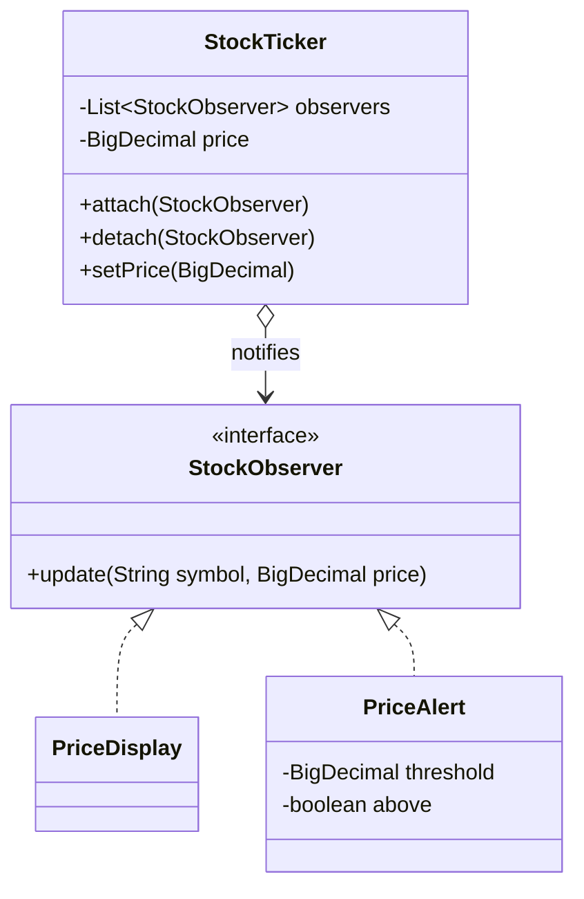
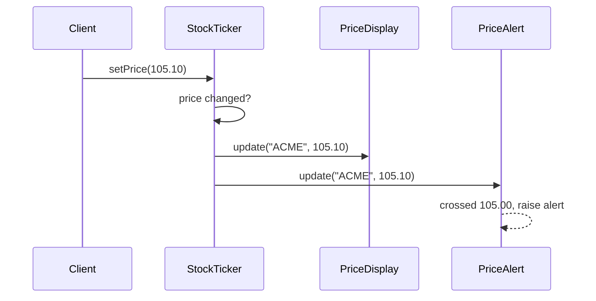
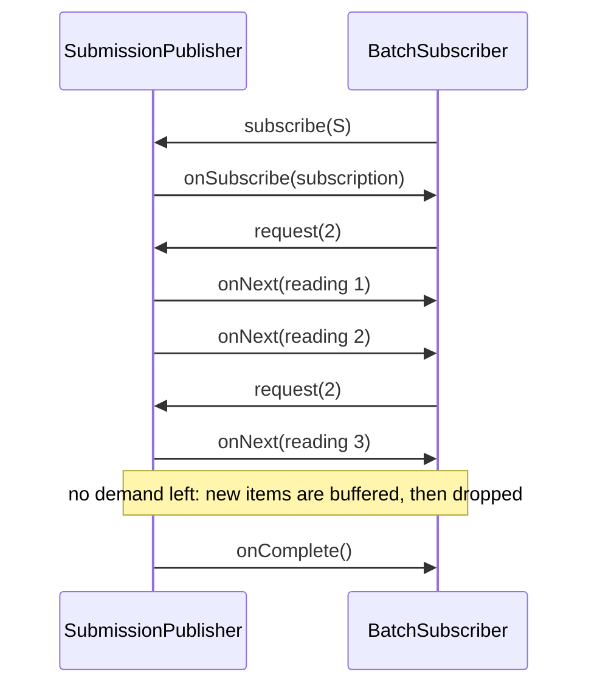
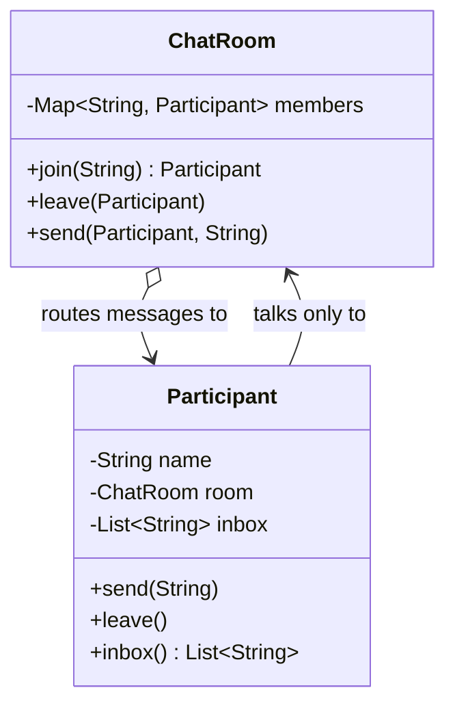
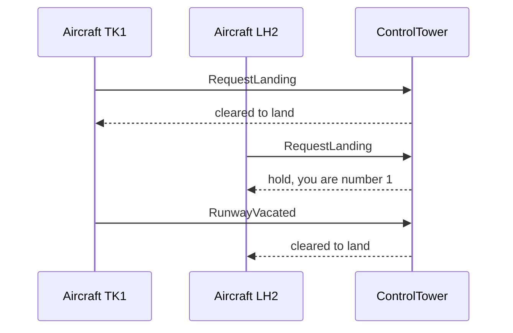
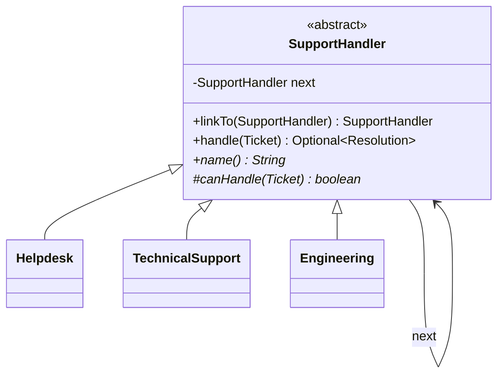
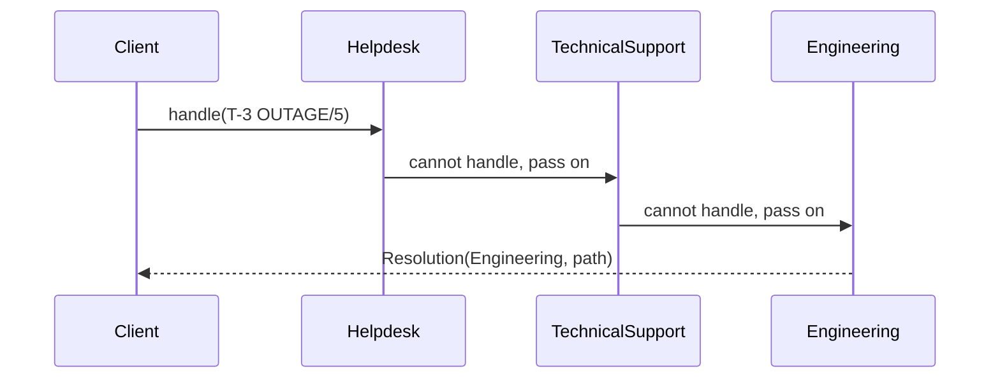
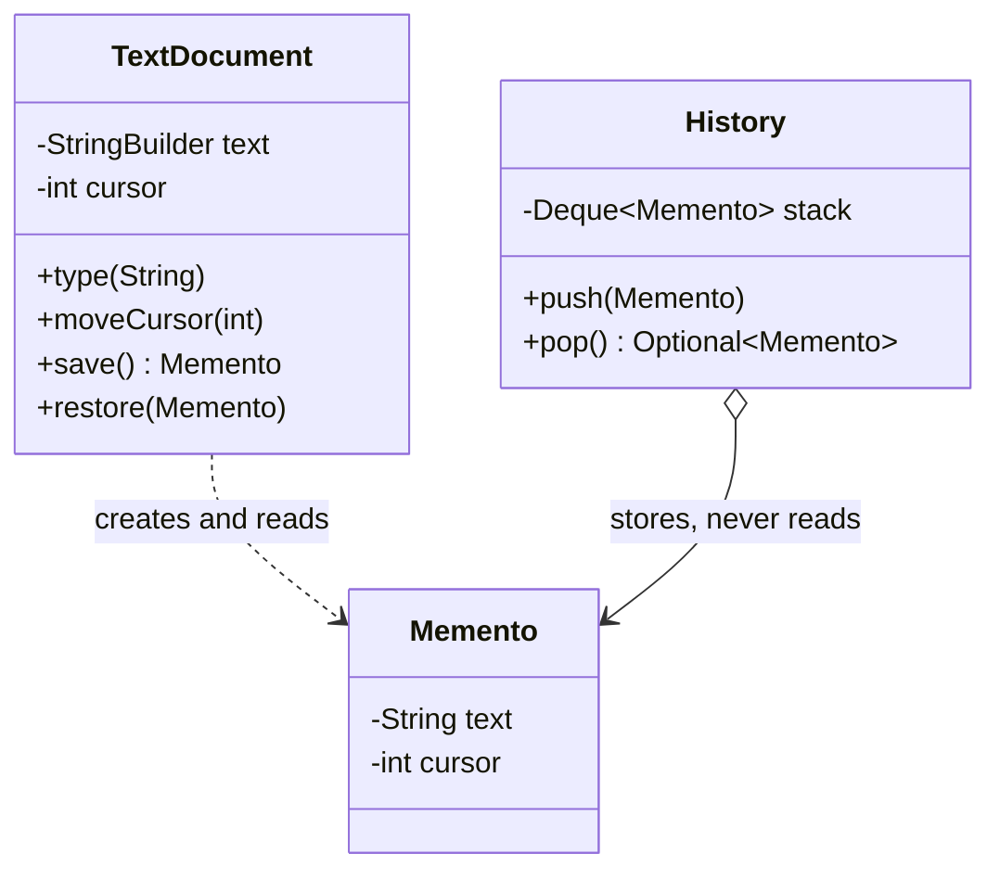

# Module 07 — Behavioral Patterns II: Communication

> **Week 9** · Prerequisites: m06 (Strategy as lambdas, Command with undo), m05 (Facade), m03 (records with compact constructors) · Estimated study time: 6 h
>
> Run every example without a build: `java modules/m07-behavioral-communication/src/main/java/io/github/aliturgutbozkurt/patterns/m07/examples/<path>/<Demo>.java` (JDK 27)

## Learning outcomes

By the end of this module you can:

1. **Implement** Observer in its classic form (subject + observer interface) and its modern form (functional
   listeners returning an unsubscribe handle), and **explain** the lapsed-listener leak, notification order and
   re-entrancy pitfalls.
2. **Use** `java.util.concurrent.Flow` with `SubmissionPublisher`: **explain** demand (`request(n)`), back-pressure,
   buffering and dropping, and the `onSubscribe → onNext* → (onComplete | onError)` protocol — and **test** it
   deterministically.
3. **Implement** a Mediator that removes many-to-many references between colleagues, and **compare** it with an
   event bus (Observer) and with a Facade (m05).
4. **Implement** Chain of Responsibility both as linked handler objects and as composed functions (middleware), and
   **decide** between "first handler wins", "every handler runs" and "fail fast vs. collect all errors".
5. **Implement** Memento with an opaque classic memento and with record snapshots kept in a sequenced-collection
   history, and **compare** Memento-based undo with Command-based undo (m06).

## Motivation

m06 put *algorithms* into objects. This module is about how objects *talk to each other* without knowing each other.
A price changes and three screens must update; four aircraft want one runway; a request must pass authentication,
logging and error handling before it reaches the code that answers it; a user wants to undo the last five edits.
Wiring every sender directly to every receiver creates a tangle that nobody can change. The four patterns of this week
cut those wires in four different ways: **announce** (Observer), **coordinate** (Mediator), **pass along** (Chain of
Responsibility) and **remember** (Memento). The capstone starts this week — its domain events and request pipeline
reuse two of these ideas directly.

## Observer

### Problem

A stock ticker's price changes. A price display, an alert and — next month — a chart and a trading bot must react.
If the ticker calls `display.show(...)`, `alert.check(...)` and `chart.plot(...)` itself, every new screen means
editing the ticker, and the ticker cannot be reused without all of them.

### Intent

> Define a one-to-many dependency so that when one object (the **subject**) changes state, all its dependents
> (**observers**) are notified automatically — without the subject knowing their concrete classes.

### Structure





### Classic Java

The subject knows only the `StockObserver` interface. This is the **push** model: the subject sends the data with
the notification (the **pull** model would pass the subject and let observers ask for what they need):

```java
// file: examples/observer/classic/StockObserver.java
@FunctionalInterface
public interface StockObserver {

    /** Called after the price of {@code symbol} changed. */
    void update(String symbol, BigDecimal price);
}
```

Two details make the subject robust: no notification when nothing changed, and iteration over a **snapshot**, so an
observer may detach itself while being notified without a `ConcurrentModificationException`:

```java
// file: examples/observer/classic/StockTicker.java
    public void setPrice(BigDecimal newPrice) {
        Objects.requireNonNull(newPrice, "newPrice");
        if (price.compareTo(newPrice) == 0) {
            return;
        }
        price = newPrice;
        notifyObservers();
    }

    private void notifyObservers() {
        // Iterate over a snapshot: an observer may attach or detach (itself) while being notified.
        for (StockObserver observer : List.copyOf(observers)) {
            observer.update(symbol, price);
        }
    }
```

Observers may keep their own state. The alert fires only when the price *crosses* the threshold, not on every update
above it:

```java
// file: examples/observer/classic/PriceAlert.java
    @Override
    public void update(String symbol, BigDecimal price) {
        boolean nowAbove = price.compareTo(threshold) >= 0;
        if (nowAbove != above) {
            String direction = nowAbove ? " rose above " : " fell below ";
            alerts.accept("ALERT " + symbol + direction + threshold.toPlainString() + ": " + price.toPlainString());
        }
        above = nowAbove;
    }
```

```text
ACME 101.50
ACME 104.20
ACME 105.10
ALERT ACME rose above 105.00: 105.10
ACME 106.00
-- display detached --
ALERT ACME fell below 105.00: 99.80
```

The JDK once shipped this exact shape as `java.util.Observable`/`Observer`. It is `@Deprecated(since = "9")`:
`Observable` is a class (you must extend it), its `setChanged()` is protected, events are untyped `Object`s and the
notification order is unspecified.

### Modern Java 27

**Functional listeners and a subscription handle.** An observer with one method is just a `Consumer<PriceChange>`.
Subscribing returns a `Subscription` whose `close()` throws no checked exception and is idempotent:

```java
// file: examples/observer/modern/Subscription.java
@FunctionalInterface
public interface Subscription extends AutoCloseable {

    /** Stops delivery to the listener; calling it again does nothing. */
    @Override
    void close();
}
```

```java
// file: examples/observer/modern/Ticker.java
    public Subscription onPriceChange(Consumer<? super PriceChange> listener) {
        var registration = new Registration(Objects.requireNonNull(listener, "listener"));
        registrations.add(registration);
        return () -> registrations.remove(registration); // removing twice is harmless: idempotent
    }
    // ...
        for (Registration registration : registrations) {
            try {
                registration.listener.accept(change);
            } catch (RuntimeException e) {
                errorHandler.accept(e); // not swallowed: reported, and the remaining listeners still run
            }
        }
```

Three decisions are visible here. Each subscription gets its own `Registration` object, so closing one subscription
never removes a second registration of the *same* lambda. `registrations` is a `CopyOnWriteArrayList`: delivery
iterates over a snapshot, so a listener added during delivery receives only later events. And one failing listener
is reported to an injected error handler instead of silencing everyone after it.

The handle fixes the **lapsed-listener leak**: a subject keeps every listener — and everything the listener refers
to — alive until it is removed. With try-with-resources the removal cannot be forgotten; the resource variable is the
unnamed `_` because the body never uses it:

```java
// file: examples/observer/ModernTickerDemo.java
        try (var _ = ticker.onPriceChange(ModernTickerDemo::chart)) {
```

```text
chart: ACME 100.00 -> 101.50 (+1.50)
error handler: ticker feed rejected ACME 101.50
log:   ACME 101.50
chart: ACME 101.50 -> 99.00 (-2.50)
error handler: ticker feed rejected ACME 99.00
log:   ACME 99.00
-- chart closed (try-with-resources) --
error handler: ticker feed rejected ACME 98.25
log:   ACME 98.25
```

**The JDK's own observer for beans.** `java.beans.PropertyChangeSupport` (used by Swing and IDE tooling) delivers
the property name with the old and the new value, and fires nothing when an equal value is set:

```java
// file: examples/observer/beans/Thermostat.java
        int oldTarget = target;
        target = newTarget;
        changes.firePropertyChange("target", oldTarget, newTarget);
```

```java
// file: examples/observer/ThermostatDemo.java
        thermostat.addPropertyChangeListener(event -> print("app:     ", event));            // every property
        thermostat.addPropertyChangeListener("target", event -> print("display: ", event)); // one property
```

```text
app:     target 20 -> 22
display: target 20 -> 22
app:     mode OFF -> HEAT
(setting target 22 again fires nothing)
app:     target 22 -> 19
display: target 22 -> 19
```

**A typed event bus.** In PatternShop, the capstone's online shop, publishers and handlers should not even know the
subject they share. An event bus is an Observer whose events form a `sealed` hierarchy of records
(`OrderPlaced`, `PaymentFailed`, `OrderShipped`); handlers subscribe by type, and a handler for `ShopEvent` sees
everything — with an exhaustive `switch`, so a new event type is a compile error, not a silently ignored event:

```java
// file: examples/observer/eventbus/AuditLog.java
    @Override
    public void accept(ShopEvent event) {
        out.accept(switch (event) {
            case OrderPlaced(var id, var customer, var total) -> "order " + id + " placed by " + customer
                    + ", total " + total.toPlainString();
            case PaymentFailed(var id, var reason) -> "payment failed for " + id + ": " + reason;
            case OrderShipped(var id, var tracking) -> "order " + id + " shipped, tracking " + tracking;
        });
    }
```

What happens when a handler publishes an event while the bus is still delivering another one? A naive bus recurses:
the new event overtakes the one being delivered, and later handlers see them in the wrong order. This bus queues it:

```java
// file: examples/observer/eventbus/EventBus.java
    public void publish(ShopEvent event) {
        pending.addLast(Objects.requireNonNull(event, "event"));
        if (dispatching) {
            return; // called from inside a handler: the running loop below will deliver it next
        }
        dispatching = true;
        try {
            while (!pending.isEmpty()) {
                dispatch(pending.removeFirst());
            }
        } finally {
            dispatching = false;
        }
    }
```

```java
// file: examples/observer/EventBusDemo.java
        bus.subscribe(OrderPlaced.class, placed -> {
            System.out.println("warehouse: shipping " + placed.orderId());
            bus.publish(new OrderShipped(placed.orderId(), "TRK-" + placed.orderId())); // queued, not recursive
        });
```

The audit log still sees "placed" before "shipped", and an event nobody subscribed to is kept as a *dead event*
instead of vanishing:

```text
warehouse: shipping A-1
audit:     order A-1 placed by ada, total 42.00
audit:     order A-1 shipped, tracking TRK-A-1
audit:     payment failed for A-2: card declined
mailer:    e-mail sent: payment for A-2 failed (card declined)
dead events: [OrderPlaced[orderId=A-0, customer=alan, total=10.00]]
```

### Back-pressure with Flow

A listener is *pushed* every event at the speed of the subject. If a sensor produces readings faster than a
subscriber can store them, something must give: an unbounded queue grows until memory runs out. Reactive Streams —
in the JDK as `java.util.concurrent.Flow` since Java 9 — adds **demand**: a subscriber receives at most as many items
as it has requested with `request(n)`. That is **back-pressure**.



The protocol is always `onSubscribe → onNext* → (onComplete | onError)`. A `BatchSubscriber` controls its own pace:
one batch on subscribe, the next one only when the current batch has arrived:

```java
// file: examples/observer/flow/BatchSubscriber.java
    @Override
    public void onNext(T item) {
        received.add(item);
        signals.add("onNext " + item);
        remainingInBatch--;
        if (remainingInBatch == 0) {
            requestBatch();
        }
    }
    // ...
    private void requestBatch() {
        remainingInBatch = batchSize;
        requestCount++;
        signals.add("request(" + batchSize + ")"); // logged first: with a caller-runs executor request() delivers at once
        subscription.request(batchSize);
    }
```

The publisher is the JDK's `SubmissionPublisher`. It has two ways to hand over an item. `submit` **blocks** the
publishing thread while a subscriber's buffer is full; `offer` never blocks — it calls a drop handler instead. The
feed offers and counts what it had to drop:

```java
// file: examples/observer/flow/TemperatureFeed.java
    public void publish(Reading reading) {
        publisher.offer(Objects.requireNonNull(reading, "reading"), (subscriber, item) -> {
            dropped.incrementAndGet();
            return false; // do not retry
        });
    }
```

**Testing asynchronous code deterministically.** By default `SubmissionPublisher` delivers on
`ForkJoinPool.commonPool()`, so output order depends on thread timing. Pass a *caller-runs* executor, `Runnable::run`,
and every `onSubscribe`, `onNext` and `onComplete` happens synchronously inside `subscribe`, `publish`, `request` and
`close`. No sleeps, no latches:

```java
// file: examples/observer/FlowDemo.java
        var batches = new BatchSubscriber<Reading>(2);
        try (var feed = new TemperatureFeed(Runnable::run, 4)) {
            feed.subscribe(batches);
            publishAll(feed);
        }
```

With a fast subscriber and a slow one that has not requested anything, a buffer of 2 holds two readings for the slow
one and the other three are dropped — for it only. Buffered items are still delivered before `onComplete`:

```text
== 1. demand in batches of 2
  onSubscribe
  request(2)
  onNext greenhouse#1 20.0C
  onNext greenhouse#2 22.5C
  request(2)
  onNext greenhouse#3 25.0C
  onNext greenhouse#4 17.5C
  request(2)
  onNext greenhouse#5 20.0C
  onComplete
== 2. a slow subscriber and a buffer of 2
  fast received 5, slow received 0, dropped 3
  slow: onSubscribe
  slow: request(5)
  slow: onNext greenhouse#1 20.0C
  slow: onNext greenhouse#2 22.5C
  slow: onComplete
== 3. processor stage C -> F
  greenhouse#1 68.0F
  greenhouse#2 72.5F
  greenhouse#3 77.0F
  greenhouse#4 63.5F
  greenhouse#5 68.0F
== 4. the sensor fails
  onSubscribe
  request(2)
  onNext greenhouse#1 20.0C
  onError IllegalStateException: sensor offline
```

A **processor** is a subscriber and a publisher at once — a pipeline stage. It requests one item upstream at a time
and uses `submit`, whose blocking is exactly how back-pressure travels upstream:

```java
// file: examples/observer/flow/CelsiusToFahrenheit.java
    @Override
    public void onNext(Reading reading) {
        submit(new FahrenheitReading(reading.sensor(), reading.sequence(), reading.celsius() * 9 / 5 + 32));
        upstream.request(1);
    }
```

(With a caller-runs executor, `submit` to a subscriber that never requests would block its own thread forever — so
the demos use `offer` wherever demand is bounded, and exactly one test runs on the real pool, waiting on the future
returned by `consume(...)` with a 5-second timeout.)

### Real-world usage

`java.beans.PropertyChangeSupport`, Swing/AWT listeners (`ActionListener`), JavaFX properties,
`java.util.concurrent.Flow` and `SubmissionPublisher`, `java.net.http.HttpClient` (body publishers/subscribers are
`Flow` types), Spring's `ApplicationEventPublisher` and `@EventListener`, Guava's `EventBus`, and every reactive
library (Reactor, RxJava) built on the Reactive Streams interfaces.

### Pitfalls and when NOT to use it

- **Lapsed listeners** leak memory: always return and use an unsubscribe handle.
- **Order and re-entrancy**: define the notification order, iterate over a snapshot, queue events published from
  inside a handler.
- **One failing listener** must not break the others — catch, report, continue (never swallow silently).
- **Cascades**: observers that change other subjects can trigger long, hard-to-debug chains of updates.
- A single, known receiver does not need Observer — call it directly.
- `Flow` is for streams with a real producer/consumer speed mismatch; for a handful of UI events it is overkill.

### Related patterns

**Mediator** centralises the communication that Observer distributes (an event bus sits in between). **Command**
(m06) objects are often what an event bus carries. **Chain of Responsibility** asks receivers one by one until one
handles a request; Observer tells all of them.

## Mediator

### Problem

Four aircraft share one runway. If each aircraft asks every other aircraft whether the runway is free, every aircraft
must know every other one: n·(n−1) connections, and the queueing rule is copied into every aircraft. The same happens
in a dialog where a checkbox enables a text field, which enables a button.

### Intent

> Define an object that **encapsulates how a set of objects interact**. Colleagues refer only to the mediator, never
> to each other, so their interaction can be changed in one place.

### Structure





### Classic Java

Participants hold a reference to the room and nothing else; the room owns the routing rules — broadcast, direct
`@name` messages, and a notice back to the sender when the addressee is unknown:

```java
// file: examples/mediator/chat/ChatRoom.java
    public void send(Participant sender, String text) {
        Objects.requireNonNull(text, "text");
        if (members.get(sender.name()) != sender) {
            throw new IllegalStateException(sender.name() + " is not in " + name);
        }
        if (text.startsWith("@")) {
            int space = text.indexOf(' ');
            String addressee = space < 0 ? text.substring(1) : text.substring(1, space);
            String body = space < 0 ? "" : text.substring(space + 1);
            Participant recipient = members.get(addressee);
            if (recipient == null) {
                sender.receive(name + ": nobody called '" + addressee + "' is here");
            } else {
                recipient.receive("(private) " + sender.name() + ": " + body);
            }
            return;
        }
        for (Participant member : members.values()) {
            if (member != sender) {
                member.receive(sender.name() + ": " + text);
            }
        }
    }
```

```java
// file: examples/mediator/chat/Participant.java
    /** Sends through the room; the room decides who receives it. */
    public void send(String text) {
        room.send(this, text);
    }
```

A test checks by reflection that `Participant` declares no field of type `Participant` — the colleagues really are
decoupled:

```text
ada []
bob [ada: hello everyone, ada: cem left early]
cem [ada: hello everyone, (private) bob: lunch at noon?, #patterns: nobody called 'dave' is here]
```

### Modern Java 27

In the classic form colleagues call `mediator.notify(this, "someEvent")` with a string that the mediator decodes. With
a `sealed` interface of request records the mediator handles every possible message in one **exhaustive** `switch`
with record patterns — add a request type and the compiler shows where it must be handled:

```java
// file: examples/mediator/atc/TowerRequest.java
public sealed interface TowerRequest permits RequestLanding, RequestTakeoff, DeclareEmergency, RunwayVacated {
```

```java
// file: examples/mediator/atc/ControlTower.java
        switch (request) {
            case RequestLanding(var aircraft) -> useRunwayOrWait(aircraft, "cleared to land");
            case RequestTakeoff(var aircraft) -> useRunwayOrWait(aircraft, "cleared for takeoff");
            case DeclareEmergency(var aircraft) -> {
                queue.removeIf(waiting -> waiting.aircraft() == aircraft);
                if (onRunway == null) {
                    clear(aircraft, "cleared for emergency landing");
                } else {
                    queue.addFirst(new Waiting(aircraft, "cleared for emergency landing")); // jumps the queue
                    transmit(aircraft, "emergency acknowledged, you are number 1");
                }
            }
            case RunwayVacated(var aircraft) -> {
                if (onRunway != aircraft) {
                    throw new IllegalStateException(aircraft + " is not on the runway");
                }
                onRunway = null;
                Waiting next = queue.pollFirst();
                if (next != null) {
                    clear(next.aircraft(), next.clearance());
                }
            }
        }
```

The tower holds the shared resource (the runway) and the waiting queue; at most one aircraft is ever cleared:

```text
TK1 -> tower: RequestLanding
tower -> TK1: cleared to land
LH2 -> tower: RequestLanding
tower -> LH2: hold, you are number 1
BA3 -> tower: RequestTakeoff
tower -> BA3: hold, you are number 2
AF4 -> tower: DeclareEmergency
tower -> AF4: emergency acknowledged, you are number 1
TK1 -> tower: RunwayVacated
tower -> AF4: cleared for emergency landing
AF4 -> tower: RunwayVacated
tower -> LH2: cleared to land
LH2 -> tower: RunwayVacated
tower -> BA3: cleared for takeoff
BA3 -> tower: RunwayVacated
```

### GUI forms

Mediator was born in GUI toolkits. In a sign-up dialog, "business account" enables the company field, and "Submit" is
enabled only when everything is valid. Each widget only calls `form.changed(this)`; every dependency lives in one
method (the example is headless — no Swing needed):

```java
// file: examples/mediator/form/SignUpForm.java
    void changed(Widget source) {
        if (source == submit) {
            submissions.add(email.text() + (business.isChecked() ? " (business: " + company.text() + ")" : " (personal)"));
            return;
        }
        if (source == business) {
            if (!business.isChecked()) {
                company.clear();
            }
            company.setEnabled(business.isChecked());
        }
        submit.setEnabled(isComplete());
    }
```

```text
new form           -> submit disabled, company disabled
e-mail + password  -> submit disabled, company disabled
terms accepted     -> submit enabled, company disabled
business account   -> submit disabled, company enabled ''
company named      -> submit enabled, company enabled 'Analytical Engines'
personal again     -> submit enabled, company disabled
submitted: [ada@example.com (personal)]
```

### Real-world usage

`javax.swing.ButtonGroup` (selecting one radio button deselects the others — the buttons never reference each other),
dialog controllers in desktop toolkits, `java.util.concurrent.Exchanger` (two threads meet through it), chat servers
and message brokers, air-traffic control, and "controller"/"coordinator" objects in MVC frameworks.

### Pitfalls and when NOT to use it

- **The god mediator**: all logic drifts into the mediator until it is the hardest class in the system. Keep it about
  *coordination*; business rules belong in the colleagues or in services.
- Two colleagues that simply call each other do not need a mediator.
- A mediator is a single point of failure and, if shared between threads, a bottleneck.

### Related patterns

**Observer**: colleagues often notify the mediator through events; an event bus is a mediator that only broadcasts.
**Facade** (m05) also sits in front of several objects, but communication is one-way — clients call the facade, the
subsystem does not know it — whereas a mediator is known by and talks back to its colleagues.

## Chain of Responsibility

### Problem

A support ticket may be solved by the helpdesk, by technical support or only by engineering. The customer should not
need to know who handles what, and the escalation rules change every quarter. One method full of nested `if`s,
naming every level, would change with every reorganisation.

### Intent

> Avoid coupling the sender of a request to its receiver by giving **more than one object a chance to handle it**.
> Chain the receivers and pass the request along the chain until an object handles it.

### Structure





### Classic Java

Each handler either resolves the ticket or forwards it to its successor; the path is recorded on the way:

```java
// file: examples/chain/support/classic/SupportHandler.java
    private Optional<Resolution> handle(Ticket ticket, List<String> path) {
        path.add(name());
        if (canHandle(ticket)) {
            return Optional.of(new Resolution(ticket.id(), name(), path));
        }
        return next == null ? Optional.empty() : next.handle(ticket, path);
    }
```

```java
// file: examples/chain/support/classic/Helpdesk.java
    @Override
    protected boolean canHandle(Ticket ticket) {
        return (ticket.topic() == Topic.PASSWORD || ticket.topic() == Topic.BILLING) && ticket.severity() <= 2;
    }
```

What happens when nobody handles the request? The chain must say so explicitly — here with `Optional.empty()` —
instead of silently dropping it.

### Modern Java 27

A handler that returns `Optional<Resolution>` — "a result, or not me" — is a function, and two such functions compose
with `Optional.or`:

```java
// file: examples/chain/support/modern/TicketHandler.java
    default TicketHandler orElse(TicketHandler next) {
        Objects.requireNonNull(next, "next");
        TicketHandler first = this;
        List<String> levels = Stream.concat(first.levels().stream(), next.levels().stream()).toList();
        return new TicketHandler() {
            @Override
            public Optional<Resolution> handle(Ticket ticket) {
                return first.handle(ticket)
                        .or(() -> next.handle(ticket).map(resolution -> resolution.escalatedFrom(first.levels())));
            }
```

```java
// file: examples/chain/SupportEscalationDemo.java
        TicketHandler modern = SupportLevels.helpdesk()
                .orElse(SupportLevels.technicalSupport())
                .orElse(SupportLevels.engineering());
```

Without the escalation path, `orElse` would be a one-liner: `ticket -> handle(ticket).or(() -> next.handle(ticket))`.
The linked chain got the path for free (each object adds its name as it forwards); stateless functions must carry it
explicitly, hence `levels()`. A parameterised test runs both chains over the same table of tickets and requires equal
results; a call counter proves that handlers after the deciding one are never invoked:

```text
classic chain (linked objects):
  T-1 PASSWORD/1 -> Helpdesk via [Helpdesk]
  T-2 BUG/2 -> Technical support via [Helpdesk, Technical support]
  T-3 OUTAGE/5 -> Engineering via [Helpdesk, Technical support, Engineering]
  T-4 LEGAL/1 -> unresolved (end of chain)
modern chain (composed functions):
  T-1 PASSWORD/1 -> Helpdesk via [Helpdesk]
  T-2 BUG/2 -> Technical support via [Helpdesk, Technical support]
  T-3 OUTAGE/5 -> Engineering via [Helpdesk, Technical support, Engineering]
  T-4 LEGAL/1 -> unresolved (end of chain)
same resolutions: true
```

### Middleware

In a server every link may act **before and after** its successor, or stop the request. That is how servlet
`Filter`/`FilterChain.doFilter` and the JDK's `com.sun.net.httpserver.Filter.Chain` work. A middleware is a function
from handler to handler:

```java
// file: examples/chain/middleware/Middleware.java
@FunctionalInterface
public interface Middleware {

    Handler wrap(Handler next);
}
```

```java
// file: examples/chain/middleware/Pipeline.java
    public static Handler of(List<Middleware> middlewares, Handler endpoint) {
        Handler handler = Objects.requireNonNull(endpoint, "endpoint");
        for (Middleware middleware : middlewares.reversed()) { // wrap from the inside out
            handler = middleware.wrap(handler);
        }
        return handler;
    }
```

The first middleware in the list is the outermost one: requests pass the list in declared order, responses come back
in reverse. Authentication short-circuits — the endpoint is never called without a valid token:

```java
// file: examples/chain/middleware/Middlewares.java
    public static Middleware authentication(Set<String> tokens) {
        Set<String> known = Set.copyOf(tokens);
        return next -> request -> request.header("Authorization")
                .filter(value -> value.startsWith("Bearer ") && known.contains(value.substring("Bearer ".length())))
                .map(_ -> next.handle(request))
                .orElseGet(() -> new Response(401, "unauthorized"));
    }
```

```java
// file: examples/chain/MiddlewareDemo.java
        Handler server = Pipeline.of(List.of(
                Middlewares.logging(log),
                Middlewares.errorBoundary(),
                Middlewares.authentication(Set.of("s3cret")),
                Middlewares.requestId(() -> "req-" + ids.incrementAndGet())), endpoint);
```

```text
-> GET /orders
<- 200 GET /orders
   200 orders for req-1
-> GET /orders
<- 401 GET /orders
   401 unauthorized
-> GET /crash
<- 500 GET /crash
   500 internal error: database down
```

Order matters: `logging` is outermost, so it also logs the 401 and the 500; `errorBoundary` sits outside
`authentication`, so it would also catch a failing token check.

### Validation chains

Validation is a chain in which the policy is a choice. **Collect all**: every link runs and all errors are reported
(good for forms). **Fail fast**: the first failure stops the chain (good when later checks are expensive or depend on
earlier ones):

```java
// file: examples/chain/validation/Validator.java
    default Validator<T> and(Validator<? super T> next) {
        Objects.requireNonNull(next, "next");
        return value -> ValidationResult.merge(validate(value), next.validate(value));
    }

    /** Fail fast: runs {@code next} only if this validator passed. */
    default Validator<T> andThen(Validator<? super T> next) {
        Objects.requireNonNull(next, "next");
        return value -> switch (validate(value)) {
            case Valid _ -> next.validate(value);
            case Invalid invalid -> invalid;
        };
    }
```

```text
SignUp[email=ada.example.com, password=short, age=16]
  collect-all: Invalid[errors=[email must contain @, password must have at least 8 characters, password must contain a digit, age must be at least 18]]
  fail-fast:   Invalid[errors=[email must contain @]]
SignUp[email=ada@example.com, password=s3cret-pass, age=36]
  collect-all: Valid[]
  fail-fast:   Valid[]
```

### Real-world usage

Servlet `Filter` and `FilterChain`, `com.sun.net.httpserver.Filter`, Spring Security's filter chain, logging
frameworks (a log event travels up the logger hierarchy to its appenders), `java.util.logging.Logger` parent
handlers, exception handling itself (a stack of `catch` blocks, innermost first), and event bubbling in GUI toolkits.

### Pitfalls and when NOT to use it

- **Nobody handles it**: decide what the end of the chain means — a default handler, an explicit "unresolved"
  result, or an exception — and test it.
- **Order bugs**: a chain is only as correct as its order (authentication after the endpoint is useless).
- **Hard to debug**: a request may silently pass through ten links; record the path (as `Resolution` does) or log it.
- If exactly one fixed receiver handles every request, a chain only adds indirection.

### Related patterns

**Decorator** (m04) has the same "wrap the next one" structure as middleware, but a decorator always delegates and
adds behaviour, while a chain link may decide not to. **Composite** (m05): a request often travels up a composite's
parent chain. **Command** (m06) objects are what chains typically carry.

## Memento

### Problem

A text editor needs undo. The editor's state — text, cursor, selection — is private, as it should be. Letting an
undo manager read and write those fields would break encapsulation; copying the whole editor would copy far too much.

### Intent

> Without violating encapsulation, **capture and externalise an object's internal state** so that the object can be
> restored to this state later.

The roles are the **originator** (the object whose state is saved), the **memento** (the saved state) and the
**caretaker** (keeps mementos, never looks inside).

### Structure



### Classic Java

The memento is a nested class with private fields, a private constructor and no accessors. Only the enclosing
originator can create or read it; the caretaker can store it and hand it back, nothing else:

```java
// file: examples/memento/classic/TextDocument.java
    public static final class Memento {
        private final String text;
        private final int cursor;

        private Memento(String text, int cursor) {
            this.text = text;
            this.cursor = cursor;
        }
    }
    // ...
    public Memento save() {
        return new Memento(text.toString(), cursor);
    }

    public void restore(Memento memento) {
        Objects.requireNonNull(memento, "memento");
        text.setLength(0);
        text.append(memento.text);
        cursor = memento.cursor;
    }
```

```text
saved:  Hello|
saved:  Hello, world|
edited: >> |Hello, world
undo:   Hello, world|
undo:   Hello|
nothing to undo
```

### Modern Java 27

**Record snapshots.** A record's components are readable by everyone, so a record memento is *not* opaque. It trades
opacity for something else: it is immutable, so it can be shared, compared with `equals` and validated once — in the
compact constructor — however it was created:

```java
// file: examples/memento/editor/EditorSnapshot.java
public record EditorSnapshot(String text, int cursor, int selectionStart, int selectionEnd) {

    public EditorSnapshot {
        Objects.requireNonNull(text, "text");
        if (cursor < 0 || cursor > text.length()) {
            throw new IllegalArgumentException("cursor " + cursor + " outside 0.." + text.length());
        }
```

**A bounded history with sequenced collections.** The undo stack keeps the newest snapshot *last* (`addLast`,
`removeLast`, `getLast`), forgets the oldest one with `removeFirst`, and `reversed()` gives a newest-first view — the
method names say exactly what happens (JEP 431):

```java
// file: examples/memento/editor/UndoHistory.java
    public Optional<EditorSnapshot> undo(EditorSnapshot current) {
        if (undo.isEmpty()) {
            return Optional.empty();
        }
        redo.addLast(current);
        return Optional.of(undo.removeLast());
    }
    // ...
    public List<EditorSnapshot> history() {
        return List.copyOf(undo.reversed());
    }

    private void pushUndo(EditorSnapshot snapshot) {
        undo.addLast(snapshot);
        if (undo.size() > capacity) {
            undo.removeFirst(); // bounded: forget the oldest state
        }
    }
```

A new edit clears the redo stack, and with capacity 3 only three steps can be undone:

```text
select -> Hello [world]
type -> Hello Java|
undo true -> Hello [world]
undo true -> Hello world|
redo true -> Hello [world]
type -> Hello there|
redo false -> Hello there|
history (newest first, capacity 3): [Hello [world], Hello world|, Hello|]
```

**Deep immutability.** A record is only as immutable as its components. `GameState` copies the inventory with
`List.copyOf` in the compact constructor, so picking up an item after saving can never change the saved game:

```java
// file: examples/memento/game/GameState.java
        Objects.requireNonNull(position, "position");
        inventory = List.copyOf(inventory);
```

Save slots are a `SequencedMap` in *write* order. `putLast` moves a re-saved slot to the end (`put` would keep its old
position), `lastEntry()` implements "Continue" and `pollFirstEntry()` evicts the least recently written slot:

```java
// file: examples/memento/game/SaveSlots.java
    public Optional<String> save(String slot, GameState state) {
        Objects.requireNonNull(slot, "slot");
        Objects.requireNonNull(state, "state");
        Optional<String> evicted = Optional.empty();
        if (!slots.containsKey(slot) && slots.size() == maxSlots) {
            evicted = Optional.of(slots.pollFirstEntry().getKey()); // least recently written
        }
        slots.putLast(slot, state); // put() would keep an existing slot at its old position
        return evicted;
    }
    // ...
    public Optional<GameState> continueLatest() {
        return Optional.ofNullable(slots.lastEntry()).map(Map.Entry::getValue);
    }
```

```text
save castle:   level 1, health 100, at (3,4), inventory [sword]
save tower:    level 2, health 70, at (3,4), inventory [sword, key]
oops:          level 2, health 0, at (3,4), inventory [sword, key]
load castle:   level 1, health 100, at (3,4), inventory [sword]
slots:         [tower, castle]
continue:      level 1, health 100, at (5,5), inventory [sword]
save forest evicts tower
load tower:    no save slot 'tower'; known slots: [castle, cave, forest]
```

**Memento-based vs. Command-based undo (m06).** Command undo stores *operations* and their inverses — small, but every
command needs a correct `undo()`. Memento undo stores *states* — no inverse logic, always correct, but each step costs
a full snapshot. Editors often combine them: commands for small edits, periodic snapshots as checkpoints.

### Real-world usage

Undo/redo in editors and drawing tools, game save slots and checkpoints, database transactions and savepoints
(rollback restores a previous state), `java.io.Serializable` object snapshots, and immutable state stores in UI
frameworks where every state is a snapshot and "time travel" means keeping the old ones.

### Pitfalls and when NOT to use it

- **Memory**: every snapshot is a full copy — bound the history (capacity, eviction) and share immutable parts.
- **Shallow snapshots**: a mutable list inside a memento lets later edits leak into the "saved" state; use
  `List.copyOf` / records all the way down.
- **Opacity vs. convenience**: a record memento can be read by the caretaker — fine inside one module, not across a
  trust boundary.
- If the state is huge and changes are small, Command-based undo is cheaper.

### Related patterns

**Command** (m06) is the alternative way to undo and often *uses* mementos to store what it needs to revert.
**Prototype** (m03) copies an object to create a new one; Memento copies its state to restore the same one.
**Iterator** (m06) may use a memento to remember a position.

## Choosing a communication pattern

| Situation | Use |
|---|---|
| One change, many interested parties that come and go | Observer (listeners + subscription handle) |
| Producer faster than consumer, items must not pile up | `Flow` with demand (`request(n)`), `offer` + drop policy |
| Publishers and handlers must not know each other at all | Event bus (typed, sealed events) |
| Many objects coordinating over a shared resource or rule | Mediator |
| A request that one of several handlers should take | Chain of Responsibility (first one wins) |
| Every link must see the request, before and after | Middleware pipeline |
| All checks must run and all errors be reported | Validation chain, collect-all (`and`) |
| Restore an earlier state without exposing internals | Memento (opaque or record snapshot) |

## Summary

| Pattern | Use when | Avoid when | Java 27 shortcut |
|---|---|---|---|
| Observer | Unknown number of receivers react to changes | One known receiver | `Consumer` listeners + `AutoCloseable` subscription, `CopyOnWriteArrayList` |
| Observer (`Flow`) | Stream with a speed mismatch | A few UI events | `SubmissionPublisher`, `Runnable::run` in tests |
| Mediator | Many-to-many interaction between colleagues | Two objects that just call each other | Sealed request records + exhaustive `switch` |
| Chain of Responsibility | Several possible handlers, sender must not choose | One fixed receiver | `Optional.or`, `Handler → Handler` middleware |
| Memento | Undo, checkpoints, save/load | Huge state, tiny changes (use Command) | Records + `List.copyOf`, sequenced collections |

## Quiz

1. What is the difference between push and pull Observer, and which one does `StockObserver` use?
2. Why was `java.util.Observable` deprecated?
3. What is the lapsed-listener leak, and how does a `Subscription` used in try-with-resources prevent it?
4. A handler publishes a new event while the bus is still delivering another one. What goes wrong without a queue?
5. What does `request(n)` mean, and what does back-pressure protect?
6. When does `SubmissionPublisher.submit` block, and why do the demos use `offer` with a caller-runs executor?
7. How does a Mediator differ from an event bus and from a Facade (m05)?
8. In a middleware pipeline declared as `[logging, errorBoundary, authentication]`, in which order do the three run
   on the way in and on the way out — and does `logging` see a 401?
9. Why is the classic memento opaque, what does a record memento give up, and what does it gain?
10. Name one advantage of Memento-based undo and one of Command-based undo (m06).

<details><summary>Answers</summary>

1. Push sends the changed data with the notification; pull sends only "something changed" (or the subject) and the
   observer asks for what it needs. `StockObserver.update(symbol, price)` is push.
2. `Observable` is a class you must extend (no multiple inheritance), `setChanged()` is protected, events are untyped
   `Object`s, the notification order is unspecified and it is not serializable or thread-safe in a useful way.
3. A subject keeps a strong reference to every listener, so a forgotten listener (and everything it references) is
   never garbage-collected. The handle removes exactly that registration, and try-with-resources calls `close()` even
   on an exception.
4. Delivery becomes recursive: the new event reaches later handlers *before* the event that caused it, so they see
   "shipped" before "placed". Queuing delivers it after the current event finishes.
5. The subscriber may receive at most `n` more items. Back-pressure protects the consumer (and memory) from a faster
   producer: items are buffered up to a limit, and then the publisher must wait or drop.
6. When a subscriber's buffer is full and it has no outstanding demand. With `Runnable::run` the publishing thread is
   also the delivering thread, so blocking it can never be released — `offer` with a drop handler never blocks.
7. A mediator knows its colleagues and contains the coordination rules (it answers and routes); an event bus only
   broadcasts typed events and knows no rules. A facade simplifies access to a subsystem in one direction; the
   subsystem does not know the facade.
8. In: logging → errorBoundary → authentication; out: authentication → errorBoundary → logging. Yes — authentication
   returns the 401 through the outer links, so logging records it.
9. Only the originator may read its state, so the caretaker cannot depend on or corrupt it. A record memento gives up
   that opacity but is immutable, comparable with `equals`, safely shareable and validated in one place.
10. Memento: no inverse operation to write, restoring is always correct. Command: stores small operations instead of
    whole states, so it uses far less memory for large documents.

</details>

## Assignments

- [01 — Live auction notifications](../assignments/01-live-auction.en.md) ★★☆ (Observer)
- [02 — Expense approval chain](../assignments/02-expense-approval.en.md) ★★☆ (Chain of Responsibility)

## Further reading

- Gamma, Helm, Johnson, Vlissides, *Design Patterns* (1994) — Observer, Mediator, Chain of Responsibility, Memento.
- [Reactive Streams specification](https://www.reactive-streams.org/) and the `java.util.concurrent.Flow` Javadoc.
- JEP 431 — [Sequenced Collections](https://openjdk.org/jeps/431) · JEP 440 — [Record Patterns](https://openjdk.org/jeps/440) · JEP 456 — [Unnamed Variables & Patterns](https://openjdk.org/jeps/456)
- Martin Fowler, "Event Collaboration" and "Domain Event" — the ideas behind the capstone's event bus.
- Terms in Turkish: [docs/glossary.md](../../../docs/glossary.md)
