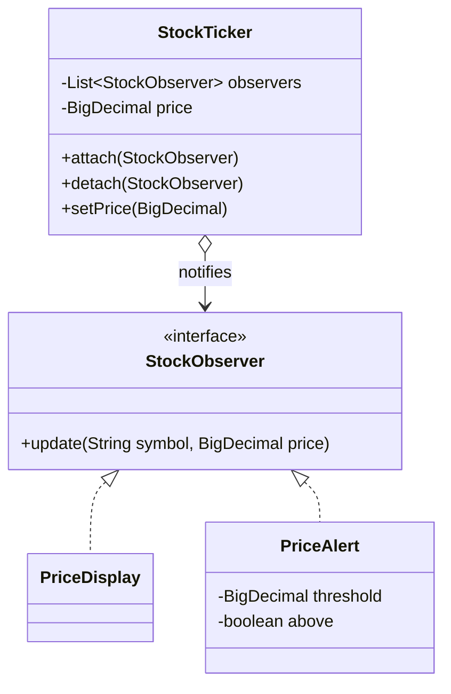
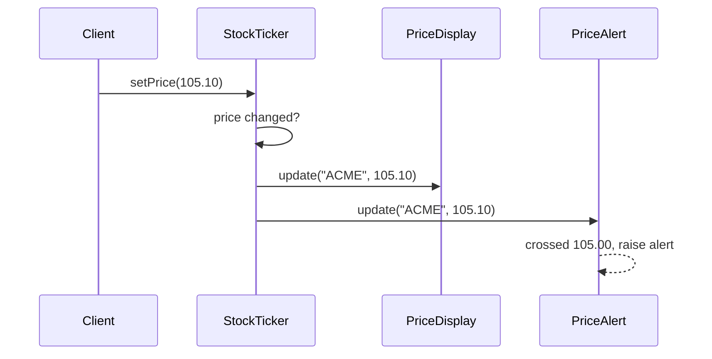
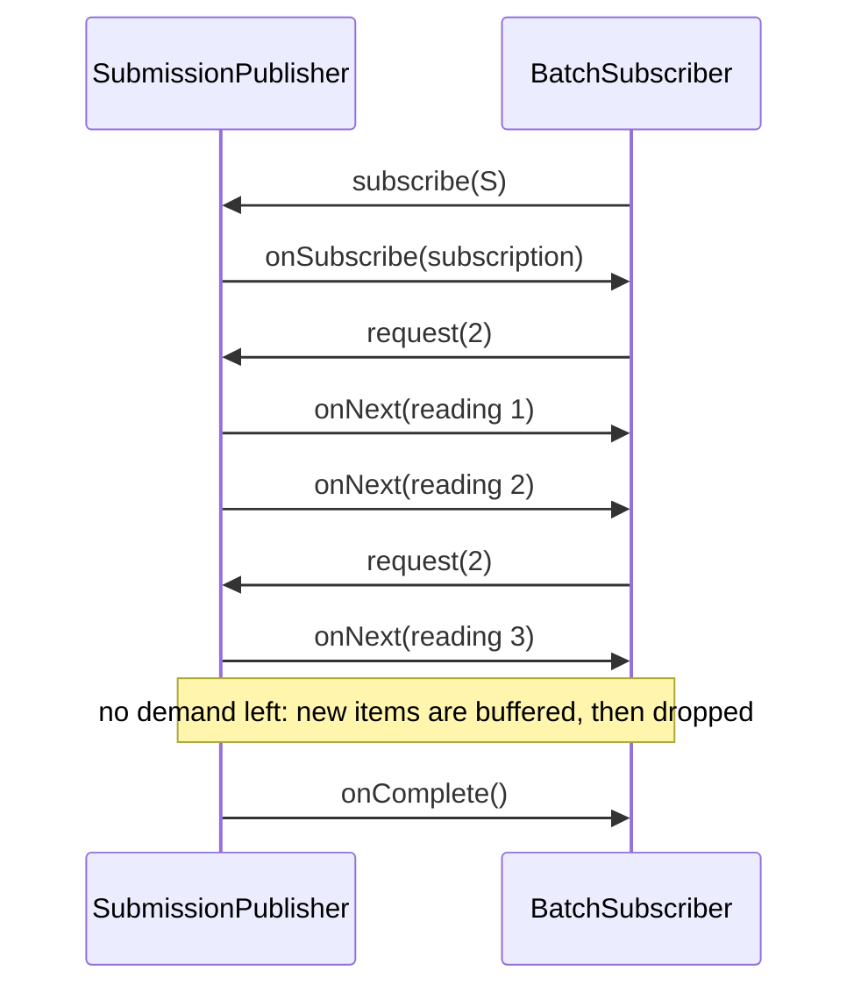
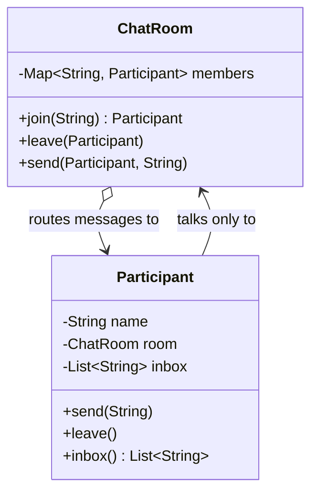
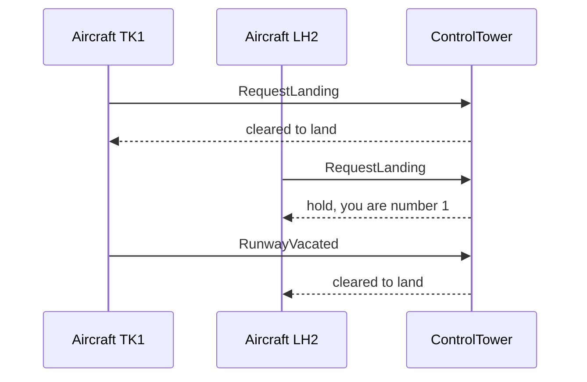
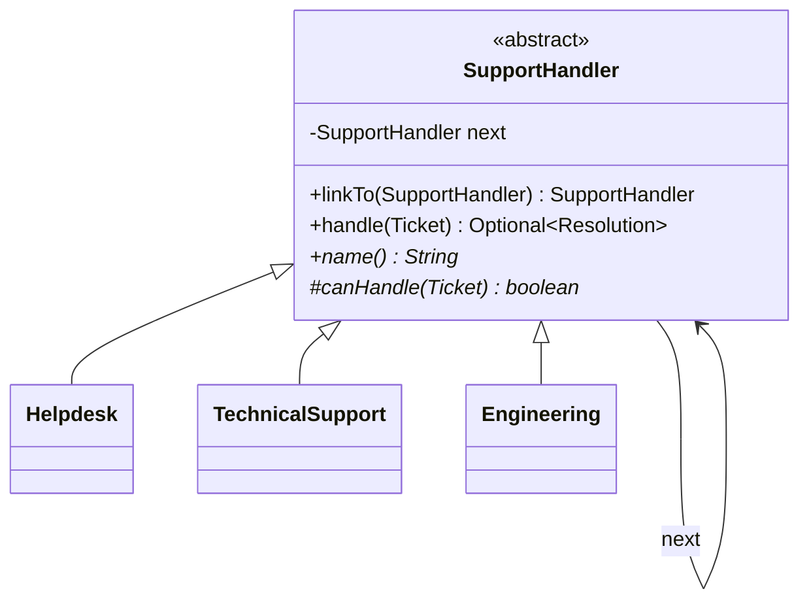
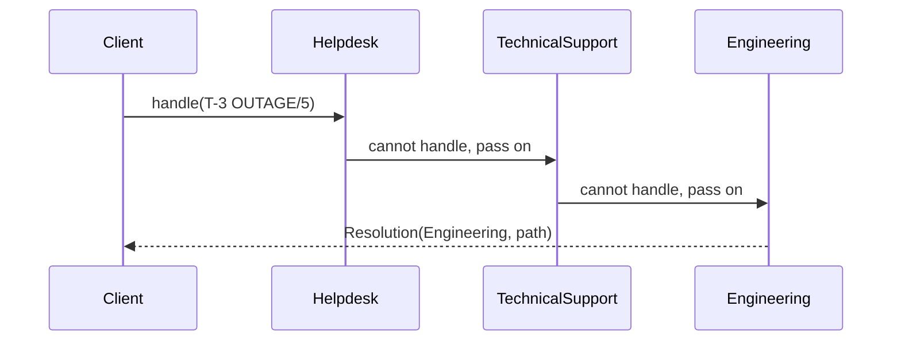
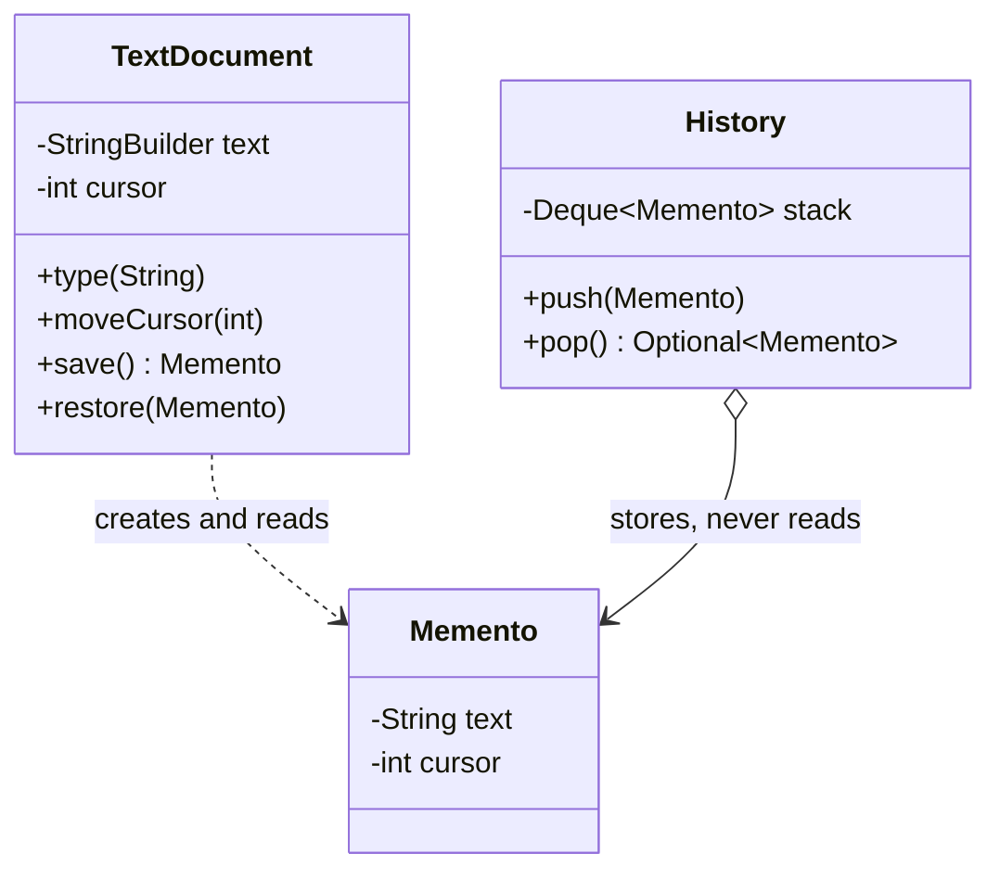

# Modül 07 — Davranışsal Kalıplar II: İletişim

> **9. Hafta** · Ön koşullar: m06 (lambda olarak Strategy, geri almalı Command), m05 (Facade), m03 (kompakt kuruculu record'lar) · Tahmini çalışma süresi: 6 saat
>
> Her örneği derlemeden çalıştırın: `java modules/m07-behavioral-communication/src/main/java/io/github/aliturgutbozkurt/patterns/m07/examples/<yol>/<Demo>.java` (JDK 27)

## Öğrenme çıktıları

Bu modülün sonunda şunları yapabilirsiniz:

1. Observer (Gözlemci) kalıbını klasik biçimiyle (özne + gözlemci arayüzü) ve modern biçimiyle (abonelikten çıkma
   tutamacı döndüren fonksiyonel dinleyiciler) **uygulamak**; unutulmuş dinleyici (lapsed listener) sızıntısını,
   bildirim sırasını ve yeniden girme (re-entrancy) tuzaklarını **açıklamak**.
2. `java.util.concurrent.Flow`'u `SubmissionPublisher` ile **kullanmak**: talebi (`request(n)`), geri basıncı
   (back-pressure), tamponlamayı ve düşürmeyi, `onSubscribe → onNext* → (onComplete | onError)` protokolünü
   **açıklamak** — ve bunu deterministik olarak **test etmek**.
3. İş arkadaşları (colleague) arasındaki çoktan çoğa referansları kaldıran bir Mediator (Arabulucu) **uygulamak** ve
   onu bir olay veri yolu (event bus, Observer) ve bir Facade (Cephe, m05) ile **karşılaştırmak**.
4. Chain of Responsibility (Sorumluluk Zinciri) kalıbını hem bağlı işleyici nesneleriyle hem de birleştirilmiş
   fonksiyonlarla (middleware) **uygulamak**; "ilk işleyici kazanır", "her işleyici çalışır" ve "ilk hatada dur mu, tüm
   hataları topla mı" arasında **karar vermek**.
5. Memento (Hatıra) kalıbını opak klasik bir memento ile ve sıralı koleksiyon geçmişinde tutulan record anlık
   görüntüleriyle **uygulamak**; Memento tabanlı geri almayı Command tabanlı geri almayla (m06) **karşılaştırmak**.

## Motivasyon

m06 *algoritmaları* nesnelere koydu. Bu modül, nesnelerin birbirlerini tanımadan *nasıl konuştuğuyla* ilgilidir. Bir
fiyat değişir ve üç ekranın güncellenmesi gerekir; dört uçak tek bir pisti ister; bir istek, onu yanıtlayan koda
ulaşmadan önce kimlik doğrulama, günlükleme ve hata işlemeden geçmelidir; bir kullanıcı son beş düzenlemeyi geri almak
ister. Her göndericiyi her alıcıya doğrudan bağlamak kimsenin değiştiremeyeceği bir yumak yaratır. Bu haftanın dört
kalıbı bu kabloları dört farklı biçimde keser: **duyurmak** (Observer), **koordine etmek** (Mediator), **iletmek**
(Chain of Responsibility) ve **hatırlamak** (Memento). Bitirme projesi bu hafta başlıyor — onun alan olayları (domain
events) ve istek hattı bu fikirlerden ikisini doğrudan yeniden kullanır.

## Observer

### Problem

Bir borsa göstergesinin (ticker) fiyatı değişir. Bir fiyat ekranı, bir alarm ve — gelecek ay — bir grafik ile bir alım
satım botu tepki vermelidir. Gösterge `display.show(...)`, `alert.check(...)` ve `chart.plot(...)` çağrılarını kendisi
yaparsa her yeni ekran göstergeyi değiştirmek demektir ve gösterge bunların hepsi olmadan yeniden kullanılamaz.

### Amaç

> Bir nesnenin (**özne**, subject) durumu değiştiğinde ona bağlı tüm nesnelerin (**gözlemciler**) — öznenin onların
> somut sınıflarını bilmesine gerek kalmadan — kendiliğinden bilgilendirileceği bire çok bir bağımlılık tanımlamak.

### Yapı





### Klasik Java

Özne yalnızca `StockObserver` arayüzünü bilir. Bu **itme (push)** modelidir: özne veriyi bildirimle birlikte gönderir
(**çekme (pull)** modeli özneyi iletir ve gözlemcilerin ihtiyaç duyduklarını sormasına izin verirdi):

```java
// file: examples/observer/classic/StockObserver.java
@FunctionalInterface
public interface StockObserver {

    /** Called after the price of {@code symbol} changed. */
    void update(String symbol, BigDecimal price);
}
```

İki ayrıntı özneyi sağlamlaştırır: hiçbir şey değişmediğinde bildirim yapılmaz ve dolaşım bir **anlık görüntü
(snapshot)** üzerinde yapılır; böylece bir gözlemci, bilgilendirilirken `ConcurrentModificationException` olmadan
kendini ayırabilir:

```java
// file: examples/observer/classic/StockTicker.java
    public void setPrice(BigDecimal newPrice) {
        Objects.requireNonNull(newPrice, "newPrice");
        if (price.compareTo(newPrice) == 0) {
            return;
        }
        price = newPrice;
        notifyObservers();
    }

    private void notifyObservers() {
        // Iterate over a snapshot: an observer may attach or detach (itself) while being notified.
        for (StockObserver observer : List.copyOf(observers)) {
            observer.update(symbol, price);
        }
    }
```

Gözlemciler kendi durumlarını tutabilir. Alarm yalnızca fiyat eşiği *aştığında* çalar, eşiğin üstündeki her
güncellemede değil:

```java
// file: examples/observer/classic/PriceAlert.java
    @Override
    public void update(String symbol, BigDecimal price) {
        boolean nowAbove = price.compareTo(threshold) >= 0;
        if (nowAbove != above) {
            String direction = nowAbove ? " rose above " : " fell below ";
            alerts.accept("ALERT " + symbol + direction + threshold.toPlainString() + ": " + price.toPlainString());
        }
        above = nowAbove;
    }
```

```text
ACME 101.50
ACME 104.20
ACME 105.10
ALERT ACME rose above 105.00: 105.10
ACME 106.00
-- display detached --
ALERT ACME fell below 105.00: 99.80
```

JDK bir zamanlar tam olarak bu biçimi `java.util.Observable`/`Observer` olarak sunuyordu. Artık
`@Deprecated(since = "9")`: `Observable` bir sınıftır (ondan kalıtım almanız gerekir), `setChanged()` metodu
protected'dır, olaylar tipsiz `Object`'lerdir ve bildirim sırası belirtilmemiştir.

### Modern Java 27

**Fonksiyonel dinleyiciler ve bir abonelik tutamacı.** Tek metotlu bir gözlemci, bir `Consumer<PriceChange>`'ten
ibarettir. Abone olmak, `close()` metodu denetlenen (checked) istisna fırlatmayan ve idempotent olan bir
`Subscription` döndürür:

```java
// file: examples/observer/modern/Subscription.java
@FunctionalInterface
public interface Subscription extends AutoCloseable {

    /** Stops delivery to the listener; calling it again does nothing. */
    @Override
    void close();
}
```

```java
// file: examples/observer/modern/Ticker.java
    public Subscription onPriceChange(Consumer<? super PriceChange> listener) {
        var registration = new Registration(Objects.requireNonNull(listener, "listener"));
        registrations.add(registration);
        return () -> registrations.remove(registration); // removing twice is harmless: idempotent
    }
    // ...
        for (Registration registration : registrations) {
            try {
                registration.listener.accept(change);
            } catch (RuntimeException e) {
                errorHandler.accept(e); // not swallowed: reported, and the remaining listeners still run
            }
        }
```

Burada üç karar görünür. Her abonelik kendi `Registration` nesnesini alır; böylece bir aboneliği kapatmak *aynı*
lambdanın ikinci kaydını asla kaldırmaz. `registrations` bir `CopyOnWriteArrayList`'tir: teslimat bir anlık görüntü
üzerinde dolaşır, dolayısıyla teslimat sırasında eklenen bir dinleyici yalnızca sonraki olayları alır. Ve hata veren
tek bir dinleyici, ondan sonrakilerin hepsini susturmak yerine enjekte edilen bir hata işleyiciye bildirilir.

Tutamaç **unutulmuş dinleyici (lapsed listener) sızıntısını** giderir: özne, kaldırılana kadar her dinleyiciyi — ve
dinleyicinin işaret ettiği her şeyi — canlı tutar. try-with-resources ile kaldırma işlemi unutulamaz; gövde onu hiç
kullanmadığı için kaynak değişkeni isimsiz `_` değişkenidir:

```java
// file: examples/observer/ModernTickerDemo.java
        try (var _ = ticker.onPriceChange(ModernTickerDemo::chart)) {
```

```text
chart: ACME 100.00 -> 101.50 (+1.50)
error handler: ticker feed rejected ACME 101.50
log:   ACME 101.50
chart: ACME 101.50 -> 99.00 (-2.50)
error handler: ticker feed rejected ACME 99.00
log:   ACME 99.00
-- chart closed (try-with-resources) --
error handler: ticker feed rejected ACME 98.25
log:   ACME 98.25
```

**JDK'nın bean'ler için kendi gözlemcisi.** `java.beans.PropertyChangeSupport` (Swing ve IDE araçları kullanır),
özellik adını eski ve yeni değerle birlikte teslim eder ve eşit bir değer atandığında hiçbir şey tetiklemez:

```java
// file: examples/observer/beans/Thermostat.java
        int oldTarget = target;
        target = newTarget;
        changes.firePropertyChange("target", oldTarget, newTarget);
```

```java
// file: examples/observer/ThermostatDemo.java
        thermostat.addPropertyChangeListener(event -> print("app:     ", event));            // every property
        thermostat.addPropertyChangeListener("target", event -> print("display: ", event)); // one property
```

```text
app:     target 20 -> 22
display: target 20 -> 22
app:     mode OFF -> HEAT
(setting target 22 again fires nothing)
app:     target 22 -> 19
display: target 22 -> 19
```

**Tipli bir olay veri yolu (event bus).** Bitirme projesinin çevrim içi mağazası PatternShop'ta yayıncılar ve
işleyiciler paylaştıkları özneyi bile bilmemelidir. Olay veri yolu, olayları `sealed` (mühürlü) bir record hiyerarşisi
(`OrderPlaced`, `PaymentFailed`, `OrderShipped`) oluşturan bir Observer'dır; işleyiciler tipe göre abone olur ve
`ShopEvent` için bir işleyici her şeyi görür — eksiksiz (exhaustive) bir `switch` ile; böylece yeni bir olay tipi sessizce
yok sayılan bir olay değil, bir derleme hatası olur:

```java
// file: examples/observer/eventbus/AuditLog.java
    @Override
    public void accept(ShopEvent event) {
        out.accept(switch (event) {
            case OrderPlaced(var id, var customer, var total) -> "order " + id + " placed by " + customer
                    + ", total " + total.toPlainString();
            case PaymentFailed(var id, var reason) -> "payment failed for " + id + ": " + reason;
            case OrderShipped(var id, var tracking) -> "order " + id + " shipped, tracking " + tracking;
        });
    }
```

Veri yolu henüz başka bir olayı teslim ederken bir işleyici yeni bir olay yayınlarsa ne olur? Saf bir veri yolu
özyinelemeye girer: yeni olay teslim edilmekte olanın önüne geçer ve sonraki işleyiciler olayları yanlış sırada görür.
Bu veri yolu onu kuyruğa alır:

```java
// file: examples/observer/eventbus/EventBus.java
    public void publish(ShopEvent event) {
        pending.addLast(Objects.requireNonNull(event, "event"));
        if (dispatching) {
            return; // called from inside a handler: the running loop below will deliver it next
        }
        dispatching = true;
        try {
            while (!pending.isEmpty()) {
                dispatch(pending.removeFirst());
            }
        } finally {
            dispatching = false;
        }
    }
```

```java
// file: examples/observer/EventBusDemo.java
        bus.subscribe(OrderPlaced.class, placed -> {
            System.out.println("warehouse: shipping " + placed.orderId());
            bus.publish(new OrderShipped(placed.orderId(), "TRK-" + placed.orderId())); // queued, not recursive
        });
```

Denetim günlüğü "placed"ı yine "shipped"ten önce görür ve kimsenin abone olmadığı bir olay kaybolmak yerine *ölü olay
(dead event)* olarak saklanır:

```text
warehouse: shipping A-1
audit:     order A-1 placed by ada, total 42.00
audit:     order A-1 shipped, tracking TRK-A-1
audit:     payment failed for A-2: card declined
mailer:    e-mail sent: payment for A-2 failed (card declined)
dead events: [OrderPlaced[orderId=A-0, customer=alan, total=10.00]]
```

### Flow ile geri basınç

Bir dinleyiciye her olay öznenin hızında *itilir*. Bir sensör okumaları bir abonenin saklayabileceğinden hızlı
üretirse bir şeyin feda edilmesi gerekir: sınırsız bir kuyruk bellek bitene kadar büyür. Reactive Streams — Java 9'dan
beri JDK'da `java.util.concurrent.Flow` olarak — **talep (demand)** ekler: bir abone en fazla `request(n)` ile istediği
kadar öğe alır. İşte bu **geri basınçtır (back-pressure)**.



Protokol her zaman `onSubscribe → onNext* → (onComplete | onError)` şeklindedir. Bir `BatchSubscriber` kendi hızını
denetler: abone olurken bir parti, bir sonrakini ancak mevcut parti geldiğinde ister:

```java
// file: examples/observer/flow/BatchSubscriber.java
    @Override
    public void onNext(T item) {
        received.add(item);
        signals.add("onNext " + item);
        remainingInBatch--;
        if (remainingInBatch == 0) {
            requestBatch();
        }
    }
    // ...
    private void requestBatch() {
        remainingInBatch = batchSize;
        requestCount++;
        signals.add("request(" + batchSize + ")"); // logged first: with a caller-runs executor request() delivers at once
        subscription.request(batchSize);
    }
```

Yayıncı, JDK'nın `SubmissionPublisher`'ıdır. Bir öğeyi teslim etmenin iki yolu vardır. `submit`, bir abonenin tamponu
doluyken yayınlayan iş parçacığını **bloklar**; `offer` asla bloklamaz — onun yerine bir düşürme işleyicisini çağırır.
Akış (feed) öğeleri `offer` ile sunar ve düşürmek zorunda kaldıklarını sayar:

```java
// file: examples/observer/flow/TemperatureFeed.java
    public void publish(Reading reading) {
        publisher.offer(Objects.requireNonNull(reading, "reading"), (subscriber, item) -> {
            dropped.incrementAndGet();
            return false; // do not retry
        });
    }
```

**Eşzamansız kodu deterministik test etmek.** Varsayılan olarak `SubmissionPublisher`, teslimatı
`ForkJoinPool.commonPool()` üzerinde yapar; bu yüzden çıktı sırası iş parçacığı zamanlamasına bağlıdır. *Çağıranda
çalışan (caller-runs)* bir yürütücü, `Runnable::run`, verin: her `onSubscribe`, `onNext` ve `onComplete`; `subscribe`,
`publish`, `request` ve `close` içinde eşzamanlı olarak gerçekleşir. Uyku (sleep) yok, mandal (latch) yok:

```java
// file: examples/observer/FlowDemo.java
        var batches = new BatchSubscriber<Reading>(2);
        try (var feed = new TemperatureFeed(Runnable::run, 4)) {
            feed.subscribe(batches);
            publishAll(feed);
        }
```

Hızlı bir abone ve hiçbir şey istememiş yavaş bir abone olduğunda, 2'lik bir tampon yavaş abone için iki okumayı tutar
ve diğer üçü düşürülür — yalnızca onun için. Tampondaki öğeler yine de `onComplete`'ten önce teslim edilir:

```text
== 1. demand in batches of 2
  onSubscribe
  request(2)
  onNext greenhouse#1 20.0C
  onNext greenhouse#2 22.5C
  request(2)
  onNext greenhouse#3 25.0C
  onNext greenhouse#4 17.5C
  request(2)
  onNext greenhouse#5 20.0C
  onComplete
== 2. a slow subscriber and a buffer of 2
  fast received 5, slow received 0, dropped 3
  slow: onSubscribe
  slow: request(5)
  slow: onNext greenhouse#1 20.0C
  slow: onNext greenhouse#2 22.5C
  slow: onComplete
== 3. processor stage C -> F
  greenhouse#1 68.0F
  greenhouse#2 72.5F
  greenhouse#3 77.0F
  greenhouse#4 63.5F
  greenhouse#5 68.0F
== 4. the sensor fails
  onSubscribe
  request(2)
  onNext greenhouse#1 20.0C
  onError IllegalStateException: sensor offline
```

Bir **işlemci (processor)** aynı anda hem abone hem yayıncıdır — bir hat aşaması. Yukarı akıştan her seferinde bir öğe
ister ve `submit` kullanır; `submit`'in bloklaması, geri basıncın yukarı akışa tam olarak böyle taşınmasıdır:

```java
// file: examples/observer/flow/CelsiusToFahrenheit.java
    @Override
    public void onNext(Reading reading) {
        submit(new FahrenheitReading(reading.sensor(), reading.sequence(), reading.celsius() * 9 / 5 + 32));
        upstream.request(1);
    }
```

(Çağıranda çalışan bir yürütücüyle, hiç istek yapmayan bir aboneye `submit` kendi iş parçacığını sonsuza dek
bloklardı — bu yüzden demolar talebin sınırlı olduğu her yerde `offer` kullanır ve gerçek havuz üzerinde tam olarak bir
test çalışır; o test `consume(...)`'un döndürdüğü future'ı 5 saniyelik zaman aşımıyla bekler.)

### Gerçek dünyada kullanımı

`java.beans.PropertyChangeSupport`, Swing/AWT dinleyicileri (`ActionListener`), JavaFX özellikleri,
`java.util.concurrent.Flow` ve `SubmissionPublisher`, `java.net.http.HttpClient` (gövde yayıncıları/aboneleri `Flow`
tipleridir), Spring'in `ApplicationEventPublisher`'ı ve `@EventListener`'ı, Guava'nın `EventBus`'ı ve Reactive Streams
arayüzleri üzerine kurulu her reaktif kütüphane (Reactor, RxJava).

### Tuzaklar ve ne zaman KULLANILMAMALI

- **Unutulmuş dinleyiciler** bellek sızdırır: her zaman bir abonelikten çıkma tutamacı döndürün ve kullanın.
- **Sıra ve yeniden girme**: bildirim sırasını tanımlayın, bir anlık görüntü üzerinde dolaşın, bir işleyicinin içinden
  yayınlanan olayları kuyruğa alın.
- **Hata veren tek bir dinleyici** diğerlerini bozmamalıdır — yakalayın, bildirin, devam edin (asla sessizce yutmayın).
- **Çığ etkisi**: başka özneleri değiştiren gözlemciler, uzun ve hata ayıklaması zor güncelleme zincirleri
  tetikleyebilir.
- Tek ve bilinen bir alıcı için Observer gerekmez — onu doğrudan çağırın.
- `Flow`, üretici/tüketici arasında gerçek bir hız farkı olan akışlar içindir; bir avuç UI olayı için fazladır.

### İlgili kalıplar

**Mediator**, Observer'ın dağıttığı iletişimi merkezileştirir (bir olay veri yolu ikisinin arasında durur).
**Command** (m06) nesneleri çoğu zaman bir olay veri yolunun taşıdığı şeydir. **Chain of Responsibility** alıcılara
biri isteği işleyene kadar tek tek sorar; Observer ise hepsine haber verir.

## Mediator

### Problem

Dört uçak tek bir pisti paylaşır. Her uçak pistin boş olup olmadığını diğer her uçağa sorarsa her uçak diğer her uçağı
tanımak zorundadır: n·(n−1) bağlantı ve sıraya koyma kuralı her uçağa kopyalanır. Aynı şey, bir onay kutusunun bir
metin alanını, onun da bir düğmeyi etkinleştirdiği bir iletişim kutusunda olur.

### Amaç

> Bir **nesne kümesinin nasıl etkileştiğini kapsülleyen** bir nesne tanımlamak. İş arkadaşları (colleague) birbirlerine
> değil yalnızca arabulucuya başvurur; böylece etkileşimleri tek bir yerde değiştirilebilir.

### Yapı





### Klasik Java

Katılımcılar odaya bir referans tutar, başka hiçbir şeye değil; yönlendirme kuralları odanındır — herkese yayın,
doğrudan `@isim` mesajları ve alıcı bilinmiyorsa gönderene geri dönen bir bildirim:

```java
// file: examples/mediator/chat/ChatRoom.java
    public void send(Participant sender, String text) {
        Objects.requireNonNull(text, "text");
        if (members.get(sender.name()) != sender) {
            throw new IllegalStateException(sender.name() + " is not in " + name);
        }
        if (text.startsWith("@")) {
            int space = text.indexOf(' ');
            String addressee = space < 0 ? text.substring(1) : text.substring(1, space);
            String body = space < 0 ? "" : text.substring(space + 1);
            Participant recipient = members.get(addressee);
            if (recipient == null) {
                sender.receive(name + ": nobody called '" + addressee + "' is here");
            } else {
                recipient.receive("(private) " + sender.name() + ": " + body);
            }
            return;
        }
        for (Participant member : members.values()) {
            if (member != sender) {
                member.receive(sender.name() + ": " + text);
            }
        }
    }
```

```java
// file: examples/mediator/chat/Participant.java
    /** Sends through the room; the room decides who receives it. */
    public void send(String text) {
        room.send(this, text);
    }
```

Bir test, `Participant`'ın `Participant` tipinde hiçbir alan bildirmediğini yansıma (reflection) ile denetler — iş
arkadaşları gerçekten ayrıştırılmıştır:

```text
ada []
bob [ada: hello everyone, ada: cem left early]
cem [ada: hello everyone, (private) bob: lunch at noon?, #patterns: nobody called 'dave' is here]
```

### Modern Java 27

Klasik biçimde iş arkadaşları, arabulucunun çözümlediği bir dizeyle `mediator.notify(this, "someEvent")` çağırır.
İstek record'larından oluşan `sealed` bir arayüzle arabulucu, olası her mesajı record desenleriyle tek bir
**eksiksiz** `switch` içinde işler — bir istek tipi ekleyin, derleyici nerede işlenmesi gerektiğini gösterir:

```java
// file: examples/mediator/atc/TowerRequest.java
public sealed interface TowerRequest permits RequestLanding, RequestTakeoff, DeclareEmergency, RunwayVacated {
```

```java
// file: examples/mediator/atc/ControlTower.java
        switch (request) {
            case RequestLanding(var aircraft) -> useRunwayOrWait(aircraft, "cleared to land");
            case RequestTakeoff(var aircraft) -> useRunwayOrWait(aircraft, "cleared for takeoff");
            case DeclareEmergency(var aircraft) -> {
                queue.removeIf(waiting -> waiting.aircraft() == aircraft);
                if (onRunway == null) {
                    clear(aircraft, "cleared for emergency landing");
                } else {
                    queue.addFirst(new Waiting(aircraft, "cleared for emergency landing")); // jumps the queue
                    transmit(aircraft, "emergency acknowledged, you are number 1");
                }
            }
            case RunwayVacated(var aircraft) -> {
                if (onRunway != aircraft) {
                    throw new IllegalStateException(aircraft + " is not on the runway");
                }
                onRunway = null;
                Waiting next = queue.pollFirst();
                if (next != null) {
                    clear(next.aircraft(), next.clearance());
                }
            }
        }
```

Kule paylaşılan kaynağı (pisti) ve bekleme kuyruğunu tutar; aynı anda en fazla bir uçağa izin verilir:

```text
TK1 -> tower: RequestLanding
tower -> TK1: cleared to land
LH2 -> tower: RequestLanding
tower -> LH2: hold, you are number 1
BA3 -> tower: RequestTakeoff
tower -> BA3: hold, you are number 2
AF4 -> tower: DeclareEmergency
tower -> AF4: emergency acknowledged, you are number 1
TK1 -> tower: RunwayVacated
tower -> AF4: cleared for emergency landing
AF4 -> tower: RunwayVacated
tower -> LH2: cleared to land
LH2 -> tower: RunwayVacated
tower -> BA3: cleared for takeoff
BA3 -> tower: RunwayVacated
```

### GUI formları

Mediator, GUI araç takımlarında doğdu. Bir kayıt iletişim kutusunda "business account" şirket alanını etkinleştirir ve
"Submit" yalnızca her şey geçerli olduğunda etkinleşir. Her bileşen (widget) yalnızca `form.changed(this)` çağırır; tüm
bağımlılıklar tek bir metotta yaşar (örnek arayüzsüzdür — Swing gerekmez):

```java
// file: examples/mediator/form/SignUpForm.java
    void changed(Widget source) {
        if (source == submit) {
            submissions.add(email.text() + (business.isChecked() ? " (business: " + company.text() + ")" : " (personal)"));
            return;
        }
        if (source == business) {
            if (!business.isChecked()) {
                company.clear();
            }
            company.setEnabled(business.isChecked());
        }
        submit.setEnabled(isComplete());
    }
```

```text
new form           -> submit disabled, company disabled
e-mail + password  -> submit disabled, company disabled
terms accepted     -> submit enabled, company disabled
business account   -> submit disabled, company enabled ''
company named      -> submit enabled, company enabled 'Analytical Engines'
personal again     -> submit enabled, company disabled
submitted: [ada@example.com (personal)]
```

### Gerçek dünyada kullanımı

`javax.swing.ButtonGroup` (bir radyo düğmesini seçmek diğerlerinin seçimini kaldırır — düğmeler birbirine asla
başvurmaz), masaüstü araç takımlarındaki iletişim kutusu denetleyicileri, `java.util.concurrent.Exchanger` (iki iş
parçacığı onun aracılığıyla buluşur), sohbet sunucuları ve mesaj aracıları, hava trafik kontrolü ve MVC çatılarındaki
"controller"/"coordinator" nesneleri.

### Tuzaklar ve ne zaman KULLANILMAMALI

- **Tanrı arabulucu (god mediator)**: tüm mantık arabulucuya kayar ve sonunda sistemin en zor sınıfı olur. Onu
  *koordinasyonla* sınırlı tutun; iş kuralları iş arkadaşlarına ya da servislere aittir.
- Birbirini doğrudan çağıran iki iş arkadaşının bir arabulucuya ihtiyacı yoktur.
- Arabulucu tek bir hata noktasıdır ve iş parçacıkları arasında paylaşılıyorsa bir darboğazdır.

### İlgili kalıplar

**Observer**: iş arkadaşları arabulucuyu çoğu zaman olaylarla bilgilendirir; bir olay veri yolu yalnızca yayın yapan
bir arabulucudur. **Facade** (m05) de birkaç nesnenin önünde durur ama iletişim tek yönlüdür — istemciler cepheyi
çağırır, alt sistem onu tanımaz — oysa bir arabulucuyu iş arkadaşları tanır ve o da onlara yanıt verir.

## Chain of Responsibility

### Problem

Bir destek talebi yardım masası, teknik destek ya da yalnızca mühendislik tarafından çözülebilir. Müşterinin kimin neyi
çözdüğünü bilmesi gerekmemelidir ve yükseltme (escalation) kuralları her çeyrekte değişir. Her düzeyi adıyla anan, iç içe
`if`'lerle dolu tek bir metot her yeniden yapılanmada değişirdi.

### Amaç

> Bir isteğin göndericisini alıcısına bağlamaktan, **isteği işleme şansını birden fazla nesneye vererek** kaçınmak.
> Alıcıları zincirleyin ve isteği bir nesne işleyene kadar zincir boyunca iletin.

### Yapı





### Klasik Java

Her işleyici ya talebi çözer ya da ardılına iletir; yol, ilerlerken kaydedilir:

```java
// file: examples/chain/support/classic/SupportHandler.java
    private Optional<Resolution> handle(Ticket ticket, List<String> path) {
        path.add(name());
        if (canHandle(ticket)) {
            return Optional.of(new Resolution(ticket.id(), name(), path));
        }
        return next == null ? Optional.empty() : next.handle(ticket, path);
    }
```

```java
// file: examples/chain/support/classic/Helpdesk.java
    @Override
    protected boolean canHandle(Ticket ticket) {
        return (ticket.topic() == Topic.PASSWORD || ticket.topic() == Topic.BILLING) && ticket.severity() <= 2;
    }
```

Kimse isteği işlemezse ne olur? Zincir bunu açıkça söylemelidir — burada `Optional.empty()` ile — isteği sessizce
düşürmek yerine.

### Modern Java 27

`Optional<Resolution>` döndüren bir işleyici — "bir sonuç ya da ben değilim" — bir fonksiyondur ve bu tür iki fonksiyon
`Optional.or` ile birleşir:

```java
// file: examples/chain/support/modern/TicketHandler.java
    default TicketHandler orElse(TicketHandler next) {
        Objects.requireNonNull(next, "next");
        TicketHandler first = this;
        List<String> levels = Stream.concat(first.levels().stream(), next.levels().stream()).toList();
        return new TicketHandler() {
            @Override
            public Optional<Resolution> handle(Ticket ticket) {
                return first.handle(ticket)
                        .or(() -> next.handle(ticket).map(resolution -> resolution.escalatedFrom(first.levels())));
            }
```

```java
// file: examples/chain/SupportEscalationDemo.java
        TicketHandler modern = SupportLevels.helpdesk()
                .orElse(SupportLevels.technicalSupport())
                .orElse(SupportLevels.engineering());
```

Yükseltme yolu olmasaydı `orElse` tek satır olurdu: `ticket -> handle(ticket).or(() -> next.handle(ticket))`. Bağlı
zincir yolu bedavaya elde ediyordu (her nesne iletirken adını ekler); durumsuz fonksiyonlar onu açıkça taşımak
zorundadır, `levels()` bu yüzden var. Parametreli bir test iki zinciri aynı talep tablosu üzerinde çalıştırır ve eşit
sonuç ister; bir çağrı sayacı, karar verenden sonraki işleyicilerin hiç çağrılmadığını kanıtlar:

```text
classic chain (linked objects):
  T-1 PASSWORD/1 -> Helpdesk via [Helpdesk]
  T-2 BUG/2 -> Technical support via [Helpdesk, Technical support]
  T-3 OUTAGE/5 -> Engineering via [Helpdesk, Technical support, Engineering]
  T-4 LEGAL/1 -> unresolved (end of chain)
modern chain (composed functions):
  T-1 PASSWORD/1 -> Helpdesk via [Helpdesk]
  T-2 BUG/2 -> Technical support via [Helpdesk, Technical support]
  T-3 OUTAGE/5 -> Engineering via [Helpdesk, Technical support, Engineering]
  T-4 LEGAL/1 -> unresolved (end of chain)
same resolutions: true
```

### Ara katman yazılımı (middleware)

Bir sunucuda her halka ardılından **önce ve sonra** iş yapabilir ya da isteği durdurabilir. Servlet
`Filter`/`FilterChain.doFilter` ve JDK'nın `com.sun.net.httpserver.Filter.Chain`'i böyle çalışır. Bir middleware,
işleyiciden işleyiciye bir fonksiyondur:

```java
// file: examples/chain/middleware/Middleware.java
@FunctionalInterface
public interface Middleware {

    Handler wrap(Handler next);
}
```

```java
// file: examples/chain/middleware/Pipeline.java
    public static Handler of(List<Middleware> middlewares, Handler endpoint) {
        Handler handler = Objects.requireNonNull(endpoint, "endpoint");
        for (Middleware middleware : middlewares.reversed()) { // wrap from the inside out
            handler = middleware.wrap(handler);
        }
        return handler;
    }
```

Listedeki ilk middleware en dıştakidir: istekler listeyi bildirilen sırayla geçer, yanıtlar ters sırayla döner. Kimlik
doğrulama kısa devre yapar — geçerli bir belirteç (token) olmadan uç nokta asla çağrılmaz:

```java
// file: examples/chain/middleware/Middlewares.java
    public static Middleware authentication(Set<String> tokens) {
        Set<String> known = Set.copyOf(tokens);
        return next -> request -> request.header("Authorization")
                .filter(value -> value.startsWith("Bearer ") && known.contains(value.substring("Bearer ".length())))
                .map(_ -> next.handle(request))
                .orElseGet(() -> new Response(401, "unauthorized"));
    }
```

```java
// file: examples/chain/MiddlewareDemo.java
        Handler server = Pipeline.of(List.of(
                Middlewares.logging(log),
                Middlewares.errorBoundary(),
                Middlewares.authentication(Set.of("s3cret")),
                Middlewares.requestId(() -> "req-" + ids.incrementAndGet())), endpoint);
```

```text
-> GET /orders
<- 200 GET /orders
   200 orders for req-1
-> GET /orders
<- 401 GET /orders
   401 unauthorized
-> GET /crash
<- 500 GET /crash
   500 internal error: database down
```

Sıra önemlidir: `logging` en dıştadır, bu yüzden 401'i ve 500'ü de günlüğe yazar; `errorBoundary`, `authentication`'ın
dışında durur, bu yüzden hata veren bir belirteç denetimini de yakalardı.

### Doğrulama zincirleri

Doğrulama, politikanın bir seçim olduğu bir zincirdir. **Tüm hataları topla (collect-all)**: her halka çalışır ve tüm
hatalar raporlanır (formlar için iyi). **İlk hatada dur (fail-fast)**: ilk başarısızlık zinciri durdurur (sonraki
denetimler pahalıysa ya da öncekilere bağlıysa iyi):

```java
// file: examples/chain/validation/Validator.java
    default Validator<T> and(Validator<? super T> next) {
        Objects.requireNonNull(next, "next");
        return value -> ValidationResult.merge(validate(value), next.validate(value));
    }

    /** Fail fast: runs {@code next} only if this validator passed. */
    default Validator<T> andThen(Validator<? super T> next) {
        Objects.requireNonNull(next, "next");
        return value -> switch (validate(value)) {
            case Valid _ -> next.validate(value);
            case Invalid invalid -> invalid;
        };
    }
```

```text
SignUp[email=ada.example.com, password=short, age=16]
  collect-all: Invalid[errors=[email must contain @, password must have at least 8 characters, password must contain a digit, age must be at least 18]]
  fail-fast:   Invalid[errors=[email must contain @]]
SignUp[email=ada@example.com, password=s3cret-pass, age=36]
  collect-all: Valid[]
  fail-fast:   Valid[]
```

### Gerçek dünyada kullanımı

Servlet `Filter` ve `FilterChain`, `com.sun.net.httpserver.Filter`, Spring Security'nin filtre zinciri, günlükleme
çatıları (bir günlük olayı, logger hiyerarşisinde yukarı doğru appender'larına ilerler), `java.util.logging.Logger`
üst işleyicileri, istisna işlemenin kendisi (en içteki önce olmak üzere bir `catch` blokları yığını) ve GUI araç
takımlarında olay kabarcıklanması (event bubbling).

### Tuzaklar ve ne zaman KULLANILMAMALI

- **Kimse işlemez**: zincirin sonunun ne anlama geldiğine karar verin — varsayılan bir işleyici, açık bir "çözülemedi"
  sonucu ya da bir istisna — ve bunu test edin.
- **Sıra hataları**: bir zincir ancak sırası kadar doğrudur (uç noktadan sonra gelen kimlik doğrulama işe yaramaz).
- **Hata ayıklaması zor**: bir istek sessizce on halkadan geçebilir; yolu kaydedin (`Resolution`'ın yaptığı gibi) ya da
  günlüğe yazın.
- Her isteği tam olarak tek ve sabit bir alıcı işliyorsa zincir yalnızca dolaylılık ekler.

### İlgili kalıplar

**Decorator** (Dekoratör, m04) middleware ile aynı "bir sonrakini sar" yapısına sahiptir, ama bir dekoratör her zaman
yetki devreder ve davranış ekler; bir zincir halkası ise devretmemeye karar verebilir. **Composite** (Bileşik, m05):
bir istek çoğu zaman bir bileşiğin üst zincirinde yukarı ilerler. **Command** (m06) nesneleri, zincirlerin tipik olarak
taşıdığı şeydir.

## Memento

### Problem

Bir metin editörünün geri almaya ihtiyacı vardır. Editörün durumu — metin, imleç, seçim — olması gerektiği gibi
private'tır. Bir geri alma yöneticisinin bu alanları okuyup yazmasına izin vermek kapsüllemeyi bozar; bütün editörü
kopyalamak ise gereğinden çok fazlasını kopyalar.

### Amaç

> Kapsüllemeyi ihlal etmeden **bir nesnenin iç durumunu yakalayıp dışarıya aktarmak**; böylece nesne daha sonra bu
> duruma geri döndürülebilir.

Roller şunlardır: **kaynak (originator)** (durumu kaydedilen nesne), **memento** (kaydedilen durum) ve **bekçi
(caretaker)** (mementoları saklar, içlerine asla bakmaz).

### Yapı



### Klasik Java

Memento; private alanları, private kurucusu olan ve hiçbir erişimcisi bulunmayan iç içe bir sınıftır. Onu yalnızca
çevreleyen kaynak oluşturabilir ya da okuyabilir; bekçi onu saklayıp geri verebilir, başka hiçbir şey yapamaz:

```java
// file: examples/memento/classic/TextDocument.java
    public static final class Memento {
        private final String text;
        private final int cursor;

        private Memento(String text, int cursor) {
            this.text = text;
            this.cursor = cursor;
        }
    }
    // ...
    public Memento save() {
        return new Memento(text.toString(), cursor);
    }

    public void restore(Memento memento) {
        Objects.requireNonNull(memento, "memento");
        text.setLength(0);
        text.append(memento.text);
        cursor = memento.cursor;
    }
```

```text
saved:  Hello|
saved:  Hello, world|
edited: >> |Hello, world
undo:   Hello, world|
undo:   Hello|
nothing to undo
```

### Modern Java 27

**Record anlık görüntüleri.** Bir record'un bileşenleri herkes tarafından okunabilir; dolayısıyla bir record memento
opak *değildir*. Opaklığı başka bir şeyle takas eder: değişmezdir, bu yüzden paylaşılabilir, `equals` ile
karşılaştırılabilir ve nasıl oluşturulmuş olursa olsun bir kez — kompakt kurucuda — doğrulanır:

```java
// file: examples/memento/editor/EditorSnapshot.java
public record EditorSnapshot(String text, int cursor, int selectionStart, int selectionEnd) {

    public EditorSnapshot {
        Objects.requireNonNull(text, "text");
        if (cursor < 0 || cursor > text.length()) {
            throw new IllegalArgumentException("cursor " + cursor + " outside 0.." + text.length());
        }
```

**Sıralı koleksiyonlarla sınırlı bir geçmiş.** Geri alma yığını en yeni anlık görüntüyü *sonda* tutar (`addLast`,
`removeLast`, `getLast`), en eskisini `removeFirst` ile unutur ve `reversed()` en yeniden eskiye bir görünüm verir —
metot adları tam olarak ne olduğunu söyler (JEP 431):

```java
// file: examples/memento/editor/UndoHistory.java
    public Optional<EditorSnapshot> undo(EditorSnapshot current) {
        if (undo.isEmpty()) {
            return Optional.empty();
        }
        redo.addLast(current);
        return Optional.of(undo.removeLast());
    }
    // ...
    public List<EditorSnapshot> history() {
        return List.copyOf(undo.reversed());
    }

    private void pushUndo(EditorSnapshot snapshot) {
        undo.addLast(snapshot);
        if (undo.size() > capacity) {
            undo.removeFirst(); // bounded: forget the oldest state
        }
    }
```

Yeni bir düzenleme yineleme (redo) yığınını temizler ve kapasite 3 iken yalnızca üç adım geri alınabilir:

```text
select -> Hello [world]
type -> Hello Java|
undo true -> Hello [world]
undo true -> Hello world|
redo true -> Hello [world]
type -> Hello there|
redo false -> Hello there|
history (newest first, capacity 3): [Hello [world], Hello world|, Hello|]
```

**Derin değişmezlik.** Bir record ancak bileşenleri kadar değişmezdir. `GameState` envanteri kompakt kurucuda
`List.copyOf` ile kopyalar; böylece kaydettikten sonra bir eşya almak kaydedilmiş oyunu asla değiştiremez:

```java
// file: examples/memento/game/GameState.java
        Objects.requireNonNull(position, "position");
        inventory = List.copyOf(inventory);
```

Kayıt yuvaları *yazılma* sırasında tutulan bir `SequencedMap`'tir. `putLast`, yeniden kaydedilen bir yuvayı sona taşır
(`put` eski konumunu korurdu), `lastEntry()` "Devam et"i gerçekleştirir ve `pollFirstEntry()` en uzun süre önce yazılmış
yuvayı çıkarır:

```java
// file: examples/memento/game/SaveSlots.java
    public Optional<String> save(String slot, GameState state) {
        Objects.requireNonNull(slot, "slot");
        Objects.requireNonNull(state, "state");
        Optional<String> evicted = Optional.empty();
        if (!slots.containsKey(slot) && slots.size() == maxSlots) {
            evicted = Optional.of(slots.pollFirstEntry().getKey()); // least recently written
        }
        slots.putLast(slot, state); // put() would keep an existing slot at its old position
        return evicted;
    }
    // ...
    public Optional<GameState> continueLatest() {
        return Optional.ofNullable(slots.lastEntry()).map(Map.Entry::getValue);
    }
```

```text
save castle:   level 1, health 100, at (3,4), inventory [sword]
save tower:    level 2, health 70, at (3,4), inventory [sword, key]
oops:          level 2, health 0, at (3,4), inventory [sword, key]
load castle:   level 1, health 100, at (3,4), inventory [sword]
slots:         [tower, castle]
continue:      level 1, health 100, at (5,5), inventory [sword]
save forest evicts tower
load tower:    no save slot 'tower'; known slots: [castle, cave, forest]
```

**Memento tabanlı ve Command tabanlı geri alma (m06).** Command ile geri alma *işlemleri* ve tersini saklar — küçüktür,
ama her komutun doğru bir `undo()`'ya ihtiyacı vardır. Memento ile geri alma *durumları* saklar — ters mantık yoktur,
her zaman doğrudur, ama her adım tam bir anlık görüntüye mal olur. Editörler çoğu zaman ikisini birleştirir: küçük
düzenlemeler için komutlar, kontrol noktası olarak dönemsel anlık görüntüler.

### Gerçek dünyada kullanımı

Editörlerde ve çizim araçlarında geri al/yinele, oyun kayıt yuvaları ve kontrol noktaları, veritabanı işlemleri ve
kayıt noktaları (savepoint; geri alma önceki bir durumu geri yükler), `java.io.Serializable` nesne anlık görüntüleri ve
her durumun bir anlık görüntü olduğu, "zamanda yolculuğun" eskileri saklamak anlamına geldiği UI çatılarındaki değişmez
durum depoları.

### Tuzaklar ve ne zaman KULLANILMAMALI

- **Bellek**: her anlık görüntü tam bir kopyadır — geçmişi sınırlayın (kapasite, çıkarma) ve değişmez parçaları
  paylaşın.
- **Yüzeysel anlık görüntüler**: bir mementonun içindeki değiştirilebilir bir liste, sonraki düzenlemelerin "kaydedilmiş"
  duruma sızmasına izin verir; en alta kadar `List.copyOf` / record kullanın.
- **Opaklık ve kolaylık**: bir record mementoyu bekçi okuyabilir — tek bir modülün içinde sorun değil, bir güven
  sınırının ötesinde sorun.
- Durum çok büyük ve değişiklikler küçükse Command tabanlı geri alma daha ucuzdur.

### İlgili kalıplar

**Command** (m06) geri almanın alternatif yoludur ve geri döndürmek için gerekenleri saklamak üzere çoğu zaman
mementoları *kullanır*. **Prototype** (Prototip, m03) yeni bir nesne oluşturmak için bir nesneyi kopyalar; Memento aynı
nesneyi geri yüklemek için durumunu kopyalar. **Iterator** (Yineleyici, m06) bir konumu hatırlamak için bir memento
kullanabilir.

## Bir iletişim kalıbı seçmek

| Durum | Kullanın |
|---|---|
| Bir değişiklik, gelip giden çok sayıda ilgili taraf | Observer (dinleyiciler + abonelik tutamacı) |
| Üretici tüketiciden hızlı, öğeler yığılmamalı | Talepli `Flow` (`request(n)`), `offer` + düşürme politikası |
| Yayıncılar ve işleyiciler birbirini hiç tanımamalı | Olay veri yolu (tipli, sealed olaylar) |
| Paylaşılan bir kaynak ya da kural üzerinde koordine olan çok sayıda nesne | Mediator |
| Birkaç işleyiciden birinin alması gereken bir istek | Chain of Responsibility (ilk olan kazanır) |
| Her halka isteği önce ve sonra görmeli | Middleware hattı |
| Tüm denetimler çalışmalı ve tüm hatalar raporlanmalı | Doğrulama zinciri, tüm hataları topla (`and`) |
| İç yapıyı açığa çıkarmadan önceki bir durumu geri yüklemek | Memento (opak ya da record anlık görüntüsü) |

## Özet

| Kalıp | Ne zaman kullanılır | Ne zaman kaçınılır | Java 27 kısayolu |
|---|---|---|---|
| Observer | Bilinmeyen sayıda alıcı değişikliklere tepki verir | Tek, bilinen bir alıcı | `Consumer` dinleyiciler + `AutoCloseable` abonelik, `CopyOnWriteArrayList` |
| Observer (`Flow`) | Hız farkı olan bir akış | Birkaç UI olayı | `SubmissionPublisher`, testlerde `Runnable::run` |
| Mediator | İş arkadaşları arasında çoktan çoğa etkileşim | Birbirini çağıran iki nesne | Sealed istek record'ları + eksiksiz `switch` |
| Chain of Responsibility | Birkaç olası işleyici, gönderici seçmemeli | Tek, sabit bir alıcı | `Optional.or`, `Handler → Handler` middleware |
| Memento | Geri alma, kontrol noktaları, kaydet/yükle | Dev durum, küçük değişiklikler (Command kullanın) | Record'lar + `List.copyOf`, sıralı koleksiyonlar |

## Sınav

1. İtme (push) ve çekme (pull) Observer arasındaki fark nedir ve `StockObserver` hangisini kullanır?
2. `java.util.Observable` neden kullanımdan kaldırıldı (deprecated)?
3. Unutulmuş dinleyici sızıntısı nedir ve try-with-resources içinde kullanılan bir `Subscription` onu nasıl önler?
4. Veri yolu başka bir olayı teslim ederken bir işleyici yeni bir olay yayınlar. Kuyruk olmadan ne ters gider?
5. `request(n)` ne anlama gelir ve geri basınç neyi korur?
6. `SubmissionPublisher.submit` ne zaman bloklar ve demolar çağıranda çalışan bir yürütücüyle neden `offer` kullanır?
7. Bir Mediator, bir olay veri yolundan ve bir Facade'dan (m05) nasıl ayrılır?
8. `[logging, errorBoundary, authentication]` olarak bildirilen bir middleware hattında üçü giderken ve dönerken hangi
   sırayla çalışır — ve `logging` bir 401'i görür mü?
9. Klasik memento neden opaktır, bir record memento neyden vazgeçer ve ne kazanır?
10. Memento tabanlı geri almanın bir avantajını ve Command tabanlı geri almanın (m06) bir avantajını söyleyin.

<details><summary>Cevaplar</summary>

1. İtme, değişen veriyi bildirimle birlikte gönderir; çekme yalnızca "bir şey değişti" (ya da özneyi) gönderir ve
   gözlemci ihtiyacı olanı sorar. `StockObserver.update(symbol, price)` itmedir.
2. `Observable` kalıtım almanız gereken bir sınıftır (çoklu kalıtım yok), `setChanged()` protected'dır, olaylar tipsiz
   `Object`'lerdir, bildirim sırası belirtilmemiştir ve işe yarar bir biçimde serileştirilebilir ya da iş parçacığı
   güvenli değildir.
3. Özne her dinleyiciye güçlü bir referans tutar; bu yüzden unutulan bir dinleyici (ve onun işaret ettiği her şey) asla
   çöp toplanmaz. Tutamaç tam olarak o kaydı kaldırır ve try-with-resources `close()`'u bir istisnada bile çağırır.
4. Teslimat özyinelemeli olur: yeni olay, sonraki işleyicilere kendisine neden olan olaydan *önce* ulaşır; böylece
   onlar "shipped"i "placed"ten önce görür. Kuyruk, onu mevcut olay bittikten sonra teslim eder.
5. Abone en fazla `n` öğe daha alabilir. Geri basınç, tüketiciyi (ve belleği) daha hızlı bir üreticiye karşı korur: öğeler
   bir sınıra kadar tamponlanır, sonra yayıncı beklemek ya da düşürmek zorundadır.
6. Bir abonenin tamponu dolu ve bekleyen talebi yokken. `Runnable::run` ile yayınlayan iş parçacığı aynı zamanda teslim
   eden iş parçacığıdır; bu yüzden onun bloklanması asla çözülemez — düşürme işleyicili `offer` asla bloklamaz.
7. Arabulucu iş arkadaşlarını tanır ve koordinasyon kurallarını içerir (yanıtlar ve yönlendirir); olay veri yolu yalnızca
   tipli olayları yayınlar ve hiçbir kural bilmez. Cephe bir alt sisteme erişimi tek yönde basitleştirir; alt sistem
   cepheyi tanımaz.
8. Giderken: logging → errorBoundary → authentication; dönerken: authentication → errorBoundary → logging. Evet —
   authentication 401'i dış halkalar üzerinden döndürür, logging de onu kaydeder.
9. Durumunu yalnızca kaynak okuyabilir; böylece bekçi ona bağımlı olamaz ya da onu bozamaz. Bir record memento bu
   opaklıktan vazgeçer ama değişmezdir, `equals` ile karşılaştırılabilir, güvenle paylaşılabilir ve tek bir yerde
   doğrulanır.
10. Memento: yazılacak ters işlem yok, geri yükleme her zaman doğrudur. Command: bütün durumlar yerine küçük işlemleri
    saklar; bu yüzden büyük belgelerde çok daha az bellek kullanır.

</details>

## Ödevler

- [01 — Canlı açık artırma bildirimleri](../assignments/01-live-auction.tr.md) ★★☆ (Observer)
- [02 — Masraf onay zinciri](../assignments/02-expense-approval.tr.md) ★★☆ (Chain of Responsibility)

## İleri okuma

- Gamma, Helm, Johnson, Vlissides, *Design Patterns* (1994) — Observer, Mediator, Chain of Responsibility, Memento.
- [Reactive Streams spesifikasyonu](https://www.reactive-streams.org/) ve `java.util.concurrent.Flow` Javadoc'u.
- JEP 431 — [Sequenced Collections](https://openjdk.org/jeps/431) · JEP 440 — [Record Patterns](https://openjdk.org/jeps/440) · JEP 456 — [Unnamed Variables & Patterns](https://openjdk.org/jeps/456)
- Martin Fowler, "Event Collaboration" ve "Domain Event" — bitirme projesinin olay veri yolunun arkasındaki fikirler.
- Terimlerin Türkçesi: [docs/glossary.md](../../../docs/glossary.md)
