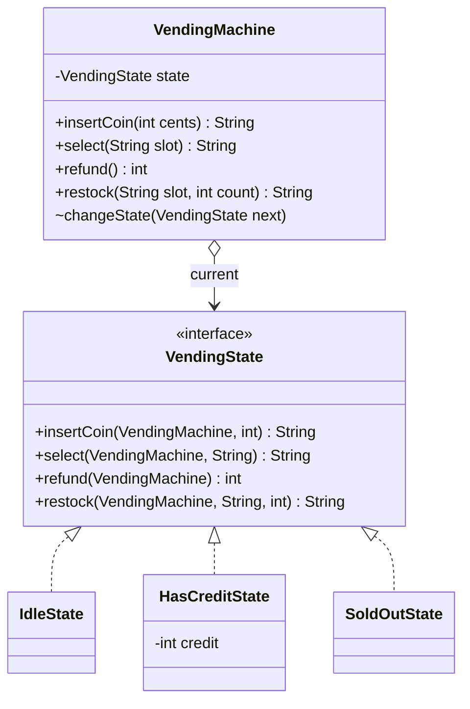
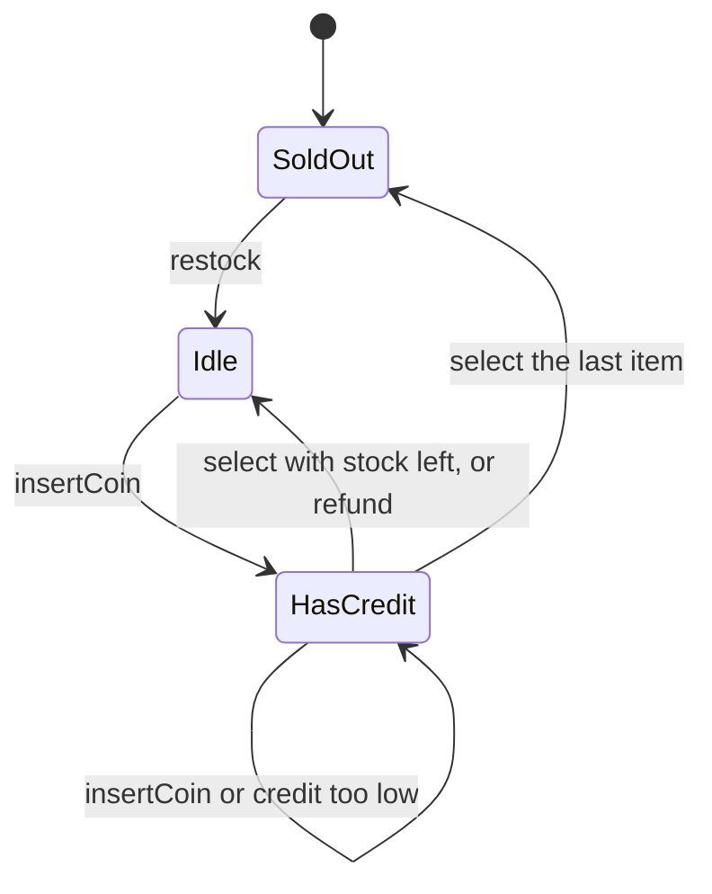
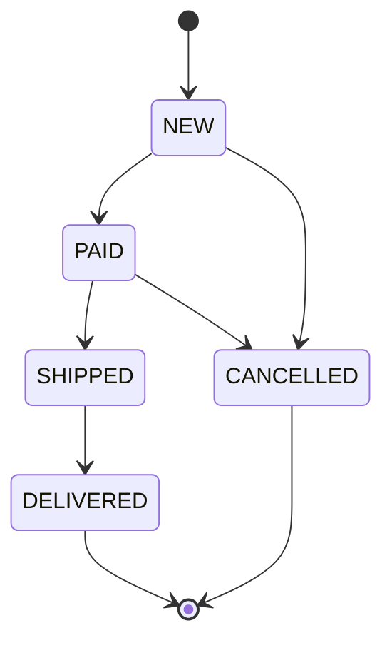
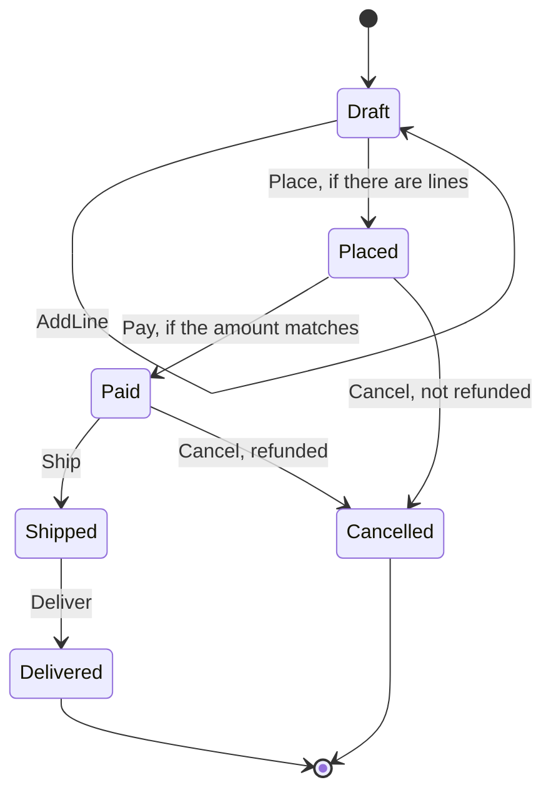
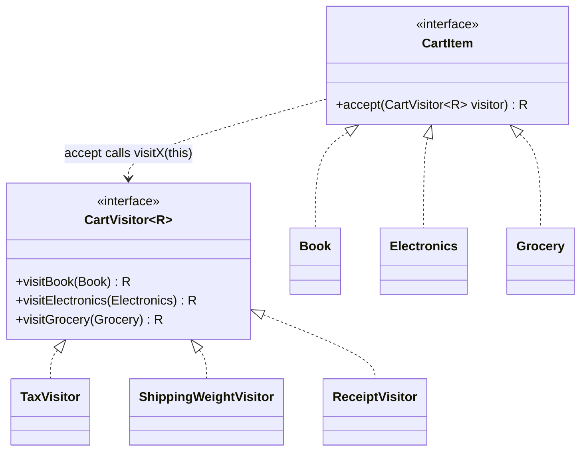
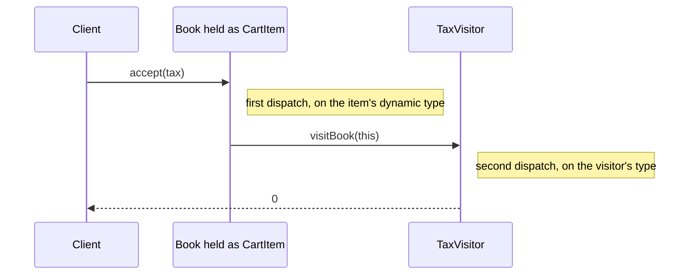
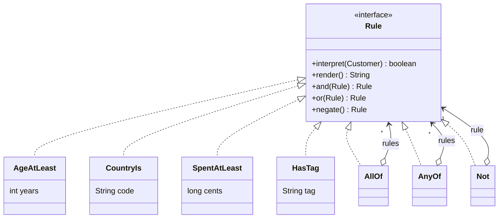
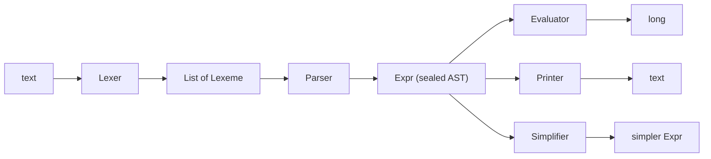

# Module 08 — Behavioral Patterns III: State & Structure

> **Week 10** · Prerequisites: m07 (Chain of Responsibility, sealed requests routed by `switch`), m06 (Command as sealed data), m05 (Composite, the expression tree), m01 (OCP and the "sealed is deliberately closed" sidebar), m00 (records, sealed types, record patterns, `_`) · Estimated study time: 7 h
>
> Run every example without a build: `java modules/m08-behavioral-state-structure/src/main/java/io/github/aliturgutbozkurt/patterns/m08/examples/<path>/<Demo>.java` (JDK 27)

## Learning outcomes

By the end of this module you can:

1. **Implement** State in three forms: classic state objects behind a context, an `enum` state machine (transition
   table in an exhaustive `switch` expression), and a `sealed` record state machine whose transition function is a
   pure `(State, Event) → Result`. You can also **decide** between throwing on an invalid transition and returning a
   rejection value.
2. **Test** a state machine systematically: every (state, event) pair, terminal states, event-log replay, and that a
   refused event changes nothing. You can also **explain** why a catch-all `case` or `default` hides the states a new
   transition forgets.
3. **Implement** the classic Visitor with double dispatch (`<R> R accept(Visitor<R>)`), **explain** why overloading
   alone cannot do it, and **refactor** it into exhaustive `switch` expressions over a sealed hierarchy with record
   patterns, `when` guards and `_`.
4. **Explain** the expression problem: which design makes new *types* cheap and which makes new *operations* cheap.
   You can also **use** the compiler's exhaustiveness errors as a to-do list and **name** the `MatchException` risk
   under separate compilation.
5. **Implement** Interpreter as a classic class-per-rule hierarchy and as a sealed record AST with a lexer, a
   recursive-descent parser, an evaluator, a pretty printer and a simplifier. You can also **say** when a hand-written
   parser is the wrong tool.

## Motivation

The last three behavioral patterns are the ones modern Java changes most. An order that is "paid" may be shipped, but
an order that is "delivered" may not. A method full of `if (status == …)` checks spreads that rule across the whole
code base, and one forgotten check ships a cancelled order. A shopping cart needs tax, shipping weight, a receipt and a
description. Adding each one as a method on every item class makes the items grow forever. A marketing team wants to
write "age at least 18 and (country TR or tag vip)" without asking a developer each time.

**State** puts the behaviour that depends on "where we are" in one place. **Visitor** adds operations to a stable
hierarchy without editing it. **Interpreter** turns sentences of a small language into a tree that can be evaluated.
Java 21 added records, sealed types and pattern matching for `switch`, and they give all three patterns a second,
shorter form. This module shows both forms side by side and asks the question behind them: *what is easy to add
later, a new case or a new operation?* The capstone spec is due this week. Its order lifecycle and promotion rules are
natural homes for two of these patterns.

## State

### Problem

A snack machine accepts coins, sells snacks and gives change, but only when it has stock and enough credit. Written as
one class, every method starts with the same questions: do we have credit, are we sold out? Each new state (for
example "maintenance") means editing every method, and it is easy to forget one.

### Intent

> Allow an object to alter its behaviour when its internal state changes. The object will appear to change its class.

### Structure





### Classic Java

The context (`VendingMachine`) owns the stock and validates arguments, but it never asks which state it is in. Every
operation is forwarded to the current state object:

```java
// file: examples/state/vending/VendingMachine.java
public final class VendingMachine {

    private final SortedMap<String, Product> products;
    private final Map<String, Integer> stock = new TreeMap<>();
    private final List<Dispensed> tray = new ArrayList<>();
    private VendingState state = new SoldOutState();
// ...
    public String insertCoin(int cents) {
        if (cents <= 0) {
            throw new IllegalArgumentException("coin must be positive: " + cents);
        }
        return state.insertCoin(this, cents);
    }

    public String select(String slot) {
        requireSlot(slot);
        return state.select(this, slot);
    }
// ...
    void changeState(VendingState next) {
        state = Objects.requireNonNull(next, "next");
    }
```

The state interface has one method per operation of the context. Each method receives the context, so a state can
read the stock and choose the next state:

```java
// file: examples/state/vending/VendingState.java
public interface VendingState {

    /** The state's name as shown on the machine's display. */
    String name();

    String insertCoin(VendingMachine machine, int cents);

    String select(VendingMachine machine, String slot);

    /** Hands back the credit, in cents. */
    int refund(VendingMachine machine);

    String restock(VendingMachine machine, String slot, int count);
}
```

The credit is a field of `HasCreditState`, so it cannot exist in any other state. The state decides what happens next,
and after the last item it switches the machine to `SoldOut`:

```java
// file: examples/state/vending/HasCreditState.java
public final class HasCreditState implements VendingState {

    private final int credit;
// ...
    @Override
    public String select(VendingMachine machine, String slot) {
        Product product = machine.product(slot);
        if (machine.stock(slot) == 0) {
            return product.name() + " is sold out, choose another";
        }
        if (credit < product.priceCents()) {
            return "insert " + (product.priceCents() - credit) + " more for " + product.name();
        }
        int change = credit - product.priceCents();
        machine.dispense(slot, new Dispensed(product, change));
        machine.changeState(machine.hasStock() ? new IdleState() : new SoldOutState());
        return "dispensed " + product.name() + ", change " + change;
    }
```

`VendingMachineDemo` prints the state before and after every step:

```text
before     action         after      message
SoldOut    insert 100     SoldOut    sold out, returned 100
SoldOut    restock A1 2   Idle       restocked 2 x Cola in A1
Idle       restock A2 1   Idle       restocked 1 x Chips in A2
Idle       select A1      Idle       insert coins first
Idle       insert 100     HasCredit  credit 100
HasCredit  select A1      HasCredit  insert 50 more for Cola
HasCredit  insert 100     HasCredit  credit 200
HasCredit  select A1      Idle       dispensed Cola, change 50
Idle       insert 200     HasCredit  credit 200
HasCredit  refund         Idle       refunded 200
Idle       insert 120     HasCredit  credit 120
HasCredit  select A2      Idle       dispensed Chips, change 0
Idle       insert 150     HasCredit  credit 150
HasCredit  select A1      SoldOut    dispensed Cola, change 0
tray: [Cola (change 50), Chips (change 0), Cola (change 0)]
```

The transition logic is spread over three classes. That is the strength of the classic form (each state is small and
closed) and also its weakness: nobody can see the whole state machine in one place.

### Modern Java 27

**State as an `enum`.** When the states carry no data and the interesting question is "which move is allowed?", an
`enum` holds the whole transition table in one exhaustive `switch` *expression*:

```java
// file: examples/state/order/enumfsm/OrderStatus.java
public enum OrderStatus {
    NEW, PAID, SHIPPED, DELIVERED, CANCELLED;

    /** The statuses this one may move to, in declaration order (read-only). */
    public Set<OrderStatus> next() {
        EnumSet<OrderStatus> next = switch (this) {
            case NEW -> EnumSet.of(PAID, CANCELLED);
            case PAID -> EnumSet.of(SHIPPED, CANCELLED);
            case SHIPPED -> EnumSet.of(DELIVERED);
            case DELIVERED, CANCELLED -> EnumSet.noneOf(OrderStatus.class);
        };
        return Collections.unmodifiableSet(next);
    }
```

A new constant such as `RETURNED` without a row is now a compile error. That is true only for a switch *expression*
(or a switch with patterns). An old-style `switch` **statement** over an enum (`case NEW -> …;` with no result) that
omits a constant compiles without any error or warning, even under `-Xlint:all -Werror`. State machines should
therefore use switch expressions.

The order checks every move against the table. A refused move throws and changes neither the status nor the history:

```java
// file: examples/state/order/enumfsm/Order.java
    /** Moves to {@code target} or throws {@link IllegalTransitionException} without changing anything. */
    public void moveTo(OrderStatus target) {
        Objects.requireNonNull(target, "target");
        if (!status.canMoveTo(target)) {
            throw new IllegalTransitionException(id, status, target);
        }
        history.add(new Transition(status, target));
        status = target;
    }
```

Because the table is data, the diagram can be *generated* from it and never drift from the code:

```java
// file: examples/state/order/enumfsm/StateDiagram.java
    public static String mermaid() {
        var text = new StringBuilder("stateDiagram-v2\n");
        text.append("    [*] --> ").append(OrderStatus.NEW).append('\n');
        for (OrderStatus from : OrderStatus.values()) {
            for (OrderStatus to : from.next()) {
                text.append("    ").append(from).append(" --> ").append(to).append('\n');
            }
        }
```

This is the exact output of `StateDiagram.mermaid()`, pasted as it is printed by `EnumOrderDemo`:



### State as data: sealed records

The enum cannot say *what* an order knows in each state. A shipped order has a tracking number, but a draft does not.
With an enum plus nullable fields, `trackingNo` is `null` most of the time and nothing stops code from reading it too
early. **Sealed records** make each state carry exactly its own data. A `Draft` without a tracking number is then a
compile-time fact:

```java
// file: examples/state/order/sealed/OrderState.java
public sealed interface OrderState {

    /** Lines can still be added; an empty draft cannot be placed. */
    record Draft(List<Line> lines) implements OrderState {
        public Draft {
            lines = List.copyOf(lines);
        }
    }
// ...
    record Paid(long totalCents, String paymentId) implements OrderState {
// ...
    record Shipped(String paymentId, String trackingNo) implements OrderState {
```

The records are nested inside the sealed interface, and `permits` is then inferred. This is not only tidy. Top-level
records declared in `OrderState.java` but used from other files trigger `[auxiliaryclass]` warnings, and under
`-Werror` those break the build.

The whole lifecycle is one **pure function** from `(state, event)` to a result. It switches over a private pair
record, and nested record patterns take both apart at once. `when` guards express the conditions:

```java
// file: examples/state/order/sealed/OrderMachine.java
    /** The pair the transition function switches over. */
    private record Step(OrderState state, OrderEvent event) {}
// ...
    public static Transition apply(OrderState state, OrderEvent event) {
        Objects.requireNonNull(state, "state");
        Objects.requireNonNull(event, "event");
        return switch (new Step(state, event)) {
            case Step(Draft(var lines), AddLine(var line)) ->
                    new Moved(new Draft(Stream.concat(lines.stream(), Stream.of(line)).toList()));
            case Step(Draft(var lines), Place _) when lines.isEmpty() ->
                    new Rejected("cannot place an empty order");
            case Step(Draft(var lines), Place _) -> new Moved(new Placed(lines, total(lines)));
            case Step(Placed(_, var total), Pay(_, var amount)) when amount != total ->
                    new Rejected("amount " + amount + " does not match total " + total);
            case Step(Placed(_, var total), Pay(var paymentId, _)) -> new Moved(new Paid(total, paymentId));
            case Step(Placed _, Cancel(var reason)) -> new Moved(new Cancelled(reason, false));
            case Step(Paid(_, var paymentId), Ship(var trackingNo)) -> new Moved(new Shipped(paymentId, trackingNo));
            case Step(Paid _, Cancel(var reason)) -> new Moved(new Cancelled(reason, true));
            case Step(Shipped(_, var trackingNo), Deliver _) -> new Moved(new Delivered(trackingNo));
            // Catch-all: every other pair is refused. It also silently accepts states added later (see the lesson).
            case Step(var s, var e) -> new Rejected(name(e) + " not allowed in " + name(s));
        };
    }
```



Three design decisions are visible here:

- **Rejection is a value.** `apply` returns `Moved` or `Rejected` (a sealed `Transition`), so the caller must handle
  both, and the compiler checks that it does. Throwing (as `Order.moveTo` does) suits a programming error: "this code
  should never ask for that move". A rejection value suits input from outside, which is expected to be wrong
  sometimes: a user, a message queue, a replayed log.
- **The last case is a catch-all.** Without it the compiler lists every missing `(state, event)` pair; the verified
  message reads `missing patterns: Step(Cancelled _,Event _)`. With it, the switch is exhaustive, but a *new* state
  such as `Returned` is silently refused everywhere instead of being reported. That is the price of the catch-all.
  Where every pair matters, list the refusals explicitly instead (the ex01 solution does).
- **No mutation.** Records never change, so `replay` is a simple fold over an event log that stops at the first
  rejection:

```java
// file: examples/state/order/sealed/OrderMachine.java
    public static ReplayResult replay(List<? extends OrderEvent> log) {
        OrderState state = initial();
        for (int index = 0; index < log.size(); index++) {
            switch (apply(state, log.get(index))) {
                case Moved(var next) -> state = next;
                case Rejected(var reason) -> {
                    return new ReplayResult.Stopped(state, index, reason);
                }
            }
        }
        return new ReplayResult.Completed(state);
    }
```

```text
start    Draft[lines=[]]
AddLine  -> Draft[lines=[2 x BOOK @ 350]]
AddLine  -> Draft[lines=[2 x BOOK @ 350, 1 x MUG @ 300]]
Place    -> Placed[lines=[2 x BOOK @ 350, 1 x MUG @ 300], totalCents=1000]
Pay      rejected: amount 900 does not match total 1000
Pay      -> Paid[totalCents=1000, paymentId=PAY-7]
Cancel   -> Cancelled[reason=customer request, refunded=true]
replay:  Completed[state=Delivered[trackingNo=TRK-42]]
replay:  Stopped[state=Shipped[paymentId=PAY-7, trackingNo=TRK-42], index=5, reason=Cancel not allowed in Shipped]
```

### Testing a state machine

A state machine is a table, so test it as a table. For `n` states and `m` events there are exactly `n × m` pairs, and
a parameterised test can check each pair against an expected table that is written *independently* of the production
`switch`:

```java
// file: examples/state/EnumOrderTest.java
    static Stream<Arguments> allPairs() {
        return Arrays.stream(OrderStatus.values())
                .flatMap(from -> Arrays.stream(OrderStatus.values()).map(to -> Arguments.of(from, to)));
    }
// ...
    @ParameterizedTest(name = "{0} -> {1}")
    @MethodSource("allPairs")
    void everyPairMatchesTheExpectedTable(OrderStatus from, OrderStatus to) {
        assertThat(from.canMoveTo(to)).isEqualTo(EXPECTED.get(from).contains(to));
    }
```

Add tests that terminal states have no exits and that a refused event leaves both the state and the history
unchanged. For event-sourced machines, also test that `replay(log)` equals applying the events one by one.

### Real-world usage

The JDK's own state enum is `java.lang.Thread.State` (`NEW, RUNNABLE, BLOCKED, WAITING, TIMED_WAITING, TERMINATED`).
`ThreadStateDemo` drives one platform thread and one virtual thread through four of them. Instead of sleeping, it waits
for each state (bounded polling of `getState()`), so the output is deterministic:

```java
// file: examples/state/jdk/ThreadStates.java
        var observed = new ArrayList<Thread.State>();
        observed.add(thread.getState());
        thread.start();
        observed.add(awaitState(thread, Thread.State.WAITING, TIMEOUT));
        gate.countDown();
        observed.add(awaitState(thread, Thread.State.TIMED_WAITING, TIMEOUT));
        thread.interrupt();
        thread.join();
        observed.add(thread.getState());
```

```text
Thread.State: [NEW, RUNNABLE, BLOCKED, WAITING, TIMED_WAITING, TERMINATED]
platform thread: NEW -> WAITING -> TIMED_WAITING -> TERMINATED
virtual thread:  NEW -> WAITING -> TIMED_WAITING -> TERMINATED
```

Other places you will meet State: `java.util.concurrent.Future.State` (`RUNNING, SUCCESS, FAILED, CANCELLED`, since
Java 19) and the internal state constants of `FutureTask`, TCP connection states (`LISTEN`, `ESTABLISHED`,
`TIME_WAIT`…), order and payment lifecycles in every shop, and workflow/BPM engines. Frameworks such as Spring
Statemachine add hierarchical states, history states and parallel regions. Those features are beyond this module.

### Pitfalls and when NOT to use it

- **Two states and one flag** do not need a pattern: a `boolean` and an `if` are clearer.
- **Scattered transitions.** In the classic form the table is spread over many classes. Where the full picture matters
  (reviews, audits, diagrams), prefer a central table (`enum` or one `switch`).
- **`default` and catch-all cases** make a switch exhaustive but hide states that a new transition forgets. Keep them
  rare and deliberate, and comment them.
- **Old-style `switch` statements over enums** are not checked for missing constants. Use switch expressions.
- **Invalid states that are representable.** An enum plus nullable fields allows "delivered without a tracking
  number". Sealed records make that state impossible.
- **Swallowed refusals.** A returned `Rejected` that nobody looks at is as bad as a swallowed exception. Log it, show
  it, or return it further.

### Related patterns

**Strategy** (m06) has the same class diagram. The difference is intent and who changes the object: the *client*
picks a strategy, while a state object *replaces itself*. **Flyweight** (m05): stateless state objects (`Idle`,
`SoldOut`) can be shared. **Memento** (m07) can snapshot a state machine, and **Command** (m06) events are exactly
what a replayed log contains.

## Visitor

### Problem

A cart holds books, electronics and groceries. Tax, shipping weight, a receipt line and a description all depend on
the item type. Put every operation on every item class and the item classes grow with every new report, even though
the item *types* hardly ever change. Put the operations outside with `instanceof` chains and you lose the compiler's
help when a type is added.

### Intent

> Represent an operation to be performed on the elements of an object structure. Visitor lets you define a new
> operation without changing the classes of the elements on which it operates.

### Structure





### Classic Java

Every element has one method, `accept`, generic in the result type:

```java
// file: cart/classic/CartItem.java
public interface CartItem {

    <R> R accept(CartVisitor<R> visitor);
}
```

Each element's `accept` calls "its" visit method. Inside `Book`, the static type of `this` is `Book`, so the compiler
picks `visitBook`:

```java
// file: cart/classic/Book.java
public record Book(String title, long priceCents) implements CartItem {
// ...
    @Override
    public <R> R accept(CartVisitor<R> visitor) {
        return visitor.visitBook(this);
    }
}
```

An operation is one visitor class. With `R = Long` it returns a value instead of accumulating one in a field:

```java
// file: cart/classic/TaxVisitor.java
public final class TaxVisitor implements CartVisitor<Long> {

    @Override
    public Long visitBook(Book book) {
        return 0L;
    }

    @Override
    public Long visitElectronics(Electronics electronics) {
        return percentOf(electronics.priceCents(), 20);
    }

    @Override
    public Long visitGrocery(Grocery grocery) {
        return percentOf(grocery.priceCents(), 10);
    }
```

**Why not simply overload?** Java chooses an overload at *compile time* from the **static** type of the argument. A
`Book` held in a `CartItem` variable therefore reaches the `CartItem` overload:

```java
// file: cart/classic/OverloadTrap.java
    public static String describe(CartItem item) {
        return "a cart item";
    }

    public static String describe(Book book) {
        return "the book \"" + book.title() + "\"";
    }
```

```text
book         Refactoring               45.00
electronics  Headphones               120.00
grocery      Coffee beans 500 g        12.00
tax:             25.20
shipping weight: 1250 g
describe(CartItem) for a Book: a cart item
accept -> visitBook:          the book "Refactoring"
```

Only method *overriding* dispatches on the run-time type, and only on the receiver. `accept` is the first dynamic
dispatch (on the item) and the overloaded call inside it is resolved statically, but correctly, because `this` has the
exact type. Together they are **double dispatch**.

### Modern Java 27

With a **sealed** hierarchy the compiler knows every subtype, and a pattern-matching `switch` dispatches on the
dynamic type directly. The records lose `accept`, the visitor interface disappears, and each operation is one method:

```java
// file: cart/modern/CartOperations.java
    public static long tax(CartItem item) {
        return switch (item) {
            case Book _ -> 0;
            case Electronics(_, var price, _) -> percentOf(price, 20);
            case Grocery grocery -> percentOf(grocery.priceCents(), 10);
        };
    }
// ...
    public static String receipt(CartItem item) {
        return switch (item) {
            case Electronics e when e.weightGrams() > 20_000 -> line("electronics", e.name(), e.priceCents())
                    + "\n" + line("", "bulky surcharge", BULKY_SURCHARGE_CENTS);
            case Book(var title, var price) -> line("book", title, price);
            case Electronics(var name, var price, _) -> line("electronics", name, price);
            case Grocery grocery -> line("grocery", grocery.name() + " " + grocery.grams() + " g",
                    grocery.priceCents());
        };
    }
```

Three details:

- `case Book _` matches the type without binding anything; `Electronics(_, var price, _)` takes out only the field it
  needs.
- **Guards and dominance.** The guarded `case Electronics e when …` must come *before* the unguarded
  `Electronics(…)` case. In the other order `javac` reports `this case label is dominated by a preceding case label`.
- A special case (bulky items) is one extra line, not a new visitor method.

Now add a `GiftCard` record to the sealed `CartItem` and compile. Every operation reports the missing case. This is
the real output for the four switches in `CartOperations`, shortened to the first:

```text
CartOperations.java:24: error: the switch expression does not cover all possible input values
        return switch (item) {
               ^
  missing patterns:
      GiftCard _
```

The compiler errors are the to-do list. That is also the risk: a `switch` compiled *before* `GiftCard` existed, and
not recompiled, throws `java.lang.MatchException` at run time when it receives a gift card. This can happen with a
library upgraded without recompiling its callers. Sealed hierarchies that cross module or library boundaries need a
versioning plan.

> ⚠️ **Preview in JDK 27 — primitive patterns (JEP 532).** Patterns currently match reference types. JEP 532 extends
> them to primitives, so a switch over an `int` could use `case int i when i > 0`. In JDK 27 this is a **preview**
> feature. Without `--enable-preview`, `javac` reports:
> `error: primitive patterns are a preview feature and are disabled by default.`
> (`use --enable-preview to enable primitive patterns`). This course uses final features only, so no example depends on
> it. Guards on a bound variable (`case Integer i when i > 0`, or plain `if`) cover the same ground today.

### Visitor over a Composite: documents

The classic motivation for Visitor is an operation over a *Composite* (m05). A document has blocks (headings,
paragraphs, lists, code), and blocks contain inline content, which can nest (`Emphasis` contains inlines). Two sealed
hierarchies, five operations, and no visitor interface:

```java
// file: visitor/document/DocumentRenderers.java
    public static List<String> outline(Document document) {
        return document.blocks().stream()
                .flatMap(block -> switch (block) {
                    case Heading(var level, var text) when level > 3 -> Stream.of("      (minor) " + text);
                    case Heading(var level, var text) -> Stream.of("  ".repeat(level - 1) + text);
                    case Paragraph _, BulletList _, CodeBlock _ -> Stream.empty();
                })
                .toList();
    }
```

Recursion follows the Composite. `linksIn` finds a link inside emphasis inside a list item:

```java
// file: visitor/document/DocumentRenderers.java
    private static Stream<Link> linksIn(List<Inline> content) {
        return content.stream().flatMap(inline -> switch (inline) {
            case Link link -> Stream.of(link);
            case Emphasis(var inner) -> linksIn(inner);
            case Text _, Code _ -> Stream.empty();
        });
    }
```

`case Paragraph _, BulletList _, CodeBlock _ ->` groups several types that need no bindings, and it still lists them by
name, so a new block type (say `Table`) is a compile error here too. `DocumentDemo` prints HTML (with `<`, `>`, `&`
escaped), plain text, the outline, the links and a word count that ignores code blocks.

### Real-world usage

The JDK's clearest classic Visitor is `java.nio.file.FileVisitor`. `Files.walkFileTree` calls one method per event,
and the returned `FileVisitResult` (`CONTINUE, TERMINATE, SKIP_SUBTREE, SKIP_SIBLINGS`) steers the walk:

```java
// file: visitor/files/DiskUsage.java
    @Override
    public FileVisitResult preVisitDirectory(Path dir, BasicFileAttributes attributes) {
        if (!dir.equals(root) && ignoredDirectories.contains(dir.getFileName().toString())) {
            skipped.add(relative(dir));
            return FileVisitResult.SKIP_SUBTREE;
        }
        return FileVisitResult.CONTINUE;
    }

    @Override
    public FileVisitResult visitFile(Path file, BasicFileAttributes attributes) {
        byExtension.merge(extension(file), new Usage(1, attributes.size()), Usage::plus);
        bytesSoFar = Math.addExact(bytesSoFar, attributes.size());
        if (bytesSoFar >= byteBudget) {
            stoppedEarly = true;
            return FileVisitResult.TERMINATE;
        }
        return FileVisitResult.CONTINUE;
    }
```

```text
extension  files  bytes
(none)         1     50
java           2    500
md             2    200
txt            1     40
total          6    790
skipped:  [build, src/build]
failures: []
with a 1-byte budget: stopped early after 1 file(s)
temporary tree deleted: true
```

The demo writes a fixed tree to a fresh temporary directory and deletes it in `finally` (with a second `FileVisitor`).
It prints paths relative to the root and uses sorted maps, so the output is the same on every OS and in every
directory order.

Compilers are the other big home of Visitor. `javax.lang.model` (annotation processors) has `ElementVisitor` and
`TypeVisitor`, `com.sun.source.tree.TreeVisitor` (javac plugins) has a `visitX` method for every syntax node,
including `visitSwitchExpression` and `visitDeconstructionPattern`, and ASM's `ClassVisitor` streams over bytecode.
These APIs also show Visitor's weak side. `javax.lang.model.util` ships *versioned* visitors (`SimpleElementVisitor6`,
`7`, `8`, `9`, `14`, …), and `ElementVisitor` has an abstract `visitUnknown` and added `visitModule` and
`visitRecordComponent` as `default` methods. Adding an element type to a visitor interface breaks every
implementation, so the JDK had to plan for new types in advance.

### Pitfalls and when NOT to use it

- **An unstable hierarchy.** If new element types arrive often, every visitor (or every `switch`) must change each
  time. Use plain polymorphism (a method on the type) instead.
- **Broken encapsulation.** Visitors need access to the elements' data. With records that is by design; with classes
  it often forces getters that were not needed before.
- **`default` in a `switch` over a sealed type** turns off exactly the check that makes the modern form safe.
- **Separate compilation** can turn a missing case into a run-time `MatchException`. Recompile callers when a sealed
  hierarchy changes.
- **Deep recursion** over very deep trees can overflow the stack (see Interpreter). Most real documents are shallow;
  generated input may not be.
- **Accumulating visitors** (`void` methods plus a mutable field) are harder to reuse and test than visitors that
  return values (`Visitor<R>`).

### Related patterns

**Composite** (m05) is the structure a Visitor usually walks. **Iterator** (m06) visits elements in order but does
the same thing to each; a Visitor does something *type-specific*. **Interpreter** (below) is often implemented as a
Visitor or `switch` over its AST. Variants such as the acyclic Visitor and the reflective Visitor exist to reduce
coupling; with sealed types they are rarely needed.

## The expression problem

m01's sidebar
["sealed types are deliberately closed"](../../m01-oop-solid-uml/lesson/lesson.en.md#sidebar-sealed-types-are-deliberately-closed)
and m05's
[Composite section](../../m05-structural-composition/lesson/lesson.en.md)
named the trade-off. This module shows it at full size. Think of a table with *types* as rows and *operations* as
columns:

| | New **type** (row), e.g. `GiftCard` | New **operation** (column), e.g. `describe` |
|---|---|---|
| Methods on an open hierarchy (classic OO) | One new class, nothing else changes | Edit every class |
| Classic Visitor | Edit the visitor interface **and** every visitor | One new visitor class |
| Sealed type + `switch` | Compiler errors at every `switch` (fix them all) | One new function |

Neither design is "correct". The question is which kind of change is expected. Order statuses, AST nodes and
document blocks change rarely, and new reports over them arrive often, so choose sealed + `switch`. Payment providers
and plug-ins arrive often and each brings its own behaviour, so choose an open interface. In both cases the compiler
tells you what the change affects. That is the real advantage over `instanceof` chains, which fail silently.

## Interpreter

### Problem

Marketing wants promotions such as "age at least 18 and (country TR or tag vip)". Coding each rule as a Java `if`
means a release for every campaign. Rules need to be *data*: sentences of a small language that can be built,
stored, printed and evaluated.

### Intent

> Given a language, define a representation for its grammar along with an interpreter that uses the representation
> to interpret sentences in the language.

### Structure



**Terminal expressions** (`AgeAtLeast`, `CountryIs`, …) test one fact about the **context** (`Customer`).
**Non-terminal expressions** (`AllOf`, `AnyOf`, `Not`) combine other expressions. The client builds the sentence as
a tree.

### Classic Java

One class per grammar rule, each with `interpret(context)`. The combinators are default methods, the same design as
`java.util.function.Predicate.and/or/negate`:

```java
// file: interpreter/rules/Rule.java
    /** Evaluates the sentence against the context. */
    boolean interpret(Customer customer);

    /** The sentence as text, with parentheses only where precedence needs them. */
    String render();

    default int precedence() {
        return ATOM;
    }

    default Rule and(Rule other) {
        return new AllOf(List.of(this, other));
    }
```

A non-terminal rule delegates to its children, short-circuits, and renders them with parentheses only where needed:

```java
// file: interpreter/rules/AllOf.java
    @Override
    public boolean interpret(Customer customer) {
        return rules.stream().allMatch(rule -> rule.interpret(customer));
    }

    @Override
    public String render() {
        return rules.isEmpty() ? "true"
                : rules.stream().map(rule -> Rule.renderInside(rule, AND)).collect(Collectors.joining(" and "));
    }
```

```text
WELCOME     age >= 18 and (country = TR or tag vip)
BIGSPENDER  spent >= 100000 and not tag employee
YOUTH       not age >= 18
NEWCOMER    not (tag vip or spent >= 100000)

customer    WELCOME     BIGSPENDER  YOUTH       NEWCOMER
C-1         yes         -           -           yes
C-2         -           yes         yes         -
C-3         yes         yes         -           -
C-4         -           -           -           -
```

The tests check the laws of the language, not only examples: `not not r` equals `r`, De Morgan
(`not (a and b)` = `not a or not b`) holds for every pair of sample rules and customers, and `AllOf` never evaluates
a rule after the first `false`. This hierarchy is deliberately **open** (a test adds its own counting rule). New
*kinds of rule* are cheap. A new *operation* (say, "explain why") would need a method on every class, which is the
expression problem again.

### Modern Java 27

For a real language with syntax, the modern form separates **data** from **operations**. The calculator extends
m05's expression Composite (`Num`/`Add`/`Mul`/`Neg`, evaluate + render) with variables, `let … in …`, subtraction,
division, and parsing from text:



The AST is a sealed set of records, with nothing but data:

```java
// file: calc/Expr.java
public sealed interface Expr {

    record Num(long value) implements Expr {}
// ...
    record Binary(Op op, Expr left, Expr right) implements Expr {
// ...
    /** {@code let name = value in body}: {@code name} is visible in {@code body} only. */
    record Let(String name, Expr value, Expr body) implements Expr {
```

Tokens mix an `enum` (punctuation) with records. Because `Symbol` implements the sealed `Token`, one `switch` can
combine `case Symbol.LPAREN` with record patterns. This is the parser's `primary` rule:

```java
// file: calc/Parser.java
    private Node primary() {
        Lexeme lexeme = advance();
        return switch (lexeme.token()) {
            case Token.Number(var value) -> new Node(new Num(value), 1);
            case Ident(var name) -> new Node(new Var(name), 1);
            case Symbol.LPAREN -> {
                enter(lexeme);
                Node inner = expression();
                expect(Symbol.RPAREN, "expected ')'");
                nesting--;
                yield inner;
            }
            case Symbol _, Keyword _, End _ -> throw new ParseException("expected a number, a name or '('",
                    lexeme.column());
        };
    }
```

The parser is **recursive descent**: one method per grammar rule, from the loosest operator to the tightest. A loop
makes `-` left-associative, so `8 - 3 - 2` is `(8 - 3) - 2 = 3`:

```java
// file: calc/Parser.java
    private Node sum() {
        Node left = product();
        while (peek().token() == Symbol.PLUS || peek().token() == Symbol.MINUS) {
            Lexeme operator = advance();
            Op op = operator.token() == Symbol.PLUS ? Op.ADD : Op.SUB;
            Node right = product();
            left = node(new Binary(op, left.expr(), right.expr()), left, right, operator);
        }
        return left;
    }
```

The **evaluator** is the `interpret` of the classic form, written as one recursive `switch`. `let` evaluates its body
in an extended *copy* of the environment, so the binding cannot leak out. `Math.*Exact` turns overflow into an
exception instead of a wrong answer:

```java
// file: calc/Evaluator.java
    public static long evaluate(Expr expr, Map<String, Long> env) {
        return switch (expr) {
            case Num(var value) -> value;
            case Var(var name) -> lookup(env, name);
            case Neg(var operand) -> Math.negateExact(evaluate(operand, env));
            case Binary(var op, var left, var right) -> apply(op, evaluate(left, env), evaluate(right, env));
            case Let(var name, var value, var body) -> evaluate(body, bind(env, name, evaluate(value, env)));
        };
    }
```

The **printer** adds only the parentheses the parser needs. A left operand is wrapped if it binds more loosely than
its operator; a right operand is also wrapped when it binds equally (left associativity):

```java
// file: calc/Printer.java
            case Binary(var op, var left, var right) -> wrap(left, precedence(left) < op.precedence())
                    + " " + op.symbol() + " " + wrap(right, precedence(right) <= op.precedence());
```

The strongest single test of a parser/printer pair is the **round trip**: `Parser.parse(Printer.print(e)).equals(e)`
for a table of trees. Records compare structurally, so one `equals` checks the whole tree, including every
precedence and associativity decision.

### A new operation: the simplifier

Adding an operation to a sealed AST touches no existing file. `Simplifier` rewrites bottom-up with nested record
patterns and guards:

```java
// file: calc/Simplifier.java
    private static Expr binary(Binary binary) {
        return switch (binary) {
            case Binary(var op, Num(var a), Num(var b)) when op != Op.DIV || b != 0 ->
                    new Num(Evaluator.apply(op, a, b));
            case Binary(var op, var x, Num(var b)) when b == 0 && (op == Op.ADD || op == Op.SUB) -> x;
            case Binary(var op, Num(var a), var x) when a == 0 && op == Op.ADD -> x;
            case Binary(var op, var x, Num(var b)) when b == 1 && (op == Op.MUL || op == Op.DIV) -> x;
            case Binary(var op, Num(var a), var x) when a == 1 && op == Op.MUL -> x;
            case Binary(var op, _, Num(var b)) when b == 0 && op == Op.MUL -> new Num(0);
            case Binary(var op, Num(var a), _) when a == 0 && op == Op.MUL -> new Num(0);
            case Binary unchanged -> unchanged;
        };
    }
```

Enum constants cannot appear *inside* a record pattern (`Binary(Op.ADD, …)` does not compile), so the operator is
tested in the guard. The final `case Binary unchanged` is total for the type, not a `default` over a sealed hierarchy.

Programs are text blocks: `let` lines followed by one expression. `Program` turns them into nested `Let`s, so a
program is just a bigger expression:

```java
// file: interpreter/CalculatorDemo.java
        String program = """
                let price = 1200
                let qty = 3
                let discount = price * qty / 10
                price * qty - discount
                """;
        System.out.println("program:  " + program.lines().count() + " lines  =>  " + Program.run(program));
```

```text
source                                    value  printed
2 + 3 * 4                                    14  2 + 3 * 4
8 - 3 - 2                                     3  8 - 3 - 2
(8 - 3) - 2                                   3  8 - 3 - 2
8 - (3 - 2)                                   7  8 - (3 - 2)
-2 * 3                                       -6  -2 * 3
let x = 2 in let x = x + 1 in x * x           9  let x = 2 in let x = x + 1 in x * x
tokens:   [-@1, (@2, a@3, +@5, 12@7, )@9, end@10]
tree:     Neg[operand=Binary[op=ADD, left=Var[name=a], right=Num[value=12]]]
simplify: (x * 1 + 0) * (2 + 3)  =>  x * 5
error:    y + 1  =>  unknown variable: y
error:    10 / (5 - 5)  =>  division by zero
error:    9223372036854775807 + 1  =>  ArithmeticException: long overflow
error:    (1 + 23  =>  expected ')' at column 8
program:  4 lines  =>  3240
```

### Real-world usage

`java.util.regex.Pattern` compiles a regular expression into a graph of node objects that `Matcher` then
*interprets* against the input, which makes it Interpreter in its purest form. `java.text.MessageFormat` parses
`"{0} has {1,number} items"` into a small program. `Predicate` and `Comparator` combinators build rule trees exactly
like `Rule`. Spring Expression Language (SpEL), the JSP/Jakarta EL, template engines and SQL `WHERE` clauses are all
little languages with a parser and an interpreter.

### Pitfalls and when NOT to use it

- **Recursion depth.** A recursive parser and evaluator use one stack frame per nesting level. The verified numbers:
  a 10 000-deep left-leaning tree overflowed the default stack on a cold JVM but not after warm-up, so the limit is
  not predictable. The calculator caps both the nesting of the input and the depth of the tree at 200 and reports a
  `ParseException`.
- **Error messages are part of the language.** Report *where* (`expected ')' at column 8`) and *what*; users of a
  language see these messages more than any other output.
- **Growing grammars.** Class-per-rule is fine for a dozen rules. For a real language, a hand-written parser gets
  hard to maintain, and a parser generator (ANTLR, JavaCC) or an existing expression library is the better choice in
  production. This course only mentions them, since they would be a new dependency.
- **Performance.** Tree-walking interpreters are slow compared with compiled code. Hot rules can be compiled into
  lambdas (a tree of `Predicate`s) once and reused.
- **Security.** Never evaluate text from untrusted users with a language that can reach arbitrary methods (this has
  caused real remote-code-execution bugs in expression languages). Keep the grammar small and the context read-only.

### Related patterns

**Composite** (m05) is the shape of every AST; Interpreter adds *meaning* to it. **Visitor** or sealed `switch`
functions are how the modern form adds operations (evaluate, print, simplify). **Command** (m06) objects are
instructions for *one* receiver; an interpreted sentence is a whole program. **Flyweight** can share terminal nodes
such as `Num(0)`.

## Choosing a form

| Situation | Use |
|---|---|
| A few states, each with lots of behaviour that grows independently | Classic State objects |
| States without data; the table must be visible, tested and drawn | `enum` + exhaustive `switch` expression |
| Each state has its own data; transitions come from outside (users, logs) | Sealed records + pure `apply` returning a result |
| A stable hierarchy you do not own the source of, or must stay open | Classic Visitor (`accept` / `visitX`) |
| A stable hierarchy you own; operations keep being added | Sealed types + exhaustive `switch` |
| Types keep being added, operations are few | Plain polymorphism (methods on the types) |
| Rules built by code from a few combinators | Classic Interpreter (or `Predicate`) |
| A language with text syntax | Sealed AST + recursive-descent parser + `switch` operations |
| A large or evolving language in production | A parser generator or an existing expression library |

## Summary

| Pattern | Use when | Avoid when | Java 27 shortcut |
|---|---|---|---|
| State | Behaviour depends on a state that changes at run time | Two states and a flag | `enum` with `switch` expressions; sealed state records + `switch` over `(state, event)` |
| Visitor | Many operations over a stable hierarchy | Types change often | Exhaustive `switch` with record patterns, `when`, `_` |
| Interpreter | A small language whose sentences are data | A large grammar, hot paths | Sealed record AST, recursive `switch`, text blocks |

## Quiz

1. State and Strategy have the same class diagram. What is the difference?
2. Where can the transition logic live, and what does each choice make easy?
3. What can a sealed-record state machine express that an `enum` state machine cannot?
4. When should an invalid transition throw, and when should it return a rejection value?
5. Why can a `default` (or a final catch-all `case`) be dangerous in a state machine's `switch`, and which old-style
   `switch` is not checked for missing enum constants at all?
6. Why does `describe(item)` with `CartItem item = new Book(…)` not call `describe(Book)`, and how does `accept` fix
   it?
7. What does the expression problem say about classic Visitor versus sealed types with `switch`?
8. When can a `switch` over a sealed type throw `MatchException` although it compiled without errors?
9. Why is `Parser.parse(print(e)).equals(e)` such a strong test, and what makes `8 - 3 - 2` evaluate to 3 in a
   recursive-descent parser?
10. What would JEP 532 primitive patterns add, and why does this course not use them yet?

<details><summary>Answers</summary>

1. The intent and who changes the object. A client *chooses* a strategy and it normally stays; a state object *itself*
   replaces the context's state as a result of the operations.
2. In the state objects (classic: each state is small, but no single place shows the whole machine) or in a central
   table (`enum` / one `switch`: the whole machine is visible, testable pair by pair and can generate its diagram).
3. Per-state data. A `Shipped` record has a tracking number, while a `Draft` cannot have one, so "delivered without a
   tracking number" is not representable. An enum needs nullable fields for that.
4. Throw when the request is a programming error that should never happen. Return a rejection when invalid input is
   expected (users, messages, replayed logs) and the caller must handle it; the sealed result forces that.
5. It makes the `switch` exhaustive, so a newly added state is silently handled by the catch-all instead of reported
   by the compiler. An old-style `switch` *statement* over an enum without patterns is not checked for missing
   constants at all, even with `-Xlint:all -Werror`.
6. Overloads are chosen at compile time from the static type `CartItem`. `accept` is overridden, so it runs the
   `Book` implementation, and inside it `visitor.visitBook(this)` has the static type `Book`: two dispatches.
7. Classic OO makes new types cheap and new operations expensive. Visitor and sealed + `switch` make new operations
   cheap. Adding a type then means editing every visitor or fixing every compiler error.
8. Under separate compilation: a new subtype is added to the sealed interface and that is recompiled, but the class
   with the `switch` is not. The old code meets a value it has no case for.
9. Records compare structurally, so one `equals` checks every node, every precedence decision and every
   parenthesis. Left associativity comes from the loop in `sum()`, which folds each new operand into the tree built so
   far: `(8 - 3) - 2`.
10. Type patterns on primitives (`case int i when i > 0`) and safe conversions in `instanceof`/`switch`. In JDK 27 it
    is a preview feature (`--enable-preview` required). The course uses final features only.

</details>

## Assignments

- [01 — Document-approval workflow](../assignments/01-document-workflow.en.md) ★★☆ (State)
- [02 — Mini expression language](../assignments/02-mini-language.en.md) ★★★ (Interpreter, Visitor as `switch`)

## Further reading

- Gamma, Helm, Johnson, Vlissides, *Design Patterns* (1994) — State, Visitor, Interpreter.
- Philip Wadler, "The Expression Problem" (1998).
- JEP 409 — [Sealed Classes](https://openjdk.org/jeps/409) · JEP 440 — [Record Patterns](https://openjdk.org/jeps/440) · JEP 441 — [Pattern Matching for switch](https://openjdk.org/jeps/441) · JEP 456 — [Unnamed Variables & Patterns](https://openjdk.org/jeps/456) · JEP 532 — [Primitive Types in Patterns, instanceof, and switch (preview)](https://openjdk.org/jeps/532)
- Brian Goetz, "Data Oriented Programming in Java" (InfoQ, 2022) — sealed records as the modern form of these patterns.
- Robert Nystrom, *Crafting Interpreters* (free online) — lexers, recursive-descent parsers and tree-walking
  interpreters in depth.
- The Javadoc of `java.nio.file.FileVisitor`, `javax.lang.model.element.ElementVisitor` and `Thread.State`.
- Terms in Turkish: [docs/glossary.md](../../../docs/glossary.md)
