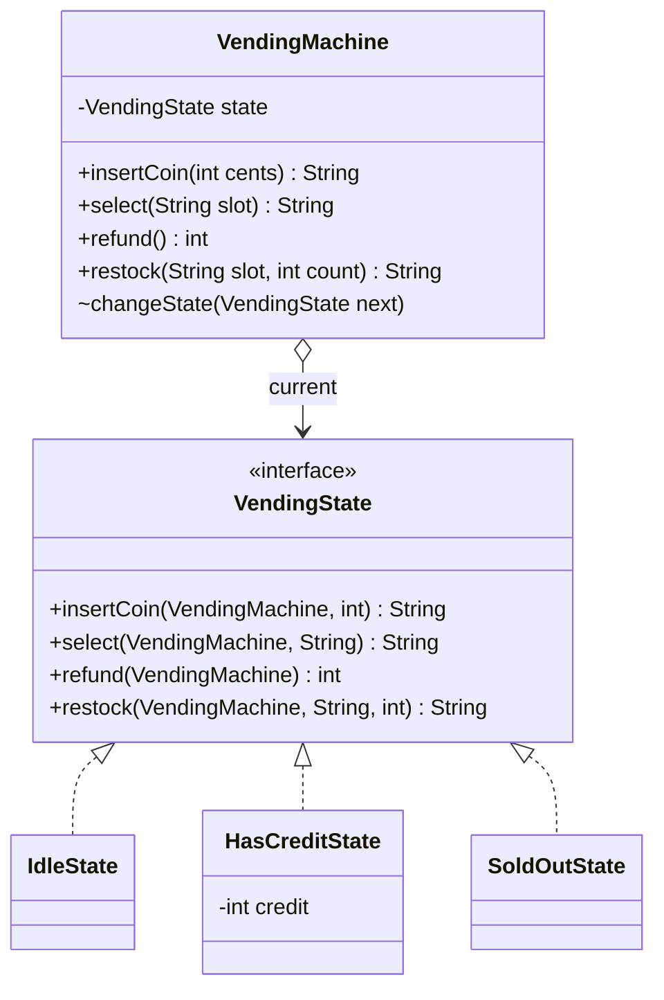
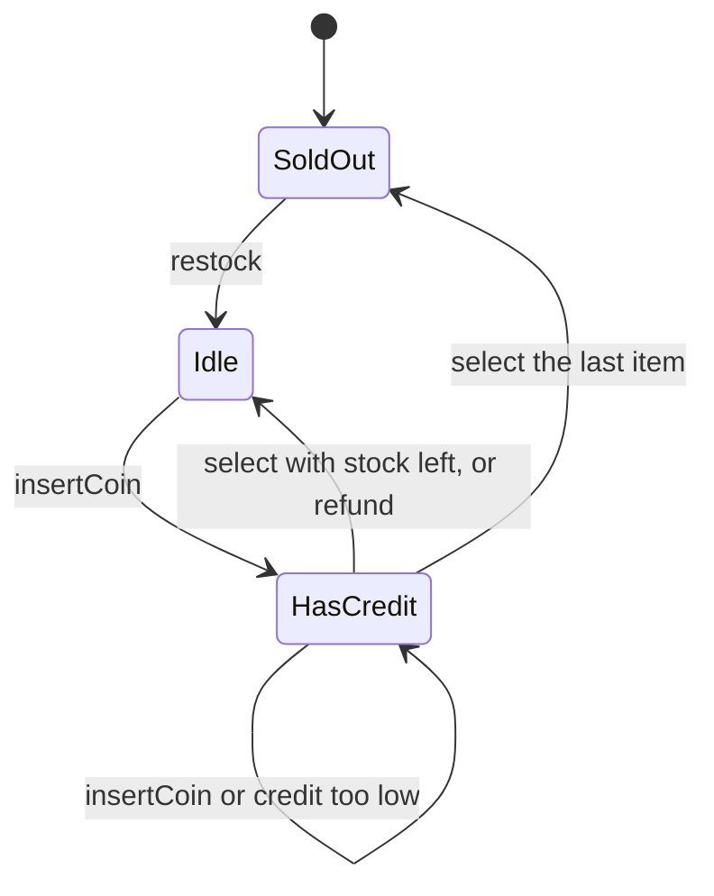
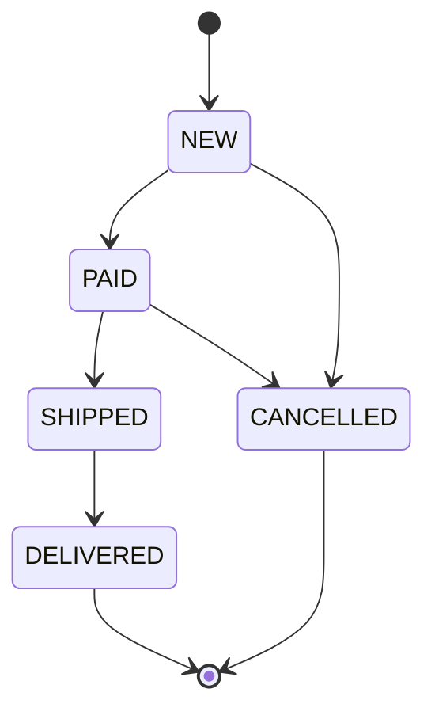
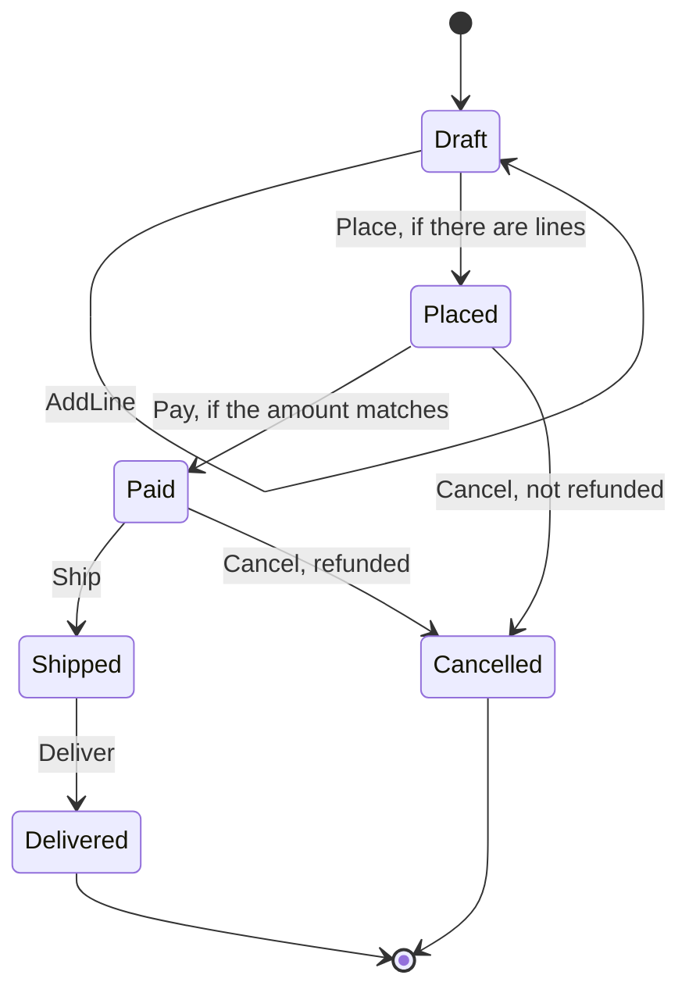
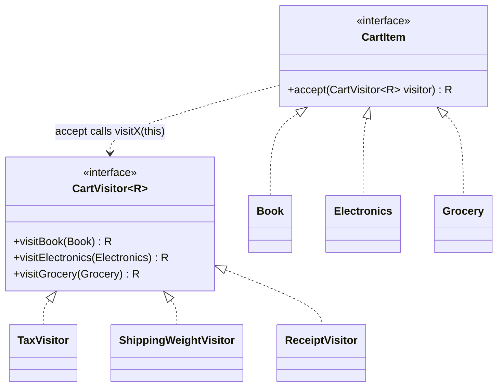
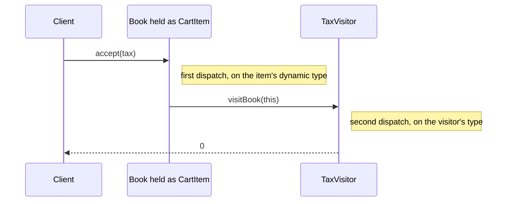
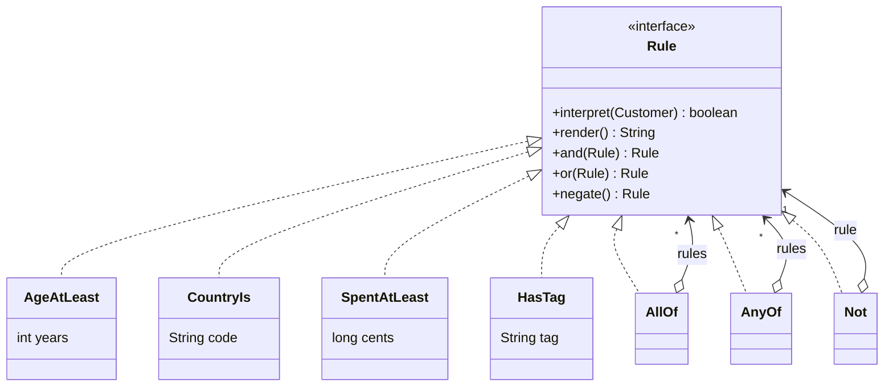
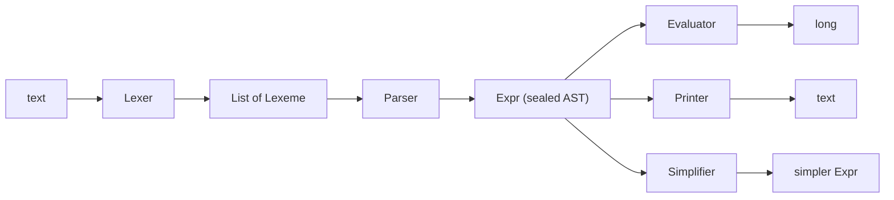

# Modül 08 — Davranışsal Kalıplar III: Durum ve Yapı

> **10. Hafta** · Ön koşullar: m07 (Chain of Responsibility, `switch` ile yönlendirilen sealed istekler), m06 (sealed veri olarak Command), m05 (Composite, ifade ağacı), m01 (OCP ve "sealed bilerek kapalıdır" kenar notu), m00 (record'lar, sealed tipler, record desenleri, `_`) · Tahmini çalışma süresi: 7 saat
>
> Her örneği derlemeden çalıştırın: `java modules/m08-behavioral-state-structure/src/main/java/io/github/aliturgutbozkurt/patterns/m08/examples/<yol>/<Demo>.java` (JDK 27)

## Öğrenme çıktıları

Bu modülün sonunda şunları yapabilirsiniz:

1. State (Durum) kalıbını üç biçimde **uygulamak**: bir bağlamın (context) arkasındaki klasik durum nesneleri, bir
   `enum` durum makinesi (geçiş tablosu eksiksiz bir `switch` ifadesinde) ve durum geçişi saf bir
   `(State, Event) → Result` fonksiyonu olan bir `sealed` record durum makinesi. Geçersiz bir geçişte istisna
   fırlatmakla bir ret değeri döndürmek arasında **karar vermek**.
2. Bir durum makinesini sistemli olarak **test etmek**: her (durum, olay) çifti, son durumlar, olay günlüğünün yeniden
   oynatılması ve reddedilen bir olayın hiçbir şeyi değiştirmediği. Her şeyi yakalayan bir `case`'in ya da `default`'un
   yeni bir geçişin unuttuğu durumları neden gizlediğini **açıklamak**.
3. Klasik Visitor (Ziyaretçi) kalıbını çift yönlendirme (double dispatch) ile (`<R> R accept(Visitor<R>)`)
   **uygulamak**, bunu yalnızca aşırı yüklemenin (overloading) neden yapamayacağını **açıklamak** ve onu record
   desenleri, `when` koşulları ve `_` içeren, sealed bir hiyerarşi üzerindeki eksiksiz `switch` ifadelerine
   **dönüştürmek**.
4. İfade problemini (expression problem) **açıklamak**: hangi tasarım yeni *tipleri*, hangisi yeni *işlemleri* ucuz
   kılar. Derleyicinin eksiksizlik hatalarını bir yapılacaklar listesi olarak **kullanmak** ve ayrı derlemedeki
   `MatchException` riskini **adlandırmak**.
5. Interpreter (Yorumlayıcı) kalıbını klasik "her kurala bir sınıf" hiyerarşisi olarak ve sözcük çözümleyici (lexer),
   özyinelemeli iniş (recursive descent) ayrıştırıcısı, değerlendirici, biçimli yazıcı ve sadeleştirici içeren sealed
   bir record soyut sözdizimi ağacı (AST) olarak **uygulamak**. Elle yazılmış bir ayrıştırıcının ne zaman yanlış araç
   olduğunu **söylemek**.

## Motivasyon

Davranışsal kalıpların son üçü, modern Java'nın en çok değiştirdiği kalıplardır. "Ödenmiş" bir sipariş kargoya
verilebilir, "teslim edilmiş" bir sipariş verilemez. `if (status == …)` denetimleriyle dolu bir metot bu kuralı bütün
koda yayar ve unutulan tek bir denetim iptal edilmiş bir siparişi kargoya verir. Bir alışveriş sepeti vergi, kargo
ağırlığı, fiş ve açıklama ister. Her birini her ürün sınıfına metot olarak eklemek, ürün sınıflarını durmadan
büyütür. Pazarlama ekibi her seferinde bir geliştiriciye sormadan "yaş en az 18 ve (ülke TR ya da etiket vip)" yazmak
ister.

**State**, "neredeyiz" sorusuna bağlı davranışı tek bir yere koyar. **Visitor**, kararlı bir hiyerarşiye onu
değiştirmeden işlem ekler. **Interpreter**, küçük bir dilin cümlelerini değerlendirilebilen bir ağaca dönüştürür.
Java 21 record'ları, sealed tipleri ve `switch` için desen eşlemeyi (pattern matching) getirdi; bunlar üç kalıba da
ikinci, daha kısa bir biçim kazandırır. Bu modül iki biçimi yan yana gösterir ve arkalarındaki soruyu sorar: *sonradan
eklemesi kolay olan hangisi, yeni bir durum mu yoksa yeni bir işlem mi?* Bitirme projesinin spesifikasyonu bu hafta
teslim ediliyor. Onun sipariş yaşam döngüsü ve kampanya kuralları, bu kalıplardan ikisi için doğal bir yuvadır.

## State

### Problem

Bir atıştırmalık otomatı bozuk para kabul eder, ürün satar ve para üstü verir; ama yalnızca stoğu ve yeterli kredisi
varsa. Tek bir sınıf olarak yazıldığında her metot aynı sorularla başlar: kredimiz var mı, stok bitti mi? Her yeni
durum (örneğin "bakımda") her metodu değiştirmek demektir ve birini unutmak kolaydır.

### Amaç

> Bir nesnenin iç durumu değiştiğinde davranışını değiştirmesine izin vermek. Nesne sınıfını değiştirmiş gibi görünür.

### Yapı





### Klasik Java

Bağlam (`VendingMachine`) stoğun sahibidir ve argümanları doğrular, ama hangi durumda olduğunu hiç sormaz. Her işlem
o anki durum nesnesine iletilir:

```java
// file: examples/state/vending/VendingMachine.java
public final class VendingMachine {

    private final SortedMap<String, Product> products;
    private final Map<String, Integer> stock = new TreeMap<>();
    private final List<Dispensed> tray = new ArrayList<>();
    private VendingState state = new SoldOutState();
// ...
    public String insertCoin(int cents) {
        if (cents <= 0) {
            throw new IllegalArgumentException("coin must be positive: " + cents);
        }
        return state.insertCoin(this, cents);
    }

    public String select(String slot) {
        requireSlot(slot);
        return state.select(this, slot);
    }
// ...
    void changeState(VendingState next) {
        state = Objects.requireNonNull(next, "next");
    }
```

Durum arayüzünde bağlamın her işlemi için bir metot vardır. Her metot bağlamı alır; böylece bir durum stoğu okuyup
sonraki durumu seçebilir:

```java
// file: examples/state/vending/VendingState.java
public interface VendingState {

    /** The state's name as shown on the machine's display. */
    String name();

    String insertCoin(VendingMachine machine, int cents);

    String select(VendingMachine machine, String slot);

    /** Hands back the credit, in cents. */
    int refund(VendingMachine machine);

    String restock(VendingMachine machine, String slot, int count);
}
```

Kredi `HasCreditState`'in bir alanıdır; bu yüzden başka hiçbir durumda var olamaz. Sonra ne olacağına durum karar
verir ve son üründen sonra otomatı `SoldOut` durumuna geçirir:

```java
// file: examples/state/vending/HasCreditState.java
public final class HasCreditState implements VendingState {

    private final int credit;
// ...
    @Override
    public String select(VendingMachine machine, String slot) {
        Product product = machine.product(slot);
        if (machine.stock(slot) == 0) {
            return product.name() + " is sold out, choose another";
        }
        if (credit < product.priceCents()) {
            return "insert " + (product.priceCents() - credit) + " more for " + product.name();
        }
        int change = credit - product.priceCents();
        machine.dispense(slot, new Dispensed(product, change));
        machine.changeState(machine.hasStock() ? new IdleState() : new SoldOutState());
        return "dispensed " + product.name() + ", change " + change;
    }
```

`VendingMachineDemo` her adımdan önceki ve sonraki durumu yazdırır:

```text
before     action         after      message
SoldOut    insert 100     SoldOut    sold out, returned 100
SoldOut    restock A1 2   Idle       restocked 2 x Cola in A1
Idle       restock A2 1   Idle       restocked 1 x Chips in A2
Idle       select A1      Idle       insert coins first
Idle       insert 100     HasCredit  credit 100
HasCredit  select A1      HasCredit  insert 50 more for Cola
HasCredit  insert 100     HasCredit  credit 200
HasCredit  select A1      Idle       dispensed Cola, change 50
Idle       insert 200     HasCredit  credit 200
HasCredit  refund         Idle       refunded 200
Idle       insert 120     HasCredit  credit 120
HasCredit  select A2      Idle       dispensed Chips, change 0
Idle       insert 150     HasCredit  credit 150
HasCredit  select A1      SoldOut    dispensed Cola, change 0
tray: [Cola (change 50), Chips (change 0), Cola (change 0)]
```

Geçiş mantığı üç sınıfa dağılmıştır. Klasik biçimin gücü de (her durum küçük ve kapalıdır) zayıflığı da budur: kimse
durum makinesinin tamamını tek bir yerde göremez.

### Modern Java 27

**`enum` olarak State.** Durumlar veri taşımıyorsa ve asıl soru "hangi geçişe izin var?" ise, bir `enum` geçiş
tablosunun tamamını eksiksiz tek bir `switch` *ifadesinde* tutar:

```java
// file: examples/state/order/enumfsm/OrderStatus.java
public enum OrderStatus {
    NEW, PAID, SHIPPED, DELIVERED, CANCELLED;

    /** The statuses this one may move to, in declaration order (read-only). */
    public Set<OrderStatus> next() {
        EnumSet<OrderStatus> next = switch (this) {
            case NEW -> EnumSet.of(PAID, CANCELLED);
            case PAID -> EnumSet.of(SHIPPED, CANCELLED);
            case SHIPPED -> EnumSet.of(DELIVERED);
            case DELIVERED, CANCELLED -> EnumSet.noneOf(OrderStatus.class);
        };
        return Collections.unmodifiableSet(next);
    }
```

Satırı olmayan `RETURNED` gibi yeni bir sabit artık derleme hatasıdır. Bu yalnızca bir switch *ifadesi* (ya da
desen içeren bir switch) için geçerlidir. Bir sabiti atlayan eski tarz bir enum `switch` **deyimi** (sonuç
döndürmeyen `case NEW -> …;`), `-Xlint:all -Werror` altında bile hiçbir hata ya da uyarı vermeden derlenir. Bu yüzden
durum makineleri switch ifadeleri kullanmalıdır.

Sipariş her geçişi tabloya karşı denetler. Reddedilen bir geçiş istisna fırlatır; ne durumu ne de geçmişi değiştirir:

```java
// file: examples/state/order/enumfsm/Order.java
    /** Moves to {@code target} or throws {@link IllegalTransitionException} without changing anything. */
    public void moveTo(OrderStatus target) {
        Objects.requireNonNull(target, "target");
        if (!status.canMoveTo(target)) {
            throw new IllegalTransitionException(id, status, target);
        }
        history.add(new Transition(status, target));
        status = target;
    }
```

Tablo veri olduğu için diyagram ondan *üretilebilir* ve koddan hiç ayrışmaz:

```java
// file: examples/state/order/enumfsm/StateDiagram.java
    public static String mermaid() {
        var text = new StringBuilder("stateDiagram-v2\n");
        text.append("    [*] --> ").append(OrderStatus.NEW).append('\n');
        for (OrderStatus from : OrderStatus.values()) {
            for (OrderStatus to : from.next()) {
                text.append("    ").append(from).append(" --> ").append(to).append('\n');
            }
        }
```

Aşağıdaki, `EnumOrderDemo`'nun yazdırdığı `StateDiagram.mermaid()` çıktısının birebir kopyasıdır:



### Veri olarak durum: sealed record'lar

Enum, bir siparişin her durumda *neyi* bildiğini söyleyemez. Kargodaki bir siparişin takip numarası vardır, taslağın
yoktur. Enum ile birlikte null olabilen alanlar kullanılırsa `trackingNo` çoğu zaman `null`'dır ve hiçbir şey kodun
onu erken okumasını engellemez. **Sealed record'lar** her durumun tam olarak kendi verisini taşımasını sağlar. Takip
numarası olmayan bir `Draft` artık derleme zamanında bilinen bir gerçektir:

```java
// file: examples/state/order/sealed/OrderState.java
public sealed interface OrderState {

    /** Lines can still be added; an empty draft cannot be placed. */
    record Draft(List<Line> lines) implements OrderState {
        public Draft {
            lines = List.copyOf(lines);
        }
    }
// ...
    record Paid(long totalCents, String paymentId) implements OrderState {
// ...
    record Shipped(String paymentId, String trackingNo) implements OrderState {
```

Record'lar sealed arayüzün içine yerleştirilmiştir ve `permits` bu durumda çıkarsanır. Bu yalnızca düzen için değil.
`OrderState.java` içinde üst düzeyde tanımlanıp başka dosyalardan kullanılan record'lar `[auxiliaryclass]` uyarısı
üretir ve `-Werror` altında bu uyarılar derlemeyi bozar.

Yaşam döngüsünün tamamı, `(durum, olay)` çiftinden bir sonuca giden **saf bir fonksiyondur**. Özel bir çift record'u
üzerinde switch yapar ve iç içe record desenleri ikisini birden ayrıştırır. Koşulları `when` ifade eder:

```java
// file: examples/state/order/sealed/OrderMachine.java
    /** The pair the transition function switches over. */
    private record Step(OrderState state, OrderEvent event) {}
// ...
    public static Transition apply(OrderState state, OrderEvent event) {
        Objects.requireNonNull(state, "state");
        Objects.requireNonNull(event, "event");
        return switch (new Step(state, event)) {
            case Step(Draft(var lines), AddLine(var line)) ->
                    new Moved(new Draft(Stream.concat(lines.stream(), Stream.of(line)).toList()));
            case Step(Draft(var lines), Place _) when lines.isEmpty() ->
                    new Rejected("cannot place an empty order");
            case Step(Draft(var lines), Place _) -> new Moved(new Placed(lines, total(lines)));
            case Step(Placed(_, var total), Pay(_, var amount)) when amount != total ->
                    new Rejected("amount " + amount + " does not match total " + total);
            case Step(Placed(_, var total), Pay(var paymentId, _)) -> new Moved(new Paid(total, paymentId));
            case Step(Placed _, Cancel(var reason)) -> new Moved(new Cancelled(reason, false));
            case Step(Paid(_, var paymentId), Ship(var trackingNo)) -> new Moved(new Shipped(paymentId, trackingNo));
            case Step(Paid _, Cancel(var reason)) -> new Moved(new Cancelled(reason, true));
            case Step(Shipped(_, var trackingNo), Deliver _) -> new Moved(new Delivered(trackingNo));
            // Catch-all: every other pair is refused. It also silently accepts states added later (see the lesson).
            case Step(var s, var e) -> new Rejected(name(e) + " not allowed in " + name(s));
        };
    }
```



Burada üç tasarım kararı görünür:

- **Ret bir değerdir.** `apply`, `Moved` ya da `Rejected` (sealed bir `Transition`) döndürür. Çağıran ikisini de ele
  almak zorundadır ve bunu derleyici denetler. İstisna fırlatmak (`Order.moveTo`'nun yaptığı gibi) bir programlama
  hatasına uyar: "bu kod o geçişi hiç istememeliydi". Ret değeri ise zaman zaman yanlış olması beklenen dış girdiye
  uyar: bir kullanıcı, bir mesaj kuyruğu, yeniden oynatılan bir günlük.
- **Son case her şeyi yakalar.** O olmadan derleyici eksik her `(durum, olay)` çiftini listeler; doğrulanmış mesaj
  `missing patterns: Step(Cancelled _,Event _)` biçimindedir. Onunla switch eksiksiz olur, ama `Returned` gibi *yeni*
  bir durum bildirilmek yerine her yerde sessizce reddedilir. Her şeyi yakalayan case'in bedeli budur. Her çiftin
  önemli olduğu yerde retleri tek tek yazın (ex01 çözümü öyle yapar).
- **Değişiklik yok.** Record'lar hiç değişmez; bu yüzden `replay`, bir olay günlüğü üzerinde ilk retle duran basit bir
  katlamadır (fold):

```java
// file: examples/state/order/sealed/OrderMachine.java
    public static ReplayResult replay(List<? extends OrderEvent> log) {
        OrderState state = initial();
        for (int index = 0; index < log.size(); index++) {
            switch (apply(state, log.get(index))) {
                case Moved(var next) -> state = next;
                case Rejected(var reason) -> {
                    return new ReplayResult.Stopped(state, index, reason);
                }
            }
        }
        return new ReplayResult.Completed(state);
    }
```

```text
start    Draft[lines=[]]
AddLine  -> Draft[lines=[2 x BOOK @ 350]]
AddLine  -> Draft[lines=[2 x BOOK @ 350, 1 x MUG @ 300]]
Place    -> Placed[lines=[2 x BOOK @ 350, 1 x MUG @ 300], totalCents=1000]
Pay      rejected: amount 900 does not match total 1000
Pay      -> Paid[totalCents=1000, paymentId=PAY-7]
Cancel   -> Cancelled[reason=customer request, refunded=true]
replay:  Completed[state=Delivered[trackingNo=TRK-42]]
replay:  Stopped[state=Shipped[paymentId=PAY-7, trackingNo=TRK-42], index=5, reason=Cancel not allowed in Shipped]
```

### Bir durum makinesini test etmek

Bir durum makinesi bir tablodur; onu tablo olarak test edin. `n` durum ve `m` olay için tam olarak `n × m` çift vardır.
Parametreli bir test, her çifti üretim `switch`'inden *bağımsız* yazılmış beklenen bir tabloyla karşılaştırabilir:

```java
// file: examples/state/EnumOrderTest.java
    static Stream<Arguments> allPairs() {
        return Arrays.stream(OrderStatus.values())
                .flatMap(from -> Arrays.stream(OrderStatus.values()).map(to -> Arguments.of(from, to)));
    }
// ...
    @ParameterizedTest(name = "{0} -> {1}")
    @MethodSource("allPairs")
    void everyPairMatchesTheExpectedTable(OrderStatus from, OrderStatus to) {
        assertThat(from.canMoveTo(to)).isEqualTo(EXPECTED.get(from).contains(to));
    }
```

Son durumlardan çıkış olmadığını ve reddedilen bir olayın durumu da geçmişi de değiştirmediğini denetleyen testler
ekleyin. Olay kaynaklı (event-sourced) makinelerde ayrıca `replay(log)` sonucunun olayları tek tek uygulamakla aynı
olduğunu test edin.

### Gerçek dünyada kullanımı

JDK'nın kendi durum enum'ı `java.lang.Thread.State`'tir (`NEW, RUNNABLE, BLOCKED, WAITING, TIMED_WAITING,
TERMINATED`). `ThreadStateDemo` bir platform iş parçacığını ve bir sanal iş parçacığını (virtual thread) bunların
dördünden geçirir. Uyumak yerine her durumu bekler (`getState()`'in sınırlı süreli yoklanması); bu yüzden çıktı
deterministiktir:

```java
// file: examples/state/jdk/ThreadStates.java
        var observed = new ArrayList<Thread.State>();
        observed.add(thread.getState());
        thread.start();
        observed.add(awaitState(thread, Thread.State.WAITING, TIMEOUT));
        gate.countDown();
        observed.add(awaitState(thread, Thread.State.TIMED_WAITING, TIMEOUT));
        thread.interrupt();
        thread.join();
        observed.add(thread.getState());
```

```text
Thread.State: [NEW, RUNNABLE, BLOCKED, WAITING, TIMED_WAITING, TERMINATED]
platform thread: NEW -> WAITING -> TIMED_WAITING -> TERMINATED
virtual thread:  NEW -> WAITING -> TIMED_WAITING -> TERMINATED
```

State ile karşılaşacağınız başka yerler: `java.util.concurrent.Future.State` (`RUNNING, SUCCESS, FAILED, CANCELLED`,
Java 19'dan beri) ve `FutureTask`'in iç durum sabitleri, TCP bağlantı durumları (`LISTEN`, `ESTABLISHED`,
`TIME_WAIT`…), her mağazadaki sipariş ve ödeme yaşam döngüleri ve iş akışı/BPM motorları. Spring Statemachine gibi
çatılar hiyerarşik durumlar, geçmiş durumları ve paralel bölgeler ekler. Bu özellikler bu modülün kapsamı dışındadır.

### Tuzaklar ve ne zaman KULLANILMAMALI

- **İki durum ve bir bayrak** için kalıba gerek yoktur: bir `boolean` ve bir `if` daha açıktır.
- **Dağınık geçişler.** Klasik biçimde tablo birçok sınıfa dağılır. Bütün resmin önemli olduğu yerlerde (incelemeler,
  denetimler, diyagramlar) merkezi bir tabloyu (`enum` ya da tek bir `switch`) tercih edin.
- **`default` ve her şeyi yakalayan case'ler** switch'i eksiksiz yapar ama yeni bir geçişin unuttuğu durumları gizler.
  Onları seyrek ve bilinçli kullanın, açıklama yazın.
- **Enum'lar üzerindeki eski tarz `switch` deyimleri** eksik sabitler için denetlenmez. Switch ifadelerini kullanın.
- **Temsil edilebilen geçersiz durumlar.** Enum ile birlikte null olabilen alanlar "takip numarası olmadan teslim
  edildi" durumuna izin verir. Sealed record'lar bu durumu imkânsız kılar.
- **Yutulan retler.** Kimsenin bakmadığı, döndürülmüş bir `Rejected`, yutulmuş bir istisna kadar kötüdür. Onu
  günlüğe yazın, gösterin ya da yukarı iletin.

### İlgili kalıplar

**Strategy** (Strateji, m06) aynı sınıf diyagramına sahiptir. Fark, amaçta ve nesneyi kimin değiştirdiğindedir:
stratejiyi *istemci* seçer, durum nesnesi ise *kendini değiştirir*. **Flyweight** (Sinek Siklet, m05): durumsuz durum
nesneleri (`Idle`, `SoldOut`) paylaşılabilir. **Memento** (Hatıra, m07) bir durum makinesinin anlık görüntüsünü
alabilir. **Command** (Komut, m06) olayları da tam olarak yeniden oynatılan bir günlüğün içerdiği şeylerdir.

## Visitor

### Problem

Bir sepette kitaplar, elektronik ürünler ve gıdalar vardır. Vergi, kargo ağırlığı, fiş satırı ve açıklama ürünün
tipine bağlıdır. Her işlemi her ürün sınıfına koyarsanız, ürün *tipleri* neredeyse hiç değişmese de ürün sınıfları
her yeni raporla büyür. İşlemleri `instanceof` zincirleriyle dışarıya koyarsanız, bir tip eklendiğinde derleyicinin
yardımını kaybedersiniz.

### Amaç

> Bir nesne yapısının öğeleri üzerinde yapılacak bir işlemi temsil etmek. Visitor, üzerinde çalıştığı öğelerin
> sınıflarını değiştirmeden yeni bir işlem tanımlamanızı sağlar.

### Yapı





### Klasik Java

Her öğenin tek bir metodu vardır: sonuç tipinde jenerik olan `accept`:

```java
// file: cart/classic/CartItem.java
public interface CartItem {

    <R> R accept(CartVisitor<R> visitor);
}
```

Her öğenin `accept`'i "kendi" visit metodunu çağırır. `Book` içinde `this`'in statik tipi `Book`'tur; bu yüzden
derleyici `visitBook`'u seçer:

```java
// file: cart/classic/Book.java
public record Book(String title, long priceCents) implements CartItem {
// ...
    @Override
    public <R> R accept(CartVisitor<R> visitor) {
        return visitor.visitBook(this);
    }
}
```

Bir işlem, bir ziyaretçi sınıfıdır. `R = Long` ile bir alanda değer biriktirmek yerine değer döndürür:

```java
// file: cart/classic/TaxVisitor.java
public final class TaxVisitor implements CartVisitor<Long> {

    @Override
    public Long visitBook(Book book) {
        return 0L;
    }

    @Override
    public Long visitElectronics(Electronics electronics) {
        return percentOf(electronics.priceCents(), 20);
    }

    @Override
    public Long visitGrocery(Grocery grocery) {
        return percentOf(grocery.priceCents(), 10);
    }
```

**Neden yalnızca aşırı yükleme yetmez?** Java aşırı yüklenmiş metotlardan birini *derleme zamanında*, argümanın
**statik** tipine göre seçer. Bu yüzden `CartItem` değişkeninde tutulan bir `Book`, `CartItem` sürümüne gider:

```java
// file: cart/classic/OverloadTrap.java
    public static String describe(CartItem item) {
        return "a cart item";
    }

    public static String describe(Book book) {
        return "the book \"" + book.title() + "\"";
    }
```

```text
book         Refactoring               45.00
electronics  Headphones               120.00
grocery      Coffee beans 500 g        12.00
tax:             25.20
shipping weight: 1250 g
describe(CartItem) for a Book: a cart item
accept -> visitBook:          the book "Refactoring"
```

Çalışma zamanındaki tipe göre yönlendirmeyi yalnızca metot *geçersiz kılma* (overriding) yapar, o da yalnızca alıcı
nesneye göre. `accept` ilk dinamik yönlendirmedir (öğeye göre). İçindeki aşırı yüklenmiş çağrı statik olarak ama
doğru çözülür, çünkü `this` tam tiptedir. İkisi birlikte **çift yönlendirme**dir.

### Modern Java 27

**Sealed** bir hiyerarşide derleyici her alt tipi bilir ve desen eşlemeli bir `switch` doğrudan dinamik tipe göre
yönlendirir. Record'lar `accept`'i kaybeder, ziyaretçi arayüzü ortadan kalkar ve her işlem tek bir metottur:

```java
// file: cart/modern/CartOperations.java
    public static long tax(CartItem item) {
        return switch (item) {
            case Book _ -> 0;
            case Electronics(_, var price, _) -> percentOf(price, 20);
            case Grocery grocery -> percentOf(grocery.priceCents(), 10);
        };
    }
// ...
    public static String receipt(CartItem item) {
        return switch (item) {
            case Electronics e when e.weightGrams() > 20_000 -> line("electronics", e.name(), e.priceCents())
                    + "\n" + line("", "bulky surcharge", BULKY_SURCHARGE_CENTS);
            case Book(var title, var price) -> line("book", title, price);
            case Electronics(var name, var price, _) -> line("electronics", name, price);
            case Grocery grocery -> line("grocery", grocery.name() + " " + grocery.grams() + " g",
                    grocery.priceCents());
        };
    }
```

Üç ayrıntı:

- `case Book _` hiçbir şey bağlamadan tipi eşler; `Electronics(_, var price, _)` yalnızca gereken alanı çıkarır.
- **Koşullar ve baskınlık (dominance).** Koşullu `case Electronics e when …`, koşulsuz `Electronics(…)` case'inden
  *önce* gelmelidir. Ters sırada `javac` şunu bildirir: `this case label is dominated by a preceding case label`.
- Özel bir durum (hacimli ürünler) yeni bir ziyaretçi metodu değil, fazladan tek bir satırdır.

Şimdi sealed `CartItem`'a bir `GiftCard` record'u ekleyip derleyin. Her işlem eksik case'i bildirir.
`CartOperations`'taki dört switch için gerçek çıktı budur (ilkine kısaltılmış):

```text
CartOperations.java:24: error: the switch expression does not cover all possible input values
        return switch (item) {
               ^
  missing patterns:
      GiftCard _
```

Derleyici hataları yapılacaklar listesidir. Risk de buradadır: `GiftCard` var olmadan *önce* derlenmiş ve yeniden
derlenmemiş bir `switch`, bir hediye kartı aldığında çalışma zamanında `java.lang.MatchException` fırlatır. Bu,
çağıranlar yeniden derlenmeden yükseltilen bir kütüphanede olabilir. Modül ya da kütüphane sınırlarını aşan sealed
hiyerarşilerin bir sürümleme planı olmalıdır.

> ⚠️ **JDK 27'de önizleme — ilkel (primitive) desenler (JEP 532).** Desenler şu anda referans tiplerini eşler.
> JEP 532 onları ilkel tiplere genişletir; böylece bir `int` üzerindeki switch `case int i when i > 0` kullanabilir.
> JDK 27'de bu bir **önizleme özelliğidir (preview)**. `--enable-preview` olmadan `javac` şunu bildirir:
> `error: primitive patterns are a preview feature and are disabled by default.`
> (`use --enable-preview to enable primitive patterns`). Bu ders yalnızca kesinleşmiş özellikleri kullanır; hiçbir
> örnek buna dayanmaz. Bağlanmış bir değişken üzerindeki koşullar (`case Integer i when i > 0` ya da düz `if`) bugün
> aynı işi görür.

### Bir Composite üzerinde Visitor: belgeler

Visitor'ın klasik gerekçesi, bir *Composite* (Bileşik, m05) üzerindeki işlemdir. Bir belgede bloklar (başlıklar,
paragraflar, listeler, kod) vardır ve bloklar iç içe geçebilen satır içi içerik taşır (`Emphasis` başka satır içi
öğeler içerir). İki sealed hiyerarşi, beş işlem ve hiçbir ziyaretçi arayüzü:

```java
// file: visitor/document/DocumentRenderers.java
    public static List<String> outline(Document document) {
        return document.blocks().stream()
                .flatMap(block -> switch (block) {
                    case Heading(var level, var text) when level > 3 -> Stream.of("      (minor) " + text);
                    case Heading(var level, var text) -> Stream.of("  ".repeat(level - 1) + text);
                    case Paragraph _, BulletList _, CodeBlock _ -> Stream.empty();
                })
                .toList();
    }
```

Özyineleme Composite'i izler. `linksIn`, bir liste öğesindeki vurgunun içindeki bağlantıyı bulur:

```java
// file: visitor/document/DocumentRenderers.java
    private static Stream<Link> linksIn(List<Inline> content) {
        return content.stream().flatMap(inline -> switch (inline) {
            case Link link -> Stream.of(link);
            case Emphasis(var inner) -> linksIn(inner);
            case Text _, Code _ -> Stream.empty();
        });
    }
```

`case Paragraph _, BulletList _, CodeBlock _ ->` bağlama gerektirmeyen birkaç tipi gruplar ve yine de onları adıyla
sayar; bu yüzden yeni bir blok tipi (örneğin `Table`) burada da derleme hatasıdır. `DocumentDemo`; HTML (`<`, `>`,
`&` kaçışlı), düz metin, ana hat, bağlantılar ve kod bloklarını saymayan bir kelime sayısı yazdırır.

### Gerçek dünyada kullanımı

JDK'daki en açık klasik Visitor `java.nio.file.FileVisitor`'dır. `Files.walkFileTree` her olay için bir metot çağırır
ve döndürülen `FileVisitResult` (`CONTINUE, TERMINATE, SKIP_SUBTREE, SKIP_SIBLINGS`) gezinmeyi yönlendirir:

```java
// file: visitor/files/DiskUsage.java
    @Override
    public FileVisitResult preVisitDirectory(Path dir, BasicFileAttributes attributes) {
        if (!dir.equals(root) && ignoredDirectories.contains(dir.getFileName().toString())) {
            skipped.add(relative(dir));
            return FileVisitResult.SKIP_SUBTREE;
        }
        return FileVisitResult.CONTINUE;
    }

    @Override
    public FileVisitResult visitFile(Path file, BasicFileAttributes attributes) {
        byExtension.merge(extension(file), new Usage(1, attributes.size()), Usage::plus);
        bytesSoFar = Math.addExact(bytesSoFar, attributes.size());
        if (bytesSoFar >= byteBudget) {
            stoppedEarly = true;
            return FileVisitResult.TERMINATE;
        }
        return FileVisitResult.CONTINUE;
    }
```

```text
extension  files  bytes
(none)         1     50
java           2    500
md             2    200
txt            1     40
total          6    790
skipped:  [build, src/build]
failures: []
with a 1-byte budget: stopped early after 1 file(s)
temporary tree deleted: true
```

Demo, sabit bir ağacı yeni bir geçici dizine yazar ve onu `finally` içinde (ikinci bir `FileVisitor` ile) siler.
Yolları köke göre göreli yazdırır ve sıralı map'ler kullanır; bu yüzden çıktı her işletim sisteminde ve her dizin
sırasında aynıdır.

Visitor'ın öteki büyük yuvası derleyicilerdir. `javax.lang.model` (açıklama işlemcileri) içinde `ElementVisitor` ve
`TypeVisitor`, `com.sun.source.tree.TreeVisitor` (javac eklentileri) içinde `visitSwitchExpression` ve
`visitDeconstructionPattern` dahil her sözdizimi düğümü için bir `visitX` metodu vardır. ASM'nin `ClassVisitor`'ı da
bytecode üzerinde akar. Bu API'ler Visitor'ın zayıf yanını da gösterir. `javax.lang.model.util` *sürümlü*
ziyaretçilerle gelir (`SimpleElementVisitor6`, `7`, `8`, `9`, `14`, …). `ElementVisitor`'da soyut bir
`visitUnknown` vardır ve `visitModule` ile `visitRecordComponent` sonradan `default` metot olarak eklenmiştir. Bir
ziyaretçi arayüzüne öğe tipi eklemek her uygulamayı bozar; bu yüzden JDK yeni tipler için önceden plan yapmak zorunda
kaldı.

### Tuzaklar ve ne zaman KULLANILMAMALI

- **Kararsız bir hiyerarşi.** Yeni öğe tipleri sık geliyorsa her ziyaretçi (ya da her `switch`) her seferinde
  değişmelidir. Bunun yerine düz çok biçimlilik (tipin üzerinde bir metot) kullanın.
- **Bozulan kapsülleme.** Ziyaretçilerin öğelerin verisine erişmesi gerekir. Record'larda bu tasarım gereğidir;
  sınıflarda çoğu zaman önceden gerekmeyen getter'ları zorunlu kılar.
- **Sealed bir tip üzerindeki `switch`'te `default`**, modern biçimi güvenli yapan denetimi tam olarak kapatır.
- **Ayrı derleme**, eksik bir case'i çalışma zamanındaki bir `MatchException`'a çevirebilir. Sealed bir hiyerarşi
  değişince çağıranları yeniden derleyin.
- **Derin özyineleme**, çok derin ağaçlarda yığını taşırabilir (bkz. Interpreter). Gerçek belgelerin çoğu sığdır;
  üretilmiş girdi öyle olmayabilir.
- **Biriktiren ziyaretçiler** (`void` metotlar ve değişken bir alan), değer döndüren ziyaretçilere (`Visitor<R>`)
  göre yeniden kullanmak ve test etmek için daha zordur.

### İlgili kalıplar

**Composite** (m05), bir Visitor'ın genellikle gezdiği yapıdır. **Iterator** (Yineleyici, m06) öğeleri sırayla gezer
ama her birine aynı şeyi yapar; Visitor ise *tipe özgü* bir şey yapar. **Interpreter** (aşağıda) çoğu zaman AST'si
üzerinde bir Visitor ya da `switch` olarak yazılır. Acyclic Visitor ve yansımalı (reflective) Visitor gibi
çeşitlemeler bağlaşımı azaltmak için vardır; sealed tiplerle nadiren gerekirler.

## İfade problemi

m01'in
["sealed tipler bilerek kapalıdır"](https://github.com/aliturgutbozkurt/design-patterns-in-java/blob/main/modules/m01-oop-solid-uml/lesson/lesson.tr.md)
kenar notu ve m05'in
[Composite bölümü](https://github.com/aliturgutbozkurt/design-patterns-in-java/blob/main/modules/m05-structural-composition/lesson/lesson.tr.md)
bu ödünleşimi adlandırmıştı. Bu modül onu tam boyutuyla gösteriyor. *Tiplerin* satır, *işlemlerin* sütun olduğu bir
tablo düşünün:

| | Yeni **tip** (satır), ör. `GiftCard` | Yeni **işlem** (sütun), ör. `describe` |
|---|---|---|
| Açık bir hiyerarşide metotlar (klasik NY) | Tek yeni sınıf, başka hiçbir şey değişmez | Her sınıfı değiştirin |
| Klasik Visitor | Ziyaretçi arayüzünü **ve** her ziyaretçiyi değiştirin | Tek yeni ziyaretçi sınıfı |
| Sealed tip + `switch` | Her `switch`'te derleme hatası (hepsini düzeltin) | Tek yeni fonksiyon |

İki tasarımdan hiçbiri "doğru" değildir. Soru, hangi tür değişikliğin beklendiğidir. Sipariş durumları, AST düğümleri
ve belge blokları seyrek değişir, üzerlerine yeni raporlar ise sık gelir; sealed + `switch` seçin. Ödeme sağlayıcıları
ve eklentiler sık gelir ve her biri kendi davranışını getirir; açık bir arayüz seçin. İki durumda da değişikliğin neyi
etkilediğini derleyici söyler. Sessizce başarısız olan `instanceof` zincirlerine göre asıl üstünlük budur.

## Interpreter

### Problem

Pazarlama "yaş en az 18 ve (ülke TR ya da etiket vip)" gibi kampanyalar istiyor. Her kuralı bir Java `if`'i olarak
kodlamak her kampanya için yeni bir sürüm demektir. Kuralların *veri* olması gerekir: oluşturulabilen, saklanabilen,
yazdırılabilen ve değerlendirilebilen küçük bir dilin cümleleri.

### Amaç

> Bir dil verildiğinde, dilbilgisi için bir temsil ve bu temsili kullanarak dilin cümlelerini yorumlayan bir
> yorumlayıcı tanımlamak.

### Yapı



**Uç ifadeler** (terminal expression: `AgeAtLeast`, `CountryIs`, …) **bağlam** (`Customer`) hakkında tek bir
olguyu sınar. **Ara ifadeler** (non-terminal expression: `AllOf`, `AnyOf`, `Not`) başka ifadeleri birleştirir.
İstemci cümleyi bir ağaç olarak kurar.

### Klasik Java

Her dilbilgisi kuralına bir sınıf, her birinde `interpret(context)`. Birleştiriciler varsayılan (default) metotlardır;
`java.util.function.Predicate.and/or/negate` ile aynı tasarım:

```java
// file: interpreter/rules/Rule.java
    /** Evaluates the sentence against the context. */
    boolean interpret(Customer customer);

    /** The sentence as text, with parentheses only where precedence needs them. */
    String render();

    default int precedence() {
        return ATOM;
    }

    default Rule and(Rule other) {
        return new AllOf(List.of(this, other));
    }
```

Bir ara kural çocuklarına devreder, kısa devre yapar ve onları yalnızca gereken yerde parantezle yazar:

```java
// file: interpreter/rules/AllOf.java
    @Override
    public boolean interpret(Customer customer) {
        return rules.stream().allMatch(rule -> rule.interpret(customer));
    }

    @Override
    public String render() {
        return rules.isEmpty() ? "true"
                : rules.stream().map(rule -> Rule.renderInside(rule, AND)).collect(Collectors.joining(" and "));
    }
```

```text
WELCOME     age >= 18 and (country = TR or tag vip)
BIGSPENDER  spent >= 100000 and not tag employee
YOUTH       not age >= 18
NEWCOMER    not (tag vip or spent >= 100000)

customer    WELCOME     BIGSPENDER  YOUTH       NEWCOMER
C-1         yes         -           -           yes
C-2         -           yes         yes         -
C-3         yes         yes         -           -
C-4         -           -           -           -
```

Testler yalnızca örnekleri değil, dilin yasalarını da denetler: `not not r`, `r`'ye eşittir; De Morgan
(`not (a and b)` = `not a or not b`) her örnek kural ve müşteri çifti için geçerlidir; `AllOf` ilk `false`'tan sonra
hiçbir kuralı değerlendirmez. Bu hiyerarşi bilerek **açıktır** (bir test kendi sayan kuralını ekler). Yeni *kural
türleri* ucuzdur. Yeni bir *işlem* (örneğin "nedenini açıkla") her sınıfa bir metot ister; bu yine ifade problemidir.

### Modern Java 27

Sözdizimi olan gerçek bir dil için modern biçim **veriyi** **işlemlerden** ayırır. Hesap makinesi, m05'in ifade
Composite'ini (`Num`/`Add`/`Mul`/`Neg`, değerlendir + yazdır) değişkenler, `let … in …`, çıkarma, bölme ve metinden
ayrıştırma ile genişletir:



AST, yalnızca veri içeren sealed bir record kümesidir:

```java
// file: calc/Expr.java
public sealed interface Expr {

    record Num(long value) implements Expr {}
// ...
    record Binary(Op op, Expr left, Expr right) implements Expr {
// ...
    /** {@code let name = value in body}: {@code name} is visible in {@code body} only. */
    record Let(String name, Expr value, Expr body) implements Expr {
```

Belirteçler (token) bir `enum`'ı (noktalama) record'larla karıştırır. `Symbol` sealed `Token`'ı uyguladığı için tek bir
`switch`, `case Symbol.LPAREN`'ı record desenleriyle birleştirebilir. Bu, ayrıştırıcının `primary` kuralıdır:

```java
// file: calc/Parser.java
    private Node primary() {
        Lexeme lexeme = advance();
        return switch (lexeme.token()) {
            case Token.Number(var value) -> new Node(new Num(value), 1);
            case Ident(var name) -> new Node(new Var(name), 1);
            case Symbol.LPAREN -> {
                enter(lexeme);
                Node inner = expression();
                expect(Symbol.RPAREN, "expected ')'");
                nesting--;
                yield inner;
            }
            case Symbol _, Keyword _, End _ -> throw new ParseException("expected a number, a name or '('",
                    lexeme.column());
        };
    }
```

Ayrıştırıcı **özyinelemeli iniş** yöntemini kullanır: en gevşek operatörden en sıkısına, her dilbilgisi kuralına bir
metot. Bir döngü `-`'yi soldan birleşimli yapar; bu yüzden `8 - 3 - 2`, `(8 - 3) - 2 = 3`'tür:

```java
// file: calc/Parser.java
    private Node sum() {
        Node left = product();
        while (peek().token() == Symbol.PLUS || peek().token() == Symbol.MINUS) {
            Lexeme operator = advance();
            Op op = operator.token() == Symbol.PLUS ? Op.ADD : Op.SUB;
            Node right = product();
            left = node(new Binary(op, left.expr(), right.expr()), left, right, operator);
        }
        return left;
    }
```

**Değerlendirici**, klasik biçimdeki `interpret`'tir; tek bir özyinelemeli `switch` olarak yazılmıştır. `let`, gövdesini
ortamın genişletilmiş bir *kopyasında* değerlendirir; böylece bağlama dışarı sızamaz. `Math.*Exact` taşmayı yanlış bir
yanıt yerine bir istisnaya çevirir:

```java
// file: calc/Evaluator.java
    public static long evaluate(Expr expr, Map<String, Long> env) {
        return switch (expr) {
            case Num(var value) -> value;
            case Var(var name) -> lookup(env, name);
            case Neg(var operand) -> Math.negateExact(evaluate(operand, env));
            case Binary(var op, var left, var right) -> apply(op, evaluate(left, env), evaluate(right, env));
            case Let(var name, var value, var body) -> evaluate(body, bind(env, name, evaluate(value, env)));
        };
    }
```

**Yazıcı** yalnızca ayrıştırıcının ihtiyaç duyduğu parantezleri ekler. Sol operand, operatöründen daha gevşek
bağlıyorsa paranteze alınır; sağ operand eşit bağladığında da paranteze alınır (soldan birleşme):

```java
// file: calc/Printer.java
            case Binary(var op, var left, var right) -> wrap(left, precedence(left) < op.precedence())
                    + " " + op.symbol() + " " + wrap(right, precedence(right) <= op.precedence());
```

Bir ayrıştırıcı/yazıcı çiftinin en güçlü tekil testi **gidiş-dönüştür**: bir ağaç tablosu için
`Parser.parse(Printer.print(e)).equals(e)`. Record'lar yapısal olarak karşılaştırılır; bu yüzden tek bir `equals`, her
öncelik ve birleşme kararı dahil bütün ağacı denetler.

### Yeni bir işlem: sadeleştirici

Sealed bir AST'ye işlem eklemek var olan hiçbir dosyaya dokunmaz. `Simplifier`, iç içe record desenleri ve koşullarla
aşağıdan yukarıya yeniden yazar:

```java
// file: calc/Simplifier.java
    private static Expr binary(Binary binary) {
        return switch (binary) {
            case Binary(var op, Num(var a), Num(var b)) when op != Op.DIV || b != 0 ->
                    new Num(Evaluator.apply(op, a, b));
            case Binary(var op, var x, Num(var b)) when b == 0 && (op == Op.ADD || op == Op.SUB) -> x;
            case Binary(var op, Num(var a), var x) when a == 0 && op == Op.ADD -> x;
            case Binary(var op, var x, Num(var b)) when b == 1 && (op == Op.MUL || op == Op.DIV) -> x;
            case Binary(var op, Num(var a), var x) when a == 1 && op == Op.MUL -> x;
            case Binary(var op, _, Num(var b)) when b == 0 && op == Op.MUL -> new Num(0);
            case Binary(var op, Num(var a), _) when a == 0 && op == Op.MUL -> new Num(0);
            case Binary unchanged -> unchanged;
        };
    }
```

Enum sabitleri bir record deseninin *içinde* yer alamaz (`Binary(Op.ADD, …)` derlenmez); bu yüzden operatör koşulda
sınanır. Sondaki `case Binary unchanged` bu tip için toplamdır; sealed bir hiyerarşi üzerinde `default` değildir.

Programlar metin bloklarıdır (text block): `let` satırları ve ardından tek bir ifade. `Program` onları iç içe
`Let`'lere çevirir; yani bir program yalnızca daha büyük bir ifadedir:

```java
// file: interpreter/CalculatorDemo.java
        String program = """
                let price = 1200
                let qty = 3
                let discount = price * qty / 10
                price * qty - discount
                """;
        System.out.println("program:  " + program.lines().count() + " lines  =>  " + Program.run(program));
```

```text
source                                    value  printed
2 + 3 * 4                                    14  2 + 3 * 4
8 - 3 - 2                                     3  8 - 3 - 2
(8 - 3) - 2                                   3  8 - 3 - 2
8 - (3 - 2)                                   7  8 - (3 - 2)
-2 * 3                                       -6  -2 * 3
let x = 2 in let x = x + 1 in x * x           9  let x = 2 in let x = x + 1 in x * x
tokens:   [-@1, (@2, a@3, +@5, 12@7, )@9, end@10]
tree:     Neg[operand=Binary[op=ADD, left=Var[name=a], right=Num[value=12]]]
simplify: (x * 1 + 0) * (2 + 3)  =>  x * 5
error:    y + 1  =>  unknown variable: y
error:    10 / (5 - 5)  =>  division by zero
error:    9223372036854775807 + 1  =>  ArithmeticException: long overflow
error:    (1 + 23  =>  expected ')' at column 8
program:  4 lines  =>  3240
```

### Gerçek dünyada kullanımı

`java.util.regex.Pattern`, bir düzenli ifadeyi `Matcher`'ın girdiye karşı *yorumladığı* bir düğüm nesneleri grafiğine
derler; bu, Interpreter'ın en saf biçimidir. `java.text.MessageFormat`, `"{0} has {1,number} items"` metnini küçük bir
programa ayrıştırır. `Predicate` ve `Comparator` birleştiricileri tam `Rule` gibi kural ağaçları kurar. Spring
Expression Language (SpEL), JSP/Jakarta EL, şablon motorları ve SQL `WHERE` koşulları, ayrıştırıcısı ve yorumlayıcısı
olan küçük dillerdir.

### Tuzaklar ve ne zaman KULLANILMAMALI

- **Özyineleme derinliği.** Özyinelemeli bir ayrıştırıcı ve değerlendirici her iç içelik düzeyi için bir yığın
  çerçevesi kullanır. Doğrulanmış sayılar: 10 000 derinlikte sola yaslı bir ağaç, soğuk bir JVM'de varsayılan yığını
  taşırdı ama ısınmadan sonra taşırmadı; yani sınır öngörülemez. Hesap makinesi hem girdinin iç içeliğini hem de
  ağacın derinliğini 200 ile sınırlar ve bir `ParseException` bildirir.
- **Hata mesajları dilin parçasıdır.** *Nerede* (`expected ')' at column 8`) ve *ne* olduğunu bildirin; bir dilin
  kullanıcıları bu mesajları başka her çıktıdan daha çok görür.
- **Büyüyen dilbilgileri.** Her kurala bir sınıf, bir düzine kural için iyidir. Gerçek bir dilde elle yazılmış
  ayrıştırıcıyı sürdürmek zorlaşır. Üretimde bir ayrıştırıcı üreteci (ANTLR, JavaCC) ya da var olan bir ifade
  kütüphanesi daha iyi bir seçimdir. Bu ders onlardan yalnızca söz eder, çünkü yeni bir bağımlılık olurlardı.
- **Performans.** Ağaç gezen yorumlayıcılar derlenmiş koda göre yavaştır. Sık çalışan kurallar bir kez lambdalara (bir
  `Predicate` ağacına) derlenip yeniden kullanılabilir.
- **Güvenlik.** Güvenilmeyen kullanıcılardan gelen metni, rastgele metotlara ulaşabilen bir dille asla
  değerlendirmeyin (bu, ifade dillerinde gerçek uzaktan kod çalıştırma açıklarına yol açtı). Dilbilgisini küçük,
  bağlamı salt okunur tutun.

### İlgili kalıplar

**Composite** (m05) her AST'nin biçimidir; Interpreter ona *anlam* ekler. **Visitor** ya da sealed `switch`
fonksiyonları, modern biçimin işlem (değerlendir, yazdır, sadeleştir) ekleme yoludur. **Command** (m06) nesneleri *tek*
bir alıcı için talimatlardır; yorumlanan bir cümle ise bütün bir programdır. **Flyweight**, `Num(0)` gibi uç
düğümleri paylaşabilir.

## Bir biçim seçmek

| Durum | Kullanın |
|---|---|
| Birkaç durum, her birinde bağımsız büyüyen çok davranış | Klasik State nesneleri |
| Verisiz durumlar; tablo görünür, test edilmiş ve çizilmiş olmalı | `enum` + eksiksiz `switch` ifadesi |
| Her durumun kendi verisi var; geçişler dışarıdan geliyor (kullanıcılar, günlükler) | Sealed record'lar + sonuç döndüren saf `apply` |
| Kaynağı sizde olmayan ya da açık kalması gereken kararlı bir hiyerarşi | Klasik Visitor (`accept` / `visitX`) |
| Sizin olan kararlı bir hiyerarşi; sürekli işlem ekleniyor | Sealed tipler + eksiksiz `switch` |
| Sürekli tip ekleniyor, işlemler az | Düz çok biçimlilik (tiplerin üzerinde metotlar) |
| Birkaç birleştiriciden kodla kurulan kurallar | Klasik Interpreter (ya da `Predicate`) |
| Metin sözdizimi olan bir dil | Sealed AST + özyinelemeli iniş ayrıştırıcısı + `switch` işlemleri |
| Üretimde büyük ya da gelişen bir dil | Bir ayrıştırıcı üreteci ya da var olan bir ifade kütüphanesi |

## Özet

| Kalıp | Ne zaman kullanılır | Ne zaman kaçınılır | Java 27 kısayolu |
|---|---|---|---|
| State | Davranış, çalışma zamanında değişen bir duruma bağlı | İki durum ve bir bayrak | `switch` ifadeli `enum`; sealed durum record'ları + `(durum, olay)` üzerinde `switch` |
| Visitor | Kararlı bir hiyerarşi üzerinde çok işlem | Tipler sık değişiyor | Record desenleri, `when` ve `_` ile eksiksiz `switch` |
| Interpreter | Cümleleri veri olan küçük bir dil | Büyük bir dilbilgisi, sık çalışan yollar | Sealed record AST, özyinelemeli `switch`, metin blokları |

## Sınav

1. State ve Strategy aynı sınıf diyagramına sahiptir. Fark nedir?
2. Geçiş mantığı nerede yaşayabilir ve her seçenek neyi kolaylaştırır?
3. Sealed record bir durum makinesi, bir `enum` durum makinesinin ifade edemediği neyi ifade edebilir?
4. Geçersiz bir geçiş ne zaman istisna fırlatmalı, ne zaman bir ret değeri döndürmelidir?
5. Bir durum makinesinin `switch`'inde `default` (ya da sondaki her şeyi yakalayan bir `case`) neden tehlikeli
   olabilir ve hangi eski tarz `switch` eksik enum sabitleri için hiç denetlenmez?
6. `CartItem item = new Book(…)` ile `describe(item)` neden `describe(Book)`'u çağırmaz ve `accept` bunu nasıl düzeltir?
7. İfade problemi, klasik Visitor ile sealed tipler ve `switch` hakkında ne söyler?
8. Sealed bir tip üzerindeki `switch`, hatasız derlenmiş olsa bile ne zaman `MatchException` fırlatabilir?
9. `Parser.parse(print(e)).equals(e)` neden bu kadar güçlü bir testtir ve özyinelemeli iniş ayrıştırıcısında
   `8 - 3 - 2`'nin 3 olmasını ne sağlar?
10. JEP 532 ilkel desenleri ne eklerdi ve bu ders onları neden henüz kullanmıyor?

<details><summary>Yanıtlar</summary>

1. Amaç ve nesneyi kimin değiştirdiği. Stratejiyi istemci *seçer* ve genellikle öyle kalır; durum nesnesi ise işlemlerin
   sonucu olarak bağlamın durumunu *kendisi* değiştirir.
2. Durum nesnelerinde (klasik: her durum küçüktür ama makinenin tamamını gösteren tek bir yer yoktur) ya da merkezi bir
   tabloda (`enum` / tek bir `switch`: bütün makine görünür, çift çift test edilebilir ve diyagramını üretebilir).
3. Duruma özgü veri. Bir `Shipped` record'unun takip numarası vardır, bir `Draft`'ın olamaz; bu yüzden "takip numarası
   olmadan teslim edildi" temsil edilemez. Enum bunun için null olabilen alanlar ister.
4. İstek hiç olmaması gereken bir programlama hatasıysa istisna fırlatın. Geçersiz girdi bekleniyorsa (kullanıcılar,
   mesajlar, yeniden oynatılan günlükler) ve çağıranın bunu ele alması gerekiyorsa ret döndürün; sealed sonuç bunu
   zorunlu kılar.
5. `switch`'i eksiksiz yapar; böylece yeni eklenen bir durum derleyici tarafından bildirilmek yerine her şeyi yakalayan
   case tarafından sessizce ele alınır. Desen içermeyen eski tarz bir enum `switch` *deyimi*, `-Xlint:all -Werror`
   ile bile eksik sabitler için hiç denetlenmez.
6. Aşırı yüklenmiş metotlar derleme zamanında statik tip `CartItem`'a göre seçilir. `accept` geçersiz kılındığı için
   `Book` uygulaması çalışır ve onun içinde `visitor.visitBook(this)` çağrısının statik tipi `Book`'tur: iki
   yönlendirme.
7. Klasik NY yeni tipleri ucuz, yeni işlemleri pahalı kılar. Visitor ve sealed + `switch` yeni işlemleri ucuz kılar;
   yeni bir tip eklemek o zaman her ziyaretçiyi değiştirmek ya da her derleme hatasını düzeltmek demektir.
8. Ayrı derlemede: sealed arayüze yeni bir alt tip eklenir ve o yeniden derlenir, ama `switch`'i içeren sınıf
   derlenmez. Eski kod, case'i olmayan bir değerle karşılaşır.
9. Record'lar yapısal olarak karşılaştırılır; bu yüzden tek bir `equals` her düğümü, her öncelik kararını ve her
   parantezi denetler. Soldan birleşmeyi `sum()` içindeki döngü sağlar: her yeni operandı o ana kadar kurulan ağaca
   katlar, yani `(8 - 3) - 2`.
10. İlkel tipler üzerinde tip desenleri (`case int i when i > 0`) ve `instanceof`/`switch` içinde güvenli dönüşümler.
    JDK 27'de bir önizleme özelliğidir (`--enable-preview` gerekir). Ders yalnızca kesinleşmiş özellikleri kullanır.

</details>

## Ödevler

- [01 — Belge onay iş akışı](../assignments/01-document-workflow.tr.md) ★★☆ (State)
- [02 — Küçük ifade dili](../assignments/02-mini-language.tr.md) ★★★ (Interpreter, `switch` olarak Visitor)

## İleri okuma

- Gamma, Helm, Johnson, Vlissides, *Design Patterns* (1994) — State, Visitor, Interpreter.
- Philip Wadler, "The Expression Problem" (1998).
- JEP 409 — [Sealed Classes](https://openjdk.org/jeps/409) · JEP 440 — [Record Patterns](https://openjdk.org/jeps/440) · JEP 441 — [Pattern Matching for switch](https://openjdk.org/jeps/441) · JEP 456 — [Unnamed Variables & Patterns](https://openjdk.org/jeps/456) · JEP 532 — [Primitive Types in Patterns, instanceof, and switch (preview)](https://openjdk.org/jeps/532)
- Brian Goetz, "Data Oriented Programming in Java" (InfoQ, 2022) — bu kalıpların modern biçimi olarak sealed record'lar.
- Robert Nystrom, *Crafting Interpreters* (ücretsiz, çevrim içi) — sözcük çözümleyiciler, özyinelemeli iniş
  ayrıştırıcıları ve ağaç gezen yorumlayıcılar ayrıntılı olarak.
- `java.nio.file.FileVisitor`, `javax.lang.model.element.ElementVisitor` ve `Thread.State` Javadoc'ları.
- Türkçe terimler: [docs/glossary.md](../../../docs/glossary.md)
