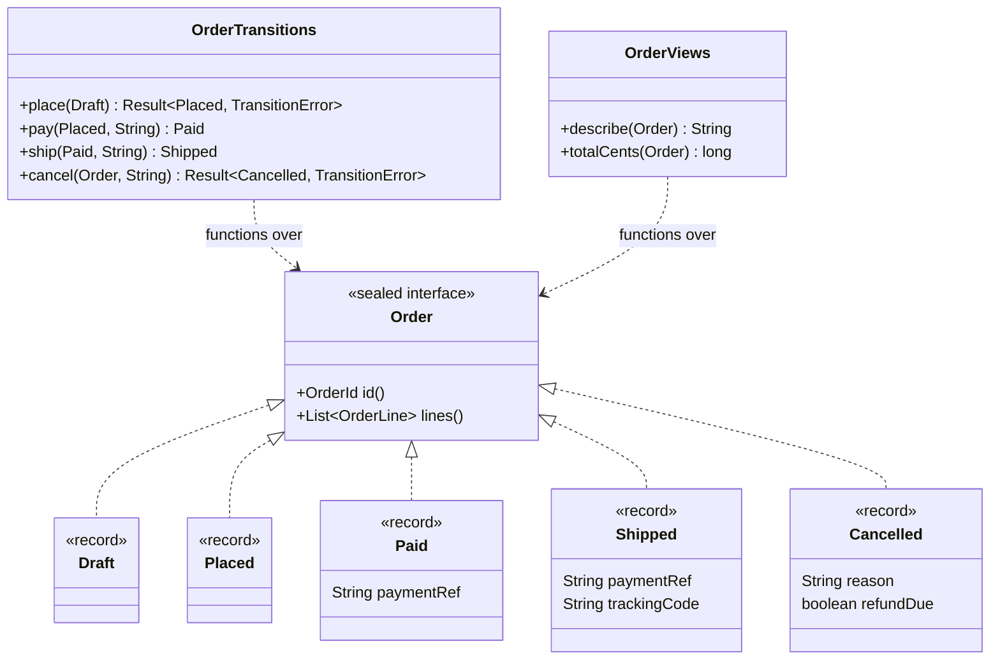
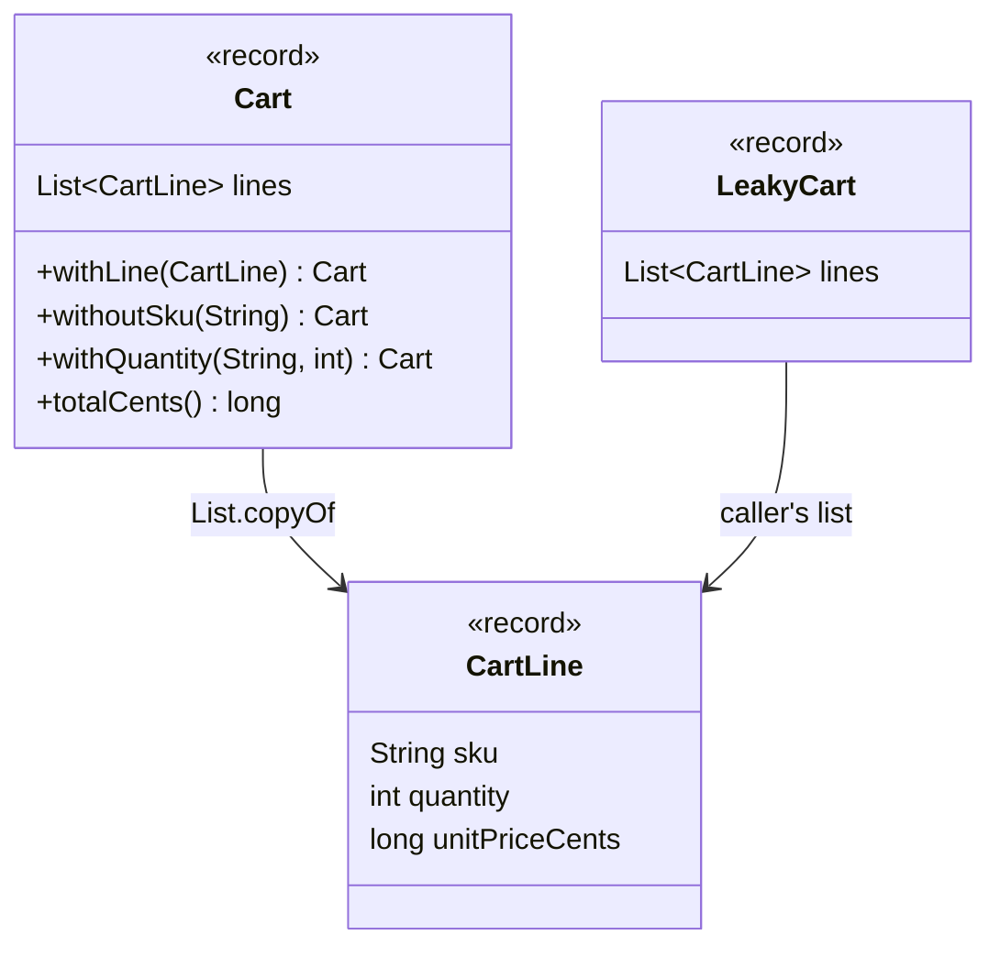
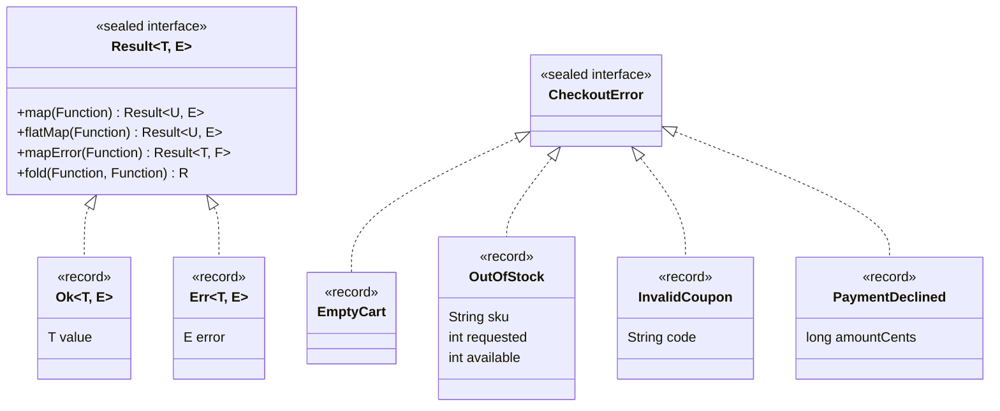
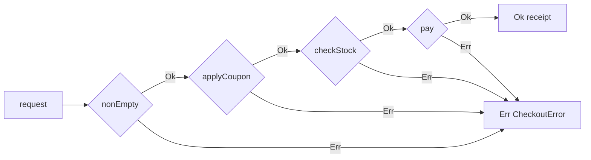
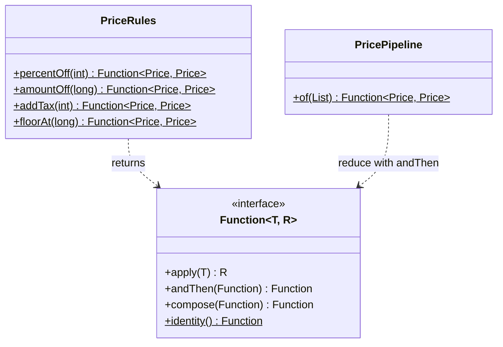
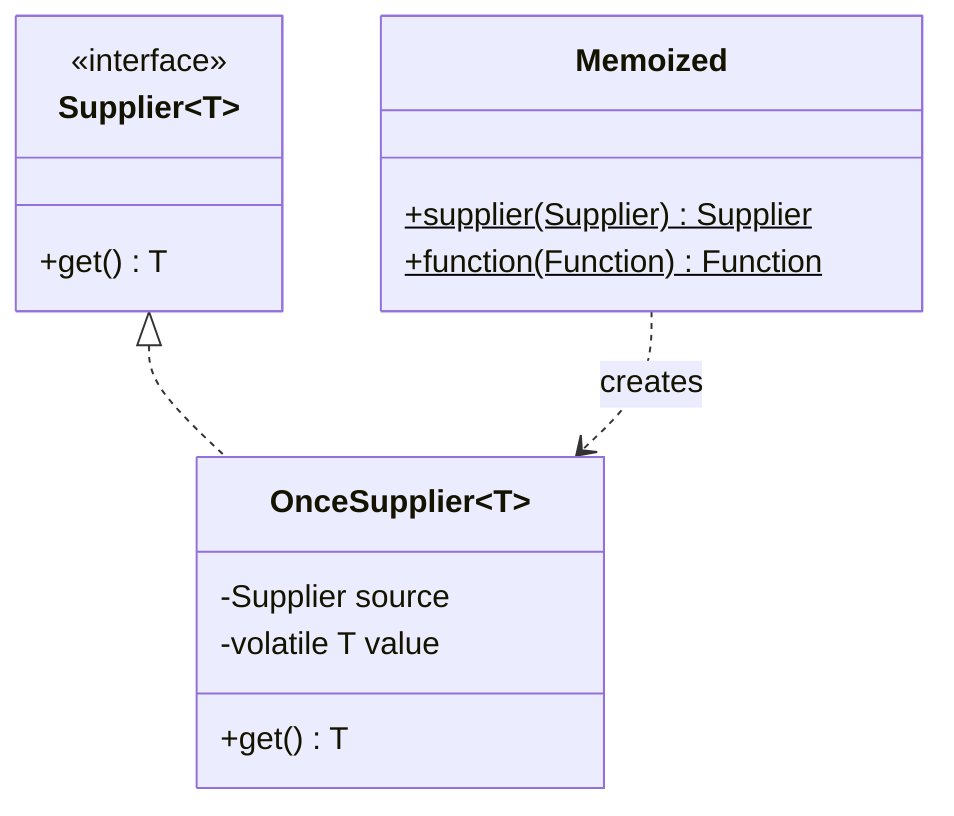

# Module 09 — Functional & Data-Oriented Patterns

> **Week 11** · Prerequisites: m08 (Visitor vs. sealed types, State as sealed records), m07 (fail-fast vs. collect-all validation), m06 (Strategy as lambdas, Template Method as a higher-order function, Stream Gatherers), m03 (records with compact constructors, withers) · Estimated study time: 7 h
>
> Run every example without a build: `java modules/m09-functional-data-oriented/src/main/java/io/github/aliturgutbozkurt/patterns/m09/examples/<path>/<Demo>.java` (JDK 27)

## Learning outcomes

By the end of this module you can:

1. **Model** a domain with data-oriented programming: records for data, sealed interfaces for alternatives,
   invariants in compact constructors and operations as exhaustive `switch` functions, and **refactor** a
   "status string + nullable fields" class into a model where illegal states cannot be built.
2. **Implement** deeply immutable values (defensive `List.copyOf`, withers, normalised `BigDecimal` money,
   `java.time` ranges) and **explain** view vs. copy and why a mutable hash key is a bug.
3. **Decide** between exceptions, `Optional` and a sealed `Result<T, E>`; **use** `Optional` as a return type only;
   **implement** `Result` with `map`/`flatMap`/`mapError`/`fold` and build a fail-fast ("railway") pipeline.
4. **Compose** behaviour from functions (`andThen`/`compose`, `Predicate` combinators, `reduce` over a list of
   functions) and **apply** currying and partial application.
5. **Implement** lazy evaluation and memoisation and **explain** why a recursive `HashMap.computeIfAbsent` fails.
6. **Compare** eight GoF patterns with the Java features that replaced them, and **decide** when the classic,
   class-based form is still the better choice.

## Motivation

m02–m08 taught the GoF catalogue one pattern at a time, and several of them shrank on the way: Strategy became a
lambda (m06), Template Method a higher-order function (m06), Visitor a `switch` over sealed types (m08). This module
steps back and teaches the *style* behind those shortcuts. Here is the kind of class it replaces, from the PatternShop
order code:

```java
// file: examples/dop/order/classic/LegacyOrderService.java
    public String describe(MutableOrder order) {
        String status = order.getStatus();
        String text;
        if (status.equals("DRAFT")) {
            text = "draft";
        } else if (status.equals("PLACED")) {
            text = "placed, awaiting payment";
        } else if (status.equals("PAID")) {
            text = "paid (" + order.getPaymentRef() + ")";
        } else if (status.equals("SHIPPED")) {
            text = "shipped, tracking " + order.getTrackingCode();
        } else if (status.equals("CANCELLED")) {
            text = "cancelled (" + order.getCancelReason() + ")";
        } else {
            text = "unknown";
        }
        return order.getId() + ": " + text;
    }
```

Nothing stops a caller from setting `"SHIPPED"` without a tracking code, from mistyping `"SHIPED"`, or from
cancelling an order that still has a tracking code. Every operation re-checks the status string at run time, and the
final `else` exists because the compiler cannot know which statuses there are:

```text
-- classic: a status string and nullable fields
A-1: shipped, tracking null
A-2: unknown
A-3: cancelled (lost in transit) -- but its tracking code is still TRK-1
```

**Data-oriented programming** (DOP) fixes this with four rules: model the data as immutable data (records), model
alternatives as sealed types, validate once at the boundary, and make illegal states unrepresentable. Errors become
values, behaviour is built by composing small functions, and expensive work is deferred and memoised. The examples use
the capstone's PatternShop domain, so you can apply the style to your capstone right away.

## Data-oriented programming

### Problem

An order goes through five states: draft, placed, paid, shipped, cancelled. Each state has its own data: only a paid
order has a payment reference, only a shipped one has a tracking code, only a cancelled one has a reason. One mutable
class with a status field and nullable fields accepts every combination, including the ones that make no sense.

### Intent

> Keep **data** and **behaviour** apart: data is plain, immutable and closed (records and sealed interfaces, so the
> compiler knows every case); behaviour is a set of functions over that data, each an exhaustive `switch`. Make illegal
> states impossible to construct, and turn untrusted input into valid data once, at the edge of the system.

### Structure



### Classic Java

The classic model is the `MutableOrder` above: fields for every state, setters, and services that inspect the status
string. The object-oriented fix would be the State pattern (m08) or a Visitor (m08); both add a class per state *and*
a class or method per operation.

### Modern Java 27

Each state becomes its own record and carries only the fields valid in that state. The compact constructors are the
invariants; `List.copyOf` makes the lines immutable:

```java
// file: examples/dop/order/modern/Order.java
public sealed interface Order permits Order.Draft, Order.Placed, Order.Paid, Order.Shipped, Order.Cancelled {

    OrderId id();

    List<OrderLine> lines();

    /** Being edited; may still be empty. */
    record Draft(OrderId id, List<OrderLine> lines) implements Order {
        public Draft {
            Objects.requireNonNull(id, "id");
            lines = List.copyOf(lines);
        }
    }
    // ...
    record Shipped(OrderId id, List<OrderLine> lines, String paymentRef, String trackingCode) implements Order {
        public Shipped {
            Objects.requireNonNull(id, "id");
            lines = nonEmpty(lines, "a shipped order");
            requireText(paymentRef, "paymentRef");
            requireText(trackingCode, "trackingCode");
        }
    }
```

"Shipped without a tracking code" now fails in the constructor, and "cancelled but shipped" has no record at all.
Transitions are plain functions typed by their **input** state. `ship` accepts only a `Paid` order, so shipping an
unpaid one is a compile error, not a run-time check. A transition that can still fail returns a `Result` (see
[Optional and Result](#optional-and-result--errors-as-values)):

```java
// file: examples/dop/order/modern/OrderTransitions.java
    public static Shipped ship(Paid paid, String trackingCode) {
        return new Shipped(paid.id(), paid.lines(), paid.paymentRef(), trackingCode);
    }

    public static Result<Cancelled, TransitionError> cancel(Order order, String reason) {
        return switch (order) {
            case Draft(var id, var lines) -> Result.ok(new Cancelled(id, lines, reason, false));
            case Placed(var id, var lines) -> Result.ok(new Cancelled(id, lines, reason, false));
            case Paid(var id, var lines, _) -> Result.ok(new Cancelled(id, lines, reason, true));
            case Shipped s -> Result.err(new AlreadyShipped(s.id()));
            case Cancelled c -> Result.err(new AlreadyCancelled(c.id()));
        };
    }
```

Operations are exhaustive `switch`es with record patterns, `_` for components they ignore, and **no `default`**. Add
a sixth state and every such `switch` stops compiling until it handles the new case:

```java
// file: examples/dop/order/modern/OrderViews.java
    public static String describe(Order order) {
        String text = switch (order) {
            case Draft(_, var lines) -> "draft, " + lines.size() + " line(s), total " + money(totalCents(order));
            case Placed _ -> "placed, awaiting payment of " + money(totalCents(order));
            case Paid(_, _, var paymentRef) -> "paid (" + paymentRef + ")";
            case Shipped(_, _, _, var trackingCode) -> "shipped, tracking " + trackingCode;
            case Cancelled(_, _, var reason, var refundDue) ->
                    "cancelled (" + reason + "), " + (refundDue ? "refund due" : "nothing to refund");
        };
        return order.id() + ": " + text;
    }
```

```text
-- modern: one record per state, transitions typed by their input
A-1: draft, 2 line(s), total 45.00
A-1: placed, awaiting payment of 45.00
A-1: paid (PAY-7)
A-1: shipped, tracking TRK-9
cancel A-1 (shipped) -> Err[error=AlreadyShipped[id=A-1]]
A-4: cancelled (changed mind), refund due
place A-5 (empty)    -> Err[error=EmptyOrder[id=A-5]]
```

**Data vs. objects.** DOP is not "never put a method on a record". A method that only derives a value from the
record's own components (`OrderLine.totalCents()`, `DateRange.days()`) belongs on the record. Behaviour that differs
*per case* or that needs outside services belongs in functions over the sealed type. This is the **expression
problem** in practice: with a Visitor, adding an operation is easy and adding a case is hard; with sealed types and
`switch` it is the same, but the compiler finds every place that needs the new case, and you write no `accept`
plumbing.

> **Advanced note — generic exhaustiveness.** With `sealed interface Shape<T> permits Circle, Label`, `record
> Circle<T>(…) implements Shape<T>` and `record Label(…) implements Shape<String>`, a `switch` over a `Shape<Integer>`
> is exhaustive with only `case Circle<Integer> c`: the compiler knows that `Label` can never be a `Shape<Integer>`.

### Parse, don't validate

The second DOP rule for the edges: turn untrusted input into typed data **once**, at the boundary, so the core never
checks anything again. Each value type validates itself in its constructor:

```java
// file: examples/dop/boundary/Sku.java
public record Sku(String value) {

    private static final Pattern FORMAT = Pattern.compile("[A-Z]{3}-\\d{4}");

    public Sku {
        Objects.requireNonNull(value, "sku");
        if (!FORMAT.matcher(value).matches()) {
            throw new IllegalArgumentException("sku must match AAA-9999: \"" + value + "\"");
        }
    }
```

The CSV importer is the only place that deals with bad input. It never throws for a bad row: the constructors'
exceptions become `Rejected` rows with a line number, and the core (`OrderLines.totalCents`) contains no validation
code at all:

```java
// file: examples/dop/boundary/CsvOrderImporter.java
    private static ImportedRow parseRow(int lineNo, String text) {
        String[] fields = text.strip().split(",", -1);
        if (fields.length != 3) {
            return new Rejected(lineNo,
                    "expected 3 fields (sku,quantity,unitPriceCents) but got " + fields.length);
        }
        try {
            var sku = new Sku(fields[0].strip());
            var quantity = new Quantity(number("quantity", fields[1]));
            long unitPrice = number("unitPriceCents", fields[2]);
            return new Accepted(lineNo, new OrderLine(sku, quantity, unitPrice));
        } catch (IllegalArgumentException e) {
            return new Rejected(lineNo, e.getMessage());
        }
    }
```

```text
-- the boundary: text in, typed rows out
line 1: accepted MUG-0001 x 2 @ 1250
line 2: accepted TEE-0002 x 1 @ 2000
line 3: rejected (sku must match AAA-9999: "mug-3")
line 4: rejected (quantity must be 1..99: 0)
line 5: rejected (quantity is not a number: "two")
line 6: rejected (expected 3 fields (sku,quantity,unitPriceCents) but got 2)
-- the core: only valid values, no checks left
accepted lines: 2, total 4500 cents
-- values are normalised once, when they are built
new Email("  Ali@Example.COM ") = ali@example.com
```

`Email` normalises in its compact constructor (trim, `toLowerCase(Locale.ROOT)`), so two spellings of one address are
`equals`. A validator would answer "is this valid?" and throw the answer away; a parser keeps it in the type.

### Real-world usage

- `java.time`: `LocalDate.of(2027, 2, 30)` throws, so every `LocalDate` you hold is a real date — a parsed value.
- `java.net.URI`, `java.nio.file.Path` and `java.util.UUID` are parsed once and then trusted everywhere.
- Records + sealed interfaces model JSON/AST data in the JDK's own tools and in frameworks such as Jackson (record
  deserialisation) and Spring (`@ConfigurationProperties` records).
- The capstone's order states and domain events are exactly this model.

### Pitfalls and when NOT to use it

- **A `default` branch on a sealed `switch`** silences the compiler: the next new case falls into it unnoticed.
- **Validation in the core again.** If the core still checks `sku != null`, the boundary is leaking; push the check
  into the value type.
- **Rich behaviour that belongs to one object.** An entity with real encapsulated state and many invariants that
  change together (a bank account with holds and limits) may be clearer as a classic object with methods.
- **Open hierarchies.** If other modules must add cases, a sealed type is the wrong tool; use an interface
  (m08 Visitor discussion).

### Related patterns

**State** (m08) as sealed records is DOP applied to one state machine. **Visitor** (m08) is the object-oriented
answer to "add operations to a closed hierarchy". **Value Object** and **Immutable object** (next section, m10).

## Immutability and value objects

### Problem

A record's fields are `final`, but that only freezes the *references*. A record that stores the caller's `ArrayList`
changes whenever the caller changes the list, and a `BigDecimal` of `2.0` is not `equals` to `2.00`, so two equal
prices can disagree.

### Intent

> Make values **deeply immutable** (every component immutable or copied), give them **value equality** in one
> normalised representation, and express every change as a **new value** (withers).

### Structure



### Classic Java

The leak: the record keeps the caller's list, so it is only *shallowly* immutable:

```java
// file: examples/immutability/cart/LeakyCart.java
public record LeakyCart(List<CartLine> lines) {}
```

The classic fix was a getter returning `Collections.unmodifiableList(lines)`. That is a **view**: the caller cannot
change it through the view, but it still shows every later change to the source list.

### Modern Java 27

Copy in the compact constructor, and change by building a new value:

```java
// file: examples/immutability/cart/Cart.java
public record Cart(List<CartLine> lines) {

    public Cart {
        lines = List.copyOf(lines);
    }
    // ...
    /** Sets the quantity of {@code sku}; {@code 0} removes the line. */
    public Cart withQuantity(String sku, int quantity) {
        if (quantity < 0) {
            throw new IllegalArgumentException("quantity must not be negative: " + quantity);
        }
        if (quantity == 0) {
            return withoutSku(sku);
        }
        return new Cart(lines.stream()
                .map(line -> line.sku().equals(sku) ? line.withQuantity(quantity) : line)
                .toList());
    }
```

```text
-- a record is only as immutable as its components
after source.add(TEE): LeakyCart has 2 line(s), Cart has 1 line(s)
leaky.lines() == source: true
cart.lines().add(...) -> UnsupportedOperationException
-- change = a new value (withers)
original       [MUG-0001 x2, TEE-0002 x1] total 4500
withLine(CAP)  [MUG-0001 x2, TEE-0002 x1, CAP-0003 x1] total 5300
withoutSku(MUG)[TEE-0002 x1] total 2000
withQuantity 3 [MUG-0001 x2, TEE-0002 x3] total 8500
original again [MUG-0001 x2, TEE-0002 x1] total 4500
-- view vs. copy
unmodifiableList view: [a, b]
List.copyOf copy:      [a]
```

`List.copyOf` also rejects `null` elements, and it returns the **same instance** when given a list that is already
unmodifiable (`List.of(...)`), so copying is cheap when nothing needs copying.

### Value objects

A value object is equal by value and has one normal form. `new BigDecimal("2.0").equals(new BigDecimal("2.00"))` is
`false` (the scale differs), so `Money` normalises the scale to the currency's minor unit in its compact constructor:

```java
// file: examples/immutability/values/Money.java
public record Money(BigDecimal amount, Currency currency) {

    public Money {
        Objects.requireNonNull(amount, "amount");
        Objects.requireNonNull(currency, "currency");
        amount = amount.setScale(currency.getDefaultFractionDigits(), RoundingMode.HALF_EVEN);
    }
```

`stripTrailingZeros()` is not a normal form (`100` prints as `1E+2`), and `setScale(2)` without a rounding mode throws
`ArithmeticException` for `2.345`. `DateRange` builds on `java.time`, whose types are the JDK's own immutable values:
`withEnd` and `shiftedBy(Period)` return new ranges.

```text
-- BigDecimal vs. Money
new BigDecimal("2.0").equals(new BigDecimal("2.00")) = false
Money.of("2.0", "EUR").equals(Money.of("2.00", "EUR")) = true
2.345 EUR -> 2.34 EUR, 2.355 EUR -> 2.36 EUR (HALF_EVEN)
150 JPY -> 150 JPY (no minor unit)
19.99 EUR x 3 = 59.97 EUR, 15% of it = 9.00 EUR
-- DateRange on java.time.LocalDate
spring sale 2027-03-01..2027-03-10: 10 day(s)
overlaps 2027-03-10..2027-03-15: true
extended to 2027-03-11, shifted by P1M: 2027-04-01..2027-04-10
original still 2027-03-01..2027-03-10
-- a mutable key breaks a HashSet
after setCode: contains(key) = false, size = 1
```

The last line is the **mutable-key bug**: `MutableKeyPitfall` computes its hash code from a field that can change.
After `setCode`, the set looks in a different bucket and cannot find the key, although it still holds it. A record key
whose components are immutable cannot do this.

### Real-world usage

`String`, the boxed primitives, `BigDecimal`, `java.time` (`LocalDate`, `Instant`, `Duration`, `Period`),
`List.of`/`Map.of`, `Optional` and records are all immutable in the JDK. Value-based classes (m05) are the JDK's name
for immutable values without identity.

### Pitfalls and when NOT to use it

- **Arrays in records**: `record Arr(int[] a)` compares the array by reference, and the array can be changed from
  outside. Copy it, or use a `List`.
- **`unmodifiableList` is not a copy**: it is a read-only window on a list that someone else can still change.
- **Large, frequently changed structures**: copying a 100 000-element list on every change is slow. Persistent
  collections (with structural sharing) solve that; they are outside the JDK and outside this course.

### Related patterns

**Prototype** (m03) copies objects; withers make copying the normal way of changing. **Flyweight** (m05) shares
immutable values. **Immutable object** returns in m10 as the simplest way to be thread-safe.

## Optional and Result — errors as values

### Problem

A checkout can fail in four ways: empty cart, invalid coupon, short stock, declined payment. With exceptions, none of
them appears in the signature `Receipt checkout(CheckoutRequest)`, and control jumps out of the middle of the method.
With `Optional<Receipt>`, the caller sees *that* it failed but never *why*.

### Intent

> Return failures as **values** whose type names every way to fail. Chain the steps so that each runs only on the
> success track and the first failure switches to the failure track ("railway"); make the caller handle every error
> kind exhaustively.

### Structure



The railway for the checkout: every step is a `flatMap`, and an `Err` from any step skips all later steps.



### Classic Java

The exception style reads top to bottom, but every failure leaves through a hidden exit:

```java
// file: examples/result/checkout/ExceptionCheckout.java
    public Receipt checkout(CheckoutRequest request) {
        if (request.items().isEmpty()) {
            throw new CheckoutException.EmptyCart();
        }
        long total = request.totalCents();
        if (!request.coupon().isBlank()) {
            int percent = Coupons.percentOff(request.coupon())
                    .orElseThrow(() -> new CheckoutException.InvalidCoupon(request.coupon()));
            total = Coupons.discounted(total, percent);
        }
```

### Modern Java 27

A minimal, honest `Result`: two records nested in a sealed interface, `null` rejected on both tracks:

```java
// file: examples/result/core/Result.java
public sealed interface Result<T, E> permits Result.Ok, Result.Err {

    /** The success track. {@code value} is never {@code null}. */
    record Ok<T, E>(T value) implements Result<T, E> {
        public Ok {
            Objects.requireNonNull(value, "value");
        }
    }

    /** The failure track. {@code error} is never {@code null}. */
    record Err<T, E>(E error) implements Result<T, E> {
        public Err {
            Objects.requireNonNull(error, "error");
        }
    }
    // ...
    /** Chains a step that can itself fail: the first {@code Err} wins and later steps never run. */
    default <U> Result<U, E> flatMap(Function<? super T, ? extends Result<? extends U, E>> f) {
        Objects.requireNonNull(f, "f");
        return switch (this) {
            case Ok<T, E>(var value) -> narrow(f.apply(value));
            case Err<T, E>(var error) -> new Err<>(error);
        };
    }
    // ...
    private static <U, E> Result<U, E> narrow(Result<? extends U, E> result) {
        return switch (result) {
            case Ok<? extends U, E>(var value) -> new Ok<>(value);
            case Err<? extends U, E>(var error) -> new Err<>(error);
        };
    }
```

Two details are forced by the compiler. `map`/`flatMap` rebuild the `Err` with `new Err<>(error)`: casting an
`Err<T, E>` to `Result<U, E>` would be an unchecked warning, and this course builds with `-Werror`. For the same
reason `flatMap` copies the value out of `Result<? extends U, E>` through `narrow`. The tests also check the three
monad laws (left identity, right identity, associativity) on a table of values: you do not need the theory, but the
laws are why chains of `flatMap` behave predictably.

The `Result` checkout is now a list of steps:

```java
// file: examples/result/checkout/ResultCheckout.java
    public Result<Receipt, CheckoutError> checkout(CheckoutRequest request) {
        return nonEmpty(request)
                .flatMap(ResultCheckout::applyCoupon)
                .flatMap(this::checkStock)
                .flatMap(this::pay);
    }
```

The caller handles every error kind with one exhaustive `switch`:

```java
// file: examples/result/checkout/CheckoutErrors.java
    public static String message(CheckoutError error) {
        return switch (error) {
            case EmptyCart _ -> "your cart is empty";
            case OutOfStock(var sku, var requested, var available) ->
                    "only " + available + " x " + sku + " left (you asked for " + requested + ")";
            case InvalidCoupon(var code) -> "coupon " + code + " is not valid";
            case PaymentDeclined(var amountCents) -> "payment of " + money(amountCents) + " was declined";
        };
    }
```

### Choosing an error model

```text
-- happy path
exceptions: Receipt[paymentId=PAY-1, totalCents=4500]
Optional:   Optional[Receipt[paymentId=PAY-1, totalCents=4500]]
Result:     Ok[value=Receipt[paymentId=PAY-1, totalCents=4500]]
-- short stock
exceptions: threw OutOfStock: only 1 x TEE-0002 left (you asked for 2)
Optional:   Optional.empty
Result:     Err[error=OutOfStock[sku=TEE-0002, requested=2, available=1]]
-- declined
exceptions: threw PaymentDeclined: payment of 25.00 was declined
Optional:   Optional.empty
Result:     Err[error=PaymentDeclined[amountCents=2500]]
-- the Result caller must handle every kind (exhaustive switch, no default)
short stock -> only 1 x TEE-0002 left (you asked for 2)
declined    -> payment of 25.00 was declined
```

| Model | In the signature? | Says why? | Use it for |
|---|---|---|---|
| Exception | no (unchecked) / yes, but clumsy (checked) | yes | bugs and truly exceptional, unrecoverable situations (disk gone, broken invariant) |
| `Optional<T>` | yes | no | "maybe absent" with one obvious reason (not found) |
| `Result<T, E>` | yes | yes, as a sealed type | expected business failures the caller must handle |

In all three versions the tests prove that no later step runs after the first failure (the payment gateway is not
called when stock is short) and that a declined payment releases the reserved stock.

### Optional as a return type

`Optional` was designed as a return type for queries that may find nothing. The course rule — **`Optional` only as a
return type** — is enforced by a reflection test over the whole `optional.directory` package: no field, no record
component and no public parameter has type `Optional`. Why? `Optional` is not `Serializable`, a field of type
`Optional` has *three* states (`null`, empty, present), and an `Optional` parameter forces every caller to wrap.
Absence inside data is a sealed case instead (`Referral` is `Direct` or `ReferredBy`), and `Customer.referrer()` offers
an `Optional` *view* of it. A chain of lookups then reads as one expression:

```java
// file: examples/optional/directory/CustomerDirectory.java
    public String referrerName(String email) {
        return findByEmail(email)
                .flatMap(Customer::referrer)
                .flatMap(this::findById)
                .map(Customer::name)
                .orElse("nobody");
    }
    // ...
    /** Never {@code Optional<List<…>>}: an unknown customer simply has no orders. */
    public List<OrderSummary> ordersOf(CustomerId id) {
        return orders.stream().filter(o -> o.customer().equals(id)).toList();
    }
```

```text
-- orElse vs. orElseGet
orElse:    fallback computed 1 time(s)
orElseGet: fallback computed 0 time(s)
```

`orElse(expensive())` evaluates its argument even when a value is present; `orElseGet(() -> expensive())` does not.

### The same shape in the JDK

`map` transforms a value inside a container, `flatMap` chains a step that returns a container. `Optional`, `Stream`
and `CompletableFuture` all have that shape; the future calls them `thenApply` and `thenCompose`, and `handle` is its
`fold`:

```java
// file: examples/result/jdk/JdkResultShapes.java
    public CompletableFuture<Long> totalAsync(String sku) {
        return priceAsync(sku)
                .thenApply(JdkResultShapes::withTax)
                .thenCompose(this::withShippingAsync);
    }
```

A `CompletableFuture` is an asynchronous `Result<T, Throwable>`, with one trap: after a dependent stage, the failure
arrives wrapped in a `CompletionException`. `exceptionally` directly on `failedFuture(e)` receives `e`, but after a
`thenApply` it receives a `CompletionException` whose cause is `e`. `FutureResults.toResult` unwraps it:

```java
// file: examples/result/jdk/FutureResults.java
    public static <T> Result<T, Throwable> toResult(CompletableFuture<T> future) {
        Objects.requireNonNull(future, "future");
        return future.<Result<T, Throwable>>handle((value, failure) ->
                failure == null ? Result.ok(value) : Result.err(cause(failure))).join();
    }
```

```text
-- CompletableFuture -> Result
toResult(totalAsync(MUG-0001)) = Ok[value=1999]
toResult(totalAsync(XXX-0000)) = Err[error=java.util.NoSuchElementException: unknown sku XXX-0000]
```

The futures here are already completed; asynchronous pipelines are m10's topic.

### Real-world usage

`Optional` (Java 8), `CompletableFuture`, `Stream`; `HttpResponse` status codes as data; Vavr's `Either`/`Try`,
Kotlin's `Result` and Rust's `Result<T, E>` are the same idea. Spring's `ResponseEntity` and many validation APIs return
errors as values instead of throwing.

### Pitfalls and when NOT to use it

- **`System.out.println(result.fold(...))` does not compile.** `println(char[])` and `println(String)` are both
  applicable, so the type `R` cannot be inferred. Assign to a `String` first: `String text = result.fold(...);`.
- **`Result` for bugs.** A `null` where none may be, or a broken invariant, is a programming error: throw.
- **`Optional` fields, parameters and `Optional<List<…>>`.** Use a sealed case, an overload, or an empty list.
- **`optional.get()` without a check** is the old `NullPointerException` with a new name; prefer `orElseThrow` with a
  message, `map` and `orElse`.
- **Collect-all needs more than `flatMap`.** `flatMap` is fail-fast by design; collecting every field error (ex02)
  needs a separate step that gathers the `Err`s.

### Related patterns

**Chain of Responsibility** (m07) validation chains: fail-fast (`andThen`) vs. collect-all (`and`) — the same two
policies as `flatMap` vs. gathering all errors. **Null Object** is the object-oriented answer to "maybe absent".

## Function composition, currying and partial application

### Problem

A price goes through a changing list of rules: 10 % off, then 30.00 off, never below 10.00, then tax. As Decorator
classes (m04), each rule is a class wrapping another; reordering or configuring the rules means new objects and new
classes.

### Intent

> Build behaviour by **composing** small functions: `f.andThen(g)` runs `f` then `g`, `g.compose(f)` means the same.
> Fold a list of functions into one. Fix some arguments of a function now and supply the rest later (**partial
> application**); write a function of several arguments as a chain of one-argument functions (**currying**).

### Structure



### Classic Java

Decorator as classes: a shared interface and one wrapper class per decoration (the catalogue's Decorator row):

```java
// file: examples/features/catalogue/DecoratorRow.java
        record Trimmed(Text inner) implements Text {
            public String render() { return inner.render().strip(); }
        }

        record Upper(Text inner) implements Text {
            public String render() { return inner.render().toUpperCase(Locale.ROOT); }
        }
```

### Modern Java 27

Each rule is a function returned by a factory method; a list of rules is folded into one function with
`reduce(Function.identity(), Function::andThen)`, which is the identity for an empty list and applies the rules in
list order:

```java
// file: examples/composition/pricing/PriceRules.java
    public static Function<Price, Price> percentOff(int percent) {
        requirePercent(percent);
        return price -> new Price(price.cents() * (100 - percent) / 100);
    }

    /** Subtracts a fixed amount, but never below zero. */
    public static Function<Price, Price> amountOff(long cents) {
        return price -> new Price(Math.max(0, price.cents() - cents));
    }
```

```java
// file: examples/composition/pricing/PricePipeline.java
    public static Function<Price, Price> of(List<Function<Price, Price>> rules) {
        return rules.stream().reduce(Function.identity(), Function::andThen);
    }
```

```text
-- one rule at a time, composed with andThen
100.00 -> 10% off -> 90.00 -> +20% tax -> 108.00
-- order matters
amountOff(10.00).andThen(addTax(20)) = 108.00
addTax(20).andThen(amountOff(10.00)) = 110.00
-- a list of rules folded into one function (reduce(identity, andThen))
spring sale on  40.00 = 10.00
spring sale on 120.00 = 66.00
```

`UnaryOperator<T>.andThen` is inherited from `Function` and returns a `Function`, which is why the pipeline is typed
with `Function<Price, Price>`. Predicates compose the same way:

```java
// file: examples/composition/pricing/Eligibility.java
    public static Predicate<Customer> freeShipping() {
        return member().or(loyal(5)).and(Predicate.not(blocked()));
    }
```

### A text pipeline and the Turkish I

Product URL slugs for a Turkish shop, built from six tiny steps, each tested on its own:

```java
// file: examples/composition/text/Slugifier.java
    public static Function<String, String> forLocale(Locale locale) {
        return lowerCase(locale)
                .andThen(transliterateTurkish())
                .andThen(stripDiacritics())
                .andThen(replaceNonAlphanumeric())
                .andThen(collapseDashes())
                .andThen(trimDashes());
    }
```

Why does every case conversion name its `Locale`? Turkish has **four** letters I: dotted `i`/`İ` and dotless `ı`/`I`.
In Turkish, `"I".toLowerCase(tr)` is `"ı"` and `"i".toUpperCase(tr)` is `"İ"`. The root locale gets it wrong the other
way: `"İ".toLowerCase(Locale.ROOT)` is `i` followed by a combining dot (length 2). `toLowerCase()` without an argument
uses the machine's default locale, so the same code gives different results on a Turkish laptop — a classic bug
(`"TITLE".toLowerCase().equals("title")` is `false` there). Decomposing with NFD and removing combining marks turns
`ş ö ğ ü ç` into ASCII, but the dotless `ı` does not decompose, so the pipeline needs an explicit
`ı → i` step:

```text
-- a slug pipeline of six small functions
"İstanbul'da Kış İndirimi" -> istanbulda-kis-indirimi
"Çay & Simit Seti (2 kişilik)" -> cay-simit-seti-2-kisilik
"ŞEKER BAYRAMI" -> seker-bayrami
-- why every case conversion names its Locale
"ISTANBUL".toLowerCase(tr)   = ıstanbul
"ISTANBUL".toLowerCase(ROOT) = istanbul
"İ".toLowerCase(ROOT).length() = 2
without the transliteration step: "ISTANBUL" -> stanbul
-- compose vs. andThen
trimDashes.compose(collapseDashes)("--a--b--") = a-b
```

### Currying and partial application

A curried function takes its arguments one at a time; fixing the first ones gives a specialised function — a
"configured strategy" without a class:

```java
// file: examples/composition/currying/Curry.java
    public static <A, B, C> Function<A, Function<B, C>> curry(BiFunction<A, B, C> f) {
        return a -> b -> f.apply(a, b);
    }
    // ...
    public static <A, B, C> Function<B, C> partial(BiFunction<A, B, C> f, A a) {
        return b -> f.apply(a, b);
    }
```

`ShippingRates.rates()` is `zone → grams → cents`; `forZone(DOMESTIC)` is stored and reused as a
`Function<Integer, Long>`:

```text
-- zone -> weight -> price: fix the zone once, reuse the tariff
DOMESTIC:  500 g -> 4.99   1500 g -> 5.99   2500 g -> 6.99
EU:        500 g -> 9.99   1500 g -> 12.49   2500 g -> 14.99
WORLD:     500 g -> 19.99   1500 g -> 24.99   2500 g -> 29.99
```

**Currying** turns `(a, b) -> c` into `a -> b -> c` (always one argument per step). **Partial application** fixes
some arguments of any function and returns a function of the rest. Java has no syntax for either; lambdas returning
lambdas are enough.

### Real-world usage

`Comparator.comparing(...).thenComparing(...)`, `Predicate.not`, `Function.identity`, `Collectors.mapping`/`filtering`
compose functions; servlet filters and Spring's `WebFilter`/`RouterFunction` compose request handlers; logging
frameworks' `Supplier<String>` overloads defer the message.

### Pitfalls and when NOT to use it

- **Order matters and is easy to misread.** `a.andThen(b)` runs `a` first; `a.compose(b)` runs `b` first.
- **Deeply curried signatures** (`Function<A, Function<B, Function<C, D>>>`) are hard to read; give the intermediate
  function a name (`forZone`) or use a record of parameters.
- **Stateful or many-method decorators.** `InputStream` decorators (m04) have many methods and state; they stay
  classes.
- **Debugging**: a stack trace through composed lambdas shows `lambda$…` frames; small named factory methods help.

### Related patterns

**Decorator** (m04) and **Chain of Responsibility** (m07) middleware are composition of objects; here they are
composition of functions. **Strategy** (m06) is a single function; currying builds configured strategies.

## Lazy evaluation and memoisation

### Problem

An exchange-rate lookup is slow, and the rate is needed by some requests but not all. Loading it eagerly wastes time;
loading it on every call wastes more. A hand-written cache field per use repeats the same double-checked code, and a
debug log line that builds a large message costs time even when debug logging is off.

### Intent

> Defer work until its result is needed (**lazy evaluation**), and compute each result at most once (**memoisation**),
> using functions (`Supplier`, `Function`) instead of a new class per use.

### Structure



### Classic Java

The Virtual Proxy (m04) and the lazy holder (m02) solve this with a class per use. A hand-written cache looks
harmless, but this one is broken — it modifies the `HashMap` from inside its own `computeIfAbsent`:

```java
// file: examples/lazy/memo/Fibonacci.java
    public long recursiveWithComputeIfAbsent(int n) {
        if (n < 2) {
            return n;
        }
        return cache.computeIfAbsent(n, k -> recursiveWithComputeIfAbsent(k - 1) + recursiveWithComputeIfAbsent(k - 2));
    }
```

`HashMap` detects the change and throws `ConcurrentModificationException`; `ConcurrentHashMap` may even dead-lock
or throw `IllegalStateException("Recursive update")`. The correct Fibonacci needs no cache: keep the last two values
(`fib(90) = 2880067194370816120`).

### Modern Java 27

One memoising `Supplier` for every use. It is thread-safe (double-checked on a `volatile` field), computes at most
once **on success**, rethrows a failure without caching it, and rejects `null`:

```java
// file: examples/lazy/memo/Memoized.java
        @Override
        public T get() {
            T result = value;
            if (result == null) {
                synchronized (this) {
                    result = value;
                    if (result == null) {
                        result = Objects.requireNonNull(source.get(), "the supplier returned null");
                        value = result;
                    }
                }
            }
            return result;
        }
```

The test calls `get()` from 100 virtual threads at once and asserts that the source ran exactly once. The memoising
`Function` is one line, `key -> cache.computeIfAbsent(key, f)`, with the cache captured in the returned lambda — an
instance, never a static field.

```text
-- a memoised supplier: nothing happens until get()
created (loads so far: 0)
get() -> 37.50 (loads: 1)
get() -> 37.50 (loads: 1)
-- a memoised function: one load per distinct key
EUR/TRY=37.50 USD/TRY=34.20 EUR/TRY=37.50 USD/TRY=34.20 (loads: 2)
-- a failure is not cached: the next get() tries again
get() -> IllegalStateException: rate service down
get() -> 37.50
-- the recursive HashMap.computeIfAbsent trap
fib(10), recursive computeIfAbsent -> ConcurrentModificationException
fib(90), iterative                 -> 2880067194370816120
```

> ⚠️ **Preview feature — Lazy Constants (JEP 531, third preview in JDK 27).** `java.lang.LazyConstant<T>` extends
> `Supplier<T>`; `LazyConstant.of(supplier)` computes its value at most once and lets the JVM treat it as a constant
> afterwards (constant folding), which a hand-written `volatile` field cannot offer. It is the JDK's future answer to
> `Memoized.supplier` and to the lazy holder idiom (m02). Preview APIs need `--enable-preview` and may still change, so
> this course shows no code for it and no example depends on it.

### Lazy streams

Streams are lazy: intermediate operations only describe the pipeline, and elements travel through it one at a time
("vertically"). A short-circuiting terminal operation stops as soon as it has its answer:

```java
// file: examples/lazy/streams/LazyTrace.java
    public Optional<Integer> firstEven(List<Integer> numbers) {
        return numbers.stream()
                .peek(n -> trace.add("see " + n))
                .filter(n -> n % 2 == 0)
                .peek(n -> trace.add("even " + n))
                .findFirst();
    }
```

`Gatherers.scan` emits every running value, `Gatherers.fold` only the last one — and on an empty stream `scan` emits
nothing while `fold` still emits the initial value:

```java
// file: examples/lazy/streams/Ledger.java
    public static List<Long> runningBalances(List<Long> movements) {
        return movements.stream().gather(Gatherers.scan(() -> 0L, Long::sum)).toList();
    }

    public static List<Long> closingBalance(List<Long> movements) {
        return movements.stream().gather(Gatherers.fold(() -> 0L, Long::sum)).toList();
    }
```

```text
-- vertical, one element at a time; findFirst stops early
[see 1, see 2, even 2] -> Optional[2]
-- no terminal operation, no work
trace without a terminal operation: []
-- an infinite stream, cut by limit
Stream.iterate(1, x -> 2 * x).limit(5) = [1, 2, 4, 8, 16]
-- a message supplier runs only if the level is enabled
WARNING cart CART-7 has 3 items
message suppliers called: 1
-- running balance (scan) vs. closing balance (fold)
movements [100, -30, 5]
scan -> [100, 70, 75]
fold -> [75]
```

`LazyLog.log(Level, Supplier<String>)` has the same shape as `System.Logger.log(Level, Supplier<String>)`: the
message is built only if the level is enabled.

### Real-world usage

`System.Logger` and SLF4J/Log4j `Supplier` overloads; `Map.computeIfAbsent`; `ClassValue`; streams and
`Stream.iterate`/`generate`; Spring's `ObjectProvider` and `@Lazy`; Hibernate's lazy associations (a Virtual Proxy).

### Pitfalls and when NOT to use it

- **Recursive `computeIfAbsent`** — see above. Memoise recursive functions with an explicit loop or a separate map
  filled bottom-up.
- **Side effects in lazy code**: `peek` and logging inside a pipeline run later, fewer times, or never.
- **Caching failures** turns one timeout into a permanent failure; `Memoized.supplier` deliberately does not cache
  exceptions.
- **Unbounded memo caches** leak memory; a memoised function over user input needs a size limit or an expiry
  (a real cache library).

### Related patterns

**Proxy** (m04, Virtual Proxy) and **Singleton** (m02, lazy holder) are the class-based forms. **Flyweight** (m05)
shares computed values. m10 returns to thread-safe lazy initialisation.

## Patterns that became language features

Most of the patterns of m02–m08 exist because Java once had no lambdas, no records, no sealed types and no pattern
matching. Each row of `features.catalogue` puts the classic form and the modern form side by side (≤ 40 lines per
side); a parameterised test runs both on the same input and asserts the same output. The table below is the output of
`Catalogue.markdownTable()`:

| Pattern | Java feature that does its job | Still write the class when… | Full treatment |
|---|---|---|---|
| Strategy | lambda / `Comparator` | the strategy has state, several methods or a name in the domain | m06 |
| Command | sealed records + `switch`, `Runnable` | commands carry their own undo logic or are plugged in from outside | m06 |
| Template Method | higher-order function | the steps share protected state or there are many of them | m06 |
| Visitor | sealed records + `switch` | the hierarchy is open and must be extended from outside the module | m08 |
| Iterator | `Stream.iterate` + gatherers | the cursor walks an external resource or must be paused and resumed | m06 |
| Factory | `Map<String, Supplier<T>>` + constructor refs | creation needs several steps, parameters or its own dependencies | m02 |
| Decorator | `Function.andThen` | the wrapped type has many methods (e.g. `InputStream`) | m04 |
| Singleton | `enum` with one constant | never; prefer passing the object in (dependency injection) | m02 |

The rule of thumb behind the third column: keep the class when it **has state**, **needs several methods**, **needs
a name** in the domain, or **must be extended from outside the module**. Three rows in code — the Visitor row's modern
side needs no `accept` at all:

```java
// file: examples/features/catalogue/VisitorRow.java
        sealed interface Shape permits Circle, Rect {}

        record Circle(double radius) implements Shape {}

        record Rect(double width, double height) implements Shape {}
        // ...
        static double area(Shape shape) {
            return switch (shape) {
                case Circle(var r) -> Math.PI * r * r;
                case Rect(var w, var h) -> w * h;
            };
        }
```

The Factory row's modern side is a map of constructor references:

```java
// file: examples/features/catalogue/FactoryRow.java
        static final Map<String, Supplier<Shape>> SHAPES = Map.of("circle", Circle::new, "square", Square::new);
```

The Singleton row's modern side is an `enum`. The JVM creates `INSTANCE` exactly once, serialisation keeps it unique,
and even reflection is refused (`Constructor.newInstance` throws `IllegalArgumentException: Cannot reflectively create
enum objects`, which the tests check):

```java
// file: examples/features/catalogue/SingletonRow.java
        enum Settings {
            INSTANCE;

            String currency() {
                return "EUR";
            }
        }
```

> ⚠️ **Preview feature — primitive types in patterns (JEP 532, fifth preview in JDK 27).** Patterns, `instanceof`
> and `switch` will accept primitive types, e.g. a `case int i when i >= 400` over an HTTP status, with safe
> narrowing checks. Without flags the compiler rejects it ("primitive patterns are a preview feature and are disabled
> by default"); with `--enable-preview --source 27` it runs. Because it is still a preview, this course uses no
> primitive patterns in code.

### The combined effect

`features.shop` writes the same PatternShop invoice run twice. The classic package uses discount strategy classes, a
`LineItemVisitor` for tax and weight, an abstract `InvoiceFormatter` (Template Method) and `PostAction` command objects.
The modern package uses sealed records, `switch` functions, a map of discount functions, a formatter that takes its
steps as functions, and `Runnable`s:

```java
// file: examples/features/shop/modern/Invoicing.java
    static long tax(LineItem item) {
        return switch (item) {
            case PhysicalItem p -> amount(p) * 20 / 100;
            case DigitalItem d -> amount(d) * 10 / 100;
            case GiftCard _ -> 0;
        };
    }
    // ...
    public static List<Runnable> postActions(Invoice invoice, List<String> log) {
        Order order = invoice.order();
        Runnable email = () -> log.add("email invoice " + order.id() + " to " + order.customer());
        Runnable archive = () -> log.add("archive invoice " + order.id());
        Runnable ship = () -> log.add("book shipping " + order.id() + " (" + invoice.grams() + " g)");
        return invoice.grams() > 0 ? List.of(email, archive, ship) : List.of(email, archive);
    }
```

Both versions print byte-identical invoices for four orders and run the post-actions in the same order. The tests also
check that the modern package declares no abstract class and no method named `accept`, and count the top-level types:
**21 classic, 6 modern**. The modern version still keeps named types where names help: the `LineItem` hierarchy (the
domain vocabulary, checked by the compiler) and the `Invoice` record (six related numbers).

```text
INVOICE A-3 for Linus
  LAMP-0003 x1                 60.00
  TEE-0002 x3                  60.00
  subtotal                    120.00
  discount BULK                -6.00
  tax                          24.00
  total                       138.00
  shipping weight 1800 g
```

## Summary

| Technique | Use when | Avoid when | Java 27 tools |
|---|---|---|---|
| Data-oriented programming | Closed set of cases, operations over data, validation at the edge | The hierarchy must stay open to other modules | Records, sealed interfaces, record patterns, `_`, exhaustive `switch` |
| Immutability & value objects | Values that are shared, used as keys or compared by value | Huge structures changed constantly | Compact constructors, `List.copyOf`, withers, `java.time`, normalised `BigDecimal` |
| `Optional` | A query may find nothing, for one obvious reason | Fields, parameters, collections | `map`, `flatMap`, `or`, `orElseGet`, `orElseThrow`, `stream` |
| `Result<T, E>` | Expected failures the caller must handle, each with a reason | Bugs and broken invariants (throw) | Generic sealed records, `flatMap` railway, `fold`, `Collectors.teeing` |
| Function composition & currying | Rules that are stacked, reordered or configured | Wrapped types with many methods or state | `Function.andThen`/`compose`, `Predicate.not`, lambdas returning lambdas |
| Laziness & memoisation | Costly work that may not be needed or is needed often | Recursive memo via `computeIfAbsent`; unbounded caches | `Supplier`, `ConcurrentHashMap.computeIfAbsent`, streams, `Gatherers.scan`/`fold` |

## Quiz

1. Name the four rules of data-oriented programming.
2. Why should a `switch` over a sealed type have no `default` branch?
3. Adding a new *case* vs. adding a new *operation*: which is easy with a Visitor, and which with sealed types +
   `switch`? What does the compiler do for you in the second design?
4. What does "parse, don't validate" mean for the `CsvOrderImporter` and for the core that uses its output?
5. A record `Cart(List<CartLine> lines)` has only final fields. Why can it still change, and what is the difference
   between `Collections.unmodifiableList` and `List.copyOf`?
6. Why is `new BigDecimal("2.0").equals(new BigDecimal("2.00"))` false, and how does `Money` make equal prices equal?
7. Give three reasons why the course uses `Optional` only as a return type. What does `orElse(expensive())` do that
   `orElseGet` does not?
8. For a checkout, what does each of exceptions, `Optional` and `Result` make visible in the signature? When is an
   exception still the right choice?
9. What is the difference between `map` and `flatMap` on a `Result`, and why is a chain of `flatMap`s "fail-fast"?
10. Why does `"TITLE".toLowerCase()` compare unequal to `"title"` on a Turkish machine, and why does the slugifier need
    an explicit `ı → i` step?
11. Why does the recursive memoised Fibonacci with `HashMap.computeIfAbsent` throw, and what does `scan` emit that
    `fold` does not?
12. Name two patterns that became language features and, for each, one situation where you would still write the
    classic class-based form.

<details><summary>Answers</summary>

1. Model data as immutable data (records); model alternatives as sealed types; validate at the boundary; make illegal
   states unrepresentable.
2. A `default` also catches cases that are added later, so the compiler can no longer tell you that a new case is
   unhandled. Without it, the `switch` is checked for exhaustiveness and stops compiling when a case is added.
3. Visitor: a new operation is one new visitor class (easy); a new case changes the visitor interface and every
   visitor (hard). Sealed + `switch`: a new operation is one new function (easy); a new case is also a small change,
   because the compiler lists every `switch` that must handle it — no `accept` methods needed.
4. Untrusted text is turned into typed values (`Sku`, `Quantity`, `OrderLine`) once, at the edge; bad rows become
   `Rejected` rows instead of exceptions. The core receives only valid values and contains no checks.
5. The record stores a reference to the caller's mutable list; changing the list changes the record. An unmodifiable
   *view* blocks writes through it but reflects later changes to the source; `List.copyOf` makes an independent,
   unmodifiable copy (and rejects `null` elements).
6. `BigDecimal.equals` compares value **and** scale (1 vs. 2 decimals). `Money` sets the scale to the currency's
   fraction digits with `HALF_EVEN` in its compact constructor, so every amount has one normal form.
7. `Optional` is not `Serializable`; a field of type `Optional` has three states and costs an extra object; an
   `Optional` parameter forces callers to wrap and is clumsier than an overload. `orElse(expensive())` always
   evaluates `expensive()`, even when a value is present; `orElseGet` calls its supplier only when empty.
8. Exceptions: nothing (unchecked) — the failure is hidden control flow. `Optional`: that it may fail, not why.
   `Result<Receipt, CheckoutError>`: that it may fail and every reason, as a sealed type the caller must handle.
   Exceptions remain right for bugs and truly exceptional, unrecoverable situations.
9. `map` applies a function that cannot fail (`T -> U`); `flatMap` applies a step that can fail (`T -> Result<U, E>`)
   and flattens the result. On an `Err`, neither calls its function, so the first `Err` travels to the end untouched.
10. `toLowerCase()` uses the default locale; in Turkish, `I` lower-cases to the dotless `ı`, so `"TITLE"` becomes
    `"tıtle"`. NFD decomposition does not split `ı` into `i` + a mark, so removing marks leaves it — the pipeline
    maps it explicitly.
11. The mapping function calls `computeIfAbsent` again, which adds entries while the outer call is still running;
    `HashMap` detects the modification and throws `ConcurrentModificationException`. `scan` emits every running value
    (`[100, 70, 75]`); `fold` emits only the final one (`[75]`), and an initial value even for an empty stream.
12. Examples: Strategy → lambda/`Comparator`, but keep a class when the strategy has state or several methods;
    Visitor → sealed records + `switch`, but keep a visitor when other modules must add cases; Decorator →
    `Function.andThen`, but keep wrapper classes for types with many methods such as `InputStream`.

</details>

## Assignments

- [01 — From Visitor to data-oriented payroll](../assignments/01-data-oriented-payroll.en.md) ★★☆ (data-oriented programming, immutability)
- [02 — Railway-style sign-up validation with a sealed `Result`](../assignments/02-signup-railway.en.md) ★★★ (`Result`, collect-all vs. fail-fast)

## Further reading

- Brian Goetz, "Data-Oriented Programming in Java" (InfoQ, 2022) — the four rules and the order example's style.
- Alexis King, "Parse, don't validate" (2019).
- Scott Wlaschin, "Railway Oriented Programming" (fsharpforfunandprofit.com).
- JEP 395 — [Records](https://openjdk.org/jeps/395) · JEP 409 — [Sealed Classes](https://openjdk.org/jeps/409) · JEP 440 — [Record Patterns](https://openjdk.org/jeps/440) · JEP 441 — [Pattern Matching for switch](https://openjdk.org/jeps/441) · JEP 456 — [Unnamed Variables & Patterns](https://openjdk.org/jeps/456) · JEP 485 — [Stream Gatherers](https://openjdk.org/jeps/485)
- Preview: JEP 531 — [Lazy Constants](https://openjdk.org/jeps/531) · JEP 532 — [Primitive Types in Patterns, instanceof, and switch](https://openjdk.org/jeps/532)
- Terms in Turkish: [docs/glossary.md](../../../docs/glossary.md)
