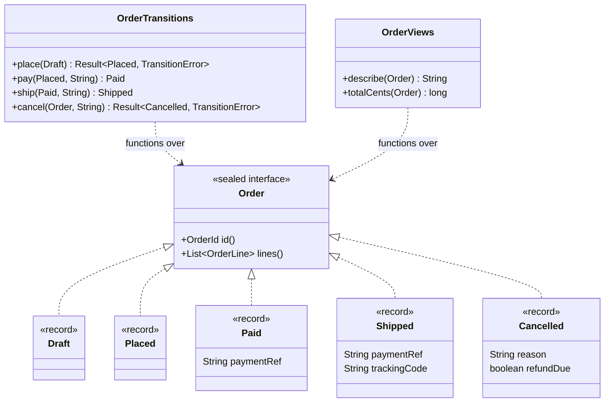
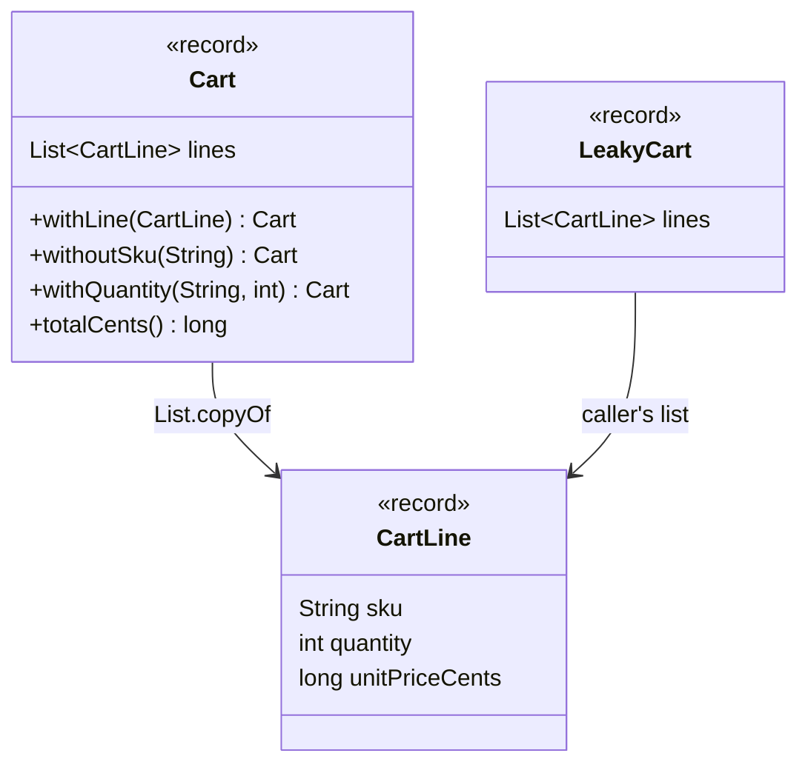
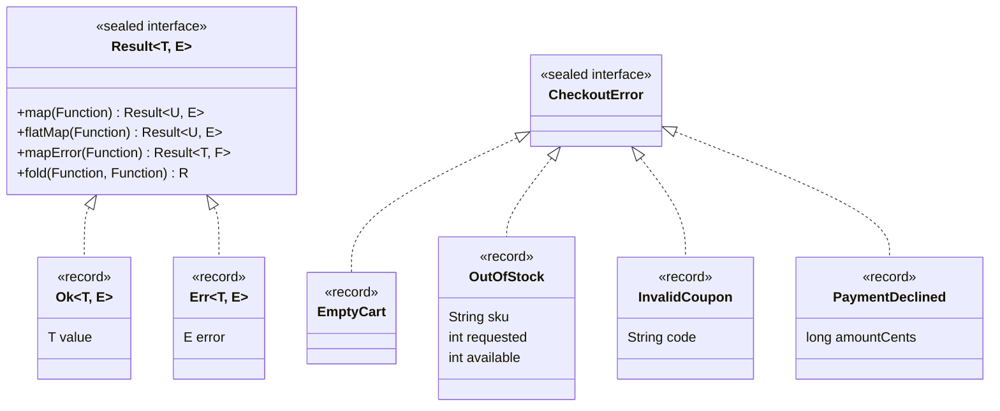
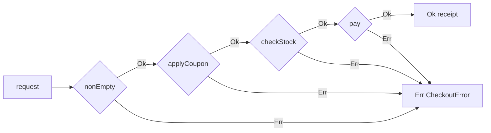
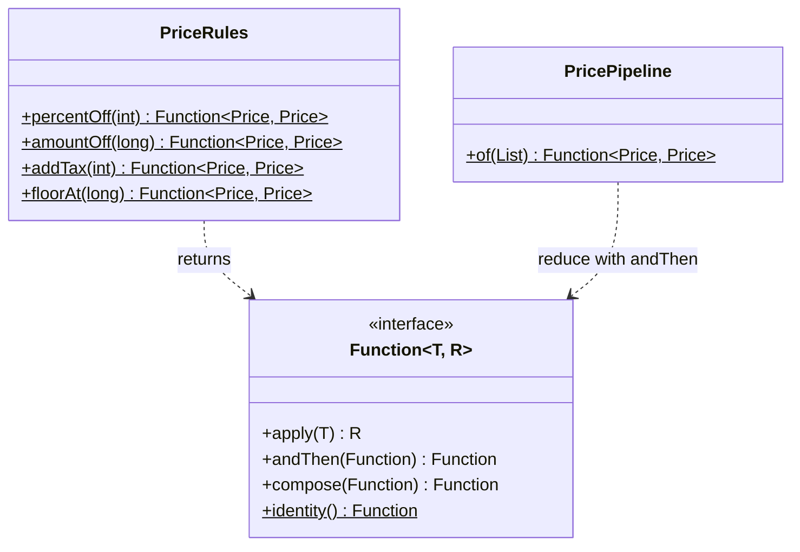
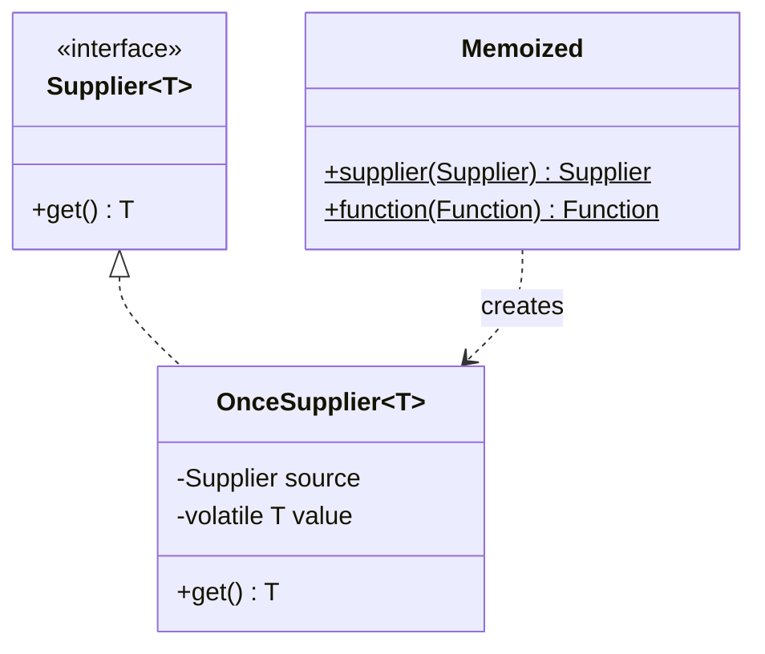

# Modül 09 — Fonksiyonel ve Veri Odaklı Kalıplar

> **11. Hafta** · Ön koşullar: m08 (Visitor ve sealed tipler, sealed record'larla State), m07 (ilk hatada dur / tüm hataları topla doğrulama), m06 (lambda olarak Strategy, yüksek mertebeden fonksiyon olarak Template Method, Stream Gatherers), m03 (kompakt kuruculu record'lar, wither'lar) · Tahmini çalışma süresi: 7 saat
>
> Her örneği derlemeden çalıştırın: `java modules/m09-functional-data-oriented/src/main/java/io/github/aliturgutbozkurt/patterns/m09/examples/<yol>/<Demo>.java` (JDK 27)

## Öğrenme çıktıları

Bu modülün sonunda şunları yapabilirsiniz:

1. Bir alanı veri odaklı programlamayla **modellemek**: veri için record'lar, seçenekler için sealed (mühürlü)
   arayüzler, kompakt kurucularda değişmezler (invariant) ve eksiksiz (exhaustive) `switch` fonksiyonları olarak
   işlemler; "durum metni + null olabilen alanlar" içeren bir sınıfı, geçersiz durumların kurulamadığı bir modele
   **yeniden düzenlemek**.
2. Derinlemesine değişmez değerler (savunmacı `List.copyOf`, wither'lar, normalleştirilmiş `BigDecimal` para,
   `java.time` aralıkları) **uygulamak**; görünüm (view) ile kopya arasındaki farkı ve değişebilir bir hash
   anahtarının neden hata olduğunu **açıklamak**.
3. İstisnalar, `Optional` ve sealed bir `Result<T, E>` arasında **karar vermek**; `Optional`'ı yalnızca dönüş tipi
   olarak **kullanmak**; `map`/`flatMap`/`mapError`/`fold` ile `Result` **uygulamak** ve ilk hatada duran bir
   ("demiryolu", railway) hat kurmak.
4. Davranışı fonksiyonlardan **birleştirmek** (`andThen`/`compose`, `Predicate` birleştiricileri, fonksiyon listesi
   üzerinde `reduce`) ve currying ile kısmi uygulamayı **uygulamak**.
5. Tembel değerlendirme ve belleklemeyi (memoization) **uygulamak**; özyinelemeli bir `HashMap.computeIfAbsent`'in
   neden çöktüğünü **açıklamak**.
6. Sekiz GoF kalıbını onların yerini alan Java özellikleriyle **karşılaştırmak** ve klasik, sınıf tabanlı biçimin ne
   zaman hâlâ daha iyi olduğuna **karar vermek**.

## Motivasyon

m02–m08 GoF kataloğunu kalıp kalıp işledi ve bazı kalıplar yolda küçüldü: Strategy (Strateji) bir lambda oldu (m06),
Template Method (Şablon Metot) yüksek mertebeden bir fonksiyon (m06), Visitor (Ziyaretçi) sealed tipler üzerinde bir
`switch` (m08). Bu modül bir adım geri çekilip bu kısayolların arkasındaki *üslubu* öğretir. PatternShop sipariş
kodundan, bu üslubun yerini aldığı türden bir sınıf:

```java
// file: examples/dop/order/classic/LegacyOrderService.java
    public String describe(MutableOrder order) {
        String status = order.getStatus();
        String text;
        if (status.equals("DRAFT")) {
            text = "draft";
        } else if (status.equals("PLACED")) {
            text = "placed, awaiting payment";
        } else if (status.equals("PAID")) {
            text = "paid (" + order.getPaymentRef() + ")";
        } else if (status.equals("SHIPPED")) {
            text = "shipped, tracking " + order.getTrackingCode();
        } else if (status.equals("CANCELLED")) {
            text = "cancelled (" + order.getCancelReason() + ")";
        } else {
            text = "unknown";
        }
        return order.getId() + ": " + text;
    }
```

Hiçbir şey, çağıranın takip kodu olmadan `"SHIPPED"` yazmasını, `"SHIPED"` diye yanlış yazmasını ya da hâlâ takip
kodu olan bir siparişi iptal etmesini engellemez. Her işlem durum metnini çalışma zamanında yeniden kontrol eder ve
sondaki `else`, derleyici hangi durumların var olduğunu bilemediği için oradadır:

```text
-- classic: a status string and nullable fields
A-1: shipped, tracking null
A-2: unknown
A-3: cancelled (lost in transit) -- but its tracking code is still TRK-1
```

**Veri odaklı programlama** (data-oriented programming, DOP) bunu dört kuralla çözer: veriyi değişmez veri olarak
(record'lar) modelle, seçenekleri sealed tiplerle modelle, sınırda bir kez doğrula ve geçersiz durumları ifade
edilemez kıl. Hatalar değer olur, davranış küçük fonksiyonların birleştirilmesiyle kurulur, pahalı iş ertelenir ve
belleklenir. Örnekler bitirme projesinin PatternShop alanını kullanır; bu üslubu hemen projenize uygulayabilirsiniz.

## Veri odaklı programlama

### Problem

Bir sipariş beş durumdan geçer: taslak, verilmiş, ödenmiş, kargolanmış, iptal. Her durumun kendi verisi vardır:
yalnızca ödenmiş siparişin ödeme referansı, yalnızca kargolanmışın takip kodu, yalnızca iptal edilmişin gerekçesi
vardır. Durum alanı ve null olabilen alanları olan tek bir değişebilir sınıf, anlamsız olanlar dahil her kombinasyonu
kabul eder.

### Amaç

> **Veri** ile **davranışı** ayrı tut: veri sade, değişmez ve kapalıdır (record'lar ve sealed arayüzler; derleyici her
> durumu bilir); davranış bu veri üzerinde, her biri eksiksiz bir `switch` olan fonksiyonlar kümesidir. Geçersiz
> durumların kurulmasını imkânsız kıl ve güvenilmeyen girdiyi sistemin kenarında bir kez geçerli veriye çevir.

### Yapı



### Klasik Java

Klasik model yukarıdaki `MutableOrder`'dır: her durum için alanlar, setter'lar ve durum metnine bakan servisler.
Nesne yönelimli çözüm State (Durum) kalıbı (m08) ya da bir Visitor (m08) olurdu; ikisi de durum başına bir sınıf
*ve* işlem başına bir sınıf ya da metot ekler.

### Modern Java 27

Her durum kendi record'u olur ve yalnızca o durumda geçerli alanları taşır. Kompakt kurucular değişmezlerdir;
`List.copyOf` satırları değişmez yapar:

```java
// file: examples/dop/order/modern/Order.java
public sealed interface Order permits Order.Draft, Order.Placed, Order.Paid, Order.Shipped, Order.Cancelled {

    OrderId id();

    List<OrderLine> lines();

    /** Being edited; may still be empty. */
    record Draft(OrderId id, List<OrderLine> lines) implements Order {
        public Draft {
            Objects.requireNonNull(id, "id");
            lines = List.copyOf(lines);
        }
    }
    // ...
    record Shipped(OrderId id, List<OrderLine> lines, String paymentRef, String trackingCode) implements Order {
        public Shipped {
            Objects.requireNonNull(id, "id");
            lines = nonEmpty(lines, "a shipped order");
            requireText(paymentRef, "paymentRef");
            requireText(trackingCode, "trackingCode");
        }
    }
```

"Takip kodu olmadan kargolanmış" artık kurucuda başarısız olur, "iptal edilmiş ama kargolanmış" için ise hiç record
yoktur. Geçişler, **girdi** durumlarıyla tiplenmiş sade fonksiyonlardır. `ship` yalnızca `Paid` bir sipariş kabul
eder; ödenmemiş bir siparişi kargolamak çalışma zamanı kontrolü değil, derleme hatasıdır. Hâlâ başarısız olabilen bir
geçiş bir `Result` döndürür (bkz. [Optional ve Result](#optional-ve-result--değer-olarak-hatalar)):

```java
// file: examples/dop/order/modern/OrderTransitions.java
    public static Shipped ship(Paid paid, String trackingCode) {
        return new Shipped(paid.id(), paid.lines(), paid.paymentRef(), trackingCode);
    }

    public static Result<Cancelled, TransitionError> cancel(Order order, String reason) {
        return switch (order) {
            case Draft(var id, var lines) -> Result.ok(new Cancelled(id, lines, reason, false));
            case Placed(var id, var lines) -> Result.ok(new Cancelled(id, lines, reason, false));
            case Paid(var id, var lines, _) -> Result.ok(new Cancelled(id, lines, reason, true));
            case Shipped s -> Result.err(new AlreadyShipped(s.id()));
            case Cancelled c -> Result.err(new AlreadyCancelled(c.id()));
        };
    }
```

İşlemler; record desenli, kullanılmayan bileşenler için `_` içeren ve **`default` içermeyen** eksiksiz `switch`'lerdir.
Altıncı bir durum ekleyin; bu `switch`'lerin her biri yeni durumu ele alana kadar derlenmez:

```java
// file: examples/dop/order/modern/OrderViews.java
    public static String describe(Order order) {
        String text = switch (order) {
            case Draft(_, var lines) -> "draft, " + lines.size() + " line(s), total " + money(totalCents(order));
            case Placed _ -> "placed, awaiting payment of " + money(totalCents(order));
            case Paid(_, _, var paymentRef) -> "paid (" + paymentRef + ")";
            case Shipped(_, _, _, var trackingCode) -> "shipped, tracking " + trackingCode;
            case Cancelled(_, _, var reason, var refundDue) ->
                    "cancelled (" + reason + "), " + (refundDue ? "refund due" : "nothing to refund");
        };
        return order.id() + ": " + text;
    }
```

```text
-- modern: one record per state, transitions typed by their input
A-1: draft, 2 line(s), total 45.00
A-1: placed, awaiting payment of 45.00
A-1: paid (PAY-7)
A-1: shipped, tracking TRK-9
cancel A-1 (shipped) -> Err[error=AlreadyShipped[id=A-1]]
A-4: cancelled (changed mind), refund due
place A-5 (empty)    -> Err[error=EmptyOrder[id=A-5]]
```

**Veri ve nesneler.** DOP, "record'a asla metot koyma" demek değildir. Yalnızca record'un kendi bileşenlerinden bir
değer türeten metot (`OrderLine.totalCents()`, `DateRange.days()`) record'a aittir. *Duruma göre* değişen ya da dış
servislere ihtiyaç duyan davranış, sealed tip üzerindeki fonksiyonlara aittir. Bu, uygulamadaki **ifade problemidir**
(expression problem): Visitor ile işlem eklemek kolay, durum eklemek zordur; sealed tipler ve `switch` ile de öyledir,
ama derleyici yeni durumun gerektiği her yeri bulur ve hiç `accept` tesisatı yazmazsınız.

> **İleri not — jenerik eksiksizlik.** `sealed interface Shape<T> permits Circle, Label`, `record Circle<T>(…)
> implements Shape<T>` ve `record Label(…) implements Shape<String>` ile bir `Shape<Integer>` üzerindeki `switch`
> yalnızca `case Circle<Integer> c` ile eksiksizdir: derleyici `Label`'ın asla bir `Shape<Integer>` olamayacağını bilir.

### Doğrulama değil, ayrıştırma

Kenarlar için ikinci DOP kuralı: güvenilmeyen girdiyi sınırda **bir kez** tipli veriye çevir ("parse, don't
validate"), böylece çekirdek hiçbir şeyi yeniden kontrol etmez. Her değer tipi kendini kurucusunda doğrular:

```java
// file: examples/dop/boundary/Sku.java
public record Sku(String value) {

    private static final Pattern FORMAT = Pattern.compile("[A-Z]{3}-\\d{4}");

    public Sku {
        Objects.requireNonNull(value, "sku");
        if (!FORMAT.matcher(value).matches()) {
            throw new IllegalArgumentException("sku must match AAA-9999: \"" + value + "\"");
        }
    }
```

CSV içe aktarıcı hatalı girdiyle ilgilenen tek yerdir. Hatalı bir satır için asla istisna fırlatmaz: kurucuların
istisnaları satır numaralı `Rejected` satırlara dönüşür ve çekirdek (`OrderLines.totalCents`) hiç doğrulama kodu
içermez:

```java
// file: examples/dop/boundary/CsvOrderImporter.java
    private static ImportedRow parseRow(int lineNo, String text) {
        String[] fields = text.strip().split(",", -1);
        if (fields.length != 3) {
            return new Rejected(lineNo,
                    "expected 3 fields (sku,quantity,unitPriceCents) but got " + fields.length);
        }
        try {
            var sku = new Sku(fields[0].strip());
            var quantity = new Quantity(number("quantity", fields[1]));
            long unitPrice = number("unitPriceCents", fields[2]);
            return new Accepted(lineNo, new OrderLine(sku, quantity, unitPrice));
        } catch (IllegalArgumentException e) {
            return new Rejected(lineNo, e.getMessage());
        }
    }
```

```text
-- the boundary: text in, typed rows out
line 1: accepted MUG-0001 x 2 @ 1250
line 2: accepted TEE-0002 x 1 @ 2000
line 3: rejected (sku must match AAA-9999: "mug-3")
line 4: rejected (quantity must be 1..99: 0)
line 5: rejected (quantity is not a number: "two")
line 6: rejected (expected 3 fields (sku,quantity,unitPriceCents) but got 2)
-- the core: only valid values, no checks left
accepted lines: 2, total 4500 cents
-- values are normalised once, when they are built
new Email("  Ali@Example.COM ") = ali@example.com
```

`Email` kompakt kurucusunda normalleştirir (kırpma, `toLowerCase(Locale.ROOT)`); böylece bir adresin iki yazımı
`equals` olur. Bir doğrulayıcı "bu geçerli mi?" sorusunu yanıtlar ve yanıtı atar; bir ayrıştırıcı yanıtı tipte saklar.

### Gerçek dünyada kullanımı

- `java.time`: `LocalDate.of(2027, 2, 30)` istisna fırlatır; elinizdeki her `LocalDate` gerçek bir tarihtir —
  ayrıştırılmış bir değer.
- `java.net.URI`, `java.nio.file.Path` ve `java.util.UUID` bir kez ayrıştırılır, sonra her yerde güvenilir.
- Record'lar + sealed arayüzler JDK'nın kendi araçlarında ve Jackson (record'a dönüştürme) ile Spring
  (`@ConfigurationProperties` record'ları) gibi çatılarda JSON/AST verisini modeller.
- Bitirme projesinin sipariş durumları ve alan olayları tam olarak bu modeldir.

### Tuzaklar ve ne zaman KULLANILMAMALI

- **Sealed bir `switch`'te `default` dalı** derleyiciyi susturur: sonraki yeni durum fark edilmeden ona düşer.
- **Çekirdekte yeniden doğrulama.** Çekirdek hâlâ `sku != null` kontrol ediyorsa sınır sızdırıyordur; kontrolü değer
  tipine taşıyın.
- **Tek bir nesneye ait zengin davranış.** Birlikte değişen çok sayıda değişmezi olan gerçek, kapsüllenmiş durumlu bir
  varlık (blokeli ve limitli bir banka hesabı) metotlu klasik bir nesne olarak daha açık olabilir.
- **Açık hiyerarşiler.** Başka modüllerin durum eklemesi gerekiyorsa sealed tip yanlış araçtır; bir arayüz kullanın
  (m08 Visitor tartışması).

### İlgili kalıplar

Sealed record'larla **State** (m08), tek bir durum makinesine uygulanmış DOP'tur. **Visitor** (m08), "kapalı bir
hiyerarşiye işlem ekle" sorusunun nesne yönelimli yanıtıdır. **Değer nesnesi** (value object) ve **Değişmez nesne**
(sonraki bölüm, m10).

## Değişmezlik ve değer nesneleri

### Problem

Bir record'un alanları `final`'dır, ama bu yalnızca *referansları* dondurur. Çağıranın `ArrayList`'ini saklayan bir
record, çağıran listeyi her değiştirdiğinde değişir; `2.0` değerinde bir `BigDecimal` de `2.00`'a `equals` değildir,
yani iki eşit fiyat birbirini tutmayabilir.

### Amaç

> Değerleri **derinlemesine değişmez** yap (her bileşen değişmez ya da kopyalanmış), onlara tek bir normal biçimde
> **değer eşitliği** ver ve her değişikliği **yeni bir değer** olarak ifade et (wither'lar).

### Yapı



### Klasik Java

Sızıntı: record çağıranın listesini saklar, bu yüzden yalnızca *sığ* biçimde değişmezdir:

```java
// file: examples/immutability/cart/LeakyCart.java
public record LeakyCart(List<CartLine> lines) {}
```

Klasik çözüm `Collections.unmodifiableList(lines)` döndüren bir getter'dı. Bu bir **görünümdür** (view): çağıran onu
görünüm üzerinden değiştiremez, ama kaynak listedeki sonraki her değişiklik görünüme yansır.

### Modern Java 27

Kompakt kurucuda kopyalayın ve yeni bir değer kurarak değiştirin:

```java
// file: examples/immutability/cart/Cart.java
public record Cart(List<CartLine> lines) {

    public Cart {
        lines = List.copyOf(lines);
    }
    // ...
    /** Sets the quantity of {@code sku}; {@code 0} removes the line. */
    public Cart withQuantity(String sku, int quantity) {
        if (quantity < 0) {
            throw new IllegalArgumentException("quantity must not be negative: " + quantity);
        }
        if (quantity == 0) {
            return withoutSku(sku);
        }
        return new Cart(lines.stream()
                .map(line -> line.sku().equals(sku) ? line.withQuantity(quantity) : line)
                .toList());
    }
```

```text
-- a record is only as immutable as its components
after source.add(TEE): LeakyCart has 2 line(s), Cart has 1 line(s)
leaky.lines() == source: true
cart.lines().add(...) -> UnsupportedOperationException
-- change = a new value (withers)
original       [MUG-0001 x2, TEE-0002 x1] total 4500
withLine(CAP)  [MUG-0001 x2, TEE-0002 x1, CAP-0003 x1] total 5300
withoutSku(MUG)[TEE-0002 x1] total 2000
withQuantity 3 [MUG-0001 x2, TEE-0002 x3] total 8500
original again [MUG-0001 x2, TEE-0002 x1] total 4500
-- view vs. copy
unmodifiableList view: [a, b]
List.copyOf copy:      [a]
```

`List.copyOf` `null` elemanları da reddeder ve zaten değiştirilemez olan bir liste (`List.of(...)`) verildiğinde
**aynı nesneyi** döndürür; kopyalanacak bir şey yoksa kopyalamak ucuzdur.

### Değer nesneleri

Bir değer nesnesi değerine göre eşittir ve tek bir normal biçimi vardır.
`new BigDecimal("2.0").equals(new BigDecimal("2.00"))` `false`'tur (ölçek farklıdır); bu yüzden `Money` kompakt
kurucusunda ölçeği para biriminin küçük birimine normalleştirir:

```java
// file: examples/immutability/values/Money.java
public record Money(BigDecimal amount, Currency currency) {

    public Money {
        Objects.requireNonNull(amount, "amount");
        Objects.requireNonNull(currency, "currency");
        amount = amount.setScale(currency.getDefaultFractionDigits(), RoundingMode.HALF_EVEN);
    }
```

`stripTrailingZeros()` bir normal biçim değildir (`100`, `1E+2` olarak yazılır) ve yuvarlama kipi verilmeden
`setScale(2)`, `2.345` için `ArithmeticException` fırlatır. `DateRange`, türleri JDK'nın kendi değişmez değerleri
olan `java.time` üzerine kuruludur: `withEnd` ve `shiftedBy(Period)` yeni aralıklar döndürür.

```text
-- BigDecimal vs. Money
new BigDecimal("2.0").equals(new BigDecimal("2.00")) = false
Money.of("2.0", "EUR").equals(Money.of("2.00", "EUR")) = true
2.345 EUR -> 2.34 EUR, 2.355 EUR -> 2.36 EUR (HALF_EVEN)
150 JPY -> 150 JPY (no minor unit)
19.99 EUR x 3 = 59.97 EUR, 15% of it = 9.00 EUR
-- DateRange on java.time.LocalDate
spring sale 2027-03-01..2027-03-10: 10 day(s)
overlaps 2027-03-10..2027-03-15: true
extended to 2027-03-11, shifted by P1M: 2027-04-01..2027-04-10
original still 2027-03-01..2027-03-10
-- a mutable key breaks a HashSet
after setCode: contains(key) = false, size = 1
```

Son satır **değişebilir anahtar hatasıdır**: `MutableKeyPitfall` hash kodunu değişebilen bir alandan hesaplar.
`setCode`'dan sonra küme başka bir kovaya bakar ve anahtarı hâlâ içerdiği halde bulamaz. Bileşenleri değişmez olan
bir record anahtar bunu yapamaz.

### Gerçek dünyada kullanımı

`String`, sarmalanmış ilkel tipler, `BigDecimal`, `java.time` (`LocalDate`, `Instant`, `Duration`, `Period`),
`List.of`/`Map.of`, `Optional` ve record'lar JDK'da değişmezdir. Değer tabanlı sınıflar (m05), JDK'nın kimliği
olmayan değişmez değerler için kullandığı addır.

### Tuzaklar ve ne zaman KULLANILMAMALI

- **Record'larda diziler**: `record Arr(int[] a)` diziyi referansla karşılaştırır ve dizi dışarıdan değiştirilebilir.
  Kopyalayın ya da bir `List` kullanın.
- **`unmodifiableList` bir kopya değildir**: başkasının hâlâ değiştirebildiği bir listeye açılan salt okunur bir
  penceredir.
- **Büyük, sık değişen yapılar**: 100 000 elemanlı bir listeyi her değişiklikte kopyalamak yavaştır. Kalıcı
  koleksiyonlar (persistent collections, yapısal paylaşımlı) bunu çözer; JDK'nın ve bu dersin dışındadır.

### İlgili kalıplar

**Prototype** (Prototip, m03) nesneleri kopyalar; wither'lar kopyalamayı olağan değişiklik yolu yapar. **Flyweight**
(Sinek Siklet, m05) değişmez değerleri paylaşır. **Değişmez nesne**, iş parçacığı güvenli olmanın en basit yolu
olarak m10'da geri döner.

## Optional ve Result — değer olarak hatalar

### Problem

Bir ödeme (checkout) dört biçimde başarısız olabilir: boş sepet, geçersiz kupon, yetersiz stok, reddedilen ödeme.
İstisnalarla bunların hiçbiri `Receipt checkout(CheckoutRequest)` imzasında görünmez ve kontrol metodun ortasından
dışarı sıçrar. `Optional<Receipt>` ile çağıran, başarısız olduğunu görür ama *nedenini* asla göremez.

### Amaç

> Başarısızlıkları, tipi başarısız olmanın her yolunu adlandıran **değerler** olarak döndür. Adımları, her biri yalnızca
> başarı hattında çalışacak ve ilk başarısızlık hata hattına geçecek biçimde zincirle ("demiryolu"); çağıranı her hata
> türünü eksiksiz ele almaya zorla.

### Yapı



Ödeme için demiryolu: her adım bir `flatMap`'tir ve herhangi bir adımdan gelen `Err` sonraki tüm adımları atlar.



### Klasik Java

İstisna üslubu yukarıdan aşağıya okunur, ama her başarısızlık gizli bir çıkıştan ayrılır:

```java
// file: examples/result/checkout/ExceptionCheckout.java
    public Receipt checkout(CheckoutRequest request) {
        if (request.items().isEmpty()) {
            throw new CheckoutException.EmptyCart();
        }
        long total = request.totalCents();
        if (!request.coupon().isBlank()) {
            int percent = Coupons.percentOff(request.coupon())
                    .orElseThrow(() -> new CheckoutException.InvalidCoupon(request.coupon()));
            total = Coupons.discounted(total, percent);
        }
```

### Modern Java 27

Küçük ve dürüst bir `Result`: sealed bir arayüze gömülü iki record, iki hatta da `null` reddedilir:

```java
// file: examples/result/core/Result.java
public sealed interface Result<T, E> permits Result.Ok, Result.Err {

    /** The success track. {@code value} is never {@code null}. */
    record Ok<T, E>(T value) implements Result<T, E> {
        public Ok {
            Objects.requireNonNull(value, "value");
        }
    }

    /** The failure track. {@code error} is never {@code null}. */
    record Err<T, E>(E error) implements Result<T, E> {
        public Err {
            Objects.requireNonNull(error, "error");
        }
    }
    // ...
    /** Chains a step that can itself fail: the first {@code Err} wins and later steps never run. */
    default <U> Result<U, E> flatMap(Function<? super T, ? extends Result<? extends U, E>> f) {
        Objects.requireNonNull(f, "f");
        return switch (this) {
            case Ok<T, E>(var value) -> narrow(f.apply(value));
            case Err<T, E>(var error) -> new Err<>(error);
        };
    }
    // ...
    private static <U, E> Result<U, E> narrow(Result<? extends U, E> result) {
        return switch (result) {
            case Ok<? extends U, E>(var value) -> new Ok<>(value);
            case Err<? extends U, E>(var error) -> new Err<>(error);
        };
    }
```

İki ayrıntıyı derleyici dayatır. `map`/`flatMap`, `Err`'i `new Err<>(error)` ile yeniden kurar: bir `Err<T, E>`'yi
`Result<U, E>`'ye dönüştürmek (cast) denetlenmemiş (unchecked) bir uyarı olurdu ve bu ders `-Werror` ile derlenir.
Aynı nedenle `flatMap`, değeri `Result<? extends U, E>`'den `narrow` aracılığıyla kopyalar. Testler ayrıca üç monad
yasasını (sol birim, sağ birim, birleşme) bir değer tablosu üzerinde kontrol eder: teoriye ihtiyacınız yok, ama
`flatMap` zincirlerinin öngörülebilir davranmasının nedeni bu yasalardır.

`Result` ile ödeme artık bir adım listesidir:

```java
// file: examples/result/checkout/ResultCheckout.java
    public Result<Receipt, CheckoutError> checkout(CheckoutRequest request) {
        return nonEmpty(request)
                .flatMap(ResultCheckout::applyCoupon)
                .flatMap(this::checkStock)
                .flatMap(this::pay);
    }
```

Çağıran, her hata türünü tek bir eksiksiz `switch` ile ele alır:

```java
// file: examples/result/checkout/CheckoutErrors.java
    public static String message(CheckoutError error) {
        return switch (error) {
            case EmptyCart _ -> "your cart is empty";
            case OutOfStock(var sku, var requested, var available) ->
                    "only " + available + " x " + sku + " left (you asked for " + requested + ")";
            case InvalidCoupon(var code) -> "coupon " + code + " is not valid";
            case PaymentDeclined(var amountCents) -> "payment of " + money(amountCents) + " was declined";
        };
    }
```

### Bir hata modeli seçmek

```text
-- happy path
exceptions: Receipt[paymentId=PAY-1, totalCents=4500]
Optional:   Optional[Receipt[paymentId=PAY-1, totalCents=4500]]
Result:     Ok[value=Receipt[paymentId=PAY-1, totalCents=4500]]
-- short stock
exceptions: threw OutOfStock: only 1 x TEE-0002 left (you asked for 2)
Optional:   Optional.empty
Result:     Err[error=OutOfStock[sku=TEE-0002, requested=2, available=1]]
-- declined
exceptions: threw PaymentDeclined: payment of 25.00 was declined
Optional:   Optional.empty
Result:     Err[error=PaymentDeclined[amountCents=2500]]
-- the Result caller must handle every kind (exhaustive switch, no default)
short stock -> only 1 x TEE-0002 left (you asked for 2)
declined    -> payment of 25.00 was declined
```

| Model | İmzada görünür mü? | Nedenini söyler mi? | Ne için kullanılır |
|---|---|---|---|
| İstisna | hayır (unchecked) / evet ama hantal (checked) | evet | hatalar (bug) ve gerçekten istisnai, kurtarılamaz durumlar (disk yok, bozulmuş değişmez) |
| `Optional<T>` | evet | hayır | tek bir bariz nedeni olan "belki yok" (bulunamadı) |
| `Result<T, E>` | evet | evet, sealed bir tip olarak | çağıranın ele alması gereken beklenen iş hataları |

Testler üç sürümde de ilk başarısızlıktan sonra hiçbir adımın çalışmadığını (stok yetersizken ödeme sağlayıcısı
çağrılmaz) ve reddedilen bir ödemenin ayrılmış stoku serbest bıraktığını kanıtlar.

### Dönüş tipi olarak Optional

`Optional`, hiçbir şey bulamayabilecek sorgular için dönüş tipi olarak tasarlandı. Dersin kuralı — **`Optional`
yalnızca dönüş tipi olarak** — tüm `optional.directory` paketi üzerinde çalışan bir yansıma (reflection) testiyle
denetlenir: hiçbir alan, hiçbir record bileşeni ve hiçbir public parametre `Optional` tipinde değildir. Neden?
`Optional` `Serializable` değildir, `Optional` tipinde bir alanın *üç* durumu vardır (`null`, boş, dolu) ve bir
`Optional` parametre her çağıranı sarmalamaya zorlar. Verinin içindeki yokluk bunun yerine sealed bir durumdur
(`Referral`, `Direct` ya da `ReferredBy`'dır) ve `Customer.referrer()` onun bir `Optional` *görünümünü* sunar. Bir
arama zinciri böylece tek bir ifade olarak okunur:

```java
// file: examples/optional/directory/CustomerDirectory.java
    public String referrerName(String email) {
        return findByEmail(email)
                .flatMap(Customer::referrer)
                .flatMap(this::findById)
                .map(Customer::name)
                .orElse("nobody");
    }
    // ...
    /** Never {@code Optional<List<…>>}: an unknown customer simply has no orders. */
    public List<OrderSummary> ordersOf(CustomerId id) {
        return orders.stream().filter(o -> o.customer().equals(id)).toList();
    }
```

```text
-- orElse vs. orElseGet
orElse:    fallback computed 1 time(s)
orElseGet: fallback computed 0 time(s)
```

`orElse(expensive())` bir değer varken bile argümanını hesaplar; `orElseGet(() -> expensive())` hesaplamaz.

### JDK'da aynı biçim

`map` bir kabın içindeki değeri dönüştürür, `flatMap` kap döndüren bir adımı zincirler. `Optional`, `Stream` ve
`CompletableFuture`'ın hepsi bu biçimdedir; future bunlara `thenApply` ve `thenCompose` der, `handle` da onun
`fold`'udur:

```java
// file: examples/result/jdk/JdkResultShapes.java
    public CompletableFuture<Long> totalAsync(String sku) {
        return priceAsync(sku)
                .thenApply(JdkResultShapes::withTax)
                .thenCompose(this::withShippingAsync);
    }
```

Bir `CompletableFuture`, tek bir tuzakla asenkron bir `Result<T, Throwable>`'dır: bağımlı bir aşamadan sonra hata,
bir `CompletionException` içine sarılmış olarak gelir. Doğrudan `failedFuture(e)` üzerindeki `exceptionally` `e`'yi
alır, ama bir `thenApply`'dan sonra nedeni `e` olan bir `CompletionException` alır. `FutureResults.toResult` onu açar:

```java
// file: examples/result/jdk/FutureResults.java
    public static <T> Result<T, Throwable> toResult(CompletableFuture<T> future) {
        Objects.requireNonNull(future, "future");
        return future.<Result<T, Throwable>>handle((value, failure) ->
                failure == null ? Result.ok(value) : Result.err(cause(failure))).join();
    }
```

```text
-- CompletableFuture -> Result
toResult(totalAsync(MUG-0001)) = Ok[value=1999]
toResult(totalAsync(XXX-0000)) = Err[error=java.util.NoSuchElementException: unknown sku XXX-0000]
```

Buradaki future'lar zaten tamamlanmıştır; asenkron hatlar m10'un konusudur.

### Gerçek dünyada kullanımı

`Optional` (Java 8), `CompletableFuture`, `Stream`; veri olarak `HttpResponse` durum kodları; Vavr'ın `Either`/`Try`,
Kotlin'in `Result` ve Rust'ın `Result<T, E>` tipleri aynı fikirdir. Spring'in `ResponseEntity`'si ve birçok doğrulama
API'si istisna fırlatmak yerine hataları değer olarak döndürür.

### Tuzaklar ve ne zaman KULLANILMAMALI

- **`System.out.println(result.fold(...))` derlenmez.** `println(char[])` ve `println(String)` ikisi de uygulanabilir
  olduğundan `R` tipi çıkarılamaz. Önce bir `String`'e atayın: `String text = result.fold(...);`.
- **Hatalar (bug) için `Result`.** Olmaması gereken bir `null` ya da bozulmuş bir değişmez bir programlama hatasıdır:
  istisna fırlatın.
- **`Optional` alanlar, parametreler ve `Optional<List<…>>`.** Sealed bir durum, bir aşırı yükleme (overload) ya da
  boş bir liste kullanın.
- **Kontrolsüz `optional.get()`**, eski `NullPointerException`'ın yeni adıdır; mesajlı `orElseThrow`, `map` ve
  `orElse`'i tercih edin.
- **Tüm hataları toplamak `flatMap`'ten fazlasını ister.** `flatMap` tasarım gereği ilk hatada durur; her alan
  hatasını toplamak (ex02) `Err`'leri toplayan ayrı bir adım gerektirir.

### İlgili kalıplar

**Chain of Responsibility** (Sorumluluk Zinciri, m07) doğrulama zincirleri: ilk hatada dur (`andThen`) ve tüm
hataları topla (`and`) — `flatMap` ile tüm hataları toplamanın aynı iki politikası. **Null Object**, "belki yok"
sorusunun nesne yönelimli yanıtıdır.

## Fonksiyon bileşimi, currying ve kısmi uygulama

### Problem

Bir fiyat değişen bir kurallar listesinden geçer: %10 indirim, sonra 30.00 indirim, asla 10.00'ın altına değil,
sonra vergi. Decorator (Dekoratör) sınıfları olarak (m04) her kural başka birini saran bir sınıftır; kuralları
yeniden sıralamak ya da yapılandırmak yeni nesneler ve yeni sınıflar demektir.

### Amaç

> Davranışı küçük fonksiyonları **birleştirerek** kur: `f.andThen(g)` önce `f`'yi sonra `g`'yi çalıştırır,
> `g.compose(f)` da aynı anlama gelir. Bir fonksiyon listesini tek bir fonksiyona katla. Bir fonksiyonun bazı
> argümanlarını şimdi sabitle, kalanını sonra ver (**kısmi uygulama**); çok argümanlı bir fonksiyonu tek argümanlı
> fonksiyonlar zinciri olarak yaz (**currying**).

### Yapı



### Klasik Java

Sınıflar olarak Decorator: ortak bir arayüz ve her süsleme için bir sarmalayıcı sınıf (kataloğun Decorator satırı):

```java
// file: examples/features/catalogue/DecoratorRow.java
        record Trimmed(Text inner) implements Text {
            public String render() { return inner.render().strip(); }
        }

        record Upper(Text inner) implements Text {
            public String render() { return inner.render().toUpperCase(Locale.ROOT); }
        }
```

### Modern Java 27

Her kural bir fabrika metodunun döndürdüğü bir fonksiyondur; bir kurallar listesi
`reduce(Function.identity(), Function::andThen)` ile tek fonksiyona katlanır. Boş liste için sonuç birim
fonksiyondur ve kurallar liste sırasıyla uygulanır:

```java
// file: examples/composition/pricing/PriceRules.java
    public static Function<Price, Price> percentOff(int percent) {
        requirePercent(percent);
        return price -> new Price(price.cents() * (100 - percent) / 100);
    }

    /** Subtracts a fixed amount, but never below zero. */
    public static Function<Price, Price> amountOff(long cents) {
        return price -> new Price(Math.max(0, price.cents() - cents));
    }
```

```java
// file: examples/composition/pricing/PricePipeline.java
    public static Function<Price, Price> of(List<Function<Price, Price>> rules) {
        return rules.stream().reduce(Function.identity(), Function::andThen);
    }
```

```text
-- one rule at a time, composed with andThen
100.00 -> 10% off -> 90.00 -> +20% tax -> 108.00
-- order matters
amountOff(10.00).andThen(addTax(20)) = 108.00
addTax(20).andThen(amountOff(10.00)) = 110.00
-- a list of rules folded into one function (reduce(identity, andThen))
spring sale on  40.00 = 10.00
spring sale on 120.00 = 66.00
```

`UnaryOperator<T>.andThen` `Function`'dan miras alınır ve bir `Function` döndürür; hattın
`Function<Price, Price>` ile tiplenmesinin nedeni budur. Yüklemler (predicate) de aynı biçimde birleşir:

```java
// file: examples/composition/pricing/Eligibility.java
    public static Predicate<Customer> freeShipping() {
        return member().or(loyal(5)).and(Predicate.not(blocked()));
    }
```

### Bir metin hattı ve Türkçe I

Türk bir mağaza için ürün URL "slug"ları; her biri ayrı test edilen altı küçük adımdan kurulur:

```java
// file: examples/composition/text/Slugifier.java
    public static Function<String, String> forLocale(Locale locale) {
        return lowerCase(locale)
                .andThen(transliterateTurkish())
                .andThen(stripDiacritics())
                .andThen(replaceNonAlphanumeric())
                .andThen(collapseDashes())
                .andThen(trimDashes());
    }
```

Neden her büyük/küçük harf dönüşümü `Locale`'ini adıyla verir? Türkçede **dört** I harfi vardır: noktalı `i`/`İ` ve
noktasız `ı`/`I`. Türkçede `"I".toLowerCase(tr)` `"ı"`, `"i".toUpperCase(tr)` ise `"İ"` verir. Kök yerel ayar
(root locale) ters yönde yanılır: `"İ".toLowerCase(Locale.ROOT)`, `i` ve ardından bir birleşen nokta (uzunluk 2)
verir. Argümansız `toLowerCase()` makinenin varsayılan yerel ayarını kullanır; aynı kod Türkçe bir dizüstünde farklı
sonuç verir — klasik bir hata (orada `"TITLE".toLowerCase().equals("title")` `false`'tur). NFD ile ayrıştırıp
birleşen işaretleri silmek `ş ö ğ ü ç` harflerini ASCII'ye çevirir, ama noktasız `ı` ayrışmaz; bu yüzden hattın açık
bir `ı → i` adımına ihtiyacı vardır:

```text
-- a slug pipeline of six small functions
"İstanbul'da Kış İndirimi" -> istanbulda-kis-indirimi
"Çay & Simit Seti (2 kişilik)" -> cay-simit-seti-2-kisilik
"ŞEKER BAYRAMI" -> seker-bayrami
-- why every case conversion names its Locale
"ISTANBUL".toLowerCase(tr)   = ıstanbul
"ISTANBUL".toLowerCase(ROOT) = istanbul
"İ".toLowerCase(ROOT).length() = 2
without the transliteration step: "ISTANBUL" -> stanbul
-- compose vs. andThen
trimDashes.compose(collapseDashes)("--a--b--") = a-b
```

### Currying ve kısmi uygulama

Curry'lenmiş bir fonksiyon argümanlarını birer birer alır; ilklerini sabitlemek özelleşmiş bir fonksiyon verir —
sınıfsız bir "yapılandırılmış strateji":

```java
// file: examples/composition/currying/Curry.java
    public static <A, B, C> Function<A, Function<B, C>> curry(BiFunction<A, B, C> f) {
        return a -> b -> f.apply(a, b);
    }
    // ...
    public static <A, B, C> Function<B, C> partial(BiFunction<A, B, C> f, A a) {
        return b -> f.apply(a, b);
    }
```

`ShippingRates.rates()` `bölge → gram → kuruş`tur; `forZone(DOMESTIC)` bir `Function<Integer, Long>` olarak saklanır
ve yeniden kullanılır:

```text
-- zone -> weight -> price: fix the zone once, reuse the tariff
DOMESTIC:  500 g -> 4.99   1500 g -> 5.99   2500 g -> 6.99
EU:        500 g -> 9.99   1500 g -> 12.49   2500 g -> 14.99
WORLD:     500 g -> 19.99   1500 g -> 24.99   2500 g -> 29.99
```

**Currying** `(a, b) -> c`'yi `a -> b -> c`'ye çevirir (her adımda her zaman tek argüman). **Kısmi uygulama**
herhangi bir fonksiyonun bazı argümanlarını sabitler ve kalanların fonksiyonunu döndürür. Java'da ikisi için de özel
bir sözdizimi yoktur; lambda döndüren lambdalar yeterlidir.

### Gerçek dünyada kullanımı

`Comparator.comparing(...).thenComparing(...)`, `Predicate.not`, `Function.identity`, `Collectors.mapping`/`filtering`
fonksiyonları birleştirir; servlet filtreleri ve Spring'in `WebFilter`/`RouterFunction`'ı istek işleyicilerini
birleştirir; günlükleme çatılarının `Supplier<String>` aşırı yüklemeleri mesajı erteler.

### Tuzaklar ve ne zaman KULLANILMAMALI

- **Sıra önemlidir ve kolay yanlış okunur.** `a.andThen(b)` önce `a`'yı, `a.compose(b)` önce `b`'yi çalıştırır.
- **Derin curry'lenmiş imzalar** (`Function<A, Function<B, Function<C, D>>>`) zor okunur; ara fonksiyona bir ad verin
  (`forZone`) ya da parametreler için bir record kullanın.
- **Durumlu ya da çok metotlu dekoratörler.** `InputStream` dekoratörlerinin (m04) çok metodu ve durumu vardır;
  sınıf olarak kalırlar.
- **Hata ayıklama**: birleştirilmiş lambdalardan geçen bir yığın izi `lambda$…` çerçeveleri gösterir; küçük, adlı
  fabrika metotları yardımcı olur.

### İlgili kalıplar

**Decorator** (m04) ve **Chain of Responsibility** (m07) middleware'i nesnelerin bileşimidir; burada fonksiyonların
bileşimidir. **Strategy** (m06) tek bir fonksiyondur; currying yapılandırılmış stratejiler kurar.

## Tembel değerlendirme ve bellekleme

### Problem

Bir döviz kuru sorgusu yavaştır ve kur bazı isteklerde gerekir, hepsinde değil. Onu hevesle (eager) yüklemek zaman
kaybettirir; her çağrıda yüklemek daha fazlasını. Her kullanım için elle yazılmış bir önbellek alanı aynı çift
kontrollü kodu tekrarlar; büyük bir mesaj kuran bir debug günlük satırı da debug kapalıyken bile zaman harcar.

### Amaç

> İşi sonucu gerekene kadar ertele (**tembel değerlendirme**, lazy evaluation) ve her sonucu en fazla bir kez hesapla
> (**bellekleme**, memoization); bunu her kullanım için yeni bir sınıf yerine fonksiyonlarla (`Supplier`, `Function`)
> yap.

### Yapı



### Klasik Java

Virtual Proxy (Sanal Vekil, m04) ve lazy holder (tembel tutucu, m02) bunu her kullanım için bir sınıfla çözer. Elle
yazılmış bir önbellek zararsız görünür, ama bu bozuktur — `HashMap`'i kendi `computeIfAbsent`'inin içinden değiştirir:

```java
// file: examples/lazy/memo/Fibonacci.java
    public long recursiveWithComputeIfAbsent(int n) {
        if (n < 2) {
            return n;
        }
        return cache.computeIfAbsent(n, k -> recursiveWithComputeIfAbsent(k - 1) + recursiveWithComputeIfAbsent(k - 2));
    }
```

`HashMap` değişikliği fark eder ve `ConcurrentModificationException` fırlatır; `ConcurrentHashMap` ise kilitlenebilir
ya da `IllegalStateException("Recursive update")` fırlatabilir. Doğru Fibonacci önbelleğe ihtiyaç duymaz: son iki
değeri tutun (`fib(90) = 2880067194370816120`).

### Modern Java 27

Her kullanım için tek bir bellekleyen `Supplier`. İş parçacığı güvenlidir (`volatile` bir alan üzerinde çift
kontrol), **başarı durumunda** en fazla bir kez hesaplar, bir hatayı önbelleğe almadan yeniden fırlatır ve `null`'u
reddeder:

```java
// file: examples/lazy/memo/Memoized.java
        @Override
        public T get() {
            T result = value;
            if (result == null) {
                synchronized (this) {
                    result = value;
                    if (result == null) {
                        result = Objects.requireNonNull(source.get(), "the supplier returned null");
                        value = result;
                    }
                }
            }
            return result;
        }
```

Test `get()`'i aynı anda 100 sanal iş parçacığından (virtual thread) çağırır ve kaynağın tam bir kez çalıştığını
doğrular. Bellekleyen `Function` tek satırdır, `key -> cache.computeIfAbsent(key, f)`; önbellek döndürülen lambdanın
içinde yakalanır — bir örnek (instance), asla statik bir alan değil.

```text
-- a memoised supplier: nothing happens until get()
created (loads so far: 0)
get() -> 37.50 (loads: 1)
get() -> 37.50 (loads: 1)
-- a memoised function: one load per distinct key
EUR/TRY=37.50 USD/TRY=34.20 EUR/TRY=37.50 USD/TRY=34.20 (loads: 2)
-- a failure is not cached: the next get() tries again
get() -> IllegalStateException: rate service down
get() -> 37.50
-- the recursive HashMap.computeIfAbsent trap
fib(10), recursive computeIfAbsent -> ConcurrentModificationException
fib(90), iterative                 -> 2880067194370816120
```

> ⚠️ **Önizleme özelliği — Lazy Constants (Tembel Sabitler, JEP 531, JDK 27'de üçüncü önizleme).**
> `java.lang.LazyConstant<T>`, `Supplier<T>`'yi genişletir; `LazyConstant.of(supplier)` değerini en fazla bir kez
> hesaplar ve JVM'in onu sonrasında bir sabit gibi ele almasına (constant folding) izin verir; elle yazılmış bir
> `volatile` alan bunu sunamaz. JDK'nın `Memoized.supplier`'a ve lazy holder yöntemine (m02) gelecekteki yanıtıdır.
> Önizleme API'leri `--enable-preview` gerektirir ve hâlâ değişebilir; bu yüzden ders onun için kod göstermez ve hiçbir
> örnek ona bağlı değildir.

### Tembel akışlar

Akışlar (stream) tembeldir: ara işlemler yalnızca hattı tanımlar ve elemanlar hattan birer birer ("dikey") geçer.
Kısa devre yapan bir uç işlem, yanıtı bulur bulmaz durur:

```java
// file: examples/lazy/streams/LazyTrace.java
    public Optional<Integer> firstEven(List<Integer> numbers) {
        return numbers.stream()
                .peek(n -> trace.add("see " + n))
                .filter(n -> n % 2 == 0)
                .peek(n -> trace.add("even " + n))
                .findFirst();
    }
```

`Gatherers.scan` her ara değeri, `Gatherers.fold` yalnızca sonuncusunu yayar — ve boş bir akışta `scan` hiçbir şey
yaymazken `fold` yine başlangıç değerini yayar:

```java
// file: examples/lazy/streams/Ledger.java
    public static List<Long> runningBalances(List<Long> movements) {
        return movements.stream().gather(Gatherers.scan(() -> 0L, Long::sum)).toList();
    }

    public static List<Long> closingBalance(List<Long> movements) {
        return movements.stream().gather(Gatherers.fold(() -> 0L, Long::sum)).toList();
    }
```

```text
-- vertical, one element at a time; findFirst stops early
[see 1, see 2, even 2] -> Optional[2]
-- no terminal operation, no work
trace without a terminal operation: []
-- an infinite stream, cut by limit
Stream.iterate(1, x -> 2 * x).limit(5) = [1, 2, 4, 8, 16]
-- a message supplier runs only if the level is enabled
WARNING cart CART-7 has 3 items
message suppliers called: 1
-- running balance (scan) vs. closing balance (fold)
movements [100, -30, 5]
scan -> [100, 70, 75]
fold -> [75]
```

`LazyLog.log(Level, Supplier<String>)`, `System.Logger.log(Level, Supplier<String>)` ile aynı biçimdedir: mesaj
yalnızca düzey etkinse kurulur.

### Gerçek dünyada kullanımı

`System.Logger` ve SLF4J/Log4j `Supplier` aşırı yüklemeleri; `Map.computeIfAbsent`; `ClassValue`; akışlar ve
`Stream.iterate`/`generate`; Spring'in `ObjectProvider`'ı ve `@Lazy`'si; Hibernate'in tembel ilişkileri (bir
Virtual Proxy).

### Tuzaklar ve ne zaman KULLANILMAMALI

- **Özyinelemeli `computeIfAbsent`** — yukarıya bakın. Özyinelemeli fonksiyonları açık bir döngüyle ya da aşağıdan
  yukarıya doldurulan ayrı bir haritayla bellekleyin.
- **Tembel koddaki yan etkiler**: bir hattın içindeki `peek` ve günlükleme daha sonra, daha az kez ya da hiç çalışmaz.
- **Hataları önbelleğe almak**, bir zaman aşımını kalıcı bir başarısızlığa çevirir; `Memoized.supplier` istisnaları
  bilerek önbelleğe almaz.
- **Sınırsız bellekleme önbellekleri** bellek sızdırır; kullanıcı girdisi üzerinde bellekleyen bir fonksiyonun bir
  boyut sınırına ya da süre dolumuna (gerçek bir önbellek kütüphanesi) ihtiyacı vardır.

### İlgili kalıplar

**Proxy** (Vekil, m04, Virtual Proxy) ve **Singleton** (Tekil Nesne, m02, lazy holder) sınıf tabanlı biçimlerdir.
**Flyweight** (m05) hesaplanmış değerleri paylaşır. m10, iş parçacığı güvenli tembel ilklendirmeye geri döner.

## Dil özelliğine dönüşen kalıplar

m02–m08'deki kalıpların çoğu, Java'nın bir zamanlar lambda'ları, record'ları, sealed tipleri ve desen eşlemesi
olmadığı için vardır. `features.catalogue`'un her satırı klasik ve modern biçimi yan yana koyar (taraf başına ≤ 40
satır); parametreli bir test ikisini de aynı girdiyle çalıştırır ve aynı çıktıyı doğrular. Aşağıdaki tablo
`Catalogue.markdownTable()` çıktısının çevirisidir:

| Kalıp | İşini üstlenen Java özelliği | Sınıfı yine de yazın, eğer… | Ayrıntılı işleniş |
|---|---|---|---|
| Strategy | lambda / `Comparator` | stratejinin durumu, birden çok metodu ya da alanda bir adı varsa | m06 |
| Command | sealed record'lar + `switch`, `Runnable` | komutlar kendi geri alma mantığını taşıyor ya da dışarıdan takılıyorsa | m06 |
| Template Method | yüksek mertebeden fonksiyon | adımlar korumalı (protected) durumu paylaşıyor ya da çok sayıdaysa | m06 |
| Visitor | sealed record'lar + `switch` | hiyerarşi açıksa ve modülün dışından genişletilmesi gerekiyorsa | m08 |
| Iterator | `Stream.iterate` + gatherer'lar | imleç dış bir kaynağı geziyor ya da duraklatılıp sürdürülmesi gerekiyorsa | m06 |
| Factory | `Map<String, Supplier<T>>` + kurucu referansları | oluşturma birkaç adım, parametre ya da kendi bağımlılıklarını gerektiriyorsa | m02 |
| Decorator | `Function.andThen` | sarılan tipin çok metodu varsa (ör. `InputStream`) | m04 |
| Singleton | tek sabitli `enum` | hiçbir zaman; nesneyi dışarıdan vermeyi tercih edin (bağımlılık enjeksiyonu) | m02 |

Üçüncü sütunun arkasındaki pratik kural: sınıf **durum taşıyorsa**, **birden çok metoda ihtiyaç duyuyorsa**, alanda
**bir ada ihtiyaç duyuyorsa** ya da **modülün dışından genişletilmesi gerekiyorsa** sınıfı koruyun. Kodda üç satır —
Visitor satırının modern tarafının hiç `accept`'e ihtiyacı yoktur:

```java
// file: examples/features/catalogue/VisitorRow.java
        sealed interface Shape permits Circle, Rect {}

        record Circle(double radius) implements Shape {}

        record Rect(double width, double height) implements Shape {}
        // ...
        static double area(Shape shape) {
            return switch (shape) {
                case Circle(var r) -> Math.PI * r * r;
                case Rect(var w, var h) -> w * h;
            };
        }
```

Factory satırının modern tarafı kurucu referanslarından oluşan bir haritadır:

```java
// file: examples/features/catalogue/FactoryRow.java
        static final Map<String, Supplier<Shape>> SHAPES = Map.of("circle", Circle::new, "square", Square::new);
```

Singleton satırının modern tarafı bir `enum`'dır. JVM `INSTANCE`'ı tam bir kez oluşturur, serileştirme onu tekil
tutar ve yansıma bile reddedilir (`Constructor.newInstance` `IllegalArgumentException: Cannot reflectively create
enum objects` fırlatır; testler bunu kontrol eder):

```java
// file: examples/features/catalogue/SingletonRow.java
        enum Settings {
            INSTANCE;

            String currency() {
                return "EUR";
            }
        }
```

> ⚠️ **Önizleme özelliği — desenlerde ilkel tipler (JEP 532, JDK 27'de beşinci önizleme).** Desenler, `instanceof`
> ve `switch` ilkel tipleri kabul edecek; örneğin bir HTTP durum kodu üzerinde güvenli daraltma kontrolleriyle
> `case int i when i >= 400`. Bayrak olmadan derleyici bunu reddeder ("primitive patterns are a preview feature and
> are disabled by default"); `--enable-preview --source 27` ile çalışır. Hâlâ önizleme olduğundan bu ders kodda ilkel
> desen kullanmaz.

### Birleşik etki

`features.shop` aynı PatternShop fatura çalıştırmasını iki kez yazar. Klasik paket indirim strateji sınıfları, vergi
ve ağırlık için bir `LineItemVisitor`, soyut bir `InvoiceFormatter` (Template Method) ve `PostAction` komut nesneleri
kullanır. Modern paket sealed record'lar, `switch` fonksiyonları, indirim fonksiyonlarından bir harita, adımlarını
fonksiyon olarak alan bir biçimlendirici ve `Runnable`'lar kullanır:

```java
// file: examples/features/shop/modern/Invoicing.java
    static long tax(LineItem item) {
        return switch (item) {
            case PhysicalItem p -> amount(p) * 20 / 100;
            case DigitalItem d -> amount(d) * 10 / 100;
            case GiftCard _ -> 0;
        };
    }
    // ...
    public static List<Runnable> postActions(Invoice invoice, List<String> log) {
        Order order = invoice.order();
        Runnable email = () -> log.add("email invoice " + order.id() + " to " + order.customer());
        Runnable archive = () -> log.add("archive invoice " + order.id());
        Runnable ship = () -> log.add("book shipping " + order.id() + " (" + invoice.grams() + " g)");
        return invoice.grams() > 0 ? List.of(email, archive, ship) : List.of(email, archive);
    }
```

İki sürüm de dört sipariş için bayt bayt aynı faturaları yazdırır ve sonraki işlemleri aynı sırayla çalıştırır.
Testler ayrıca modern paketin hiçbir soyut sınıf ve `accept` adlı hiçbir metot tanımlamadığını kontrol eder ve üst
düzey tipleri sayar: **21 klasik, 6 modern**. Modern sürüm de adların yardımcı olduğu yerlerde adlı tipleri korur:
`LineItem` hiyerarşisi (derleyicinin denetlediği alan sözlüğü) ve `Invoice` record'u (ilişkili altı sayı).

```text
INVOICE A-3 for Linus
  LAMP-0003 x1                 60.00
  TEE-0002 x3                  60.00
  subtotal                    120.00
  discount BULK                -6.00
  tax                          24.00
  total                       138.00
  shipping weight 1800 g
```

## Özet

| Teknik | Ne zaman kullanılır | Ne zaman kaçınılır | Java 27 araçları |
|---|---|---|---|
| Veri odaklı programlama | Kapalı bir durum kümesi, veri üzerinde işlemler, kenarda doğrulama | Hiyerarşinin başka modüllere açık kalması gerekiyorsa | Record'lar, sealed arayüzler, record desenleri, `_`, eksiksiz `switch` |
| Değişmezlik ve değer nesneleri | Paylaşılan, anahtar olarak kullanılan ya da değerle karşılaştırılan değerler | Sürekli değişen devasa yapılar | Kompakt kurucular, `List.copyOf`, wither'lar, `java.time`, normalleştirilmiş `BigDecimal` |
| `Optional` | Bir sorgu, tek bir bariz nedenle, hiçbir şey bulamayabilir | Alanlar, parametreler, koleksiyonlar | `map`, `flatMap`, `or`, `orElseGet`, `orElseThrow`, `stream` |
| `Result<T, E>` | Çağıranın ele alması gereken, her biri bir nedeni olan beklenen hatalar | Hatalar (bug) ve bozulmuş değişmezler (istisna fırlatın) | Jenerik sealed record'lar, `flatMap` demiryolu, `fold`, `Collectors.teeing` |
| Fonksiyon bileşimi ve currying | Üst üste konan, yeniden sıralanan ya da yapılandırılan kurallar | Çok metotlu ya da durumlu sarılan tipler | `Function.andThen`/`compose`, `Predicate.not`, lambda döndüren lambdalar |
| Tembellik ve bellekleme | Gerekmeyebilecek ya da sık gereken pahalı iş | `computeIfAbsent` ile özyinelemeli bellekleme; sınırsız önbellekler | `Supplier`, `ConcurrentHashMap.computeIfAbsent`, akışlar, `Gatherers.scan`/`fold` |

## Sınav

1. Veri odaklı programlamanın dört kuralını sayın.
2. Sealed bir tip üzerindeki `switch`'in neden `default` dalı olmamalıdır?
3. Yeni bir *durum* eklemek ile yeni bir *işlem* eklemek: hangisi Visitor ile, hangisi sealed tipler + `switch` ile
   kolaydır? İkinci tasarımda derleyici sizin için ne yapar?
4. "Doğrulama değil, ayrıştırma" `CsvOrderImporter` için ve onun çıktısını kullanan çekirdek için ne anlama gelir?
5. `Cart(List<CartLine> lines)` record'unun yalnızca final alanları var. Neden yine de değişebilir ve
   `Collections.unmodifiableList` ile `List.copyOf` arasındaki fark nedir?
6. `new BigDecimal("2.0").equals(new BigDecimal("2.00"))` neden false'tur ve `Money` eşit fiyatları nasıl eşit yapar?
7. Dersin `Optional`'ı neden yalnızca dönüş tipi olarak kullandığına üç neden verin. `orElse(expensive())`,
   `orElseGet`'in yapmadığı neyi yapar?
8. Bir ödeme için istisnalar, `Optional` ve `Result` imzada neyi görünür kılar? İstisna ne zaman hâlâ doğru seçimdir?
9. Bir `Result` üzerinde `map` ile `flatMap` arasındaki fark nedir ve bir `flatMap` zinciri neden "ilk hatada durur"?
10. `"TITLE".toLowerCase()` Türkçe bir makinede neden `"title"`'a eşit çıkmaz ve slug üreticisi neden açık bir
    `ı → i` adımına ihtiyaç duyar?
11. `HashMap.computeIfAbsent` ile özyinelemeli bellekleyen Fibonacci neden istisna fırlatır ve `scan`, `fold`'un
    yaymadığı neyi yayar?
12. Dil özelliğine dönüşen iki kalıp sayın ve her biri için klasik, sınıf tabanlı biçimi hâlâ yazacağınız bir durum
    verin.

<details><summary>Cevaplar</summary>

1. Veriyi değişmez veri olarak modelle (record'lar); seçenekleri sealed tiplerle modelle; sınırda doğrula; geçersiz
   durumları ifade edilemez kıl.
2. Bir `default`, sonradan eklenen durumları da yakalar; böylece derleyici artık yeni bir durumun ele alınmadığını
   söyleyemez. `default` olmadan `switch`'in eksiksizliği denetlenir ve bir durum eklendiğinde derleme durur.
3. Visitor: yeni bir işlem yeni bir ziyaretçi sınıfıdır (kolay); yeni bir durum ziyaretçi arayüzünü ve her
   ziyaretçiyi değiştirir (zor). Sealed + `switch`: yeni bir işlem yeni bir fonksiyondur (kolay); yeni bir durum da
   küçük bir değişikliktir, çünkü derleyici onu ele alması gereken her `switch`'i listeler — `accept` metotlarına gerek
   yoktur.
4. Güvenilmeyen metin kenarda bir kez tipli değerlere (`Sku`, `Quantity`, `OrderLine`) çevrilir; hatalı satırlar istisna
   yerine `Rejected` satırlara dönüşür. Çekirdek yalnızca geçerli değerler alır ve hiçbir kontrol içermez.
5. Record, çağıranın değişebilir listesine bir referans saklar; listeyi değiştirmek record'u değiştirir. Değiştirilemez
   bir *görünüm* kendisi üzerinden yazmayı engeller ama kaynaktaki sonraki değişiklikleri yansıtır; `List.copyOf`
   bağımsız, değiştirilemez bir kopya yapar (ve `null` elemanları reddeder).
6. `BigDecimal.equals` değeri **ve** ölçeği (1'e karşı 2 ondalık) karşılaştırır. `Money` kompakt kurucusunda ölçeği
   para biriminin ondalık basamak sayısına `HALF_EVEN` ile ayarlar; böylece her tutarın tek bir normal biçimi olur.
7. `Optional` `Serializable` değildir; `Optional` tipinde bir alanın üç durumu vardır ve fazladan bir nesneye mal olur;
   bir `Optional` parametre çağıranları sarmalamaya zorlar ve bir aşırı yüklemeden daha hantaldır.
   `orElse(expensive())` bir değer varken bile `expensive()`'i her zaman hesaplar; `orElseGet` sağlayıcısını yalnızca
   boşken çağırır.
8. İstisnalar: hiçbir şey (unchecked) — başarısızlık gizli bir kontrol akışıdır. `Optional`: başarısız olabileceğini,
   ama nedenini değil. `Result<Receipt, CheckoutError>`: başarısız olabileceğini ve her nedeni, çağıranın ele alması
   gereken sealed bir tip olarak. İstisnalar hatalar (bug) ve gerçekten istisnai, kurtarılamaz durumlar için doğru
   kalır.
9. `map` başarısız olamayan bir fonksiyon uygular (`T -> U`); `flatMap` başarısız olabilen bir adım uygular
   (`T -> Result<U, E>`) ve sonucu düzleştirir. Bir `Err` üzerinde ikisi de fonksiyonunu çağırmaz; böylece ilk `Err`
   sona dokunulmadan ulaşır.
10. `toLowerCase()` varsayılan yerel ayarı kullanır; Türkçede `I` noktasız `ı`'ya küçülür, yani `"TITLE"`, `"tıtle"`
    olur. NFD ayrıştırması `ı`'yı `i` + bir işaret olarak bölmez, bu yüzden işaretleri silmek onu bırakır — hat onu
    açıkça eşler.
11. Eşleme fonksiyonu `computeIfAbsent`'i yeniden çağırır ve dıştaki çağrı hâlâ çalışırken girdi ekler; `HashMap`
    değişikliği fark eder ve `ConcurrentModificationException` fırlatır. `scan` her ara değeri yayar
    (`[100, 70, 75]`); `fold` yalnızca sonuncuyu (`[75]`) ve boş bir akış için bile bir başlangıç değeri yayar.
12. Örnekler: Strategy → lambda/`Comparator`, ama strateji durumlu ya da çok metotluysa bir sınıf tutun; Visitor →
    sealed record'lar + `switch`, ama başka modüllerin durum eklemesi gerekiyorsa bir ziyaretçi tutun; Decorator →
    `Function.andThen`, ama `InputStream` gibi çok metotlu tipler için sarmalayıcı sınıflar tutun.

</details>

## Ödevler

- [01 — Visitor'dan veri odaklı bordroya](../assignments/01-data-oriented-payroll.tr.md) ★★☆ (veri odaklı programlama, değişmezlik)
- [02 — Sealed `Result` ile demiryolu tarzı kayıt doğrulama](../assignments/02-signup-railway.tr.md) ★★★ (`Result`, tüm hataları topla / ilk hatada dur)

## İleri okuma

- Brian Goetz, "Data-Oriented Programming in Java" (InfoQ, 2022) — dört kural ve sipariş örneğinin üslubu.
- Alexis King, "Parse, don't validate" (2019).
- Scott Wlaschin, "Railway Oriented Programming" (fsharpforfunandprofit.com).
- JEP 395 — [Records](https://openjdk.org/jeps/395) · JEP 409 — [Sealed Classes](https://openjdk.org/jeps/409) · JEP 440 — [Record Patterns](https://openjdk.org/jeps/440) · JEP 441 — [Pattern Matching for switch](https://openjdk.org/jeps/441) · JEP 456 — [Unnamed Variables & Patterns](https://openjdk.org/jeps/456) · JEP 485 — [Stream Gatherers](https://openjdk.org/jeps/485)
- Önizleme: JEP 531 — [Lazy Constants](https://openjdk.org/jeps/531) · JEP 532 — [Primitive Types in Patterns, instanceof, and switch](https://openjdk.org/jeps/532)
- Türkçe terimler: [docs/glossary.md](../../../docs/glossary.md)
