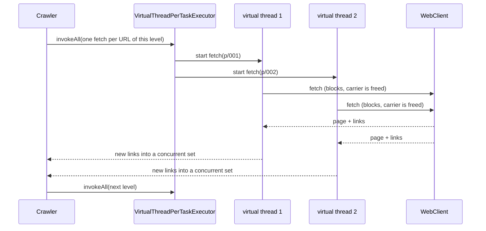
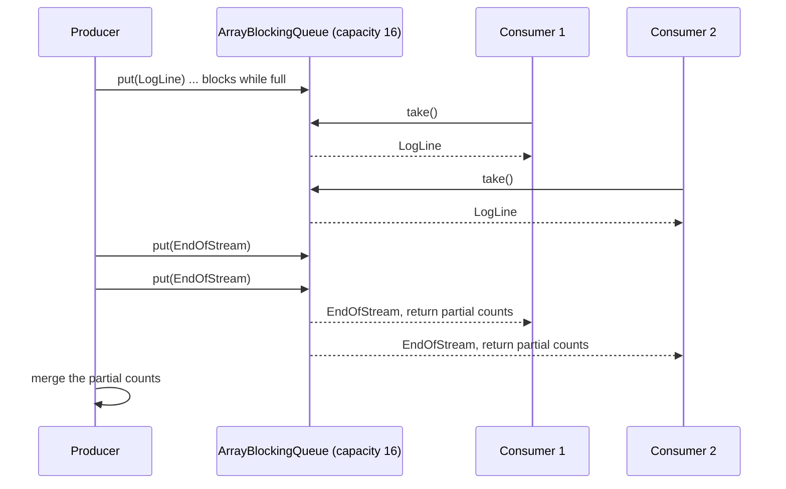
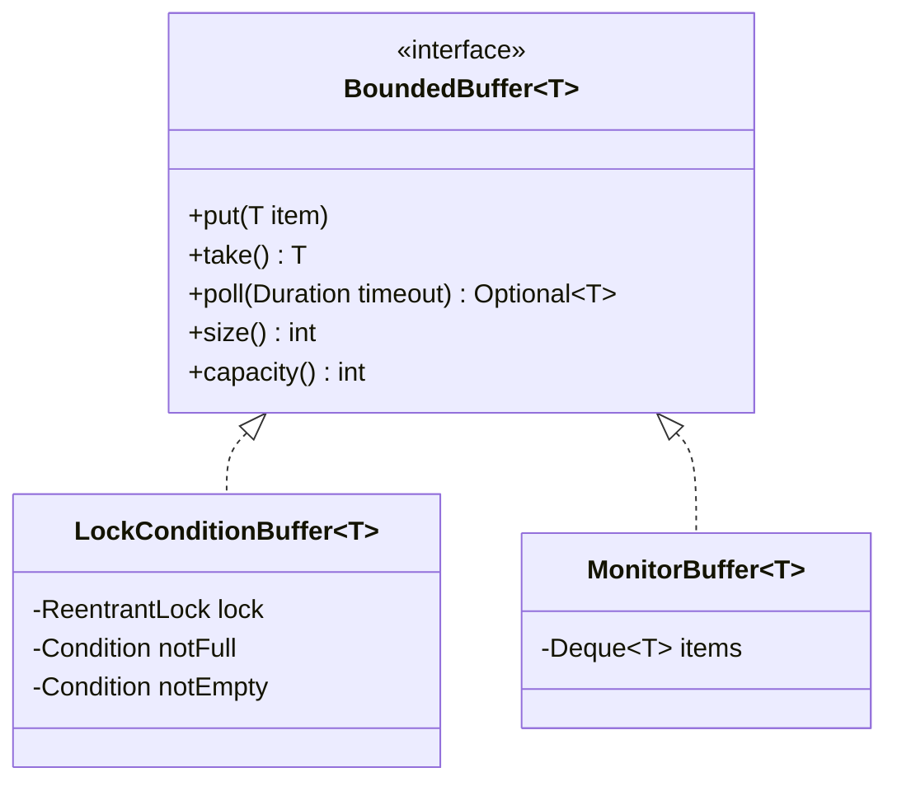
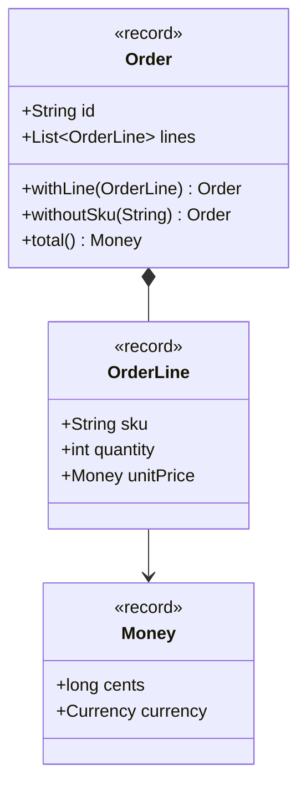
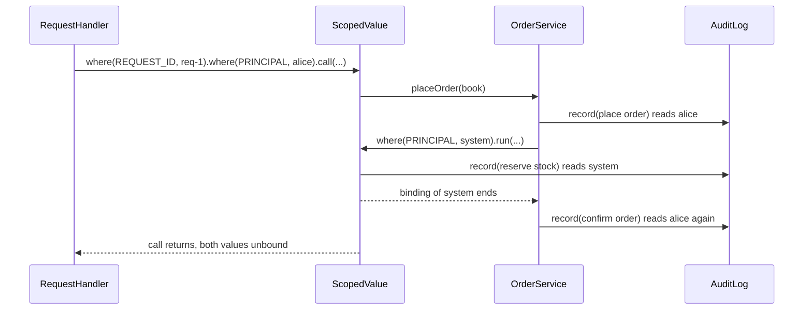
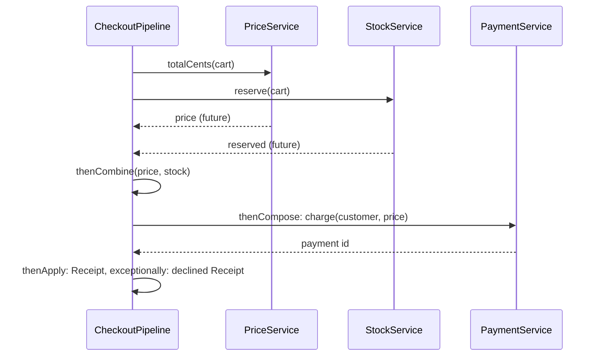
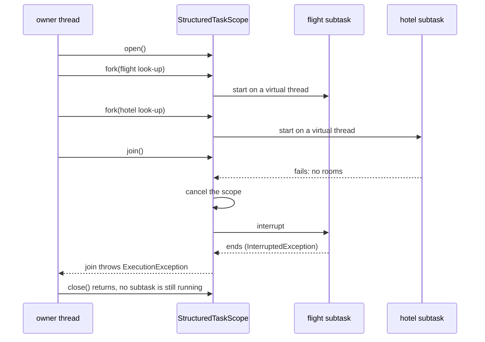

# Module 10 — Concurrency Patterns

> **Week 12** · Prerequisites: m09 (immutability, records, sealed result types), m07 (Observer, `Flow`), m06 (Command objects as `Runnable`/`Callable`), m03 (Object Pool, `Semaphore` throttle), m00 (records, sealed types, `switch` patterns) · Estimated study time: 7 h
>
> Run every example without a build: `java modules/m10-concurrency-patterns/src/main/java/io/github/aliturgutbozkurt/patterns/m10/examples/<path>/<Demo>.java` (JDK 27). The three Structured Concurrency demos use a **preview** API and need `java --enable-preview --source 27 <file>`.

## Learning outcomes

By the end of this module you can:

1. **Explain** why blocking code on virtual threads scales with the thread-per-task model, **implement** it with
   `Executors.newVirtualThreadPerTaskExecutor()` and `Thread.ofVirtual()`, and **decide** when to limit the scarce
   resource instead of pooling threads.
2. **Implement** Producer–Consumer over a bounded `BlockingQueue` with back-pressure and a poison pill per consumer,
   and **implement** Guarded Suspension and Balking with `ReentrantLock`/`Condition` and with
   `synchronized`/`wait`/`notifyAll`, always waiting in a `while` loop.
3. **Design** immutable value objects and **publish** changing state safely through an `AtomicReference` that holds
   immutable snapshots.
4. **Use** `ScopedValue` to carry request context and **compare** it with `ThreadLocal`.
5. **Compose** asynchronous work with `CompletableFuture` and **compare** it with Structured Concurrency (preview in
   JDK 27): fork, join, joiners, cancellation, deadlines.
6. **Test** concurrent code deterministically: latches instead of sleeps, bounded waits, injected executors and
   assertions about invariants instead of timing.

## Motivation

Every pattern so far ran on one thread. Real programs do many things at once: a shop answers hundreds of requests, a
crawler fetches pages, a checkout asks the price, stock and payment services. Shared mutable state plus threads gives
the classic bugs: lost updates, half-written objects, threads that wait forever or never wait at all. These bugs
appear once in a thousand runs, so "it worked on my machine" proves nothing.

The patterns of this week make concurrent code **correct by construction**. Give each task its own thread and keep
the code sequential (thread-per-task). Hand work over through a bounded queue (Producer–Consumer). Wait for a condition
properly, or refuse at once (Guarded Suspension, Balking). Share only what cannot change (Immutable Object). Pass
context without global state (Scoped Values). Give a group of subtasks one lifetime, one deadline and one failure
policy (`CompletableFuture`, then Structured Concurrency). The last section shows how to *test* all of it without a
single `sleep`.

## Thread-per-task with virtual threads

### Problem

A crawler must fetch 200 pages, each a blocking network call of 50 ms. One after another that takes 10 s. A fixed
pool of platform threads helps, but every blocked call holds an expensive OS thread, so the pool size caps how many
calls can wait at once. The usual workaround, callback-style asynchronous code, makes the program hard to read,
debug and profile.

### Intent

> Run every independent task in its own thread, and write the task as plain blocking code. With virtual threads a
> blocked thread costs almost nothing, so concurrency is limited by the work, not by a thread pool.

### Structure



### Classic Java

The classic answer is a fixed pool of platform threads. The workload below makes the cap visible: every job waits
at a gate that opens only when a given number of jobs are in flight together, so the measured peak is exact instead of
"usually about right":

```java
// file: threadpertask/scaling/BlockingJob.java
    @Override
    public void run() {
        tracker.enter();
        try {
            gate.countDown();
            if (!gate.await(maxWait.toNanos(), TimeUnit.NANOSECONDS)) {   // bounded: never hangs
                throw new IllegalStateException("gate still closed after " + maxWait
                        + ": fewer jobs than expected were in flight together");
            }
        } catch (InterruptedException e) {
            Thread.currentThread().interrupt();
            throw new IllegalStateException("interrupted while waiting at the gate", e);
        } finally {
            tracker.exit();
        }
    }
```

```java
// file: threadpertask/scaling/Workloads.java
    public static Result runOnFixedPool(int threads, int tasks) {
        var tracker = new InFlightTracker();
        var gate = new CountDownLatch(Math.min(threads, tasks));    // opens when the pool is fully busy
        List<Future<?>> futures;
        try (var pool = Executors.newFixedThreadPool(threads, Thread.ofPlatform().name("worker-", 0).factory())) {
            futures = submitAll(pool, tasks, tracker, gate);
        }                                                           // close() waits for every task
        return result(tracker, futures);
    }
```

### Modern Java 27

One virtual thread per task. The code is the same, except for the executor. The gate now waits for **all** 10 000
jobs, and it opens, which proves that all of them were in flight at the same moment:

```java
// file: threadpertask/scaling/Workloads.java
    public static Result runThreadPerTask(int tasks) {
        var tracker = new InFlightTracker();
        var gate = new CountDownLatch(tasks);                       // opens only when ALL tasks are in flight
        List<Future<?>> futures;
        try (var executor = Executors.newVirtualThreadPerTaskExecutor()) {
            futures = submitAll(executor, tasks, tracker, gate);
        }
        return result(tracker, futures);
    }
```

```text
10000 blocking tasks on a fixed pool of 100 platform threads: completed 10000, peak in flight 100
10000 blocking tasks, one virtual thread each: completed 10000, peak in flight 10000
Thread.ofPlatform(): Facts[name=worker-0, virtual=false, daemon=false]
Thread.ofVirtual():  Facts[name=crawler-0, virtual=true, daemon=true]
unnamed virtual thread has name "": true
```

Since JDK 19 an `ExecutorService` is `AutoCloseable`: leaving the `try` block waits for every task, so "all tasks
finished" is a property of the code's shape. Virtual threads are always daemon threads, have no name unless the
builder gives one (`Thread.ofVirtual().name("crawler-", 0)` names them `crawler-0`, `crawler-1`, …), and should
**never be pooled**: creating one is cheaper than borrowing one.

The crawler applies the model to a real job. Each URL of a level is one task with ordinary blocking code; a concurrent
set de-duplicates links found by different tasks at the same time:

```java
// file: threadpertask/crawler/Crawler.java
        for (int depth = 0; !level.isEmpty(); depth++) {
            boolean followLinks = depth < maxDepth;
            Queue<String> nextLevel = new ConcurrentLinkedQueue<>();
            List<Callable<Void>> fetches = new ArrayList<>();
            for (String url : level) {
                fetches.add(() -> {                         // one task (one virtual thread) per URL
                    try {
                        Page page = client.fetch(url);      // blocking I/O, written as plain sequential code
                        visited.add(url);
                        if (followLinks) {
                            page.links().stream().filter(seen::add).forEach(nextLevel::add);
                        }
                    } catch (IOException e) {
                        failures.put(url, e.getMessage());
                    }
                    return null;
                });
            }
            for (Future<Void> fetch : executor.invokeAll(fetches)) {   // waits until the whole level is done
                rethrowUnexpected(fetch);
            }
            level = List.copyOf(nextLevel);
        }
```

```text
crawling 200 product pages, 50 ms latency each, one virtual thread per fetch
visited: 200 pages
first:   https://shop.example/p/000
last:    https://shop.example/p/199
failures: {https://shop.example/p/retired=404 Not Found: https://shop.example/p/retired}
every page fetched exactly once: true
```

Going level by level is a deliberate choice. A purely recursive crawl ("fetch, then fork a task per new link") would
mark a page as seen on whichever path reached it first, so its depth, and therefore the result of the depth limit,
would depend on timing. Here a page's depth is always its shortest link distance, and the report is the same on every
run.

### Real-world usage

Servlet containers and frameworks offer "one virtual thread per request" (Tomcat, Jetty, Helidon Níma, Spring Boot
with `spring.threads.virtual.enabled`). `java.net.http.HttpClient` and JDBC drivers block a virtual thread cheaply.
Since **JDK 24 (JEP 491)**, `synchronized` no longer *pins* a virtual thread to its carrier: a virtual thread that
blocks inside a `synchronized` block now releases the carrier as well.

### Pitfalls and when NOT to use it

- **Do not pool virtual threads**, and do not use a thread pool as a rate limiter. Limit the scarce resource itself:
  m03's `ThrottledClient` (a `Semaphore` around the downstream call) is exactly that, and is not repeated here.
- Virtual threads do not make CPU-bound work faster: there are still only as many cores. Use parallel streams or a
  `ForkJoinPool` for computation.
- `ThreadLocal` caches that were fine with 200 pooled threads now exist once per task, possibly millions of times
  (see Scoped Values below).
- Blocking inside native code (JNI) or `Object.wait()` in old libraries can still occupy a carrier.

### Related patterns

**Object Pool** (m03) is what thread-per-task makes unnecessary for threads. **Command** (m06): every task is a
`Runnable`/`Callable` object. **Producer–Consumer** is the next step when tasks must hand data to each other.

## Producer–Consumer

### Problem

A log shipper reads lines from a file much faster than the parsers can classify them. If the reader hands every line
to an unbounded list, memory grows until the process dies, and the overload stays invisible until then. The consumers
must also learn, reliably, that no more lines will come.

### Intent

> Decouple threads that produce work from threads that consume it through a **bounded** queue. A full queue blocks the
> producer (**back-pressure**); an empty queue blocks the consumers; a **poison pill** per consumer ends the stream.

### Structure



### Classic Java

The classic shape is a shared list guarded by the object's monitor with `wait`/`notifyAll`. The bounded buffer in the
next section is exactly that, and the magic value `"EOF"` as end marker was the usual poison pill. A magic string is
fragile: a real log line might contain it, and a consumer that forgets to check it never stops.

### Modern Java 27

`java.util.concurrent` ships the buffer (`ArrayBlockingQueue`: bounded, `put` and `take` block). The pill becomes a
**type**, so a `switch` over the sealed message cannot forget it:

```java
// file: producerconsumer/logs/LogMessage.java
public sealed interface LogMessage {

    /** One line of the log file. */
    record LogLine(String text) implements LogMessage {
        public LogLine {
            Objects.requireNonNull(text, "text");
        }
    }

    /** The poison pill: "no more lines". Each consumer takes exactly one and stops. */
    record EndOfStream() implements LogMessage {}
}
```

The producer runs on the calling thread, the consumers on virtual threads. Each consumer counts into a private map,
so no locking is needed, and the partial counts are merged after `close()` has waited for every consumer:

```java
// file: producerconsumer/logs/LogIngestion.java
    public LevelCounts ingest(Iterable<String> lines) throws InterruptedException {
        List<Future<LevelCounts>> results = new ArrayList<>();
        try (var executor = Executors.newThreadPerTaskExecutor(threadFactory)) {
            for (int i = 0; i < consumers; i++) {
                results.add(executor.submit(this::consume));
            }
            for (String line : lines) {
                queue.put(new LogMessage.LogLine(line));     // blocks while the queue is full: back-pressure
            }
            for (int i = 0; i < consumers; i++) {
                queue.put(new LogMessage.EndOfStream());      // one pill per consumer
            }
        }                                                     // close() waits until every consumer has stopped
// ...
    private LevelCounts consume() throws InterruptedException {
        Map<Level, Long> tally = new EnumMap<>(Level.class);    // private to this consumer: no locking
        while (true) {
            switch (queue.take()) {
                case LogMessage.LogLine(String text) -> tally.merge(Level.of(text), 1L, Long::sum);
                case LogMessage.EndOfStream() -> {
                    return LevelCounts.fromTally(tally);
                }
            }
        }
    }
```

```text
1 producer, 4 consumers, queue capacity 16, 10000 lines
{ERROR=500, WARN=1500, INFO=6000, DEBUG=1500, UNPARSEABLE=500}
every line counted once: true
same as a sequential count: true
```

Which consumer counted which line changes from run to run; the merged result never does. The tests check exactly
that (identical to a sequential count for 1, 2 and 8 consumers), and an instrumented queue proves that its size never
exceeds the capacity and that every consumer took exactly one pill.

### Multi-stage pipelines

Chaining queues gives a pipeline: `pick → pack → ship`, each stage a consumer of one queue and the producer of the
next. Shutdown travels stage by stage: a stage forwards the pill only after everything in front of it is done.

```java
// file: producerconsumer/fulfilment/FulfilmentPipeline.java
                switch (in.take()) {
                    case Parcel.InTransit(Order order, List<String> log) -> {
                        stage.process(order);
                        List<String> next = new ArrayList<>(log);
                        next.add(name);
                        out.accept(new Parcel.InTransit(order, next));
                    }
                    case Parcel.EndOfOrders pill -> {
                        shutdownLog.add(name + " drained");  // everything before the pill is done
                        out.accept(pill);                    // forward exactly one pill downstream
                        return;
                    }
                }
```

The demo stalls the ship stage with a latch. With one slot per queue, exactly 6 orders fit (3 queues + 3 stages each
holding one), so the 7th `trySubmit` fails every time. Back-pressure travelled from the last stage to the producer:

```text
pipeline pick -> pack -> ship, 1 slot per queue, ship stage stalled
submitted orders 1..6: every queue and every stage now holds one order
trySubmit(order 7, 50 ms) -> false (back-pressure reached the producer)
ship stage resumes
submit(order 7) -> accepted
shutdown: [pick drained, pack drained, ship drained]
Shipment[orderId=1, stageLog=[pick, pack, ship]]
Shipment[orderId=2, stageLog=[pick, pack, ship]]
Shipment[orderId=3, stageLog=[pick, pack, ship]]
Shipment[orderId=4, stageLog=[pick, pack, ship]]
Shipment[orderId=5, stageLog=[pick, pack, ship]]
Shipment[orderId=6, stageLog=[pick, pack, ship]]
Shipment[orderId=7, stageLog=[pick, pack, ship]]
```

### Real-world usage

`ThreadPoolExecutor` is a Producer–Consumer: `execute` produces into a `BlockingQueue<Runnable>`, the worker threads
consume. Logging frameworks' async appenders (Log4j 2, Logback), Kafka and RabbitMQ consumers, and `Flow`/Reactive
Streams (m07, with demand instead of blocking) all follow the same idea.

### Pitfalls and when NOT to use it

- An **unbounded** queue (`LinkedBlockingQueue()` without capacity, `Executors.newFixedThreadPool`'s queue) hides
  overload until memory runs out. Choose the capacity on purpose.
- One pill for N consumers stops only one of them, so send one per consumer, *after* the last item.
- A consumer that dies with an exception leaves the producer blocked on a full queue. Make consumers robust (the log
  consumer counts bad lines as `UNPARSEABLE` instead of throwing) and give the producer a timeout (`offer`).
- A plain blocking queue cannot release a producer that is already blocked when you shut down (ex02 shows why and
  fixes it with conditions).

### Related patterns

**Guarded Suspension** is how `put` and `take` wait. **Observer with `Flow`** (m07) replaces blocking with demand.
**Command** (m06): queued items are often command objects.

## Guarded Suspension and Balking

### Problem

A thread wants to do something that is only possible in a certain state: take from a buffer that is empty, answer a
request before the cache is warm, start a save while another one is running. Polling in a loop with `sleep` wastes
CPU and reacts late. Acting anyway corrupts state.

### Intent

> **Guarded Suspension:** when the precondition (the *guard*) does not hold, suspend the thread until another thread
> makes it true, and re-check it after every wake-up. **Balking:** when the precondition does not hold, return at
> once and do nothing, because waiting would be pointless.

### Structure



### Classic Java

The object's own monitor: `synchronized`, `wait()` and `notifyAll()`. The guard must be a `while` loop. A woken thread
may find the condition false again, because another thread was faster (a *stolen* condition) or because the JVM may
wake threads for no reason (a *spurious wake-up*):

```java
// file: guarded/buffer/MonitorBuffer.java
    @Override
    public synchronized void put(T item) throws InterruptedException {
        Objects.requireNonNull(item, "item");
        while (items.size() == capacity) {          // re-check after every wake-up (spurious or stolen)
            wait();
        }
        items.addLast(item);
        notifyAll();
    }

    @Override
    public synchronized T take() throws InterruptedException {
        while (items.isEmpty()) {
            wait();
        }
        T item = items.removeFirst();
        notifyAll();
        return item;
    }
```

A monitor has a single wait set, so producers and consumers wait together and every change must wake them all.
`notify()` could wake a producer when a consumer was needed, and the signal would be lost.

### Modern Java 27

A `ReentrantLock` with two named `Condition`s gives each kind of thread its own wait set, so `signal()` wakes exactly
one thread of the right kind. Waits can be interrupted and timed:

```java
// file: guarded/buffer/LockConditionBuffer.java
    @Override
    public void put(T item) throws InterruptedException {
        Objects.requireNonNull(item, "item");
        lock.lockInterruptibly();
        try {
            while (items.size() == capacity) {      // guard: while, never if
                notFull.await();
            }
            items.addLast(item);
            notEmpty.signal();                      // wake one consumer: only consumers wait on notEmpty
        } finally {
            lock.unlock();
        }
    }
// ...
    @Override
    public Optional<T> poll(Duration timeout) throws InterruptedException {
        long nanos = timeout.toNanos();
        lock.lockInterruptibly();
        try {
            while (items.isEmpty()) {
                if (nanos <= 0) {
                    return Optional.empty();
                }
                nanos = notEmpty.awaitNanos(nanos); // returns the time that is left
            }
            return Optional.of(removeFirst());
        } finally {
            lock.unlock();
        }
    }
```

```text
LockConditionBuffer, capacity 2: writer stored [r1, r2, r3, r4, r5, r6, r7, r8]
MonitorBuffer, capacity 2: writer stored [r1, r2, r3, r4, r5, r6, r7, r8]
poll(50 ms) on an empty buffer: Optional.empty
```

Both implementations pass one shared abstract test (FIFO, blocking `take`/`put`, interruptible waits, 8 producers ×
8 consumers × 1 000 items with an equal multiset at the end). Since JEP 491, `synchronized` and `wait()` no longer pin
virtual threads, so the choice is about expressiveness (several conditions, timed and interruptible lock
acquisition), not about virtual-thread performance.

### Guarding a state

The guard does not have to be about a buffer. A service that warms its cache lets early requests *wait* at a
`ReadinessGate` instead of failing them. A failed start-up wakes every waiter with the cause, so no request hangs:

```java
// file: guarded/gate/ReadinessGate.java
    public boolean awaitReady(Duration timeout) throws InterruptedException {
        long nanos = timeout.toNanos();
        lock.lockInterruptibly();
        try {
            while (state == State.STARTING) {           // the guard
                if (nanos <= 0) {
                    return false;
                }
                nanos = settled.awaitNanos(nanos);
            }
            if (state == State.FAILED) {
                throw new IllegalStateException("service failed to start", failure);
            }
            return true;
        } finally {
            lock.unlock();
        }
    }
```

```text
3 requests started before the cache was warm
warm-up finished: READY
GET apple -> Optional[1.20 EUR]
GET bread -> Optional[2.50 EUR]
GET milk -> Optional[0.99 EUR]
awaitReady(50 ms) while STARTING: false
failed start-up: IllegalStateException: service failed to start, cause: price database unreachable
```

### Balking

An editor auto-saves every few seconds. If nothing changed, or a save is still running, the right reaction is to
**return at once**; the running save or the next tick will do the work. An `AtomicBoolean` decides "who saves" without
a lock, and version numbers tell dirty from clean, so an edit made *during* a save keeps the document dirty:

```java
// file: guarded/balking/AutoSavingDocument.java
    public SaveResult save() {
        if (!isDirty()) {
            return SaveResult.SKIPPED_CLEAN;                    // balk: nothing to do
        }
        if (!saving.compareAndSet(false, true)) {
            return SaveResult.SKIPPED_IN_PROGRESS;              // balk: someone else is saving right now
        }
        try {
            Snapshot snapshot = current.get();
            if (snapshot.version() == savedVersion.get()) {
                return SaveResult.SKIPPED_CLEAN;                // a save finished between the two checks
            }
            store.write(snapshot.version(), snapshot.text());
            savedVersion.set(snapshot.version());               // an edit made meanwhile has a higher version
            return SaveResult.SAVED;
        } finally {
            saving.set(false);
        }
    }
```

```text
save() on a new document -> SKIPPED_CLEAN
edit, save() -> SAVED
save() again -> SKIPPED_CLEAN
edit; auto-save #1 is now writing (the store is slow)
save() while #1 writes -> SKIPPED_IN_PROGRESS
edit while #1 writes
auto-save #1 -> SAVED, still dirty: true
save() -> SAVED
store received: [v1: Dear team,, v2: Dear team, the release is on Friday., v3: Dear team, the release is on Friday. Thanks!]
```

The re-check after winning the `compareAndSet` matters: without it, 100 concurrent `save()` calls on one dirty
document could write twice (one save finishes, the next one wins the flag and writes the same version again). The
test asserts exactly one write.

### Real-world usage

`ArrayBlockingQueue`, `CountDownLatch`, `Semaphore` and `FutureTask.get()` are Guarded Suspension inside the JDK.
`Thread.start()` balks: it throws on a second call. `ExecutorService.execute` after `shutdown()` and
`ReentrantLock.tryLock()` are "refuse at once". In applications: readiness probes, connection warm-up, "only one
refresh at a time" caches.

### Pitfalls and when NOT to use it

- `if (!condition) wait();` is a bug: always `while`.
- Waiting while holding *another* lock invites deadlock; wait only on the lock that guards the condition.
- Every wait in production code needs an answer to "what wakes me if the other side dies?" (a timeout, a failure
  state like `FAILED`, or a shutdown flag in the guard).
- Do not balk when the caller really needs the result; suspend with a timeout instead.

### Related patterns

**Producer–Consumer** is built from two guarded operations. **State** (m08) makes the guarded states explicit.
**Object Pool** (m03): `acquire` on an exhausted pool is Guarded Suspension with a timeout.

## Immutable Object

### Problem

An order is read by the web thread, the invoice thread and the e-mail thread. With a mutable JavaBean every reader
needs a lock, every getter must copy, and a caller that changes the list returned by `getLines()` changes the order
behind everybody's back. Configuration that is updated field by field can be observed half-written: the new minimum
pool size together with the old maximum.

### Intent

> Make objects whose state cannot change after construction. They can be shared between any number of threads without
> locks; a "change" creates a new object, and a single atomic reference swap publishes it.

### Structure



### Classic Java

The rules for an immutable class were: `final` class, `private final` fields, no setters, defensive copies of
mutable inputs and outputs, and no `this` escaping from the constructor. The bean below breaks them all, and the demo
shows the result:

```java
// file: immutable/order/MutableOrder.java
    /** Returns the internal list itself: the bug this class exists to show. */
    public List<OrderLine> getLines() {
        return lines;
    }

    /** Stores the caller's list itself: the caller can still change it afterwards. */
    public void setLines(List<OrderLine> lines) {
        this.lines = lines;
    }
```

### Modern Java 27

A record gives final fields, accessors, `equals`/`hashCode` and no setters. The compact constructor validates and
copies in one place; `List.copyOf` is the defensive copy and makes the list unmodifiable in one call. Withers return
new instances:

```java
// file: immutable/order/Order.java
public record Order(String id, List<OrderLine> lines) {

    public Order {
        if (id == null || id.isBlank()) {
            throw new IllegalArgumentException("id must not be blank");
        }
        lines = List.copyOf(lines);                 // defensive copy + unmodifiable, in one call
        if (lines.isEmpty()) {
            throw new IllegalArgumentException("order " + id + " needs at least one line");
        }
// ...
    /** A new order with {@code line} appended; this order is unchanged. */
    public Order withLine(OrderLine line) {
        List<OrderLine> next = new ArrayList<>(lines);
        next.add(line);
        return new Order(id, next);
    }
```

```text
order A-1: 3 lines, total 57.50 EUR
withLine(pen) -> new order: 4 lines, total 60.00 EUR; original: 3 lines, total 57.50 EUR
withoutSku(book) -> 2 lines; original unchanged: true
source list changed after construction -> order still has 3 lines
lines().add(...) -> UnsupportedOperationException
new OrderLine("pen", -1, ...) -> quantity must be positive: -1
EUR line + USD line -> mixed currencies in order A-2: EUR and USD
1000 virtual threads read A-1 while others derive new orders -> all totals consistent: true
MutableOrder: a caller added to getLines() -> the bean now has 4 lines, no setter was called
```

Why no lock is needed: the Java Memory Model guarantees that a thread that sees a reference to an object also sees
the values of its `final` fields as they were at the end of the constructor. Record components are final, and the
list behind them can never change.

### Copy-on-write publication

State that *does* change, such as configuration that is hot-reloaded, is kept as a sequence of immutable snapshots.
An `AtomicReference` always points at one complete snapshot, so readers get the old or the new one, never a mix:

```java
// file: immutable/config/LiveConfig.java
    /** The snapshot in force right now. Keep using the returned object: it will never change. */
    public ConfigSnapshot current() {
        return current.get();
    }

    /**
     * Applies {@code change} atomically and returns the new snapshot. {@code change} may run more than once under
     * contention, so it must be a pure function of its argument. If it throws, nothing is changed.
     */
    public ConfigSnapshot update(UnaryOperator<ConfigSnapshot> change) {
        return current.updateAndGet(change);
    }
```

```text
v1: pool 5..20, flags {checkout.v2=off, search.fuzzy=on}
v2: pool 10..40, flags {checkout.v2=off, search.fuzzy=on}
v3: pool 10..40, flags {checkout.v2=on, search.fuzzy=on}
flags().put(...) -> UnsupportedOperationException
pool 50..40 rejected: minConnections 50 > maxConnections 40; current is still v3
16 writers x 1000 updates on virtual threads -> v16003 (no update lost)
```

`updateAndGet` is a compare-and-set loop: on contention it calls the function again with the newer snapshot, which
is why the function must be pure (no side effects, same input, same output). The test runs 16 × 1 000 increments and
expects exactly 16 000, and readers check a rule that only a torn read could break (`max == 2 × min`).

### Real-world usage

`String`, `java.time` (`LocalDate`, `Instant`), `BigDecimal`, `List.of`/`Map.of` and every record. Copy-on-write:
`CopyOnWriteArrayList`, `String.replace`, persistent collections in functional languages, Git commits.

### Pitfalls and when NOT to use it

- "Shallow" immutability: a record holding an `ArrayList` is mutable unless the compact constructor copies it.
- Arrays cannot be made immutable; copy them in and out, or use `List`.
- Very large objects changed in tiny steps produce a lot of garbage; then a well-encapsulated mutable object with one
  lock may be the better design.
- Never let `this` escape from a constructor (registering a listener, starting a thread): other threads could see a
  half-built object.

### Related patterns

**Value Object** and records (m00, m09). **Prototype** (m03) is much simpler with immutable state: copying becomes
sharing. **Memento** (m07): snapshots are immutable mementos. **Flyweight** (m05) needs immutable intrinsic state.

## Scoped Values

### Problem

The audit log deep in the call chain needs the current user and request id. Passing them as parameters through every
layer pollutes every signature. The classic shortcut, a `ThreadLocal`, is mutable, lives as long as the thread, and
must be cleaned with `remove()`. Forget it on a pooled thread and the next request runs as the previous user.

### Intent

> Bind an immutable value for the dynamic extent of a call (`ScopedValue.where(KEY, value).call(...)`): everything
> that runs inside, and structured subtasks forked inside, can read it; nothing outside can, and nothing can change it.

### Structure



### Classic Java

```java
// file: scopedvalue/threadlocal/ContextLeaks.java
    public static String secondTaskSeesWithoutRemove() throws InterruptedException, ExecutionException {
        var context = new ThreadLocalContext();
        try (var pool = Executors.newSingleThreadExecutor()) {
            pool.submit(() -> context.set("alice")).get();         // request of alice, no cleanup
            return pool.submit(context::get).get();                // request of someone else
        }
    }
```

```text
ThreadLocal, 1-thread pool, no remove(): task 2 sees user = alice   <- leaked from task 1
ThreadLocal, 1-thread pool, remove() in finally: task 2 sees user = null
InheritableThreadLocal in a child virtual thread: alice
ThreadLocal in a child virtual thread: null
ScopedValue bound in the parent, read in a newVirtualThreadPerTaskExecutor task: bound = false
ScopedValue bound in the parent, read in a raw Thread.ofVirtual() thread: bound = false
ScopedValue after run() returned: bound = false
```

A 1-thread pool makes the leak deterministic: task 2 runs on the thread task 1 left dirty. `InheritableThreadLocal`
goes further and *copies* the value into every child thread, so with millions of virtual threads it multiplies memory.

### Modern Java 27

Scoped values are final since JDK 25 (JEP 506). The key is an immutable constant; the binding exists only for the
duration of `call`/`run`:

```java
// file: scopedvalue/request/RequestContext.java
    /** Who is calling. */
    public static final ScopedValue<Principal> PRINCIPAL = ScopedValue.newInstance();

    /** Correlation id of the current request. */
    public static final ScopedValue<String> REQUEST_ID = ScopedValue.newInstance();
```

```java
// file: scopedvalue/request/RequestHandler.java
    public <T, X extends Throwable> T handle(String requestId, Principal principal,
            ScopedValue.CallableOp<T, X> work) throws X {
        return ScopedValue.where(RequestContext.REQUEST_ID, requestId)
                .where(RequestContext.PRINCIPAL, principal)
                .call(work);                     // unbound again when call returns, even on an exception
    }
```

A nested `where` rebinds a value for a block only ("run as system"); afterwards the outer value is back:

```java
// file: scopedvalue/request/OrderService.java
    public String placeOrder(String item) {
        audit.record("place order " + item);
        ScopedValue.where(RequestContext.PRINCIPAL, Principal.SYSTEM)       // rebind for this block only
                .run(() -> audit.record("reserve stock for " + item));
        audit.record("confirm order " + item);                             // the outer principal again
        return "order for " + item + " placed by " + RequestContext.PRINCIPAL.get().name();
    }
```

```text
req-1 | alice  | place order book
req-1 | system | reserve stock for book
req-1 | alice  | confirm order book
req-2 | bob    | place order mug
req-2 | system | reserve stock for mug
req-2 | bob    | confirm order mug
req-3 | carol  | place order pen
req-3 | system | reserve stock for pen
req-3 | carol  | confirm order pen
after the requests: PRINCIPAL bound? false
PRINCIPAL.get() outside a request -> NoSuchElementException
PRINCIPAL.orElse(ANONYMOUS) -> anonymous
```

`CallableOp<T, X>` lets a checked exception of the work pass through `call` with its own type. The test runs 1 000
concurrent requests on virtual threads and checks that every audit entry carries its own request's id and user.

### Real-world usage

Request context in web frameworks (current user, tenant, trace id), transactions and security contexts in Spring and
Jakarta EE (traditionally `ThreadLocal`-based), and MDC logging context. With virtual threads and structured
concurrency, scoped values are the recommended replacement.

### Pitfalls and when NOT to use it

- A scoped value is **not** inherited by executor tasks or raw threads, only by `StructuredTaskScope` subtasks.
  Code that hands work to an executor must pass the value explicitly or rebind it.
- It is read-only. A per-request *mutable* accumulator (e.g. a list of warnings) does not belong in it; bind an
  object that is designed for concurrent use, or return the data instead.
- Do not use it to avoid parameters that are part of the method's real contract. Context is cross-cutting data.

### Related patterns

**Singleton** (m02): global state that scoped values make local to a call. **Dependency Injection** (m03): the
explicit alternative for long-lived collaborators. **Structured Concurrency** (below) is where inheritance happens.

## CompletableFuture pipelines

### Problem

A checkout needs a price and a stock reservation (independent of each other) and then a payment (which needs the
price). Calling them one after another adds up the latencies. Starting them with an executor and calling
`Future.get()` blocks a thread at every step, and errors and timeouts end up scattered over `try`/`catch` blocks.

### Intent

> Describe asynchronous work as a pipeline of stages: run independent steps concurrently, chain dependent ones, and
> handle failures and deadlines as part of the pipeline, all without blocking.

### Structure



### Classic Java

A `Future` from `ExecutorService.submit` can only be waited for (`get`) or cancelled. Note that `cancel(true)`
**does** interrupt the task's thread here, because the executor knows which thread runs it:

```java
// file: future/quotes/CancellationFacts.java
    public static Outcome cancelExecutorFuture(ExecutorService executor) throws InterruptedException {
        var started = new CountDownLatch(1);
        var finished = new CountDownLatch(1);
        var interrupted = new AtomicBoolean();
        Future<?> future = executor.submit(() -> {
            started.countDown();
            awaitRecordingInterrupt(new CountDownLatch(1), interrupted);   // never opened: only an interrupt ends it
            finished.countDown();
        });
        await(started);
        future.cancel(true);
        await(finished);
        return new Outcome(future.isCancelled(), interrupted.get());
    }
```

### Modern Java 27

```java
// file: future/checkout/CheckoutPipeline.java
    public CompletableFuture<Receipt> checkout(Cart cart) {
        CompletableFuture<Long> total = prices.totalCents(cart);          // both start right away
        CompletableFuture<Void> reserved = stock.reserve(cart);
        return total
                .thenCombine(reserved, (cents, _) -> cents)                 // wait for both independent results
                .thenComposeAsync(cents -> payments.charge(cart.customer(), cents)   // dependent async step
                        .thenApply(paymentId -> Receipt.approved(cart.customer(), cents, paymentId)), executor)
                .exceptionally(failure -> Receipt.declined(cart.customer(), unwrap(failure).getMessage()));
    }

    /** A dependent stage sees the original exception wrapped in a {@link CompletionException}. */
    private static Throwable unwrap(Throwable failure) {
        return failure instanceof CompletionException && failure.getCause() != null ? failure.getCause() : failure;
    }
```

`thenApply` transforms a value; `thenCompose` is for a function that itself returns a future (like `flatMap`), so the
result is `CompletableFuture<Receipt>` and not a nested `CompletableFuture<CompletableFuture<…>>`. A failure in a
dependent stage arrives wrapped in a `CompletionException`; `join()` throws that one, `get()` throws an
`ExecutionException`. The injected executor makes the pipeline testable: with `Runnable::run` everything happens
synchronously inside `checkout`, and the same code on virtual threads gives the same receipt:

```text
alice: Receipt[customer=alice, status=APPROVED, totalCents=2250, detail=payment pay-1]
bob:   Receipt[customer=bob, status=DECLINED, totalCents=0, detail=out of stock: mug]
carol: Receipt[customer=carol, status=DECLINED, totalCents=0, detail=card declined: 120.00 exceeds limit]
payment service called 2 times (never for bob)
done when checkout() returned (Runnable::run): true
same receipt for alice on virtual threads: true
```

### Fan-out, fan-in and deadlines

`allOf` waits for many futures; reading the results afterwards **in input order** keeps the output deterministic,
whatever order they finished in. `completeOnTimeout` substitutes a value when a future is late; `orTimeout` fails it
with a `TimeoutException`:

```java
// file: future/quotes/QuoteFanOut.java
    public CompletableFuture<List<Quote>> all(List<Supplier<Quote>> providers, Duration perQuoteDeadline,
            Quote fallback) {
        List<CompletableFuture<Quote>> quotes = providers.stream()
                .map(provider -> CompletableFuture.supplyAsync(provider, executor)
                        .completeOnTimeout(fallback, perQuoteDeadline.toNanos(), TimeUnit.NANOSECONDS))
                .toList();
        return inInputOrder(quotes);
    }
// ...
    private static CompletableFuture<List<Quote>> inInputOrder(List<CompletableFuture<Quote>> quotes) {
        return CompletableFuture.allOf(quotes.toArray(CompletableFuture[]::new))
                .thenApply(_ -> quotes.stream().map(CompletableFuture::join).toList());   // all done: join is safe
    }
```

```text
completeOnTimeout(50 ms) per quote, input order: [acme 120.00, globex 99.00, slowco FALLBACK]
orTimeout(50 ms) on the fan-out: CompletionException caused by TimeoutException
allOf after one provider failed: done = false (still waiting for the slow sibling)
allOf once the sibling finished: completed exceptionally = true
CompletableFuture.cancel(true): cancelled = true, task interrupted = false
ExecutorService Future.cancel(true): cancelled = true, task interrupted = true
```

The last four lines are the limits that motivate the next section. `allOf` does not give up when one provider fails;
it keeps waiting for the slow sibling. A timed-out supplier keeps running in the background. `cancel(true)` on a
`CompletableFuture` only completes the future: the task is not interrupted, because the future does not know which
thread runs it. Nothing ties the lifetime of the subtasks to the operation that started them.

### Real-world usage

`HttpClient.sendAsync`, Spring's `@Async` and WebClient adapters, reactive libraries' `toFuture()`, and most
asynchronous SDKs (cloud storage, databases) return `CompletableFuture`.

### Pitfalls and when NOT to use it

- Without an explicit executor, `*Async` methods use `ForkJoinPool.commonPool()`: blocking calls there starve every
  other user of the pool. Inject an executor.
- `exceptionally` sees `CompletionException`, not your exception; unwrap it.
- Long pipelines of lambdas are hard to debug and to read in a stack trace. With virtual threads, plain blocking code
  is often simpler.
- Cancellation and timeouts do not stop the underlying work (see above).

### Related patterns

**Observer/`Flow`** (m07) for streams of values instead of one result. **Command** (m06): every stage is a function
object. **Structured Concurrency** fixes lifetime and cancellation.

## Structured Concurrency

> ⚠️ **Preview API in JDK 27 (JEP 533, 7th preview).** The API may still change before it becomes final. The code
> lives only in the package `…m10.examples.structured`; this module compiles and tests with `--enable-preview`.
> Run the demos with `java --enable-preview --source 27 <file>.java`. Without the flag the source launcher stops with
> *"StructuredTaskScope is a preview API and is disabled by default."* The assignments do not use it.

### Problem

A trip plan needs a flight, a hotel and the weather forecast. If the hotel service fails, the flight search is still
running and nobody will read its answer. If the user gives up, all three keep running. With executors and futures,
subtasks can outlive the method that started them: there is no structure.

### Intent

> Treat a group of concurrent subtasks as **one unit of work** inside a block: subtasks cannot outlive the block, a
> failure or a timeout cancels the siblings, and the block ends only when all of them have finished.

### Structure



### Classic Java

Before structured concurrency the closest tools were `invokeAll` (wait for all, in task order, optionally with a
timeout that cancels the rest) and `ExecutorCompletionService` (results in completion order, so the first failure
can be seen at once). Assignment 01 builds a fail-fast, deadline-bound comparison from exactly these two, which
takes considerably more code than the version below.

### Modern Java 27

```java
// file: structured/travel/TripPlanner.java
    public Trip plan(String destination) throws ExecutionException, InterruptedException {
        try (var scope = StructuredTaskScope.open()) {
            Subtask<Trip.Flight> flight = scope.fork(() -> flights.find(destination));      // each on its own
            Subtask<Trip.Hotel> hotel = scope.fork(() -> hotels.find(destination));         // virtual thread
            Subtask<Trip.Forecast> forecast = scope.fork(() -> forecasts.find(destination));
            scope.join();                        // waits for all; throws on the first failure
            return new Trip(flight.get(), hotel.get(), forecast.get());
        }                                        // close(): every subtask has finished here
    }
```

`StructuredTaskScope.open()` uses the default joiner, `awaitAllSuccessfulOrThrow`: `join()` returns `null`, throws
an `ExecutionException` whose cause is the first failure, and the results come from the `Subtask` handles. A deadline
is a configuration of the scope:

```java
// file: structured/travel/TripPlannerWithDeadline.java
        try (var scope = StructuredTaskScope.open(Joiner.allSuccessfulOrThrow(),
                config -> config.withTimeout(deadline))) {
```

```text
plan(Lisbon) -> Trip[flight=Flight[number=TP 1234], hotel=Hotel[name=Casa Azul], forecast=Forecast[summary=sunny, 24 C]]
hotel service down -> ExecutionException caused by IllegalStateException: no rooms in Lisbon
flight look-up was interrupted before plan() returned: true
weather service hangs, deadline 50 ms -> ExecutionException caused by CancelledByTimeoutException
```

The guarantee is in the third line: the flight look-up observed its interrupt *before* `plan()` returned, because
`close()` waits for every subtask. In the test, the failing hotel look-up waits until the flight look-up has signalled
that it started; otherwise the scope might be cancelled before the flight's thread ran at all, and there would be no
interrupt to observe.

### Joiners are policies

The joiner decides what "done" means and what `join()` returns:

| Joiner | `join()` returns | Cancels the scope when |
|---|---|---|
| `awaitAllSuccessfulOrThrow()` (default) | `null` (read the `Subtask`s) | a subtask fails |
| `allSuccessfulOrThrow()` | `List<T>` in **fork** order | a subtask fails |
| `anySuccessfulOrThrow()` | the first successful result | a subtask succeeds |
| `allUntil(predicate)` | `List<Subtask<T>>` | the predicate is true |
| custom `Joiner` | whatever `result()`/`timeout()` return | `onFork`/`onComplete` return `true` |

"First success wins, cancel the rest":

```java
// file: structured/mirrors/MirrorDownloader.java
    public Download download(String file) throws ExecutionException, InterruptedException {
        try (var scope = StructuredTaskScope.open(Joiner.<Download>anySuccessfulOrThrow())) {
            for (Mirror mirror : mirrors) {
                scope.fork(() -> new Download(mirror.name(), mirror.source().fetch(file)));
            }
            return scope.join();                 // the first successful result
        }
    }
```

A custom joiner, "best effort": ignore failures, keep the successes, and return them even when the deadline expires.
`onFork` runs on the owner thread, and `result()`/`timeout()` run inside its `join()`, so a plain list is enough:

```java
// file: structured/mirrors/BestEffortJoiner.java
public final class BestEffortJoiner<T> implements Joiner<T, List<T>, RuntimeException> {

    private final List<Subtask<T>> forked = new ArrayList<>();

    @Override
    public boolean onFork(Subtask<T> subtask) {
        forked.add(subtask);
        return false;                            // never cancel the scope because of a fork
    }
// ...
    @Override
    public List<T> timeout() {
        return successes();                      // partial result instead of an exception
    }

    private List<T> successes() {
        return forked.stream().filter(subtask -> subtask.state() == Subtask.State.SUCCESS).map(Subtask::get).toList();
    }
}
```

```text
anySuccessfulOrThrow: Download[mirror=us-fast, content=report.pdf from us-fast]
  the slow mirror was interrupted: true
anySuccessfulOrThrow, every mirror broken: ExecutionException caused by IOException
allSuccessfulOrThrow, fork order: [shard-0: 3 hits, shard-1: 5 hits, shard-2: 0 hits]
best effort, one shard failing: [shard-0: 3 hits, shard-2: 0 hits]
best effort, 50 ms timeout, one shard failing and one hanging: []
```

### Scoped values and the owner rules

Structured subtasks **inherit** the caller's scoped-value bindings, for exactly as long as the scope lives. That is
the missing half of the Scoped Values section:

```java
// file: structured/context/ScopedFanOut.java
    public static List<String> traceAll(String traceId, List<String> services) throws InterruptedException {
        return ScopedValue.where(TRACE_ID, traceId).call(() -> {
            try (var scope = StructuredTaskScope.open(
                    Joiner.<String, IllegalStateException>allSuccessfulOrThrow(IllegalStateException::new))) {
                for (String service : services) {
                    scope.fork(() -> TRACE_ID.get() + " -> " + service);   // runs on another (virtual) thread
                }
                return scope.join();                                        // results in fork order
            }
        });
    }
```

The overload `allSuccessfulOrThrow(IllegalStateException::new)` maps a failure to an exception type of your choice
instead of `ExecutionException`. The structure is enforced at run time:

```text
subtasks of a StructuredTaskScope: [trace-42 -> inventory, trace-42 -> pricing, trace-42 -> shipping]
a task of newVirtualThreadPerTaskExecutor: bound = false
fork from another thread -> WrongThreadException
fork after join -> IllegalStateException
Subtask.get() before join -> IllegalStateException
close() after fork without join -> IllegalStateException
```

### Real-world usage

Fan-out in request handlers (call three back-ends, combine), hedged requests ("ask two replicas, take the first
answer"), scatter-gather search, and any code that today juggles `CompletableFuture.allOf` plus manual cancellation.
Erlang's supervisors, Kotlin's `coroutineScope` and Swift's task groups are the same idea in other languages.

### Pitfalls and when NOT to use it

- It is a **preview** API in JDK 27: it needs `--enable-preview` at compile and run time, and its shape has changed
  between previews (no `ShutdownOnFailure` any more). Keep it isolated, as this module does; `PreviewIsolationTest`
  fails if a preview-marked class appears outside `examples.structured`.
- Only the owner thread may fork and join; a scope is not a general-purpose executor.
- Subtasks must react to interruption, otherwise cancellation and deadlines cannot stop them, and `close()` waits.
- For long-lived background work that outlives a request, a scope is the wrong tool; use an executor with an explicit
  lifecycle.

### Related patterns

**Thread-per-task**: every subtask is a virtual thread. **CompletableFuture** fan-out without lifetime guarantees.
**Scoped Values**: inherited by subtasks. **Composite** (m05): scopes can nest, forming a tree of tasks.

## Testing concurrent code without sleep

A test that sleeps "long enough" is slow when it passes and flaky when the machine is busy. Every test in this
module follows the same rules: order is forced with latches, every wait is bounded (5 s) and asserted, a blocked
thread is detected by polling its state, real timeouts of 50 to 100 ms appear only where the timeout *is* the
behaviour, and assertions check invariants (counts, multisets, order) instead of timing. Every test class also carries
`@Timeout(10)` as a safety net.

```java
// file: support/Await.java
    /** Waits (bounded) until {@code thread} is parked in {@code WAITING} or {@code TIMED_WAITING}. */
    public static void untilBlocked(Thread thread) {
        long deadline = System.nanoTime() + BOUND.toNanos();
        while (true) {
            Thread.State state = thread.getState();
            if (state == Thread.State.WAITING || state == Thread.State.TIMED_WAITING) {
                return;
            }
            if (state == Thread.State.TERMINATED) {
                throw new AssertionError(thread + " terminated instead of blocking");
            }
            if (System.nanoTime() - deadline > 0) {
                throw new AssertionError(thread + " did not block within " + BOUND + " (state " + state + ")");
            }
            Thread.onSpinWait();
        }
    }
```

"Really suspended at the guard" then becomes a precise test instead of a guess:

```java
// file: guarded/BoundedBufferContract.java
    @Test
    void takeOnEmptyBufferBlocksUntilAPutReleasesItWithThatElement() throws Exception {
        BoundedBuffer<String> buffer = newBuffer(2);
        var taken = new CompletableFuture<String>();
        Thread thread = taker(buffer, taken);
        Await.untilBlocked(thread);                     // really suspended at the guard, not finished
        assertThat(taken).isNotDone();

        buffer.put("reading-1");
        assertThat(taken.get(5, TimeUnit.SECONDS)).isEqualTo("reading-1");
    }
```

"Runs in parallel" is proven with a latch sized to the number of tasks: it can only open if all of them are in
flight together (the 10 000-task gate above, the crawler's barrier client, `providersAreCalledConcurrently` in
assignment 01). Injected executors complete the toolbox: `Runnable::run` turns a `CompletableFuture` pipeline into
synchronous code, and counting thread factories let a test check how many threads a component creates.

## Choosing a concurrency tool

| Situation | Use |
|---|---|
| Many independent blocking calls (HTTP, JDBC, files) | Thread-per-task on virtual threads |
| A downstream service tolerates only N concurrent calls | A `Semaphore` around the call (m03), not a thread pool |
| Producer and consumer run at different speeds | Producer–Consumer over a bounded `BlockingQueue` |
| Several processing steps, each with its own pace | Pipeline of bounded queues, pill forwarded per stage |
| An operation is possible only in some state, and the caller can wait | Guarded Suspension (`while` + `Condition`, with timeout) |
| The operation is pointless in the current state | Balking (`compareAndSet`, `tryLock`, return a status) |
| Data read by many threads | Immutable Object (records + `List.copyOf`) |
| Shared state that changes now and then | Copy-on-write snapshots in an `AtomicReference` |
| Context for everything inside one request | `ScopedValue` |
| Asynchronous APIs that already return futures | `CompletableFuture` pipeline with an injected executor |
| Subtasks that must share a lifetime, a deadline and a failure policy | Structured Concurrency (preview) |

## Summary

| Pattern | Use when | Avoid when | Java 27 shortcut |
|---|---|---|---|
| Thread-per-task | Blocking I/O-bound tasks | CPU-bound work | virtual-thread executor in try-with-resources |
| Producer–Consumer | Hand-off between threads at different speeds | A direct call is enough | `ArrayBlockingQueue`, sealed pill type |
| Guarded Suspension | The caller can wait for a state | Nothing guarantees the state will come | `Condition`s, `awaitNanos` |
| Balking | Acting now would be pointless or harmful | The caller needs the result | `compareAndSet`, `tryLock` |
| Immutable Object | Shared data, values | Huge state changed in tiny steps | records, `List.copyOf`, `updateAndGet` |
| Scoped Values | Request context deep in the call chain | The value is part of the method's contract | `where(…).call(…)` |
| `CompletableFuture` | Composing async APIs | Simple blocking code on virtual threads works | `thenCompose`, `orTimeout` |
| Structured Concurrency | Fan-out with one lifetime and policy | Long-lived background work | `open(joiner, config)` ⚠️ preview |

## Quiz

1. Why should virtual threads not be pooled, and how do you limit concurrent calls to a fragile service instead?
2. What was "pinning", and what changed in JDK 24 (JEP 491)?
3. What does a bounded queue give you that an unbounded one does not?
4. Why does every consumer need its own poison pill, and why should the pill be a type rather than a magic string?
5. Why must the guard around `wait()` or `await()` be a `while` loop, and when is `notify()` not enough?
6. What is the difference between Guarded Suspension and Balking? Give an example of each from this module.
7. What makes an object immutable, and why can it be shared between threads without a lock?
8. Name three differences between `ScopedValue` and `ThreadLocal`.
9. What is the difference between `thenApply` and `thenCompose`, and where does a `CompletionException` come from?
10. What does `CompletableFuture.cancel(true)` not do, and which guarantee does Structured Concurrency add?

<details><summary>Answers</summary>

1. Creating a virtual thread is cheaper than borrowing one, and a pool caps how many tasks can wait at once, which is
   the problem virtual threads solve. Limit the scarce resource itself: a `Semaphore` around the downstream call (m03's
   `ThrottledClient`).
2. A virtual thread that blocked inside `synchronized` (or native code) could not unmount and held its carrier
   thread, which could exhaust the carriers. Since JDK 24 `synchronized` no longer pins; native frames still do.
3. Back-pressure: a fast producer is slowed down instead of filling memory, and overload becomes visible (a blocked
   `put`, a failed `offer`) instead of hidden until the process dies.
4. Each consumer stops after taking one pill, so N consumers need N pills. A typed pill (`EndOfStream`) cannot clash
   with real data, and an exhaustive `switch` over the sealed message forces every consumer to handle it.
5. A woken thread may find the condition false again (a spurious wake-up, or another thread was faster). With one
   wait set, `notify()` may wake a thread of the wrong kind (a producer when a consumer was needed); use `notifyAll()`
   or separate `Condition`s.
6. Guarded Suspension waits until the precondition holds (`take` on an empty buffer, `awaitReady`); Balking returns at
   once when it does not hold (`save()` when clean or already saving, `trySubmit` on a full queue).
7. All state is set in the constructor and never changes: final fields, no setters, defensive copies (`List.copyOf`),
   no `this` escaping. Final fields are safely published by the memory model, and nothing can change afterwards, so
   there is nothing to synchronise.
8. A scoped value is immutable (no `set`), its binding ends with `call`/`run` (no `remove()` to forget, no leak on
   pooled threads), and it is inherited only by structured subtasks (no copying into every child thread).
9. `thenApply` maps a value; `thenCompose` chains a function that returns another future and flattens it. A dependent
   stage receives the original exception wrapped in a `CompletionException`, and `join()` throws it.
10. It does not interrupt the running task; the work continues. Structured Concurrency guarantees that subtasks never
    outlive their scope: a failure or a timeout cancels (interrupts) the siblings, and `close()` waits for them.

</details>

## Assignments

- [01 — Parallel price comparison](../assignments/01-parallel-price-comparison.en.md) ★★★ (thread-per-task, deadlines, cancellation)
- [02 — Bounded job queue](../assignments/02-bounded-job-queue.en.md) ★★★ (Producer–Consumer, Guarded Suspension, Balking)

## Further reading

- Brian Goetz et al., *Java Concurrency in Practice* (2006): still the reference for the memory model, immutability
  and `java.util.concurrent`.
- Doug Lea, *Concurrent Programming in Java*, 2nd ed. (1999): Guarded Suspension, Balking and their relatives.
- JEP 444 — [Virtual Threads](https://openjdk.org/jeps/444) · JEP 491 — [Synchronize Virtual Threads without Pinning](https://openjdk.org/jeps/491)
- JEP 506 — [Scoped Values](https://openjdk.org/jeps/506) · JEP 533 — [Structured Concurrency (Seventh Preview)](https://openjdk.org/jeps/533)
- Nathaniel J. Smith, "Notes on structured concurrency, or: Go statement considered harmful" (2018).
- The `java.util.concurrent` package documentation: memory consistency properties.
- Terms in Turkish: [docs/glossary.md](../../../docs/glossary.md)
