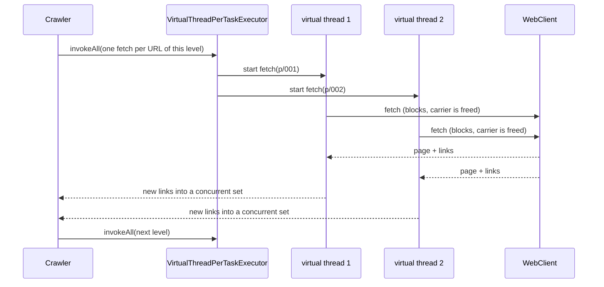
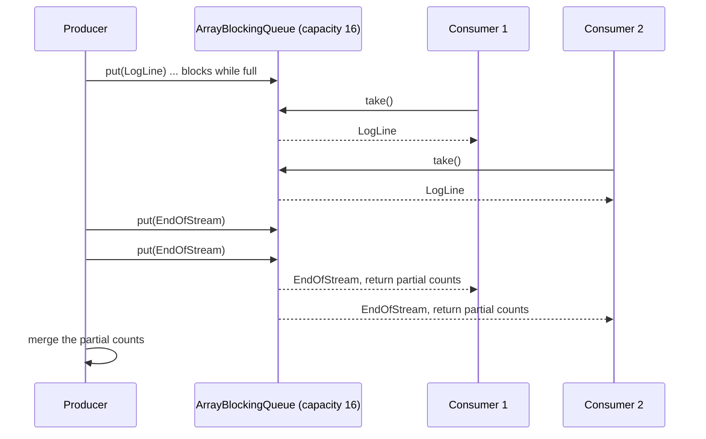
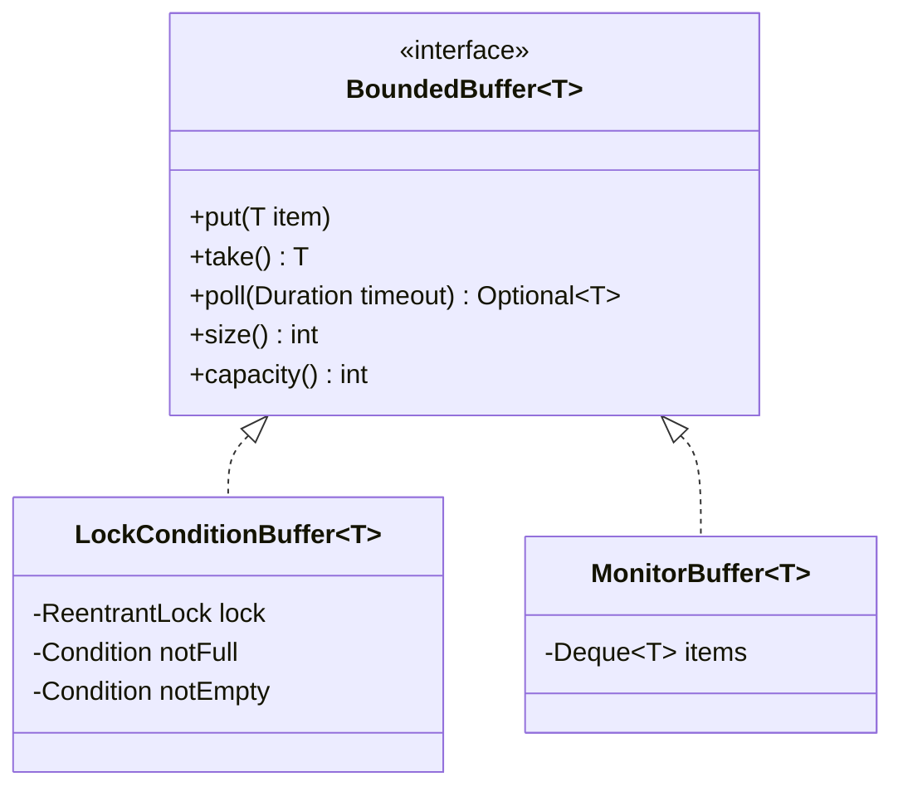
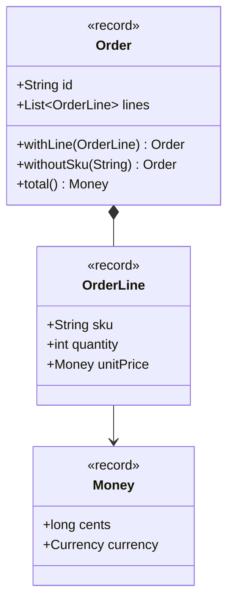
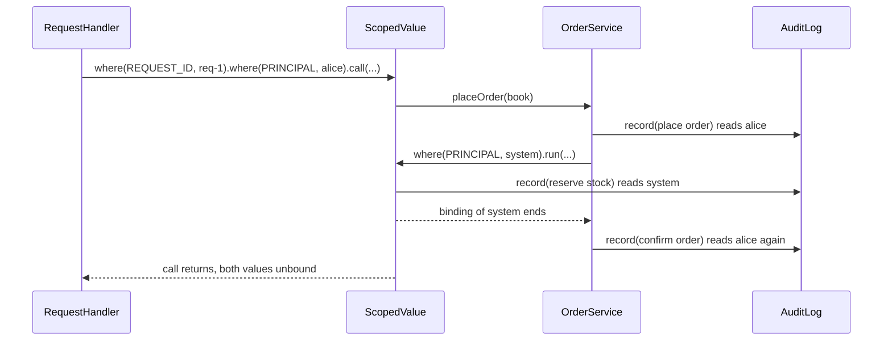
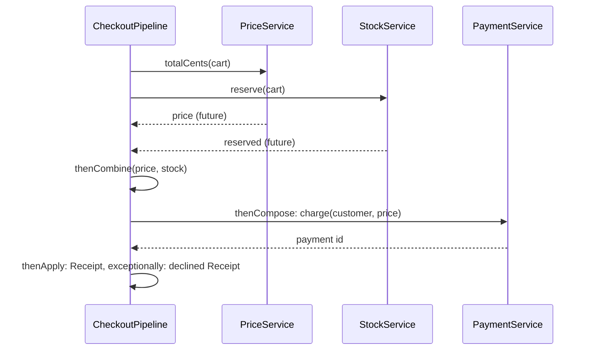
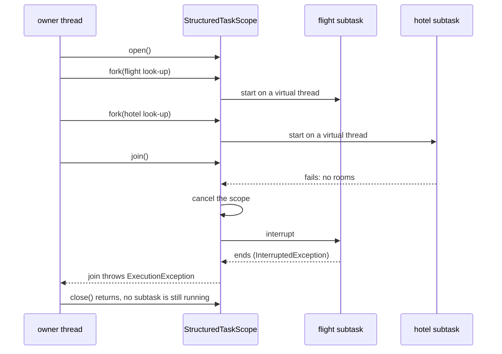

# Modül 10 — Eşzamanlılık Kalıpları

> **12. Hafta** · Ön koşullar: m09 (değişmezlik, record'lar, sealed sonuç tipleri), m07 (Observer, `Flow`), m06 (`Runnable`/`Callable` olarak Command nesneleri), m03 (Object Pool, `Semaphore` ile kısma), m00 (record'lar, sealed tipler, `switch` desenleri) · Tahmini çalışma süresi: 7 saat
>
> Her örneği derlemeden çalıştırın: `java modules/m10-concurrency-patterns/src/main/java/io/github/aliturgutbozkurt/patterns/m10/examples/<yol>/<Demo>.java` (JDK 27). Üç Structured Concurrency demosu bir **önizleme (preview)** API'si kullanır ve `java --enable-preview --source 27 <dosya>` gerektirir.

## Öğrenme çıktıları

Bu modülün sonunda şunları yapabilirsiniz:

1. Sanal iş parçacıkları (virtual thread) üzerindeki bloklayan kodun görev başına iş parçacığı (thread-per-task)
   modeliyle neden ölçeklendiğini **açıklamak**, bunu `Executors.newVirtualThreadPerTaskExecutor()` ve
   `Thread.ofVirtual()` ile **uygulamak** ve iş parçacıklarını havuzlamak yerine kıt kaynağı sınırlamaya **karar
   vermek**.
2. Geri basınçlı (back-pressure) ve tüketici başına bir zehirli hap (poison pill) kullanan, sınırlı bir
   `BlockingQueue` üzerinde Producer–Consumer (Üretici–Tüketici) kalıbını **uygulamak**; Guarded Suspension (Korumalı
   Bekletme) ve Balking (Vazgeçme) kalıplarını `ReentrantLock`/`Condition` ile ve `synchronized`/`wait`/`notifyAll` ile,
   her zaman bir `while` döngüsünde bekleyerek **uygulamak**.
3. Değişmez değer nesneleri **tasarlamak** ve değişen durumu, değişmez anlık görüntüler (snapshot) tutan bir
   `AtomicReference` üzerinden güvenle **yayınlamak**.
4. İstek bağlamını taşımak için `ScopedValue` **kullanmak** ve onu `ThreadLocal` ile **karşılaştırmak**.
5. Eşzamansız işleri `CompletableFuture` ile **birleştirmek** ve bunu Structured Concurrency (JDK 27'de önizleme) ile
   **karşılaştırmak**: fork, join, joiner'lar, iptal, son süreler.
6. Eşzamanlı kodu deterministik olarak **test etmek**: sleep yerine mandallar (latch), sınırlı beklemeler, enjekte
   edilen executor'lar ve zamanlama yerine değişmezler (invariant) üzerine doğrulamalar.

## Motivasyon

Şimdiye kadarki her kalıp tek bir iş parçacığında çalıştı. Gerçek programlar ise aynı anda pek çok iş yapar: bir
mağaza yüzlerce isteği yanıtlar, bir tarayıcı (crawler) sayfaları indirir, bir ödeme akışı fiyat, stok ve ödeme
servislerine sorar. Paylaşılan değiştirilebilir durum artı iş parçacıkları klasik hataları doğurur: kaybolan
güncellemeler, yarısı yazılmış nesneler, sonsuza dek bekleyen ya da hiç beklemeyen iş parçacıkları. Bu hatalar bin
çalıştırmada bir görünür; "benim makinemde çalıştı" hiçbir şey kanıtlamaz.

Bu haftanın kalıpları eşzamanlı kodu **yapısı gereği doğru** kılar. Her göreve kendi iş parçacığını verin ve kodu
sıralı tutun (thread-per-task). İşi sınırlı bir kuyruk üzerinden devredin (Producer–Consumer). Bir koşulu doğru
biçimde bekleyin ya da hemen reddedin (Guarded Suspension, Balking). Yalnızca değişemeyeni paylaşın (Immutable Object
(Değişmez Nesne)). Bağlamı küresel durum olmadan aktarın (Scoped Values). Bir grup alt göreve tek bir ömür, tek bir
son süre ve tek bir hata politikası verin (`CompletableFuture`, ardından Structured Concurrency). Son bölüm, tüm
bunların tek bir `sleep` olmadan nasıl *test edileceğini* gösterir.

## Sanal iş parçacıklarıyla görev başına iş parçacığı

### Problem

Bir tarayıcı, her biri 50 ms süren bloklayan bir ağ çağrısı olan 200 sayfayı indirmelidir. Sırayla bu 10 saniye
sürer. Platform iş parçacıklarından oluşan sabit bir havuz işe yarar, ama bloklanan her çağrı pahalı bir işletim
sistemi iş parçacığını tutar; havuz boyutu, aynı anda kaç çağrının bekleyebileceğini sınırlar. Alışılmış çözüm olan
geri çağırmalı (callback) eşzamansız kod ise programı okumayı, hata ayıklamayı ve profillemeyi zorlaştırır.

### Amaç

> Bağımsız her görevi kendi iş parçacığında çalıştırın ve görevi düz, bloklayan kod olarak yazın. Sanal iş
> parçacıklarında bloklanmış bir iş parçacığının maliyeti neredeyse sıfırdır; eşzamanlılığı bir havuz değil, işin
> kendisi sınırlar.

### Yapı



### Klasik Java

Klasik yanıt, platform iş parçacıklarından oluşan sabit bir havuzdur. Aşağıdaki iş yükü sınırı görünür kılar: her iş,
ancak belirli sayıda iş aynı anda çalışırken açılan bir kapıda bekler; böylece ölçülen tepe değeri "genellikle
aşağı yukarı doğru" değil, tam olarak doğrudur:

```java
// file: threadpertask/scaling/BlockingJob.java
    @Override
    public void run() {
        tracker.enter();
        try {
            gate.countDown();
            if (!gate.await(maxWait.toNanos(), TimeUnit.NANOSECONDS)) {   // bounded: never hangs
                throw new IllegalStateException("gate still closed after " + maxWait
                        + ": fewer jobs than expected were in flight together");
            }
        } catch (InterruptedException e) {
            Thread.currentThread().interrupt();
            throw new IllegalStateException("interrupted while waiting at the gate", e);
        } finally {
            tracker.exit();
        }
    }
```

```java
// file: threadpertask/scaling/Workloads.java
    public static Result runOnFixedPool(int threads, int tasks) {
        var tracker = new InFlightTracker();
        var gate = new CountDownLatch(Math.min(threads, tasks));    // opens when the pool is fully busy
        List<Future<?>> futures;
        try (var pool = Executors.newFixedThreadPool(threads, Thread.ofPlatform().name("worker-", 0).factory())) {
            futures = submitAll(pool, tasks, tracker, gate);
        }                                                           // close() waits for every task
        return result(tracker, futures);
    }
```

### Modern Java 27

Görev başına bir sanal iş parçacığı. Executor dışında kod aynıdır. Kapı artık 10 000 işin **tamamını** bekler ve
açılır; bu da hepsinin aynı anda çalışmakta olduğunu kanıtlar:

```java
// file: threadpertask/scaling/Workloads.java
    public static Result runThreadPerTask(int tasks) {
        var tracker = new InFlightTracker();
        var gate = new CountDownLatch(tasks);                       // opens only when ALL tasks are in flight
        List<Future<?>> futures;
        try (var executor = Executors.newVirtualThreadPerTaskExecutor()) {
            futures = submitAll(executor, tasks, tracker, gate);
        }
        return result(tracker, futures);
    }
```

```text
10000 blocking tasks on a fixed pool of 100 platform threads: completed 10000, peak in flight 100
10000 blocking tasks, one virtual thread each: completed 10000, peak in flight 10000
Thread.ofPlatform(): Facts[name=worker-0, virtual=false, daemon=false]
Thread.ofVirtual():  Facts[name=crawler-0, virtual=true, daemon=true]
unnamed virtual thread has name "": true
```

JDK 19'dan beri bir `ExecutorService` `AutoCloseable`'dır: `try` bloğundan çıkmak her görevi bekler, yani "tüm
görevler bitti" kodun biçiminin bir özelliğidir. Sanal iş parçacıkları her zaman daemon iş parçacığıdır, builder bir
ad vermedikçe adsızdır (`Thread.ofVirtual().name("crawler-", 0)` onları `crawler-0`, `crawler-1`, … diye adlandırır)
ve **asla havuzlanmamalıdır**: yenisini oluşturmak, birini ödünç almaktan daha ucuzdur.

Tarayıcı bu modeli gerçek bir işe uygular. Bir seviyedeki her URL, sıradan bloklayan kod içeren bir görevdir;
eşzamanlı bir küme (set), farklı görevlerin aynı anda bulduğu bağlantıları tekilleştirir:

```java
// file: threadpertask/crawler/Crawler.java
        for (int depth = 0; !level.isEmpty(); depth++) {
            boolean followLinks = depth < maxDepth;
            Queue<String> nextLevel = new ConcurrentLinkedQueue<>();
            List<Callable<Void>> fetches = new ArrayList<>();
            for (String url : level) {
                fetches.add(() -> {                         // one task (one virtual thread) per URL
                    try {
                        Page page = client.fetch(url);      // blocking I/O, written as plain sequential code
                        visited.add(url);
                        if (followLinks) {
                            page.links().stream().filter(seen::add).forEach(nextLevel::add);
                        }
                    } catch (IOException e) {
                        failures.put(url, e.getMessage());
                    }
                    return null;
                });
            }
            for (Future<Void> fetch : executor.invokeAll(fetches)) {   // waits until the whole level is done
                rethrowUnexpected(fetch);
            }
            level = List.copyOf(nextLevel);
        }
```

```text
crawling 200 product pages, 50 ms latency each, one virtual thread per fetch
visited: 200 pages
first:   https://shop.example/p/000
last:    https://shop.example/p/199
failures: {https://shop.example/p/retired=404 Not Found: https://shop.example/p/retired}
every page fetched exactly once: true
```

Seviye seviye ilerlemek bilinçli bir seçimdir. Tamamen özyinelemeli bir tarama ("indir, sonra her yeni bağlantı için
bir görev başlat") bir sayfayı ilk hangi yoldan ulaşıldıysa o yolda görülmüş sayardı; derinliği, dolayısıyla derinlik
sınırının sonucu, zamanlamaya bağlı olurdu. Burada bir sayfanın derinliği her zaman en kısa bağlantı uzaklığıdır ve
rapor her çalıştırmada aynıdır.

### Gerçek dünyada kullanımı

Servlet kapsayıcıları ve framework'ler "istek başına bir sanal iş parçacığı" sunar (Tomcat, Jetty, Helidon Níma,
`spring.threads.virtual.enabled` ile Spring Boot). `java.net.http.HttpClient` ve JDBC sürücüleri bir sanal iş
parçacığını ucuza bloklar. **JDK 24'ten (JEP 491)** beri `synchronized`, bir sanal iş parçacığını taşıyıcısına
(carrier) artık *sabitlemez* (pinning): `synchronized` bir blok içinde bloklanan sanal iş parçacığı da taşıyıcıyı
serbest bırakır.

### Tuzaklar ve ne zaman KULLANILMAMALI

- **Sanal iş parçacıklarını havuzlamayın** ve bir iş parçacığı havuzunu hız sınırlayıcı olarak kullanmayın. Kıt
  kaynağın kendisini sınırlayın: m03'teki `ThrottledClient` (aşağı akış çağrısının çevresinde bir `Semaphore`) tam
  olarak budur ve burada tekrarlanmaz.
- Sanal iş parçacıkları CPU yoğun işi hızlandırmaz: çekirdek sayısı aynıdır. Hesaplama için paralel stream'ler ya da
  bir `ForkJoinPool` kullanın.
- Havuzlanmış 200 iş parçacığıyla sorun çıkarmayan `ThreadLocal` önbellekleri artık görev başına, belki milyonlarca
  kez bulunur (aşağıdaki Scoped Values bölümüne bakın).
- Yerel koddaki (JNI) ya da eski kütüphanelerdeki `Object.wait()` içindeki bloklanma hâlâ bir taşıyıcıyı meşgul
  edebilir.

### İlgili kalıplar

**Object Pool (Nesne Havuzu)** (m03), thread-per-task'ın iş parçacıkları için gereksiz kıldığı şeydir. **Command
(Komut)** (m06): her görev bir `Runnable`/`Callable` nesnesidir. Görevler birbirine veri devretmek zorunda kaldığında
sonraki adım **Producer–Consumer**'dır.

## Producer–Consumer

### Problem

Bir günlük (log) gönderici, satırları bir dosyadan ayrıştırıcıların sınıflandırabileceğinden çok daha hızlı okur.
Okuyucu her satırı sınırsız bir listeye verirse bellek, süreç çökene dek büyür ve aşırı yük o ana kadar görünmez
kalır. Tüketiciler ayrıca başka satır gelmeyeceğini güvenilir biçimde öğrenmelidir.

### Amaç

> İş üreten iş parçacıklarını işi tüketenlerden **sınırlı** bir kuyrukla ayırın. Dolu kuyruk üreticiyi bekletir
> (**geri basınç**); boş kuyruk tüketicileri bekletir; tüketici başına bir **zehirli hap** akışı sonlandırır.

### Yapı



### Klasik Java

Klasik biçim, nesnenin monitörüyle korunan, `wait`/`notifyAll` kullanan paylaşılan bir listedir. Bir sonraki
bölümdeki sınırlı tampon tam olarak budur; bitiş işareti olarak sihirli `"EOF"` değeri de alışılmış zehirli haptı.
Sihirli bir dize kırılgandır: gerçek bir günlük satırı onu içerebilir ve onu denetlemeyi unutan bir tüketici hiç
durmaz.

### Modern Java 27

`java.util.concurrent` tamponu hazır sunar (`ArrayBlockingQueue`: sınırlı, `put` ve `take` bekletir). Hap bir
**tip** olur; sealed mesaj üzerindeki bir `switch` onu unutamaz:

```java
// file: producerconsumer/logs/LogMessage.java
public sealed interface LogMessage {

    /** One line of the log file. */
    record LogLine(String text) implements LogMessage {
        public LogLine {
            Objects.requireNonNull(text, "text");
        }
    }

    /** The poison pill: "no more lines". Each consumer takes exactly one and stops. */
    record EndOfStream() implements LogMessage {}
}
```

Üretici çağıran iş parçacığında, tüketiciler sanal iş parçacıklarında çalışır. Her tüketici özel bir haritaya sayar,
bu yüzden kilit gerekmez; kısmi sayımlar, `close()` her tüketiciyi bekledikten sonra birleştirilir:

```java
// file: producerconsumer/logs/LogIngestion.java
    public LevelCounts ingest(Iterable<String> lines) throws InterruptedException {
        List<Future<LevelCounts>> results = new ArrayList<>();
        try (var executor = Executors.newThreadPerTaskExecutor(threadFactory)) {
            for (int i = 0; i < consumers; i++) {
                results.add(executor.submit(this::consume));
            }
            for (String line : lines) {
                queue.put(new LogMessage.LogLine(line));     // blocks while the queue is full: back-pressure
            }
            for (int i = 0; i < consumers; i++) {
                queue.put(new LogMessage.EndOfStream());      // one pill per consumer
            }
        }                                                     // close() waits until every consumer has stopped
// ...
    private LevelCounts consume() throws InterruptedException {
        Map<Level, Long> tally = new EnumMap<>(Level.class);    // private to this consumer: no locking
        while (true) {
            switch (queue.take()) {
                case LogMessage.LogLine(String text) -> tally.merge(Level.of(text), 1L, Long::sum);
                case LogMessage.EndOfStream() -> {
                    return LevelCounts.fromTally(tally);
                }
            }
        }
    }
```

```text
1 producer, 4 consumers, queue capacity 16, 10000 lines
{ERROR=500, WARN=1500, INFO=6000, DEBUG=1500, UNPARSEABLE=500}
every line counted once: true
same as a sequential count: true
```

Hangi tüketicinin hangi satırı saydığı her çalıştırmada değişir; birleştirilmiş sonuç asla değişmez. Testler tam
olarak bunu denetler (1, 2 ve 8 tüketici için sıralı bir sayımla aynı sonuç); ölçüm yapan bir kuyruk da boyutunun
kapasiteyi hiç aşmadığını ve her tüketicinin tam olarak bir hap aldığını kanıtlar.

### Çok aşamalı hatlar

Kuyrukları zincirlemek bir hat (pipeline) verir: `pick → pack → ship`; her aşama bir kuyruğun tüketicisi ve bir
sonrakinin üreticisidir. Kapatma aşama aşama ilerler: bir aşama hapı, ancak önündeki her şey bittiğinde iletir.

```java
// file: producerconsumer/fulfilment/FulfilmentPipeline.java
                switch (in.take()) {
                    case Parcel.InTransit(Order order, List<String> log) -> {
                        stage.process(order);
                        List<String> next = new ArrayList<>(log);
                        next.add(name);
                        out.accept(new Parcel.InTransit(order, next));
                    }
                    case Parcel.EndOfOrders pill -> {
                        shutdownLog.add(name + " drained");  // everything before the pill is done
                        out.accept(pill);                    // forward exactly one pill downstream
                        return;
                    }
                }
```

Demo, sevk (ship) aşamasını bir mandalla durdurur. Kuyruk başına bir yuva ile tam olarak 6 sipariş sığar (3 kuyruk +
her biri bir sipariş tutan 3 aşama), bu yüzden 7. `trySubmit` her seferinde başarısız olur. Geri basınç son aşamadan
üreticiye kadar ulaştı:

```text
pipeline pick -> pack -> ship, 1 slot per queue, ship stage stalled
submitted orders 1..6: every queue and every stage now holds one order
trySubmit(order 7, 50 ms) -> false (back-pressure reached the producer)
ship stage resumes
submit(order 7) -> accepted
shutdown: [pick drained, pack drained, ship drained]
Shipment[orderId=1, stageLog=[pick, pack, ship]]
Shipment[orderId=2, stageLog=[pick, pack, ship]]
Shipment[orderId=3, stageLog=[pick, pack, ship]]
Shipment[orderId=4, stageLog=[pick, pack, ship]]
Shipment[orderId=5, stageLog=[pick, pack, ship]]
Shipment[orderId=6, stageLog=[pick, pack, ship]]
Shipment[orderId=7, stageLog=[pick, pack, ship]]
```

### Gerçek dünyada kullanımı

`ThreadPoolExecutor` bir Producer–Consumer'dır: `execute` bir `BlockingQueue<Runnable>`'a üretir, çalışan iş
parçacıkları tüketir. Günlükleme framework'lerinin eşzamansız ekleyicileri (Log4j 2, Logback), Kafka ve RabbitMQ
tüketicileri ve `Flow`/Reactive Streams (m07, bekletme yerine taleple) aynı fikri izler.

### Tuzaklar ve ne zaman KULLANILMAMALI

- **Sınırsız** bir kuyruk (kapasitesiz `LinkedBlockingQueue()`, `Executors.newFixedThreadPool`'un kuyruğu) aşırı
  yükü bellek bitene dek gizler. Kapasiteyi bilinçli seçin.
- N tüketici için tek bir hap yalnızca birini durdurur; son öğeden *sonra* tüketici başına bir hap gönderin.
- Bir istisnayla ölen tüketici, üreticiyi dolu bir kuyrukta bekletir. Tüketicileri sağlam yapın (günlük tüketicisi
  bozuk satırları fırlatmak yerine `UNPARSEABLE` olarak sayar) ve üreticiye bir zaman aşımı verin (`offer`).
- Düz bir bloklayan kuyruk, kapatma anında zaten bekleyen bir üreticiyi serbest bırakamaz (ex02 bunun nedenini
  gösterir ve koşullarla çözer).

### İlgili kalıplar

`put` ve `take` **Guarded Suspension** ile bekler. **`Flow` ile Observer (Gözlemci)** (m07) bekletmenin yerine talebi
koyar. **Command** (m06): kuyruğa alınan öğeler çoğu zaman komut nesneleridir.

## Guarded Suspension ve Balking

### Problem

Bir iş parçacığı, yalnızca belirli bir durumda mümkün olan bir şey yapmak ister: boş bir tampondan almak, önbellek
ısınmadan bir isteği yanıtlamak, başka bir kayıt sürerken yeni bir kayıt başlatmak. Bir döngüde `sleep` ile yoklamak
CPU israf eder ve geç tepki verir. Yine de harekete geçmek durumu bozar.

### Amaç

> **Guarded Suspension:** ön koşul (*koruma koşulu*, guard) sağlanmıyorsa, başka bir iş parçacığı onu doğru kılana
> dek iş parçacığını askıya alın ve her uyanıştan sonra yeniden denetleyin. **Balking:** ön koşul sağlanmıyorsa hemen
> dönün ve hiçbir şey yapmayın, çünkü beklemek anlamsız olurdu.

### Yapı



### Klasik Java

Nesnenin kendi monitörü: `synchronized`, `wait()` ve `notifyAll()`. Koruma koşulu bir `while` döngüsü olmalıdır.
Uyanan bir iş parçacığı koşulu yeniden yanlış bulabilir: başka bir iş parçacığı daha hızlı davranmıştır (*çalınmış*
koşul) ya da JVM iş parçacıklarını sebepsiz uyandırabilir (*sahte uyanma*, spurious wake-up):

```java
// file: guarded/buffer/MonitorBuffer.java
    @Override
    public synchronized void put(T item) throws InterruptedException {
        Objects.requireNonNull(item, "item");
        while (items.size() == capacity) {          // re-check after every wake-up (spurious or stolen)
            wait();
        }
        items.addLast(item);
        notifyAll();
    }

    @Override
    public synchronized T take() throws InterruptedException {
        while (items.isEmpty()) {
            wait();
        }
        T item = items.removeFirst();
        notifyAll();
        return item;
    }
```

Bir monitörün tek bir bekleme kümesi vardır; üreticiler ve tüketiciler birlikte bekler ve her değişiklik hepsini
uyandırmalıdır. `notify()` bir tüketici gerekirken bir üreticiyi uyandırabilir ve sinyal kaybolur.

### Modern Java 27

İki adlandırılmış `Condition` içeren bir `ReentrantLock`, her iş parçacığı türüne kendi bekleme kümesini verir;
`signal()` doğru türden tam olarak bir iş parçacığını uyandırır. Beklemeler kesilebilir ve süreli olabilir:

```java
// file: guarded/buffer/LockConditionBuffer.java
    @Override
    public void put(T item) throws InterruptedException {
        Objects.requireNonNull(item, "item");
        lock.lockInterruptibly();
        try {
            while (items.size() == capacity) {      // guard: while, never if
                notFull.await();
            }
            items.addLast(item);
            notEmpty.signal();                      // wake one consumer: only consumers wait on notEmpty
        } finally {
            lock.unlock();
        }
    }
// ...
    @Override
    public Optional<T> poll(Duration timeout) throws InterruptedException {
        long nanos = timeout.toNanos();
        lock.lockInterruptibly();
        try {
            while (items.isEmpty()) {
                if (nanos <= 0) {
                    return Optional.empty();
                }
                nanos = notEmpty.awaitNanos(nanos); // returns the time that is left
            }
            return Optional.of(removeFirst());
        } finally {
            lock.unlock();
        }
    }
```

```text
LockConditionBuffer, capacity 2: writer stored [r1, r2, r3, r4, r5, r6, r7, r8]
MonitorBuffer, capacity 2: writer stored [r1, r2, r3, r4, r5, r6, r7, r8]
poll(50 ms) on an empty buffer: Optional.empty
```

İki uygulama da tek bir ortak soyut testi geçer (FIFO, bekleten `take`/`put`, kesilebilir beklemeler, sonunda eşit bir
çoklu küme ile 8 üretici × 8 tüketici × 1 000 öğe). JEP 491'den beri `synchronized` ve `wait()` sanal iş
parçacıklarını sabitlemediği için seçim, sanal iş parçacığı performansıyla değil, ifade gücüyle (birden çok koşul,
süreli ve kesilebilir kilit alma) ilgilidir.

### Bir durumu korumak

Koruma koşulunun bir tamponla ilgili olması gerekmez. Önbelleğini ısıtan bir servis, erken gelen istekleri
başarısız kılmak yerine onları bir `ReadinessGate` önünde *bekletir*. Başarısız bir başlangıç, her bekleyeni nedeniyle
birlikte uyandırır; hiçbir istek asılı kalmaz:

```java
// file: guarded/gate/ReadinessGate.java
    public boolean awaitReady(Duration timeout) throws InterruptedException {
        long nanos = timeout.toNanos();
        lock.lockInterruptibly();
        try {
            while (state == State.STARTING) {           // the guard
                if (nanos <= 0) {
                    return false;
                }
                nanos = settled.awaitNanos(nanos);
            }
            if (state == State.FAILED) {
                throw new IllegalStateException("service failed to start", failure);
            }
            return true;
        } finally {
            lock.unlock();
        }
    }
```

```text
3 requests started before the cache was warm
warm-up finished: READY
GET apple -> Optional[1.20 EUR]
GET bread -> Optional[2.50 EUR]
GET milk -> Optional[0.99 EUR]
awaitReady(50 ms) while STARTING: false
failed start-up: IllegalStateException: service failed to start, cause: price database unreachable
```

### Balking

Bir düzenleyici birkaç saniyede bir otomatik kaydeder. Hiçbir şey değişmediyse ya da bir kayıt hâlâ sürüyorsa doğru
tepki **hemen dönmektir**; süren kayıt ya da bir sonraki tetikleme işi yapacaktır. Bir `AtomicBoolean` "kimin
kaydedeceğine" kilitsiz karar verir; sürüm numaraları kirliyi temizden ayırır, böylece bir kayıt *sırasında* yapılan
düzenleme belgeyi kirli bırakır:

```java
// file: guarded/balking/AutoSavingDocument.java
    public SaveResult save() {
        if (!isDirty()) {
            return SaveResult.SKIPPED_CLEAN;                    // balk: nothing to do
        }
        if (!saving.compareAndSet(false, true)) {
            return SaveResult.SKIPPED_IN_PROGRESS;              // balk: someone else is saving right now
        }
        try {
            Snapshot snapshot = current.get();
            if (snapshot.version() == savedVersion.get()) {
                return SaveResult.SKIPPED_CLEAN;                // a save finished between the two checks
            }
            store.write(snapshot.version(), snapshot.text());
            savedVersion.set(snapshot.version());               // an edit made meanwhile has a higher version
            return SaveResult.SAVED;
        } finally {
            saving.set(false);
        }
    }
```

```text
save() on a new document -> SKIPPED_CLEAN
edit, save() -> SAVED
save() again -> SKIPPED_CLEAN
edit; auto-save #1 is now writing (the store is slow)
save() while #1 writes -> SKIPPED_IN_PROGRESS
edit while #1 writes
auto-save #1 -> SAVED, still dirty: true
save() -> SAVED
store received: [v1: Dear team,, v2: Dear team, the release is on Friday., v3: Dear team, the release is on Friday. Thanks!]
```

`compareAndSet`'i kazandıktan sonraki yeniden denetim önemlidir: o olmadan, kirli tek bir belge üzerindeki 100
eşzamanlı `save()` çağrısı iki kez yazabilirdi (bir kayıt biter, sonraki bayrağı kazanır ve aynı sürümü yeniden
yazar). Test tam olarak tek bir yazımı doğrular.

### Gerçek dünyada kullanımı

`ArrayBlockingQueue`, `CountDownLatch`, `Semaphore` ve `FutureTask.get()` JDK içindeki Guarded Suspension
örnekleridir. `Thread.start()` vazgeçer (balk): ikinci çağrıda istisna fırlatır. `shutdown()` sonrası
`ExecutorService.execute` ve `ReentrantLock.tryLock()` "hemen reddet" örnekleridir. Uygulamalarda: hazır olma
denetimleri (readiness probe), bağlantı ısıtma, "aynı anda yalnızca bir yenileme" yapan önbellekler.

### Tuzaklar ve ne zaman KULLANILMAMALI

- `if (!condition) wait();` bir hatadır: her zaman `while`.
- *Başka* bir kilidi tutarken beklemek kilitlenmeye (deadlock) davetiyedir; yalnızca koşulu koruyan kilit üzerinde
  bekleyin.
- Üretim kodundaki her bekleme "karşı taraf ölürse beni ne uyandırır?" sorusuna bir yanıt ister (bir zaman aşımı,
  `FAILED` gibi bir hata durumu ya da koruma koşulunda bir kapatma bayrağı).
- Çağıranın sonuca gerçekten ihtiyacı varsa vazgeçmeyin; bunun yerine zaman aşımıyla askıya alın.

### İlgili kalıplar

**Producer–Consumer** iki korumalı işlemden kurulur. **State (Durum)** (m08) korunan durumları açık hâle getirir.
**Object Pool** (m03): tükenmiş bir havuzda `acquire`, zaman aşımlı bir Guarded Suspension'dır.

## Immutable Object

### Problem

Bir siparişi web iş parçacığı, fatura iş parçacığı ve e-posta iş parçacığı okur. Değiştirilebilir bir JavaBean ile her
okuyucunun bir kilide ihtiyacı vardır, her getter kopyalamak zorundadır ve `getLines()`'ın döndürdüğü listeyi
değiştiren bir çağıran, siparişi herkesin arkasından değiştirir. Alan alan güncellenen bir yapılandırma yarı yazılmış
hâlde gözlemlenebilir: yeni en küçük havuz boyutu ile eski en büyük değer bir arada.

### Amaç

> Durumu oluşturulduktan sonra değişemeyen nesneler yapın. Bunlar kilitsiz olarak istenen sayıda iş parçacığıyla
> paylaşılabilir; bir "değişiklik" yeni bir nesne oluşturur ve tek bir atomik referans değişimi onu yayınlar.

### Yapı



### Klasik Java

Değişmez bir sınıfın kuralları şunlardı: `final` sınıf, `private final` alanlar, setter yok, değiştirilebilir giriş
ve çıkışların savunmacı kopyaları ve kurucudan `this` sızdırmamak. Aşağıdaki bean hepsini çiğner; demo sonucu
gösterir:

```java
// file: immutable/order/MutableOrder.java
    /** Returns the internal list itself: the bug this class exists to show. */
    public List<OrderLine> getLines() {
        return lines;
    }

    /** Stores the caller's list itself: the caller can still change it afterwards. */
    public void setLines(List<OrderLine> lines) {
        this.lines = lines;
    }
```

### Modern Java 27

Bir record final alanlar, erişimciler, `equals`/`hashCode` verir ve setter içermez. Kompakt kurucu doğrulamayı ve
kopyalamayı tek bir yerde yapar; `List.copyOf` savunmacı kopyadır ve listeyi tek çağrıda değiştirilemez kılar.
Wither'lar yeni örnekler döndürür:

```java
// file: immutable/order/Order.java
public record Order(String id, List<OrderLine> lines) {

    public Order {
        if (id == null || id.isBlank()) {
            throw new IllegalArgumentException("id must not be blank");
        }
        lines = List.copyOf(lines);                 // defensive copy + unmodifiable, in one call
        if (lines.isEmpty()) {
            throw new IllegalArgumentException("order " + id + " needs at least one line");
        }
// ...
    /** A new order with {@code line} appended; this order is unchanged. */
    public Order withLine(OrderLine line) {
        List<OrderLine> next = new ArrayList<>(lines);
        next.add(line);
        return new Order(id, next);
    }
```

```text
order A-1: 3 lines, total 57.50 EUR
withLine(pen) -> new order: 4 lines, total 60.00 EUR; original: 3 lines, total 57.50 EUR
withoutSku(book) -> 2 lines; original unchanged: true
source list changed after construction -> order still has 3 lines
lines().add(...) -> UnsupportedOperationException
new OrderLine("pen", -1, ...) -> quantity must be positive: -1
EUR line + USD line -> mixed currencies in order A-2: EUR and USD
1000 virtual threads read A-1 while others derive new orders -> all totals consistent: true
MutableOrder: a caller added to getLines() -> the bean now has 4 lines, no setter was called
```

Neden kilit gerekmez: Java bellek modeli, bir nesneye referansı gören iş parçacığının o nesnenin `final` alanlarının
değerlerini kurucunun sonundaki hâliyle de gördüğünü garanti eder. Record bileşenleri final'dır ve arkalarındaki liste
asla değişemez.

### Yazarken kopyalama ile yayınlama

Sıcak yeniden yüklenen yapılandırma gibi *gerçekten* değişen durum, değişmez anlık görüntülerin bir dizisi olarak
tutulur. Bir `AtomicReference` her zaman tam bir anlık görüntüyü gösterir; okuyucular eskisini ya da yenisini alır,
asla bir karışımını değil:

```java
// file: immutable/config/LiveConfig.java
    /** The snapshot in force right now. Keep using the returned object: it will never change. */
    public ConfigSnapshot current() {
        return current.get();
    }

    /**
     * Applies {@code change} atomically and returns the new snapshot. {@code change} may run more than once under
     * contention, so it must be a pure function of its argument. If it throws, nothing is changed.
     */
    public ConfigSnapshot update(UnaryOperator<ConfigSnapshot> change) {
        return current.updateAndGet(change);
    }
```

```text
v1: pool 5..20, flags {checkout.v2=off, search.fuzzy=on}
v2: pool 10..40, flags {checkout.v2=off, search.fuzzy=on}
v3: pool 10..40, flags {checkout.v2=on, search.fuzzy=on}
flags().put(...) -> UnsupportedOperationException
pool 50..40 rejected: minConnections 50 > maxConnections 40; current is still v3
16 writers x 1000 updates on virtual threads -> v16003 (no update lost)
```

`updateAndGet` bir compare-and-set döngüsüdür: çekişme olduğunda fonksiyonu daha yeni anlık görüntüyle yeniden çağırır;
fonksiyonun saf olması (yan etkisiz, aynı girişe aynı çıkış) bu yüzden gerekir. Test 16 × 1 000 artırma çalıştırır ve
tam olarak 16 000 bekler; okuyucular ise yalnızca yırtık bir okumanın (torn read) bozabileceği bir kuralı
(`max == 2 × min`) denetler.

### Gerçek dünyada kullanımı

`String`, `java.time` (`LocalDate`, `Instant`), `BigDecimal`, `List.of`/`Map.of` ve her record. Yazarken kopyalama
(copy-on-write): `CopyOnWriteArrayList`, `String.replace`, fonksiyonel dillerdeki kalıcı koleksiyonlar, Git
commit'leri.

### Tuzaklar ve ne zaman KULLANILMAMALI

- "Yüzeysel" değişmezlik: bir `ArrayList` tutan record, kompakt kurucu onu kopyalamadıkça değiştirilebilirdir.
- Diziler değişmez yapılamaz; içeri ve dışarı kopyalayın ya da `List` kullanın.
- Küçük adımlarla değişen çok büyük nesneler bol çöp üretir; o zaman tek kilitli, iyi kapsüllenmiş değiştirilebilir bir
  nesne daha iyi bir tasarım olabilir.
- Bir kurucudan `this`'in sızmasına asla izin vermeyin (dinleyici kaydetmek, iş parçacığı başlatmak): diğer iş
  parçacıkları yarı kurulmuş bir nesne görebilir.

### İlgili kalıplar

**Value Object** ve record'lar (m00, m09). **Prototype (Prototip)** (m03) değişmez durumla çok daha basittir:
kopyalamak paylaşmaya dönüşür. **Memento (Hatıra)** (m07): anlık görüntüler değişmez memento'lardır. **Flyweight
(Sinek Siklet)** (m05) değişmez içsel durum gerektirir.

## Scoped Values

### Problem

Çağrı zincirinin derinlerindeki denetim günlüğü, geçerli kullanıcıya ve istek kimliğine ihtiyaç duyar. Bunları her
katmandan parametre olarak geçirmek her imzayı kirletir. Klasik kestirme olan `ThreadLocal` değiştirilebilirdir, iş
parçacığı kadar yaşar ve `remove()` ile temizlenmelidir. Havuzlanmış bir iş parçacığında bunu unutursanız, sonraki
istek önceki kullanıcı olarak çalışır.

### Amaç

> Değişmez bir değeri bir çağrının dinamik kapsamı boyunca bağlayın (`ScopedValue.where(KEY, value).call(...)`):
> içeride çalışan her şey ve içeride başlatılan yapılandırılmış alt görevler onu okuyabilir; dışarıdaki hiçbir şey
> okuyamaz ve hiçbir şey onu değiştiremez.

### Yapı



### Klasik Java

```java
// file: scopedvalue/threadlocal/ContextLeaks.java
    public static String secondTaskSeesWithoutRemove() throws InterruptedException, ExecutionException {
        var context = new ThreadLocalContext();
        try (var pool = Executors.newSingleThreadExecutor()) {
            pool.submit(() -> context.set("alice")).get();         // request of alice, no cleanup
            return pool.submit(context::get).get();                // request of someone else
        }
    }
```

```text
ThreadLocal, 1-thread pool, no remove(): task 2 sees user = alice   <- leaked from task 1
ThreadLocal, 1-thread pool, remove() in finally: task 2 sees user = null
InheritableThreadLocal in a child virtual thread: alice
ThreadLocal in a child virtual thread: null
ScopedValue bound in the parent, read in a newVirtualThreadPerTaskExecutor task: bound = false
ScopedValue bound in the parent, read in a raw Thread.ofVirtual() thread: bound = false
ScopedValue after run() returned: bound = false
```

Tek iş parçacıklı bir havuz sızıntıyı deterministik yapar: 2. görev, 1. görevin kirli bıraktığı iş parçacığında
çalışır. `InheritableThreadLocal` daha da ileri gider ve değeri her alt iş parçacığına *kopyalar*; milyonlarca sanal
iş parçacığıyla belleği katlar.

### Modern Java 27

Kapsamlı değerler (scoped value) JDK 25'ten beri kesinleşmiştir (JEP 506). Anahtar değişmez bir sabittir; bağlama
yalnızca `call`/`run` süresince vardır:

```java
// file: scopedvalue/request/RequestContext.java
    /** Who is calling. */
    public static final ScopedValue<Principal> PRINCIPAL = ScopedValue.newInstance();

    /** Correlation id of the current request. */
    public static final ScopedValue<String> REQUEST_ID = ScopedValue.newInstance();
```

```java
// file: scopedvalue/request/RequestHandler.java
    public <T, X extends Throwable> T handle(String requestId, Principal principal,
            ScopedValue.CallableOp<T, X> work) throws X {
        return ScopedValue.where(RequestContext.REQUEST_ID, requestId)
                .where(RequestContext.PRINCIPAL, principal)
                .call(work);                     // unbound again when call returns, even on an exception
    }
```

İç içe bir `where`, bir değeri yalnızca bir blok için yeniden bağlar ("sistem olarak çalış"); ardından dıştaki değer
geri gelir:

```java
// file: scopedvalue/request/OrderService.java
    public String placeOrder(String item) {
        audit.record("place order " + item);
        ScopedValue.where(RequestContext.PRINCIPAL, Principal.SYSTEM)       // rebind for this block only
                .run(() -> audit.record("reserve stock for " + item));
        audit.record("confirm order " + item);                             // the outer principal again
        return "order for " + item + " placed by " + RequestContext.PRINCIPAL.get().name();
    }
```

```text
req-1 | alice  | place order book
req-1 | system | reserve stock for book
req-1 | alice  | confirm order book
req-2 | bob    | place order mug
req-2 | system | reserve stock for mug
req-2 | bob    | confirm order mug
req-3 | carol  | place order pen
req-3 | system | reserve stock for pen
req-3 | carol  | confirm order pen
after the requests: PRINCIPAL bound? false
PRINCIPAL.get() outside a request -> NoSuchElementException
PRINCIPAL.orElse(ANONYMOUS) -> anonymous
```

`CallableOp<T, X>`, işin denetlenen (checked) istisnasının `call` içinden kendi tipiyle geçmesini sağlar. Test, sanal
iş parçacıklarında 1 000 eşzamanlı istek çalıştırır ve her denetim kaydının kendi isteğinin kimliğini ve kullanıcısını
taşıdığını denetler.

### Gerçek dünyada kullanımı

Web framework'lerindeki istek bağlamı (geçerli kullanıcı, kiracı, iz kimliği), Spring ve Jakarta EE'deki işlem ve
güvenlik bağlamları (geleneksel olarak `ThreadLocal` tabanlı) ve MDC günlük bağlamı. Sanal iş parçacıkları ve
yapılandırılmış eşzamanlılıkla birlikte önerilen yerine geçen çözüm kapsamlı değerlerdir.

### Tuzaklar ve ne zaman KULLANILMAMALI

- Kapsamlı bir değer executor görevlerine ya da ham iş parçacıklarına **aktarılmaz**; yalnızca `StructuredTaskScope`
  alt görevlerine aktarılır. İşi bir executor'a veren kod değeri açıkça geçirmeli ya da yeniden bağlamalıdır.
- Salt okunurdur. İstek başına *değiştirilebilir* bir biriktirici (örneğin bir uyarı listesi) buraya ait değildir;
  eşzamanlı kullanım için tasarlanmış bir nesneyi bağlayın ya da veriyi döndürün.
- Metodun gerçek sözleşmesinin parçası olan parametrelerden kaçmak için kullanmayın. Bağlam, kesişen (cross-cutting)
  veridir.

### İlgili kalıplar

**Singleton (Tekil Nesne)** (m02): kapsamlı değerlerin bir çağrıya yerel kıldığı küresel durum. **Dependency
Injection (Bağımlılık Enjeksiyonu)** (m03): uzun ömürlü iş birlikçiler için açık alternatif. Aktarımın gerçekleştiği
yer **Structured Concurrency**'dir (aşağıda).

## CompletableFuture hatları

### Problem

Bir ödeme akışı bir fiyata ve bir stok rezervasyonuna (birbirinden bağımsız) ve ardından bir ödemeye (fiyata ihtiyaç
duyar) gerek duyar. Bunları sırayla çağırmak gecikmeleri toplar. Bir executor ile başlatıp `Future.get()` çağırmak her
adımda bir iş parçacığını bekletir; hatalar ve zaman aşımları `try`/`catch` blokları arasına dağılır.

### Amaç

> Eşzamansız işi aşamalardan oluşan bir hat olarak tanımlayın: bağımsız adımları eşzamanlı çalıştırın, bağımlı
> olanları zincirleyin, hataları ve son süreleri hattın parçası olarak ele alın; bunların hepsini bekletmeden yapın.

### Yapı



### Klasik Java

`ExecutorService.submit`'ten gelen bir `Future` yalnızca beklenebilir (`get`) ya da iptal edilebilir. Burada
`cancel(true)`'nun görevin iş parçacığını **kestiğine** dikkat edin, çünkü executor onu hangi iş parçacığının
çalıştırdığını bilir:

```java
// file: future/quotes/CancellationFacts.java
    public static Outcome cancelExecutorFuture(ExecutorService executor) throws InterruptedException {
        var started = new CountDownLatch(1);
        var finished = new CountDownLatch(1);
        var interrupted = new AtomicBoolean();
        Future<?> future = executor.submit(() -> {
            started.countDown();
            awaitRecordingInterrupt(new CountDownLatch(1), interrupted);   // never opened: only an interrupt ends it
            finished.countDown();
        });
        await(started);
        future.cancel(true);
        await(finished);
        return new Outcome(future.isCancelled(), interrupted.get());
    }
```

### Modern Java 27

```java
// file: future/checkout/CheckoutPipeline.java
    public CompletableFuture<Receipt> checkout(Cart cart) {
        CompletableFuture<Long> total = prices.totalCents(cart);          // both start right away
        CompletableFuture<Void> reserved = stock.reserve(cart);
        return total
                .thenCombine(reserved, (cents, _) -> cents)                 // wait for both independent results
                .thenComposeAsync(cents -> payments.charge(cart.customer(), cents)   // dependent async step
                        .thenApply(paymentId -> Receipt.approved(cart.customer(), cents, paymentId)), executor)
                .exceptionally(failure -> Receipt.declined(cart.customer(), unwrap(failure).getMessage()));
    }

    /** A dependent stage sees the original exception wrapped in a {@link CompletionException}. */
    private static Throwable unwrap(Throwable failure) {
        return failure instanceof CompletionException && failure.getCause() != null ? failure.getCause() : failure;
    }
```

`thenApply` bir değeri dönüştürür; `thenCompose` kendisi bir future döndüren bir fonksiyon içindir (`flatMap` gibi),
böylece sonuç iç içe bir `CompletableFuture<CompletableFuture<…>>` değil `CompletableFuture<Receipt>` olur. Bağımlı
bir aşamadaki hata bir `CompletionException` içine sarılmış olarak gelir; `join()` onu, `get()` ise bir
`ExecutionException` fırlatır. Enjekte edilen executor hattı test edilebilir kılar: `Runnable::run` ile her şey
`checkout` içinde eşzamanlı gerçekleşir ve sanal iş parçacıklarındaki aynı kod aynı fişi verir:

```text
alice: Receipt[customer=alice, status=APPROVED, totalCents=2250, detail=payment pay-1]
bob:   Receipt[customer=bob, status=DECLINED, totalCents=0, detail=out of stock: mug]
carol: Receipt[customer=carol, status=DECLINED, totalCents=0, detail=card declined: 120.00 exceeds limit]
payment service called 2 times (never for bob)
done when checkout() returned (Runnable::run): true
same receipt for alice on virtual threads: true
```

### Dağıtma, toplama ve son süreler

`allOf` birçok future'ı bekler; sonuçları ardından **giriş sırasıyla** okumak, hangi sırayla bittiklerinden bağımsız
olarak çıktıyı deterministik tutar. `completeOnTimeout` geciken bir future'ın yerine bir değer koyar; `orTimeout` onu
bir `TimeoutException` ile başarısız kılar:

```java
// file: future/quotes/QuoteFanOut.java
    public CompletableFuture<List<Quote>> all(List<Supplier<Quote>> providers, Duration perQuoteDeadline,
            Quote fallback) {
        List<CompletableFuture<Quote>> quotes = providers.stream()
                .map(provider -> CompletableFuture.supplyAsync(provider, executor)
                        .completeOnTimeout(fallback, perQuoteDeadline.toNanos(), TimeUnit.NANOSECONDS))
                .toList();
        return inInputOrder(quotes);
    }
// ...
    private static CompletableFuture<List<Quote>> inInputOrder(List<CompletableFuture<Quote>> quotes) {
        return CompletableFuture.allOf(quotes.toArray(CompletableFuture[]::new))
                .thenApply(_ -> quotes.stream().map(CompletableFuture::join).toList());   // all done: join is safe
    }
```

```text
completeOnTimeout(50 ms) per quote, input order: [acme 120.00, globex 99.00, slowco FALLBACK]
orTimeout(50 ms) on the fan-out: CompletionException caused by TimeoutException
allOf after one provider failed: done = false (still waiting for the slow sibling)
allOf once the sibling finished: completed exceptionally = true
CompletableFuture.cancel(true): cancelled = true, task interrupted = false
ExecutorService Future.cancel(true): cancelled = true, task interrupted = true
```

Son dört satır, bir sonraki bölümü gerekli kılan sınırlardır. `allOf`, bir sağlayıcı başarısız olduğunda vazgeçmez;
yavaş kardeşi beklemeyi sürdürür. Zaman aşımına uğrayan bir tedarikçi arka planda çalışmayı sürdürür. Bir
`CompletableFuture` üzerinde `cancel(true)` yalnızca future'ı tamamlar: görev kesilmez, çünkü future onu hangi iş
parçacığının çalıştırdığını bilmez. Alt görevlerin ömrünü onları başlatan işleme bağlayan hiçbir şey yoktur.

### Gerçek dünyada kullanımı

`HttpClient.sendAsync`, Spring'in `@Async` ve WebClient adaptörleri, reaktif kütüphanelerin `toFuture()` metotları ve
çoğu eşzamansız SDK (bulut depolama, veritabanları) `CompletableFuture` döndürür.

### Tuzaklar ve ne zaman KULLANILMAMALI

- Açık bir executor olmadan `*Async` metotları `ForkJoinPool.commonPool()` kullanır: oradaki bloklayan çağrılar havuzun
  tüm diğer kullanıcılarını aç bırakır. Bir executor enjekte edin.
- `exceptionally` sizin istisnanızı değil, `CompletionException`'ı görür; onu açın.
- Uzun lambda hatlarında hata ayıklamak ve yığın izini okumak zordur. Sanal iş parçacıklarıyla düz bloklayan kod çoğu
  zaman daha basittir.
- İptal ve zaman aşımları alttaki işi durdurmaz (yukarıya bakın).

### İlgili kalıplar

Tek bir sonuç yerine değer akışları için **Observer/`Flow`** (m07). **Command** (m06): her aşama bir fonksiyon
nesnesidir. Ömrü ve iptali **Structured Concurrency** düzeltir.

## Structured Concurrency

> ⚠️ **JDK 27'de önizleme (preview) API'si (JEP 533, 7. önizleme).** API kesinleşmeden önce hâlâ değişebilir. Kod
> yalnızca `…m10.examples.structured` paketinde bulunur; bu modül `--enable-preview` ile derlenir ve test edilir.
> Demoları `java --enable-preview --source 27 <dosya>.java` ile çalıştırın. Bayrak olmadan kaynak kod başlatıcı
> *"StructuredTaskScope is a preview API and is disabled by default."* iletisiyle durur. Ödevler bu API'yi kullanmaz.

### Problem

Bir seyahat planı bir uçuşa, bir otele ve hava durumu tahminine ihtiyaç duyar. Otel servisi başarısız olursa uçuş
araması hâlâ sürmektedir ve yanıtını kimse okumayacaktır. Kullanıcı vazgeçerse üçü de çalışmayı sürdürür. Executor'lar
ve future'larla alt görevler onları başlatan metottan uzun yaşayabilir: ortada bir yapı yoktur.

### Amaç

> Bir grup eşzamanlı alt görevi bir blok içinde **tek bir iş birimi** olarak ele alın: alt görevler bloktan uzun
> yaşayamaz, bir hata ya da zaman aşımı kardeşleri iptal eder ve blok ancak hepsi bittiğinde sona erer.

### Yapı



### Klasik Java

Yapılandırılmış eşzamanlılıktan önce en yakın araçlar `invokeAll` (hepsini görev sırasıyla bekle, isteğe bağlı olarak
geri kalanları iptal eden bir zaman aşımıyla) ve `ExecutorCompletionService` (bitiş sırasıyla sonuçlar; ilk hata
hemen görülebilir) idi. Ödev 01, tam olarak bu ikisinden ilk hatada duran, son süreye bağlı bir karşılaştırma kurar;
bu, aşağıdaki sürümden belirgin biçimde daha fazla kod gerektirir.

### Modern Java 27

```java
// file: structured/travel/TripPlanner.java
    public Trip plan(String destination) throws ExecutionException, InterruptedException {
        try (var scope = StructuredTaskScope.open()) {
            Subtask<Trip.Flight> flight = scope.fork(() -> flights.find(destination));      // each on its own
            Subtask<Trip.Hotel> hotel = scope.fork(() -> hotels.find(destination));         // virtual thread
            Subtask<Trip.Forecast> forecast = scope.fork(() -> forecasts.find(destination));
            scope.join();                        // waits for all; throws on the first failure
            return new Trip(flight.get(), hotel.get(), forecast.get());
        }                                        // close(): every subtask has finished here
    }
```

`StructuredTaskScope.open()` varsayılan joiner'ı, `awaitAllSuccessfulOrThrow`'u kullanır: `join()` `null` döndürür,
nedeni ilk hata olan bir `ExecutionException` fırlatır ve sonuçlar `Subtask` tutamaçlarından okunur. Son süre,
kapsamın (scope) bir yapılandırmasıdır:

```java
// file: structured/travel/TripPlannerWithDeadline.java
        try (var scope = StructuredTaskScope.open(Joiner.allSuccessfulOrThrow(),
                config -> config.withTimeout(deadline))) {
```

```text
plan(Lisbon) -> Trip[flight=Flight[number=TP 1234], hotel=Hotel[name=Casa Azul], forecast=Forecast[summary=sunny, 24 C]]
hotel service down -> ExecutionException caused by IllegalStateException: no rooms in Lisbon
flight look-up was interrupted before plan() returned: true
weather service hangs, deadline 50 ms -> ExecutionException caused by CancelledByTimeoutException
```

Garanti üçüncü satırdadır: uçuş araması, kesmeyi `plan()` dönmeden *önce* gözlemledi, çünkü `close()` her alt görevi
bekler. Testte başarısız olan otel araması, uçuş aramasının başladığını bildirmesini bekler; aksi hâlde kapsam, uçuşun
iş parçacığı hiç çalışmadan iptal edilebilir ve gözlemlenecek bir kesme olmazdı.

### Joiner'lar politikadır

Joiner, "bitti"nin ne demek olduğuna ve `join()`'in ne döndüreceğine karar verir:

| Joiner | `join()` döndürür | Kapsamı iptal ettiği an |
|---|---|---|
| `awaitAllSuccessfulOrThrow()` (varsayılan) | `null` (`Subtask`'ları okuyun) | bir alt görev başarısız olduğunda |
| `allSuccessfulOrThrow()` | **fork** sırasıyla `List<T>` | bir alt görev başarısız olduğunda |
| `anySuccessfulOrThrow()` | ilk başarılı sonuç | bir alt görev başarılı olduğunda |
| `allUntil(predicate)` | `List<Subtask<T>>` | yüklem (predicate) doğru olduğunda |
| özel `Joiner` | `result()`/`timeout()` ne döndürürse | `onFork`/`onComplete` `true` döndürdüğünde |

"İlk başarı kazanır, gerisini iptal et":

```java
// file: structured/mirrors/MirrorDownloader.java
    public Download download(String file) throws ExecutionException, InterruptedException {
        try (var scope = StructuredTaskScope.open(Joiner.<Download>anySuccessfulOrThrow())) {
            for (Mirror mirror : mirrors) {
                scope.fork(() -> new Download(mirror.name(), mirror.source().fetch(file)));
            }
            return scope.join();                 // the first successful result
        }
    }
```

Özel bir joiner, "en iyi çaba": hataları yok say, başarıları tut ve son süre dolduğunda bile onları döndür. `onFork`
sahip iş parçacığında, `result()`/`timeout()` ise onun `join()` çağrısı içinde çalışır; bu yüzden düz bir liste
yeterlidir:

```java
// file: structured/mirrors/BestEffortJoiner.java
public final class BestEffortJoiner<T> implements Joiner<T, List<T>, RuntimeException> {

    private final List<Subtask<T>> forked = new ArrayList<>();

    @Override
    public boolean onFork(Subtask<T> subtask) {
        forked.add(subtask);
        return false;                            // never cancel the scope because of a fork
    }
// ...
    @Override
    public List<T> timeout() {
        return successes();                      // partial result instead of an exception
    }

    private List<T> successes() {
        return forked.stream().filter(subtask -> subtask.state() == Subtask.State.SUCCESS).map(Subtask::get).toList();
    }
}
```

```text
anySuccessfulOrThrow: Download[mirror=us-fast, content=report.pdf from us-fast]
  the slow mirror was interrupted: true
anySuccessfulOrThrow, every mirror broken: ExecutionException caused by IOException
allSuccessfulOrThrow, fork order: [shard-0: 3 hits, shard-1: 5 hits, shard-2: 0 hits]
best effort, one shard failing: [shard-0: 3 hits, shard-2: 0 hits]
best effort, 50 ms timeout, one shard failing and one hanging: []
```

### Scoped value'lar ve sahip kuralları

Yapılandırılmış alt görevler, çağıranın kapsamlı değer bağlamalarını tam olarak kapsam yaşadığı sürece **devralır**.
Scoped Values bölümünün eksik yarısı budur:

```java
// file: structured/context/ScopedFanOut.java
    public static List<String> traceAll(String traceId, List<String> services) throws InterruptedException {
        return ScopedValue.where(TRACE_ID, traceId).call(() -> {
            try (var scope = StructuredTaskScope.open(
                    Joiner.<String, IllegalStateException>allSuccessfulOrThrow(IllegalStateException::new))) {
                for (String service : services) {
                    scope.fork(() -> TRACE_ID.get() + " -> " + service);   // runs on another (virtual) thread
                }
                return scope.join();                                        // results in fork order
            }
        });
    }
```

`allSuccessfulOrThrow(IllegalStateException::new)` aşırı yüklemesi, bir hatayı `ExecutionException` yerine
seçtiğiniz bir istisna tipine dönüştürür. Yapı çalışma zamanında zorunlu kılınır:

```text
subtasks of a StructuredTaskScope: [trace-42 -> inventory, trace-42 -> pricing, trace-42 -> shipping]
a task of newVirtualThreadPerTaskExecutor: bound = false
fork from another thread -> WrongThreadException
fork after join -> IllegalStateException
Subtask.get() before join -> IllegalStateException
close() after fork without join -> IllegalStateException
```

### Gerçek dünyada kullanımı

İstek işleyicilerinde dağıtma (üç arka uca sor, birleştir), korunmalı istekler ("iki kopyaya sor, ilk yanıtı al"),
dağıt-topla (scatter-gather) araması ve bugün `CompletableFuture.allOf` ile elle iptali bir arada yürüten her kod.
Erlang'ın gözetmenleri (supervisor), Kotlin'in `coroutineScope`'u ve Swift'in görev grupları başka dillerde aynı
fikirdir.

### Tuzaklar ve ne zaman KULLANILMAMALI

- JDK 27'de bir **önizleme** API'sidir: derleme ve çalışma zamanında `--enable-preview` gerektirir ve biçimi
  önizlemeler arasında değişmiştir (artık `ShutdownOnFailure` yok). Bu modülün yaptığı gibi yalıtılmış tutun;
  `examples.structured` dışında önizleme işaretli bir sınıf ortaya çıkarsa `PreviewIsolationTest` başarısız olur.
- Yalnızca sahip iş parçacığı fork ve join yapabilir; bir kapsam genel amaçlı bir executor değildir.
- Alt görevler kesmeye tepki vermelidir; aksi hâlde iptal ve son süreler onları durduramaz ve `close()` bekler.
- Bir isteğin ömrünü aşan uzun ömürlü arka plan işleri için kapsam yanlış araçtır; açık bir yaşam döngüsü olan bir
  executor kullanın.

### İlgili kalıplar

**Thread-per-task**: her alt görev bir sanal iş parçacığıdır. Ömür garantisi olmayan dağıtma için **CompletableFuture**.
**Scoped Values**: alt görevlerce devralınır. **Composite (Bileşik)** (m05): kapsamlar iç içe geçebilir ve bir görev
ağacı oluşturur.

## Sleep kullanmadan eşzamanlı kodu test etmek

"Yeterince uzun" uyuyan bir test, geçtiğinde yavaş, makine meşgulken de kararsızdır (flaky). Bu modüldeki her test
aynı kuralları izler: sıra mandallarla zorlanır, her bekleme sınırlıdır (5 s) ve sonucu doğrulanır, bloklanmış bir iş
parçacığı durumu yoklanarak tespit edilir, 50–100 ms'lik gerçek zaman aşımları yalnızca zaman aşımının *kendisinin*
davranış olduğu yerlerde görünür ve doğrulamalar zamanlama yerine değişmezleri (sayılar, çoklu kümeler, sıra) denetler.
Her test sınıfı ayrıca bir güvenlik ağı olarak `@Timeout(10)` taşır.

```java
// file: support/Await.java
    /** Waits (bounded) until {@code thread} is parked in {@code WAITING} or {@code TIMED_WAITING}. */
    public static void untilBlocked(Thread thread) {
        long deadline = System.nanoTime() + BOUND.toNanos();
        while (true) {
            Thread.State state = thread.getState();
            if (state == Thread.State.WAITING || state == Thread.State.TIMED_WAITING) {
                return;
            }
            if (state == Thread.State.TERMINATED) {
                throw new AssertionError(thread + " terminated instead of blocking");
            }
            if (System.nanoTime() - deadline > 0) {
                throw new AssertionError(thread + " did not block within " + BOUND + " (state " + state + ")");
            }
            Thread.onSpinWait();
        }
    }
```

"Gerçekten koruma koşulunda askıya alındı" böylece bir tahmin değil, kesin bir test olur:

```java
// file: guarded/BoundedBufferContract.java
    @Test
    void takeOnEmptyBufferBlocksUntilAPutReleasesItWithThatElement() throws Exception {
        BoundedBuffer<String> buffer = newBuffer(2);
        var taken = new CompletableFuture<String>();
        Thread thread = taker(buffer, taken);
        Await.untilBlocked(thread);                     // really suspended at the guard, not finished
        assertThat(taken).isNotDone();

        buffer.put("reading-1");
        assertThat(taken.get(5, TimeUnit.SECONDS)).isEqualTo("reading-1");
    }
```

"Paralel çalışır" ifadesi, görev sayısı boyutunda bir mandalla kanıtlanır: mandal ancak hepsi aynı anda çalışıyorsa
açılabilir (yukarıdaki 10 000 görevlik kapı, tarayıcının bariyerli istemcisi, ödev 01'deki
`providersAreCalledConcurrently`). Enjekte edilen executor'lar araç kutusunu tamamlar: `Runnable::run` bir
`CompletableFuture` hattını eşzamanlı koda dönüştürür, sayan iş parçacığı fabrikaları (thread factory) da bir testin
bir bileşenin kaç iş parçacığı oluşturduğunu denetlemesini sağlar.

## Bir eşzamanlılık aracı seçmek

| Durum | Kullanın |
|---|---|
| Çok sayıda bağımsız bloklayan çağrı (HTTP, JDBC, dosyalar) | Sanal iş parçacıklarında thread-per-task |
| Bir aşağı akış servisi yalnızca N eşzamanlı çağrıya dayanıyor | Çağrının çevresinde bir `Semaphore` (m03), iş parçacığı havuzu değil |
| Üretici ve tüketici farklı hızlarda çalışıyor | Sınırlı bir `BlockingQueue` üzerinde Producer–Consumer |
| Her biri kendi hızında birkaç işleme adımı | Sınırlı kuyruklardan oluşan hat, hap aşama aşama iletilir |
| Bir işlem yalnızca bazı durumlarda mümkün ve çağıran bekleyebilir | Guarded Suspension (`while` + `Condition`, zaman aşımıyla) |
| İşlem mevcut durumda anlamsız | Balking (`compareAndSet`, `tryLock`, bir durum döndür) |
| Birçok iş parçacığının okuduğu veri | Immutable Object (record'lar + `List.copyOf`) |
| Arada sırada değişen paylaşılan durum | Bir `AtomicReference` içinde yazarken kopyalanan anlık görüntüler |
| Bir isteğin içindeki her şey için bağlam | `ScopedValue` |
| Zaten future döndüren eşzamansız API'ler | Enjekte edilen executor ile `CompletableFuture` hattı |
| Bir ömrü, bir son süreyi ve bir hata politikasını paylaşması gereken alt görevler | Structured Concurrency (önizleme) |

## Özet

| Kalıp | Ne zaman kullanılır | Ne zaman kaçınılır | Java 27 kısayolu |
|---|---|---|---|
| Thread-per-task | Bloklayan, G/Ç yoğun görevler | CPU yoğun iş | try-with-resources içinde sanal iş parçacıklı executor |
| Producer–Consumer | Farklı hızlardaki iş parçacıkları arasında devir | Doğrudan bir çağrı yeterliyse | `ArrayBlockingQueue`, sealed hap tipi |
| Guarded Suspension | Çağıran bir durumu bekleyebiliyorsa | Durumun geleceğini hiçbir şey garanti etmiyorsa | `Condition`'lar, `awaitNanos` |
| Balking | Şimdi harekete geçmek anlamsız ya da zararlıysa | Çağıranın sonuca ihtiyacı varsa | `compareAndSet`, `tryLock` |
| Immutable Object | Paylaşılan veri, değerler | Küçük adımlarla değişen dev durum | record'lar, `List.copyOf`, `updateAndGet` |
| Scoped Values | Çağrı zincirinin derinlerinde istek bağlamı | Değer metodun sözleşmesinin parçasıysa | `where(…).call(…)` |
| `CompletableFuture` | Eşzamansız API'leri birleştirmek | Sanal iş parçacıklarında basit bloklayan kod yetiyorsa | `thenCompose`, `orTimeout` |
| Structured Concurrency | Tek ömür ve politikayla dağıtma | Uzun ömürlü arka plan işleri | `open(joiner, config)` ⚠️ önizleme |

## Sınav

1. Sanal iş parçacıkları neden havuzlanmamalıdır ve kırılgan bir servise yapılan eşzamanlı çağrıları bunun yerine
   nasıl sınırlarsınız?
2. "Sabitlenme" (pinning) neydi ve JDK 24'te (JEP 491) ne değişti?
3. Sınırlı bir kuyruk, sınırsız bir kuyruğun vermediği neyi verir?
4. Her tüketicinin neden kendi zehirli hapına ihtiyacı vardır ve hap neden sihirli bir dize değil de bir tip olmalıdır?
5. `wait()` ya da `await()` çevresindeki koruma koşulu neden bir `while` döngüsü olmalıdır ve `notify()` ne zaman
   yetmez?
6. Guarded Suspension ile Balking arasındaki fark nedir? Bu modülden her birine bir örnek verin.
7. Bir nesneyi değişmez kılan nedir ve neden kilitsiz olarak iş parçacıkları arasında paylaşılabilir?
8. `ScopedValue` ile `ThreadLocal` arasındaki üç farkı sayın.
9. `thenApply` ile `thenCompose` arasındaki fark nedir ve bir `CompletionException` nereden gelir?
10. `CompletableFuture.cancel(true)` neyi yapmaz ve Structured Concurrency hangi garantiyi ekler?

<details><summary>Cevaplar</summary>

1. Sanal iş parçacığı oluşturmak birini ödünç almaktan ucuzdur ve bir havuz aynı anda kaç görevin bekleyebileceğini
   sınırlar; sanal iş parçacıklarının çözdüğü sorun da budur. Kıt kaynağın kendisini sınırlayın: aşağı akış çağrısının
   çevresinde bir `Semaphore` (m03'teki `ThrottledClient`).
2. `synchronized` (ya da yerel kod) içinde bloklanan bir sanal iş parçacığı taşıyıcısından ayrılamaz ve onu tutardı;
   bu, taşıyıcıları tüketebilirdi. JDK 24'ten beri `synchronized` sabitlemez; yerel çerçeveler hâlâ sabitler.
3. Geri basınç: hızlı bir üretici belleği doldurmak yerine yavaşlatılır ve aşırı yük, süreç ölene dek gizli kalmak
   yerine görünür olur (bekleyen bir `put`, başarısız bir `offer`).
4. Her tüketici bir hap aldıktan sonra durur; N tüketiciye N hap gerekir. Tipli bir hap (`EndOfStream`) gerçek veriyle
   çakışamaz ve sealed mesaj üzerindeki eksiksiz bir `switch` her tüketiciyi onu ele almaya zorlar.
5. Uyanan bir iş parçacığı koşulu yeniden yanlış bulabilir (sahte uyanma ya da başka bir iş parçacığı daha hızlıydı).
   Tek bir bekleme kümesiyle `notify()` yanlış türden bir iş parçacığını uyandırabilir (bir tüketici gerekirken bir
   üretici); `notifyAll()` ya da ayrı `Condition`'lar kullanın.
6. Guarded Suspension ön koşul sağlanana dek bekler (boş tamponda `take`, `awaitReady`); Balking sağlanmadığında hemen
   döner (belge temizken ya da zaten kaydediliyorken `save()`, dolu kuyrukta `trySubmit`).
7. Tüm durum kurucuda belirlenir ve asla değişmez: final alanlar, setter yok, savunmacı kopyalar (`List.copyOf`),
   sızmayan `this`. Final alanlar bellek modeli tarafından güvenle yayınlanır ve ardından hiçbir şey değişemez; eş
   zamanlanacak (synchronize) bir şey yoktur.
8. Kapsamlı bir değer değişmezdir (`set` yok), bağlaması `call`/`run` ile sona erer (unutulacak `remove()` yok,
   havuzlanmış iş parçacıklarında sızıntı yok) ve yalnızca yapılandırılmış alt görevlerce devralınır (her alt iş
   parçacığına kopyalama yok).
9. `thenApply` bir değeri eşler; `thenCompose` başka bir future döndüren bir fonksiyonu zincirler ve düzleştirir.
   Bağımlı bir aşama özgün istisnayı bir `CompletionException` içine sarılmış olarak alır ve `join()` onu fırlatır.
10. Çalışan görevi kesmez; iş sürer. Structured Concurrency, alt görevlerin kapsamlarından asla uzun yaşamamasını
    garanti eder: bir hata ya da zaman aşımı kardeşleri iptal eder (keser) ve `close()` onları bekler.

</details>

## Ödevler

- [01 — Paralel fiyat karşılaştırma](../assignments/01-parallel-price-comparison.tr.md) ★★★ (thread-per-task, son süreler, iptal)
- [02 — Sınırlı iş kuyruğu](../assignments/02-bounded-job-queue.tr.md) ★★★ (Producer–Consumer, Guarded Suspension, Balking)

## İleri okuma

- Brian Goetz ve diğerleri, *Java Concurrency in Practice* (2006): bellek modeli, değişmezlik ve
  `java.util.concurrent` için hâlâ temel kaynak.
- Doug Lea, *Concurrent Programming in Java*, 2. baskı (1999): Guarded Suspension, Balking ve akrabaları.
- JEP 444 — [Virtual Threads](https://openjdk.org/jeps/444) · JEP 491 — [Synchronize Virtual Threads without Pinning](https://openjdk.org/jeps/491)
- JEP 506 — [Scoped Values](https://openjdk.org/jeps/506) · JEP 533 — [Structured Concurrency (Seventh Preview)](https://openjdk.org/jeps/533)
- Nathaniel J. Smith, "Notes on structured concurrency, or: Go statement considered harmful" (2018).
- `java.util.concurrent` paket belgeleri: bellek tutarlılığı özellikleri.
- Terimlerin Türkçesi: [docs/glossary.md](../../../docs/glossary.md)
