# Module 11 — Architecture & Enterprise Patterns

> **Week 13** · Prerequisites: m03 (composition root, `Clock` injection), m04 (Adapter, Facade), m06 (Strategy, Command), m07 (Observer and the typed event bus, Chain of Responsibility), m08 (state machines), m09 (records, sealed result types), m01 (SOLID, coupling) · Estimated study time: 7 h
>
> Run every example without a build: `java modules/m11-architecture-enterprise/src/main/java/io/github/aliturgutbozkurt/patterns/m11/examples/<path>/<Demo>.java` (JDK 27)

## Learning outcomes

By the end of this module you can:

1. **Wire** an application by hand in a composition root with explicit lifetimes (application, per-request,
   transient), **explain** how a reflective DI container works and **compare** it with manual wiring, constructor vs.
   setter injection, and Service Locator.
2. **Implement** a Repository for an aggregate with an in-memory and a file-backed implementation held to one
   contract test, and **use** Specifications and optimistic versioning with it.
3. **Structure** a use case as Ports & Adapters — domain core, inbound and outbound ports, application service,
   adapters, composition root — and **swap** adapters without touching the core.
4. **Implement** domain events recorded by aggregates and dispatched after commit, and **explain** why dispatching
   before commit is wrong and what a transactional outbox adds.
5. **Recognise** god class, anaemic domain model, Singleton/Service Locator abuse and patternitis, and **refactor**
   them in small behaviour-preserving steps protected by characterization tests.
6. **Choose** between dummy, stub, fake, spy and mock, **write** each by hand, and **enforce** layering, cycle and
   convention rules with ArchUnit.

## Motivation

Until now every pattern lived inside a handful of classes. A real application has a few hundred, and the questions
change: *who creates all these objects? Where does the database hide? Which way may dependencies point? Who learns
that an order was placed, and when?* Get those wrong and the code still compiles and runs — it just becomes harder to
change every month. This module zooms out from single patterns to the **shape of a whole application**, the shape
the capstone "PatternShop" is built in: a domain core with ports, in-memory and file adapters, one composition root,
events dispatched after commit, and architecture tests that fail the build when a dependency points the wrong way.

## Dependency Injection

### Problem

A class that creates its own collaborators — `new SmtpMailer()`, `Clock.systemDefaultZone()`, a static counter —
hides what it needs. You cannot give it a test clock, you cannot run two copies with different settings, and the
dependency list is scattered through method bodies instead of written in one place.

### Intent

> Give an object its collaborators from the outside instead of letting it create or look them up, and build the
> whole object graph in **one** place — the **composition root** — that decides implementations and lifetimes.

### Structure

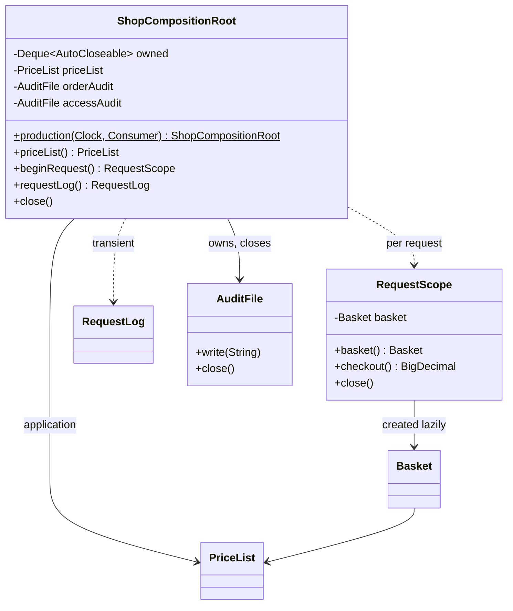

### Classic Java

m03 introduced the composition root with `production()` and `forTests(...)`. The first decision inside every class
is *how* it receives its dependencies. Constructor injection makes them visible, required and `final`:

```java
// file: examples/di/styles/ConstructorInjected.java
public final class ConstructorInjected implements InvoiceNumberer {

    private final Clock clock;
    private final Supplier<Long> sequence;

    public ConstructorInjected(Clock clock, Supplier<Long> sequence) {
        this.clock = Objects.requireNonNull(clock, "clock");
        this.sequence = Objects.requireNonNull(sequence, "sequence");
    }
```

Setter injection lets the object exist before its dependencies do — every caller must remember the right call order
(**temporal coupling**), and a half-built object fails only at run time:

```java
// file: examples/di/styles/SetterInjected.java
    @Override
    public String next() {
        if (clock == null) {
            throw new IllegalStateException("clock not set");
        }
        if (sequence == null) {
            throw new IllegalStateException("sequence not set");
        }
        return InvoiceNumberer.format(LocalDate.now(clock), sequence.get());
    }
```

Hidden dependencies are worse: the constructor declares nothing, so the reader — and the test — cannot even see
that a clock is involved:

```java
// file: examples/di/styles/HiddenDependencies.java
    private final Clock clock = Clock.systemDefaultZone(); // hidden: today's date, every time
    private long counter;                                  // hidden: cannot start at a known value
```

```text
constructor injection: INV-2026-09-0001, INV-2026-09-0002
  constructor parameters: [Clock, Supplier]
setter injection before configuration: clock not set
setter injection after both setters: INV-2026-09-0001
hidden dependencies: constructor parameters: []
  the system clock and the counter are created inside: a test cannot replace them
```

### Modern Java 27

A composition root is also where **lifetimes** are decided. You need no framework for that: an *application*
object is a field created once, a *per-request* object lives in a scope, a *transient* object is created on every
lookup. The root owns every resource it creates and closes them in **reverse** creation order:

```java
// file: examples/di/lifetimes/ShopCompositionRoot.java
    private final Deque<AutoCloseable> owned = new ArrayDeque<>(); // closed last-in, first-out
    private final PriceList priceList;                              // application lifetime
    private final AuditFile orderAudit;                             // application lifetime, owned resource
    private final AuditFile accessAudit;                            // application lifetime, owned resource
// ...
    /** Per-request lifetime: opens a new scope; close it when the request ends. */
    public RequestScope beginRequest() {
        ensureOpen();
        return new RequestScope(++requests, priceList, () -> new Basket(priceList), orderAudit);
    }

    /** Transient lifetime: a new instance on every call. */
    public RequestLog requestLog() {
        ensureOpen();
        return new RequestLog(++logs, accessAudit);
    }
```

`RequestScope` creates its `Basket` lazily from the `Supplier` and shares it until the scope is closed; both the
root and the scope are `AutoCloseable`, so try-with-resources expresses the lifetimes in the demo:

```text
request 1: same basket within the request: true
  disk> orders.audit 2026-09-30T10:00:00Z request 1 paid 27.00 for [book, pen]
request 2: new basket: true
request 2: same price list: true
  disk> orders.audit 2026-09-30T10:00:00Z request 2 paid 12.50 for [mug]
  disk> access.audit 2026-09-30T10:00:00Z log 1: GET /basket
  disk> access.audit 2026-09-30T10:00:00Z log 2: POST /checkout
transient logs are different objects: true
closing the root:
  disk> access.audit closed
  disk> orders.audit closed
```

### How a container works

Spring, Guice and Jakarta CDI automate exactly this wiring. `MiniContainer` shows the core in about 100 lines: find
the single public constructor, resolve each parameter type recursively, cache singletons, and keep the resolution
path to detect cycles. `Class.cast` keeps it free of unchecked casts:

```java
// file: examples/di/container/MiniContainer.java
    private Object resolve(Class<?> type, List<Class<?>> path) {
        if (path.contains(type)) {
            throw new IllegalStateException("dependency cycle: " + describe(Stream.concat(path.stream(), Stream.of(type))));
        }
        Object existing = instances.get(type);
        if (existing != null) {
            return existing;
        }
        path.add(type);
        try {
            Object created = create(implementationOf(type, path), path);
            if (singletons.contains(type)) {
                instances.put(type, created);
            }
            return created;
        } finally {
            path.removeLast();
        }
    }
```

The price is visible in the last line of the demo: a forgotten binding compiles fine and fails **at run time**, when
the graph is first resolved. With hand wiring the same mistake is a compile error in the composition root.

```text
sales 2026-09-30: book=3, mug=1, pen=5
repository is a singleton: true
formatter is created fresh: true
forgotten binding, found only at run time: no binding for ReportRepository (resolving ReportService -> ReportRepository)
```

### Real-world usage

Spring's `ApplicationContext` (constructor injection is its recommended style, singleton and request scopes),
Google Guice and Dagger (Dagger generates the wiring code at compile time — errors move back to the compiler), Jakarta
CDI in application servers, `java.util.ServiceLoader` for plug-ins, and the plain `main` method of every small tool
that builds its objects by hand.

### Pitfalls and when NOT to use it

- **Service Locator** (`Registry.get(Mailer.class)` inside a method) is not DI: the dependency is still hidden.
- **Container everywhere**: only the composition root may talk to the container; business classes must not.
- **Lifetime mismatch**: a singleton that holds a per-request object leaks one user's data into the next request.
- **Constructor with ten parameters** is a design smell (too many responsibilities), not a DI problem.
- Small programs and scripts do not need a container — a `main` that calls `new` *is* a composition root.

### Related patterns

**Factory Method / Abstract Factory** (m02) create objects; DI decides *who* calls them. **Singleton** (m02) by
wiring (one instance per root) replaces Singleton by static field. **Strategy** (m06) objects are typical injected
collaborators. **Facade** (m04) often sits on top of an injected graph.

## Repository

### Problem

Business code full of SQL strings, file formats and `Map` lookups mixes *what* it needs ("all books under 30.00")
with *how* it is stored. Change the storage and every caller changes; test the logic and you need a database.

### Intent

> Mediate between the domain and the data mapping layers using a **collection-like interface** for accessing
> domain objects — one repository per aggregate.

### Structure

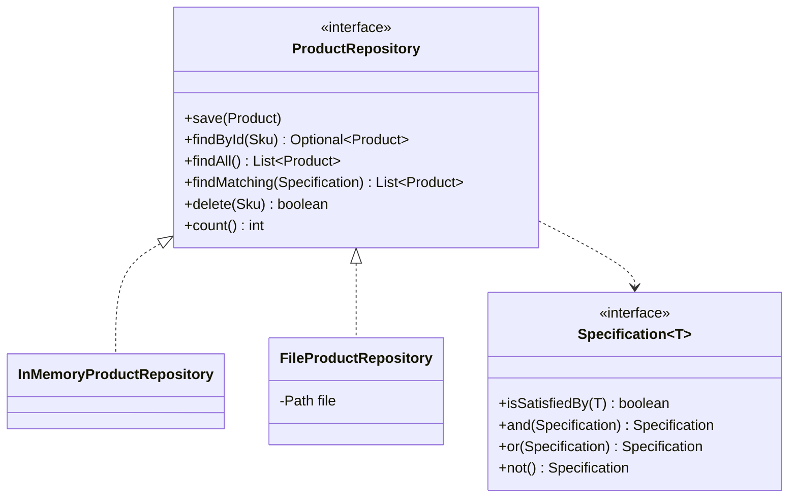

### Classic Java

The classic DAO grows one finder per question — `findByCategory`, `findByCategoryAndMaxPrice`,
`findByNameOrCategory`, … The Repository instead looks like a collection, returns `Optional` for a single result and
**immutable** lists, and takes a query object:

```java
// file: examples/repository/catalog/ProductRepository.java
public interface ProductRepository {

    /** Adds {@code product}, or replaces the product with the same SKU. */
    void save(Product product);

    Optional<Product> findById(Sku sku);

    /** Every product, sorted by SKU. */
    List<Product> findAll();

    /** The products {@code specification} is satisfied by, sorted by SKU. */
    List<Product> findMatching(Specification<Product> specification);
```

### Modern Java 27

**Specification** is a functional interface with default combinators, so queries are composed, not enumerated:

```java
// file: examples/repository/catalog/Specification.java
@FunctionalInterface
public interface Specification<T> {

    /** Whether {@code candidate} matches. */
    boolean isSatisfiedBy(T candidate);

    /** Both this and {@code other}. */
    default Specification<T> and(Specification<T> other) {
        Objects.requireNonNull(other, "other");
        return candidate -> isSatisfiedBy(candidate) && other.isSatisfiedBy(candidate);
    }
```

Two implementations — a sorted map and a text file (`BOOK-1|Design Patterns|BOOKS|3990`) — pass **one abstract
contract test**, `ProductRepositoryContract`, exactly like the course's exercise contracts. The caller code is the
same for both; the file version even survives a "restart":

```text
== InMemoryProductRepository
all:                     [BOOK-1, BOOK-2, MUG-3, PEN-7]
books up to 30.00:       [BOOK-2]
"pattern" or stationery: [BOOK-1, MUG-3, PEN-7]
not books:               [MUG-3, PEN-7]
== FileProductRepository
all:                     [BOOK-1, BOOK-2, MUG-3, PEN-7]
books up to 30.00:       [BOOK-2]
"pattern" or stationery: [BOOK-1, MUG-3, PEN-7]
not books:               [MUG-3, PEN-7]
after a restart the file still holds 4 products; BOOK-1 costs 39.90
```

### Optimistic versioning

A repository of a mutable **aggregate** hands out isolated copies. Two clerks may load the same order; whoever saves
second would silently overwrite the first one's change (a *lost update*). Optimistic concurrency stores a version
and refuses a save from a stale one — what JPA's `@Version` does:

```java
// file: examples/repository/orders/InMemoryOrderRepository.java
    @Override
    public synchronized void save(Order order) {
        Objects.requireNonNull(order, "order");
        Order current = stored.get(order.id());
        long storedVersion = current == null ? 0 : current.version();
        if (order.version() != storedVersion) {
            throw new ConcurrentUpdateException(order.id(), order.version(), storedVersion);
        }
        order.savedAt(storedVersion + 1);
        stored.put(order.id(), order.copy());
    }
```

```text
created order-1 at version 1
ada and alan both load order-1 at version 1
ada adds BOOK-1 x 2 and saves: version 2
alan adds PEN-7 x 1 and saves: order-1 was changed concurrently: expected version 1 but found 2
stored: [BOOK-1 x 2] at version 2
alan reloads, re-applies and saves: [BOOK-1 x 2, PEN-7 x 1] at version 3
```

*Pessimistic* locking would block alan until ada is done; optimistic locking lets both work and detects the
conflict — the better choice when conflicts are rare.

### Real-world usage

Spring Data repositories (`CrudRepository`, `JpaSpecificationExecutor` with `Specification`), JPA's `EntityManager`
and `@Version`, Jakarta Data (Jakarta EE 11), Micronaut Data — and every in-memory fake used to test the code above
them.

### Pitfalls and when NOT to use it

- One repository **per aggregate**, not per table: no `OrderLineRepository` next to `OrderRepository`.
- Returning mutable internal objects lets callers change "stored" data behind the repository's back.
- A generic `Repository<T, ID>` for everything tends to leak query details again; keep the interface in the
  domain's words.
- For reporting queries over many tables, a plain query object (or SQL) is simpler than forcing a repository.

### Related patterns

**Adapter** (m04): every repository implementation adapts a storage technology. **Specification** is a small
**Interpreter**/**Composite** (m05, m08). **Unit of Work** (below) decides when repository changes are committed.

## Ports and Adapters

### Problem

In a classic layered application the domain sits *above* persistence: `Invoice.save()` calls a DAO, the DAO takes an
`Invoice`. It compiles and runs — and now the domain cannot be tested, reused or understood without the database:

```java
// file: examples/erosion/domain/Invoice.java
    /** The shortcut that erodes the architecture: domain → adapter. */
    public String save() {
        return new InvoiceDao().store(this);
    }
```

### Intent

> Put the application's core in the middle and let it talk to the outside world only through **ports** —
> interfaces the core owns. **Adapters** at the edge implement or call those ports; dependencies always point
> **inward**.

### Structure

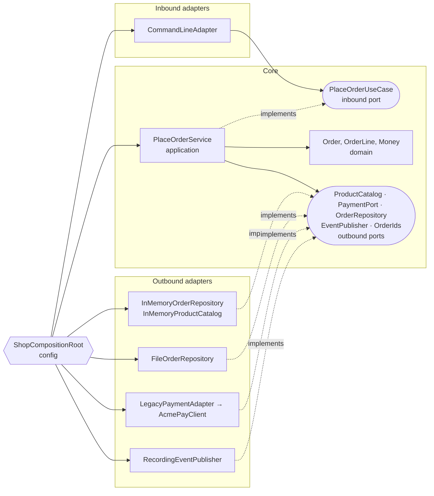

The **inbound port** is the use case (`TransferMoneyUseCase`, `PlaceOrderUseCase`); **outbound ports** are what the
core needs from the world (`LoadAccountPort`, `PaymentPort`, …). Both are owned by the core. Only the composition root
in `config` knows the adapter classes.

### Classic Java

The minimal hexagon is a money transfer. The application service implements the inbound port and uses two narrow
outbound ports; it is tested with hand-written fakes only, no adapter on the test path:

```java
// file: examples/hexagonal/transfer/application/TransferService.java
public final class TransferService implements TransferMoneyUseCase {

    private final LoadAccountPort loadAccount;
    private final SaveAccountPort saveAccount;
    private final Money limit;
// ...
        if (!source.get().canWithdraw(command.amount())) {
            return new TransferResult.Rejected("insufficient funds");
        }
        source.get().withdraw(command.amount());
        target.get().deposit(command.amount());
        saveAccount.save(source.get());
        saveAccount.save(target.get());
        return new TransferResult.Transferred(command.from(), command.to(), command.amount());
```

### Modern Java 27

Business outcomes are a **sealed result**, not exceptions: a declined transfer is an expected answer, a broken disk
is not. The inbound adapter only translates text ↔ command/result, with an exhaustive `switch`, a record pattern and
the unnamed pattern `_`:

```java
// file: examples/hexagonal/transfer/application/TransferResult.java
public sealed interface TransferResult {

    /** The money moved. */
    record Transferred(AccountId from, AccountId to, Money amount) implements TransferResult {}
```

```java
// file: examples/hexagonal/transfer/adapter/inbound/TextTransferController.java
        var command = new TransferCommand(new AccountId(words[1]), new AccountId(words[2]), amount);
        return switch (useCase.transfer(command)) {
            case Transferred _ -> "OK";
            case Rejected(String reason) -> "REJECTED " + reason;
        };
```

```text
> transfer A-1 A-2 25.00
OK
> transfer A-2 A-1 500.00
REJECTED insufficient funds
> transfer A-1 A-1 1.00
REJECTED same source and target account
> transfer A-1 A-9 1.00
REJECTED unknown account: A-9
> transfer A-1 A-2 5000.00
REJECTED amount exceeds the limit of 1000.00
> send money
usage: transfer <from> <to> <amount>
balances: {A-1=75.00, A-2=45.00}
```

### PatternShop

The capstone's architecture in miniature. `PlaceOrderService` depends on five outbound ports and the domain — never
on an adapter. It validates, charges, saves **and only then** publishes the events the aggregate recorded:

```java
// file: examples/hexagonal/shop/application/PlaceOrderService.java
        if (!payments.charge(command.customer(), Order.totalOf(lines))) {
            return new PlaceOrderResult.Rejected("payment declined");
        }
        Order order = Order.place(ids.next(), command.customer(), lines);
        orders.save(order);                          // commit first …
        order.pullEvents().forEach(events::publish); // … then tell the world
        return new PlaceOrderResult.Placed(order.id(), order.total());
```

The payment provider's SDK speaks status codes. An m04 **Adapter** turns it into the core's `PaymentPort` — a
declined card is a business answer, an unknown code an infrastructure failure:

```java
// file: examples/hexagonal/shop/adapter/outbound/payment/LegacyPaymentAdapter.java
    @Override
    public boolean charge(String customer, Money amount) {
        int code = client.pay(customer, amount.cents());
        return switch (code) {
            case 0 -> true;   // approved
            case 51 -> false; // insufficient funds: declined
            default -> throw new IllegalStateException("AcmePay failed with status code " + code);
        };
    }
```

Switching from memory to files changes **one argument** in the composition root:

```java
// file: examples/hexagonal/shop/config/ShopCompositionRoot.java
    /** Everything in memory: fast, for tests and demos. */
    public static ShopCompositionRoot inMemory() {
        return wire(new InMemoryOrderRepository());
    }

    /** Orders in {@code ordersFile}; ids continue after the orders already stored there. */
    public static ShopCompositionRoot fileBacked(Path ordersFile) {
        return wire(new FileOrderRepository(ordersFile));
    }
```

The same use-case contract runs against both roots, and the demo replays one session on each:

```text
== in memory
> place alice BOOK-1:2 PEN-7:1
PLACED order-1 total 47.00
> place bob TOY-9:1
REJECTED unknown product: TOY-9
> place carol BOOK-1:30
REJECTED payment declined
> place dave
usage: place <customer> <sku>:<quantity>...
payment calls: [alice 4700, carol 60000], orders saved: 1
published: [OrderPlaced[orderId=order-1, customer=alice, total=47.00]]
== file backed
> place alice BOOK-1:2 PEN-7:1
PLACED order-1 total 47.00
> place bob TOY-9:1
REJECTED unknown product: TOY-9
> place carol BOOK-1:30
REJECTED payment declined
> place dave
usage: place <customer> <sku>:<quantity>...
payment calls: [alice 4700, carol 60000], orders saved: 1
published: [OrderPlaced[orderId=order-1, customer=alice, total=47.00]]
after a restart: order-1 for alice, total 47.00
> place erin MUG-3:1
PLACED order-2 total 8.75
```

### Real-world usage

Alistair Cockburn's hexagonal architecture, Robert C. Martin's *Clean Architecture* and Jeffrey Palermo's *Onion
Architecture* are the same idea with different drawings. Spring Boot applications structured into `domain` /
`application` / `adapter` packages, Quarkus and Micronaut projects, and libraries such as jMolecules that annotate the
roles all follow it.

### Pitfalls and when NOT to use it

- **Ports in the adapter's words** (`JpaOrderPort`, `saveEntity`) leak the technology back into the core.
- **One port per table** or per method explodes into dozens of interfaces; group by what a use case needs.
- **Mapping overhead**: domain objects ↔ persistence objects ↔ DTOs costs code; a CRUD screen over one table does
  not need a hexagon.
- An adapter that calls another adapter (CLI → file repository directly) silently bypasses the core.

### Related patterns

**Adapter** (m04) is literally the outer ring. **Facade** (m04) is what an inbound port looks like from the outside.
**Repository** is the most common outbound port. **Dependency Injection** in the composition root plugs it all
together; **architecture rules** (below) keep it that way.

## Domain events

### Problem

After an order is paid, stock must be reserved, an e-mail sent and analytics updated. If the payment code calls all
of them directly, every new reaction changes it. If an Observer is called *from inside the entity*, the listeners run
**before** the change is saved — when the save then fails, the customer already got an e-mail for an order that does
not exist. The hard-wired version is easy to recognise:

```java
// file: examples/refactoring/notifications/before/RegistrationService.java
        mailer.sendWelcome(email);
        crm.createContact(email);
        analytics.track("signup", email);
```

### Intent

> Let the aggregate **record** what happened as immutable events, and publish them **after** the change has been
> committed — so subscribers only ever hear about facts.

### Structure

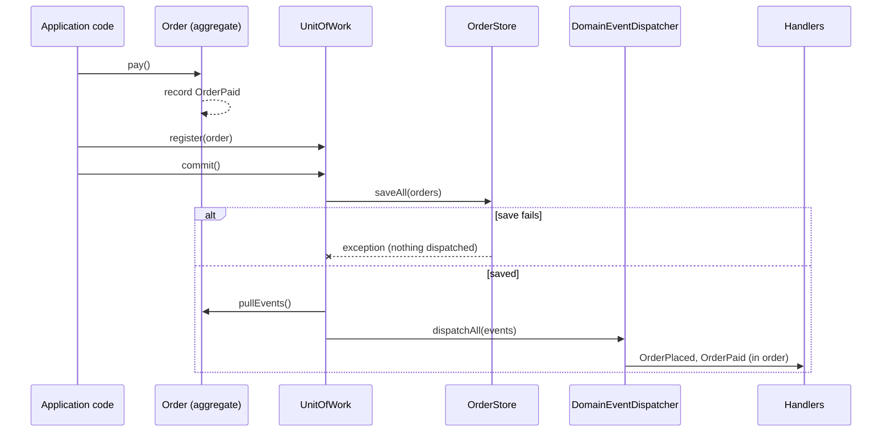

### Classic Java

m07's typed event bus is the dispatcher; m11 adds the **timing rule**. The aggregate only appends to a private list;
each transition is guarded, and an illegal one throws *before* anything is recorded:

```java
// file: examples/events/aggregate/Order.java
    public void pay() {
        require("pay", OrderStatus.PLACED);
        status = OrderStatus.PAID;
        pendingEvents.add(new OrderEvent.OrderPaid(id));
    }
// ...
    /** Hands out the recorded events and forgets them: each event leaves the aggregate exactly once. */
    public List<OrderEvent> pullEvents() {
        List<OrderEvent> events = List.copyOf(pendingEvents);
        pendingEvents.clear();
        return events;
    }
```

### Modern Java 27

The events are a sealed hierarchy of records named in the past tense. The **Unit of Work** saves first and dispatches
after; if `saveAll` throws, the dispatch line is never reached:

```java
// file: examples/events/aggregate/UnitOfWork.java
    /** 1. save every registered order (may throw — then nothing is dispatched); 2. dispatch their events. */
    public void commit() {
        store.saveAll(registered);
        List<OrderEvent> events = new ArrayList<>();
        for (Order order : registered) {
            events.addAll(order.pullEvents());
        }
        registered.clear();
        dispatcher.dispatchAll(events);
    }
```

The dispatcher queues events raised by handlers behind the current one and sends a failing handler's exception to
an injected error handler — the commit already happened and must not be undone by an e-mail server:

```java
// file: examples/events/aggregate/DomainEventDispatcher.java
    private void deliver(B event) {
        for (Handler<?> handler : handlers) {
            try {
                handler.deliver(event);
            } catch (RuntimeException e) { // reported, not swallowed: the other handlers still run
                errorHandler.accept(e);
            }
        }
    }
```

```text
recorded, not committed yet: nothing dispatched
mail: order order-1 confirmed, total 47.00
audit: OrderPlaced[orderId=order-1, totalCents=4700]
stock: reserved for order-1
audit: OrderPaid[orderId=order-1]
stored: {order-1=PAID}
commit failed (store unavailable): stored {order-1=PAID}, nothing dispatched
illegal transition: cannot pay order-1: it is CANCELLED
audit: OrderCancelled[orderId=order-1, reason=customer changed their mind]
stored: {order-1=CANCELLED}
```

### Transactional outbox

In-process dispatch after commit still has a gap: the process may crash *between* the commit and the dispatch, or
the message broker may be down. The **transactional outbox** writes the events into the same store, in the same
transaction, as the state — and a relay sends them later:

```java
// file: examples/events/outbox/OutboxOrderStore.java
        for (OrderEvent event : order.pullEvents()) {
            outbox.add(new OutboxEntry(++sequence, event.getClass().getSimpleName(), payload(event), false));
        }
        state = new State(orders, List.copyOf(outbox)); // the "transaction": state and events in one step
```

The relay publishes in sequence order and marks each entry *after* the broker accepted it. A crash between the two
re-sends the entry next time: delivery is **at least once**, so consumers must be **idempotent**:

```java
// file: examples/events/outbox/IdempotentConsumer.java
    public boolean receive(OutboxEntry entry) {
        if (!processed.add(entry.sequence())) {
            duplicates++;
            return false;
        }
        handler.accept(entry);
        return true;
    }
```

```text
saved order-1 with its events: pending [1, 2]
write failed (disk full): orders {order-1=PAID}, outbox entries 2
relay failed (broker unavailable): pending [1, 2]
relay failed (relay crashed before marking 1): pending [1, 2]
relayed 2: pending []
consumer processed: [1 OrderPlaced order-1 4700, 2 OrderPaid order-1], duplicates ignored: 1
```

### Real-world usage

Spring's `@TransactionalEventListener(phase = AFTER_COMMIT)` and Spring Data's `@DomainEvents` /
`AbstractAggregateRoot`, Axon Framework, Debezium's outbox event router (change data capture on the outbox table),
Kafka consumers that deduplicate by key, and every "order confirmed" e-mail you have received.

### Pitfalls and when NOT to use it

- **Dispatching inside the aggregate** or before commit announces changes that may never happen.
- **Events as commands** (`SendEmail` instead of `OrderPlaced`) couple the publisher to one reaction again.
- **Huge payloads** or mutable events; keep them small immutable records with ids.
- **Exactly-once delivery** does not exist across a network; design idempotent consumers instead.
- A single, synchronous reaction that must succeed together with the change is a plain method call, not an event.

### Related patterns

**Observer** (m07) is the mechanism; domain events add *what* (past-tense facts) and *when* (after commit).
**Command** (m06) asks for something to happen; an event says it happened. **Unit of Work** and **Repository** decide
the commit; the **outbox** is an outbound adapter behind the `EventPublisher` port.

## Anti-patterns and refactoring to patterns

### Characterization tests first

An **anti-pattern** is a common answer that looks reasonable and causes more problems than it solves. Refactoring
away from one is only safe when the behaviour is pinned first. A **characterization test** records what the code
*does today* — right or wrong — and then runs unchanged against the refactored version:

```java
// file: examples/antipatterns/GodClassTest.java
    @CsvSource(delimiter = '|', textBlock = """
            alice | REGULAR  |  3 |  3000 | OK order-1 90.00
            bob   | VIP      |  2 |  5000 | OK order-1 90.00
            carol | EMPLOYEE |  1 | 10000 | OK order-1 70.00
            dave  | VIP      | 10 |  1000 | OK order-1 85.50
// ...
        String old = before.checkout(customer, type, quantity, price);
        String refactored = after.checkout(new CheckoutRequest(customer, type, quantity, price));
        assertThat(old).isEqualTo(expected);
        assertThat(refactored).isEqualTo(old);
        assertThat(mailer.sent()).isEqualTo(before.sentEmails());
        assertThat(log).isEqualTo(before.logLines());
```

### God class

`OrderManager` validates, prices with `if/else` on a type code, stores in a map, writes e-mail text and logs — 12
public methods, every change touches it. Split by responsibility, each part becomes a pattern you already know:

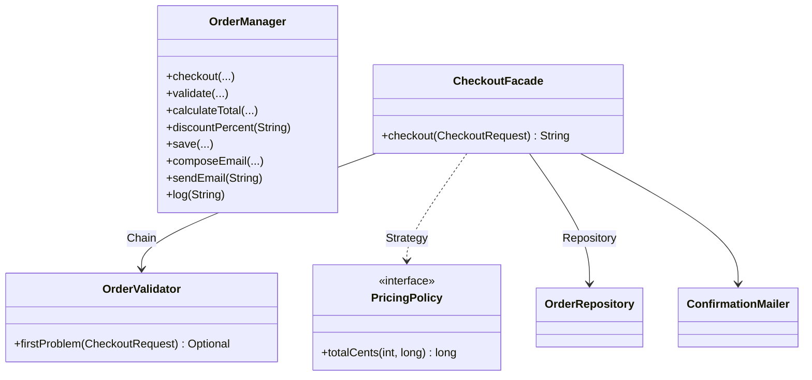

```java
// file: examples/antipatterns/godclass/after/CheckoutFacade.java
        long total = PricingPolicy.forCustomerType(request.customerType()).orElseThrow()
                .totalCents(request.quantity(), request.unitPriceCents());
        var order = new PlacedOrder(orders.nextId(), request.customer(), request.quantity(), total);
        orders.save(order);
        mailer.sendConfirmation(order);
```

```text
alice: before OK order-1 90.00 | after OK order-1 90.00
bob: before OK order-2 85.50 | after OK order-2 85.50
carol: before OK order-3 70.00 | after OK order-3 70.00
dave: before REJECTED unknown customer type: GOLD | after REJECTED unknown customer type: GOLD
erin: before REJECTED invalid quantity | after REJECTED invalid quantity
same e-mails: true, same log: true
public methods: OrderManager 12
after the split: CheckoutFacade 1, OrderValidator 2, PricingPolicy 2, OrderRepository 4, ConfirmationMailer 2
```

### Anaemic domain model

Getters and setters on one side, every rule in a service on the other: the rules hold only for callers who remember
the service. A **rich domain model** keeps behaviour next to the data and has no setter to go around it:

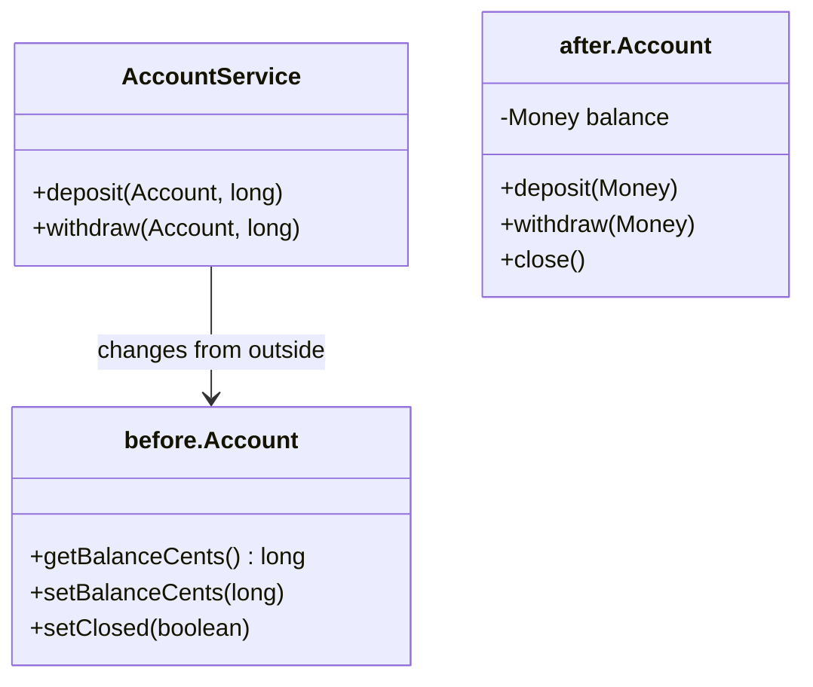

```java
// file: examples/antipatterns/anaemic/after/Account.java
    public void withdraw(Money amount) {
        requireUsable(amount);
        if (amount.compareTo(balance) > 0) {
            throw new IllegalArgumentException("insufficient funds");
        }
        balance = balance.minus(amount);
    }
```

```text
before: balance 75.00
after:  balance 75.00
before: setBalanceCents(-5000) accepted, balance -50.00
after:  withdraw 80.00 -> insufficient funds, balance still 75.00
after:  deposit to a closed account -> account is closed
```

### Singleton and Service Locator abuse

A no-argument constructor that lies: the service needs stock levels and a policy but fetches both from global state.
State set by one test is visible in the next, unless someone remembers `ServiceLocator.reset()`. (This package is the
only place in m11 where mutable static state is allowed — an ArchUnit rule enforces it.)

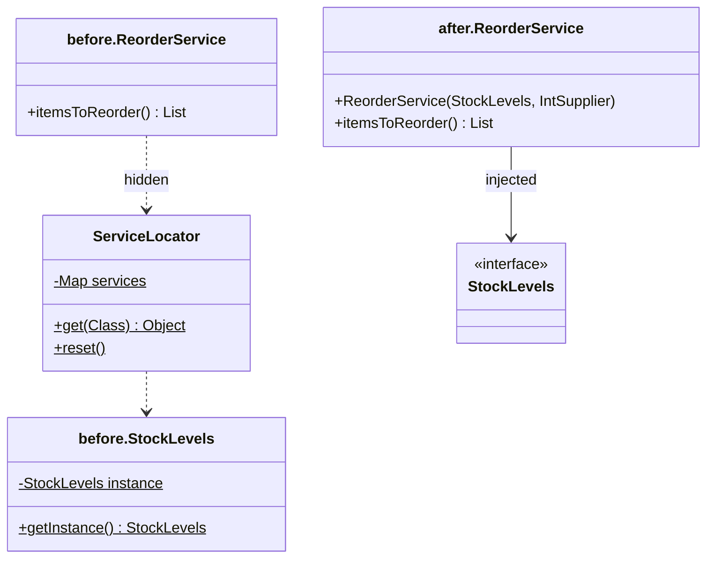

```java
// file: examples/antipatterns/globalstate/before/ReorderService.java
    public List<String> itemsToReorder() {
        StockLevels stock = ServiceLocator.get(StockLevels.class);   // hidden dependency 1
        int minimum = ServiceLocator.get(ReorderPolicy.class).minimumUnits(); // hidden dependency 2
```

```text
before, scenario 1: reorder [PEN-7]
before, scenario 2: reorder [MUG-3, PEN-7]  <- PEN-7 leaked in
after, scenario 1: reorder [PEN-7]
after, scenario 2: reorder [MUG-3]
```

### Patternitis

**Speculative generality**: a provider for a factory that creates a Strategy implemented by a Template Method with
one subclass — five types to print "Good day, Ada." A pattern without a second variation is cost, not design:

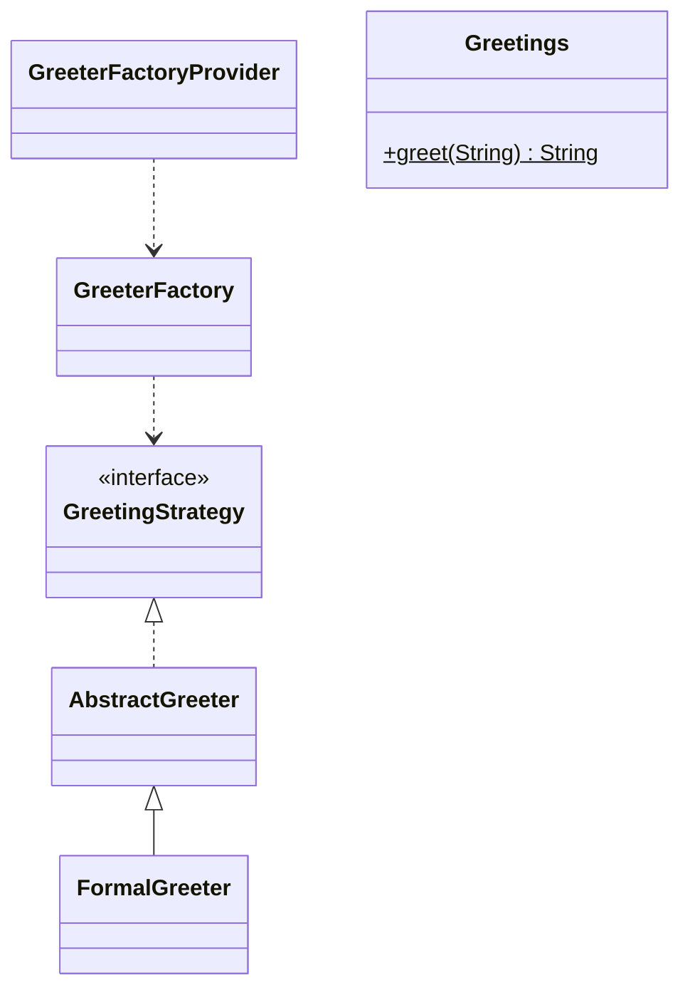

```java
// file: examples/antipatterns/patternitis/after/Greetings.java
    private static final Function<String, String> FORMAL = name -> "Good day, " + name + ".";

    private Greetings() {}

    public static String greet(String name) {
        return FORMAL.apply(name == null || name.isBlank() ? "guest" : name.strip());
    }
```

### Replace type code with a sealed type

A `switch` on a `String` code with nested `if`s; an unknown code silently means free shipping. Step by step —
*Extract Method*, introduce a sealed type, move the logic, delete the string — the compiler takes over the check:

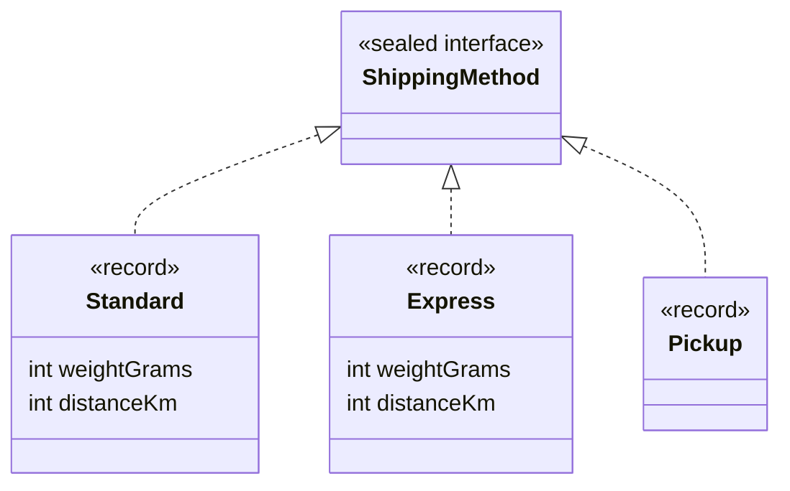

```java
// file: examples/refactoring/shipping/after/ShippingCalculator.java
    public long costCents(ShippingMethod method) {
        return switch (method) {
            case Standard(int weight, int distance) -> 499 + 100 * startedKilosAbove(2000, weight)
                    + (distance > 500 ? 300 : 0);
            case Express(int weight, int distance) -> (999 + 200 * startedKilosAbove(1000, weight))
                    * (distance > 500 ? 2 : 1);
            case Pickup _ -> 0;
        };
    }
```

No `default` branch: a fourth shipping method makes this class fail to compile until it is priced.

```text
STANDARD 2500 g 100 km before 5.99 | after 5.99
EXPRESS  1500 g 600 km before 23.98 | after 23.98
PICKUP                 before 0.00 | after 0.00
EXPRES (typo)          before 0.00 | after: does not compile — there is no such record
```

### Replace hard-wired calls with events

The registration service from the domain-events section had three collaborators. After the refactoring it has one,
and a new reaction is a new subscription — the service does not change:

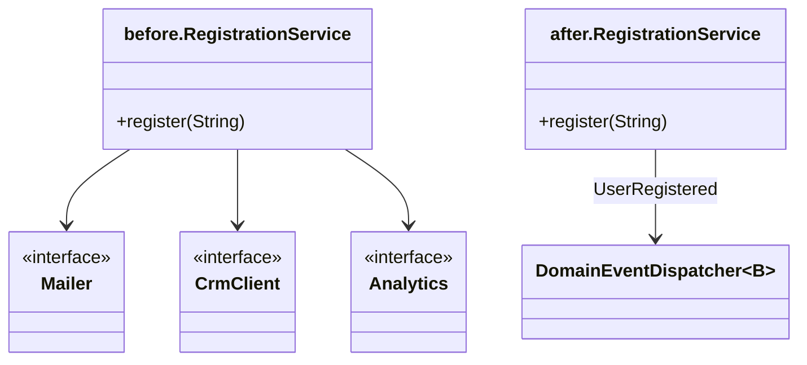

```java
// file: examples/refactoring/notifications/after/RegistrationService.java
    public void register(String email) {
        if (!Objects.requireNonNull(email, "email").contains("@")) {
            throw new IllegalArgumentException("invalid e-mail: " + email);
        }
        events.dispatch(new UserRegistered(email));
    }
```

### Anti-pattern catalogue

| Anti-pattern | Symptom | Cost | Refactor to |
|---|---|---|---|
| God class | 10+ public methods, many reasons to change | every change touches it, nothing is reusable | Chain, Strategy, Repository, Facade — one responsibility each |
| Anaemic domain model | entities with only getters/setters, rules in services | invariants can be bypassed | move behaviour into the entity, remove setters |
| Singleton / Service Locator abuse | `getInstance()` / `Registry.get(...)` inside methods, no-arg constructors | hidden dependencies, state leaks between tests | constructor injection, composition root |
| Patternitis | interfaces with one implementation, factories of factories | indirection without variation | inline; add the pattern when the second case arrives |
| Type-code conditionals | `switch` on strings/ints repeated in many places | an unknown code is a silent bug | sealed type + exhaustive `switch` (or polymorphism) |
| Hard-wired side effects | a service calling mailer, CRM, analytics directly | every new reaction changes the service | domain events + subscribers |

## Test doubles

### Problem

`CheckoutService` needs prices, a payment gateway, a receipt store, a notifier and an audit log. A unit test that
uses the real ones is slow, flaky and charges real money; a test that uses a mocking library for everything often
tests the implementation instead of the behaviour.

### Intent

> Replace a collaborator in a test with a **test double** that is just smart enough for the question the test asks —
> and choose the kind of double by that question.

### Structure

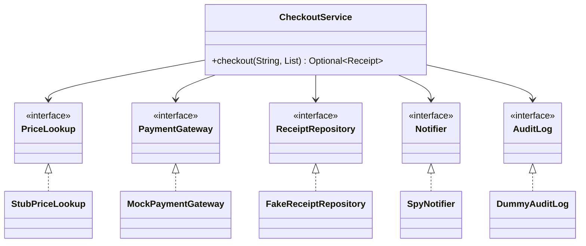

### Classic Java

Mocking libraries (Mockito) generate doubles at run time. Written by hand, a **mock** is a small class: expectations
before the call, a fast failure on an unexpected call, and `verify()` at the end:

```java
// file: examples/testdoubles/checkout/doubles/MockPaymentGateway.java
    @Override
    public Optional<String> charge(String customer, long cents) {
        Expectation next = expected.peekFirst();
        if (next == null || !next.customer().equals(customer) || next.cents() != cents) {
            throw new AssertionError("unexpected charge " + customer + " " + cents + ", expected "
                    + (next == null ? "no charge" : next));
        }
        expected.removeFirst();
        return next.approve() ? Optional.of("TX-" + ++transactions) : Optional.empty();
    }
```

### Modern Java 27

Functional interfaces make most stubs and spies one-liners — a lambda over a `Map` or a `List::add`. Time is a
collaborator too: a fake `Clock` that moves only when the test says so tests expiry to the millisecond without
`Thread.sleep`:

```java
// file: examples/testdoubles/time/MutableClock.java
    /** Moves time forward (or backward, for a negative duration). */
    public void advance(Duration duration) {
        now.instant = now.instant.plus(duration);
    }
```

```java
// file: examples/testdoubles/SessionExpiryTest.java
    @Test
    void sessionIsValidJustBeforeTheTtlAndExpiredAtExactlyTheTtl() {
        String token = sessions.login("ada");
        clock.advance(TTL.minusMillis(1));
        assertThat(sessions.isValid(token)).isTrue();
        clock.advance(Duration.ofMillis(1));
        assertThat(sessions.isValid(token)).isFalse();
```

```text
mock verified: alice charged 2700
fake finds the receipt: true
spy recorded: [alice: receipt TX-1 for 27.00]
mock, unexpected call: unexpected charge alice 2000, expected no charge
mock, verify: missing expected charge: bob 700
declined: Optional.empty, audit [declined carol 700]
```

### Which double when

| Double | What it does | Verifies | Use it for | Example |
|---|---|---|---|---|
| Dummy | fills a parameter, fails if used | nothing (or that it is unused) | collaborators the tested path must not touch | `DummyAuditLog` |
| Stub | returns canned answers | nothing | queries the code needs answers from | `StubPriceLookup` |
| Fake | a real, simplified implementation | state, afterwards | stores and services with behaviour (in-memory repository) | `FakeReceiptRepository` |
| Spy | records calls with arguments | interactions, afterwards | outgoing messages (notifications, events) | `SpyNotifier` |
| Mock | programmed expectations, fails fast | interactions, during and at `verify()` | commands whose call *is* the behaviour (charging money) | `MockPaymentGateway` |

**State verification** (classicist style: check the fake repository afterwards) survives refactorings better than
**interaction verification** (mockist style: check which calls were made). Prefer state; use mocks for commands to
the outside world.

### Real-world usage

Mockito, EasyMock and MockK (Kotlin); Spring's `MockMvc`; Testcontainers (a real database as a fake); WireMock (a
fake HTTP server); `java.time.Clock.fixed` and `Clock.offset` in the JDK itself.

### Pitfalls and when NOT to use it

- **Mocking types you don't own** (a vendor SDK) tests your assumptions about it, not the SDK; wrap it in an adapter
  and mock *your* port.
- **Over-specified mocks** break on every harmless refactoring.
- A fake that drifts from the real implementation; run the same **contract test** against both (as `repository.catalog`
  does).
- Do not double value objects (`Money`, records) — use real ones.

### Related patterns

**Ports and Adapters** create the seams doubles plug into; **Dependency Injection** passes them in; **Repository**
contracts keep fakes honest.

## Architecture rules

### Problem

Architecture erodes one shortcut at a time. `Invoice.save()` calling a DAO compiles, passes its tests and runs — the
compiler cannot see that a dependency points the wrong way. Wiki pages and code reviews forget.

```text
stored invoice INV-1 (99.00)
compiles and runs — the broken dependency direction is invisible to javac
```

### Intent

> Turn the architecture into **executable rules** that run with the tests and fail the build when a dependency, a
> cycle or a naming convention is violated.

### Structure

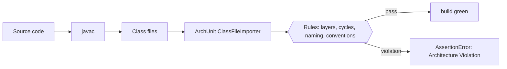

### Classic Java

ArchUnit reads **bytecode**, not source. A plain JUnit test imports the classes once and checks rules against them.
The onion rule needs two settings for a hexagon: optional layers (there is no "domain service" layer) and an ignored
composition root (it is *supposed* to reach every adapter):

```java
// file: architecture/HexagonalShopArchitectureTest.java
        onionArchitecture()
                .domainModels("..shop.domain..")
                .applicationServices("..shop.application..")
                .adapter("cli", "..shop.adapter.inbound.cli..")
                .adapter("memory", "..shop.adapter.outbound.memory..")
                .adapter("file", "..shop.adapter.outbound.file..")
                .adapter("payment", "..shop.adapter.outbound.payment..")
                .adapter("events", "..shop.adapter.outbound.events..")
                .withOptionalLayers(true) // there is no "domain service" layer here
                .ignoreDependency(resideInAPackage("..shop.config.."), alwaysTrue()) // the root may wire anything
                .check(SHOP);
```

On the eroded invoicing code the same kind of rules fail — that is what `ErosionRulesTest` asserts — with a message
that names `Invoice.save()` and the cycle `Slice adapter -> Slice domain -> Slice adapter`.

### Modern Java 27

The ArchUnit JUnit engine style declares rules as fields. m11 uses it once, for the course conventions — including
"no external dependencies in `src/main`" and the owner's decision that mutable static state is allowed only in the
global-state anti-pattern:

```java
// file: architecture/CourseConventionsArchTest.java
    @ArchTest
    static final ArchRule mutableStaticStateOnlyInTheGlobalStateAntiPattern = fields()
            .that().areStatic().and().areNotFinal()
            .should().beDeclaredInClassesThat().resideInAPackage("..antipatterns.globalstate.before..")
            .as("non-final static fields exist only in antipatterns.globalstate.before (owner decision 2)");
```

### How the tools work

With the **Class-File API** (`java.lang.classfile`, final since JDK 24) a dependency checker needs no library at
all: parse the class file, collect every class named in the constant pool and in field and method descriptors:

```java
// file: examples/archcheck/DependencyScanner.java
        for (PoolEntry entry : model.constantPool()) {
            if (entry instanceof ClassEntry classEntry) {
                name(classEntry.asSymbol()).ifPresent(found::add);
            }
        }
        for (FieldModel field : model.fields()) {
            name(field.fieldTypeSymbol()).ifPresent(found::add); // types used only as a field type
        }
```

```text
erosion.domain: 1 violation(s)
  erosion.domain.Invoice -> erosion.adapter.InvoiceDao
hexagonal.shop.domain: 0 violation(s)
class-file major version: 71
```

Its limitation is instructive: a type that appears **only as a generic type argument** (`Consumer<OrderEvent>`) lives
in the `Signature` attribute, which this scanner does not read — a test asserts the miss. ArchUnit reads signatures
too, which is why it is the real tool.

### Real-world usage

ArchUnit in Spring, Quarkus and many enterprise code bases; jMolecules' ArchUnit rules for DDD and hexagonal
architecture; Spring Modulith's `ApplicationModules.verify()`; JPMS `module-info.java` (`exports`, `requires`) as
compile-time enforcement; jdeps in the JDK.

### Pitfalls and when NOT to use it

- **Too many rules** that nobody understands get disabled; start with layers, cycles and one or two conventions.
- **Rules on test classes** usually make no sense — import with `DoNotIncludeTests`.
- A rule that passes on an empty set of classes proves nothing; check that the package name is right.
- Small applications with one package need no architecture tests.

### Related patterns

**Ports and Adapters** define the layers the rules protect; **contract tests** (m00) do for behaviour what
architecture tests do for structure.

## Choosing an architecture pattern

| Situation | Reach for | Not this |
|---|---|---|
| Many objects, one place should decide implementations and lifetimes | Composition root + constructor injection | Service Locator, static singletons |
| Business code needs persistence | Repository per aggregate (+ Specification for queries) | DAO with a finder per question |
| Core must survive changes of UI, database or provider | Ports & Adapters | Layers where the domain calls the DAO |
| Several reactions to one business fact | Domain events after commit (outbox across processes) | Calling every reaction from the service |
| Concurrent edits are rare but must not be lost | Optimistic versioning | Pessimistic locks held during user think time |
| Testing code with slow or costly collaborators | Fakes and stubs; mocks only for outgoing commands | Mocking everything, mocking vendor SDKs |
| The architecture must stay as designed | ArchUnit rules in the build | Wiki pages |

## Summary

| Pattern | Use when | Avoid when | Java 27 shortcut |
|---|---|---|---|
| Dependency Injection | objects need replaceable collaborators | a 20-line script | constructor injection of interfaces and `Supplier`s, `AutoCloseable` roots |
| Repository | domain code needs stored aggregates | ad-hoc reporting queries | `Optional` returns, `List.copyOf`, functional `Specification` |
| Ports & Adapters | the core must outlive its technologies | CRUD over a single table | sealed results, records, exhaustive `switch` in adapters |
| Domain events | several reactions to one fact | one synchronous call that must succeed together | sealed event records, `ArrayDeque` queue |
| Transactional outbox | events must reach another process reliably | in-process only | atomic swap of an immutable state record |
| Test doubles | collaborators are slow, costly or non-deterministic | value objects | lambdas as stubs/spies, a fake `Clock` |
| Architecture rules | a team must keep a structure | a one-package program | ArchUnit; the Class-File API to see how it works |

## Quiz

1. What is the difference between a composition root and a Service Locator?
2. Why is setter injection said to cause *temporal coupling*?
3. Why do DI-container errors appear at run time, while hand-wired errors appear at compile time?
4. Why does a repository exist per **aggregate**, and why should it return copies or immutable values?
5. Who owns an outbound port interface — the core or the adapter — and why does it matter?
6. Why is a declined payment a `Rejected` value but a failing disk an exception?
7. Why must domain events be dispatched after commit, and what does a transactional outbox add?
8. What is a characterization test and why is it written before refactoring?
9. When do you use a stub, and when a mock? Why is mocking a vendor SDK risky?
10. Why can't the compiler catch architecture erosion, and what does ArchUnit read instead?

<details><summary>Answers</summary>

1. A composition root *pushes* dependencies into objects once, at start-up, in one place; a Service Locator lets
   objects *pull* dependencies from a global registry anywhere, which hides them and shares state.
2. The object exists before its dependencies; every caller must call the setters in the right order before using it,
   and a forgotten setter fails only at run time (`clock not set`).
3. A container resolves the graph by reflection when it starts or when `get` is called; nothing checks the bindings
   before that. Hand wiring is ordinary Java — a missing argument does not compile.
4. The aggregate is the consistency boundary: it is loaded and saved as a whole. Returning internal mutable objects
   would let callers change stored data without `save`, bypassing invariants and version checks.
5. The core owns it, phrased in the core's words; adapters implement it. Dependencies then point inward, and swapping
   the adapter does not change the core.
6. A declined payment is an expected business outcome the caller must handle (a sealed result forces it); a broken
   disk is an infrastructure failure the use case cannot handle, so it propagates.
7. Otherwise subscribers react to changes that may be rolled back. The outbox stores events in the same transaction
   as the state, so no event is lost if the process or broker fails after commit — delivery becomes at-least-once,
   and consumers must be idempotent.
8. A test that records the current behaviour of existing code, right or wrong. It is the safety net that shows the
   refactoring preserved behaviour.
9. A stub answers queries; a mock verifies that a command was sent (e.g. the charge). Mocking a type you don't own
   encodes your assumptions about it; wrap it in your own port and mock that.
10. The compiler only checks that referenced types exist and are accessible, not which way packages may depend.
    ArchUnit reads the compiled bytecode (including generic signatures) and evaluates rules over the dependencies.

</details>

## Assignments

- [01 — PatternShop checkout as Ports & Adapters](../assignments/01-checkout-hexagon.en.md)
- [02 — Order lifecycle with domain events dispatched after commit](../assignments/02-order-lifecycle-events.en.md)

## Toward the capstone

The capstone "PatternShop" uses everything in this module. Its slices map directly onto the examples:
`repository.catalog` and `hexagonal.shop` prepare the domain and repository slice; `events.aggregate`,
`events.outbox` and `LegacyPaymentAdapter` the events and payment-adapter slice; and `HexagonalShopArchitectureTest`
is the template for the capstone's ArchUnit rules. Assignment 01 *is* its checkout core, assignment 02 its order
lifecycle. Start the capstone by drawing its hexagon: which ports does each use case need, which adapters implement
them, and what will the composition root look like?

## Further reading

- Alistair Cockburn, *Hexagonal Architecture* (alistair.cockburn.us, 2005).
- Martin Fowler, *Patterns of Enterprise Application Architecture* — Repository, Unit of Work, Service Locator,
  Optimistic Offline Lock; and the essays *Inversion of Control Containers and the Dependency Injection pattern* and
  *Mocks Aren't Stubs* (martinfowler.com).
- Eric Evans, *Domain-Driven Design* — aggregates, repositories, domain events.
- Chris Richardson, *Pattern: Transactional outbox* (microservices.io).
- Michael Feathers, *Working Effectively with Legacy Code* — characterization tests.
- Joshua Kerievsky, *Refactoring to Patterns*; Martin Fowler, *Refactoring* (2nd ed.).
- ArchUnit user guide (archunit.org); JEP 484, *Class-File API* (openjdk.org/jeps/484).
