# Modül 11 — Mimari ve Kurumsal Kalıplar

> **13. Hafta** · Ön koşullar: m03 (bileşim kökü, `Clock` enjeksiyonu), m04 (Adapter), m05 (Facade), m06 (Strategy, Command), m07 (Observer ve tipli olay veri yolu, Chain of Responsibility), m08 (durum makineleri), m09 (record'lar, mühürlü sonuç tipleri), m01 (SOLID, bağlaşım) · Tahmini çalışma süresi: 7 saat
>
> Her örneği derlemeden çalıştırın: `java modules/m11-architecture-enterprise/src/main/java/io/github/aliturgutbozkurt/patterns/m11/examples/<path>/<Demo>.java` (JDK 27)

## Öğrenme çıktıları

Bu modülün sonunda şunları yapabilirsiniz:

1. Bir uygulamayı açık yaşam süreleriyle (uygulama, istek başına, geçici) bir bileşim kökünde (composition root) elle
   **bağlamak**, yansıma (reflection) tabanlı bir DI kapsayıcısının nasıl çalıştığını **açıklamak** ve onu elle
   bağlamayla, kurucu ile setter enjeksiyonunu ve Service Locator (Servis Bulucu) ile **karşılaştırmak**.
2. Bir aggregate (küme) için bellek içi ve dosya tabanlı iki uygulaması tek bir sözleşme testinden geçen bir
   Repository (Depo) **yazmak**, onu Specification (Belirtim) ve iyimser sürümleme ile **kullanmak**.
3. Bir kullanım senaryosunu Ports and Adapters (Portlar ve Adaptörler) olarak **yapılandırmak** — alan çekirdeği,
   giriş ve çıkış portları, uygulama servisi, adaptörler, bileşim kökü — ve çekirdeğe dokunmadan adaptörleri
   **değiştirmek**.
4. Aggregate'lerin kaydettiği ve commit sonrasında dağıtılan alan olaylarını (domain events) **yazmak**; commit'ten
   önce dağıtmanın neden yanlış olduğunu ve işlemsel giden kutusunun (transactional outbox) neler kattığını
   **açıklamak**.
5. Tanrı sınıfı (god class), kansız alan modelini, Singleton/Service Locator kötüye kullanımını ve patternitis'i
   **tanımak**; bunları karakterizasyon testlerinin koruduğu küçük, davranışı koruyan adımlarla **yeniden
   düzenlemek**.
6. Dummy, stub, fake, spy ve mock arasında **seçim yapmak**, her birini elle **yazmak** ve katman, döngü ve kural
   ihlallerini ArchUnit ile **engellemek**.

## Motivasyon

Şimdiye kadar her kalıp birkaç sınıfın içinde yaşadı. Gerçek bir uygulamada yüzlerce sınıf vardır ve sorular
değişir: *Bütün bu nesneleri kim oluşturuyor? Veritabanı nerede saklanıyor? Bağımlılıklar hangi yöne işaret
edebilir? Bir siparişin verildiğini kim, ne zaman öğreniyor?* Bunları yanlış yaparsanız kod yine derlenir ve
çalışır — yalnızca her ay değiştirmesi biraz daha zorlaşır. Bu modül tek tek kalıplardan **bütün bir uygulamanın
biçimine** uzaklaşır; bitirme projesi "PatternShop" da bu biçimde kurulur: portları olan bir alan çekirdeği, bellek
içi ve dosya adaptörleri, tek bir bileşim kökü, commit sonrasında dağıtılan olaylar ve bir bağımlılık yanlış yöne
işaret ettiğinde derlemeyi kıran mimari testler.

## Dependency Injection

### Problem

İşbirlikçilerini kendisi oluşturan bir sınıf — `new SmtpMailer()`, `Clock.systemDefaultZone()`, statik bir sayaç —
neye ihtiyaç duyduğunu gizler. Ona test saati veremezsiniz, farklı ayarlarla iki kopyasını çalıştıramazsınız ve
bağımlılık listesi tek bir yerde yazılı olmak yerine metot gövdelerine dağılmıştır.

### Amaç

> Bir nesnenin işbirlikçilerini, nesnenin onları oluşturmasına ya da aramasına izin vermek yerine **dışarıdan**
> verin ve tüm nesne grafiğini uygulamaları ve yaşam sürelerini belirleyen **tek** bir yerde — **bileşim kökünde**
> (composition root) — kurun. Dependency Injection (Bağımlılık Enjeksiyonu, DI) budur.

### Yapı

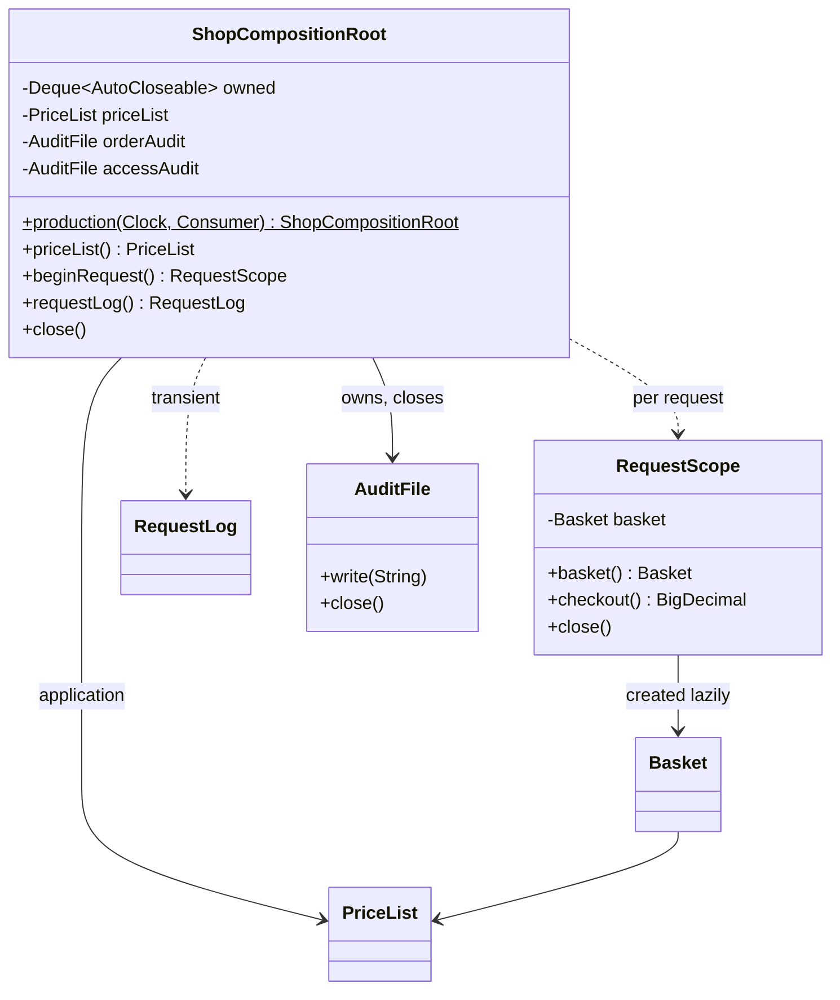

### Klasik Java

m03, bileşim kökünü `production()` ve `forTests(...)` ile tanıttı. Her sınıfın içindeki ilk karar, bağımlılıklarını
*nasıl* aldığıdır. Kurucu (constructor) enjeksiyonu onları görünür, zorunlu ve `final` yapar:

```java
// file: examples/di/styles/ConstructorInjected.java
public final class ConstructorInjected implements InvoiceNumberer {

    private final Clock clock;
    private final Supplier<Long> sequence;

    public ConstructorInjected(Clock clock, Supplier<Long> sequence) {
        this.clock = Objects.requireNonNull(clock, "clock");
        this.sequence = Objects.requireNonNull(sequence, "sequence");
    }
```

Setter enjeksiyonu nesnenin bağımlılıklarından önce var olmasına izin verir — her çağıran doğru çağrı sırasını
hatırlamak zorundadır (**zamansal bağlaşım**, temporal coupling) ve yarım kurulmuş bir nesne ancak çalışma zamanında
hata verir:

```java
// file: examples/di/styles/SetterInjected.java
    @Override
    public String next() {
        if (clock == null) {
            throw new IllegalStateException("clock not set");
        }
        if (sequence == null) {
            throw new IllegalStateException("sequence not set");
        }
        return InvoiceNumberer.format(LocalDate.now(clock), sequence.get());
    }
```

Gizli bağımlılıklar daha da kötüdür: kurucu hiçbir şey bildirmez, okuyucu — ve test — bir saatin işin içinde
olduğunu bile göremez:

```java
// file: examples/di/styles/HiddenDependencies.java
    private final Clock clock = Clock.systemDefaultZone(); // hidden: today's date, every time
    private long counter;                                  // hidden: cannot start at a known value
```

```text
constructor injection: INV-2026-09-0001, INV-2026-09-0002
  constructor parameters: [Clock, Supplier]
setter injection before configuration: clock not set
setter injection after both setters: INV-2026-09-0001
hidden dependencies: constructor parameters: []
  the system clock and the counter are created inside: a test cannot replace them
```

### Modern Java 27

Bileşim kökü aynı zamanda **yaşam sürelerinin** belirlendiği yerdir. Bunun için çatıya (framework) gerek yoktur:
*uygulama* ömürlü bir nesne bir kez oluşturulan bir alandır, *istek başına* bir nesne bir kapsamda (scope) yaşar,
*geçici* (transient) bir nesne her aramada yeniden oluşturulur. Kök, oluşturduğu her kaynağın sahibidir ve onları
oluşturma sırasının **tersine** kapatır:

```java
// file: examples/di/lifetimes/ShopCompositionRoot.java
    private final Deque<AutoCloseable> owned = new ArrayDeque<>(); // closed last-in, first-out
    private final PriceList priceList;                              // application lifetime
    private final AuditFile orderAudit;                             // application lifetime, owned resource
    private final AuditFile accessAudit;                            // application lifetime, owned resource
// ...
    /** Per-request lifetime: opens a new scope; close it when the request ends. */
    public RequestScope beginRequest() {
        ensureOpen();
        return new RequestScope(++requests, priceList, () -> new Basket(priceList), orderAudit);
    }

    /** Transient lifetime: a new instance on every call. */
    public RequestLog requestLog() {
        ensureOpen();
        return new RequestLog(++logs, accessAudit);
    }
```

`RequestScope`, `Basket` nesnesini `Supplier` ile tembel (lazy) oluşturur ve kapsam kapanana kadar paylaştırır; hem
kök hem kapsam `AutoCloseable` olduğundan demodaki try-with-resources yaşam sürelerini doğrudan ifade eder:

```text
request 1: same basket within the request: true
  disk> orders.audit 2026-09-30T10:00:00Z request 1 paid 27.00 for [book, pen]
request 2: new basket: true
request 2: same price list: true
  disk> orders.audit 2026-09-30T10:00:00Z request 2 paid 12.50 for [mug]
  disk> access.audit 2026-09-30T10:00:00Z log 1: GET /basket
  disk> access.audit 2026-09-30T10:00:00Z log 2: POST /checkout
transient logs are different objects: true
closing the root:
  disk> access.audit closed
  disk> orders.audit closed
```

### Bir kapsayıcı nasıl çalışır

Spring, Guice ve Jakarta CDI tam olarak bu bağlamayı otomatikleştirir. `MiniContainer` özü yaklaşık 100 satırda
gösterir: tek public kurucuyu bul, her parametre tipini özyinelemeli çöz, singleton'ları önbelleğe al ve döngüleri
yakalamak için çözüm yolunu tut. `Class.cast` sayesinde denetlenmemiş (unchecked) dönüşüm yoktur:

```java
// file: examples/di/container/MiniContainer.java
    private Object resolve(Class<?> type, List<Class<?>> path) {
        if (path.contains(type)) {
            throw new IllegalStateException("dependency cycle: " + describe(Stream.concat(path.stream(), Stream.of(type))));
        }
        Object existing = instances.get(type);
        if (existing != null) {
            return existing;
        }
        path.add(type);
        try {
            Object created = create(implementationOf(type, path), path);
            if (singletons.contains(type)) {
                instances.put(type, created);
            }
            return created;
        } finally {
            path.removeLast();
        }
    }
```

Bedeli demonun son satırında görünür: unutulmuş bir bağlama sorunsuz derlenir ve grafik ilk kez çözüldüğünde,
**çalışma zamanında** hata verir. Elle bağlamada aynı hata bileşim kökünde bir derleme hatasıdır.

```text
sales 2026-09-30: book=3, mug=1, pen=5
repository is a singleton: true
formatter is created fresh: true
forgotten binding, found only at run time: no binding for ReportRepository (resolving ReportService -> ReportRepository)
```

### Gerçek dünyada kullanım

Spring'in `ApplicationContext`'i (önerdiği biçim kurucu enjeksiyonudur; singleton ve request kapsamları), Google
Guice ve Dagger (Dagger bağlama kodunu derleme zamanında üretir — hatalar yeniden derleyiciye taşınır), uygulama
sunucularında Jakarta CDI, eklentiler için `java.util.ServiceLoader` ve nesnelerini elle kuran her küçük aracın düz
`main` metodu.

### Tuzaklar ve ne zaman KULLANILMAMALI

- **Service Locator** (bir metodun içinde `Registry.get(Mailer.class)`) DI değildir: bağımlılık yine gizlidir.
- **Her yerde kapsayıcı**: kapsayıcıyla yalnızca bileşim kökü konuşabilir; iş sınıfları konuşmamalıdır.
- **Yaşam süresi uyumsuzluğu**: istek başına bir nesneyi tutan bir singleton, bir kullanıcının verisini sonraki
  isteğe sızdırır.
- **On parametreli kurucu** bir tasarım kokusudur (çok fazla sorumluluk), DI sorunu değil.
- Küçük programlar ve betikler kapsayıcıya ihtiyaç duymaz — `new` çağıran bir `main` zaten *bir* bileşim köküdür.

### İlgili kalıplar

**Factory Method / Abstract Factory** (Fabrika Metodu / Soyut Fabrika, m02) nesne oluşturur; DI onları *kimin*
çağıracağına karar verir. Bağlamayla elde edilen **Singleton** (Tekil Nesne, m02) — kök başına tek örnek — statik
alanlı Singleton'ın yerini alır. **Strategy** (Strateji, m06) nesneleri tipik enjekte edilen işbirlikçilerdir.
**Facade** (Cephe, m05) çoğu zaman enjekte edilmiş bir grafiğin üstünde durur.

## Repository

### Problem

SQL dizgeleri, dosya biçimleri ve `Map` aramalarıyla dolu iş kodu, neye ihtiyaç duyduğunu ("30.00 altındaki tüm
kitaplar") nasıl saklandığıyla karıştırır. Depolamayı değiştirin, her çağıran değişir; mantığı test edin,
veritabanına ihtiyacınız olur.

### Amaç

> Alan nesnelerine erişmek için **koleksiyon benzeri bir arayüz** kullanarak alan ile veri eşleme katmanları arasında
> aracılık edin — aggregate başına bir Repository (Depo).

### Yapı

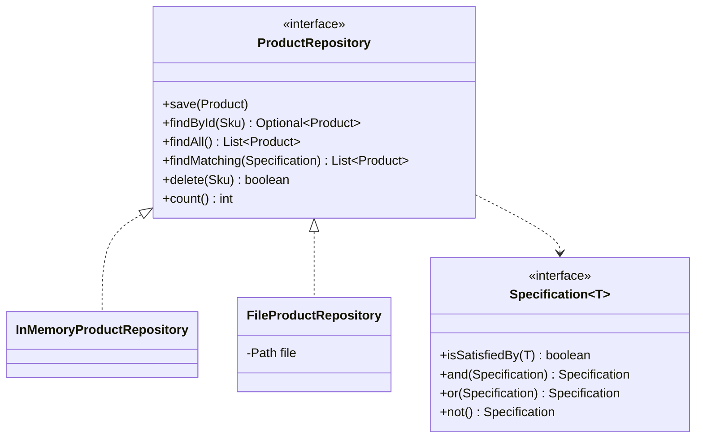

### Klasik Java

Klasik DAO her soru için bir bulucu metotla büyür — `findByCategory`, `findByCategoryAndMaxPrice`,
`findByNameOrCategory`, … Repository ise bir koleksiyon gibi görünür, tek sonuç için `Optional` ve **değiştirilemez**
listeler döndürür ve bir sorgu nesnesi alır:

```java
// file: examples/repository/catalog/ProductRepository.java
public interface ProductRepository {

    /** Adds {@code product}, or replaces the product with the same SKU. */
    void save(Product product);

    Optional<Product> findById(Sku sku);

    /** Every product, sorted by SKU. */
    List<Product> findAll();

    /** The products {@code specification} is satisfied by, sorted by SKU. */
    List<Product> findMatching(Specification<Product> specification);
```

### Modern Java 27

**Specification** (Belirtim) varsayılan birleştiricileri olan fonksiyonel bir arayüzdür; sorgular tek tek
sayılmaz, birleştirilir:

```java
// file: examples/repository/catalog/Specification.java
@FunctionalInterface
public interface Specification<T> {

    /** Whether {@code candidate} matches. */
    boolean isSatisfiedBy(T candidate);

    /** Both this and {@code other}. */
    default Specification<T> and(Specification<T> other) {
        Objects.requireNonNull(other, "other");
        return candidate -> isSatisfiedBy(candidate) && other.isSatisfiedBy(candidate);
    }
```

İki uygulama — sıralı bir map ve bir metin dosyası (`BOOK-1|Design Patterns|BOOKS|3990`) — dersin ödev
sözleşmeleriyle aynı biçimde **tek bir soyut sözleşme testinden**, `ProductRepositoryContract`'tan geçer. Çağıran kod
ikisi için de aynıdır; dosya sürümü bir "yeniden başlatmadan" bile sağ çıkar:

```text
== InMemoryProductRepository
all:                     [BOOK-1, BOOK-2, MUG-3, PEN-7]
books up to 30.00:       [BOOK-2]
"pattern" or stationery: [BOOK-1, MUG-3, PEN-7]
not books:               [MUG-3, PEN-7]
== FileProductRepository
all:                     [BOOK-1, BOOK-2, MUG-3, PEN-7]
books up to 30.00:       [BOOK-2]
"pattern" or stationery: [BOOK-1, MUG-3, PEN-7]
not books:               [MUG-3, PEN-7]
after a restart the file still holds 4 products; BOOK-1 costs 39.90
```

### İyimser sürümleme

Değiştirilebilir bir **aggregate** (küme) deposu yalıtılmış kopyalar verir. İki memur aynı siparişi yükleyebilir;
ikinci kaydeden, birincinin değişikliğini sessizce ezer (*kayıp güncelleme*). İyimser eşzamanlılık bir sürüm saklar
ve eski bir sürümden yapılan kaydı reddeder — JPA'nın `@Version`'ı da bunu yapar:

```java
// file: examples/repository/orders/InMemoryOrderRepository.java
    @Override
    public synchronized void save(Order order) {
        Objects.requireNonNull(order, "order");
        Order current = stored.get(order.id());
        long storedVersion = current == null ? 0 : current.version();
        if (order.version() != storedVersion) {
            throw new ConcurrentUpdateException(order.id(), order.version(), storedVersion);
        }
        order.savedAt(storedVersion + 1);
        stored.put(order.id(), order.copy());
    }
```

```text
created order-1 at version 1
ada and alan both load order-1 at version 1
ada adds BOOK-1 x 2 and saves: version 2
alan adds PEN-7 x 1 and saves: order-1 was changed concurrently: expected version 1 but found 2
stored: [BOOK-1 x 2] at version 2
alan reloads, re-applies and saves: [BOOK-1 x 2, PEN-7 x 1] at version 3
```

*Kötümser* kilitleme, ada işini bitirene kadar alan'ı bekletirdi; iyimser kilitleme ikisinin de çalışmasına izin
verir ve çakışmayı yakalar — çakışmalar seyrekse daha iyi seçimdir.

### Gerçek dünyada kullanım

Spring Data depoları (`CrudRepository`, `Specification` ile `JpaSpecificationExecutor`), JPA'nın `EntityManager`'ı ve
`@Version`'ı, Jakarta Data (Jakarta EE 11), Micronaut Data — ve bunların üstündeki kodu test etmek için kullanılan her
bellek içi fake.

### Tuzaklar ve ne zaman KULLANILMAMALI

- Tablo başına değil, **aggregate başına** bir depo: `OrderRepository`'nin yanında `OrderLineRepository` olmaz.
- Değiştirilebilir iç nesneler döndürmek, çağıranların "saklanan" veriyi deponun arkasından değiştirmesine izin
  verir.
- Her şey için genel bir `Repository<T, ID>` sorgu ayrıntılarını yeniden sızdırma eğilimindedir; arayüzü alanın
  diliyle tutun.
- Birçok tabloyu kapsayan raporlama sorguları için sade bir sorgu nesnesi (ya da SQL), bir depoya zorlamaktan daha
  basittir.

### İlgili kalıplar

**Adapter** (Adaptör, m04): her depo uygulaması bir depolama teknolojisini uyarlar. **Specification** küçük bir
**Interpreter**/**Composite**'tir (Yorumlayıcı/Bileşik, m05, m08). **Unit of Work** (iş birimi, aşağıda) depo
değişikliklerinin ne zaman commit edileceğine karar verir.

## Ports and Adapters

### Problem

Klasik katmanlı bir uygulamada alan, kalıcılığın *üstünde* durur: `Invoice.save()` bir DAO çağırır, DAO bir
`Invoice` alır. Derlenir ve çalışır — ama artık alan veritabanı olmadan ne test edilebilir, ne yeniden kullanılabilir,
ne de anlaşılabilir:

```java
// file: examples/erosion/domain/Invoice.java
    /** The shortcut that erodes the architecture: domain → adapter. */
    public String save() {
        return new InvoiceDao().store(this);
    }
```

### Amaç

> Uygulamanın çekirdeğini ortaya koyun ve dış dünyayla yalnızca **portlar** — çekirdeğin sahip olduğu arayüzler —
> üzerinden konuşmasına izin verin. Kenardaki **adaptörler** bu portları uygular ya da çağırır; bağımlılıklar her
> zaman **içeriye** doğru işaret eder. Ports and Adapters (Portlar ve Adaptörler), diğer adıyla Altıgen Mimari budur.

### Yapı

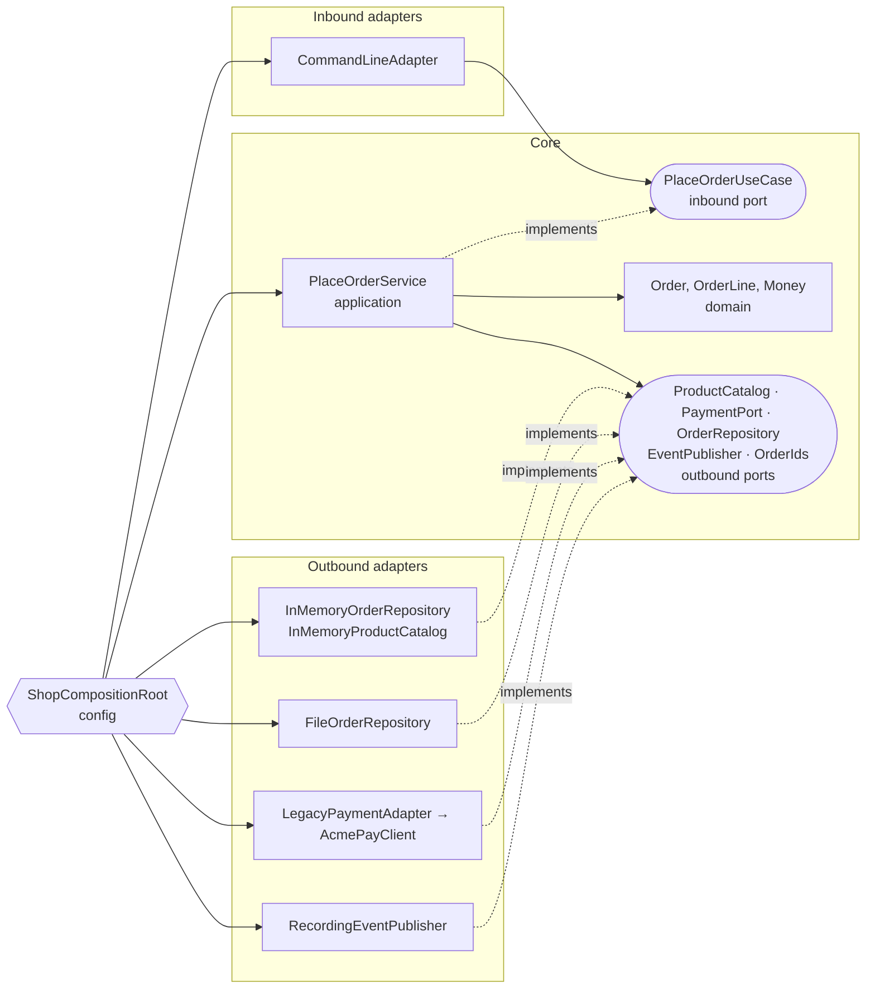

**Giriş portu** (inbound) kullanım senaryosudur (`TransferMoneyUseCase`, `PlaceOrderUseCase`); **çıkış portları**
(outbound) çekirdeğin dünyadan ihtiyaç duyduklarıdır (`LoadAccountPort`, `PaymentPort`, …). İkisinin de sahibi
çekirdektir. Adaptör sınıflarını yalnızca `config` içindeki bileşim kökü bilir.

### Klasik Java

En küçük altıgen bir para transferidir. Uygulama servisi giriş portunu uygular ve iki dar çıkış portu kullanır;
yalnızca elle yazılmış fake'lerle test edilir, test yolunda hiçbir adaptör yoktur:

```java
// file: examples/hexagonal/transfer/application/TransferService.java
public final class TransferService implements TransferMoneyUseCase {

    private final LoadAccountPort loadAccount;
    private final SaveAccountPort saveAccount;
    private final Money limit;
// ...
        if (!source.get().canWithdraw(command.amount())) {
            return new TransferResult.Rejected("insufficient funds");
        }
        source.get().withdraw(command.amount());
        target.get().deposit(command.amount());
        saveAccount.save(source.get());
        saveAccount.save(target.get());
        return new TransferResult.Transferred(command.from(), command.to(), command.amount());
```

### Modern Java 27

İş sonuçları istisna değil, **mühürlü (sealed) bir sonuçtur**: reddedilen bir transfer beklenen bir cevaptır, bozuk
bir disk değildir. Giriş adaptörü yalnızca metin ↔ komut/sonuç çevirisi yapar; eksiksiz bir `switch`, bir record
deseni ve isimsiz desen `_` ile:

```java
// file: examples/hexagonal/transfer/application/TransferResult.java
public sealed interface TransferResult {

    /** The money moved. */
    record Transferred(AccountId from, AccountId to, Money amount) implements TransferResult {}
```

```java
// file: examples/hexagonal/transfer/adapter/inbound/TextTransferController.java
        var command = new TransferCommand(new AccountId(words[1]), new AccountId(words[2]), amount);
        return switch (useCase.transfer(command)) {
            case Transferred _ -> "OK";
            case Rejected(String reason) -> "REJECTED " + reason;
        };
```

```text
> transfer A-1 A-2 25.00
OK
> transfer A-2 A-1 500.00
REJECTED insufficient funds
> transfer A-1 A-1 1.00
REJECTED same source and target account
> transfer A-1 A-9 1.00
REJECTED unknown account: A-9
> transfer A-1 A-2 5000.00
REJECTED amount exceeds the limit of 1000.00
> send money
usage: transfer <from> <to> <amount>
balances: {A-1=75.00, A-2=45.00}
```

### PatternShop

Bitirme projesinin mimarisinin küçük bir modeli. `PlaceOrderService` beş çıkış portuna ve alana bağlıdır — asla bir
adaptöre değil. Doğrular, tahsil eder, kaydeder **ve ancak ondan sonra** aggregate'in kaydettiği olayları yayımlar:

```java
// file: examples/hexagonal/shop/application/PlaceOrderService.java
        if (!payments.charge(command.customer(), Order.totalOf(lines))) {
            return new PlaceOrderResult.Rejected("payment declined");
        }
        Order order = Order.place(ids.next(), command.customer(), lines);
        orders.save(order);                          // commit first …
        order.pullEvents().forEach(events::publish); // … then tell the world
        return new PlaceOrderResult.Placed(order.id(), order.total());
```

Ödeme sağlayıcısının SDK'sı durum kodlarıyla konuşur. m04'teki bir **Adapter** (Adaptör) onu çekirdeğin
`PaymentPort`'una çevirir — reddedilen kart bir iş cevabıdır, bilinmeyen bir kod ise altyapı hatasıdır:

```java
// file: examples/hexagonal/shop/adapter/outbound/payment/LegacyPaymentAdapter.java
    @Override
    public boolean charge(String customer, Money amount) {
        int code = client.pay(customer, amount.cents());
        return switch (code) {
            case 0 -> true;   // approved
            case 51 -> false; // insufficient funds: declined
            default -> throw new IllegalStateException("AcmePay failed with status code " + code);
        };
    }
```

Bellekten dosyalara geçmek, bileşim kökündeki **tek bir argümanı** değiştirir:

```java
// file: examples/hexagonal/shop/config/ShopCompositionRoot.java
    /** Everything in memory: fast, for tests and demos. */
    public static ShopCompositionRoot inMemory() {
        return wire(new InMemoryOrderRepository());
    }

    /** Orders in {@code ordersFile}; ids continue after the orders already stored there. */
    public static ShopCompositionRoot fileBacked(Path ordersFile) {
        return wire(new FileOrderRepository(ordersFile));
    }
```

Aynı kullanım senaryosu sözleşmesi iki kök için de çalışır; demo aynı oturumu ikisinde de oynatır:

```text
== in memory
> place alice BOOK-1:2 PEN-7:1
PLACED order-1 total 47.00
> place bob TOY-9:1
REJECTED unknown product: TOY-9
> place carol BOOK-1:30
REJECTED payment declined
> place dave
usage: place <customer> <sku>:<quantity>...
payment calls: [alice 4700, carol 60000], orders saved: 1
published: [OrderPlaced[orderId=order-1, customer=alice, total=47.00]]
== file backed
> place alice BOOK-1:2 PEN-7:1
PLACED order-1 total 47.00
> place bob TOY-9:1
REJECTED unknown product: TOY-9
> place carol BOOK-1:30
REJECTED payment declined
> place dave
usage: place <customer> <sku>:<quantity>...
payment calls: [alice 4700, carol 60000], orders saved: 1
published: [OrderPlaced[orderId=order-1, customer=alice, total=47.00]]
after a restart: order-1 for alice, total 47.00
> place erin MUG-3:1
PLACED order-2 total 8.75
```

### Gerçek dünyada kullanım

Alistair Cockburn'ün altıgen mimarisi, Robert C. Martin'in *Clean Architecture*'ı ve Jeffrey Palermo'nun *Onion
Architecture*'ı farklı çizimlerle aynı fikirdir. `domain` / `application` / `adapter` paketlerine ayrılmış Spring Boot
uygulamaları, Quarkus ve Micronaut projeleri ve rolleri işaretleyen jMolecules gibi kütüphaneler bu yaklaşımı izler.

### Tuzaklar ve ne zaman KULLANILMAMALI

- **Adaptörün diliyle portlar** (`JpaOrderPort`, `saveEntity`) teknolojiyi çekirdeğe geri sızdırır.
- **Tablo ya da metot başına bir port** düzinelerce arayüze patlar; bir kullanım senaryosunun ihtiyacına göre
  gruplayın.
- **Eşleme maliyeti**: alan nesneleri ↔ kalıcılık nesneleri ↔ DTO'lar kod demektir; tek tablolu bir CRUD ekranı
  altıgene ihtiyaç duymaz.
- Başka bir adaptörü çağıran bir adaptör (CLI → doğrudan dosya deposu) çekirdeği sessizce atlar.

### İlgili kalıplar

**Adapter** (m04) kelimenin tam anlamıyla dış halkadır. **Facade** (m05), bir giriş portunun dışarıdan görünüşüdür.
**Repository** en yaygın çıkış portudur. Bileşim kökündeki **Dependency Injection** hepsini birbirine takar;
**mimari kurallar** (aşağıda) öyle kalmasını sağlar.

## Alan olayları (domain events)

### Problem

Bir sipariş ödendikten sonra stok ayrılmalı, e-posta gönderilmeli ve analitik güncellenmelidir. Ödeme kodu hepsini
doğrudan çağırırsa her yeni tepki onu değiştirir. Bir Observer (Gözlemci) *varlığın içinden* çağrılırsa dinleyiciler
değişiklik kaydedilmeden **önce** çalışır — kayıt sonra başarısız olursa müşteri, var olmayan bir sipariş için çoktan
e-posta almıştır. Sıkı bağlanmış (hard-wired) sürümü tanımak kolaydır:

```java
// file: examples/refactoring/notifications/before/RegistrationService.java
        mailer.sendWelcome(email);
        crm.createContact(email);
        analytics.track("signup", email);
```

### Amaç

> Aggregate'in olanları değiştirilemez olaylar olarak **kaydetmesine** izin verin ve onları değişiklik commit
> edildikten **sonra** yayımlayın — böylece aboneler yalnızca gerçekleri duyar. Bunlar alan olaylarıdır (domain
> events).

### Yapı

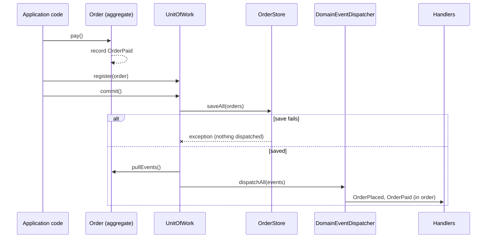

### Klasik Java

m07'nin tipli olay veri yolu dağıtıcıdır; m11 buna **zamanlama kuralını** ekler. Aggregate yalnızca özel bir listeye
ekler; her geçiş korunur ve geçersiz bir geçiş, herhangi bir şey kaydedilmeden *önce* istisna fırlatır:

```java
// file: examples/events/aggregate/Order.java
    public void pay() {
        require("pay", OrderStatus.PLACED);
        status = OrderStatus.PAID;
        pendingEvents.add(new OrderEvent.OrderPaid(id));
    }
// ...
    /** Hands out the recorded events and forgets them: each event leaves the aggregate exactly once. */
    public List<OrderEvent> pullEvents() {
        List<OrderEvent> events = List.copyOf(pendingEvents);
        pendingEvents.clear();
        return events;
    }
```

### Modern Java 27

Olaylar, geçmiş zamanla adlandırılmış record'lardan oluşan mühürlü bir hiyerarşidir. **Unit of Work** (iş birimi)
önce kaydeder, sonra dağıtır; `saveAll` istisna fırlatırsa dağıtım satırına hiç ulaşılmaz:

```java
// file: examples/events/aggregate/UnitOfWork.java
    /** 1. save every registered order (may throw — then nothing is dispatched); 2. dispatch their events. */
    public void commit() {
        store.saveAll(registered);
        List<OrderEvent> events = new ArrayList<>();
        for (Order order : registered) {
            events.addAll(order.pullEvents());
        }
        registered.clear();
        dispatcher.dispatchAll(events);
    }
```

Dağıtıcı, işleyicilerin ürettiği olayları mevcut olayın arkasında kuyruğa alır ve başarısız bir işleyicinin
istisnasını enjekte edilmiş bir hata işleyiciye gönderir — commit zaten gerçekleşmiştir ve bir e-posta sunucusu
yüzünden geri alınmamalıdır:

```java
// file: examples/events/aggregate/DomainEventDispatcher.java
    private void deliver(B event) {
        for (Handler<?> handler : handlers) {
            try {
                handler.deliver(event);
            } catch (RuntimeException e) { // reported, not swallowed: the other handlers still run
                errorHandler.accept(e);
            }
        }
    }
```

```text
recorded, not committed yet: nothing dispatched
mail: order order-1 confirmed, total 47.00
audit: OrderPlaced[orderId=order-1, totalCents=4700]
stock: reserved for order-1
audit: OrderPaid[orderId=order-1]
stored: {order-1=PAID}
commit failed (store unavailable): stored {order-1=PAID}, nothing dispatched
illegal transition: cannot pay order-1: it is CANCELLED
audit: OrderCancelled[orderId=order-1, reason=customer changed their mind]
stored: {order-1=CANCELLED}
```

### İşlemsel giden kutusu

Commit sonrasında süreç içi dağıtımın hâlâ bir açığı vardır: süreç commit ile dağıtım *arasında* çökebilir ya da
mesaj aracısı (broker) kapalı olabilir. **İşlemsel giden kutusu** (transactional outbox) olayları durumla aynı depoya,
aynı işlemde yazar — ve bir aktarıcı (relay) onları sonra gönderir:

```java
// file: examples/events/outbox/OutboxOrderStore.java
        for (OrderEvent event : order.pullEvents()) {
            outbox.add(new OutboxEntry(++sequence, event.getClass().getSimpleName(), payload(event), false));
        }
        state = new State(orders, List.copyOf(outbox)); // the "transaction": state and events in one step
```

Aktarıcı sıra numarasına göre yayımlar ve her kaydı aracı kabul ettikten *sonra* işaretler. İkisi arasındaki bir
çökme, kaydı bir sonraki sefer yeniden gönderir: teslimat **en az bir kezdir** (at-least-once), bu yüzden tüketiciler
**idempotent** olmalıdır:

```java
// file: examples/events/outbox/IdempotentConsumer.java
    public boolean receive(OutboxEntry entry) {
        if (!processed.add(entry.sequence())) {
            duplicates++;
            return false;
        }
        handler.accept(entry);
        return true;
    }
```

```text
saved order-1 with its events: pending [1, 2]
write failed (disk full): orders {order-1=PAID}, outbox entries 2
relay failed (broker unavailable): pending [1, 2]
relay failed (relay crashed before marking 1): pending [1, 2]
relayed 2: pending []
consumer processed: [1 OrderPlaced order-1 4700, 2 OrderPaid order-1], duplicates ignored: 1
```

### Gerçek dünyada kullanım

Spring'in `@TransactionalEventListener(phase = AFTER_COMMIT)`'i ve Spring Data'nın `@DomainEvents` /
`AbstractAggregateRoot`'u, Axon Framework, Debezium'un outbox olay yönlendiricisi (outbox tablosunda değişiklik
yakalama), anahtara göre tekilleştiren Kafka tüketicileri ve aldığınız her "siparişiniz onaylandı" e-postası.

### Tuzaklar ve ne zaman KULLANILMAMALI

- **Aggregate'in içinde** ya da commit'ten önce dağıtım, hiç gerçekleşmeyebilecek değişiklikleri duyurur.
- **Komut gibi olaylar** (`OrderPlaced` yerine `SendEmail`) yayıncıyı yeniden tek bir tepkiye bağlar.
- **Büyük yükler** ya da değiştirilebilir olaylar; onları kimlik taşıyan küçük, değiştirilemez record'lar olarak
  tutun.
- Ağ üzerinden **tam bir kez teslimat** yoktur; bunun yerine idempotent tüketiciler tasarlayın.
- Değişiklikle birlikte başarılı olması gereken tek, senkron bir tepki bir olay değil, düz bir metot çağrısıdır.

### İlgili kalıplar

**Observer** (Gözlemci, m07) mekanizmadır; alan olayları *ne*'yi (geçmiş zamanlı gerçekler) ve *ne zaman*'ı (commit
sonrası) ekler. **Command** (Komut, m06) bir şeyin olmasını ister; olay olduğunu söyler. **Unit of Work** ve
**Repository** commit'e karar verir; **giden kutusu**, `EventPublisher` portunun arkasındaki bir çıkış adaptörüdür.

## Anti-kalıplar ve kalıplara doğru yeniden düzenleme

### Önce karakterizasyon testleri

Bir **anti-kalıp** (anti-pattern), makul görünen ama çözdüğünden fazla sorun yaratan yaygın bir cevaptır. Ondan
uzaklaşan bir yeniden düzenleme (refactoring) ancak davranış önce sabitlenirse güvenlidir. Bir **karakterizasyon
testi** kodun *bugün ne yaptığını* — doğru ya da yanlış — kaydeder ve ardından yeniden düzenlenmiş sürüme karşı
değiştirilmeden çalışır:

```java
// file: examples/antipatterns/GodClassTest.java
    @CsvSource(delimiter = '|', textBlock = """
            alice | REGULAR  |  3 |  3000 | OK order-1 90.00
            bob   | VIP      |  2 |  5000 | OK order-1 90.00
            carol | EMPLOYEE |  1 | 10000 | OK order-1 70.00
            dave  | VIP      | 10 |  1000 | OK order-1 85.50
// ...
        String old = before.checkout(customer, type, quantity, price);
        String refactored = after.checkout(new CheckoutRequest(customer, type, quantity, price));
        assertThat(old).isEqualTo(expected);
        assertThat(refactored).isEqualTo(old);
        assertThat(mailer.sent()).isEqualTo(before.sentEmails());
        assertThat(log).isEqualTo(before.logLines());
```

### Tanrı sınıf

`OrderManager` doğrular, bir tip koduna göre `if/else` ile fiyatlar, bir map'te saklar, e-posta metni yazar ve günlük
tutar — 12 public metot, her değişiklik ona dokunur. Sorumluluklara göre bölündüğünde her parça zaten bildiğiniz bir
kalıba dönüşür: Chain of Responsibility (Sorumluluk Zinciri), Strategy, Repository, Facade:

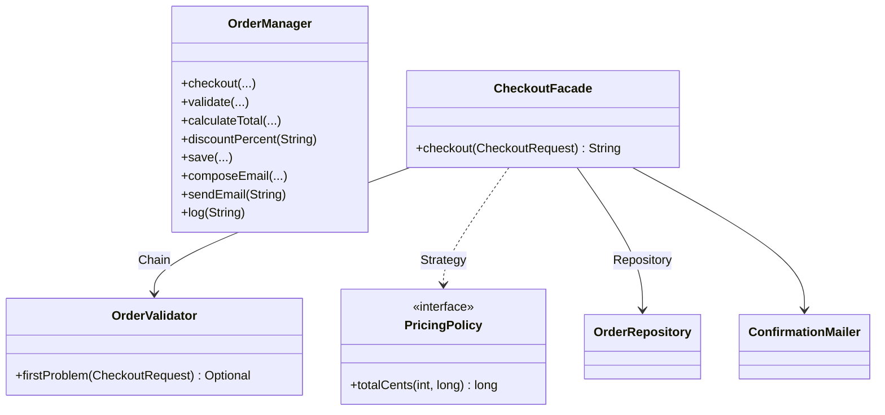

```java
// file: examples/antipatterns/godclass/after/CheckoutFacade.java
        long total = PricingPolicy.forCustomerType(request.customerType()).orElseThrow()
                .totalCents(request.quantity(), request.unitPriceCents());
        var order = new PlacedOrder(orders.nextId(), request.customer(), request.quantity(), total);
        orders.save(order);
        mailer.sendConfirmation(order);
```

```text
alice: before OK order-1 90.00 | after OK order-1 90.00
bob: before OK order-2 85.50 | after OK order-2 85.50
carol: before OK order-3 70.00 | after OK order-3 70.00
dave: before REJECTED unknown customer type: GOLD | after REJECTED unknown customer type: GOLD
erin: before REJECTED invalid quantity | after REJECTED invalid quantity
same e-mails: true, same log: true
public methods: OrderManager 12
after the split: CheckoutFacade 1, OrderValidator 2, PricingPolicy 2, OrderRepository 4, ConfirmationMailer 2
```

### Kansız alan modeli

Bir yanda getter ve setter'lar, diğer yanda bir serviste tüm kurallar: kurallar yalnızca servisi hatırlayan
çağıranlar için geçerlidir. **Zengin alan modeli** davranışı verinin yanında tutar ve etrafından dolanılacak bir
setter'ı yoktur:

```mermaid
classDiagram
    class AnaemicAccount["before.Account"] {
        +getBalanceCents() long
        +setBalanceCents(long)
        +setClosed(boolean)
    }
    class AccountService {
        +deposit(Account, long)
        +withdraw(Account, long)
    }
    class RichAccount["after.Account"] {
        -Money balance
        +deposit(Money)
        +withdraw(Money)
        +close()
    }
    AccountService --> AnaemicAccount : changes from outside
```

```java
// file: examples/antipatterns/anaemic/after/Account.java
    public void withdraw(Money amount) {
        requireUsable(amount);
        if (amount.compareTo(balance) > 0) {
            throw new IllegalArgumentException("insufficient funds");
        }
        balance = balance.minus(amount);
    }
```

```text
before: balance 75.00
after:  balance 75.00
before: setBalanceCents(-5000) accepted, balance -50.00
after:  withdraw 80.00 -> insufficient funds, balance still 75.00
after:  deposit to a closed account -> account is closed
```

### Singleton ve Service Locator kötüye kullanımı

Yalan söyleyen argümansız bir kurucu: servis stok seviyelerine ve bir politikaya ihtiyaç duyar ama ikisini de global
durumdan çeker. Bir testin ayarladığı durum, birisi `ServiceLocator.reset()`'i hatırlamadıkça bir sonrakinde
görünür. (Bu paket, m11'de değiştirilebilir statik duruma izin verilen tek yerdir — bir ArchUnit kuralı bunu
denetler.)

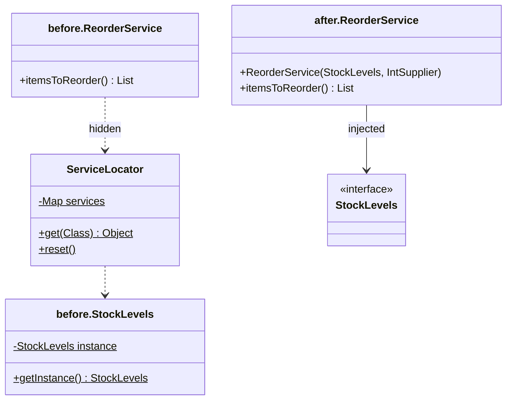

```java
// file: examples/antipatterns/globalstate/before/ReorderService.java
    public List<String> itemsToReorder() {
        StockLevels stock = ServiceLocator.get(StockLevels.class);   // hidden dependency 1
        int minimum = ServiceLocator.get(ReorderPolicy.class).minimumUnits(); // hidden dependency 2
```

```text
before, scenario 1: reorder [PEN-7]
before, scenario 2: reorder [MUG-3, PEN-7]  <- PEN-7 leaked in
after, scenario 1: reorder [PEN-7]
after, scenario 2: reorder [MUG-3]
```

### Patternitis

**Spekülatif genellik**: tek alt sınıflı bir Template Method (Şablon Metot) ile gerçekleştirilmiş bir Strategy'yi
oluşturan bir fabrika için bir sağlayıcı — "Good day, Ada." yazdırmak için beş tip. İkinci bir varyasyonu olmayan bir
kalıp tasarım değil, maliyettir:

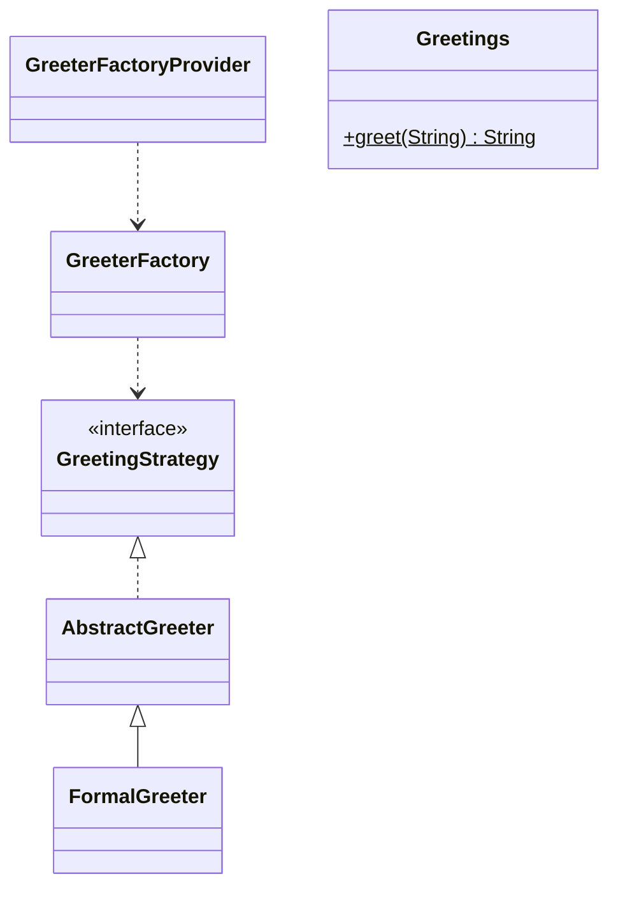

```java
// file: examples/antipatterns/patternitis/after/Greetings.java
    private static final Function<String, String> FORMAL = name -> "Good day, " + name + ".";

    private Greetings() {}

    public static String greet(String name) {
        return FORMAL.apply(name == null || name.isBlank() ? "guest" : name.strip());
    }
```

### Tip kodunu mühürlü bir tiple değiştirmek

İç içe `if`'lerle bir `String` kodu üzerinde `switch`; bilinmeyen bir kod sessizce ücretsiz kargo demektir. Adım
adım — *Metot Çıkar* (Extract Method), mühürlü bir tip tanıt, mantığı taşı, dizgeyi sil — kontrolü derleyici
devralır:

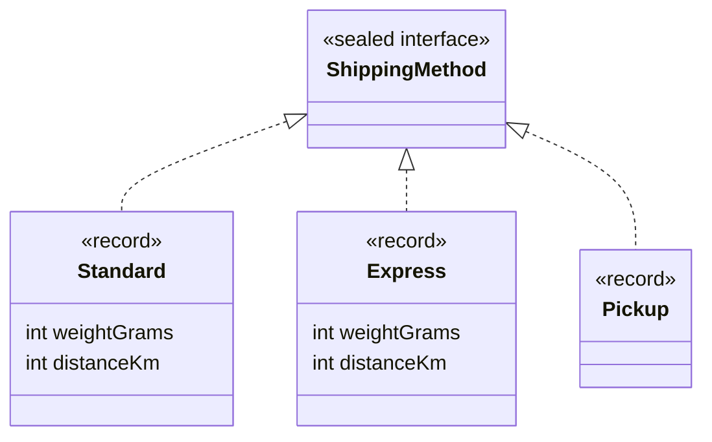

```java
// file: examples/refactoring/shipping/after/ShippingCalculator.java
    public long costCents(ShippingMethod method) {
        return switch (method) {
            case Standard(int weight, int distance) -> 499 + 100 * startedKilosAbove(2000, weight)
                    + (distance > 500 ? 300 : 0);
            case Express(int weight, int distance) -> (999 + 200 * startedKilosAbove(1000, weight))
                    * (distance > 500 ? 2 : 1);
            case Pickup _ -> 0;
        };
    }
```

`default` dalı yok: dördüncü bir kargo yöntemi, fiyatlandırılana kadar bu sınıfın derlenmemesine yol açar.

```text
STANDARD 2500 g 100 km before 5.99 | after 5.99
EXPRESS  1500 g 600 km before 23.98 | after 23.98
PICKUP                 before 0.00 | after 0.00
EXPRES (typo)          before 0.00 | after: does not compile — there is no such record
```

### Sıkı bağlı çağrıları olaylarla değiştirmek

Alan olayları bölümündeki kayıt servisinin üç işbirlikçisi vardı. Yeniden düzenlemeden sonra bir tane kalır ve yeni
bir tepki yeni bir aboneliktir — servis değişmez:

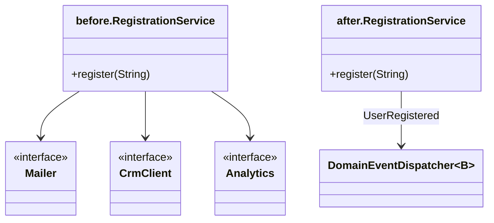

```java
// file: examples/refactoring/notifications/after/RegistrationService.java
    public void register(String email) {
        if (!Objects.requireNonNull(email, "email").contains("@")) {
            throw new IllegalArgumentException("invalid e-mail: " + email);
        }
        events.dispatch(new UserRegistered(email));
    }
```

### Anti-kalıp kataloğu

| Anti-kalıp | Belirti | Maliyet | Şuna dönüştürün |
|---|---|---|---|
| Tanrı sınıf (god class) | 10+ public metot, değişmek için birçok neden | her değişiklik ona dokunur, hiçbir şey yeniden kullanılamaz | Chain, Strategy, Repository, Facade — her biri tek sorumluluk |
| Kansız alan modeli | yalnızca getter/setter'lı varlıklar, kurallar servislerde | değişmezler (invariant) atlatılabilir | davranışı varlığa taşıyın, setter'ları kaldırın |
| Singleton / Service Locator kötüye kullanımı | metotların içinde `getInstance()` / `Registry.get(...)`, argümansız kurucular | gizli bağımlılıklar, testler arasında durum sızıntısı | kurucu enjeksiyonu, bileşim kökü |
| Patternitis | tek uygulamalı arayüzler, fabrikaların fabrikaları | varyasyonsuz dolaylılık | satır içine alın; kalıbı ikinci durum geldiğinde ekleyin |
| Tip kodu koşulları | birçok yerde tekrarlanan dize/sayı `switch`'leri | bilinmeyen kod sessiz bir hatadır | mühürlü tip + eksiksiz `switch` (ya da çok biçimlilik) |
| Sıkı bağlı yan etkiler | e-posta, CRM, analitiği doğrudan çağıran bir servis | her yeni tepki servisi değiştirir | alan olayları + aboneler |

## Test ikizleri

### Problem

`CheckoutService` fiyatlara, bir ödeme ağ geçidine, bir makbuz deposuna, bir bildiriciye ve bir denetim günlüğüne
ihtiyaç duyar. Gerçeklerini kullanan bir birim testi yavaş, kararsızdır ve gerçek para tahsil eder; her şey için bir
mock kütüphanesi kullanan bir test ise çoğu zaman davranış yerine uygulamayı test eder.

### Amaç

> Bir testte bir işbirlikçiyi, testin sorduğu soru için yeterince akıllı bir **test ikiziyle** değiştirin — ve ikizin
> türünü o soruya göre seçin.

### Yapı

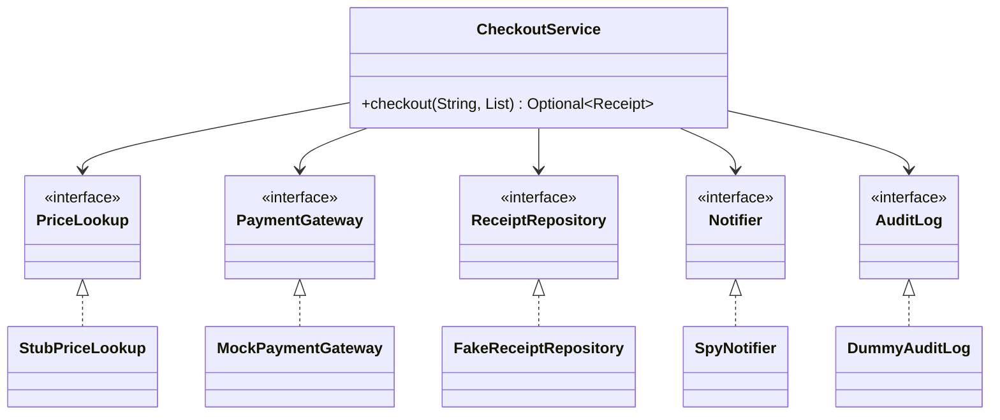

### Klasik Java

Mock kütüphaneleri (Mockito) ikizleri çalışma zamanında üretir. Elle yazıldığında bir **mock** küçük bir sınıftır:
çağrıdan önce beklentiler, beklenmeyen bir çağrıda hızlı hata ve sonda `verify()`:

```java
// file: examples/testdoubles/checkout/doubles/MockPaymentGateway.java
    @Override
    public Optional<String> charge(String customer, long cents) {
        Expectation next = expected.peekFirst();
        if (next == null || !next.customer().equals(customer) || next.cents() != cents) {
            throw new AssertionError("unexpected charge " + customer + " " + cents + ", expected "
                    + (next == null ? "no charge" : next));
        }
        expected.removeFirst();
        return next.approve() ? Optional.of("TX-" + ++transactions) : Optional.empty();
    }
```

### Modern Java 27

Fonksiyonel arayüzler çoğu stub ve spy'ı tek satıra indirir — bir `Map` üzerinde bir lambda ya da bir `List::add`.
Zaman da bir işbirlikçidir: yalnızca test söylediğinde ilerleyen sahte (fake) bir `Clock`, süre dolmasını
`Thread.sleep` olmadan milisaniyesine kadar test eder:

```java
// file: examples/testdoubles/time/MutableClock.java
    /** Moves time forward (or backward, for a negative duration). */
    public void advance(Duration duration) {
        now.instant = now.instant.plus(duration);
    }
```

```java
// file: examples/testdoubles/SessionExpiryTest.java
    @Test
    void sessionIsValidJustBeforeTheTtlAndExpiredAtExactlyTheTtl() {
        String token = sessions.login("ada");
        clock.advance(TTL.minusMillis(1));
        assertThat(sessions.isValid(token)).isTrue();
        clock.advance(Duration.ofMillis(1));
        assertThat(sessions.isValid(token)).isFalse();
```

```text
mock verified: alice charged 2700
fake finds the receipt: true
spy recorded: [alice: receipt TX-1 for 27.00]
mock, unexpected call: unexpected charge alice 2000, expected no charge
mock, verify: missing expected charge: bob 700
declined: Optional.empty, audit [declined carol 700]
```

### Hangi ikiz ne zaman

| İkiz | Ne yapar | Neyi doğrular | Ne için kullanın | Örnek |
|---|---|---|---|---|
| Dummy (yer tutucu ikiz) | bir parametreyi doldurur, kullanılırsa hata verir | hiçbir şeyi (ya da kullanılmadığını) | test edilen yolun dokunmaması gereken işbirlikçiler | `DummyAuditLog` |
| Stub | hazır cevaplar döndürür | hiçbir şeyi | kodun cevap beklediği sorgular | `StubPriceLookup` |
| Fake | gerçek, basitleştirilmiş bir uygulama | durumu, sonradan | davranışı olan depolar ve servisler (bellek içi depo) | `FakeReceiptRepository` |
| Spy | çağrıları argümanlarıyla kaydeder | etkileşimleri, sonradan | giden mesajlar (bildirimler, olaylar) | `SpyNotifier` |
| Mock | programlanmış beklentiler, hızlı hata | etkileşimleri, çağrı sırasında ve `verify()`'da | çağrının *kendisi* davranış olan komutlar (para tahsili) | `MockPaymentGateway` |

**Durum doğrulaması** (klasikçi yaklaşım: fake depoyu sonradan kontrol et) yeniden düzenlemelere **etkileşim
doğrulamasından** (mockçu yaklaşım: hangi çağrıların yapıldığını kontrol et) daha iyi dayanır. Durumu tercih edin;
mock'ları dış dünyaya giden komutlar için kullanın.

### Gerçek dünyada kullanım

Mockito, EasyMock ve MockK (Kotlin); Spring'in `MockMvc`'si; Testcontainers (fake olarak gerçek bir veritabanı);
WireMock (sahte bir HTTP sunucusu); JDK'nın kendisinde `java.time.Clock.fixed` ve `Clock.offset`.

### Tuzaklar ve ne zaman KULLANILMAMALI

- **Sahibi olmadığınız tipleri mock'lamak** (bir sağlayıcı SDK'sı) SDK'yı değil, onun hakkındaki varsayımlarınızı test
  eder; onu bir adaptöre sarın ve *kendi* portunuzu mock'layın.
- **Aşırı belirlenmiş mock'lar** her zararsız yeniden düzenlemede kırılır.
- Gerçek uygulamadan uzaklaşan bir fake; ikisine karşı aynı **sözleşme testini** çalıştırın (`repository.catalog`'un
  yaptığı gibi).
- Değer nesnelerinin (`Money`, record'lar) ikizini yazmayın — gerçeklerini kullanın.

### İlgili kalıplar

**Ports and Adapters** ikizlerin takıldığı dikiş yerlerini oluşturur; **Dependency Injection** onları içeri verir;
**Repository** sözleşmeleri fake'leri dürüst tutar.

## Mimari kurallar

### Problem

Mimari her seferinde bir kestirme ile aşınır (mimari aşınma). Bir DAO çağıran `Invoice.save()` derlenir, testlerinden
geçer ve çalışır — derleyici bir bağımlılığın yanlış yöne işaret ettiğini göremez. Wiki sayfaları ve kod incelemeleri
unutur.

```text
stored invoice INV-1 (99.00)
compiles and runs — the broken dependency direction is invisible to javac
```

### Amaç

> Mimariyi testlerle birlikte çalışan ve bir bağımlılık, döngü ya da adlandırma kuralı ihlal edildiğinde derlemeyi
> kıran **çalıştırılabilir kurallara** dönüştürün.

### Yapı

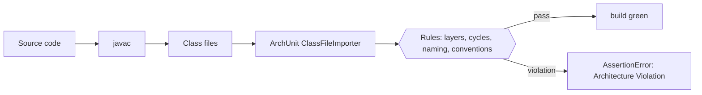

### Klasik Java

ArchUnit kaynak kodu değil, **bytecode**'u okur. Düz bir JUnit testi sınıfları bir kez içe aktarır ve kuralları
onlara karşı denetler. Soğan (onion) kuralı bir altıgen için iki ayara ihtiyaç duyar: isteğe bağlı katmanlar
("domain service" katmanı yok) ve görmezden gelinen bir bileşim kökü (her adaptöre ulaşması *gerekir*):

```java
// file: architecture/HexagonalShopArchitectureTest.java
        onionArchitecture()
                .domainModels("..shop.domain..")
                .applicationServices("..shop.application..")
                .adapter("cli", "..shop.adapter.inbound.cli..")
                .adapter("memory", "..shop.adapter.outbound.memory..")
                .adapter("file", "..shop.adapter.outbound.file..")
                .adapter("payment", "..shop.adapter.outbound.payment..")
                .adapter("events", "..shop.adapter.outbound.events..")
                .withOptionalLayers(true) // there is no "domain service" layer here
                .ignoreDependency(resideInAPackage("..shop.config.."), alwaysTrue()) // the root may wire anything
                .check(SHOP);
```

Aşınmış fatura kodunda aynı türden kurallar başarısız olur — `ErosionRulesTest` tam olarak bunu doğrular — ve mesaj
`Invoice.save()`'i ve `Slice adapter -> Slice domain -> Slice adapter` döngüsünü adıyla verir.

### Modern Java 27

ArchUnit JUnit motoru biçimi kuralları alan (field) olarak bildirir. m11 bunu bir kez, ders kuralları için kullanır —
"`src/main`'de dış bağımlılık yok" ve değiştirilebilir statik duruma yalnızca global durum anti-kalıbında izin
verildiğine dair sahip kararı dahil:

```java
// file: architecture/CourseConventionsArchTest.java
    @ArchTest
    static final ArchRule mutableStaticStateOnlyInTheGlobalStateAntiPattern = fields()
            .that().areStatic().and().areNotFinal()
            .should().beDeclaredInClassesThat().resideInAPackage("..antipatterns.globalstate.before..")
            .as("non-final static fields exist only in antipatterns.globalstate.before (owner decision 2)");
```

### Araçlar nasıl çalışır

**Class-File API** (`java.lang.classfile`, JDK 24'ten beri kalıcı) ile bir bağımlılık denetleyicisinin hiç
kütüphaneye ihtiyacı yoktur: sınıf dosyasını ayrıştırın, sabit havuzunda (constant pool) ve alan ile metot
tanımlayıcılarında adı geçen her sınıfı toplayın:

```java
// file: examples/archcheck/DependencyScanner.java
        for (PoolEntry entry : model.constantPool()) {
            if (entry instanceof ClassEntry classEntry) {
                name(classEntry.asSymbol()).ifPresent(found::add);
            }
        }
        for (FieldModel field : model.fields()) {
            name(field.fieldTypeSymbol()).ifPresent(found::add); // types used only as a field type
        }
```

```text
erosion.domain: 1 violation(s)
  erosion.domain.Invoice -> erosion.adapter.InvoiceDao
hexagonal.shop.domain: 0 violation(s)
class-file major version: 71
```

Sınırlaması öğreticidir: **yalnızca bir jenerik tip argümanı olarak** görünen bir tip (`Consumer<OrderEvent>`), bu
tarayıcının okumadığı `Signature` özniteliğinde yaşar — bir test bu ıskalamayı doğrular. ArchUnit imzaları da
okur; gerçek aracın o olmasının nedeni budur.

### Gerçek dünyada kullanım

Spring, Quarkus ve birçok kurumsal kod tabanında ArchUnit; DDD ve altıgen mimari için jMolecules'ün ArchUnit
kuralları; Spring Modulith'in `ApplicationModules.verify()`'ı; derleme zamanı denetimi olarak JPMS `module-info.java`
(`exports`, `requires`); JDK'daki jdeps.

### Tuzaklar ve ne zaman KULLANILMAMALI

- Kimsenin anlamadığı **çok fazla kural** devre dışı bırakılır; katmanlar, döngüler ve bir iki kuralla başlayın.
- **Test sınıfları üzerindeki kurallar** genellikle anlamsızdır — `DoNotIncludeTests` ile içe aktarın.
- Boş bir sınıf kümesinde geçen bir kural hiçbir şey kanıtlamaz; paket adının doğru olduğunu kontrol edin.
- Tek paketli küçük uygulamaların mimari testlere ihtiyacı yoktur.

### İlgili kalıplar

**Ports and Adapters** kuralların koruduğu katmanları tanımlar; **sözleşme testleri** (m00) davranış için, mimari
testlerin yapı için yaptığını yapar.

## Bir mimari kalıp seçmek

| Durum | Şuna başvurun | Bunu değil |
|---|---|---|
| Çok sayıda nesne; uygulamalara ve yaşam sürelerine tek bir yer karar vermeli | Bileşim kökü + kurucu enjeksiyonu | Service Locator, statik singleton'lar |
| İş kodunun kalıcılığa ihtiyacı var | Aggregate başına Repository (+ sorgular için Specification) | Her soru için bulucu metodu olan DAO |
| Çekirdek, arayüz, veritabanı ya da sağlayıcı değişikliklerinden sağ çıkmalı | Ports & Adapters | Alanın DAO'yu çağırdığı katmanlar |
| Tek bir iş gerçeğine birkaç tepki | Commit sonrası alan olayları (süreçler arası için giden kutusu) | Her tepkiyi servisten çağırmak |
| Eşzamanlı düzenlemeler seyrek ama kaybolmamalı | İyimser sürümleme | Kullanıcının düşünme süresince tutulan kötümser kilitler |
| Yavaş ya da pahalı işbirlikçileri olan kodu test etmek | Fake ve stub'lar; mock'lar yalnızca giden komutlar için | Her şeyi mock'lamak, sağlayıcı SDK'larını mock'lamak |
| Mimari tasarlandığı gibi kalmalı | Derlemede ArchUnit kuralları | Wiki sayfaları |

## Özet

| Kalıp | Ne zaman kullanılır | Ne zaman kaçınılır | Java 27 kısayolu |
|---|---|---|---|
| Dependency Injection | nesnelerin değiştirilebilir işbirlikçilere ihtiyacı varsa | 20 satırlık bir betik | arayüzlerin ve `Supplier`'ların kurucu enjeksiyonu, `AutoCloseable` kökler |
| Repository | alan kodu saklanan aggregate'lere ihtiyaç duyuyorsa | geçici raporlama sorguları | `Optional` dönüşler, `List.copyOf`, fonksiyonel `Specification` |
| Ports & Adapters | çekirdek teknolojilerinden uzun yaşamalıysa | tek tablo üzerinde CRUD | mühürlü sonuçlar, record'lar, adaptörlerde eksiksiz `switch` |
| Alan olayları | tek bir gerçeğe birkaç tepki | birlikte başarılı olması gereken tek senkron çağrı | mühürlü olay record'ları, `ArrayDeque` kuyruğu |
| İşlemsel giden kutusu | olaylar başka bir sürece güvenilir biçimde ulaşmalıysa | yalnızca süreç içi | değiştirilemez bir durum record'unun atomik değişimi |
| Test ikizleri | işbirlikçiler yavaş, pahalı ya da belirsizse | değer nesneleri | stub/spy olarak lambdalar, fake bir `Clock` |
| Mimari kurallar | bir ekip bir yapıyı korumalıysa | tek paketli bir program | ArchUnit; nasıl çalıştığını görmek için Class-File API |

## Quiz

1. Bileşim kökü ile Service Locator arasındaki fark nedir?
2. Setter enjeksiyonunun neden *zamansal bağlaşıma* yol açtığı söylenir?
3. DI kapsayıcısı hataları neden çalışma zamanında, elle bağlama hataları ise derleme zamanında ortaya çıkar?
4. Bir depo neden **aggregate** başına vardır ve neden kopyalar ya da değiştirilemez değerler döndürmelidir?
5. Bir çıkış portu arayüzünün sahibi kimdir — çekirdek mi, adaptör mü — ve bu neden önemlidir?
6. Reddedilen bir ödeme neden bir `Rejected` değeri, bozuk bir disk ise neden bir istisnadır?
7. Alan olayları neden commit'ten sonra dağıtılmalıdır ve işlemsel giden kutusu neler katar?
8. Karakterizasyon testi nedir ve neden yeniden düzenlemeden önce yazılır?
9. Ne zaman stub, ne zaman mock kullanırsınız? Bir sağlayıcı SDK'sını mock'lamak neden risklidir?
10. Derleyici mimari aşınmayı neden yakalayamaz ve ArchUnit bunun yerine neyi okur?

<details><summary>Cevaplar</summary>

1. Bileşim kökü bağımlılıkları nesnelere başlangıçta, bir kez, tek bir yerde *iter*; Service Locator nesnelerin
   bağımlılıkları global bir kayıt defterinden her yerde *çekmesine* izin verir — bu da onları gizler ve durumu
   paylaştırır.
2. Nesne bağımlılıklarından önce var olur; her çağıran onu kullanmadan önce setter'ları doğru sırada çağırmalıdır ve
   unutulan bir setter ancak çalışma zamanında hata verir (`clock not set`).
3. Kapsayıcı grafiği başlarken ya da `get` çağrıldığında yansıma ile çözer; ondan önce bağlamaları hiçbir şey denetlemez.
   Elle bağlama sıradan Java'dır — eksik bir argüman derlenmez.
4. Aggregate tutarlılık sınırıdır: bir bütün olarak yüklenir ve kaydedilir. Değiştirilebilir iç nesneler döndürmek,
   çağıranların saklanan veriyi `save` olmadan değiştirmesine ve değişmezleri ve sürüm kontrollerini atlamasına izin
   verirdi.
5. Sahibi çekirdektir ve çekirdeğin diliyle yazılır; adaptörler onu uygular. Böylece bağımlılıklar içeri işaret eder
   ve adaptörü değiştirmek çekirdeği değiştirmez.
6. Reddedilen ödeme, çağıranın ele alması gereken beklenen bir iş sonucudur (mühürlü sonuç bunu zorlar); bozuk disk
   kullanım senaryosunun ele alamayacağı bir altyapı hatasıdır, bu yüzden yukarı iletilir.
7. Aksi halde aboneler geri alınabilecek değişikliklere tepki verir. Giden kutusu olayları durumla aynı işlemde saklar;
   böylece commit sonrasında süreç ya da aracı çökse bile hiçbir olay kaybolmaz — teslimat en az bir kez olur ve
   tüketiciler idempotent olmalıdır.
8. Var olan kodun mevcut davranışını — doğru ya da yanlış — kaydeden bir testtir. Yeniden düzenlemenin davranışı
   koruduğunu gösteren güvenlik ağıdır.
9. Stub sorgulara cevap verir; mock bir komutun gönderildiğini doğrular (örneğin tahsilat). Sahibi olmadığınız bir tipi
   mock'lamak onun hakkındaki varsayımlarınızı koda döker; onu kendi portunuza sarın ve onu mock'layın.
10. Derleyici yalnızca başvurulan tiplerin var ve erişilebilir olduğunu denetler, paketlerin hangi yöne bağımlı
    olabileceğini değil. ArchUnit derlenmiş bytecode'u (jenerik imzalar dahil) okur ve kuralları bağımlılıklar
    üzerinde değerlendirir.

</details>

## Ödevler

- [01 — Ports and Adapters ile PatternShop ödeme akışı](../assignments/01-checkout-hexagon.tr.md)
- [02 — Commit sonrası yayımlanan domain event'lerle sipariş yaşam döngüsü](../assignments/02-order-lifecycle-events.tr.md)

## Bitirme projesine doğru

Bitirme projesi "PatternShop" bu modüldeki her şeyi kullanır. Dilimleri doğrudan örneklere karşılık gelir:
`repository.catalog` ve `hexagonal.shop` alan ve depo dilimini; `events.aggregate`, `events.outbox` ve
`LegacyPaymentAdapter` olaylar ve ödeme adaptörü dilimini hazırlar; `HexagonalShopArchitectureTest` ise projenin
ArchUnit kurallarının şablonudur. Ödev 01 onun ödeme çekirdeğinin *ta kendisidir*, ödev 02 sipariş yaşam döngüsü.
Bitirme projesine altıgenini çizerek başlayın: her kullanım senaryosu hangi portlara ihtiyaç duyuyor, onları hangi
adaptörler uyguluyor ve bileşim kökü nasıl görünecek?

## İleri okuma

- Alistair Cockburn, *Hexagonal Architecture* (alistair.cockburn.us, 2005).
- Martin Fowler, *Patterns of Enterprise Application Architecture* — Repository, Unit of Work, Service Locator,
  Optimistic Offline Lock; ayrıca *Inversion of Control Containers and the Dependency Injection pattern* ve *Mocks
  Aren't Stubs* makaleleri (martinfowler.com).
- Eric Evans, *Domain-Driven Design* — aggregate'ler, depolar, alan olayları.
- Chris Richardson, *Pattern: Transactional outbox* (microservices.io).
- Michael Feathers, *Working Effectively with Legacy Code* — karakterizasyon testleri.
- Joshua Kerievsky, *Refactoring to Patterns*; Martin Fowler, *Refactoring* (2. baskı).
- ArchUnit kullanıcı kılavuzu (archunit.org); JEP 484, *Class-File API* (openjdk.org/jeps/484).
